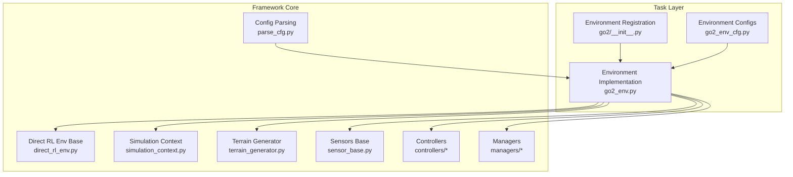
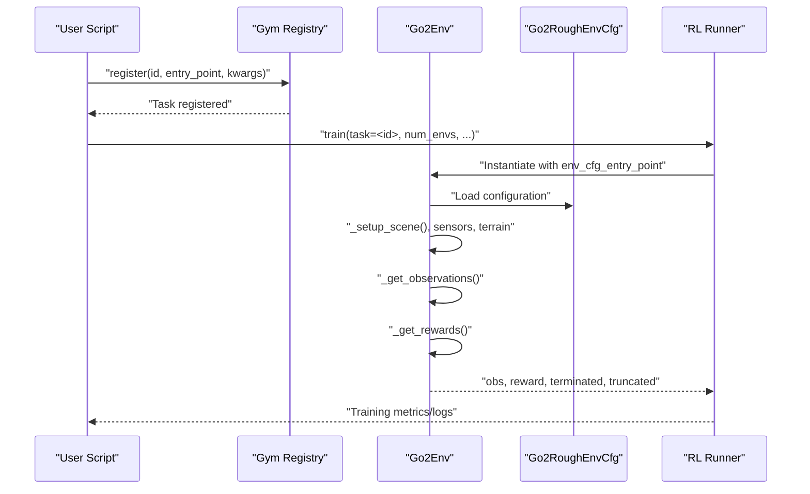
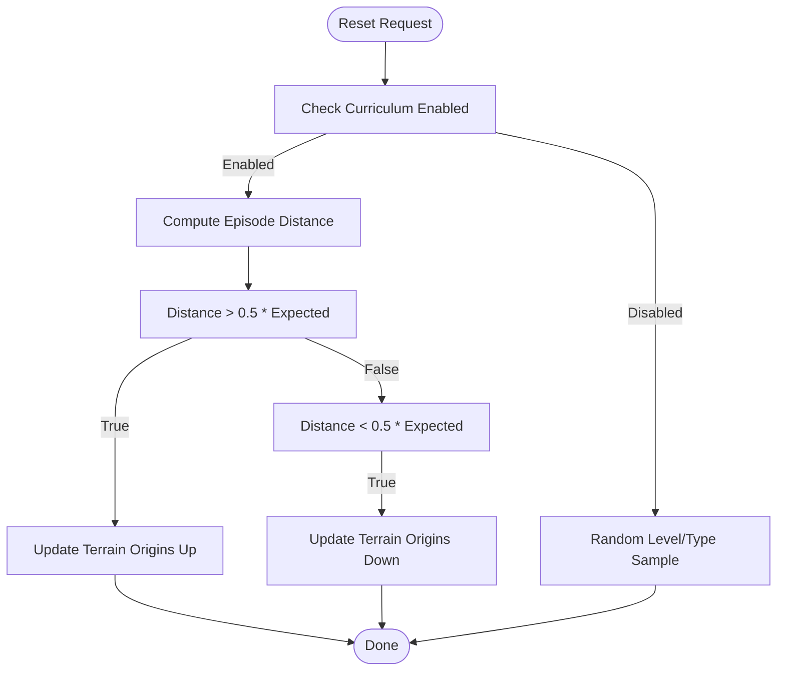
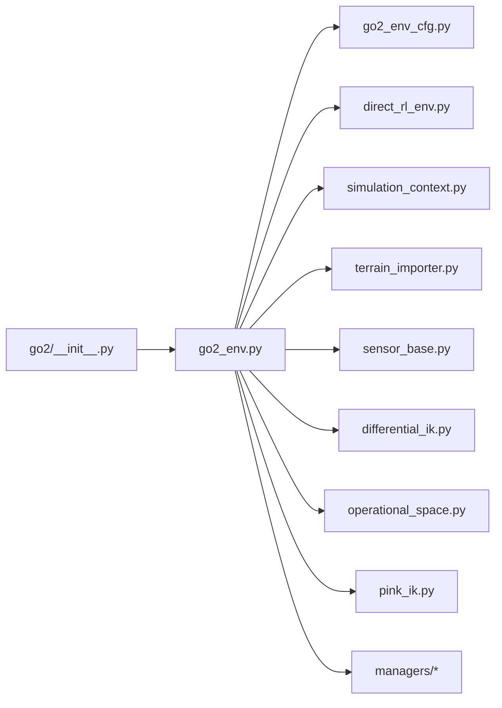

# API Reference

<cite>
**Referenced Files in This Document**
- [README.md](file://README.md)
- [__init__.py](file://source/isaaclab_tasks/isaaclab_tasks/direct/go2/__init__.py)
- [go2_env_cfg.py](file://source/isaaclab_tasks/isaaclab_tasks/direct/go2/go2_env_cfg.py)
- [go2_env.py](file://source/isaaclab_tasks/isaaclab_tasks/direct/go2/go2_env.py)
- [parse_cfg.py](file://source/isaaclab_tasks/isaaclab_tasks/utils/parse_cfg.py)
- [direct_rl_env.py](file://source/isaaclab/isaaclab/envs/direct_rl_env.py)
- [terrain_importer.py](file://source/isaaclab/isaaclab/terrains/terrain_importer.py)
- [sensor_base.py](file://source/isaaclab/isaaclab/sensors/sensor_base.py)
- [ray_caster.py](file://source/isaaclab/isaaclab/sensors/ray_caster/ray_caster.py)
- [contact_sensor.py](file://source/isaaclab/isaaclab/sensors/contact_sensor/contact_sensor.py)
- [imu.py](file://source/isaaclab/isaaclab/sensors/imu/imu.py)
- [frame_transformer.py](file://source/isaaclab/isaaclab/sensors/frame_transformer/frame_transformer.py)
- [differential_ik.py](file://source/isaaclab/isaaclab/controllers/differential_ik.py)
- [operational_space.py](file://source/isaaclab/isaaclab/controllers/operational_space.py)
- [pink_ik.py](file://source/isaaclab/isaaclab/controllers/pink_ik.py)
- [joint_impedance.py](file://source/isaaclab/isaaclab/controllers/joint_impedance.py)
- [rmp_flow.py](file://source/isaaclab/isaaclab/controllers/rmp_flow.py)
- [curriculum_manager.py](file://source/isaaclab/isaaclab/managers/curriculum_manager.py)
- [observation_manager.py](file://source/isaaclab/isaaclab/managers/observation_manager.py)
- [reward_manager.py](file://source/isaaclab/isaaclab/managers/reward_manager.py)
- [termination_manager.py](file://source/isaaclab/isaaclab/managers/termination_manager.py)
- [event_manager.py](file://source/isaaclab/isaaclab/managers/event_manager.py)
- [command_manager.py](file://source/isaaclab/isaaclab/managers/command_manager.py)
- [action_manager.py](file://source/isaaclab/isaaclab/managers/action_manager.py)
- [manager_base.py](file://source/isaaclab/isaaclab/managers/manager_base.py)
- [simulation_context.py](file://source/isaaclab/isaaclab/sim/simulation_context.py)
- [simulation_cfg.py](file://source/isaaclab/isaaclab/sim/simulation_cfg.py)
- [terrain_generator.py](file://source/isaaclab/isaaclab/terrains/terrain_generator.py)
- [terrain_generator_cfg.py](file://source/isaaclab/isaaclab/terrains/terrain_generator_cfg.py)
- [terrain_importer_cfg.py](file://source/isaaclab/isaaclab/terrains/terrain_importer_cfg.py)
- [sub_terrain_cfg.py](file://source/isaaclab/isaaclab/terrains/sub_terrain_cfg.py)
- [utils.py](file://source/isaaclab/isaaclab/terrains/utils.py)
- [quickstart.rst](file://docs/source/setup/quickstart.rst)
- [configuring_rl_training.rst](file://docs/source/tutorials/03_envs/configuring_rl_training.rst)
</cite>

## Table of Contents
1. [Introduction](#introduction)
2. [Project Structure](#project-structure)
3. [Core Components](#core-components)
4. [Architecture Overview](#architecture-overview)
5. [Detailed Component Analysis](#detailed-component-analysis)
6. [Dependency Analysis](#dependency-analysis)
7. [Performance Considerations](#performance-considerations)
8. [Troubleshooting Guide](#troubleshooting-guide)
9. [Conclusion](#conclusion)
10. [Appendices](#appendices)

## Introduction
This document provides comprehensive API documentation for the Extreme Quadruped Parkour framework. It covers environment registration, configuration management, training orchestration, task registration for five ablation variants, environment configuration classes, RL agent interfaces, sensor integration APIs, control system APIs, and terrain generation APIs. It also documents parameter specifications, return value semantics, error handling, validation rules, integration patterns, and versioning/migration guidance derived from the repository.

## Project Structure
The framework is organized around:
- Task registration and environment definitions under isaaclab_tasks
- Core framework APIs under source/isaaclab
- Documentation under docs/source
- Scripts for training and demos under scripts

**Diagram sources**
- [__init__.py:18-97](file://source/isaaclab_tasks/isaaclab_tasks/direct/go2/__init__.py#L18-L97)
- [go2_env_cfg.py:71-353](file://source/isaaclab_tasks/isaaclab_tasks/direct/go2/go2_env_cfg.py#L71-L353)
- [go2_env.py:20-120](file://source/isaaclab_tasks/isaaclab_tasks/direct/go2/go2_env.py#L20-L120)
- [parse_cfg.py:117-143](file://source/isaaclab_tasks/isaaclab_tasks/utils/parse_cfg.py#L117-L143)
- [direct_rl_env.py](file://source/isaaclab/isaaclab/envs/direct_rl_env.py)
- [simulation_context.py](file://source/isaaclab/isaaclab/sim/simulation_context.py)
- [terrain_generator.py](file://source/isaaclab/isaaclab/terrains/terrain_generator.py)
- [sensor_base.py](file://source/isaaclab/isaaclab/sensors/sensor_base.py)
- [differential_ik.py](file://source/isaaclab/isaaclab/controllers/differential_ik.py)
- [operational_space.py](file://source/isaaclab/isaaclab/controllers/operational_space.py)
- [pink_ik.py](file://source/isaaclab/isaaclab/controllers/pink_ik.py)
- [joint_impedance.py](file://source/isaaclab/isaaclab/controllers/joint_impedance.py)
- [rmp_flow.py](file://source/isaaclab/isaaclab/controllers/rmp_flow.py)
- [curriculum_manager.py](file://source/isaaclab/isaaclab/managers/curriculum_manager.py)
- [observation_manager.py](file://source/isaaclab/isaaclab/managers/observation_manager.py)
- [reward_manager.py](file://source/isaaclab/isaaclab/managers/reward_manager.py)
- [termination_manager.py](file://source/isaaclab/isaaclab/managers/termination_manager.py)
- [event_manager.py](file://source/isaaclab/isaaclab/managers/event_manager.py)
- [command_manager.py](file://source/isaaclab/isaaclab/managers/command_manager.py)
- [action_manager.py](file://source/isaaclab/isaaclab/managers/action_manager.py)
- [manager_base.py](file://source/isaaclab/isaaclab/managers/manager_base.py)

**Section sources**
- [README.md:44-50](file://README.md#L44-L50)
- [__init__.py:18-97](file://source/isaaclab_tasks/isaaclab_tasks/direct/go2/__init__.py#L18-L97)
- [go2_env_cfg.py:71-353](file://source/isaaclab_tasks/isaaclab_tasks/direct/go2/go2_env_cfg.py#L71-L353)
- [go2_env.py:20-120](file://source/isaaclab_tasks/isaaclab_tasks/direct/go2/go2_env.py#L20-L120)

## Core Components
- Environment Registration API: Registers Gym-compatible tasks with environment and agent configuration entry points.
- Configuration Management API: Provides configuration classes for environments, sensors, terrains, and managers.
- Training Orchestration API: Parses environment configurations and integrates with RL frameworks via entry points.
- Sensor Integration API: Ray caster, contact sensor, IMU, and frame transformer sensor interfaces.
- Control System API: Differential IK, operational space control, and PD-like control interfaces.
- Terrain Generation API: Procedural terrain generation, difficulty scaling, and curriculum management.

**Section sources**
- [__init__.py:18-97](file://source/isaaclab_tasks/isaaclab_tasks/direct/go2/__init__.py#L18-L97)
- [go2_env_cfg.py:71-353](file://source/isaaclab_tasks/isaaclab_tasks/direct/go2/go2_env_cfg.py#L71-L353)
- [parse_cfg.py:117-143](file://source/isaaclab_tasks/isaaclab_tasks/utils/parse_cfg.py#L117-L143)
- [quickstart.rst:185-220](file://docs/source/setup/quickstart.rst#L185-L220)
- [configuring_rl_training.rst:65-99](file://docs/source/tutorials/03_envs/configuring_rl_training.rst#L65-L99)

## Architecture Overview
The system follows a manager-based and direct RL environment workflow. Tasks are registered with Gym, and training scripts consume environment and agent configuration entry points. Sensors and controllers integrate into the environment lifecycle, while terrain generation and curriculum management adapt difficulty dynamically.

**Diagram sources**
- [__init__.py:18-97](file://source/isaaclab_tasks/isaaclab_tasks/direct/go2/__init__.py#L18-L97)
- [go2_env_cfg.py:173-314](file://source/isaaclab_tasks/isaaclab_tasks/direct/go2/go2_env_cfg.py#L173-L314)
- [go2_env.py:20-120](file://source/isaaclab_tasks/isaaclab_tasks/direct/go2/go2_env.py#L20-L120)
- [parse_cfg.py:117-143](file://source/isaaclab_tasks/isaaclab_tasks/utils/parse_cfg.py#L117-L143)
- [configuring_rl_training.rst:65-99](file://docs/source/tutorials/03_envs/configuring_rl_training.rst#L65-L99)

## Detailed Component Analysis

### Environment Registration API
- Purpose: Register Gym environments with environment and RL agent configuration entry points.
- Public API:
  - gym.register with id, entry_point, disable_env_checker, kwargs including env_cfg_entry_point and rsl_rl_cfg_entry_point.
- Task IDs:
  - Go2-Rough-Direct-v0, Go2-Rough-Direct-Play-v0
  - Abl variants: Go2-Rough-Direct-Abl1-v0, Go2-Rough-Direct-Abl2_5-v0, Go2-Rough-Direct-Abl3_5-v0, Go2-Rough-Direct-Abl4_0-v0, Go2-Rough-Direct-Abl7_0-v0
  - Play variants for each ablation.
- Parameters:
  - id: String task identifier.
  - entry_point: Path to environment class.
  - env_cfg_entry_point: Path to environment configuration class.
  - rsl_rl_cfg_entry_point: Path to RL runner configuration class.
- Return value: None (side effect: registers task).
- Validation rules:
  - env_cfg_entry_point must resolve to a class.
  - rsl_rl_cfg_entry_point must resolve to a class.
- Error handling:
  - Raises runtime error if configuration is not a class.
- Usage example:
  - See quickstart and configuring_rl_training tutorials for registering tasks and loading RL runner configs.

**Section sources**
- [__init__.py:18-97](file://source/isaaclab_tasks/isaaclab_tasks/direct/go2/__init__.py#L18-L97)
- [quickstart.rst:185-220](file://docs/source/setup/quickstart.rst#L185-L220)
- [configuring_rl_training.rst:65-99](file://docs/source/tutorials/03_envs/configuring_rl_training.rst#L65-L99)
- [parse_cfg.py:117-143](file://source/isaaclab_tasks/isaaclab_tasks/utils/parse_cfg.py#L117-L143)

### Configuration Management API
- Environment configuration classes:
  - Go2FlatEnvCfg: Flat terrain baseline with proprioceptive observations.
  - Go2RoughEnvCfg: Rough terrain with ray caster scan, privileged observations, curriculum, and command settings.
  - Go2RoughPlayEnvCfg: Evaluation configuration with curriculum disabled and fixed commands.
  - Go2RoughAbl1EnvCfg, Go2RoughAbl2_5EnvCfg, and Play variants: Ablation-specific toggles for scan usage and ordering.
- Sensor configurations:
  - ContactSensorCfg: Tracks foot contacts and air time.
  - RayCasterCfg: Height scanner grid pattern for scan observations.
- Terrain configurations:
  - TerrainImporterCfg: Plane or procedural generator with sub-terrain mix.
  - Sub-terrain configurations: boxes, random_rough, debris_field, gap_bar, hurdle_strip, stairs_strip, parkour_step.
- Manager configurations:
  - Event terms for domain randomization.
  - Command and curriculum settings.
- Parameters:
  - Observation spaces: num_prop_obs, num_priv_obs, num_scan_obs, use_scan_in_policy/use_scan_in_critic, scan_first_in_policy/scan_first_in_critic.
  - Reward scales and penalties.
  - Command modes: random/fixed, heading control flags, resampling intervals.
- Return value: Configuration instances for environment initialization.
- Validation rules:
  - Observation space computed post-init based on scan usage.
  - Terrain generator parameters validated by sub-terrain configs.
- Error handling:
  - Post-init computes observation/state spaces; missing attributes handled by getattr defaults.

**Section sources**
- [go2_env_cfg.py:71-353](file://source/isaaclab_tasks/isaaclab_tasks/direct/go2/go2_env_cfg.py#L71-L353)

### Training Orchestration API
- Configuration parsing:
  - parse_env_cfg(task_name, device, num_envs, use_fabric) returns environment configuration instance.
  - Validates that configuration is a class, raises error otherwise.
- RL integration:
  - Training scripts read RL runner configuration entry points from kwargs.
- Parameters:
  - task_name: Registered Gym task identifier.
  - device: Target device string.
  - num_envs: Number of environments.
  - use_fabric: Boolean to enable fabric interface.
- Return value:
  - ManagerBasedRLEnvCfg or DirectRLEnvCfg depending on registry.
- Validation rules:
  - Configuration must be a class; dict is rejected.
- Error handling:
  - RuntimeError raised if configuration is not a class.

**Section sources**
- [parse_cfg.py:117-143](file://source/isaaclab_tasks/isaaclab_tasks/utils/parse_cfg.py#L117-L143)
- [configuring_rl_training.rst:65-99](file://docs/source/tutorials/03_envs/configuring_rl_training.rst#L65-L99)

### Sensor Integration API
- Ray Caster Configuration:
  - RayCasterCfg with prim_path, offset, ray_alignment, pattern_cfg (GridPatternCfg), mesh_prim_paths, debug_vis.
  - Used to generate height scan observations in rough terrain.
- Contact Sensor Setup:
  - ContactSensorCfg with prim_path, history_length, update_period, track_air_time.
  - Provides foot contact flags and air-time statistics.
- IMU Data Processing:
  - IMU sensor base class and configuration; supports IMU data retrieval and transformations.
- Frame Transformer Sensor:
  - FrameTransformer sensor for coordinate transforms and sensor fusion.
- Parameters:
  - Pattern resolution and size for ray casting grid.
  - History length and update period for contact sensor.
  - Prim paths for robot base and ground mesh.
- Return value:
  - Sensor data structures for integration into environment observations and controls.
- Validation rules:
  - Sensor prim paths must match spawned robot and terrain meshes.
- Error handling:
  - Sensor data access guarded by sensor presence checks.

**Section sources**
- [go2_env_cfg.py:269-277](file://source/isaaclab_tasks/isaaclab_tasks/direct/go2/go2_env_cfg.py#L269-L277)
- [go2_env.py:293-355](file://source/isaaclab_tasks/isaaclab_tasks/direct/go2/go2_env.py#L293-L355)
- [sensor_base.py](file://source/isaaclab/isaaclab/sensors/sensor_base.py)
- [ray_caster.py](file://source/isaaclab/isaaclab/sensors/ray_caster/ray_caster.py)
- [contact_sensor.py](file://source/isaaclab/isaaclab/sensors/contact_sensor/contact_sensor.py)
- [imu.py](file://source/isaaclab/isaaclab/sensors/imu/imu.py)
- [frame_transformer.py](file://source/isaaclab/isaaclab/sensors/frame_transformer/frame_transformer.py)

### Control System API
- Inverse Kinematics:
  - Differential IK: differential_ik.py
  - Pink IK: pink_ik.py with configuration pink_ik_cfg.py
- Operational Space Control:
  - operational_space.py with operational_space_cfg.py
- PD Controller Interfaces:
  - PD actuator models and PD-like control logic integrated via environment action processing.
- Parameters:
  - IK joint limits, gains, and task-space targets.
  - OSC damping, stiffness, and desired pose.
  - PD gains for joint control.
- Return value:
  - Joint position targets or forces applied to robot actuators.
- Validation rules:
  - Joint indices and body frames resolved via sensor/robot utilities.
- Error handling:
  - Control targets clipped to safe ranges; errors logged for invalid configurations.

**Section sources**
- [differential_ik.py](file://source/isaaclab/isaaclab/controllers/differential_ik.py)
- [pink_ik.py](file://source/isaaclab/isaaclab/controllers/pink_ik.py)
- [operational_space.py](file://source/isaaclab/isaaclab/controllers/operational_space.py)
- [joint_impedance.py](file://source/isaaclab/isaaclab/controllers/joint_impedance.py)
- [rmp_flow.py](file://source/isaaclab/isaaclab/controllers/rmp_flow.py)

### Terrain Generation API
- Procedural Terrain Creation:
  - TerrainImporterCfg with terrain_type "generator" and terrain_generator configuration.
  - Sub-terrain mix: boxes, random_rough, debris_field, gap_bar, hurdle_strip, stairs_strip, parkour_step.
- Difficulty Scaling and Curriculum:
  - Curriculum updates via update_env_origins based on achieved distance and command speed.
  - Curriculum disabled mode samples random terrain levels and types per reset.
- Parameters:
  - Generator size, rows/columns, sub-terrain proportions and ranges.
  - Max initial terrain level, curriculum flags, seed for deterministic evaluation.
- Return value:
  - Updated terrain origins and levels per environment.
- Validation rules:
  - Terrain levels and types constrained to valid ranges.
- Error handling:
  - Falls back to environment origin when terrain levels unavailable.

**Diagram sources**
- [go2_env.py:473-526](file://source/isaaclab_tasks/isaaclab_tasks/direct/go2/go2_env.py#L473-L526)
- [terrain_importer.py](file://source/isaaclab/isaaclab/terrains/terrain_importer.py)

**Section sources**
- [go2_env_cfg.py:191-267](file://source/isaaclab_tasks/isaaclab_tasks/direct/go2/go2_env_cfg.py#L191-L267)
- [go2_env.py:473-526](file://source/isaaclab_tasks/isaaclab_tasks/direct/go2/go2_env.py#L473-L526)
- [terrain_generator.py](file://source/isaaclab/isaaclab/terrains/terrain_generator.py)
- [terrain_generator_cfg.py](file://source/isaaclab/isaaclab/terrains/terrain_generator_cfg.py)
- [terrain_importer_cfg.py](file://source/isaaclab/isaaclab/terrains/terrain_importer_cfg.py)
- [sub_terrain_cfg.py](file://source/isaaclab/isaaclab/terrains/sub_terrain_cfg.py)
- [utils.py](file://source/isaaclab/isaaclab/terrains/utils.py)

### Environment Lifecycle and Managers
- Observation, Reward, Termination, and Event Managers:
  - observation_manager.py, reward_manager.py, termination_manager.py, event_manager.py.
- Command and Action Managers:
  - command_manager.py, action_manager.py.
- Curriculum Manager:
  - curriculum_manager.py.
- Manager Base:
  - manager_base.py.
- Parameters:
  - Manager configurations define how observations are composed, rewards computed, terminations evaluated, and curriculum progresses.
- Return value:
  - Integrated environment behavior with modular components.
- Validation rules:
  - Managers operate on environment tensors and sensor data; validated by environment lifecycle.
- Error handling:
  - Managers rely on environment state availability; errors surfaced via environment logging.

**Section sources**
- [observation_manager.py](file://source/isaaclab/isaaclab/managers/observation_manager.py)
- [reward_manager.py](file://source/isaaclab/isaaclab/managers/reward_manager.py)
- [termination_manager.py](file://source/isaaclab/isaaclab/managers/termination_manager.py)
- [event_manager.py](file://source/isaaclab/isaaclab/managers/event_manager.py)
- [command_manager.py](file://source/isaaclab/isaaclab/managers/command_manager.py)
- [action_manager.py](file://source/isaaclab/isaaclab/managers/action_manager.py)
- [curriculum_manager.py](file://source/isaaclab/isaaclab/managers/curriculum_manager.py)
- [manager_base.py](file://source/isaaclab/isaaclab/managers/manager_base.py)

### Simulation and Context APIs
- Simulation Context:
  - simulation_context.py manages simulation lifecycle and device selection.
- Simulation Configuration:
  - simulation_cfg.py defines dt, render_interval, and physics material settings.
- Parameters:
  - Physics material combine modes, friction/dynamic friction values.
  - Render interval and decimation for performance.
- Return value:
  - Initialized simulation context for environment rendering and stepping.
- Validation rules:
  - Device and fabric interface toggles validated by context.
- Error handling:
  - Context errors propagated to environment initialization.

**Section sources**
- [simulation_context.py](file://source/isaaclab/isaaclab/sim/simulation_context.py)
- [simulation_cfg.py](file://source/isaaclab/isaaclab/sim/simulation_cfg.py)
- [go2_env_cfg.py:87-98](file://source/isaaclab_tasks/isaaclab_tasks/direct/go2/go2_env_cfg.py#L87-L98)

## Dependency Analysis

**Diagram sources**
- [__init__.py:18-97](file://source/isaaclab_tasks/isaaclab_tasks/direct/go2/__init__.py#L18-L97)
- [go2_env.py:20-120](file://source/isaaclab_tasks/isaaclab_tasks/direct/go2/go2_env.py#L20-L120)
- [go2_env_cfg.py:71-353](file://source/isaaclab_tasks/isaaclab_tasks/direct/go2/go2_env_cfg.py#L71-L353)
- [direct_rl_env.py](file://source/isaaclab/isaaclab/envs/direct_rl_env.py)
- [simulation_context.py](file://source/isaaclab/isaaclab/sim/simulation_context.py)
- [terrain_importer.py](file://source/isaaclab/isaaclab/terrains/terrain_importer.py)
- [sensor_base.py](file://source/isaaclab/isaaclab/sensors/sensor_base.py)
- [differential_ik.py](file://source/isaaclab/isaaclab/controllers/differential_ik.py)
- [operational_space.py](file://source/isaaclab/isaaclab/controllers/operational_space.py)
- [pink_ik.py](file://source/isaaclab/isaaclab/controllers/pink_ik.py)
- [curriculum_manager.py](file://source/isaaclab/isaaclab/managers/curriculum_manager.py)

**Section sources**
- [__init__.py:18-97](file://source/isaaclab_tasks/isaaclab_tasks/direct/go2/__init__.py#L18-L97)
- [go2_env.py:20-120](file://source/isaaclab_tasks/isaaclab_tasks/direct/go2/go2_env.py#L20-L120)
- [go2_env_cfg.py:71-353](file://source/isaaclab_tasks/isaaclab_tasks/direct/go2/go2_env_cfg.py#L71-L353)

## Performance Considerations
- Observation composition:
  - Scan-first ordering reduces concatenation overhead when scans are large.
- Simulation settings:
  - GPU rigid patch count increased for large-scale environments.
  - Fabric interface toggle affects read/write performance.
- Rendering and physics:
  - Decimation and render_interval balance fidelity and throughput.
- Curriculum:
  - Spreading resets avoids synchronization spikes.

[No sources needed since this section provides general guidance]

## Troubleshooting Guide
- Configuration class errors:
  - Ensure env_cfg_entry_point and rsl_rl_cfg_entry_point resolve to classes, not dicts.
- Sensor prim paths:
  - Verify ray caster and contact sensor prim paths match robot and terrain meshes.
- Curriculum issues:
  - Confirm terrain origins and levels are initialized before curriculum updates.
- Command mode mismatches:
  - Fixed vs random command modes must align with environment configuration flags.

**Section sources**
- [parse_cfg.py:133-143](file://source/isaaclab_tasks/isaaclab_tasks/utils/parse_cfg.py#L133-L143)
- [go2_env.py:473-526](file://source/isaaclab_tasks/isaaclab_tasks/direct/go2/go2_env.py#L473-L526)

## Conclusion
This API reference documents the Extreme Quadruped Parkour framework’s environment registration, configuration management, training orchestration, sensor integration, control interfaces, and terrain generation. It provides parameter specifications, return semantics, validation rules, error handling, and integration patterns. The ablation variants demonstrate flexible observation and reward designs suitable for comparative studies.

[No sources needed since this section summarizes without analyzing specific files]

## Appendices

### API Versioning and Migration
- Versioning:
  - Extension metadata and version are loaded from extension.toml.
- Migration:
  - Review changelog and migration guides in docs for breaking changes between versions.
- Backward compatibility:
  - Prefer using configuration entry points as strings to avoid import-time slowdowns.
  - Maintain consistent task IDs and configuration class signatures across updates.

**Section sources**
- [README.md:30-42](file://README.md#L30-L42)
- [__init__.py:15-20](file://source/isaaclab/isaaclab/__init__.py#L15-L20)
- [quickstart.rst:185-220](file://docs/source/setup/quickstart.rst#L185-L220)