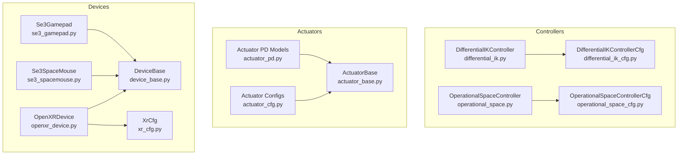
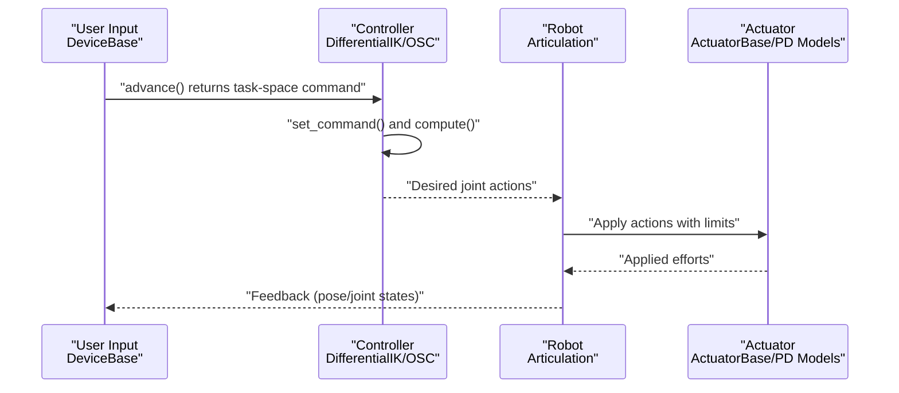
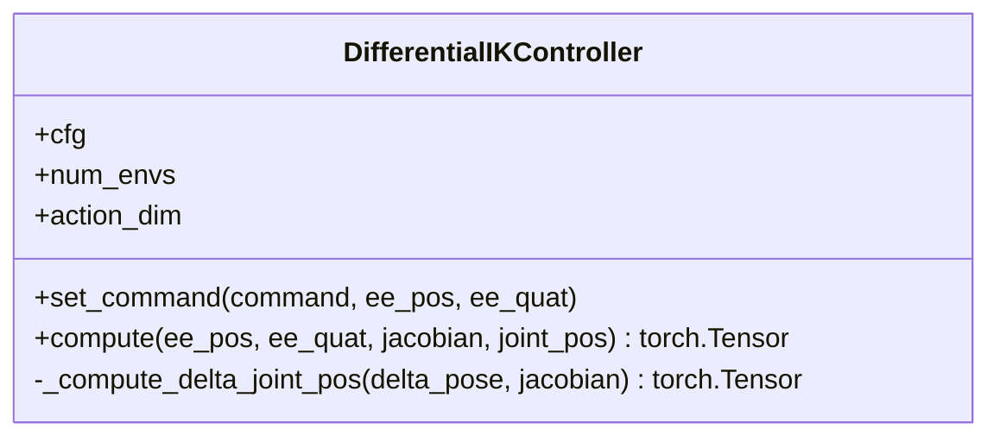
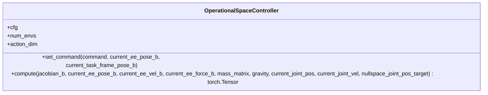
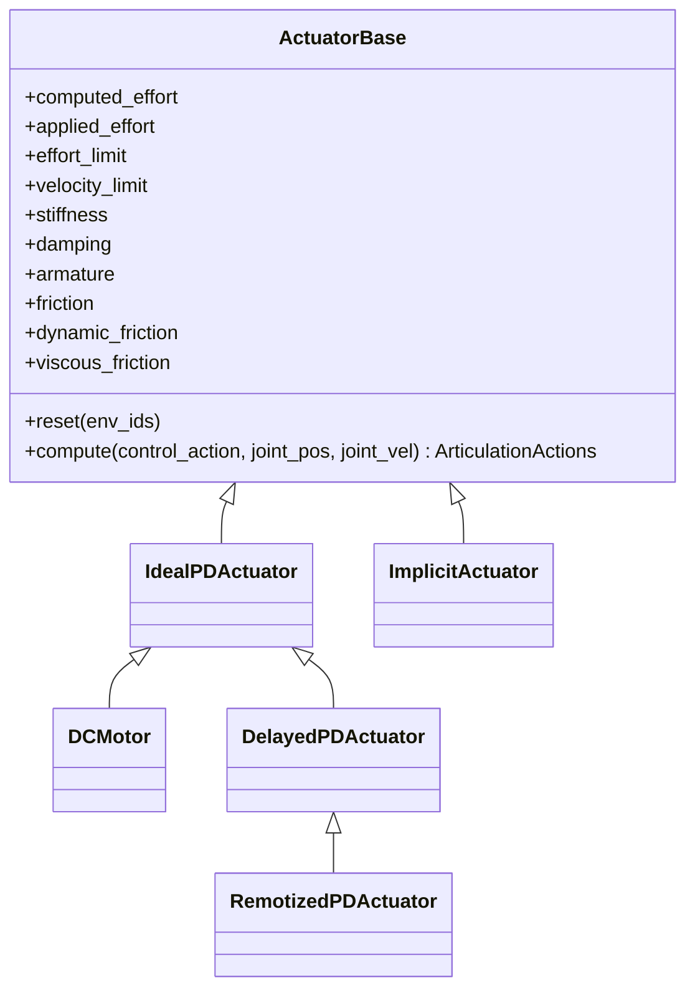
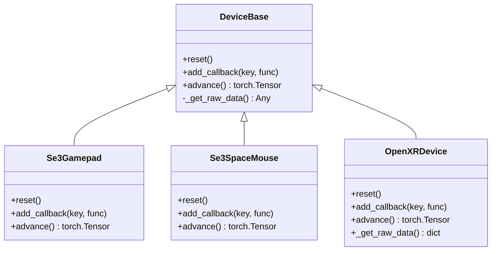
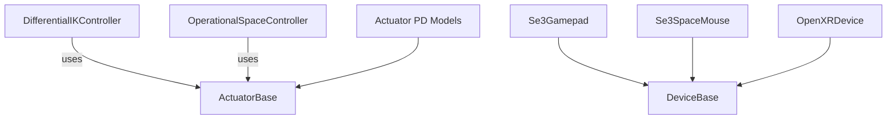

# Control System API

<cite>
**Referenced Files in This Document**
- [controllers/__init__.py](file://source/isaaclab/isaaclab/controllers/__init__.py)
- [controllers/differential_ik.py](file://source/isaaclab/isaaclab/controllers/differential_ik.py)
- [controllers/differential_ik_cfg.py](file://source/isaaclab/isaaclab/controllers/differential_ik_cfg.py)
- [controllers/operational_space.py](file://source/isaaclab/isaaclab/controllers/operational_space.py)
- [controllers/operational_space_cfg.py](file://source/isaaclab/isaaclab/controllers/operational_space_cfg.py)
- [controllers/utils.py](file://source/isaaclab/isaaclab/controllers/utils.py)
- [actuators/__init__.py](file://source/isaaclab/isaaclab/actuators/__init__.py)
- [actuators/actuator_base.py](file://source/isaaclab/isaaclab/actuators/actuator_base.py)
- [actuators/actuator_cfg.py](file://source/isaaclab/isaaclab/actuators/actuator_cfg.py)
- [actuators/actuator_pd.py](file://source/isaaclab/isaaclab/actuators/actuator_pd.py)
- [devices/__init__.py](file://source/isaaclab/isaaclab/devices/__init__.py)
- [devices/device_base.py](file://source/isaaclab/isaaclab/devices/device_base.py)
- [devices/openxr/openxr_device.py](file://source/isaaclab/isaaclab/devices/openxr/openxr_device.py)
- [devices/openxr/xr_cfg.py](file://source/isaaclab/isaaclab/devices/openxr/xr_cfg.py)
- [devices/gamepad/se3_gamepad.py](file://source/isaaclab/isaaclab/devices/gamepad/se3_gamepad.py)
- [devices/spacemouse/se3_spacemouse.py](file://source/isaaclab/isaaclab/devices/spacemouse/se3_spacemouse.py)
</cite>

## Table of Contents
1. [Introduction](#introduction)
2. [Project Structure](#project-structure)
3. [Core Components](#core-components)
4. [Architecture Overview](#architecture-overview)
5. [Detailed Component Analysis](#detailed-component-analysis)
6. [Dependency Analysis](#dependency-analysis)
7. [Performance Considerations](#performance-considerations)
8. [Troubleshooting Guide](#troubleshooting-guide)
9. [Conclusion](#conclusion)
10. [Appendices](#appendices)

## Introduction
This document provides comprehensive API documentation for the control system interfaces in the project. It covers:
- Controller base classes and configuration for differential inverse kinematics and operational space control
- Actuator system APIs including motor models, PD control gains, and torque/velocity limits
- Device integration APIs for teleoperation via gamepad, spacemouse, and XR devices
- Inverse kinematics solver interfaces, task-space control implementations, and stability-related configuration
- Control command generation, action mapping, and safety constraint enforcement
- Configuration specifications for control parameters, gain scheduling, and dynamic limits
- Examples of custom controller implementation, device calibration, and control system integration
- Control validation, stability analysis, and real-time performance considerations

## Project Structure
The control system is organized into three primary subsystems:
- Controllers: Differential IK and Operational Space Control with configuration classes
- Actuators: Base actuator model and concrete implementations (implicit/explicit)
- Devices: Teleoperation interfaces for gamepad, spacemouse, and XR

**Diagram sources**
- [controllers/differential_ik.py](file://source/isaaclab/isaaclab/controllers/differential_ik.py)
- [controllers/operational_space.py](file://source/isaaclab/isaaclab/controllers/operational_space.py)
- [controllers/differential_ik_cfg.py](file://source/isaaclab/isaaclab/controllers/differential_ik_cfg.py)
- [controllers/operational_space_cfg.py](file://source/isaaclab/isaaclab/controllers/operational_space_cfg.py)
- [actuators/actuator_base.py](file://source/isaaclab/isaaclab/actuators/actuator_base.py)
- [actuators/actuator_pd.py](file://source/isaaclab/isaaclab/actuators/actuator_pd.py)
- [actuators/actuator_cfg.py](file://source/isaaclab/isaaclab/actuators/actuator_cfg.py)
- [devices/device_base.py](file://source/isaaclab/isaaclab/devices/device_base.py)
- [devices/gamepad/se3_gamepad.py](file://source/isaaclab/isaaclab/devices/gamepad/se3_gamepad.py)
- [devices/spacemouse/se3_spacemouse.py](file://source/isaaclab/isaaclab/devices/spacemouse/se3_spacemouse.py)
- [devices/openxr/openxr_device.py](file://source/isaaclab/isaaclab/devices/openxr/openxr_device.py)
- [devices/openxr/xr_cfg.py](file://source/isaaclab/isaaclab/devices/openxr/xr_cfg.py)

**Section sources**
- [controllers/__init__.py](file://source/isaaclab/isaaclab/controllers/__init__.py)
- [actuators/__init__.py](file://source/isaaclab/isaaclab/actuators/__init__.py)
- [devices/__init__.py](file://source/isaaclab/isaaclab/devices/__init__.py)

## Core Components
This section documents the core control system APIs and their responsibilities.

- Differential IK Controller
  - Purpose: Computes desired joint positions from task-space commands using Jacobian-based methods
  - Key methods: set_command, compute
  - Supported IK methods: pseudo-inverse, adaptive SVD, transpose, damped least squares
  - Command types: position or pose (absolute or relative)
- Operational Space Controller
  - Purpose: Implements task-space control with motion and wrench control, gravity compensation, and null-space control
  - Key methods: set_command, compute
  - Features: selection matrices, variable stiffness/damping, inertial decoupling, contact force control
- Actuator Base and Models
  - Purpose: Model actuator dynamics and enforce torque/velocity limits
  - Types: implicit (simulation handles PD), explicit PD, DC motor, delayed PD, remotized PD
  - Parameters: stiffness, damping, effort/velocity limits, armature, friction, viscous friction
- Device Interfaces
  - Purpose: Provide teleoperation inputs for SE(3) control and gripper commands
  - Devices: gamepad, spacemouse, OpenXR
  - Methods: reset, add_callback, advance

**Section sources**
- [controllers/differential_ik.py](file://source/isaaclab/isaaclab/controllers/differential_ik.py)
- [controllers/operational_space.py](file://source/isaaclab/isaaclab/controllers/operational_space.py)
- [actuators/actuator_base.py](file://source/isaaclab/isaaclab/actuators/actuator_base.py)
- [actuators/actuator_pd.py](file://source/isaaclab/isaaclab/actuators/actuator_pd.py)
- [devices/device_base.py](file://source/isaaclab/isaaclab/devices/device_base.py)
- [devices/gamepad/se3_gamepad.py](file://source/isaaclab/isaaclab/devices/gamepad/se3_gamepad.py)
- [devices/spacemouse/se3_spacemouse.py](file://source/isaaclab/isaaclab/devices/spacemouse/se3_spacemouse.py)
- [devices/openxr/openxr_device.py](file://source/isaaclab/isaaclab/devices/openxr/openxr_device.py)

## Architecture Overview
The control system integrates device inputs, controllers, and actuators to produce joint commands for the robot.

**Diagram sources**
- [devices/device_base.py](file://source/isaaclab/isaaclab/devices/device_base.py)
- [controllers/differential_ik.py](file://source/isaaclab/isaaclab/controllers/differential_ik.py)
- [controllers/operational_space.py](file://source/isaaclab/isaaclab/controllers/operational_space.py)
- [actuators/actuator_base.py](file://source/isaaclab/isaaclab/actuators/actuator_base.py)
- [actuators/actuator_pd.py](file://source/isaaclab/isaaclab/actuators/actuator_pd.py)

## Detailed Component Analysis

### Differential IK Controller
The Differential IK Controller maps task-space commands to joint positions using Jacobian-based methods. It supports absolute and relative modes for position and pose commands and exposes multiple inversion strategies.

Key capabilities:
- Command types: position or pose
- Relative mode: treat commands as deltas
- IK methods: pseudo-inverse, SVD, transpose, damped least squares
- Safety: raises errors for unsupported configurations and missing inputs

**Diagram sources**
- [controllers/differential_ik.py](file://source/isaaclab/isaaclab/controllers/differential_ik.py)

**Section sources**
- [controllers/differential_ik.py](file://source/isaaclab/isaaclab/controllers/differential_ik.py)
- [controllers/differential_ik_cfg.py](file://source/isaaclab/isaaclab/controllers/differential_ik_cfg.py)

### Operational Space Controller
The Operational Space Controller implements task-space control with configurable motion and wrench control axes, inertial decoupling, gravity compensation, and null-space control for redundant manipulators.

Key capabilities:
- Target types: pose absolute/relative, wrench absolute
- Selection matrices per axis
- Variable stiffness/damping (fixed, variable_kp, variable)
- Inertial decoupling: full or partial
- Contact wrench control with feedback
- Null-space control: position-driven with stiffness/damping

**Diagram sources**
- [controllers/operational_space.py](file://source/isaaclab/isaaclab/controllers/operational_space.py)

**Section sources**
- [controllers/operational_space.py](file://source/isaaclab/isaaclab/controllers/operational_space.py)
- [controllers/operational_space_cfg.py](file://source/isaaclab/isaaclab/controllers/operational_space_cfg.py)

### Actuator System APIs
The actuator system models motor dynamics and enforces safety limits. It distinguishes between implicit and explicit models.

- ActuatorBase
  - Buffers: computed/applied effort, effort/velocity limits, stiffness/damping, armature, friction
  - Methods: reset, compute, parameter parsing, clipping
- Explicit Models
  - IdealPDActuator: PD control with saturation
  - DCMotor: torque-speed curve with velocity-dependent limits
  - DelayedPDActuator: command delay via buffers
  - RemotizedPDActuator: angle-dependent torque limits via lookup table
- Implicit Model
  - ImplicitActuator: delegates PD control to simulation; approximates torques

**Diagram sources**
- [actuators/actuator_base.py](file://source/isaaclab/isaaclab/actuators/actuator_base.py)
- [actuators/actuator_pd.py](file://source/isaaclab/isaaclab/actuators/actuator_pd.py)

**Section sources**
- [actuators/actuator_base.py](file://source/isaaclab/isaaclab/actuators/actuator_base.py)
- [actuators/actuator_pd.py](file://source/isaaclab/isaaclab/actuators/actuator_pd.py)
- [actuators/actuator_cfg.py](file://source/isaaclab/isaaclab/actuators/actuator_cfg.py)

### Device Integration APIs
Teleoperation devices provide SE(3) commands and gripper actions to the control system.

- DeviceBase
  - Methods: reset, add_callback, advance
  - Supports retargeters for transforming raw inputs to robot commands
- Se3Gamepad
  - Inputs: sticks, D-pad, X button for gripper
  - Outputs: 6D delta pose + gripper command
- Se3SpaceMouse
  - Inputs: HID device axes/buttons
  - Outputs: 6D delta pose + gripper command
- OpenXRDevice
  - Tracks left/right hand/head joints
  - Provides raw tracking data or retargeted commands
  - Callbacks: START, STOP, RESET

**Diagram sources**
- [devices/device_base.py](file://source/isaaclab/isaaclab/devices/device_base.py)
- [devices/gamepad/se3_gamepad.py](file://source/isaaclab/isaaclab/devices/gamepad/se3_gamepad.py)
- [devices/spacemouse/se3_spacemouse.py](file://source/isaaclab/isaaclab/devices/spacemouse/se3_spacemouse.py)
- [devices/openxr/openxr_device.py](file://source/isaaclab/isaaclab/devices/openxr/openxr_device.py)

**Section sources**
- [devices/device_base.py](file://source/isaaclab/isaaclab/devices/device_base.py)
- [devices/gamepad/se3_gamepad.py](file://source/isaaclab/isaaclab/devices/gamepad/se3_gamepad.py)
- [devices/spacemouse/se3_spacemouse.py](file://source/isaaclab/isaaclab/devices/spacemouse/se3_spacemouse.py)
- [devices/openxr/openxr_device.py](file://source/isaaclab/isaaclab/devices/openxr/openxr_device.py)
- [devices/openxr/xr_cfg.py](file://source/isaaclab/isaaclab/devices/openxr/xr_cfg.py)

## Dependency Analysis
This section outlines dependencies among major components.

**Diagram sources**
- [controllers/differential_ik.py](file://source/isaaclab/isaaclab/controllers/differential_ik.py)
- [controllers/operational_space.py](file://source/isaaclab/isaaclab/controllers/operational_space.py)
- [actuators/actuator_base.py](file://source/isaaclab/isaaclab/actuators/actuator_base.py)
- [actuators/actuator_pd.py](file://source/isaaclab/isaaclab/actuators/actuator_pd.py)
- [devices/device_base.py](file://source/isaaclab/isaaclab/devices/device_base.py)
- [devices/gamepad/se3_gamepad.py](file://source/isaaclab/isaaclab/devices/gamepad/se3_gamepad.py)
- [devices/spacemouse/se3_spacemouse.py](file://source/isaaclab/isaaclab/devices/spacemouse/se3_spacemouse.py)
- [devices/openxr/openxr_device.py](file://source/isaaclab/isaaclab/devices/openxr/openxr_device.py)

**Section sources**
- [controllers/__init__.py](file://source/isaaclab/isaaclab/controllers/__init__.py)
- [actuators/__init__.py](file://source/isaaclab/isaaclab/actuators/__init__.py)
- [devices/__init__.py](file://source/isaaclab/isaaclab/devices/__init__.py)

## Performance Considerations
- Real-time constraints
  - Device polling and retargeting should be lightweight to maintain control loop cadence
  - Avoid heavy computations in device event handlers; defer to advance()
- Numerical stability
  - Use appropriate IK inversion methods (e.g., damped least squares) near singularities
  - Limit stiffness/damping gains to prevent oscillations; leverage damping ratio scheduling
- Actuator modeling
  - Explicit models introduce computational overhead; choose implicit for simpler PD control
  - Use velocity-dependent torque limits (DCMotor) to avoid unrealistic torque spikes
- Memory and tensor shapes
  - Keep tensors contiguous and aligned with batch dimension for GPU efficiency
  - Reuse buffers (e.g., selection matrices) to minimize allocations

[No sources needed since this section provides general guidance]

## Troubleshooting Guide
Common issues and resolutions:
- Unsupported IK method or command type
  - Ensure configuration values match supported enumerations
- Missing inputs for relative commands
  - Provide current end-effector pose/position when using relative modes
- Null-space control for non-redundant systems
  - Verify degrees of freedom exceed 6 for null-space control
- Inertial decoupling requirements
  - Supply mass matrix when enabling inertial dynamics decoupling
- Actuator limit mismatches
  - For implicit actuators, set effort_limit_sim; for explicit actuators, ensure effort_limit is sufficient
- Device initialization failures
  - Verify device connectivity and permissions; handle exceptions during device discovery

**Section sources**
- [controllers/differential_ik.py](file://source/isaaclab/isaaclab/controllers/differential_ik.py)
- [controllers/operational_space.py](file://source/isaaclab/isaaclab/controllers/operational_space.py)
- [actuators/actuator_pd.py](file://source/isaaclab/isaaclab/actuators/actuator_pd.py)
- [devices/gamepad/se3_gamepad.py](file://source/isaaclab/isaaclab/devices/gamepad/se3_gamepad.py)
- [devices/spacemouse/se3_spacemouse.py](file://source/isaaclab/isaaclab/devices/spacemouse/se3_spacemouse.py)
- [devices/openxr/openxr_device.py](file://source/isaaclab/isaaclab/devices/openxr/openxr_device.py)

## Conclusion
The control system provides a modular framework for task-space control, actuator modeling, and teleoperation. By leveraging configurable controllers, robust actuator models, and flexible device interfaces, developers can implement stable and responsive control policies. Proper configuration of gains, limits, and inversion strategies ensures reliable performance across diverse robotic platforms.

[No sources needed since this section summarizes without analyzing specific files]

## Appendices

### Configuration Specifications
- Differential IK Controller
  - command_type: "position" or "pose"
  - use_relative_mode: bool
  - ik_method: "pinv", "svd", "trans", "dls"
  - ik_params: method-specific parameters (scaling, damping, thresholds)
- Operational Space Controller
  - target_types: combinations of "pose_abs", "pose_rel", "wrench_abs"
  - motion_control_axes_task: per-axis selection mask
  - contact_wrench_control_axes_task: per-axis selection mask
  - inertial_dynamics_decoupling: enable inverse dynamics decoupling
  - partial_inertial_dynamics_decoupling: ignore translational/rotational coupling
  - gravity_compensation: enable gravity vector compensation
  - impedance_mode: "fixed", "variable_kp", "variable"
  - motion_stiffness_task, motion_damping_ratio_task: gains and ratios
  - motion_stiffness_limits_task, motion_damping_ratio_limits_task: clipping ranges
  - contact_wrench_stiffness_task: optional closed-loop force gains
  - nullspace_control: "none" or "position"
  - nullspace_stiffness, nullspace_damping_ratio: null-space PD gains
- Actuator Configurations
  - ActuatorBaseCfg: joint_names_expr, effort_limit, velocity_limit, effort_limit_sim, velocity_limit_sim, stiffness, damping, armature, friction, dynamic_friction, viscous_friction
  - IdealPDActuatorCfg: inherits base
  - DCMotorCfg: saturation_effort
  - ActuatorNetLSTMCfg/ActuatorNetMLPCfg: network_file, scaling parameters, input_order, input_idx
  - DelayedPDActuatorCfg: min_delay, max_delay
  - RemotizedPDActuatorCfg: joint_parameter_lookup
- XR Configuration
  - XrCfg: anchor_pos, anchor_rot, near_plane
  - Utility: remove_camera_configs(env_cfg) to avoid rendering conflicts

**Section sources**
- [controllers/differential_ik_cfg.py](file://source/isaaclab/isaaclab/controllers/differential_ik_cfg.py)
- [controllers/operational_space_cfg.py](file://source/isaaclab/isaaclab/controllers/operational_space_cfg.py)
- [actuators/actuator_cfg.py](file://source/isaaclab/isaaclab/actuators/actuator_cfg.py)
- [devices/openxr/xr_cfg.py](file://source/isaaclab/isaaclab/devices/openxr/xr_cfg.py)

### Examples and Integration Patterns
- Custom controller implementation
  - Subclass the controller base class and implement compute to return desired joint actions
  - Use set_command to parse task-space targets and optional gains
- Device calibration
  - Calibrate device sensitivity and dead zones to match robot workspace
  - Map device axes to task-space directions consistently
- Control system integration
  - Connect device advance() outputs to controller set_command()
  - Feed controller compute() outputs to actuator compute() via ArticulationActions
  - Enforce torque/velocity limits through actuator clipping

[No sources needed since this section provides general guidance]

### Stability Analysis Functions
- Gain scheduling
  - Adjust stiffness/damping based on task-space velocity or proximity to obstacles
- Singularity handling
  - Switch IK method near singularities (e.g., damped least squares)
- Decoupling strategies
  - Enable inertial decoupling to reduce coupling between translation and rotation
- Constraint enforcement
  - Clip torque/velocity limits at actuator level
  - Use null-space control to bias toward preferred joint configurations

[No sources needed since this section provides general guidance]