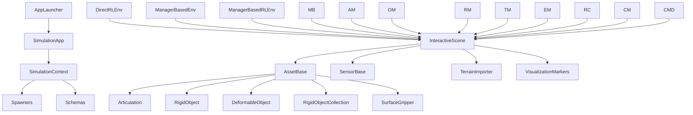
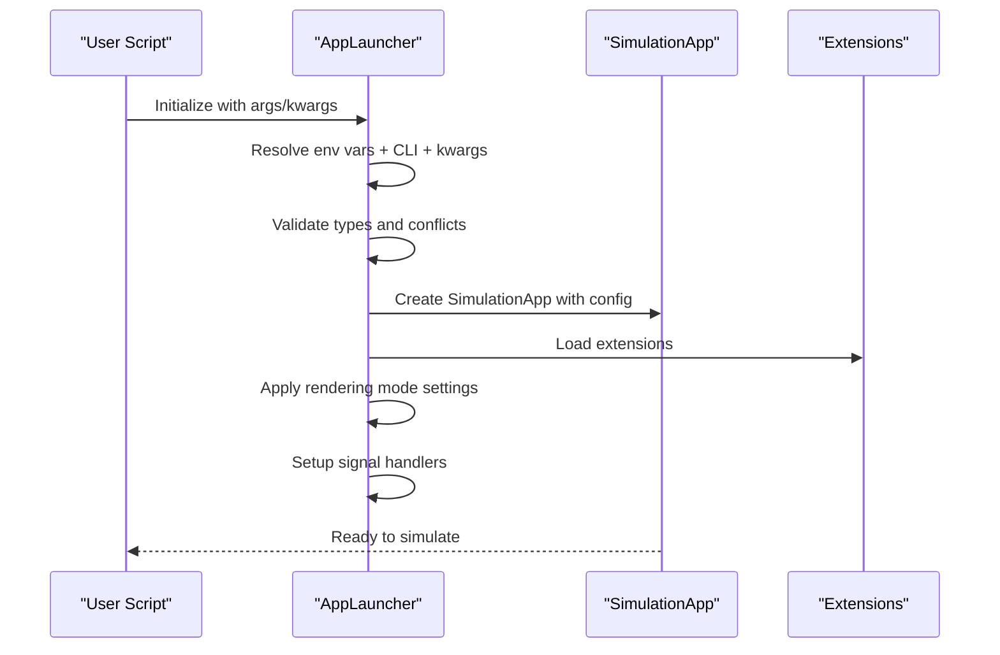
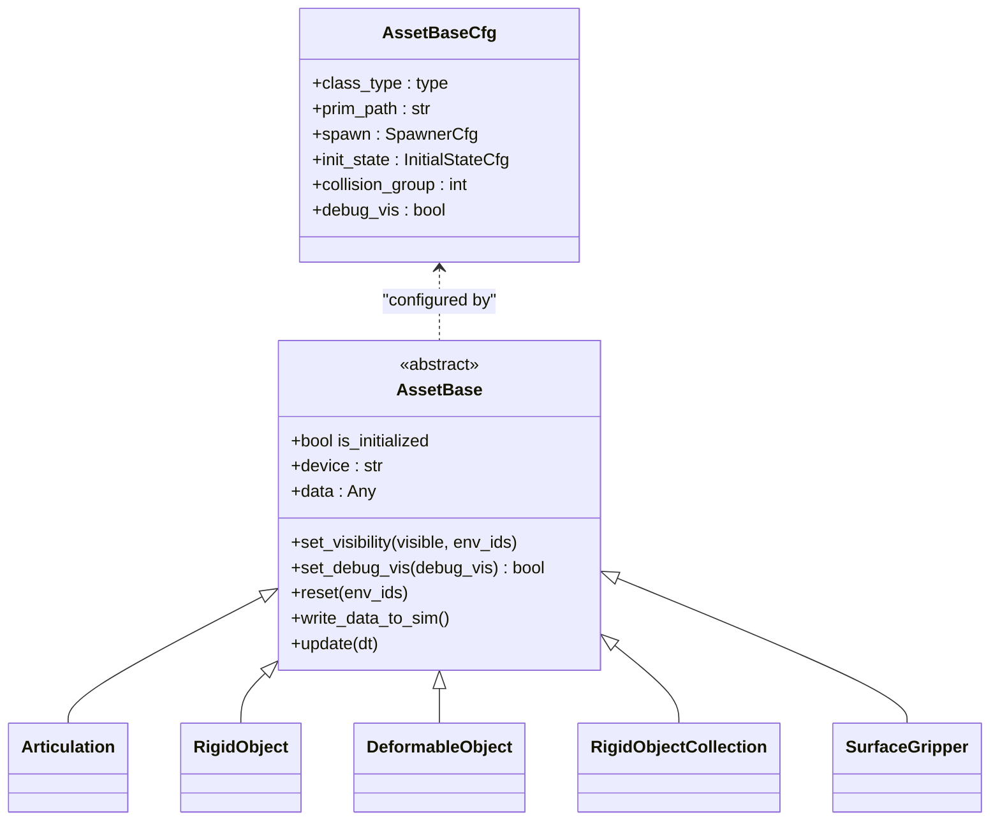
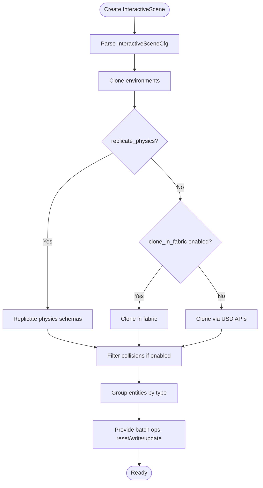
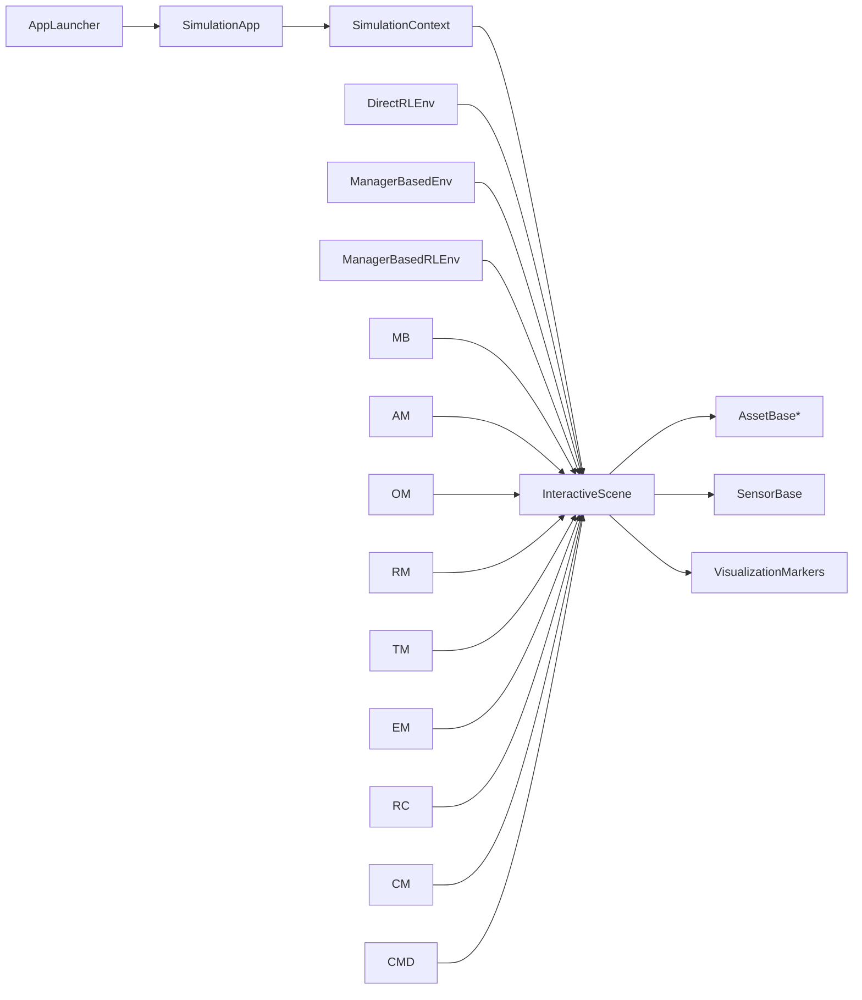

# Core Framework API

<cite>
**Referenced Files in This Document**
- [__init__.py](file://source/isaaclab/isaaclab/__init__.py)
- [app_launcher.py](file://source/isaaclab/isaaclab/app/app_launcher.py)
- [__init__.py](file://source/isaaclab/isaaclab/app/__init__.py)
- [asset_base.py](file://source/isaaclab/isaaclab/assets/asset_base.py)
- [asset_base_cfg.py](file://source/isaaclab/isaaclab/assets/asset_base_cfg.py)
- [articulation.py](file://source/isaaclab/isaaclab/assets/articulation/articulation.py)
- [articulation_cfg.py](file://source/isaaclab/isaaclab/assets/articulation/articulation_cfg.py)
- [rigid_object.py](file://source/isaaclab/isaaclab/assets/rigid_object/rigid_object.py)
- [rigid_object_cfg.py](file://source/isaaclab/isaaclab/assets/rigid_object/rigid_object_cfg.py)
- [deformable_object.py](file://source/isaaclab/isaaclab/assets/deformable_object/deformable_object.py)
- [deformable_object_cfg.py](file://source/isaaclab/isaaclab/assets/deformable_object/deformable_object_cfg.py)
- [rigid_object_collection.py](file://source/isaaclab/isaaclab/assets/rigid_object_collection/rigid_object_collection.py)
- [rigid_object_collection_cfg.py](file://source/isaaclab/isaaclab/assets/rigid_object_collection/rigid_object_collection_cfg.py)
- [surface_gripper.py](file://source/isaaclab/isaaclab/assets/surface_gripper/surface_gripper.py)
- [surface_gripper_cfg.py](file://source/isaaclab/isaaclab/assets/surface_gripper/surface_gripper_cfg.py)
- [__init__.py](file://source/isaaclab/isaaclab/assets/__init__.py)
- [interactive_scene.py](file://source/isaaclab/isaaclab/scene/interactive_scene.py)
- [interactive_scene_cfg.py](file://source/isaaclab/isaaclab/scene/interactive_scene_cfg.py)
- [visualization_markers.py](file://source/isaaclab/isaaclab/markers/visualization_markers.py)
- [__init__.py](file://source/isaaclab/isaaclab/markers/__init__.py)
- [simulation_context.py](file://source/isaaclab/isaaclab/sim/simulation_context.py)
- [simulation_cfg.py](file://source/isaaclab/isaaclab/sim/simulation_cfg.py)
- [spawners/__init__.py](file://source/isaaclab/isaaclab/sim/spawners/__init__.py)
- [schemas/__init__.py](file://source/isaaclab/isaaclab/sim/schemas/__init__.py)
- [utils.py](file://source/isaaclab/isaaclab/sim/utils.py)
- [sensor_base.py](file://source/isaaclab/isaaclab/sensors/sensor_base.py)
- [sensor_base_cfg.py](file://source/isaaclab/isaaclab/sensors/sensor_base_cfg.py)
- [ray_caster/__init__.py](file://source/isaaclab/isaaclab/sensors/ray_caster/__init__.py)
- [camera/__init__.py](file://source/isaaclab/isaaclab/sensors/camera/__init__.py)
- [contact_sensor/__init__.py](file://source/isaaclab/isaaclab/sensors/contact_sensor/__init__.py)
- [frame_transformer/__init__.py](file://source/isaaclab/isaaclab/sensors/frame_transformer/__init__.py)
- [imu/__init__.py](file://source/isaaclab/isaaclab/sensors/imu/__init__.py)
- [manager_base.py](file://source/isaaclab/isaaclab/managers/manager_base.py)
- [action_manager.py](file://source/isaaclab/isaaclab/managers/action_manager.py)
- [observation_manager.py](file://source/isaaclab/isaaclab/managers/observation_manager.py)
- [reward_manager.py](file://source/isaaclab/isaaclab/managers/reward_manager.py)
- [termination_manager.py](file://source/isaaclab/isaaclab/managers/termination_manager.py)
- [event_manager.py](file://source/isaaclab/isaaclab/managers/event_manager.py)
- [recorder_manager.py](file://source/isaaclab/isaaclab/managers/recorder_manager.py)
- [curriculum_manager.py](file://source/isaaclab/isaaclab/managers/curriculum_manager.py)
- [command_manager.py](file://source/isaaclab/isaaclab/managers/command_manager.py)
- [scene_entity_cfg.py](file://source/isaaclab/isaaclab/managers/scene_entity_cfg.py)
- [manager_term_cfg.py](file://source/isaaclab/isaaclab/managers/manager_term_cfg.py)
- [envs/common.py](file://source/isaaclab/isaaclab/envs/common.py)
- [direct_rl_env.py](file://source/isaaclab/isaaclab/envs/direct_rl_env.py)
- [direct_rl_env_cfg.py](file://source/isaaclab/isaaclab/envs/direct_rl_env_cfg.py)
- [manager_based_env.py](file://source/isaaclab/isaaclab/envs/manager_based_env.py)
- [manager_based_env_cfg.py](file://source/isaaclab/isaaclab/envs/manager_based_env_cfg.py)
- [manager_based_rl_env.py](file://source/isaaclab/isaaclab/envs/manager_based_rl_env.py)
- [manager_based_rl_env_cfg.py](file://source/isaaclab/isaaclab/envs/manager_based_rl_env_cfg.py)
- [terran_importer.py](file://source/isaaclab/isaaclab/terrains/terrain_importer.py)
- [terrain_importer_cfg.py](file://source/isaaclab/isaaclab/terrains/terrain_importer_cfg.py)
- [height_field/__init__.py](file://source/isaaclab/isaaclab/terrains/height_field/__init__.py)
- [trimesh/__init__.py](file://source/isaaclab/isaaclab/terrains/trimesh/__init__.py)
- [utils.py](file://source/isaaclab/isaaclab/terrains/utils.py)
- [configclass.py](file://source/isaaclab/isaaclab/utils/configclass.py)
- [types.py](file://source/isaaclab/isaaclab/utils/types.py)
- [timer.py](file://source/isaaclab/isaaclab/utils/timer.py)
- [array.py](file://source/isaaclab/isaaclab/utils/array.py)
- [assets.py](file://source/isaaclab/isaaclab/utils/assets.py)
- [README.md](file://README.md)
</cite>

## Table of Contents
1. [Introduction](#introduction)
2. [Project Structure](#project-structure)
3. [Core Components](#core-components)
4. [Architecture Overview](#architecture-overview)
5. [Detailed Component Analysis](#detailed-component-analysis)
6. [Dependency Analysis](#dependency-analysis)
7. [Performance Considerations](#performance-considerations)
8. [Troubleshooting Guide](#troubleshooting-guide)
9. [Conclusion](#conclusion)
10. [Appendices](#appendices)

## Introduction
This document provides comprehensive API documentation for the core Isaac Lab framework components. It focuses on the application launcher interface, asset management APIs, scene creation and manipulation functions, marker visualization system, and utility functions. It explains asset loading mechanisms for robots, objects, and environments, details scene graph management, interactive scene controls, and visualization marker APIs. Configuration classes for asset spawning, scene setup, and rendering options are documented along with parameter specifications for asset properties, material assignments, and visual appearance settings. Error handling procedures for asset loading failures, scene initialization errors, and memory management are included, alongside performance optimization techniques and best practices for large-scale simulations.

## Project Structure
The core framework is organized into modular packages:
- Application launcher: manages SimulationApp lifecycle, rendering modes, and environment configuration.
- Assets: base asset classes and derived asset types (articulations, rigid objects, deformable objects, collections, surface grippers).
- Scene: interactive scene builder and configuration for environment cloning and entity grouping.
- Markers: visualization marker utilities for debugging and monitoring.
- Simulation: simulation context, configuration, and spawners.
- Sensors: sensor base classes and specific sensor implementations.
- Managers: environment and MDP managers for actions, observations, rewards, terminations, events, and curriculum.
- Environments: environment wrappers for RL and direct control.
- Terrains: terrain importer and generators.
- Utilities: configuration classes, timers, arrays, and asset helpers.

```mermaid
graph TB
subgraph "Application"
AL["AppLauncher<br/>app/app_launcher.py"]
end
subgraph "Assets"
AB["AssetBase<br/>assets/asset_base.py"]
ACfg["AssetBaseCfg<br/>assets/asset_base_cfg.py"]
Art["Articulation<br/>assets/articulation/articulation.py"]
RO["RigidObject<br/>assets/rigid_object/rigid_object.py"]
DO["DeformableObject<br/>assets/deformable_object/deformable_object.py"]
ROC["RigidObjectCollection<br/>assets/rigid_object_collection/rigid_object_collection.py"]
SG["SurfaceGripper<br/>assets/surface_gripper/surface_gripper.py"]
end
subgraph "Scene"
IS["InteractiveScene<br/>scene/interactive_scene.py"]
ISC["InteractiveSceneCfg<br/>scene/interactive_scene_cfg.py"]
end
subgraph "Markers"
VM["VisualizationMarkers<br/>markers/visualization_markers.py"]
end
subgraph "Simulation"
SCtx["SimulationContext<br/>sim/simulation_context.py"]
SSp["Spawners<br/>sim/spawners/*"]
SSch["Schemas<br/>sim/schemas/*"]
SCfg["SimulationCfg<br/>sim/simulation_cfg.py"]
end
subgraph "Sensors"
SB["SensorBase<br/>sensors/sensor_base.py"]
end
subgraph "Managers"
MB["ManagerBase<br/>managers/manager_base.py"]
AM["ActionManager<br/>managers/action_manager.py"]
OM["ObservationManager<br/>managers/observation_manager.py"]
RM["RewardManager<br/>managers/reward_manager.py"]
TM["TerminationManager<br/>managers/termination_manager.py"]
EM["EventManager<br/>managers/event_manager.py"]
RC["RecorderManager<br/>managers/recorder_manager.py"]
CM["CurriculumManager<br/>managers/curriculum_manager.py"]
CMD["CommandManager<br/>managers/command_manager.py"]
end
subgraph "Environments"
ENVCommon["Env Common<br/>envs/common.py"]
DRE["DirectRLEnv<br/>envs/direct_rl_env.py"]
MBEnv["ManagerBasedEnv<br/>envs/manager_based_env.py"]
MBRLEnv["ManagerBasedRLEnv<br/>envs/manager_based_rl_env.py"]
end
subgraph "Terrains"
TI["TerrainImporter<br/>terrains/terrain_importer.py"]
end
AL --> SCtx
AB --> Art
AB --> RO
AB --> DO
AB --> ROC
AB --> SG
IS --> AB
IS --> SB
IS --> TI
IS --> ISC
VM --> IS
SCtx --> SSp
SCtx --> SSch
DRE --> IS
MBEnv --> IS
MBRLEnv --> IS
MB --> IS
AM --> IS
OM --> IS
RM --> IS
TM --> IS
EM --> IS
RC --> IS
CM --> IS
CMD --> IS
```

**Diagram sources**
- [app_launcher.py:1-1055](file://source/isaaclab/isaaclab/app/app_launcher.py#L1-L1055)
- [asset_base.py:1-364](file://source/isaaclab/isaaclab/assets/asset_base.py#L1-L364)
- [asset_base_cfg.py:1-78](file://source/isaaclab/isaaclab/assets/asset_base_cfg.py#L1-L78)
- [articulation.py](file://source/isaaclab/isaaclab/assets/articulation/articulation.py)
- [rigid_object.py](file://source/isaaclab/isaaclab/assets/rigid_object/rigid_object.py)
- [deformable_object.py](file://source/isaaclab/isaaclab/assets/deformable_object/deformable_object.py)
- [rigid_object_collection.py](file://source/isaaclab/isaaclab/assets/rigid_object_collection/rigid_object_collection.py)
- [surface_gripper.py](file://source/isaaclab/isaaclab/assets/surface_gripper/surface_gripper.py)
- [interactive_scene.py:1-786](file://source/isaaclab/isaaclab/scene/interactive_scene.py#L1-L786)
- [interactive_scene_cfg.py:1-123](file://source/isaaclab/isaaclab/scene/interactive_scene_cfg.py#L1-L123)
- [visualization_markers.py](file://source/isaaclab/isaaclab/markers/visualization_markers.py)
- [simulation_context.py](file://source/isaaclab/isaaclab/sim/simulation_context.py)
- [simulation_cfg.py](file://source/isaaclab/isaaclab/sim/simulation_cfg.py)
- [spawners/__init__.py](file://source/isaaclab/isaaclab/sim/spawners/__init__.py)
- [schemas/__init__.py](file://source/isaaclab/isaaclab/sim/schemas/__init__.py)
- [sensor_base.py](file://source/isaaclab/isaaclab/sensors/sensor_base.py)
- [manager_base.py](file://source/isaaclab/isaaclab/managers/manager_base.py)
- [direct_rl_env.py](file://source/isaaclab/isaaclab/envs/direct_rl_env.py)
- [manager_based_env.py](file://source/isaaclab/isaaclab/envs/manager_based_env.py)
- [manager_based_rl_env.py](file://source/isaaclab/isaaclab/envs/manager_based_rl_env.py)
- [terrain_importer.py](file://source/isaaclab/isaaclab/terrains/terrain_importer.py)

**Section sources**
- [__init__.py:1-20](file://source/isaaclab/isaaclab/__init__.py#L1-L20)
- [app/__init__.py:1-16](file://source/isaaclab/isaaclab/app/__init__.py#L1-L16)
- [assets/__init__.py:1-48](file://source/isaaclab/isaaclab/assets/__init__.py#L1-L48)
- [scene/__init__.py:1-30](file://source/isaaclab/isaaclab/scene/__init__.py#L1-L30)
- [markers/__init__.py](file://source/isaaclab/isaaclab/markers/__init__.py)

## Core Components
This section documents the primary building blocks of the framework and their roles.

- Application Launcher (AppLauncher)
  - Purpose: Launch and configure the SimulationApp with headless mode, livestreaming, camera enabling, XR, device selection, rendering mode presets, and experience file selection.
  - Key capabilities:
    - Resolve environment variables and CLI arguments into a unified configuration.
    - Select appropriate experience kit based on headless, camera, and XR flags.
    - Configure GPU/CPU device, distributed training ranks, and threading constraints.
    - Apply rendering mode presets and animation recording settings.
    - Manage UI visibility and viewport behavior for performance.
  - Important properties and methods:
    - app: SimulationApp instance.
    - add_app_launcher_args(parser): Extend an ArgumentParser with AppLauncher options.
    - Internal resolution and configuration methods for headless, livestream, cameras, XR, device, experience, and kit arguments.

- Asset Management
  - AssetBase: Abstract base class for all assets. Handles spawning into USD, initializing physics handles on timeline play, registering callbacks, and optional debug visualization.
  - AssetBaseCfg: Base configuration class for assets including prim path, spawn configuration, initial state (position/rotation), collision group, and debug visualization toggle.
  - Derived assets:
    - Articulation, RigidObject, DeformableObject, RigidObjectCollection, SurfaceGripper.
  - Asset operations:
    - Visibility toggling, debug visualization enable/disable, reset, write buffers to sim, update buffers.

- Scene Management
  - InteractiveScene: Parses a configuration to create and clone environments, group entities (articulations, deformable objects, rigid objects, sensors, surface grippers, extras), and provide unified operations (reset, write to sim, update).
  - InteractiveSceneCfg: Configuration controlling number of environments, environment spacing, lazy sensor updates, physics replication, collision filtering, and fabric cloning.

- Visualization Markers
  - VisualizationMarkers: Provides marker APIs for debugging and visualization (e.g., drawing lines, spheres, frames).

- Simulation Context and Spawners
  - SimulationContext: Singleton access to simulation context and device.
  - Spawners and Schemas: USD prim spawner utilities and schema definitions used during asset creation.

- Sensors
  - SensorBase and SensorBaseCfg: Base classes and configuration for sensors (ray caster, camera, IMU, contact sensors, frame transformer).

- Managers
  - ManagerBase and specialized managers (action, observation, reward, termination, event, recorder, curriculum, command) orchestrate environment behavior and MDP components.

- Environments
  - DirectRLEnv, ManagerBasedEnv, ManagerBasedRLEnv: Wrappers for RL and direct control scenarios.

- Terrains
  - TerrainImporter and importer configuration for procedural and imported terrains.

**Section sources**
- [app_launcher.py:1-1055](file://source/isaaclab/isaaclab/app/app_launcher.py#L1-L1055)
- [asset_base.py:1-364](file://source/isaaclab/isaaclab/assets/asset_base.py#L1-L364)
- [asset_base_cfg.py:1-78](file://source/isaaclab/isaaclab/assets/asset_base_cfg.py#L1-L78)
- [interactive_scene.py:1-786](file://source/isaaclab/isaaclab/scene/interactive_scene.py#L1-L786)
- [interactive_scene_cfg.py:1-123](file://source/isaaclab/isaaclab/scene/interactive_scene_cfg.py#L1-L123)
- [visualization_markers.py](file://source/isaaclab/isaaclab/markers/visualization_markers.py)
- [simulation_context.py](file://source/isaaclab/isaaclab/sim/simulation_context.py)
- [sensor_base.py](file://source/isaaclab/isaaclab/sensors/sensor_base.py)
- [sensor_base_cfg.py](file://source/isaaclab/isaaclab/sensors/sensor_base_cfg.py)
- [manager_base.py](file://source/isaaclab/isaaclab/managers/manager_base.py)
- [direct_rl_env.py](file://source/isaaclab/isaaclab/envs/direct_rl_env.py)
- [manager_based_env.py](file://source/isaaclab/isaaclab/envs/manager_based_env.py)
- [manager_based_rl_env.py](file://source/isaaclab/isaaclab/envs/manager_based_rl_env.py)
- [terrain_importer.py](file://source/isaaclab/isaaclab/terrains/terrain_importer.py)

## Architecture Overview
The framework follows a layered architecture:
- Application Layer: AppLauncher configures and launches the SimulationApp.
- Simulation Layer: SimulationContext provides runtime access; spawners create USD prims; schemas define simulation properties.
- Asset Layer: AssetBase and derived classes encapsulate physics-enabled objects.
- Scene Layer: InteractiveScene orchestrates environment cloning, entity grouping, and batch operations.
- Sensor Layer: SensorBase and sensor families provide perception primitives.
- Manager Layer: Managers coordinate environment dynamics and MDP logic.
- Environment Layer: Direct and manager-based RL environments wrap the scene and managers.
- Visualization Layer: Markers provide debugging and monitoring overlays.

**Diagram sources**
- [app_launcher.py:1-1055](file://source/isaaclab/isaaclab/app/app_launcher.py#L1-L1055)
- [simulation_context.py](file://source/isaaclab/isaaclab/sim/simulation_context.py)
- [spawners/__init__.py](file://source/isaaclab/isaaclab/sim/spawners/__init__.py)
- [schemas/__init__.py](file://source/isaaclab/isaaclab/sim/schemas/__init__.py)
- [interactive_scene.py:1-786](file://source/isaaclab/isaaclab/scene/interactive_scene.py#L1-L786)
- [asset_base.py:1-364](file://source/isaaclab/isaaclab/assets/asset_base.py#L1-L364)
- [sensor_base.py](file://source/isaaclab/isaaclab/sensors/sensor_base.py)
- [visualization_markers.py](file://source/isaaclab/isaaclab/markers/visualization_markers.py)
- [direct_rl_env.py](file://source/isaaclab/isaaclab/envs/direct_rl_env.py)
- [manager_based_env.py](file://source/isaaclab/isaaclab/envs/manager_based_env.py)
- [manager_based_rl_env.py](file://source/isaaclab/isaaclab/envs/manager_based_rl_env.py)

## Detailed Component Analysis

### Application Launcher API
The AppLauncher centralizes configuration resolution and SimulationApp initialization. It merges environment variables, CLI arguments, and kwargs, validates types, selects experience kits, configures rendering modes, and applies performance-related settings.

Key behaviors:
- Argument validation and conflict detection.
- Headless, livestream, camera, XR, and viewport settings resolution.
- Device selection with distributed training support.
- Experience file resolution with fallbacks and absolute path handling.
- Animation recording and kit arguments injection.
- Signal handlers for graceful shutdown.

**Diagram sources**
- [app_launcher.py:1-1055](file://source/isaaclab/isaaclab/app/app_launcher.py#L1-L1055)

**Section sources**
- [app_launcher.py:1-1055](file://source/isaaclab/isaaclab/app/app_launcher.py#L1-L1055)

### Asset Management APIs
AssetBase provides a unified interface for physics-enabled objects:
- Construction spawns prims based on AssetBaseCfg.spawn and prim_path.
- Registers timeline callbacks to initialize/invalidate physics handles on play/stop.
- Supports debug visualization with callback subscription.
- Provides set_* and write_* operations to decouple buffer updates from simulator writes.

AssetBaseCfg defines:
- prim_path (supports environment namespace regex).
- spawn configuration.
- init_state (pos, rot).
- collision_group.
- debug_vis.

Derived asset classes expose type-specific buffers and operations (articulations, rigid objects, deformable objects, collections, surface grippers).

**Diagram sources**
- [asset_base.py:1-364](file://source/isaaclab/isaaclab/assets/asset_base.py#L1-L364)
- [asset_base_cfg.py:1-78](file://source/isaaclab/isaaclab/assets/asset_base_cfg.py#L1-L78)
- [articulation.py](file://source/isaaclab/isaaclab/assets/articulation/articulation.py)
- [rigid_object.py](file://source/isaaclab/isaaclab/assets/rigid_object/rigid_object.py)
- [deformable_object.py](file://source/isaaclab/isaaclab/assets/deformable_object/deformable_object.py)
- [rigid_object_collection.py](file://source/isaaclab/isaaclab/assets/rigid_object_collection/rigid_object_collection.py)
- [surface_gripper.py](file://source/isaaclab/isaaclab/assets/surface_gripper/surface_gripper.py)

**Section sources**
- [asset_base.py:1-364](file://source/isaaclab/isaaclab/assets/asset_base.py#L1-L364)
- [asset_base_cfg.py:1-78](file://source/isaaclab/isaaclab/assets/asset_base_cfg.py#L1-L78)
- [articulation.py](file://source/isaaclab/isaaclab/assets/articulation/articulation.py)
- [rigid_object.py](file://source/isaaclab/isaaclab/assets/rigid_object/rigid_object.py)
- [deformable_object.py](file://source/isaaclab/isaaclab/assets/deformable_object/deformable_object.py)
- [rigid_object_collection.py](file://source/isaaclab/isaaclab/assets/rigid_object_collection/rigid_object_collection.py)
- [surface_gripper.py](file://source/isaaclab/isaaclab/assets/surface_gripper/surface_gripper.py)

### Scene Creation and Manipulation
InteractiveScene builds scenes from configuration:
- Clones environments using GridCloner with options for physics replication and fabric cloning.
- Groups entities by type (articulations, deformable objects, rigid objects, sensors, surface grippers, extras).
- Provides batch operations: reset, write_data_to_sim, update.
- Supports state retrieval and reset to state for articulated and deformable entities.

InteractiveSceneCfg parameters:
- num_envs, env_spacing.
- lazy_sensor_update.
- replicate_physics, filter_collisions, clone_in_fabric.

**Diagram sources**
- [interactive_scene.py:1-786](file://source/isaaclab/isaaclab/scene/interactive_scene.py#L1-L786)
- [interactive_scene_cfg.py:1-123](file://source/isaaclab/isaaclab/scene/interactive_scene_cfg.py#L1-L123)

**Section sources**
- [interactive_scene.py:1-786](file://source/isaaclab/isaaclab/scene/interactive_scene.py#L1-L786)
- [interactive_scene_cfg.py:1-123](file://source/isaaclab/isaaclab/scene/interactive_scene_cfg.py#L1-L123)

### Marker Visualization System
VisualizationMarkers provides APIs for drawing geometric primitives and frames for debugging and monitoring. Typical usage involves creating marker primitives and updating their geometry per frame.

- Typical operations: create, set pose/points/colors, update, clear.
- Integration with interactive scene for per-frame updates via callbacks.

**Section sources**
- [visualization_markers.py](file://source/isaaclab/isaaclab/markers/visualization_markers.py)

### Utility Functions and Configuration Classes
- configclass: Decorator for dataclass-style configuration classes with validation.
- types: Type aliases and utilities.
- timer: Timing utilities for profiling.
- array: Array utilities.
- assets: Helpers for asset discovery and caching.
- Simulation context utilities: Stage access, device queries, and simulation dt.

**Section sources**
- [configclass.py](file://source/isaaclab/isaaclab/utils/configclass.py)
- [types.py](file://source/isaaclab/isaaclab/utils/types.py)
- [timer.py](file://source/isaaclab/isaaclab/utils/timer.py)
- [array.py](file://source/isaaclab/isaaclab/utils/array.py)
- [assets.py](file://source/isaaclab/isaaclab/utils/assets.py)
- [utils.py](file://source/isaaclab/isaaclab/sim/utils.py)

## Dependency Analysis
High-level dependencies:
- AppLauncher depends on SimulationApp and environment variables/CLI.
- InteractiveScene depends on AssetBase-derived classes, SensorBase, and SimulationContext.
- Managers depend on InteractiveScene and environment wrappers.
- Environments depend on managers and simulation context.
- VisualizationMarkers depend on interactive scene and stage access.

**Diagram sources**
- [app_launcher.py:1-1055](file://source/isaaclab/isaaclab/app/app_launcher.py#L1-L1055)
- [simulation_context.py](file://source/isaaclab/isaaclab/sim/simulation_context.py)
- [interactive_scene.py:1-786](file://source/isaaclab/isaaclab/scene/interactive_scene.py#L1-L786)
- [visualization_markers.py](file://source/isaaclab/isaaclab/markers/visualization_markers.py)
- [direct_rl_env.py](file://source/isaaclab/isaaclab/envs/direct_rl_env.py)
- [manager_based_env.py](file://source/isaaclab/isaaclab/envs/manager_based_env.py)
- [manager_based_rl_env.py](file://source/isaaclab/isaaclab/envs/manager_based_rl_env.py)

**Section sources**
- [app_launcher.py:1-1055](file://source/isaaclab/isaaclab/app/app_launcher.py#L1-L1055)
- [interactive_scene.py:1-786](file://source/isaaclab/isaaclab/scene/interactive_scene.py#L1-L786)

## Performance Considerations
- Prefer headless mode for training and disable viewport rendering when not needed.
- Use replicate_physics=True and clone_in_fabric when supported to accelerate environment cloning.
- Enable lazy_sensor_update to defer sensor computations until data is accessed.
- Use filter_collisions when replicate_physics is enabled to avoid cross-environment collisions.
- Limit debug visualization to development runs; disable debug_vis for production.
- Use GPU device selection and distributed training settings for multi-GPU setups.
- Avoid excessive prim visibility toggles; batch operations where possible.
- Use offscreen rendering when cameras are required in headless mode.

[No sources needed since this section provides general guidance]

## Troubleshooting Guide
Common issues and resolutions:
- Asset prim not found at prim_path:
  - Ensure prim_path matches existing prims or provide a valid spawn configuration.
  - Verify regex patterns and environment namespace substitution.
- SimulationApp initialization errors:
  - Check experience file path resolution and existence.
  - Validate device selection and distributed training flags.
- Scene initialization failures:
  - Confirm physics scene exists and is accessible.
  - Verify environment origins and terrain setup when applicable.
- Memory and performance issues:
  - Disable debug visualization and unnecessary sensors.
  - Reduce num_envs or disable clone_in_fabric if unsupported.
  - Use headless mode and offscreen rendering for camera-heavy workloads.

**Section sources**
- [asset_base.py:80-100](file://source/isaaclab/isaaclab/assets/asset_base.py#L80-L100)
- [interactive_scene.py:320-336](file://source/isaaclab/isaaclab/scene/interactive_scene.py#L320-L336)
- [app_launcher.py:700-751](file://source/isaaclab/isaaclab/app/app_launcher.py#L700-L751)

## Conclusion
The Isaac Lab framework provides a modular, extensible foundation for robotics simulation and RL research. The AppLauncher streamlines SimulationApp configuration, AssetBase offers a unified asset abstraction, InteractiveScene orchestrates environment creation and entity management, VisualizationMarkers aid debugging, and Managers coordinate environment dynamics. By leveraging configuration classes, spawners, and performance-aware settings, developers can build scalable simulations and training pipelines.

[No sources needed since this section summarizes without analyzing specific files]

## Appendices

### Appendix A: Asset Property and Material Parameter Specifications
- AssetBaseCfg
  - prim_path: USD prim path or expression supporting environment namespace regex.
  - spawn: Spawner configuration for prim creation.
  - init_state: Initial position and quaternion orientation.
  - collision_group: Local (-1) or global (0) collision group.
  - debug_vis: Enable debug visualization.
- Articulation/RigidObject/DeformableObject/RigidObjectCollection/SurfaceGripper
  - Type-specific configuration classes define joint limits, materials, visual meshes, collision meshes, and control parameters.

**Section sources**
- [asset_base_cfg.py:1-78](file://source/isaaclab/isaaclab/assets/asset_base_cfg.py#L1-L78)
- [articulation_cfg.py](file://source/isaaclab/isaaclab/assets/articulation/articulation_cfg.py)
- [rigid_object_cfg.py](file://source/isaaclab/isaaclab/assets/rigid_object/rigid_object_cfg.py)
- [deformable_object_cfg.py](file://source/isaaclab/isaaclab/assets/deformable_object/deformable_object_cfg.py)
- [rigid_object_collection_cfg.py](file://source/isaaclab/isaaclab/assets/rigid_object_collection/rigid_object_collection_cfg.py)
- [surface_gripper_cfg.py](file://source/isaaclab/isaaclab/assets/surface_gripper/surface_gripper_cfg.py)

### Appendix B: Rendering Mode and Experience Selection
- Rendering modes: performance, balanced, quality presets.
- Experience selection: automatic based on headless/camera/XR flags; explicit experience file path resolution.
- Device selection: CUDA/GPU or CPU with distributed training support.

**Section sources**
- [app_launcher.py:178-381](file://source/isaaclab/isaaclab/app/app_launcher.py#L178-L381)
- [app_launcher.py:694-751](file://source/isaaclab/isaaclab/app/app_launcher.py#L694-L751)

### Appendix C: Environment and Manager Integration
- DirectRLEnv and ManagerBasedEnv wrappers connect environments to InteractiveScene and managers.
- Manager-based RL environments integrate with RL frameworks and curriculum managers.

**Section sources**
- [direct_rl_env.py](file://source/isaaclab/isaaclab/envs/direct_rl_env.py)
- [manager_based_env.py](file://source/isaaclab/isaaclab/envs/manager_based_env.py)
- [manager_based_rl_env.py](file://source/isaaclab/isaaclab/envs/manager_based_rl_env.py)
- [manager_base.py](file://source/isaaclab/isaaclab/managers/manager_base.py)
- [action_manager.py](file://source/isaaclab/isaaclab/managers/action_manager.py)
- [observation_manager.py](file://source/isaaclab/isaaclab/managers/observation_manager.py)
- [reward_manager.py](file://source/isaaclab/isaaclab/managers/reward_manager.py)
- [termination_manager.py](file://source/isaaclab/isaaclab/managers/termination_manager.py)
- [event_manager.py](file://source/isaaclab/isaaclab/managers/event_manager.py)
- [recorder_manager.py](file://source/isaaclab/isaaclab/managers/recorder_manager.py)
- [curriculum_manager.py](file://source/isaaclab/isaaclab/managers/curriculum_manager.py)
- [command_manager.py](file://source/isaaclab/isaaclab/managers/command_manager.py)