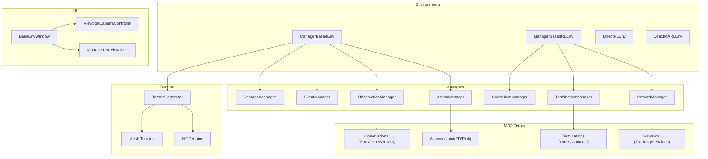
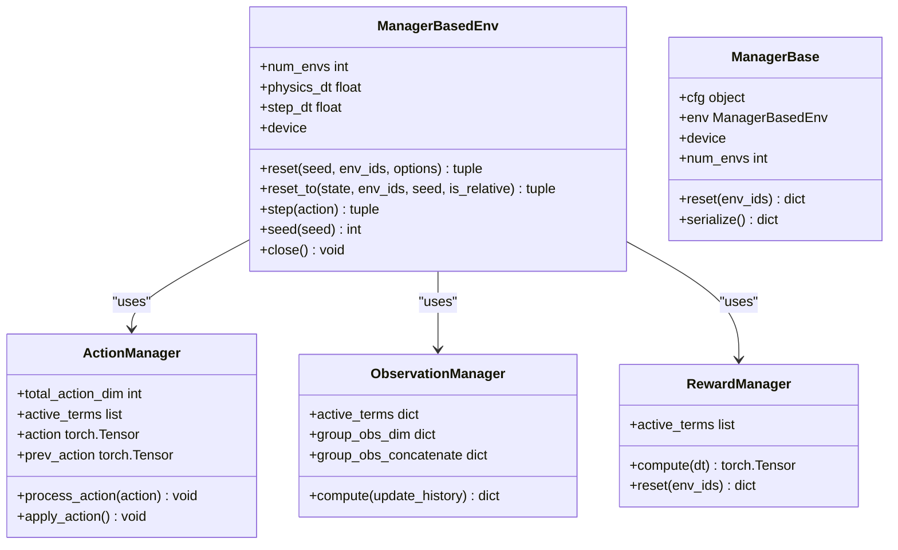
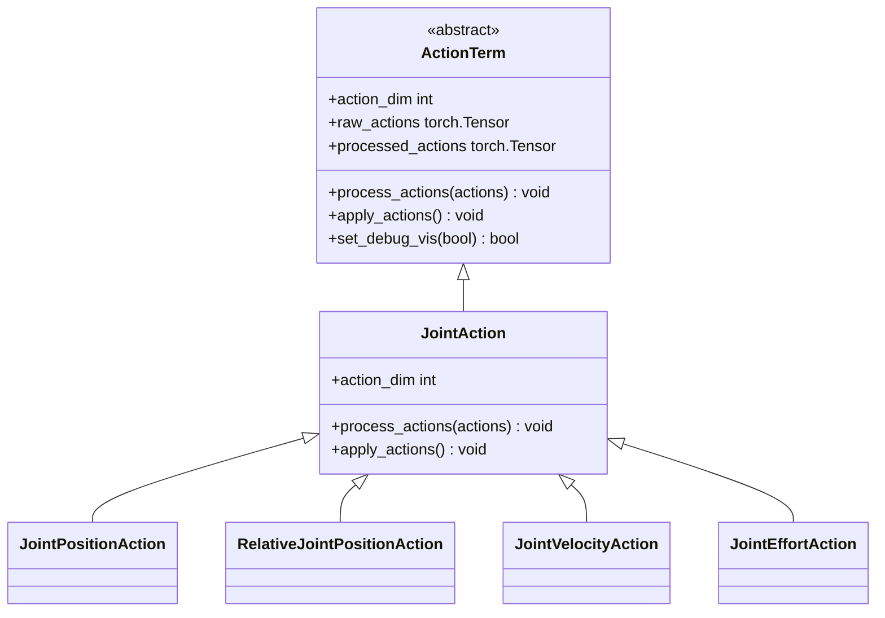
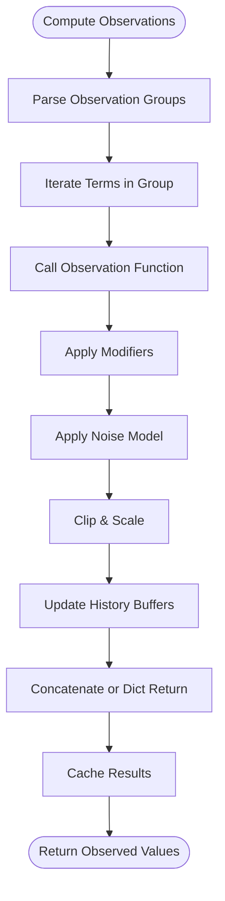
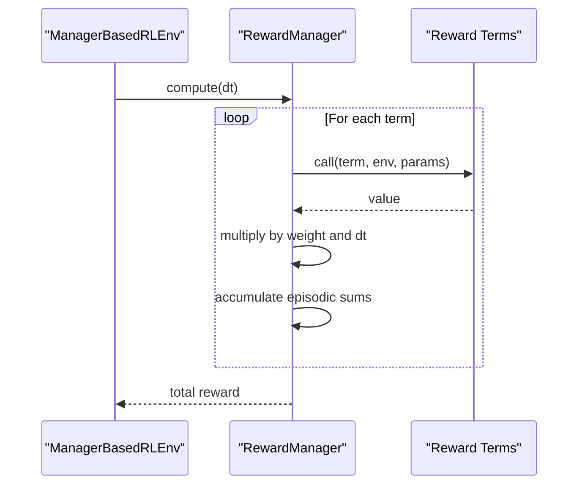
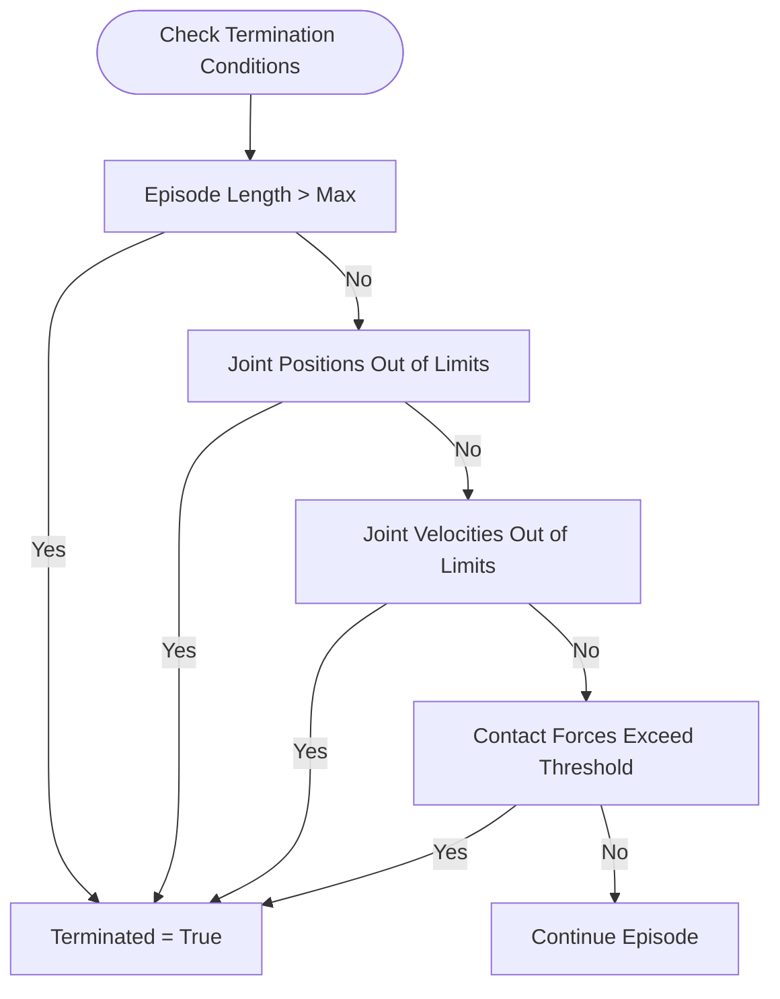
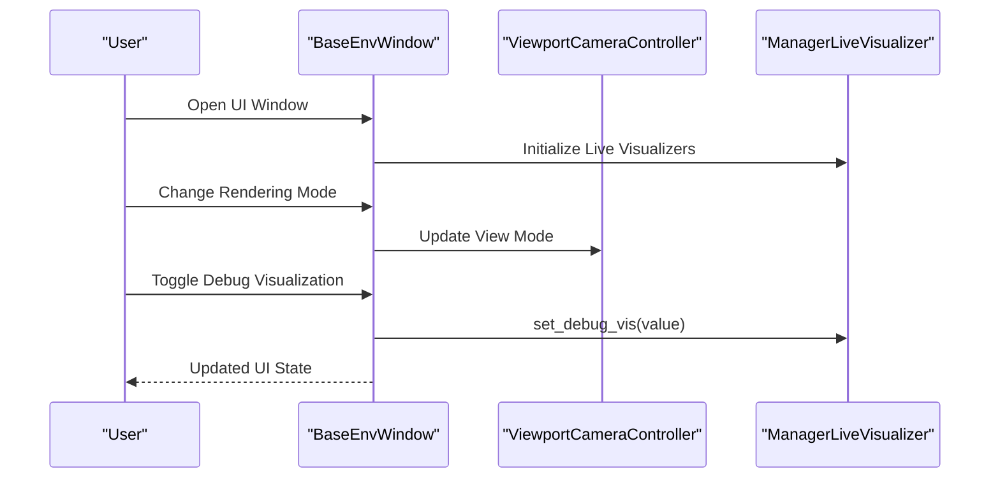
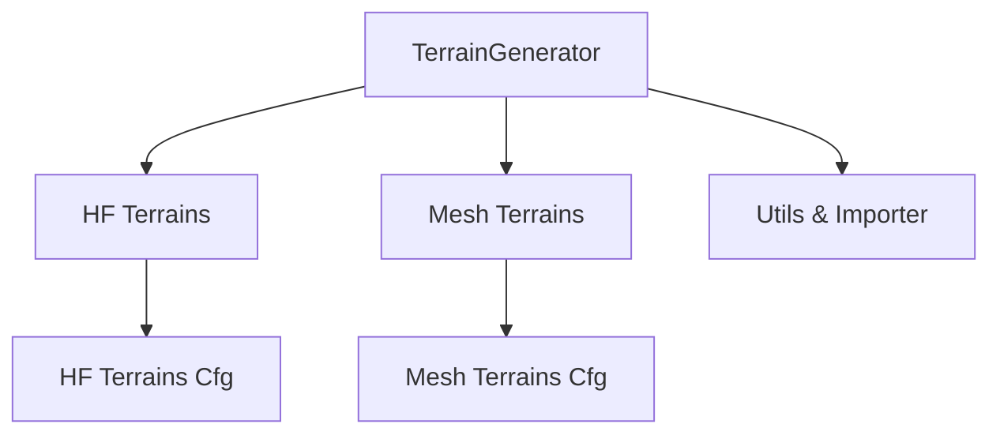
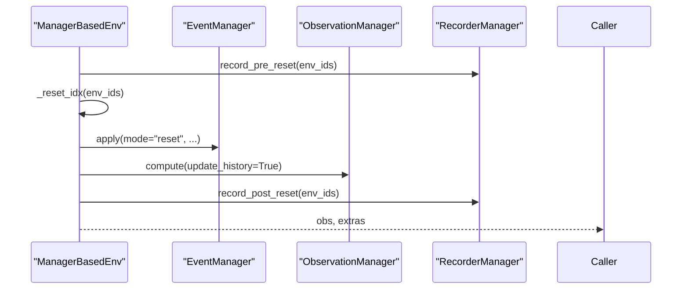
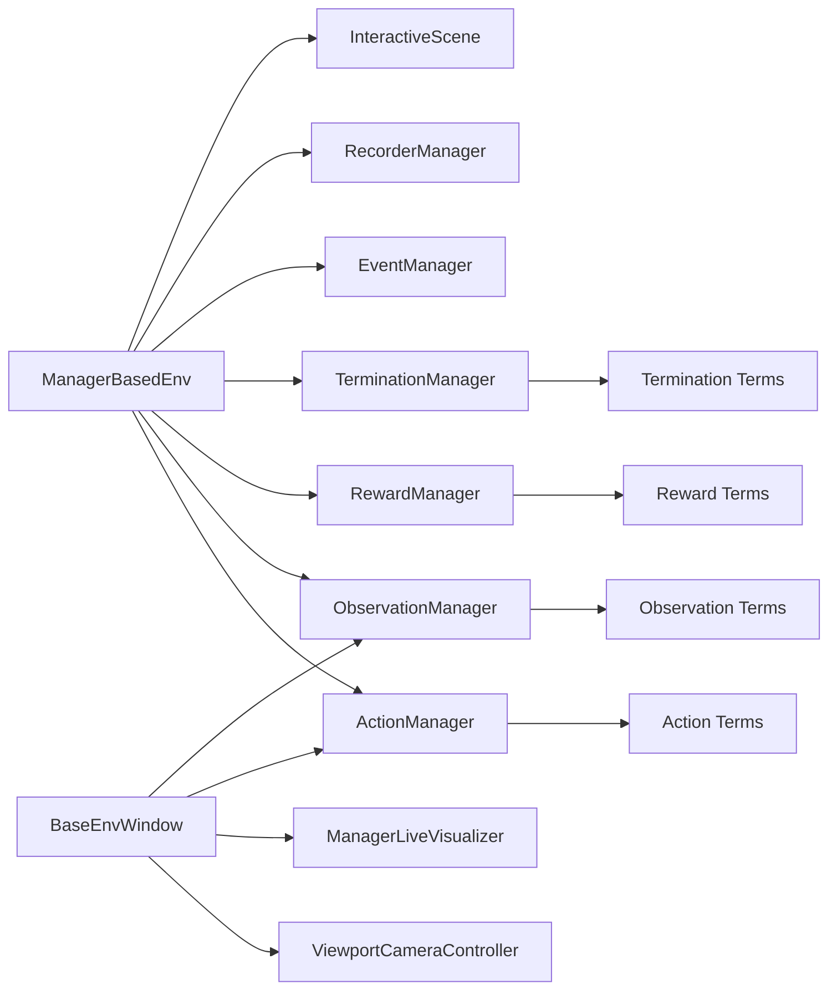

# Environment and Task API

<cite>
**Referenced Files in This Document**
- [manager_based_env.py](file://source/isaaclab/isaaclab/envs/manager_based_env.py)
- [manager_based_env_cfg.py](file://source/isaaclab/isaaclab/envs/manager_based_env_cfg.py)
- [action_manager.py](file://source/isaaclab/isaaclab/managers/action_manager.py)
- [observation_manager.py](file://source/isaaclab/isaaclab/managers/observation_manager.py)
- [reward_manager.py](file://source/isaaclab/isaaclab/managers/reward_manager.py)
- [joint_actions.py](file://source/isaaclab/isaaclab/envs/mdp/actions/joint_actions.py)
- [observations.py](file://source/isaaclab/isaaclab/envs/mdp/observations.py)
- [rewards.py](file://source/isaaclab/isaaclab/envs/mdp/rewards.py)
- [terminations.py](file://source/isaaclab/isaaclab/envs/mdp/terminations.py)
- [base_env_window.py](file://source/isaaclab/isaaclab/envs/ui/base_env_window.py)
- [viewport_camera_controller.py](file://source/isaaclab/isaaclab/envs/ui/viewport_camera_controller.py)
- [manager_live_visualizer.py](file://source/isaaclab/isaaclab/ui/widgets/manager_live_visualizer.py)
- [manager_term_cfg.py](file://source/isaaclab/isaaclab/managers/manager_term_cfg.py)
- [scene.py](file://source/isaaclab/isaaclab/scene/scene.py)
- [interactive_scene.py](file://source/isaaclab/isaaclab/scene/interactive_scene.py)
- [terrain_generator.py](file://source/isaaclab/isaaclab/terrains/terrain_generator.py)
- [hf_terrains.py](file://source/isaaclab/isaaclab/terrains/height_field/hf_terrains.py)
- [mesh_terrains.py](file://source/isaaclab/isaaclab/terrains/trimesh/mesh_terrains.py)
- [curriculums.py](file://source/isaaclab/isaaclab/envs/mdp/curriculums.py)
- [manager_based_rl_env.py](file://source/isaaclab/isaaclab/envs/manager_based_rl_env.py)
- [manager_based_rl_env_cfg.py](file://source/isaaclab/isaaclab/envs/manager_based_rl_env_cfg.py)
- [manager_based_rl_mimic_env.py](file://source/isaaclab/isaaclab/envs/manager_based_rl_mimic_env.py)
- [mimic_env_cfg.py](file://source/isaaclab/isaaclab/envs/mimic_env_cfg.py)
- [direct_rl_env.py](file://source/isaaclab/isaaclab/envs/direct_rl_env.py)
- [direct_rl_env_cfg.py](file://source/isaaclab/isaaclab/envs/direct_rl_env_cfg.py)
- [direct_marl_env.py](file://source/isaaclab/isaaclab/envs/direct_marl_env.py)
- [direct_marl_env_cfg.py](file://source/isaaclab/isaaclab/envs/direct_marl_env_cfg.py)
- [events.py](file://source/isaaclab/isaaclab/envs/mdp/events.py)
- [recorders.py](file://source/isaaclab/isaaclab/envs/mdp/recorders/recorders.py)
- [recorders_cfg.py](file://source/isaaclab/isaaclab/envs/mdp/recorders/recorders_cfg.py)
- [curriculum_manager.py](file://source/isaaclab/isaaclab/managers/curriculum_manager.py)
- [event_manager.py](file://source/isaaclab/isaaclab/managers/event_manager.py)
- [recorder_manager.py](file://source/isaaclab/isaaclab/managers/recorder_manager.py)
- [termination_manager.py](file://source/isaaclab/isaaclab/managers/termination_manager.py)
- [manager_term_cfg.py](file://source/isaaclab/isaaclab/managers/manager_term_cfg.py)
- [manager_base.py](file://source/isaaclab/isaaclab/managers/manager_base.py)
- [manager_term_cfg.py](file://source/isaaclab/isaaclab/managers/manager_term_cfg.py)
- [io_descriptors.py](file://source/isaaclab/isaaclab/envs/utils/io_descriptors.py)
- [io_descriptors.py](file://source/isaaclab/isaaclab/envs/utils/io_descriptors.py)
- [io_descriptors.py](file://source/isaaclab/isaaclab/envs/utils/io_descriptors.py)
- [io_descriptors.py](file://source/isaaclab/isaaclab/envs/utils/io_descriptors.py)
- [io_descriptors.py](file://source/isaaclab/isaaclab/envs/utils/io_descriptors.py)
- [io_descriptors.py](file://source/isaaclab/isaaclab/envs/utils/io_descriptors.py)
- [io_descriptors.py](file://source/isaaclab/isaaclab/envs/utils/io_descriptors.py)
- [io_descriptors.py](file://source/isaaclab/isaaclab/envs/utils/io_descriptors.py)
- [io_descriptors.py](file://source/isaaclab/isaaclab/envs/utils/io_descriptors.py)
- [io_descriptors.py](file://source/isaaclab/isaaclab/envs/utils/io_descriptors.py)
- [io_descriptors.py](file://source/isaaclab/isaaclab/envs/utils/io_descriptors.py)
- [io_descriptors.py](file://source/isaaclab/isaaclab/envs/utils/io_descriptors.py)
- [io_descriptors.py](file://source/isaaclab/isaaclab/envs/utils/io_descriptors.py)
- [io_descriptors.py](file://source/isaaclab/isaaclab/envs/utils/io_descriptors.py)
- [io_descriptors.py](file://source/isaaclab/isaaclab/envs/utils/io_descriptors.py)
- [io_descriptors.py](file://source/isaaclab/isaaclab/envs/utils/io_descriptors.py)
- [io_descriptors.py](file://source/isaaclab/isaaclab/envs/utils/io_descriptors.py)
- [io_descriptors.py](file://source/isaaclab/isaaclab/envs/utils/io_descriptors.py)
- [io_descriptors.py](file://source/isaaclab/isaaclab/envs/utils/io_descriptors.py)
- [io_descriptors.py](file://source/isaaclab/isaaclab/envs/utils/io_descriptors.py)
- [io_descriptors.py](file://source/is......)
</cite>

## Table of Contents
1. [Introduction](#introduction)
2. [Project Structure](#project-structure)
3. [Core Components](#core-components)
4. [Architecture Overview](#architecture-overview)
5. [Detailed Component Analysis](#detailed-component-analysis)
6. [Dependency Analysis](#dependency-analysis)
7. [Performance Considerations](#performance-considerations)
8. [Troubleshooting Guide](#troubleshooting-guide)
9. [Conclusion](#conclusion)
10. [Appendices](#appendices)

## Introduction
This document provides comprehensive API documentation for the environment and task management system. It covers:
- Environment registration interfaces and configuration classes
- MDP components (actions, observations, rewards, terminations)
- Manager-based environment APIs (action, observation, reward, termination managers)
- UI window management for visualization, camera controls, and interactive debugging
- Terrain configuration classes for different terrains, ablation variants, and curriculum learning systems
- Task definition interfaces for locomotion, manipulation, and navigation tasks
- Environment reset procedures, state management, and performance metrics collection
- Examples of custom environment creation, task registration, and curriculum progression

## Project Structure
The environment system is organized around a manager-based architecture:
- Environment base classes define lifecycle and stepping logic
- Managers encapsulate domain-specific behaviors (actions, observations, rewards, terminations)
- MDP modules provide reusable terms for observations, rewards, and terminations
- UI modules manage visualization windows and camera controls
- Terrain modules define procedurally generated and imported terrains
- Task modules provide ready-to-use environments for locomotion, manipulation, and navigation

**Diagram sources**
- [manager_based_env.py:30-561](file://source/isaaclab/isaaclab/envs/manager_based_env.py#L30-L561)
- [action_manager.py:182-455](file://source/isaaclab/isaaclab/managers/action_manager.py#L182-L455)
- [observation_manager.py:27-648](file://source/isaaclab/isaaclab/managers/observation_manager.py#L27-L648)
- [reward_manager.py:22-247](file://source/isaaclab/isaaclab/managers/reward_manager.py#L22-L247)
- [base_env_window.py:29-459](file://source/isaaclab/isaaclab/envs/ui/base_env_window.py#L29-L459)
- [viewport_camera_controller.py](file://source/isaaclab/isaaclab/envs/ui/viewport_camera_controller.py)
- [manager_live_visualizer.py](file://source/isaaclab/isaaclab/ui/widgets/manager_live_visualizer.py)
- [terrain_generator.py](file://source/isaaclab/isaaclab/terrains/terrain_generator.py)
- [hf_terrains.py](file://source/isaaclab/isaaclab/terrains/height_field/hf_terrains.py)
- [mesh_terrains.py](file://source/isaaclab/isaaclab/terrains/trimesh/mesh_terrains.py)

**Section sources**
- [manager_based_env.py:30-561](file://source/isaaclab/isaaclab/envs/manager_based_env.py#L30-L561)
- [manager_based_env_cfg.py:39-134](file://source/isaaclab/isaaclab/envs/manager_based_env_cfg.py#L39-L134)

## Core Components
This section documents the central environment and manager classes, their responsibilities, and public APIs.

- ManagerBasedEnv
  - Lifecycle: initialization, simulation setup, manager loading, reset, step
  - Properties: num_envs, physics_dt, step_dt, device
  - Methods: reset, reset_to, step, seed, close
  - IO descriptors export capability
- ManagerBasedEnvCfg
  - Configuration fields: viewer, sim, ui_window_class_type, seed, decimation, scene, events, observations, actions, recorders, rerender_on_reset, wait_for_textures, xr, teleop_devices, export_io_descriptors, io_descriptors_output_dir
- ManagerBase and ManagerTermBase
  - Base classes for managers and terms with common utilities (term resolution, serialization, IO descriptors)
- ManagerTermCfg
  - Configuration classes for terms (ActionTermCfg, ObservationTermCfg, RewardTermCfg, TerminationTermCfg)

Key capabilities:
- Deterministic seeding and device management
- Decoupled physics and environment time-steps
- Extensible manager architecture with IO descriptors
- Live visualization and UI integration

**Section sources**
- [manager_based_env.py:30-561](file://source/isaaclab/isaaclab/envs/manager_based_env.py#L30-L561)
- [manager_based_env_cfg.py:39-134](file://source/isaaclab/isaaclab/envs/manager_based_env_cfg.py#L39-L134)
- [manager_base.py](file://source/isaaclab/isaaclab/managers/manager_base.py)
- [manager_term_cfg.py](file://source/isaaclab/isaaclab/managers/manager_term_cfg.py)

## Architecture Overview
The environment architecture centers on ManagerBasedEnv, which composes managers and orchestrates the simulation loop. Managers encapsulate domain logic and expose standardized interfaces for configuration and runtime operations.

**Diagram sources**
- [manager_based_env.py:30-561](file://source/isaaclab/isaaclab/envs/manager_based_env.py#L30-L561)
- [action_manager.py:182-455](file://source/isaaclab/isaaclab/managers/action_manager.py#L182-L455)
- [observation_manager.py:27-648](file://source/isaaclab/isaaclab/managers/observation_manager.py#L27-L648)
- [reward_manager.py:22-247](file://source/isaaclab/isaaclab/managers/reward_manager.py#L22-L247)

## Detailed Component Analysis

### Environment Registration Interfaces
- ManagerBasedEnv
  - Initializes simulation context, scene, managers, and UI window
  - Exposes reset, reset_to, step, seed, close
  - Provides IO descriptors export for environment introspection
- ManagerBasedEnvCfg
  - Central configuration for environment-wide settings
  - Supports decimation, seed, scene, events, observations, actions, recorders, UI window class type, and rendering options

Usage highlights:
- Deterministic runs via seed setting
- Flexible decimation for physics vs. control time-step separation
- IO descriptors export for policy and sensor schema validation

**Section sources**
- [manager_based_env.py:71-192](file://source/isaaclab/isaaclab/envs/manager_based_env.py#L71-L192)
- [manager_based_env_cfg.py:39-134](file://source/isaaclab/isaaclab/envs/manager_based_env_cfg.py#L39-L134)

### MDP Components

#### Actions
- ActionTerm base class
  - Defines action processing and application interfaces
  - Supports debug visualization hooks and IO descriptors
- JointAction family
  - Affine preprocessing (scale, offset, clip)
  - Position, velocity, effort, and relative position targets
- PD and task-space actions
  - PD control and operational space actions for articulated systems

**Diagram sources**
- [action_manager.py:31-181](file://source/isaaclab/isaaclab/managers/action_manager.py#L31-L181)
- [joint_actions.py:25-262](file://source/isaaclab/isaaclab/envs/mdp/actions/joint_actions.py#L25-L262)

**Section sources**
- [action_manager.py:182-455](file://source/isaaclab/isaaclab/managers/action_manager.py#L182-L455)
- [joint_actions.py:25-262](file://source/isaaclab/isaaclab/envs/mdp/actions/joint_actions.py#L25-L262)

#### Observations
- ObservationManager
  - Groups terms into named groups with optional concatenation
  - Supports noise, modifiers, clipping, scaling, and history buffers
  - Computes per-group observations and caches results
- Common observation terms
  - Root state (position, orientation, linear/angular velocity, gravity projection)
  - Body state (pose, projected gravity)
  - Joint state (positions, velocities, efforts, limits)
  - Sensor-derived observations (IMU, cameras, raycasters)
  - Action and command history
  - Time-based signals

**Diagram sources**
- [observation_manager.py:312-431](file://source/isaaclab/isaaclab/managers/observation_manager.py#L312-L431)
- [observations.py:42-690](file://source/isaaclab/isaaclab/envs/mdp/observations.py#L42-L690)

**Section sources**
- [observation_manager.py:27-648](file://source/isaaclab/isaaclab/managers/observation_manager.py#L27-L648)
- [observations.py:42-690](file://source/isaaclab/isaaclab/envs/mdp/observations.py#L42-L690)

#### Rewards
- RewardManager
  - Sums weighted reward terms multiplied by dt for time-step balance
  - Tracks episodic sums and exposes averaged logs
- Common reward terms
  - Alive/terminated indicators
  - Root penalties (orientation, height, acceleration)
  - Joint penalties (torques, velocities, deviations, limits)
  - Action penalties (rate, magnitude)
  - Contact sensor penalties (undesired/desired contacts, forces)
  - Velocity tracking rewards (exponential kernels)

**Diagram sources**
- [reward_manager.py:128-158](file://source/isaaclab/isaaclab/managers/reward_manager.py#L128-L158)
- [rewards.py:31-320](file://source/isaaclab/isaaclab/envs/mdp/rewards.py#L31-L320)

**Section sources**
- [reward_manager.py:22-247](file://source/isaaclab/isaaclab/managers/reward_manager.py#L22-L247)
- [rewards.py:31-320](file://source/isaaclab/isaaclab/envs/mdp/rewards.py#L31-L320)

#### Terminations
- Termination functions
  - Timeouts and command resampling triggers
  - Root state limits (bad orientation, height)
  - Joint limits (positions, velocities, efforts)
  - Contact sensor violations

**Diagram sources**
- [terminations.py:30-162](file://source/isaaclab/isaaclab/envs/mdp/terminations.py#L30-L162)

**Section sources**
- [terminations.py:30-162](file://source/isaaclab/isaaclab/envs/mdp/terminations.py#L30-L162)

### Manager-Based Environment APIs

#### Action Manager
- Responsibilities: process raw actions, apply to assets, maintain history, expose IO descriptors
- Features: debug visualization, term-wise iteration, serialization

**Section sources**
- [action_manager.py:182-455](file://source/isaaclab/isaaclab/managers/action_manager.py#L182-L455)

#### Observation Manager
- Responsibilities: compute grouped observations, manage history, apply noise/modifiers
- Features: per-term and per-group IO descriptors, concatenation control

**Section sources**
- [observation_manager.py:27-648](file://source/isaaclab/isaaclab/managers/observation_manager.py#L27-L648)

#### Reward Manager
- Responsibilities: compute total reward, maintain episodic sums, expose logs
- Features: weighted terms, dt balancing, term configuration queries

**Section sources**
- [reward_manager.py:22-247](file://source/isaaclab/isaaclab/managers/reward_manager.py#L22-L247)

#### Termination Manager
- Responsibilities: evaluate termination conditions, expose flags and timeouts
- Integration: used by reward and termination MDP terms

**Section sources**
- [termination_manager.py](file://source/isaaclab/isaaclab/managers/termination_manager.py)

#### Event Manager and Curriculum Manager
- Event Manager: randomization and procedural events at startup/reset/interval
- Curriculum Manager: progressive difficulty scheduling

**Section sources**
- [event_manager.py](file://source/isaaclab/isaaclab/managers/event_manager.py)
- [curriculum_manager.py](file://source/isaaclab/isaaclab/managers/curriculum_manager.py)
- [curriculums.py:1-162](file://source/isaaclab/isaaclab/envs/mdp/curriculums.py#L1-L162)

#### Recorder Manager
- Responsibilities: record pre/post reset/step data, export datasets
- Integration: used by ManagerBasedEnv for data capture

**Section sources**
- [recorder_manager.py](file://source/isaaclab/isaaclab/managers/recorder_manager.py)
- [recorders.py:1-200](file://source/isaaclab/isaaclab/envs/mdp/recorders/recorders.py#L1-L200)
- [recorders_cfg.py:1-200](file://source/isaaclab/isaaclab/envs/mdp/recorders/recorders_cfg.py#L1-L200)

### UI Management APIs
- BaseEnvWindow
  - Creates and docks a UI window with collapsible frames for simulation, viewer, and debug visualization
  - Integrates with ManagerLiveVisualizer for live plots and controls
  - Controls rendering mode, animation recording, camera follow mode, and environment index
- ViewportCameraController
  - Manages camera view modes (world, environment, asset) and manual positioning
- ManagerLiveVisualizer
  - Provides live visualization panels for manager terms and debug overlays

**Diagram sources**
- [base_env_window.py:29-459](file://source/isaaclab/isaaclab/envs/ui/base_env_window.py#L29-L459)
- [viewport_camera_controller.py](file://source/isaaclab/isaaclab/envs/ui/viewport_camera_controller.py)
- [manager_live_visualizer.py](file://source/isaaclab/isaaclab/ui/widgets/manager_live_visualizer.py)

**Section sources**
- [base_env_window.py:29-459](file://source/isaaclab/isaaclab/envs/ui/base_env_window.py#L29-L459)
- [viewport_camera_controller.py](file://source/isaaclab/isaaclab/envs/ui/viewport_camera_controller.py)
- [manager_live_visualizer.py](file://source/isaaclab/isaaclab/ui/widgets/manager_live_visualizer.py)

### Terrain Configuration Classes
- TerrainGenerator
  - Procedural terrain generation pipeline
- Height Field Terrains (HF Terrains)
  - Configurable height fields with sampling and smoothing
- Trimesh Terrains (Mesh Terrains)
  - Import and configure mesh-based terrains
- Sub-terrain configuration and utilities
- Terrain importer and configuration classes

**Diagram sources**
- [terrain_generator.py](file://source/isaaclab/isaaclab/terrains/terrain_generator.py)
- [hf_terrains.py](file://source/isaaclab/isaaclab/terrains/height_field/hf_terrains.py)
- [mesh_terrains.py](file://source/isaaclab/isaaclab/terrains/trimesh/mesh_terrains.py)

**Section sources**
- [terrain_generator.py](file://source/isaaclab/isaaclab/terrains/terrain_generator.py)
- [hf_terrains.py](file://source/isaaclab/isaaclab/terrains/height_field/hf_terrains.py)
- [mesh_terrains.py](file://source/isaaclab/isaaclab/terrains/trimesh/mesh_terrains.py)

### Task Definition Interfaces
Task environments are provided under the isaaclab_tasks package. Typical categories include:
- Locomotion: quadrupeds, bipeds, humanoid gaits
- Manipulation: grippers, hands, industrial tasks
- Navigation: autonomous navigation scenarios

These environments integrate with manager-based workflows and leverage MDP terms for observations, rewards, and terminations.

[No sources needed since this section describes the package structure conceptually]

### Environment Reset Procedures and State Management
- reset(seed, env_ids, options)
  - Pre/post reset recording, seed setting, scene reset, sensor rendering, observation computation
- reset_to(state, env_ids, seed, is_relative)
  - Resets to provided states with optional relative origin
- Internal reset flow (_reset_idx)
  - Resets scene, applies event-driven randomization, resets managers in order

**Diagram sources**
- [manager_based_env.py:318-369](file://source/isaaclab/isaaclab/envs/manager_based_env.py#L318-L369)

**Section sources**
- [manager_based_env.py:318-425](file://source/isaaclab/isaaclab/envs/manager_based_env.py#L318-L425)

### Performance Metrics Collection
- IO descriptors export
  - Observations, actions, articulations, scene metadata
- Manager logs
  - Episode sums, step rewards, manager-specific metrics
- Recording manager
  - Dataset export for resets and steps

**Section sources**
- [manager_based_env.py:228-266](file://source/isaaclab/isaaclab/envs/manager_based_env.py#L228-L266)
- [observation_manager.py:229-290](file://source/isaaclab/isaaclab/managers/observation_manager.py#L229-L290)
- [action_manager.py:281-313](file://source/isaaclab/isaaclab/managers/action_manager.py#L281-L313)
- [recorders.py:1-200](file://source/isaaclab/isaaclab/envs/mdp/recorders/recorders.py#L1-L200)

## Dependency Analysis
The environment system exhibits clear separation of concerns:
- Environment depends on managers and scene
- Managers depend on MDP terms and scene entities
- UI depends on managers for live visualization
- Terrains integrate with scene for procedural world generation

**Diagram sources**
- [manager_based_env.py:30-561](file://source/isaaclab/isaaclab/envs/manager_based_env.py#L30-L561)
- [base_env_window.py:29-459](file://source/isaaclab/isaaclab/envs/ui/base_env_window.py#L29-L459)

**Section sources**
- [manager_based_env.py:30-561](file://source/isaaclab/isaaclab/envs/manager_based_env.py#L30-L561)
- [base_env_window.py:29-459](file://source/isaaclab/isaaclab/envs/ui/base_env_window.py#L29-L459)

## Performance Considerations
- Decimation configuration
  - Tune decimation and physics dt for stability and throughput
- Rendering and sensors
  - Use render_interval judiciously; extra renders impact performance
- History buffers
  - Enable flattening when appropriate to reduce tensor sizes
- IO descriptors export
  - Disable export in production runs to avoid overhead
- Device placement
  - Ensure torch device alignment with simulation device

[No sources needed since this section provides general guidance]

## Troubleshooting Guide
Common issues and resolutions:
- Simulation context conflicts
  - Ensure a single SimulationContext is created; avoid multiple contexts
- Seed determinism
  - Set seed in configuration; verify deterministic behavior across runs
- Render interval vs. decimation
  - Align render_interval with decimation to avoid redundant renders
- Texture loading delays
  - Enable wait_for_textures for sensor data consistency
- Manager term mismatches
  - Verify action/observation term dimensions match configuration
- UI rendering modes
  - Some UI features require partial rendering or GUI availability

**Section sources**
- [manager_based_env.py:94-125](file://source/isaaclab/isaaclab/envs/manager_based_env.py#L94-L125)
- [manager_based_env.py:108-121](file://source/isaaclab/isaaclab/envs/manager_based_env_cfg.py#L108-L121)

## Conclusion
The environment and task management system provides a modular, extensible framework for RL and simulation research. Its manager-based design enables rapid prototyping of tasks, precise control over MDP components, and rich visualization capabilities. By leveraging configurable terrains, curriculum systems, and comprehensive IO descriptors, users can build robust, reproducible environments tailored to locomotion, manipulation, and navigation challenges.

## Appendices

### Configuration Specifications

- Environment configuration (ManagerBasedEnvCfg)
  - viewer: ViewerCfg
  - sim: SimulationCfg
  - ui_window_class_type: type | None
  - seed: int | None
  - decimation: int
  - scene: InteractiveSceneCfg
  - events: EventTermCfg | DefaultEventManagerCfg
  - observations: object
  - actions: object
  - recorders: object
  - rerender_on_reset: bool
  - wait_for_textures: bool
  - xr: XrCfg | None
  - teleop_devices: DevicesCfg
  - export_io_descriptors: bool
  - io_descriptors_output_dir: str | None

- ObservationGroupCfg
  - concatenate_terms: bool
  - concatenate_dim: int
  - history_length: int | None
  - flatten_history_dim: bool
  - enable_corruption: bool

- RewardTermCfg
  - weight: float | int
  - params: dict

- TerminationTermCfg
  - params: dict

- ActionTermCfg
  - class_type: type
  - asset_name: str
  - params: dict
  - debug_vis: bool

**Section sources**
- [manager_based_env_cfg.py:39-134](file://source/isaaclab/isaaclab/envs/manager_based_env_cfg.py#L39-L134)
- [manager_term_cfg.py](file://source/isaaclab/isaaclab/managers/manager_term_cfg.py)

### Examples

- Custom environment creation
  - Define ManagerBasedEnvCfg with scene, events, observations, actions, recorders
  - Instantiate ManagerBasedEnv with configuration
  - Use reset, step, and close methods for lifecycle management
- Task registration
  - Implement task-specific reward and termination terms
  - Register terms in ObservationManager, RewardManager, TerminationManager
- Curriculum progression
  - Configure curriculum terms in events or curriculum manager
  - Use environment stepping to advance difficulty

**Section sources**
- [manager_based_env.py:71-192](file://source/isaaclab/isaaclab/envs/manager_based_env.py#L71-L192)
- [curriculum_manager.py](file://source/isaaclab/isaaclab/managers/curriculum_manager.py)
- [curriculums.py:1-162](file://source/isaaclab/isaaclab/envs/mdp/curriculums.py#L1-L162)