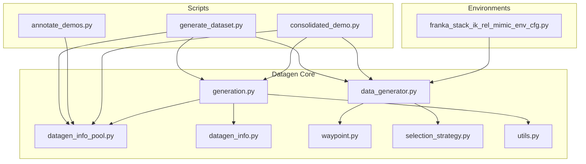
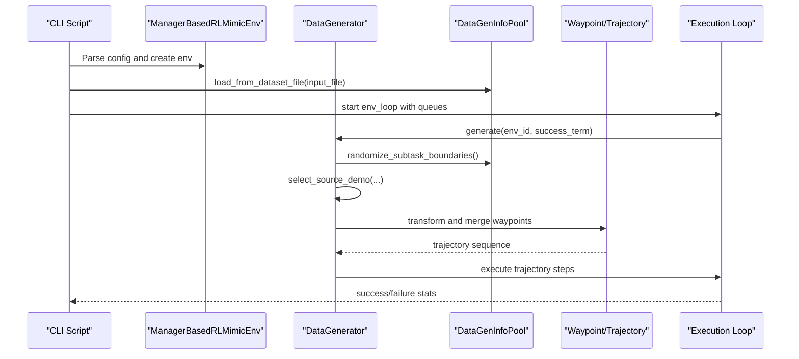
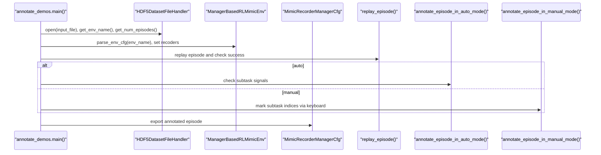
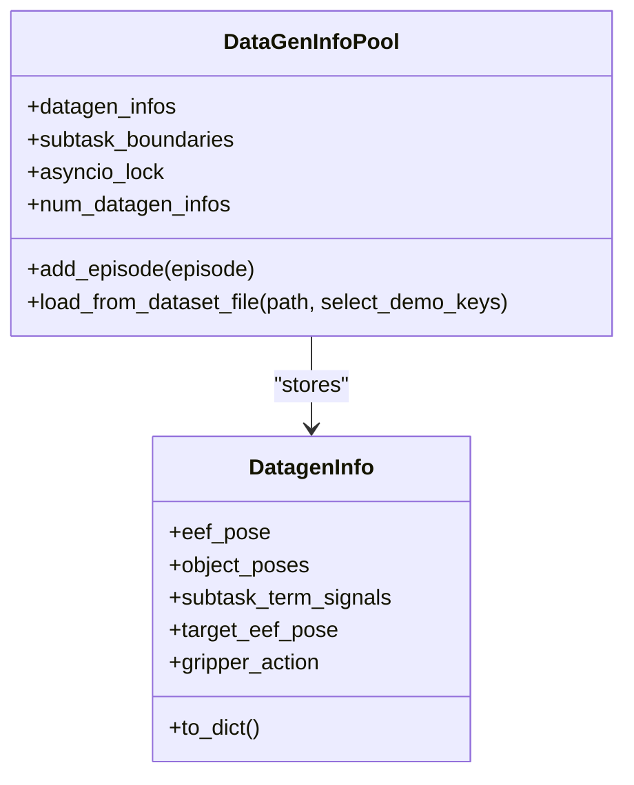
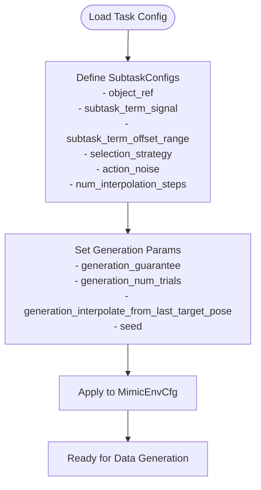
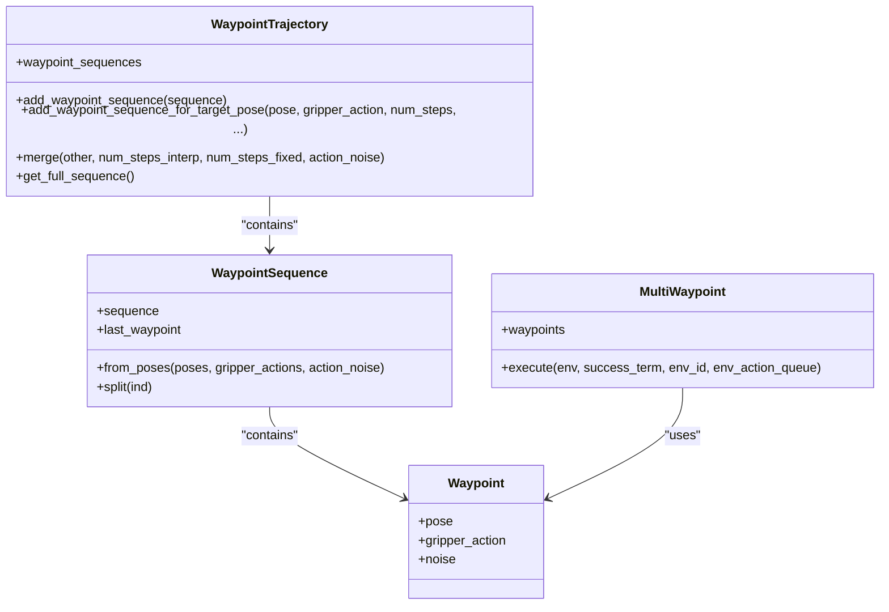
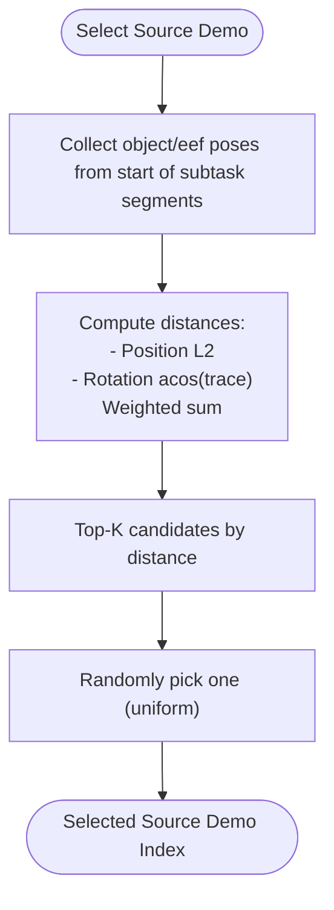
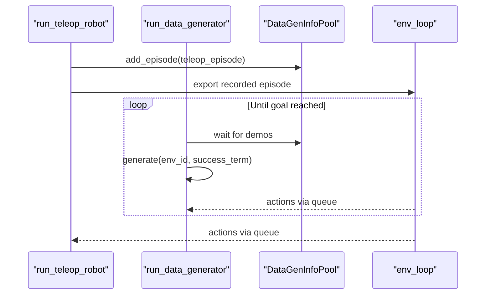
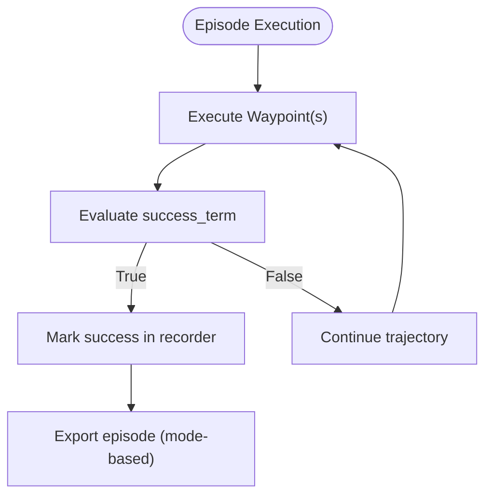
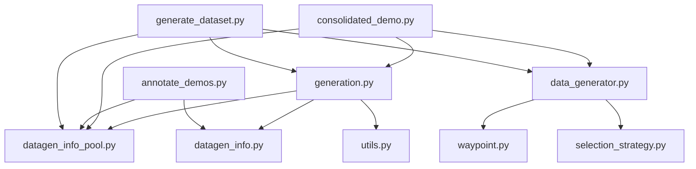

# Imitation Learning API

<cite>
**Referenced Files in This Document**
- [generate_dataset.py](file://scripts/imitation_learning/isaaclab_mimic/generate_dataset.py)
- [annotate_demos.py](file://scripts/imitation_learning/isaaclab_mimic/annotate_demos.py)
- [consolidated_demo.py](file://scripts/imitation_learning/isaaclab_mimic/consolidated_demo.py)
- [generation.py](file://source/isaaclab_mimic/isaaclab_mimic/datagen/generation.py)
- [data_generator.py](file://source/isaaclab_mimic/isaaclab_mimic/datagen/data_generator.py)
- [datagen_info_pool.py](file://source/isaaclab_mimic/isaaclab_mimic/datagen/datagen_info_pool.py)
- [datagen_info.py](file://source/isaaclab_mimic/isaaclab_mimic/datagen/datagen_info.py)
- [waypoint.py](file://source/isaaclab_mimic/isaaclab_mimic/datagen/waypoint.py)
- [selection_strategy.py](file://source/isaaclab_mimic/isaaclab_mimic/datagen/selection_strategy.py)
- [utils.py](file://source/isaaclab_mimic/isaaclab_mimic/datagen/utils.py)
- [franka_stack_ik_rel_mimic_env_cfg.py](file://source/isaaclab_mimic/isaaclab_mimic/envs/franka_stack_ik_rel_mimic_env_cfg.py)
</cite>

## Table of Contents
1. [Introduction](#introduction)
2. [Project Structure](#project-structure)
3. [Core Components](#core-components)
4. [Architecture Overview](#architecture-overview)
5. [Detailed Component Analysis](#detailed-component-analysis)
6. [Dependency Analysis](#dependency-analysis)
7. [Performance Considerations](#performance-considerations)
8. [Troubleshooting Guide](#troubleshooting-guide)
9. [Conclusion](#conclusion)
10. [Appendices](#appendices)

## Introduction
This document provides comprehensive API documentation for the imitation learning system centered around the Mimic framework in the repository. It covers:
- Data generation interfaces for automated demonstration collection
- Demonstration annotation tools for subtask segmentation
- Dataset management APIs for storage, retrieval, and validation
- Environment configuration for mimic training and task-specific demonstrations
- Datagen utilities for waypoint generation and trajectory processing
- Environment setup for imitation learning tasks, reward engineering for demonstration matching, and policy evaluation procedures
- Dataset generation workflows, validation, and quality assessment
- Examples for custom demonstration collection, environment adaptation, and skill transfer
- Guidance on data efficiency, generalization evaluation, and demonstration quality optimization

## Project Structure
The imitation learning system is organized into:
- Scripts for end-to-end workflows: dataset generation, demonstration annotation, and consolidated demo collection
- Core datagen modules: data pools, selection strategies, waypoint management, and generation orchestration
- Environment configuration examples tailored for mimic tasks



**Diagram sources**
- [generate_dataset.py:79-159](file://scripts/imitation_learning/isaaclab_mimic/generate_dataset.py#L79-L159)
- [annotate_demos.py:148-282](file://scripts/imitation_learning/isaaclab_mimic/annotate_demos.py#L148-L282)
- [consolidated_demo.py:350-475](file://scripts/imitation_learning/isaaclab_mimic/consolidated_demo.py#L350-L475)
- [generation.py:134-233](file://source/isaaclab_mimic/isaaclab_mimic/datagen/generation.py#L134-L233)
- [data_generator.py:130-784](file://source/isaaclab_mimic/isaaclab_mimic/datagen/data_generator.py#L130-L784)
- [datagen_info_pool.py:13-188](file://source/isaaclab_mimic/isaaclab_mimic/datagen/datagen_info_pool.py#L13-L188)
- [datagen_info.py:12-90](file://source/isaaclab_mimic/isaaclab_mimic/datagen/datagen_info.py#L12-L90)
- [waypoint.py:19-427](file://source/isaaclab_mimic/isaaclab_mimic/datagen/waypoint.py#L19-L427)
- [selection_strategy.py:19-309](file://source/isaaclab_mimic/isaaclab_mimic/datagen/selection_strategy.py#L19-L309)
- [utils.py:172-215](file://source/isaaclab_mimic/isaaclab_mimic/datagen/utils.py#L172-L215)
- [franka_stack_ik_rel_mimic_env_cfg.py:12-134](file://source/isaaclab_mimic/isaaclab_mimic/envs/franka_stack_ik_rel_mimic_env_cfg.py#L12-L134)

**Section sources**
- [generate_dataset.py:1-159](file://scripts/imitation_learning/isaaclab_mimic/generate_dataset.py#L1-L159)
- [annotate_demos.py:1-455](file://scripts/imitation_learning/isaaclab_mimic/annotate_demos.py#L1-L455)
- [consolidated_demo.py:1-475](file://scripts/imitation_learning/isaaclab_mimic/consolidated_demo.py#L1-L475)
- [generation.py:1-233](file://source/isaaclab_mimic/isaaclab_mimic/datagen/generation.py#L1-L233)
- [data_generator.py:1-784](file://source/isaaclab_mimic/isaaclab_mimic/datagen/data_generator.py#L1-L784)
- [datagen_info_pool.py:1-188](file://source/isaaclab_mimic/isaaclab_mimic/datagen/datagen_info_pool.py#L1-L188)
- [datagen_info.py:1-90](file://source/isaaclab_mimic/isaaclab_mimic/datagen/datagen_info.py#L1-L90)
- [waypoint.py:1-427](file://source/isaaclab_mimic/isaaclab_mimic/datagen/waypoint.py#L1-L427)
- [selection_strategy.py:1-309](file://source/isaaclab_mimic/isaaclab_mimic/datagen/selection_strategy.py#L1-L309)
- [utils.py:1-215](file://source/isaaclab_mimic/isaaclab_mimic/datagen/utils.py#L1-L215)
- [franka_stack_ik_rel_mimic_env_cfg.py:1-134](file://source/isaaclab_mimic/isaaclab_mimic/envs/franka_stack_ik_rel_mimic_env_cfg.py#L1-L134)

## Core Components
- DataGenerator: Orchestrates subtask segmentation, source demo selection, pose transformation, waypoint merging, and trajectory execution across multiple end-effectors with support for coordination and synchronization constraints.
- DataGenInfoPool: Manages a shared pool of DatagenInfo objects extracted from episodes, enabling safe concurrent access via asyncio locks and dynamic loading from HDF5 datasets.
- Waypoint and Trajectory Classes: Provide structured representation of robot control targets, interpolation, fixed steps, and multi-EF waypoint execution with noise injection.
- Selection Strategies: Implement strategies such as random selection and nearest-neighbor selection based on object pose or robot distance to choose appropriate source subtask segments.
- Generation Orchestration: Async environment loop, action queues, and success-term gating coordinate data generation across multiple environments.
- Annotation Tools: Utilities to replay episodes, record datagen_info, and annotate subtask completion signals automatically or manually.
- Environment Configuration: Task-specific configuration for subtask definitions, offsets, selection strategies, and generation parameters.

**Section sources**
- [data_generator.py:130-784](file://source/isaaclab_mimic/isaaclab_mimic/datagen/data_generator.py#L130-L784)
- [datagen_info_pool.py:13-188](file://source/isaaclab_mimic/isaaclab_mimic/datagen/datagen_info_pool.py#L13-L188)
- [waypoint.py:19-427](file://source/isaaclab_mimic/isaaclab_mimic/datagen/waypoint.py#L19-L427)
- [selection_strategy.py:19-309](file://source/isaaclab_mimic/isaaclab_mimic/datagen/selection_strategy.py#L19-L309)
- [generation.py:26-233](file://source/isaaclab_mimic/isaaclab_mimic/datagen/generation.py#L26-L233)
- [annotate_demos.py:148-282](file://scripts/imitation_learning/isaaclab_mimic/annotate_demos.py#L148-L282)
- [franka_stack_ik_rel_mimic_env_cfg.py:12-134](file://source/isaaclab_mimic/isaaclab_mimic/envs/franka_stack_ik_rel_mimic_env_cfg.py#L12-L134)

## Architecture Overview
The system integrates environment configuration, datagen utilities, and asynchronous execution to generate demonstrations that match task specifications. The generation pipeline parses demonstrations into object-centric subtasks, selects appropriate source segments, transforms them to new scenes, merges trajectories, and executes them under success conditions.



**Diagram sources**
- [generate_dataset.py:79-159](file://scripts/imitation_learning/isaaclab_mimic/generate_dataset.py#L79-L159)
- [generation.py:26-132](file://source/isaaclab_mimic/isaaclab_mimic/datagen/generation.py#L26-L132)
- [data_generator.py:315-784](file://source/isaaclab_mimic/isaaclab_mimic/datagen/data_generator.py#L315-L784)
- [datagen_info_pool.py:168-188](file://source/isaaclab_mimic/isaaclab_mimic/datagen/datagen_info_pool.py#L168-L188)
- [waypoint.py:364-427](file://source/isaaclab_mimic/isaaclab_mimic/datagen/waypoint.py#L364-L427)

## Detailed Component Analysis

### Data Generation Interfaces
- Automated dataset generation:
  - CLI entry points configure environment, load source datasets, and start async generation across multiple environments.
  - Environment configuration sets up recorders, disables unwanted terminations, and defines export modes.
  - Async orchestration coordinates resets, action queues, and success-term gating.

```mermaid
sequenceDiagram
participant Main as "generate_dataset.main()"
participant Cfg as "setup_env_config()"
participant Env as "gym.make(...)"
participant Setup as "setup_async_generation()"
participant Loop as "env_loop()"
Main->>Cfg : env_name, output_dir, output_file_name, num_envs, device
Cfg-->>Main : env_cfg, success_term
Main->>Env : gym.make(env_name, cfg=env_cfg)
Main->>Setup : env, num_envs, input_file, success_term
Setup-->>Main : tasks, queues, info_pool
Main->>Loop : run env_loop with queues and pool
```

**Diagram sources**
- [generate_dataset.py:79-159](file://scripts/imitation_learning/isaaclab_mimic/generate_dataset.py#L79-L159)
- [generation.py:134-189](file://source/isaaclab_mimic/isaaclab_mimic/datagen/generation.py#L134-L189)
- [generation.py:192-233](file://source/isaaclab_mimic/isaaclab_mimic/datagen/generation.py#L192-L233)

**Section sources**
- [generate_dataset.py:79-159](file://scripts/imitation_learning/isaaclab_mimic/generate_dataset.py#L79-L159)
- [generation.py:134-233](file://source/isaaclab_mimic/isaaclab_mimic/datagen/generation.py#L134-L233)

### Demonstration Annotation Tools
- Replay and annotate episodes:
  - Automatic mode replays episodes and checks success and subtask term signals.
  - Manual mode allows keyboard-driven replay and marking of subtask termination indices.
  - Recorder terms capture end-effector poses, object poses, target EEF poses, and subtask term signals.



**Diagram sources**
- [annotate_demos.py:148-282](file://scripts/imitation_learning/isaaclab_mimic/annotate_demos.py#L148-L282)
- [annotate_demos.py:284-365](file://scripts/imitation_learning/isaaclab_mimic/annotate_demos.py#L284-L365)
- [annotate_demos.py:367-446](file://scripts/imitation_learning/isaaclab_mimic/annotate_demos.py#L367-L446)

**Section sources**
- [annotate_demos.py:148-282](file://scripts/imitation_learning/isaaclab_mimic/annotate_demos.py#L148-L282)
- [annotate_demos.py:284-365](file://scripts/imitation_learning/isaaclab_mimic/annotate_demos.py#L284-L365)
- [annotate_demos.py:367-446](file://scripts/imitation_learning/isaaclab_mimic/annotate_demos.py#L367-L446)

### Dataset Management APIs
- DataGenInfoPool:
  - Loads episodes from HDF5, extracts datagen_info, and computes subtask boundaries using termination signals.
  - Supports async-safe addition of episodes and maintains boundaries per end-effector and subtask.
- DatagenInfo:
  - Encapsulates per-timestep data needed for generation: EEF poses, object poses, target EEF poses, gripper actions, and subtask term signals.



**Diagram sources**
- [datagen_info_pool.py:13-188](file://source/isaaclab_mimic/isaaclab_mimic/datagen/datagen_info_pool.py#L13-L188)
- [datagen_info.py:12-90](file://source/isaaclab_mimic/isaaclab_mimic/datagen/datagen_info.py#L12-L90)

**Section sources**
- [datagen_info_pool.py:13-188](file://source/isaaclab_mimic/isaaclab_mimic/datagen/datagen_info_pool.py#L13-L188)
- [datagen_info.py:12-90](file://source/isaaclab_mimic/isaaclab_mimic/datagen/datagen_info.py#L12-L90)

### Environment Configuration for Mimic Training
- Task-specific configuration:
  - Defines subtask configurations with object references, termination signals, offset ranges, selection strategies, and action noise.
  - Sets generation parameters such as guarantee mode, number of trials, interpolation steps, and seed.
- Example configuration demonstrates subtask segmentation for a stacking task with multiple cubes.



**Diagram sources**
- [franka_stack_ik_rel_mimic_env_cfg.py:12-134](file://source/isaaclab_mimic/isaaclab_mimic/envs/franka_stack_ik_rel_mimic_env_cfg.py#L12-L134)

**Section sources**
- [franka_stack_ik_rel_mimic_env_cfg.py:12-134](file://source/isaaclab_mimic/isaaclab_mimic/envs/franka_stack_ik_rel_mimic_env_cfg.py#L12-L134)

### Datagen Utilities: Waypoint Generation and Trajectory Processing
- Waypoint and Trajectory:
  - WaypointSequence and WaypointTrajectory enable interpolation, fixed steps, and merging of trajectories.
  - MultiWaypoint executes actions for multiple end-effectors concurrently with noise injection.
- Transformation utilities:
  - Pose transformations support delta-object pose and object-relative transformations for adapting source segments to new scenes.



**Diagram sources**
- [waypoint.py:19-427](file://source/isaaclab_mimic/isaaclab_mimic/datagen/waypoint.py#L19-L427)

**Section sources**
- [waypoint.py:19-427](file://source/isaaclab_mimic/isaaclab_mimic/datagen/waypoint.py#L19-L427)

### Selection Strategies for Source Demo Matching
- Strategy registry and selection:
  - RandomStrategy picks uniformly at random.
  - NearestNeighborObjectStrategy selects based on object pose distance (position and rotation).
  - NearestNeighborRobotDistanceStrategy selects based on minimal robot distance to transformed first pose.
- K-nearest neighbor selection with random tie-breaking.



**Diagram sources**
- [selection_strategy.py:100-309](file://source/isaaclab_mimic/isaaclab_mimic/datagen/selection_strategy.py#L100-L309)

**Section sources**
- [selection_strategy.py:19-309](file://source/isaaclab_mimic/isaaclab_mimic/datagen/selection_strategy.py#L19-L309)

### Consolidated Demo Collection and Real-Time Generation
- Teleoperation and generation coexistence:
  - Dedicated environment index for teleoperation while others generate demonstrations.
  - Shared DataGenInfoPool populated from recorded teleops and/or source datasets.
- Rate limiting and success-triggered recording.



**Diagram sources**
- [consolidated_demo.py:192-475](file://scripts/imitation_learning/isaaclab_mimic/consolidated_demo.py#L192-L475)
- [datagen_info_pool.py:71-83](file://source/isaaclab_mimic/isaaclab_mimic/datagen/datagen_info_pool.py#L71-L83)

**Section sources**
- [consolidated_demo.py:192-475](file://scripts/imitation_learning/isaaclab_mimic/consolidated_demo.py#L192-L475)
- [datagen_info_pool.py:71-83](file://source/isaaclab_mimic/isaaclab_mimic/datagen/datagen_info_pool.py#L71-L83)

### Policy Evaluation Procedures
- Success-term gating:
  - Generation and annotation scripts rely on a success termination term to mark demonstrations as successful.
  - Execution loop and waypoint execution evaluate success at each step.
- Export modes:
  - Separate files for succeeded and failed demonstrations or succeeded-only export based on configuration.



**Diagram sources**
- [generation.py:108-131](file://source/isaaclab_mimic/isaaclab_mimic/datagen/generation.py#L108-L131)
- [waypoint.py:418-427](file://source/isaaclab_mimic/isaaclab_mimic/datagen/waypoint.py#L418-L427)
- [generation.py:184-188](file://source/isaaclab_mimic/isaaclab_mimic/datagen/generation.py#L184-L188)

**Section sources**
- [generation.py:108-131](file://source/isaaclab_mimic/isaaclab_mimic/datagen/generation.py#L108-L131)
- [waypoint.py:418-427](file://source/isaaclab_mimic/isaaclab_mimic/datagen/waypoint.py#L418-L427)
- [generation.py:184-188](file://source/isaaclab_mimic/isaaclab_mimic/datagen/generation.py#L184-L188)

## Dependency Analysis
The following diagram highlights key dependencies among core modules:



**Diagram sources**
- [generate_dataset.py:73-76](file://scripts/imitation_learning/isaaclab_mimic/generate_dataset.py#L73-L76)
- [annotate_demos.py:67-76](file://scripts/imitation_learning/isaaclab_mimic/annotate_demos.py#L67-L76)
- [consolidated_demo.py:90-96](file://scripts/imitation_learning/isaaclab_mimic/consolidated_demo.py#L90-L96)
- [generation.py:15-18](file://source/isaaclab_mimic/isaaclab_mimic/datagen/generation.py#L15-L18)
- [data_generator.py:14-26](file://source/isaaclab_mimic/isaaclab_mimic/datagen/data_generator.py#L14-L26)
- [datagen_info_pool.py:8-10](file://source/isaaclab_mimic/isaaclab_mimic/datagen/datagen_info_pool.py#L8-L10)
- [datagen_info.py:9-10](file://source/isaaclab_mimic/isaaclab_mimic/datagen/datagen_info.py#L9-L10)
- [waypoint.py:14-16](file://source/isaaclab_mimic/isaaclab_mimic/datagen/waypoint.py#L14-L16)
- [selection_strategy.py:10-13](file://source/isaaclab_mimic/isaaclab_mimic/datagen/selection_strategy.py#L10-L13)
- [utils.py:14-16](file://source/isaaclab_mimic/isaaclab_mimic/datagen/utils.py#L14-L16)

**Section sources**
- [generate_dataset.py:73-76](file://scripts/imitation_learning/isaaclab_mimic/generate_dataset.py#L73-L76)
- [annotate_demos.py:67-76](file://scripts/imitation_learning/isaaclab_mimic/annotate_demos.py#L67-L76)
- [consolidated_demo.py:90-96](file://scripts/imitation_learning/isaaclab_mimic/consolidated_demo.py#L90-L96)
- [generation.py:15-18](file://source/isaaclab_mimic/isaaclab_mimic/datagen/generation.py#L15-L18)
- [data_generator.py:14-26](file://source/isaaclab_mimic/isaaclab_mimic/datagen/data_generator.py#L14-L26)
- [datagen_info_pool.py:8-10](file://source/isaaclab_mimic/isaaclab_mimic/datagen/datagen_info_pool.py#L8-L10)
- [datagen_info.py:9-10](file://source/isaaclab_mimic/isaaclab_mimic/datagen/datagen_info.py#L9-L10)
- [waypoint.py:14-16](file://source/isaaclab_mimic/isaaclab_mimic/datagen/waypoint.py#L14-L16)
- [selection_strategy.py:10-13](file://source/isaaclab_mimic/isaaclab_mimic/datagen/selection_strategy.py#L10-L13)
- [utils.py:14-16](file://source/isaaclab_mimic/isaaclab_mimic/datagen/utils.py#L14-L16)

## Performance Considerations
- Asynchronous execution:
  - Use of asyncio queues and event loops enables parallel generation across multiple environments and efficient action dispatch.
- Pose computations:
  - Distance metrics and pose transformations are vectorized using PyTorch for scalability.
- Selection strategies:
  - Nearest-neighbor strategies can be tuned via K and weighting to balance diversity and fidelity.
- Export modes:
  - Choose succeeded-only export to reduce storage overhead when only successful demonstrations are needed.

[No sources needed since this section provides general guidance]

## Troubleshooting Guide
- Missing success termination term:
  - Generation and annotation scripts require a success termination term; absence raises a NotImplementedError.
- Deprecated mimic API signature:
  - Warning logged when target_eef_pose_to_action still uses the old noise parameter instead of action_noise_dict.
- Subtask term signals:
  - Automatic annotation verifies that all subtask signals are annotated; otherwise, the episode is skipped.
- Dataset validation:
  - Subtask boundaries are validated against offset ranges to prevent empty or out-of-order segments.

**Section sources**
- [generate_dataset.py:105-111](file://scripts/imitation_learning/isaaclab_mimic/generate_dataset.py#L105-L111)
- [annotate_demos.py:206-213](file://scripts/imitation_learning/isaaclab_mimic/annotate_demos.py#L206-L213)
- [datagen_info_pool.py:142-165](file://source/isaaclab_mimic/isaaclab_mimic/datagen/datagen_info_pool.py#L142-L165)
- [generation.py:167-174](file://source/isaaclab_mimic/isaaclab_mimic/datagen/generation.py#L167-L174)

## Conclusion
The imitation learning system provides a modular, asynchronous pipeline for generating demonstrations from human demos, annotating subtasks, and adapting trajectories to new scenes. Its configuration-driven design enables task-specific customization, while robust selection strategies and trajectory processing ensure high-quality, generalizable datasets suitable for policy training and evaluation.

[No sources needed since this section summarizes without analyzing specific files]

## Appendices

### API Reference: Data Generation CLI
- Script: generate_dataset.py
- Purpose: Generate demonstrations using a source dataset and environment configuration
- Key arguments:
  - --task: Environment/task name
  - --generation_num_trials: Number of demonstrations to generate
  - --num_envs: Number of parallel environments
  - --input_file: Source dataset path
  - --output_file: Generated dataset path
  - --pause_subtask: Pause after each subtask for debugging
  - --enable_pinocchio: Enable Pinocchio for IK controllers
- Behavior:
  - Parses environment configuration
  - Loads source dataset into DataGenInfoPool
  - Starts async generation loop with success-term gating
  - Exports episodes based on configured export mode

**Section sources**
- [generate_dataset.py:17-45](file://scripts/imitation_learning/isaaclab_mimic/generate_dataset.py#L17-L45)
- [generate_dataset.py:89-127](file://scripts/imitation_learning/isaaclab_mimic/generate_dataset.py#L89-L127)

### API Reference: Demonstration Annotation CLI
- Script: annotate_demos.py
- Purpose: Add mimic annotations to existing datasets
- Key arguments:
  - --task: Environment/task name
  - --input_file: Input dataset path
  - --output_file: Annotated dataset path
  - --auto: Automatic annotation using environment-provided subtask signals
  - --enable_pinocchio: Enable Pinocchio
- Behavior:
  - Loads dataset and environment
  - Records datagen_info and subtask term signals
  - Supports manual marking or automatic detection
  - Exports annotated episodes with success flags

**Section sources**
- [annotate_demos.py:17-40](file://scripts/imitation_learning/isaaclab_mimic/annotate_demos.py#L17-L40)
- [annotate_demos.py:148-282](file://scripts/imitation_learning/isaaclab_mimic/annotate_demos.py#L148-L282)

### API Reference: Consolidated Demo Collection CLI
- Script: consolidated_demo.py
- Purpose: Record teleoperated demonstrations and run real-time generation
- Key arguments:
  - --task: Environment/task name
  - --num_demos: Number of demos to record (0 for infinite)
  - --num_success_steps: Steps with success to mark demo successful
  - --num_envs: Total environments (teleop + generation)
  - --teleop_env_index: Environment index for teleoperation
  - --teleop_device: Teleop device (keyboard/spacemouse)
  - --step_hz: Simulation stepping rate
  - --input_file: Source dataset path
  - --output_file: Recorded demos path
  - --generated_output_file: Generated demos path
- Behavior:
  - Runs teleop and generation concurrently
  - Uses DataGenInfoPool to populate source demos
  - Exports recorded and generated episodes

**Section sources**
- [consolidated_demo.py:17-66](file://scripts/imitation_learning/isaaclab_mimic/consolidated_demo.py#L17-L66)
- [consolidated_demo.py:350-475](file://scripts/imitation_learning/isaaclab_mimic/consolidated_demo.py#L350-L475)

### API Reference: DataGenInfoPool
- Methods:
  - add_episode(episode): Extract and append DatagenInfo, compute subtask boundaries
  - load_from_dataset_file(file_path, select_demo_keys): Load episodes from HDF5
  - Properties: datagen_infos, subtask_boundaries, asyncio_lock, num_datagen_infos
- Notes:
  - Uses asyncio lock for thread-safe concurrent access
  - Validates subtask termination signal ordering and offset ranges

**Section sources**
- [datagen_info_pool.py:71-188](file://source/isaaclab_mimic/isaaclab_mimic/datagen/datagen_info_pool.py#L71-L188)

### API Reference: DataGenerator
- Methods:
  - generate_trajectory(...): Select source, transform, and build trajectory
  - generate(...): Main generation loop with success-term gating and export
  - randomize_subtask_boundaries(): Apply random offsets to subtask boundaries
  - select_source_demo(...): Delegate to selection strategy
- Configuration:
  - Uses environment subtask_configs and datagen_config
  - Supports coordination and synchronization constraints

**Section sources**
- [data_generator.py:315-784](file://source/isaaclab_mimic/isaaclab_mimic/datagen/data_generator.py#L315-L784)
- [data_generator.py:190-237](file://source/isaaclab_mimic/isaaclab_mimic/datagen/data_generator.py#L190-L237)

### API Reference: Waypoint and Trajectory
- Classes:
  - Waypoint: Pose, gripper action, noise
  - WaypointSequence: From poses, split, last waypoint
  - WaypointTrajectory: Add sequences, merge with interpolation/fixed steps, get full sequence
  - MultiWaypoint: Execute actions for multiple EEFs
- Execution:
  - target_eef_pose_to_action invoked with action_noise_dict or legacy noise parameter

**Section sources**
- [waypoint.py:19-427](file://source/isaaclab_mimic/isaaclab_mimic/datagen/waypoint.py#L19-L427)

### API Reference: Selection Strategies
- Strategies:
  - random: Uniform random selection
  - nearest_neighbor_object: KNN by object pose distance
  - nearest_neighbor_robot_distance: KNN by robot distance to transformed first pose
- Registration:
  - Automatic registration via metaclass

**Section sources**
- [selection_strategy.py:19-309](file://source/isaaclab_mimic/isaaclab_mimic/datagen/selection_strategy.py#L19-L309)

### API Reference: Environment Configuration Example
- Configuration:
  - SubtaskConfigs with object_ref, subtask_term_signal, offset ranges, selection strategy, action noise, interpolation steps
  - Generation parameters: guarantee, num_trials, interpolation behavior, seed
- Application:
  - Used by tasks such as stacking cubes with IK controllers

**Section sources**
- [franka_stack_ik_rel_mimic_env_cfg.py:12-134](file://source/isaaclab_mimic/isaaclab_mimic/envs/franka_stack_ik_rel_mimic_env_cfg.py#L12-L134)