# Reinforcement Learning Training API

<cite>
**Referenced Files in This Document**
- [rl_cfg.py](file://source/isaaclab_rl/isaaclab_rl/rsl_rl/rl_cfg.py)
- [vecenv_wrapper.py](file://source/isaaclab_rl/isaaclab_rl/rsl_rl/vecenv_wrapper.py)
- [train.py](file://scripts/reinforcement_learning/rsl_rl/train.py)
- [cli_args.py](file://scripts/reinforcement_learning/rsl_rl/cli_args.py)
- [distillation_cfg.py](file://source/isaaclab_rl/isaaclab_rl/rsl_rl/distillation_cfg.py)
- [rnd_cfg.py](file://source/isaaclab_rl/isaaclab_rl/rsl_rl/rnd_cfg.py)
- [symmetry_cfg.py](file://source/isaaclab_rl/isaaclab_rl/rsl_rl/symmetry_cfg.py)
- [curriculum_manager.py](file://source/isaaclab/isaaclab/managers/curriculum_manager.py)
- [multi_gpu.rst](file://docs/source/features/multi_gpu.rst)
- [benchmark_rsl_rl.py](file://scripts/benchmarks/benchmark_rsl_rl.py)
- [h1_locomotion.py](file://scripts/demos/h1_locomotion.py)
- [tuner.py](file://scripts/reinforcement_learning/ray/tuner.py)
- [test_environments_training.py](file://source/isaaclab_tasks/test/benchmarking/test_environments_training.py)
- [env_benchmark_test_utils.py](file://source/isaaclab_tasks/test/benchmarking/env_benchmark_test_utils.py)
</cite>

## Table of Contents
1. [Introduction](#introduction)
2. [Project Structure](#project-structure)
3. [Core Components](#core-components)
4. [Architecture Overview](#architecture-overview)
5. [Detailed Component Analysis](#detailed-component-analysis)
6. [Dependency Analysis](#dependency-analysis)
7. [Performance Considerations](#performance-considerations)
8. [Troubleshooting Guide](#troubleshooting-guide)
9. [Conclusion](#conclusion)
10. [Appendices](#appendices)

## Introduction
This document provides comprehensive API documentation for the reinforcement learning training system built on top of the Isaac Lab environment and the RSL-RL library. It covers the RSL-RL wrapper interfaces, training configuration classes, experiment management APIs, PPO algorithm implementation, neural network architectures, hyperparameter tuning interfaces, distributed training support, multi-GPU coordination, checkpoint management, training pipeline orchestration, evaluation procedures, performance monitoring APIs, agent configuration classes for ablation variants and sensor fusion strategies, examples of custom training setups, curriculum learning implementation, and experiment tracking. It also addresses training optimization, convergence analysis, and statistical validation procedures.

## Project Structure
The RL training system is organized around:
- RSL-RL configuration classes that define policies, algorithms, and runners
- A vectorized environment wrapper that bridges Isaac Lab environments to RSL-RL
- Training scripts that orchestrate environment creation, logging, checkpoint loading, and learner execution
- Curriculum management utilities for progressive difficulty scheduling
- Distributed training documentation and benchmarking utilities
- Hyperparameter tuning via Ray Tune
- Evaluation and KPI reporting for statistical validation

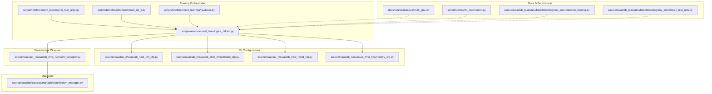

**Diagram sources**
- [train.py:119-213](file://scripts/reinforcement_learning/rsl_rl/train.py#L119-L213)
- [cli_args.py:42-92](file://scripts/reinforcement_learning/rsl_rl/cli_args.py#L42-L92)
- [rl_cfg.py:22-231](file://source/isaaclab_rl/isaaclab_rl/rsl_rl/rl_cfg.py#L22-L231)
- [distillation_cfg.py:18-84](file://source/isaaclab_rl/isaaclab_rl/rsl_rl/distillation_cfg.py#L18-L84)
- [rnd_cfg.py:11-100](file://source/isaaclab_rl/isaaclab_rl/rsl_rl/rnd_cfg.py#L11-L100)
- [symmetry_cfg.py:11-54](file://source/isaaclab_rl/isaaclab_rl/rsl_rl/symmetry_cfg.py#L11-L54)
- [vecenv_wrapper.py:14-210](file://source/isaaclab_rl/isaaclab_rl/rsl_rl/vecenv_wrapper.py#L14-L210)
- [curriculum_manager.py:22-204](file://source/isaaclab/isaaclab/managers/curriculum_manager.py#L22-L204)
- [multi_gpu.rst:30-222](file://docs/source/features/multi_gpu.rst#L30-L222)
- [benchmark_rsl_rl.py:158-190](file://scripts/benchmarks/benchmark_rsl_rl.py#L158-L190)
- [h1_locomotion.py:81-101](file://scripts/demos/h1_locomotion.py#L81-L101)
- [tuner.py:206-401](file://scripts/reinforcement_learning/ray/tuner.py#L206-L401)
- [test_environments_training.py:46-117](file://source/isaaclab_tasks/test/benchmarking/test_environments_training.py#L46-L117)
- [env_benchmark_test_utils.py:54-133](file://source/isaaclab_tasks/test/benchmarking/env_benchmark_test_utils.py#L54-L133)

**Section sources**
- [train.py:119-213](file://scripts/reinforcement_learning/rsl_rl/train.py#L119-L213)
- [rl_cfg.py:22-231](file://source/isaaclab_rl/isaaclab_rl/rsl_rl/rl_cfg.py#L22-L231)
- [vecenv_wrapper.py:14-210](file://source/isaaclab_rl/isaaclab_rl/rsl_rl/vecenv_wrapper.py#L14-L210)

## Core Components
This section documents the primary configuration and wrapper components used to define and run RL training.

- RslRlPpoActorCriticCfg: Defines the PPO actor-critic network architecture, including hidden dimensions, activation functions, optional proprioceptive and scan observation encoders, and critic-side scan encoding toggles.
- RslRlPpoActorCriticRecurrentCfg: Extends the base actor-critic configuration to support recurrent layers (LSTM/GRU) with configurable hidden dimensions and layers.
- RslRlPpoAlgorithmCfg: Specifies PPO algorithm parameters such as learning rate schedule, discount factor, GAE lambda, entropy coefficient, KL target, gradient clipping, value loss coefficient, clipping parameter, and optional RND and symmetry modules.
- RslRlOnPolicyRunnerCfg: Controls the training runner, including seed, device selection, rollout steps per environment, maximum iterations, empirical normalization, policy and algorithm configuration composition, action clipping, save interval, experiment/run naming, logger selection, resume/loading options, and checkpoint selection.
- RslRlVecEnvWrapper: Bridges Isaac Lab environments to RSL-RL’s VecEnv interface, handling observation grouping ("policy" and optional "critic"), privileged observation detection, action clipping, and compatibility with RSL-RL’s runner expectations.
- RslRlDistillationStudentTeacherCfg and RslRlDistillationAlgorithmCfg: Provide distillation-based training with student-teacher networks and algorithm parameters.
- RslRlRndCfg: Configures Random Network Distillation (RND) intrinsic reward scaling, schedules, normalization, and predictor/target network dimensions.
- RslRlSymmetryCfg: Enables symmetry-based data augmentation and mirror loss for training stability and ablation studies.

Key configuration classes and their responsibilities:
- Policy configurations: Define network topology and observation processing for actor/critic or student/teacher pairs.
- Algorithm configurations: Define PPO or distillation hyperparameters and optional auxiliary modules (RND, symmetry).
- Runner configurations: Control training lifecycle, logging, checkpointing, and device placement.

**Section sources**
- [rl_cfg.py:22-231](file://source/isaaclab_rl/isaaclab_rl/rsl_rl/rl_cfg.py#L22-L231)
- [distillation_cfg.py:18-84](file://source/isaaclab_rl/isaaclab_rl/rsl_rl/distillation_cfg.py#L18-L84)
- [rnd_cfg.py:11-100](file://source/isaaclab_rl/isaaclab_rl/rsl_rl/rnd_cfg.py#L11-L100)
- [symmetry_cfg.py:11-54](file://source/isaaclab_rl/isaaclab_rl/rsl_rl/symmetry_cfg.py#L11-L54)

## Architecture Overview
The training pipeline integrates environment creation, configuration parsing, wrapper instantiation, runner initialization, and learner execution. It supports distributed training via Torchrun and optional Ray Tune hyperparameter sweeps.

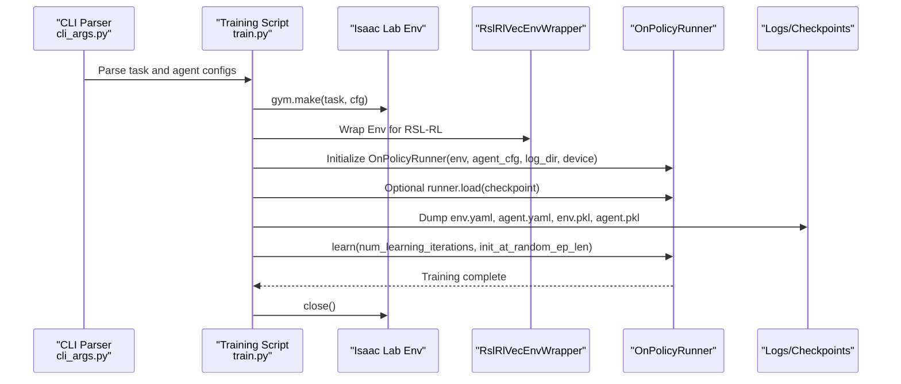

**Diagram sources**
- [cli_args.py:42-92](file://scripts/reinforcement_learning/rsl_rl/cli_args.py#L42-L92)
- [train.py:119-213](file://scripts/reinforcement_learning/rsl_rl/train.py#L119-L213)
- [vecenv_wrapper.py:14-210](file://source/isaaclab_rl/isaaclab_rl/rsl_rl/vecenv_wrapper.py#L14-L210)

## Detailed Component Analysis

### PPO Algorithm Implementation and Neural Networks
- Actor-Critic Topology:
  - Separate hidden layers for actor and critic networks.
  - Optional proprioceptive and scan encoders with distinct dimensions for actor and critic.
  - Scan encoding can be enabled only for the critic or shared across both.
  - Privileged observation encoders can be configured for the critic.
- Recurrent Extensions:
  - LSTM or GRU with configurable hidden dimensions and number of layers.
- PPO Hyperparameters:
  - Learning rate schedule, discount factor (gamma), GAE lambda, entropy coefficient, KL target, gradient norm clipping, value loss coefficient, and policy clipping parameter.
  - Optional RND intrinsic reward module and symmetry-based augmentation/mirror loss.

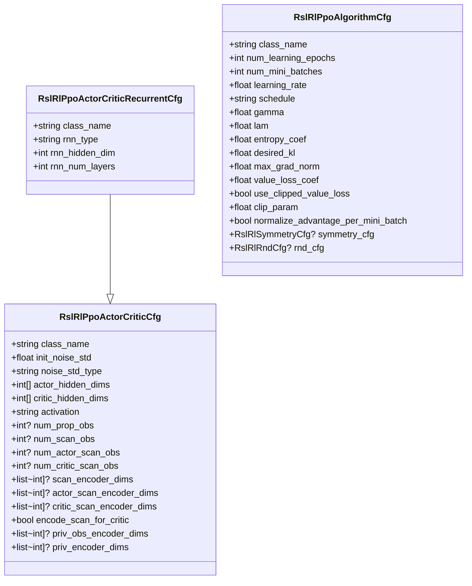

**Diagram sources**
- [rl_cfg.py:22-92](file://source/isaaclab_rl/isaaclab_rl/rsl_rl/rl_cfg.py#L22-L92)
- [rl_cfg.py:98-156](file://source/isaaclab_rl/isaaclab_rl/rsl_rl/rl_cfg.py#L98-L156)

**Section sources**
- [rl_cfg.py:22-156](file://source/isaaclab_rl/isaaclab_rl/rsl_rl/rl_cfg.py#L22-L156)

### RSL-RL Wrapper Interfaces
The wrapper adapts Isaac Lab environments to RSL-RL’s VecEnv interface:
- Observation grouping: Reads "policy" observations and optionally "critic" privileged observations.
- Action clipping: Applies per-environment action bounds when configured.
- Episode length buffer: Exposes and mutates the internal buffer for random episode length initialization.
- Compatibility: Ensures termination flags and timeouts are formatted for RSL-RL.

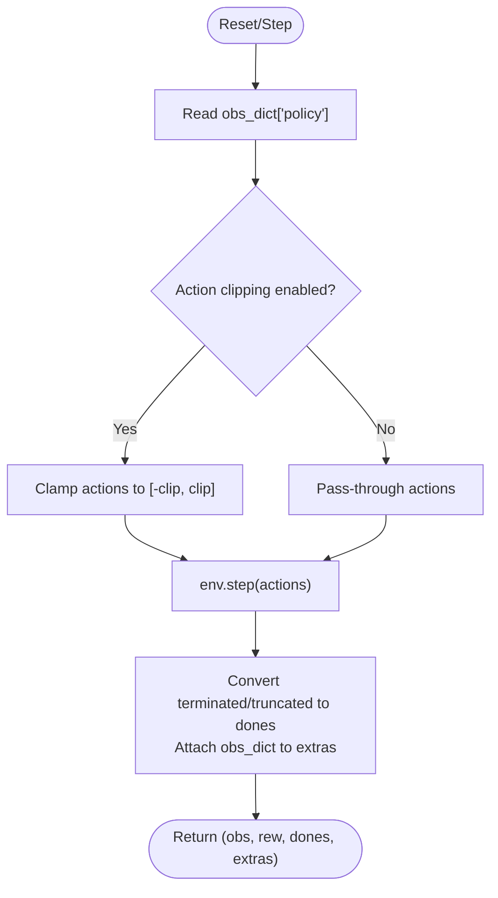

**Diagram sources**
- [vecenv_wrapper.py:165-188](file://source/isaaclab_rl/isaaclab_rl/rsl_rl/vecenv_wrapper.py#L165-L188)

**Section sources**
- [vecenv_wrapper.py:14-210](file://source/isaaclab_rl/isaaclab_rl/rsl_rl/vecenv_wrapper.py#L14-L210)

### Training Configuration Classes
- RslRlOnPolicyRunnerCfg:
  - Seed, device, rollout steps per environment, maximum iterations, empirical normalization toggle.
  - Policy and algorithm configuration composition.
  - Action clipping, save interval, experiment/run naming, logger selection (TensorBoard, Neptune, Weights & Biases).
  - Resume/load controls with regex-based run and checkpoint selection.
- CLI overrides:
  - Seed sampling, resume flags, load run/checkpoint patterns, run name, logger, and project names.

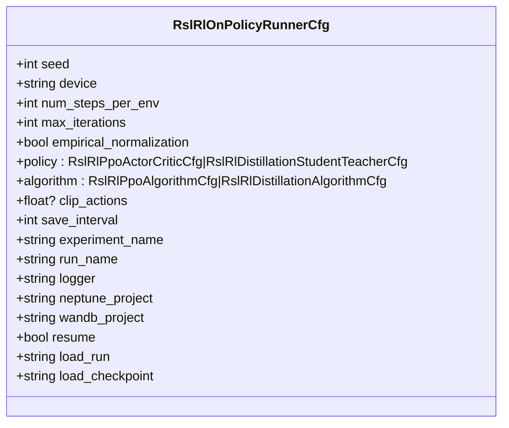

**Diagram sources**
- [rl_cfg.py:162-231](file://source/isaaclab_rl/isaaclab_rl/rsl_rl/rl_cfg.py#L162-L231)

**Section sources**
- [rl_cfg.py:162-231](file://source/isaaclab_rl/isaaclab_rl/rsl_rl/rl_cfg.py#L162-L231)
- [cli_args.py:42-92](file://scripts/reinforcement_learning/rsl_rl/cli_args.py#L42-L92)

### Experiment Management APIs
- Logging directories:
  - Root under logs/rsl_rl/<experiment_name>, with run directories named by timestamp and optional run name.
- Checkpoint management:
  - Resume training from latest matching run and checkpoint using regex patterns.
  - Export IO descriptors for manager-based environments when requested.
- Video recording:
  - Optional video recording during training with configurable intervals and lengths.
- Git state logging:
  - Captures repository state into logs for reproducibility.

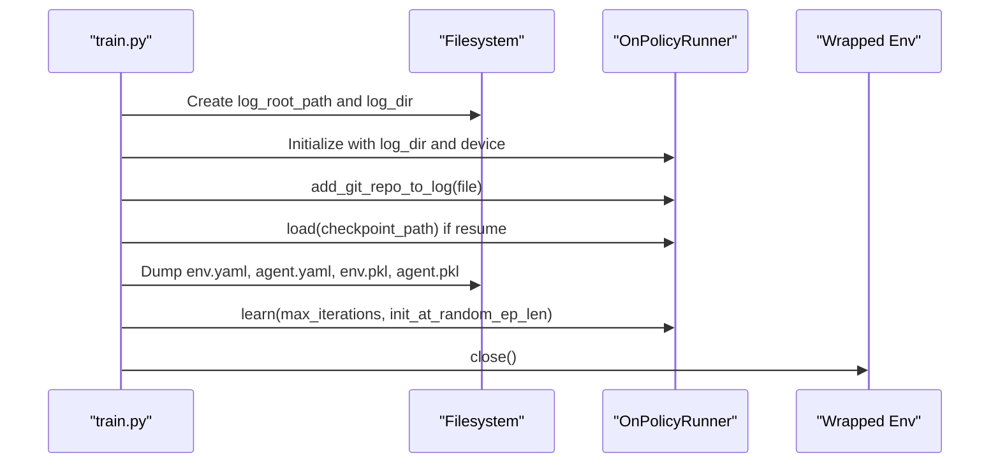

**Diagram sources**
- [train.py:145-212](file://scripts/reinforcement_learning/rsl_rl/train.py#L145-L212)

**Section sources**
- [train.py:145-212](file://scripts/reinforcement_learning/rsl_rl/train.py#L145-L212)

### Curriculum Learning Implementation
The curriculum manager progressively adjusts environment parameters to stabilize learning:
- Active terms are computed each step and logged under a structured namespace.
- Resetting terms clears their state and triggers per-term reset hooks.
- Iterable form exposes raw values per environment for downstream analysis.

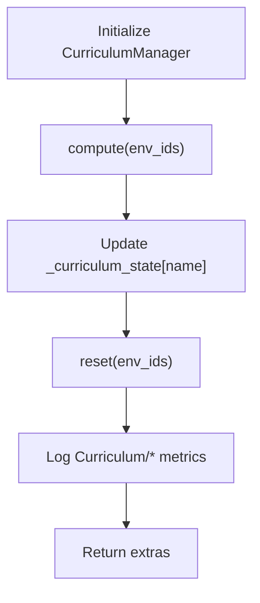

**Diagram sources**
- [curriculum_manager.py:124-122](file://source/isaaclab/isaaclab/managers/curriculum_manager.py#L124-L122)

**Section sources**
- [curriculum_manager.py:22-204](file://source/isaaclab/isaaclab/managers/curriculum_manager.py#L22-L204)

### Distributed Training Support and Multi-GPU Coordination
- Torchrun-based multi-GPU training:
  - One process per GPU, each with its own environment instance and policy copy.
  - Gradients synchronized across processes and broadcast back after each training step.
  - Device assignment per process and per-worker seeding for diversity.
- Multi-node training:
  - Requires rendezvous endpoint and node rank specification; performance may be limited by inter-node latency.

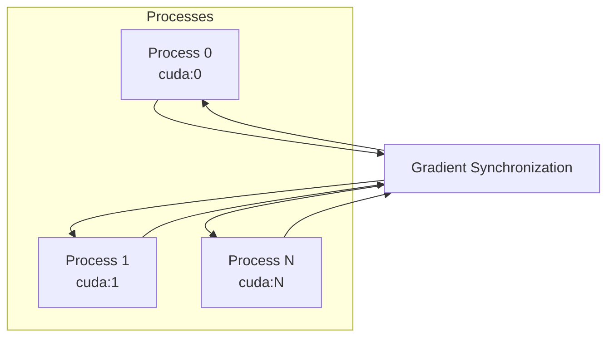

**Diagram sources**
- [multi_gpu.rst:30-222](file://docs/source/features/multi_gpu.rst#L30-L222)
- [train.py:135-144](file://scripts/reinforcement_learning/rsl_rl/train.py#L135-L144)

**Section sources**
- [multi_gpu.rst:30-222](file://docs/source/features/multi_gpu.rst#L30-L222)
- [train.py:135-144](file://scripts/reinforcement_learning/rsl_rl/train.py#L135-L144)

### Hyperparameter Tuning Interfaces
- Ray Tune integration:
  - Resource allocation per node, stopper for log extraction errors, and configurable metrics and modes.
  - Repeated runs per configuration and timeout controls for robust tuning.
- Benchmarking:
  - Automated training jobs with KPI evaluation and threshold validation across workflows.

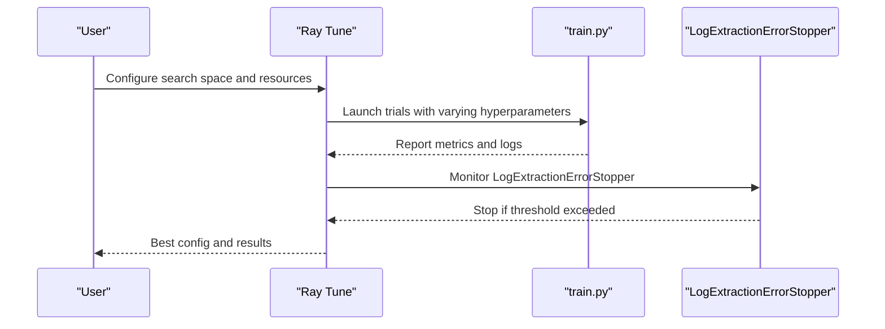

**Diagram sources**
- [tuner.py:206-401](file://scripts/reinforcement_learning/ray/tuner.py#L206-L401)
- [test_environments_training.py:46-117](file://source/isaaclab_tasks/test/benchmarking/test_environments_training.py#L46-L117)
- [env_benchmark_test_utils.py:54-133](file://source/isaaclab_tasks/test/benchmarking/env_benchmark_test_utils.py#L54-L133)

**Section sources**
- [tuner.py:206-401](file://scripts/reinforcement_learning/ray/tuner.py#L206-L401)
- [test_environments_training.py:46-117](file://source/isaaclab_tasks/test/benchmarking/test_environments_training.py#L46-L117)
- [env_benchmark_test_utils.py:54-133](file://source/isaaclab_tasks/test/benchmarking/env_benchmark_test_utils.py#L54-L133)

### Evaluation Procedures and Performance Monitoring
- KPI evaluation:
  - Job completion detection, success/failure categorization, and aggregated statistics across workflows.
- Threshold-based validation:
  - Lower and upper thresholds per environment configuration guide acceptance criteria.
- Benchmarking harness:
  - Automated training runs with optional distributed mode and max iteration limits.

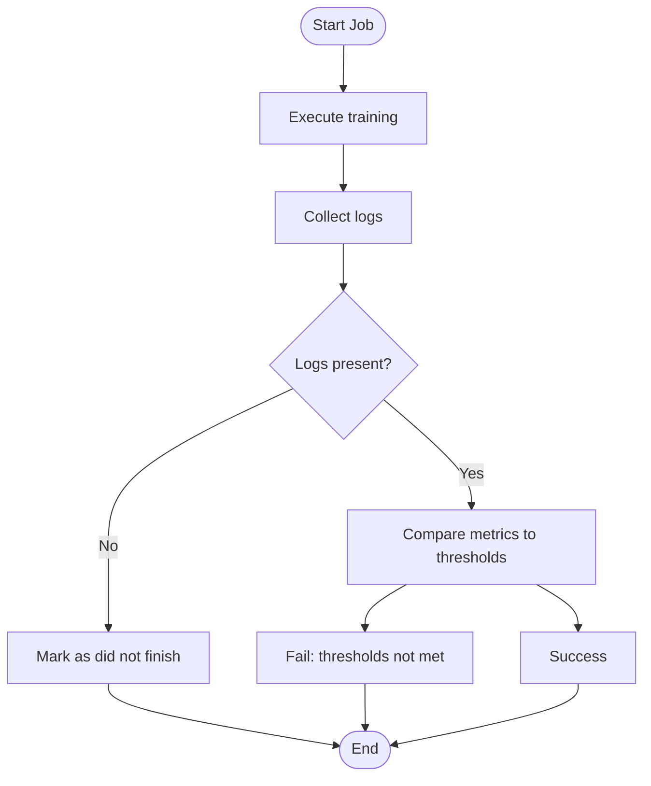

**Diagram sources**
- [env_benchmark_test_utils.py:54-133](file://source/isaaclab_tasks/test/benchmarking/env_benchmark_test_utils.py#L54-L133)
- [test_environments_training.py:46-117](file://source/isaaclab_tasks/test/benchmarking/test_environments_training.py#L46-L117)

**Section sources**
- [env_benchmark_test_utils.py:54-133](file://source/isaaclab_tasks/test/benchmarking/env_benchmark_test_utils.py#L54-L133)
- [test_environments_training.py:46-117](file://source/isaaclab_tasks/test/benchmarking/test_environments_training.py#L46-L117)

### Agent Configuration Classes for Ablation Variants and Sensor Fusion Strategies
- Ablation mapping:
  - Different combinations of proprioceptive, privileged, and scan observations for actor and critic heads.
  - Recommendations for scan encoding usage and avoidance of privileged observation encoding in the critic.
- Example tasks:
  - Multiple task IDs for ablation experiments with unified training scripts.

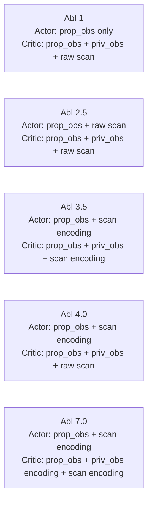

**Diagram sources**
- [README.md:1-145](file://README.md#L1-L145)

**Section sources**
- [README.md:1-145](file://README.md#L1-L145)

### Examples of Custom Training Setup, Curriculum Learning, and Experiment Tracking
- Custom actor registration:
  - Dynamically register custom actor classes after Omniverse availability.
- Curriculum logging:
  - Structured logging under Curriculum/<term>/<key> for analysis.
- IO descriptors export:
  - Export environment IO descriptors for manager-based RL environments when requested.

**Section sources**
- [train.py:20-28](file://scripts/reinforcement_learning/rsl_rl/train.py#L20-L28)
- [curriculum_manager.py:100-122](file://source/isaaclab/isaaclab/managers/curriculum_manager.py#L100-L122)
- [train.py:157-165](file://scripts/reinforcement_learning/rsl_rl/train.py#L157-L165)

## Dependency Analysis
The following diagram highlights key dependencies among components:

```mermaid
graph TB
Train["scripts/reinforcement_learning/rsl_rl/train.py"] --> Wrapper["source/isaaclab_rl/isaaclab_rl/rsl_rl/vecenv_wrapper.py"]
Train --> RLConfig["source/isaaclab_rl/isaaclab_rl/rsl_rl/rl_cfg.py"]
Train --> Distill["source/isaaclab_rl/isaaclab_rl/rsl_rl/distillation_cfg.py"]
Train --> Rnd["source/isaaclab_rl/isaaclab_rl/rsl_rl/rnd_cfg.py"]
Train --> Sym["source/isaaclab_rl/isaaclab_rl/rsl_rl/symmetry_cfg.py"]
Train --> CLI["scripts/reinforcement_learning/rsl_rl/cli_args.py"]
Wrapper --> Env["Isaac Lab Envs"]
Train --> Curri["source/isaaclab/isaaclab/managers/curriculum_manager.py"]
Train --> Bench["scripts/benchmarks/benchmark_rsl_rl.py"]
Train --> Demo["scripts/demos/h1_locomotion.py"]
Train --> RayTune["scripts/reinforcement_learning/ray/tuner.py"]
```

**Diagram sources**
- [train.py:119-213](file://scripts/reinforcement_learning/rsl_rl/train.py#L119-L213)
- [vecenv_wrapper.py:14-210](file://source/isaaclab_rl/isaaclab_rl/rsl_rl/vecenv_wrapper.py#L14-L210)
- [rl_cfg.py:22-231](file://source/isaaclab_rl/isaaclab_rl/rsl_rl/rl_cfg.py#L22-L231)
- [distillation_cfg.py:18-84](file://source/isaaclab_rl/isaaclab_rl/rsl_rl/distillation_cfg.py#L18-L84)
- [rnd_cfg.py:11-100](file://source/isaaclab_rl/isaaclab_rl/rsl_rl/rnd_cfg.py#L11-L100)
- [symmetry_cfg.py:11-54](file://source/isaaclab_rl/isaaclab_rl/rsl_rl/symmetry_cfg.py#L11-L54)
- [cli_args.py:42-92](file://scripts/reinforcement_learning/rsl_rl/cli_args.py#L42-L92)
- [curriculum_manager.py:22-204](file://source/isaaclab/isaaclab/managers/curriculum_manager.py#L22-L204)
- [benchmark_rsl_rl.py:158-190](file://scripts/benchmarks/benchmark_rsl_rl.py#L158-L190)
- [h1_locomotion.py:81-101](file://scripts/demos/h1_locomotion.py#L81-L101)
- [tuner.py:206-401](file://scripts/reinforcement_learning/ray/tuner.py#L206-L401)

**Section sources**
- [train.py:119-213](file://scripts/reinforcement_learning/rsl_rl/train.py#L119-L213)
- [vecenv_wrapper.py:14-210](file://source/isaaclab_rl/isaaclab_rl/rsl_rl/vecenv_wrapper.py#L14-L210)
- [rl_cfg.py:22-231](file://source/isaaclab_rl/isaaclab_rl/rsl_rl/rl_cfg.py#L22-L231)

## Performance Considerations
- Multi-GPU training:
  - Use Torchrun to distribute training across GPUs/nodes; be mindful of inter-node communication latency.
- Determinism and performance:
  - TF32 allowances and deterministic settings are configured at the start of the training script.
- Logging and IO:
  - Export IO descriptors for manager-based environments to aid debugging and reproducibility.
- Curriculum and RND:
  - Enable RND and symmetry modules judiciously; monitor their impact on training stability and speed.

[No sources needed since this section provides general guidance]

## Troubleshooting Guide
- Version mismatch for RSL-RL in distributed mode:
  - Ensure the installed version meets the minimum requirement; otherwise, install the correct version.
- Checkpoint loading:
  - Confirm regex patterns for load_run and load_checkpoint match the intended run and checkpoint.
- Curriculum logging:
  - Verify that curriculum terms are properly configured and reset to avoid stale metrics.
- Ray Tune stopper:
  - Investigate LogExtractionErrorStopper flags to diagnose tuning failures.

**Section sources**
- [train.py:70-84](file://scripts/reinforcement_learning/rsl_rl/train.py#L70-L84)
- [train.py:174-200](file://scripts/reinforcement_learning/rsl_rl/train.py#L174-L200)
- [curriculum_manager.py:118-122](file://source/isaaclab/isaaclab/managers/curriculum_manager.py#L118-L122)
- [tuner.py:173-204](file://scripts/reinforcement_learning/ray/tuner.py#L173-L204)

## Conclusion
The reinforcement learning training system integrates tightly with Isaac Lab environments and RSL-RL, offering flexible configuration for PPO and distillation, robust experiment management, curriculum learning, distributed training, and hyperparameter tuning. The provided APIs and utilities enable reproducible, scalable, and analyzable RL workflows suitable for complex robotics tasks.

[No sources needed since this section summarizes without analyzing specific files]

## Appendices

### Appendix A: API Definitions and Options
- Logger options: tensorboard, neptune, wandb
- RNN types: lstm, gru
- Noise std types: scalar, log
- Advantage normalization modes: per mini-batch or over entire trajectories
- RND weight schedule modes: constant, linear, step

**Section sources**
- [rl_cfg.py:104-147](file://source/isaaclab_rl/isaaclab_rl/rsl_rl/rl_cfg.py#L104-L147)
- [symmetry_cfg.py:28-54](file://source/isaaclab_rl/isaaclab_rl/rsl_rl/symmetry_cfg.py#L28-L54)
- [rnd_cfg.py:18-76](file://source/isaaclab_rl/isaaclab_rl/rsl_rl/rnd_cfg.py#L18-L76)