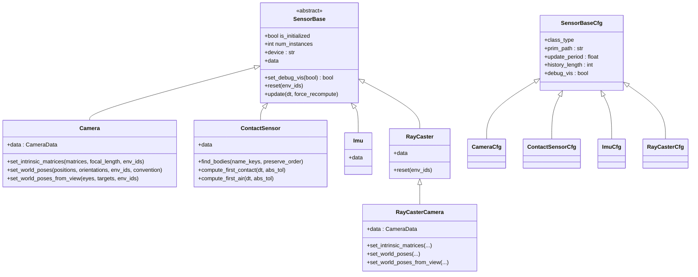
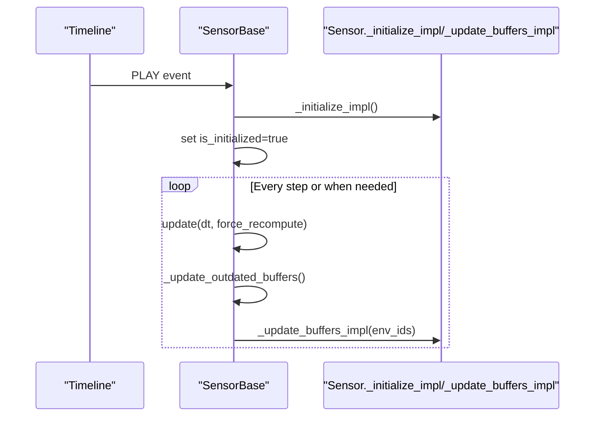
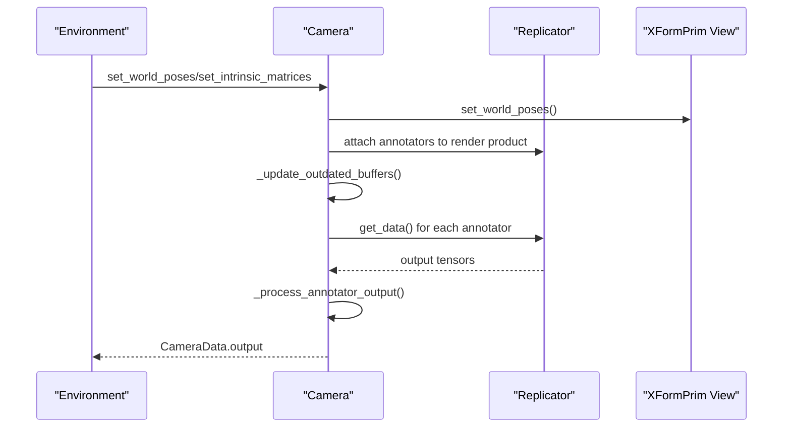
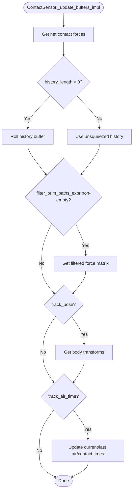
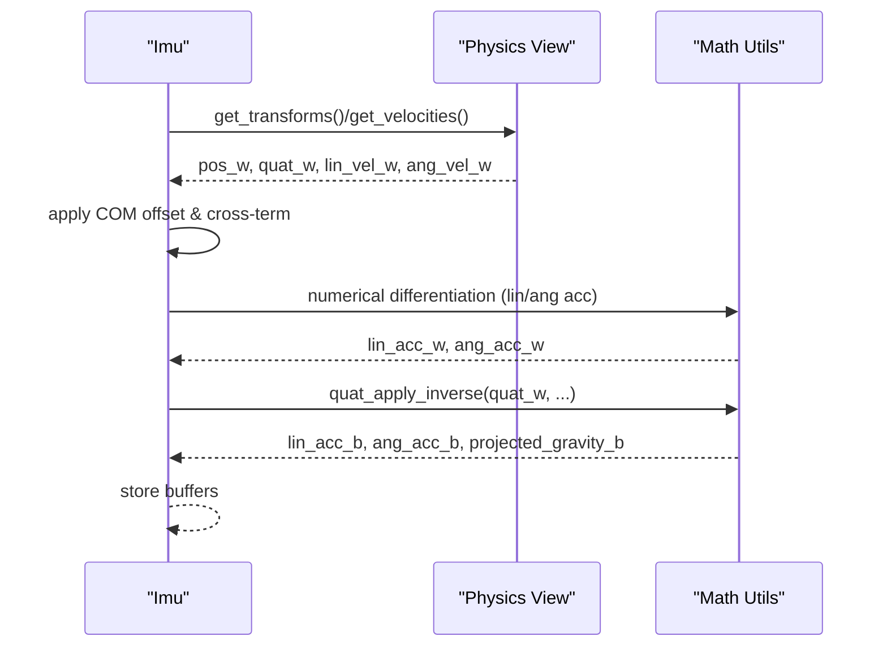
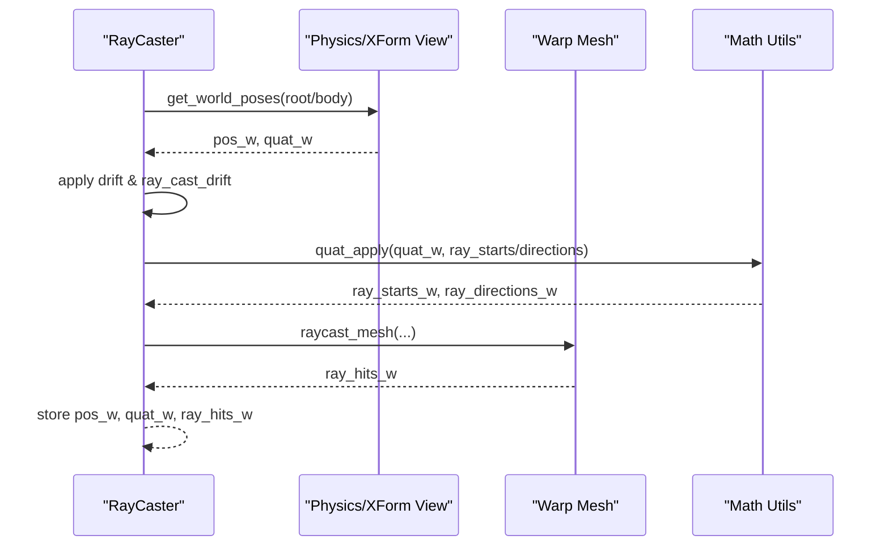
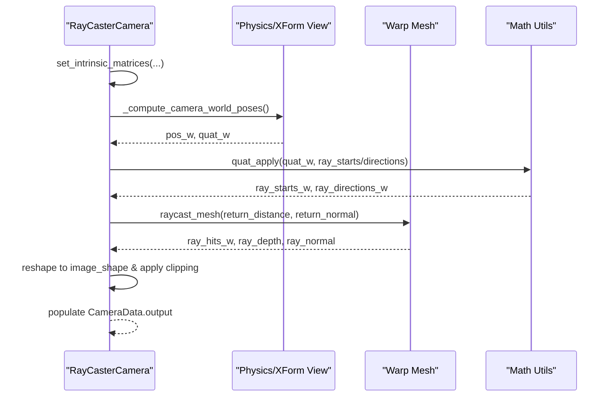
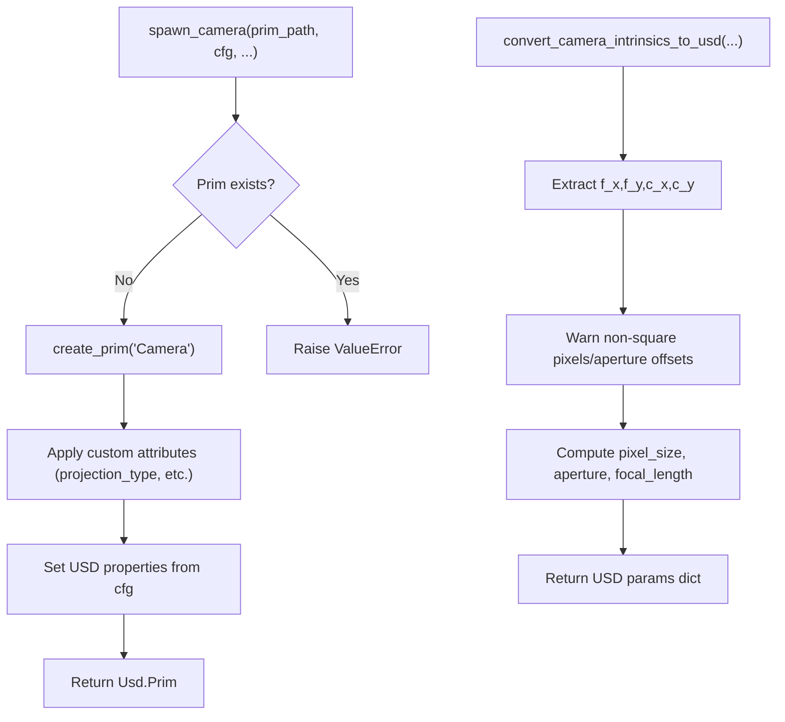
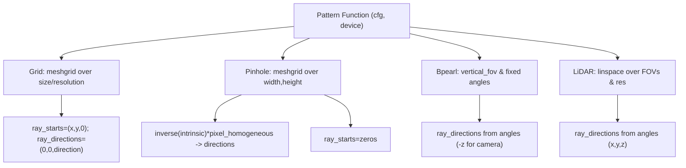
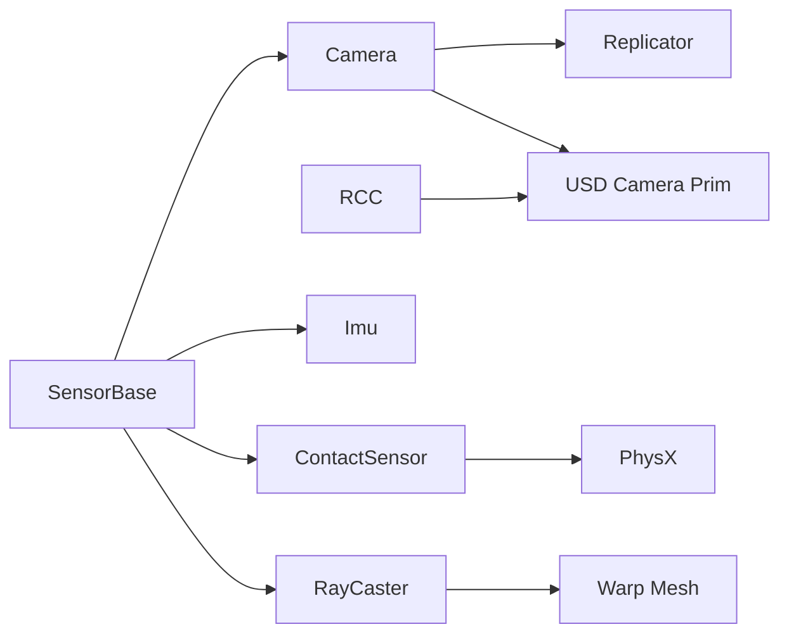

# Sensor Integration API

<cite>
**Referenced Files in This Document**
- [sensor_base.py](file://source/isaaclab/isaaclab/sensors/sensor_base.py)
- [sensor_base_cfg.py](file://source/isaaclab/isaaclab/sensors/sensor_base_cfg.py)
- [camera.py](file://source/isaaclab/isaaclab/sensors/camera/camera.py)
- [camera_cfg.py](file://source/isaaclab/isaaclab/sensors/camera/camera_cfg.py)
- [camera_data.py](file://source/isaaclab/isaaclab/sensors/camera/camera_data.py)
- [contact_sensor.py](file://source/isaaclab/isaaclab/sensors/contact_sensor/contact_sensor.py)
- [contact_sensor_cfg.py](file://source/isaaclab/isaaclab/sensors/contact_sensor/contact_sensor_cfg.py)
- [imu.py](file://source/isaaclab/isaaclab/sensors/imu/imu.py)
- [imu_cfg.py](file://source/isaaclab/isaaclab/sensors/imu/imu_cfg.py)
- [ray_caster.py](file://source/isaaclab/isaaclab/sensors/ray_caster/ray_caster.py)
- [ray_caster_cfg.py](file://source/isaaclab/isaaclab/sensors/ray_caster/ray_caster_cfg.py)
- [ray_caster_camera.py](file://source/isaaclab/isaaclab/sensors/ray_caster/ray_caster_camera.py)
- [patterns.py](file://source/isaaclab/isaaclab/sensors/ray_caster/patterns/patterns.py)
- [sensors.py](file://source/isaaclab/isaaclab/sim/spawners/sensors/sensors.py)
- [sensors.py](file://source/isaaclab/isaaclab/utils/sensors.py)
</cite>

## Table of Contents
1. [Introduction](#introduction)
2. [Project Structure](#project-structure)
3. [Core Components](#core-components)
4. [Architecture Overview](#architecture-overview)
5. [Detailed Component Analysis](#detailed-component-analysis)
6. [Dependency Analysis](#dependency-analysis)
7. [Performance Considerations](#performance-considerations)
8. [Troubleshooting Guide](#troubleshooting-guide)
9. [Conclusion](#conclusion)
10. [Appendices](#appendices)

## Introduction
This document provides comprehensive API documentation for the sensor integration system in the Isaac Lab codebase. It covers the base sensor class interfaces, camera sensor APIs, contact sensor configuration, IMU data processing functions, the ray caster sensor system for terrain height mapping and obstacle detection, sensor spawning APIs for procedural sensor placement and calibration, the sensor pattern recognition system for structured sensor arrays and tiling configurations, and the sensor data acquisition interfaces, preprocessing functions, and observation generation. It also includes configuration specifications for sensor parameters, noise models, and calibration procedures, along with examples of multi-sensor fusion, sensor placement strategies, and data synchronization. Finally, it addresses sensor validation, error handling, and performance optimization for high-frequency sensor data.

## Project Structure
The sensor subsystem is organized around a shared base class and modular sensor implementations:
- Base sensor infrastructure: sensor lifecycle, update scheduling, debug visualization, and callbacks.
- Camera sensor: USD-based camera prim with Replicator annotators and warp-based ray-caster camera.
- Contact sensor: PhysX-based contact reporting with filtering and time statistics.
- IMU sensor: Rigid-body state estimation with numerical differentiation and gravity bias handling.
- Ray caster: Warp-based ray-casting for terrain height mapping and obstacle detection.
- Spawning and calibration: Procedural camera prim creation and intrinsic-to-USD conversion.

```mermaid
graph TB
subgraph "Base"
SB["SensorBase<br/>Lifecycle & Buffers"]
SBCFG["SensorBaseCfg<br/>Common Params"]
end
subgraph "Cameras"
CAM["Camera<br/>USD Camera + Replicator"]
RCC["RayCasterCamera<br/>Warp-based Camera"]
CAMCFG["CameraCfg"]
CAMDATA["CameraData"]
end
subgraph "Contacts"
CS["ContactSensor<br/>PhysX Contact Reporter"]
CSCFG["ContactSensorCfg"]
end
subgraph "IMU"
IMU["Imu<br/>Rigid Body Dynamics"]
IMUCFG["ImuCfg"]
end
subgraph "Ray Casting"
RC["RayCaster<br/>Warp Mesh Raycast"]
RCCFG["RayCasterCfg"]
PAT["Patterns<br/>Grid/Pinhole/Bpearl/LiDAR"]
end
subgraph "Spawning & Utils"
SPAWN["spawn_camera<br/>USD Camera Prim"]
CAL["convert_camera_intrinsics_to_usd<br/>Intrinsic->USD Params"]
end
SB --> CAM
SB --> CS
SB --> IMU
SB --> RC
CAMCFG --> CAM
CAMDATA --> CAM
CSCFG --> CS
IMUCFG --> IMU
RCCFG --> RC
PAT --> RC
PAT --> RCC
SPAWN --> CAM
CAL --> CAM
CAL --> RCC
```

**Diagram sources**
- [sensor_base.py:34-358](file://source/isaaclab/isaaclab/sensors/sensor_base.py#L34-L358)
- [sensor_base_cfg.py:13-43](file://source/isaaclab/isaaclab/sensors/sensor_base_cfg.py#L13-L43)
- [camera.py:40-720](file://source/isaaclab/isaaclab/sensors/camera/camera.py#L40-L720)
- [camera_cfg.py:16-143](file://source/isaaclab/isaaclab/sensors/camera/camera_cfg.py#L16-L143)
- [camera_data.py:13-92](file://source/isaaclab/isaaclab/sensors/camera/camera_data.py#L13-L92)
- [contact_sensor.py:32-481](file://source/isaaclab/isaaclab/sensors/contact_sensor/contact_sensor.py#L32-L481)
- [contact_sensor_cfg.py:14-77](file://source/isaaclab/isaaclab/sensors/contact_sensor/contact_sensor_cfg.py#L14-L77)
- [imu.py:27-257](file://source/isaaclab/isaaclab/sensors/imu/imu.py#L27-L257)
- [imu_cfg.py:16-47](file://source/isaaclab/isaaclab/sensors/imu/imu_cfg.py#L16-L47)
- [ray_caster.py:35-335](file://source/isaaclab/isaaclab/sensors/ray_caster/ray_caster.py#L35-L335)
- [ray_caster_cfg.py:21-100](file://source/isaaclab/isaaclab/sensors/ray_caster/ray_caster_cfg.py#L21-L100)
- [patterns.py:16-180](file://source/isaaclab/isaaclab/sensors/ray_caster/patterns/patterns.py#L16-L180)
- [sensors.py:51-149](file://source/isaaclab/isaaclab/sim/spawners/sensors/sensors.py#L51-L149)
- [sensors.py:9-61](file://source/isaaclab/isaaclab/utils/sensors.py#L9-L61)

**Section sources**
- [sensor_base.py:34-358](file://source/isaaclab/isaaclab/sensors/sensor_base.py#L34-L358)
- [sensor_base_cfg.py:13-43](file://source/isaaclab/isaaclab/sensors/sensor_base_cfg.py#L13-L43)

## Core Components
- SensorBase: Defines the common lifecycle, update scheduling, debug visualization, and buffer management for all sensors. It lazily updates sensor data on access and supports history buffers and periodic updates.
- SensorBaseCfg: Provides shared configuration fields such as prim_path, update_period, history_length, and debug_vis.
- Camera: Wraps USDGeom Camera and integrates with Replicator annotators to produce RGB, depth, normals, and segmentation outputs. Supports intrinsic matrix configuration and pose setting in multiple conventions.
- ContactSensor: Uses PhysX ContactReporter to accumulate net forces, optionally filtered against specific prims, and tracks air/contact durations.
- Imu: Reads rigid-body transforms and velocities, computes accelerations via numerical differentiation, and applies gravity bias.
- RayCaster: Performs warp-based ray-casting against static meshes, supporting configurable ray patterns and drift models for robustness.
- RayCasterCamera: A warp-based camera variant that generates distance-to-image-plane, distance-to-camera, and normals images with configurable intrinsic matrices.
- Patterns: Provides ray-start and direction generators for grid, pinhole camera, Bpearl LiDAR, and generic LiDAR patterns.
- Spawning and Calibration: Utilities to spawn USD camera prims and convert camera intrinsics to USD camera parameters.

**Section sources**
- [sensor_base.py:34-358](file://source/isaaclab/isaaclab/sensors/sensor_base.py#L34-L358)
- [sensor_base_cfg.py:13-43](file://source/isaaclab/isaaclab/sensors/sensor_base_cfg.py#L13-L43)
- [camera.py:40-720](file://source/isaaclab/isaaclab/sensors/camera/camera.py#L40-L720)
- [contact_sensor.py:32-481](file://source/isaaclab/isaaclab/sensors/contact_sensor/contact_sensor.py#L32-L481)
- [imu.py:27-257](file://source/isaaclab/isaaclab/sensors/imu/imu.py#L27-L257)
- [ray_caster.py:35-335](file://source/isaaclab/isaaclab/sensors/ray_caster/ray_caster.py#L35-L335)
- [ray_caster_camera.py:26-434](file://source/isaaclab/isaaclab/sensors/ray_caster/ray_caster_camera.py#L26-L434)
- [patterns.py:16-180](file://source/isaaclab/isaaclab/sensors/ray_caster/patterns/patterns.py#L16-L180)
- [sensors.py:51-149](file://source/isaaclab/isaaclab/sim/spawners/sensors/sensors.py#L51-L149)
- [sensors.py:9-61](file://source/isaaclab/isaaclab/utils/sensors.py#L9-L61)

## Architecture Overview
The sensor system follows a layered architecture:
- Base layer: SensorBase orchestrates initialization, update scheduling, and debug visualization.
- Sensor-specific layers: Each sensor implements _initialize_impl and _update_buffers_impl tailored to its data source (USD prims, PhysX, warp meshes).
- Configuration layer: Each sensor exposes a strongly-typed config class inheriting from SensorBaseCfg.
- Spawning and calibration layer: Utilities create USD camera prims and translate intrinsic matrices to USD parameters.



**Diagram sources**
- [sensor_base.py:34-358](file://source/isaaclab/isaaclab/sensors/sensor_base.py#L34-L358)
- [camera.py:40-720](file://source/isaaclab/isaaclab/sensors/camera/camera.py#L40-L720)
- [contact_sensor.py:32-481](file://source/isaaclab/isaaclab/sensors/contact_sensor/contact_sensor.py#L32-L481)
- [imu.py:27-257](file://source/isaaclab/isaaclab/sensors/imu/imu.py#L27-L257)
- [ray_caster.py:35-335](file://source/isaaclab/isaaclab/sensors/ray_caster/ray_caster.py#L35-L335)
- [ray_caster_camera.py:26-434](file://source/isaaclab/isaaclab/sensors/ray_caster/ray_caster_camera.py#L26-L434)
- [sensor_base_cfg.py:13-43](file://source/isaaclab/isaaclab/sensors/sensor_base_cfg.py#L13-L43)
- [camera_cfg.py:16-143](file://source/isaaclab/isaaclab/sensors/camera/camera_cfg.py#L16-L143)
- [contact_sensor_cfg.py:14-77](file://source/isaaclab/isaaclab/sensors/contact_sensor/contact_sensor_cfg.py#L14-L77)
- [imu_cfg.py:16-47](file://source/isaaclab/isaaclab/sensors/imu/imu_cfg.py#L16-L47)
- [ray_caster_cfg.py:21-100](file://source/isaaclab/isaaclab/sensors/ray_caster/ray_caster_cfg.py#L21-L100)

## Detailed Component Analysis

### Base Sensor Interfaces
- Lifecycle and scheduling: Sensors initialize on timeline PLAY, maintain timestamps, and update only when needed based on update_period and force_recompute flags.
- Debug visualization: Toggle debug visualization and subscribe to post-update events to render markers or ray hits.
- Buffer management: _update_outdated_buffers identifies stale sensors and calls _update_buffers_impl to refresh data.



**Diagram sources**
- [sensor_base.py:288-358](file://source/isaaclab/isaaclab/sensors/sensor_base.py#L288-L358)

**Section sources**
- [sensor_base.py:34-358](file://source/isaaclab/isaaclab/sensors/sensor_base.py#L34-L358)

### Camera Sensor API
- Supported data types: rgb, rgba, depth, distance_to_image_plane, distance_to_camera, normals, motion_vectors, semantic_segmentation, instance_segmentation_fast, instance_id_segmentation_fast.
- Pose control: set_world_poses and set_world_poses_from_view support OpenGL, ROS, and world conventions; intrinsic matrices can be set from camera matrices.
- Rendering pipeline: Integrates with Replicator annotators and render products; handles semantic filters and colorization options.
- Depth clipping behavior: Configurable clipping modes for distance outputs.



**Diagram sources**
- [camera.py:382-531](file://source/isaaclab/isaaclab/sensors/camera/camera.py#L382-L531)
- [camera.py:662-708](file://source/isaaclab/isaaclab/sensors/camera/camera.py#L662-L708)

**Section sources**
- [camera.py:40-720](file://source/isaaclab/isaaclab/sensors/camera/camera.py#L40-L720)
- [camera_cfg.py:16-143](file://source/isaaclab/isaaclab/sensors/camera/camera_cfg.py#L16-L143)
- [camera_data.py:13-92](file://source/isaaclab/isaaclab/sensors/camera/camera_data.py#L13-L92)

### Contact Sensor Configuration and Operations
- Contact reporting: Uses PhysX ContactReporter to accumulate net forces and optional filtered force matrix against specific prims.
- Air/contact time tracking: Computes durations since last contact/air state transitions using configurable thresholds.
- Body selection: find_bodies resolves body indices by name keys; supports preserving order.
- Visualization: Toggle debug markers to visualize contact state.



**Diagram sources**
- [contact_sensor.py:346-438](file://source/isaaclab/isaaclab/sensors/contact_sensor/contact_sensor.py#L346-L438)

**Section sources**
- [contact_sensor.py:32-481](file://source/isaaclab/isaaclab/sensors/contact_sensor/contact_sensor.py#L32-L481)
- [contact_sensor_cfg.py:14-77](file://source/isaaclab/isaaclab/sensors/contact_sensor/contact_sensor_cfg.py#L14-L77)

### IMU Data Processing Functions
- Rigid-body state: Reads transforms and velocities from physics view; applies offsets from center-of-mass to link origin.
- Numerical differentiation: Computes linear and angular accelerations using previous velocities and delta-time; applies gravity bias.
- Gravity vector: Stores normalized gravity direction for projecting gravity in body frame.
- Visualization: Renders arrows representing linear acceleration in world frame.



**Diagram sources**
- [imu.py:151-194](file://source/isaaclab/isaaclab/sensors/imu/imu.py#L151-L194)

**Section sources**
- [imu.py:27-257](file://source/isaaclab/isaaclab/sensors/imu/imu.py#L27-L257)
- [imu_cfg.py:16-47](file://source/isaaclab/isaaclab/sensors/imu/imu_cfg.py#L16-L47)

### Ray Caster Sensor System
- Warp-based ray-casting: Converts meshes to warp meshes and casts rays against them; supports drift ranges for robustness.
- Ray alignment: Supports "base", "yaw", and "world" alignments for projecting rays onto ground or in world frame.
- Patterns: Grid, pinhole camera, Bpearl LiDAR, and generic LiDAR patterns define ray starts and directions.
- Visualization: Renders ray hit points for debugging.



**Diagram sources**
- [ray_caster.py:232-301](file://source/isaaclab/isaaclab/sensors/ray_caster/ray_caster.py#L232-L301)

**Section sources**
- [ray_caster.py:35-335](file://source/isaaclab/isaaclab/sensors/ray_caster/ray_caster.py#L35-L335)
- [ray_caster_cfg.py:21-100](file://source/isaaclab/isaaclab/sensors/ray_caster/ray_caster_cfg.py#L21-L100)
- [patterns.py:16-180](file://source/isaaclab/isaaclab/sensors/ray_caster/patterns/patterns.py#L16-L180)

### Ray Caster Camera API
- Warp-based camera: Generates distance-to-image-plane, distance-to-camera, and normals images using ray patterns derived from intrinsic matrices.
- Pose control: set_world_poses and set_world_poses_from_view mirror the USD camera API.
- Intrinsic matrices: set_intrinsic_matrices updates ray directions and intrinsic matrices; supports configurable clipping behavior.



**Diagram sources**
- [ray_caster_camera.py:257-319](file://source/isaaclab/isaaclab/sensors/ray_caster/ray_caster_camera.py#L257-L319)

**Section sources**
- [ray_caster_camera.py:26-434](file://source/isaaclab/isaaclab/sensors/ray_caster/ray_caster_camera.py#L26-L434)
- [patterns.py:61-103](file://source/isaaclab/isaaclab/sensors/ray_caster/patterns/patterns.py#L61-L103)

### Sensor Spawning APIs and Calibration
- spawn_camera: Creates USD camera prims with projection type (pinhole/fisheye), locks camera if requested, and sets custom attributes. Handles cloning for regex prim paths.
- convert_camera_intrinsics_to_usd: Converts camera intrinsic matrices to USD camera parameters (focal_length, horizontal/vertical_aperture, offsets).



**Diagram sources**
- [sensors.py:51-149](file://source/isaaclab/isaaclab/sim/spawners/sensors/sensors.py#L51-L149)
- [sensors.py:9-61](file://source/isaaclab/isaaclab/utils/sensors.py#L9-L61)

**Section sources**
- [sensors.py:51-149](file://source/isaaclab/isaaclab/sim/spawners/sensors/sensors.py#L51-L149)
- [sensors.py:9-61](file://source/isaaclab/isaaclab/utils/sensors.py#L9-L61)

### Sensor Pattern Recognition System
- Grid pattern: Regular grid spanning a rectangle in local coordinates with configurable ordering and resolution.
- Pinhole camera pattern: Generates rays from pixel grid using inverse intrinsic matrices; returns ray starts at origin and normalized directions.
- Bpearl pattern: RS-Bpearl LiDAR-like 3D ray distribution for near-field detection.
- Generic LiDAR pattern: Spherical coordinate-based ray distribution for standard LiDAR coverage.



**Diagram sources**
- [patterns.py:16-180](file://source/isaaclab/isaaclab/sensors/ray_caster/patterns/patterns.py#L16-L180)

**Section sources**
- [patterns.py:16-180](file://source/isaaclab/isaaclab/sensors/ray_caster/patterns/patterns.py#L16-L180)

### Sensor Data Acquisition, Preprocessing, and Observation Generation
- Lazy acquisition: Sensors update only when data is accessed or when forced; buffers are reused to minimize allocations.
- Camera preprocessing: Outputs are processed to standard shapes (H,W,C), colorized segmentation if requested, and depth values are clipped according to configuration.
- Contact preprocessing: Aggregates contact points per body and computes filtered force matrix; optional pose tracking and air/contact time accumulation.
- IMU preprocessing: Applies COM offset corrections, numerical differentiation, and gravity bias subtraction; stores world and body-frame quantities.
- Ray caster preprocessing: Projects rays in chosen frame, casts against warp mesh, and reshapes outputs to image-like tensors.

**Section sources**
- [camera.py:493-708](file://source/isaaclab/isaaclab/sensors/camera/camera.py#L493-L708)
- [contact_sensor.py:346-438](file://source/isaaclab/isaaclab/sensors/contact_sensor/contact_sensor.py#L346-L438)
- [imu.py:151-217](file://source/isaaclab/isaaclab/sensors/imu/imu.py#L151-L217)
- [ray_caster.py:232-301](file://source/isaaclab/isaaclab/sensors/ray_caster/ray_caster.py#L232-L301)

## Dependency Analysis
- Coupling: All sensors depend on SensorBase for lifecycle and buffer management; camera depends on Replicator; contact sensor depends on PhysX; ray caster depends on warp meshes; IMU depends on physics view.
- External dependencies: Replicator for camera outputs, PhysX for contact reporting, warp for ray-casting, USD camera prim for intrinsic calibration.
- Potential circular dependencies: None observed; patterns are standalone utilities.



**Diagram sources**
- [sensor_base.py:34-358](file://source/isaaclab/isaaclab/sensors/sensor_base.py#L34-L358)
- [camera.py:399-488](file://source/isaaclab/isaaclab/sensors/camera/camera.py#L399-L488)
- [contact_sensor.py:255-288](file://source/isaaclab/isaaclab/sensors/contact_sensor/contact_sensor.py#L255-L288)
- [ray_caster.py:162-211](file://source/isaaclab/isaaclab/sensors/ray_caster/ray_caster.py#L162-L211)

**Section sources**
- [sensor_base.py:34-358](file://source/isaaclab/isaaclab/sensors/sensor_base.py#L34-L358)
- [camera.py:399-488](file://source/isaaclab/isaaclab/sensors/camera/camera.py#L399-L488)
- [contact_sensor.py:255-288](file://source/isaaclab/isaaclab/sensors/contact_sensor/contact_sensor.py#L255-L288)
- [ray_caster.py:162-211](file://source/isaaclab/isaaclab/sensors/ray_caster/ray_caster.py#L162-L211)

## Performance Considerations
- Lazy evaluation: Sensors update only when accessed, reducing unnecessary computation.
- Periodic updates: Use update_period to throttle sensor reads; history_length can increase memory footprint.
- Camera performance: Disabling update_latest_camera_pose avoids slower XFormPrim operations; choose appropriate data_types to reduce bandwidth.
- Contact sensor: Increase max_contact_data_count_per_prim for highly contact-rich scenes to prevent buffer overflow.
- IMU: Numerical differentiation accuracy improves with smaller physics dt; gravity_bias can be tuned to reduce noise.
- Ray caster: Limit max_distance and use appropriate ray_alignment to reduce computational cost; drift ranges should be minimal for stability.

[No sources needed since this section provides general guidance]

## Troubleshooting Guide
- Camera prim not found: Ensure prim_path is valid and camera is spawned; check for regex in leaf path.
- Replicator not found or cameras disabled: Verify --enable_cameras flag and replicator availability.
- Contact reporter not enabled: Enable activate_contact_sensors in asset spawner configuration.
- Unsupported data types: Use fast counterparts for segmentation types; avoid structured numpy outputs.
- IMU accuracy: Reduce physics dt and ensure proper sensor frame placement on rigid bodies.
- Ray caster invalid prim: Ensure prim is Articulation or Rigid Body; fallback to XFormPrim logs a warning.
- Intrinsic to USD conversion warnings: Non-square pixels and aperture offsets are not supported; adjust intrinsic matrices accordingly.

**Section sources**
- [camera.py:101-140](file://source/isaaclab/isaaclab/sensors/camera/camera.py#L101-L140)
- [camera.py:393-397](file://source/isaaclab/isaaclab/sensors/camera/camera.py#L393-L397)
- [contact_sensor.py:269-273](file://source/isaaclab/isaaclab/sensors/contact_sensor/contact_sensor.py#L269-L273)
- [imu.py:35-47](file://source/isaaclab/isaaclab/sensors/imu/imu.py#L35-L47)
- [ray_caster.py:135-155](file://source/isaaclab/isaaclab/sensors/ray_caster/ray_caster.py#L135-L155)
- [sensors.py:39-43](file://source/isaaclab/isaaclab/utils/sensors.py#L39-L43)

## Conclusion
The sensor integration system provides a robust, extensible framework for acquiring and processing multimodal sensor data in Isaac Sim. Its base class enforces efficient lifecycle management, while specialized sensors expose rich APIs for camera imaging, contact reporting, inertial sensing, and ray-casting. The spawning and calibration utilities streamline procedural sensor placement and intrinsic parameterization. With careful configuration of update periods, history lengths, and drift parameters, the system supports high-frequency sensor data with strong validation and error handling.

[No sources needed since this section summarizes without analyzing specific files]

## Appendices

### Configuration Specifications
- Shared sensor parameters: prim_path, update_period, history_length, debug_vis.
- Camera: offset pose, spawn configuration, depth_clipping_behavior, data_types, width, height, semantic_filter, colorization toggles, mapping.
- ContactSensor: track_pose, track_contact_points, max_contact_data_count_per_prim, track_air_time, force_threshold, filter_prim_paths_expr, visualizer_cfg.
- Imu: offset pose, visualizer_cfg, gravity_bias.
- RayCaster: mesh_prim_paths, offset pose, ray_alignment, pattern_cfg, max_distance, drift_range, ray_cast_drift_range, visualizer_cfg.
- RayCasterCamera: inherits RayCasterCfg plus image_shape and intrinsic matrix handling.

**Section sources**
- [sensor_base_cfg.py:13-43](file://source/isaaclab/isaaclab/sensors/sensor_base_cfg.py#L13-L43)
- [camera_cfg.py:16-143](file://source/isaaclab/isaaclab/sensors/camera/camera_cfg.py#L16-L143)
- [contact_sensor_cfg.py:14-77](file://source/isaaclab/isaaclab/sensors/contact_sensor/contact_sensor_cfg.py#L14-L77)
- [imu_cfg.py:16-47](file://source/isaaclab/isaaclab/sensors/imu/imu_cfg.py#L16-L47)
- [ray_caster_cfg.py:21-100](file://source/isaaclab/isaaclab/sensors/ray_caster/ray_caster_cfg.py#L21-L100)

### Examples and Strategies
- Multi-sensor fusion: Combine CameraData.output with ContactSensorData.net_forces_w and ImuData for state estimation; align timestamps and synchronize observations.
- Sensor placement: Use spawn_camera to create calibrated camera prims; apply offset pose to align sensor frame with robot link; validate with debug visualization.
- Data synchronization: Use SensorBase timestamps to align sensor readings; leverage update_period to schedule periodic reads; avoid frequent pose updates for camera sensors.

[No sources needed since this section provides general guidance]