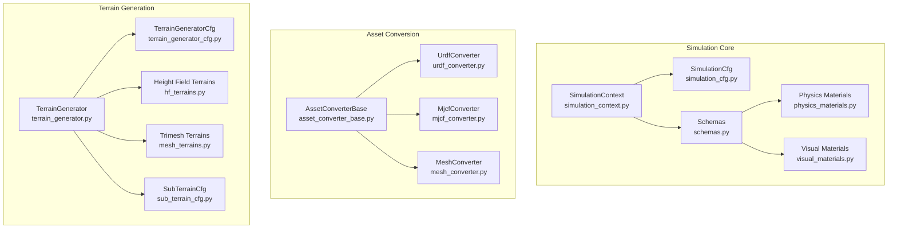
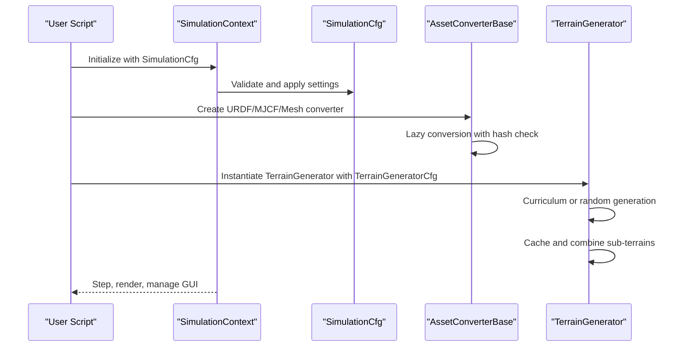
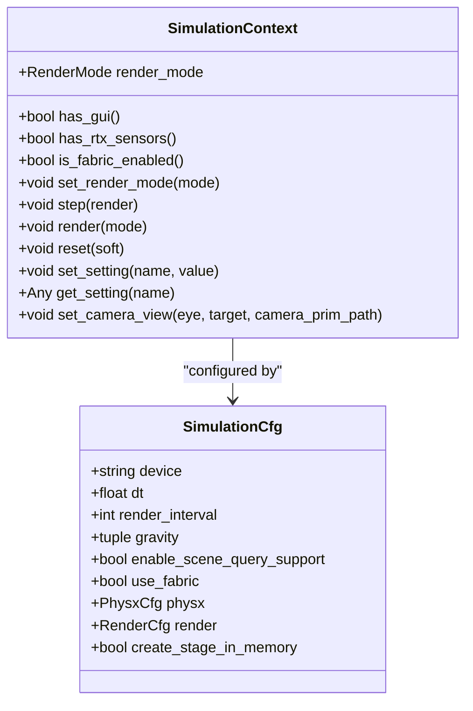
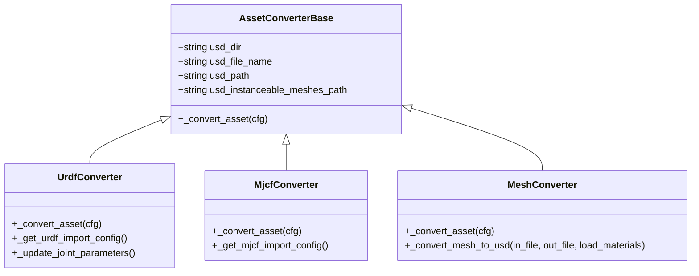
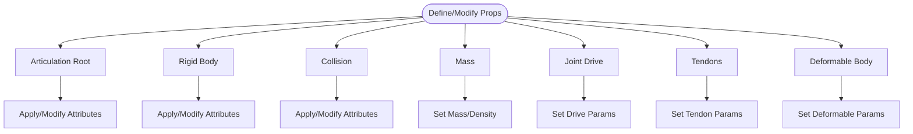
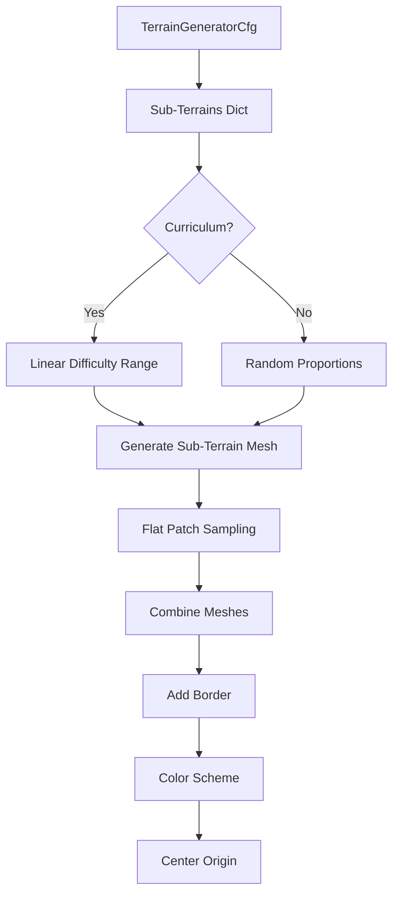
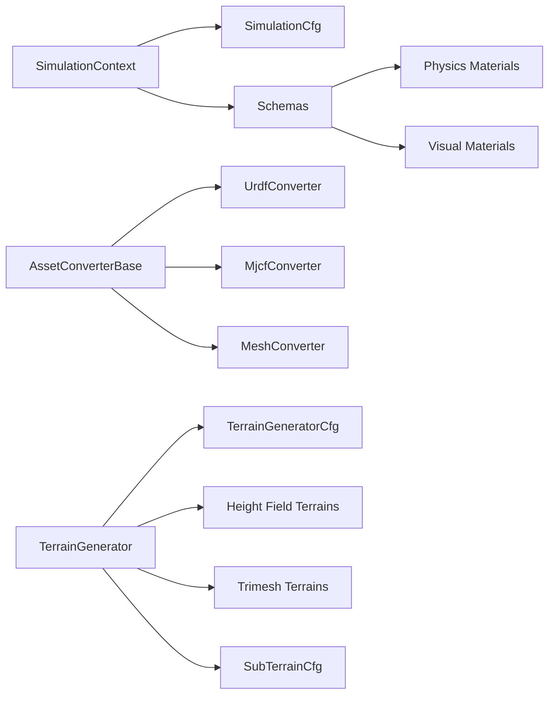

# Simulation and Terrain API

<cite>
**Referenced Files in This Document**
- [simulation_context.py](file://source/isaaclab/isaaclab/sim/simulation_context.py)
- [simulation_cfg.py](file://source/isaaclab/isaaclab/sim/simulation_cfg.py)
- [asset_converter_base.py](file://source/isaaclab/isaaclab/sim/converters/asset_converter_base.py)
- [urdf_converter.py](file://source/isaaclab/isaaclab/sim/converters/urdf_converter.py)
- [mjcf_converter.py](file://source/isaaclab/isaaclab/sim/converters/mjcf_converter.py)
- [mesh_converter.py](file://source/isaaclab/isaaclab/sim/converters/mesh_converter.py)
- [schemas.py](file://source/isaaclab/isaaclab/sim/schemas/schemas.py)
- [physics_materials.py](file://source/isaaclab/isaaclab/sim/spawners/materials/physics_materials.py)
- [visual_materials.py](file://source/isaaclab/isaaclab/sim/spawners/materials/visual_materials.py)
- [terrain_generator.py](file://source/isaaclab/isaaclab/terrains/terrain_generator.py)
- [terrain_generator_cfg.py](file://source/isaaclab/isaaclab/terrains/terrain_generator_cfg.py)
- [hf_terrains.py](file://source/isaaclab/isaaclab/terrains/height_field/hf_terrains.py)
- [mesh_terrains.py](file://source/isaaclab/isaaclab/terrains/trimesh/mesh_terrains.py)
- [sub_terrain_cfg.py](file://source/isaaclab/isaaclab/terrains/sub_terrain_cfg.py)
</cite>

## Table of Contents
1. [Introduction](#introduction)
2. [Project Structure](#project-structure)
3. [Core Components](#core-components)
4. [Architecture Overview](#architecture-overview)
5. [Detailed Component Analysis](#detailed-component-analysis)
6. [Dependency Analysis](#dependency-analysis)
7. [Performance Considerations](#performance-considerations)
8. [Troubleshooting Guide](#troubleshooting-guide)
9. [Conclusion](#conclusion)

## Introduction
This document provides comprehensive API documentation for the simulation and terrain generation systems in the project. It covers:
- Simulation context management and configuration
- Asset conversion APIs for URDF, MJCF, and mesh files
- Physics simulation parameters, material definitions, and collision detection settings
- Terrain generation system including height field terrains, trimesh terrains, and procedural terrain creation
- Terrain configuration classes for difficulty scaling, randomization, and curriculum progression
- Examples of custom terrain generation, physics parameter tuning, and simulation optimization
- Guidance for simulation stability, performance tuning, and debugging tools for complex terrain scenarios

## Project Structure
The simulation and terrain subsystems are organized into cohesive modules:
- Simulation core: context, configuration, schemas, and spawners
- Asset conversion: URDF, MJCF, and mesh converters with lazy hashing and caching
- Terrain generation: height field and trimesh terrain functions, procedural generation, and curriculum-based composition

**Diagram sources**
- [simulation_context.py:41-80](file://source/isaaclab/isaaclab/sim/simulation_context.py#L41-80)
- [simulation_cfg.py:265-348](file://source/isaaclab/isaaclab/sim/simulation_cfg.py#L265-348)
- [schemas.py:30-184](file://source/isaaclab/isaaclab/sim/schemas/schemas.py#L30-184)
- [physics_materials.py:20-76](file://source/isaaclab/isaaclab/sim/spawners/materials/physics_materials.py#L20-76)
- [visual_materials.py:22-68](file://source/isaaclab/isaaclab/sim/spawners/materials/visual_materials.py#L22-68)
- [asset_converter_base.py:19-117](file://source/isaaclab/isaaclab/sim/converters/asset_converter_base.py#L19-117)
- [urdf_converter.py:21-56](file://source/isaaclab/isaaclab/sim/converters/urdf_converter.py#L21-56)
- [mjcf_converter.py:18-46](file://source/isaaclab/isaaclab/sim/converters/mjcf_converter.py#L18-46)
- [mesh_converter.py:21-58](file://source/isaaclab/isaaclab/sim/converters/mesh_converter.py#L21-58)
- [terrain_generator.py:29-100](file://source/isaaclab/isaaclab/terrains/terrain_generator.py#L29-100)
- [terrain_generator_cfg.py:26-129](file://source/isaaclab/isaaclab/terrains/terrain_generator_cfg.py#L26-129)
- [hf_terrains.py:20-437](file://source/isaaclab/isaaclab/terrains/height_field/hf_terrains.py#L20-437)
- [mesh_terrains.py:23-800](file://source/isaaclab/isaaclab/terrains/trimesh/mesh_terrains.py#L23-800)
- [sub_terrain_cfg.py:17-99](file://source/isaaclab/isaaclab/terrains/sub_terrain_cfg.py#L17-99)

**Section sources**
- [simulation_context.py:41-80](file://source/isaaclab/isaaclab/sim/simulation_context.py#L41-80)
- [simulation_cfg.py:265-348](file://source/isaaclab/isaaclab/sim/simulation_cfg.py#L265-348)
- [terrain_generator.py:29-100](file://source/isaaclab/isaaclab/terrains/terrain_generator.py#L29-100)

## Core Components
This section documents the primary building blocks used across simulation and terrain generation.

- SimulationContext
  - Controls physics stepping, rendering, and render modes
  - Applies PhysX and rendering settings, manages GUI/viewport behavior
  - Exposes utilities for camera view, fabric interface, and settings
  - Implements stepping, rendering, and reset with exception propagation and device management

- SimulationCfg
  - Defines physics parameters: device, time-step, render interval, gravity
  - Configures PhysX solver settings, CCD, stabilization, determinism, iteration counts
  - Controls rendering settings via RenderCfg and default physics material

- AssetConverterBase and Implementations
  - Base class for lazy conversion with hash-based caching and forced regeneration
  - URDFConverter: parses and imports URDF with joint drive configuration
  - MjcfConverter: creates MJCF assets with instanceable mesh support
  - MeshConverter: converts OBJ/STL/FBX to USD with optional mass/rigid body/collision properties

- Schemas and Material Spawners
  - Schemas: define and modify articulation roots, rigid bodies, collisions, mass, joint drives, tendons
  - Physics materials: spawn rigid and deformable body materials with PhysX properties
  - Visual materials: spawn preview surface and MDL-based materials

- TerrainGenerator and Configuration
  - Generates terrains procedurally or from curriculum, caches results, supports flat patch sampling
  - TerrainGeneratorCfg controls size, borders, difficulty range, caching, and color schemes
  - SubTerrainBaseCfg and FlatPatchSamplingCfg define per-terrain parameters and sampling

**Section sources**
- [simulation_context.py:117-284](file://source/isaaclab/isaaclab/sim/simulation_context.py#L117-284)
- [simulation_cfg.py:19-348](file://source/isaaclab/isaaclab/sim/simulation_cfg.py#L19-348)
- [asset_converter_base.py:48-117](file://source/isaaclab/isaaclab/sim/converters/asset_converter_base.py#L48-117)
- [urdf_converter.py:43-93](file://source/isaaclab/isaaclab/sim/converters/urdf_converter.py#L43-93)
- [mjcf_converter.py:40-103](file://source/isaaclab/isaaclab/sim/converters/mjcf_converter.py#L40-103)
- [mesh_converter.py:52-189](file://source/isaaclab/isaaclab/sim/converters/mesh_converter.py#L52-189)
- [schemas.py:30-184](file://source/isaaclab/isaaclab/sim/schemas/schemas.py#L30-184)
- [physics_materials.py:20-76](file://source/isaaclab/isaaclab/sim/spawners/materials/physics_materials.py#L20-76)
- [visual_materials.py:22-126](file://source/isaaclab/isaaclab/sim/spawners/materials/visual_materials.py#L22-126)
- [terrain_generator.py:101-187](file://source/isaaclab/isaaclab/terrains/terrain_generator.py#L101-187)
- [terrain_generator_cfg.py:26-129](file://source/isaaclab/isaaclab/terrains/terrain_generator_cfg.py#L26-129)
- [sub_terrain_cfg.py:17-99](file://source/isaaclab/isaaclab/terrains/sub_terrain_cfg.py#L17-99)

## Architecture Overview
The system integrates simulation control, asset conversion, and terrain generation into a unified framework. The SimulationContext orchestrates physics and rendering, while converters transform external assets into USD. TerrainGenerator composes multiple sub-terrains into a single mesh with optional curriculum and caching.

**Diagram sources**
- [simulation_context.py:117-284](file://source/isaaclab/isaaclab/sim/simulation_context.py#L117-284)
- [simulation_cfg.py:265-348](file://source/isaaclab/isaaclab/sim/simulation_cfg.py#L265-348)
- [asset_converter_base.py:48-117](file://source/isaaclab/isaaclab/sim/converters/asset_converter_base.py#L48-117)
- [terrain_generator.py:101-187](file://source/isaaclab/isaaclab/terrains/terrain_generator.py#L101-187)

## Detailed Component Analysis

### Simulation Context Management
- Responsibilities
  - Configure physics time-step, sub-steps, solver parameters, gravity
  - Control stepping, rendering, and render modes (no GUI, partial, full)
  - Manage GUI/viewport updates, camera view, fabric interface, and settings
  - Apply PhysX and rendering presets from experience kits

- Key APIs
  - RenderMode enumeration and set_render_mode
  - step(render), render(mode), reset(soft)
  - set_setting/get_setting, set_camera_view
  - has_gui, has_rtx_sensors, is_fabric_enabled

**Diagram sources**
- [simulation_context.py:41-80](file://source/isaaclab/isaaclab/sim/simulation_context.py#L41-80)
- [simulation_context.py:485-530](file://source/isaaclab/isaaclab/sim/simulation_context.py#L485-530)
- [simulation_context.py:600-691](file://source/isaaclab/isaaclab/sim/simulation_context.py#L600-691)
- [simulation_cfg.py:265-348](file://source/isaaclab/isaaclab/sim/simulation_cfg.py#L265-348)

**Section sources**
- [simulation_context.py:117-284](file://source/isaaclab/isaaclab/sim/simulation_context.py#L117-284)
- [simulation_cfg.py:19-348](file://source/isaaclab/isaaclab/sim/simulation_cfg.py#L19-348)

### Asset Conversion APIs
- AssetConverterBase
  - Lazy conversion with hash of configuration and asset content
  - Outputs USD directory and file name, supports forced conversion
  - Hashing excludes asset path, USD dir, and file name for stability

- URDFConverter
  - Wraps isaacsim asset importer URDF extension
  - Supports joint drive type/target, PD gains, mimic joints, self-collision, and base fixation

- MjcfConverter
  - Wraps isaacsim asset importer MJCF extension
  - Instanceable mesh support and import site tags

- MeshConverter
  - Converts OBJ/STL/FBX to USD with optional mass, rigid body, and collision properties
  - Handles instanceable mesh export and reference updates

**Diagram sources**
- [asset_converter_base.py:19-117](file://source/isaaclab/isaaclab/sim/converters/asset_converter_base.py#L19-117)
- [urdf_converter.py:21-93](file://source/isaaclab/isaaclab/sim/converters/urdf_converter.py#L21-93)
- [mjcf_converter.py:18-103](file://source/isaaclab/isaaclab/sim/converters/mjcf_converter.py#L18-103)
- [mesh_converter.py:21-189](file://source/isaaclab/isaaclab/sim/converters/mesh_converter.py#L21-189)

**Section sources**
- [asset_converter_base.py:48-117](file://source/isaaclab/isaaclab/sim/converters/asset_converter_base.py#L48-117)
- [urdf_converter.py:43-93](file://source/isaaclab/isaaclab/sim/converters/urdf_converter.py#L43-93)
- [mjcf_converter.py:40-103](file://source/isaaclab/isaaclab/sim/converters/mjcf_converter.py#L40-103)
- [mesh_converter.py:52-189](file://source/isaaclab/isaaclab/sim/converters/mesh_converter.py#L52-189)

### Physics Simulation Parameters, Materials, and Collisions
- Schemas
  - Articulation root properties: solver iterations, sleep thresholds, optional fixed root joint
  - Rigid body properties: dynamic/kinematic flags and PhysX parameters
  - Collision properties: contact settings and PhysX collision attributes
  - Mass properties: mass/density specification
  - Joint drive properties: linear/angular drives with unit conversions
  - Fixed and spatial tendon properties for articulated systems
  - Deformable body properties

- Material Spawners
  - Physics materials: static/dynamic friction and restitution for rigid/deformable bodies
  - Visual materials: preview surface and MDL-based materials

**Diagram sources**
- [schemas.py:30-184](file://source/isaaclab/isaaclab/sim/schemas/schemas.py#L30-184)
- [schemas.py:192-282](file://source/isaaclab/isaaclab/sim/schemas/schemas.py#L192-282)
- [schemas.py:290-377](file://source/isaaclab/isaaclab/sim/schemas/schemas.py#L290-377)
- [schemas.py:385-464](file://source/isaaclab/isaaclab/sim/schemas/schemas.py#L385-464)
- [schemas.py:542-640](file://source/isaaclab/isaaclab/sim/schemas/schemas.py#L542-640)
- [schemas.py:648-705](file://source/isaaclab/isaaclab/sim/schemas/schemas.py#L648-705)
- [physics_materials.py:20-76](file://source/isaaclab/isaaclab/sim/spawners/materials/physics_materials.py#L20-76)
- [visual_materials.py:22-126](file://source/isaaclab/isaaclab/sim/spawners/materials/visual_materials.py#L22-126)

**Section sources**
- [schemas.py:30-184](file://source/isaaclab/isaaclab/sim/schemas/schemas.py#L30-184)
- [physics_materials.py:20-76](file://source/isaaclab/isaaclab/sim/spawners/materials/physics_materials.py#L20-76)
- [visual_materials.py:22-126](file://source/isaaclab/isaaclab/sim/spawners/materials/visual_materials.py#L22-126)

### Terrain Generation System
- TerrainGenerator
  - Compose sub-terrains into a single mesh
  - Curriculum-based difficulty progression or random selection
  - Optional caching by sub-terrain configuration hash
  - Border addition and color schemes
  - Flat patch sampling per sub-terrain

- Height Field Terrains
  - Random uniform, pyramid sloped/stairs, discrete obstacles, wave, stepping stones
  - Horizontal/vertical scales and slope threshold handling

- Trimesh Terrains
  - Flat, pyramid stairs (normal/inverted), random grid with holes, rails, pits
  - Box terrains, gaps, gap strips, hurdle strips, stairs strips, parkour steps
  - Patterned strips with side walls and vertical faces

**Diagram sources**
- [terrain_generator.py:101-187](file://source/isaaclab/isaaclab/terrains/terrain_generator.py#L101-187)
- [terrain_generator_cfg.py:26-129](file://source/isaaclab/isaaclab/terrains/terrain_generator_cfg.py#L26-129)
- [hf_terrains.py:20-437](file://source/isaaclab/isaaclab/terrains/height_field/hf_terrains.py#L20-437)
- [mesh_terrains.py:23-800](file://source/isaaclab/isaaclab/terrains/trimesh/mesh_terrains.py#L23-800)
- [sub_terrain_cfg.py:17-99](file://source/isaaclab/isaaclab/terrains/sub_terrain_cfg.py#L17-99)

**Section sources**
- [terrain_generator.py:101-187](file://source/isaaclab/isaaclab/terrains/terrain_generator.py#L101-187)
- [terrain_generator_cfg.py:26-129](file://source/isaaclab/isaaclab/terrains/terrain_generator_cfg.py#L26-129)
- [hf_terrains.py:20-437](file://source/isaaclab/isaaclab/terrains/height_field/hf_terrains.py#L20-437)
- [mesh_terrains.py:23-800](file://source/isaaclab/isaaclab/terrains/trimesh/mesh_terrains.py#L23-800)
- [sub_terrain_cfg.py:17-99](file://source/isaaclab/isaaclab/terrains/sub_terrain_cfg.py#L17-99)

### Physics Parameter Tuning and Simulation Optimization
- PhysX Solver Settings
  - Position/velocity iteration counts, stabilization, CCD, enhanced determinism
  - GPU collision stack size and heap capacities for large scenes

- Rendering and Fabric
  - Render presets (performance/balanced/quality) and custom carb settings
  - Fabric interface for direct buffer access to reduce USD read overhead

- Simulation Stability Tips
  - Enable stabilization for large time-steps
  - Use curriculum difficulty progression for stable learning curves
  - Prefer instanceable meshes for performance in large-scale simulations

**Section sources**
- [simulation_cfg.py:19-162](file://source/isaaclab/isaaclab/sim/simulation_cfg.py#L19-162)
- [simulation_cfg.py:164-262](file://source/isaaclab/isaaclab/sim/simulation_cfg.py#L164-262)
- [simulation_context.py:286-406](file://source/isaaclab/isaaclab/sim/simulation_context.py#L286-406)

### Debugging Tools for Complex Terrain Scenarios
- Contact Sensors
  - Activate contact sensors on rigid bodies with configurable thresholds
  - Useful for detecting collisions and tuning contact parameters

- Scene Query Support
  - Enable/disable scene queries for raycast/sweep/overlap operations
  - Helps debug collision detection and proximity queries

- Logging and Warnings
  - Verbose logs for contact report API application
  - Warnings for deprecated flags and recommended stabilization settings

**Section sources**
- [schemas.py:472-533](file://source/isaaclab/isaaclab/sim/schemas/schemas.py#L472-533)
- [simulation_cfg.py:293-306](file://source/isaaclab/isaaclab/sim/simulation_cfg.py#L293-306)
- [simulation_context.py:254-260](file://source/isaaclab/isaaclab/sim/simulation_context.py#L254-260)

## Dependency Analysis
The following diagram highlights key dependencies among core components.

**Diagram sources**
- [simulation_context.py:117-284](file://source/isaaclab/isaaclab/sim/simulation_context.py#L117-284)
- [simulation_cfg.py:265-348](file://source/isaaclab/isaaclab/sim/simulation_cfg.py#L265-348)
- [schemas.py:30-184](file://source/isaaclab/isaaclab/sim/schemas/schemas.py#L30-184)
- [physics_materials.py:20-76](file://source/isaaclab/isaaclab/sim/spawners/materials/physics_materials.py#L20-76)
- [visual_materials.py:22-126](file://source/isaaclab/isaaclab/sim/spawners/materials/visual_materials.py#L22-126)
- [asset_converter_base.py:19-117](file://source/isaaclab/isaaclab/sim/converters/asset_converter_base.py#L19-117)
- [urdf_converter.py:21-56](file://source/isaaclab/isaaclab/sim/converters/urdf_converter.py#L21-56)
- [mjcf_converter.py:18-46](file://source/isaaclab/isaaclab/sim/converters/mjcf_converter.py#L18-46)
- [mesh_converter.py:21-58](file://source/isaaclab/isaaclab/sim/converters/mesh_converter.py#L21-58)
- [terrain_generator.py:29-100](file://source/isaaclab/isaaclab/terrains/terrain_generator.py#L29-100)
- [terrain_generator_cfg.py:26-129](file://source/isaaclab/isaaclab/terrains/terrain_generator_cfg.py#L26-129)
- [hf_terrains.py:20-437](file://source/isaaclab/isaaclab/terrains/height_field/hf_terrains.py#L20-437)
- [mesh_terrains.py:23-800](file://source/isaaclab/isaaclab/terrains/trimesh/mesh_terrains.py#L23-800)
- [sub_terrain_cfg.py:17-99](file://source/isaaclab/isaaclab/terrains/sub_terrain_cfg.py#L17-99)

**Section sources**
- [simulation_context.py:117-284](file://source/isaaclab/isaaclab/sim/simulation_context.py#L117-284)
- [terrain_generator.py:101-187](file://source/isaaclab/isaaclab/terrains/terrain_generator.py#L101-187)

## Performance Considerations
- Use Fabric interface for large-scale simulations to minimize USD read overhead
- Prefer instanceable meshes for repeated assets to reduce memory footprint
- Tune PhysX solver iterations and stabilization for stability vs. performance balance
- Optimize rendering presets and antialiasing modes for target hardware
- Cache terrain generation to avoid recomputation across runs
- Reduce render interval for higher physics fidelity or increase for throughput

## Troubleshooting Guide
- Large time-step instability
  - Enable PhysX stabilization or reduce dt
  - Verify solver iteration counts and CCD settings

- Contact sensor not reporting
  - Ensure rigid bodies exist under prim path
  - Activate contact sensors and set appropriate thresholds

- Rendering artifacts or missing updates
  - Confirm fabric interface is enabled for GPU simulation
  - Adjust render mode and viewport updates

- Asset conversion failures
  - Verify asset paths and extension availability
  - Force conversion to regenerate USD when parameters change

**Section sources**
- [simulation_context.py:254-260](file://source/isaaclab/isaaclab/sim/simulation_context.py#L254-260)
- [schemas.py:472-533](file://source/isaaclab/isaaclab/sim/schemas/schemas.py#L472-533)
- [simulation_cfg.py:86-108](file://source/isaaclab/isaaclab/sim/simulation_cfg.py#L86-108)
- [asset_converter_base.py:48-117](file://source/isaaclab/isaaclab/sim/converters/asset_converter_base.py#L48-117)

## Conclusion
The simulation and terrain systems provide a robust foundation for high-performance robotics simulation. By leveraging the SimulationContext for control, the asset conversion pipeline for flexible asset ingestion, and the TerrainGenerator for scalable terrain composition, developers can build complex, reproducible, and optimized simulation environments. Proper tuning of physics parameters, materials, and rendering settings ensures stability and performance across diverse scenarios.