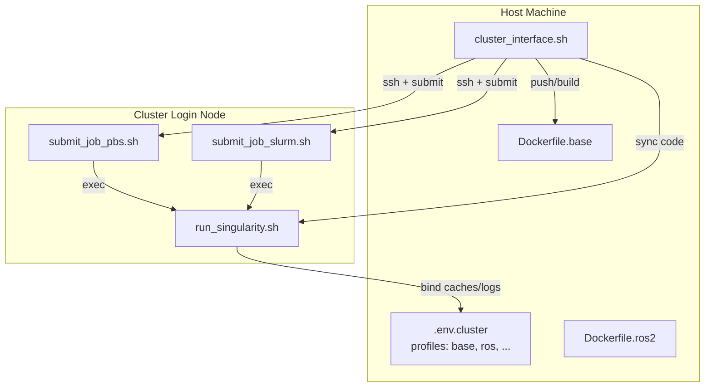
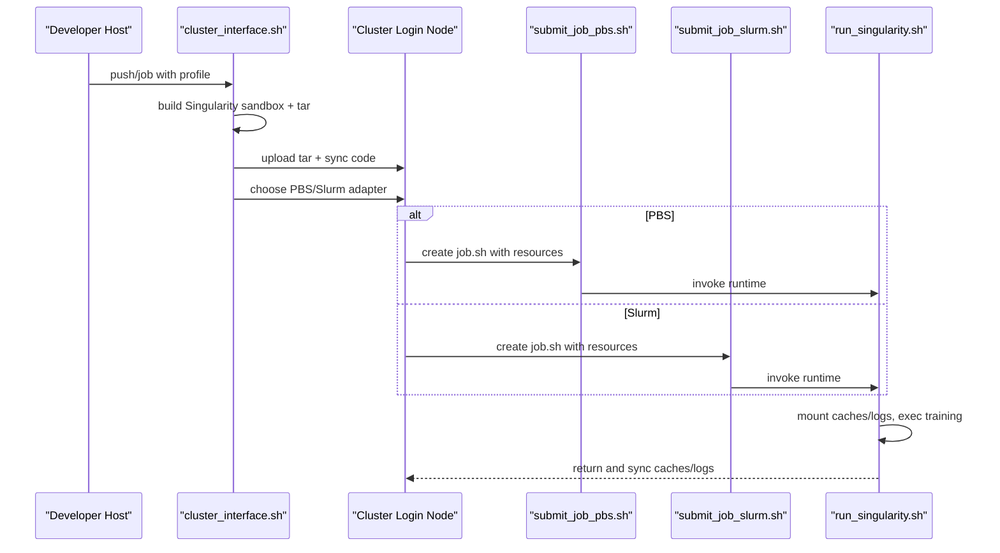
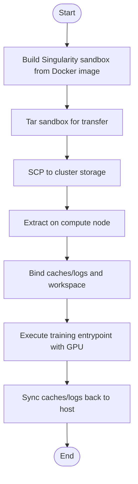
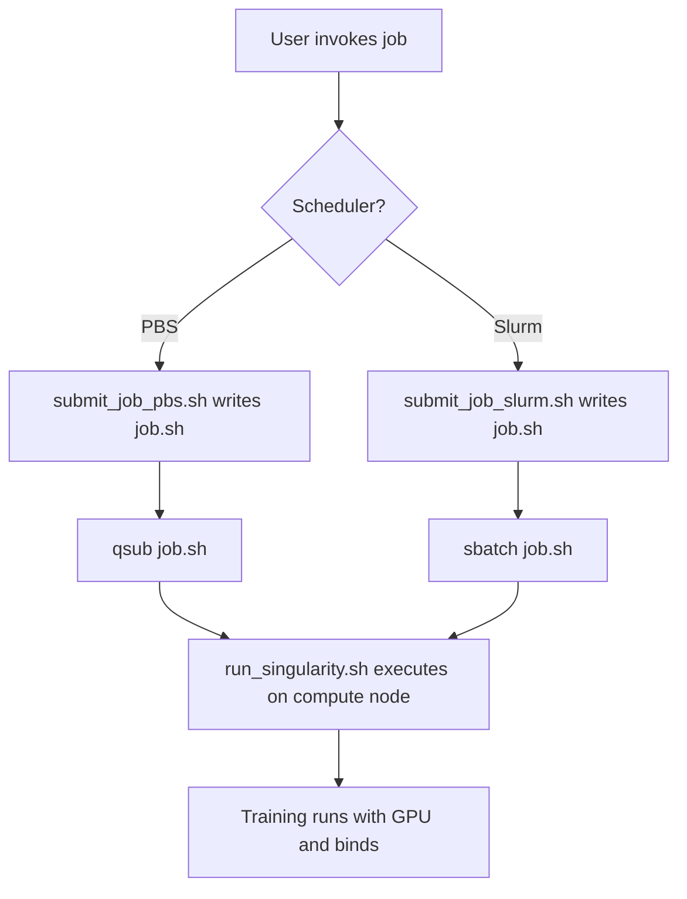
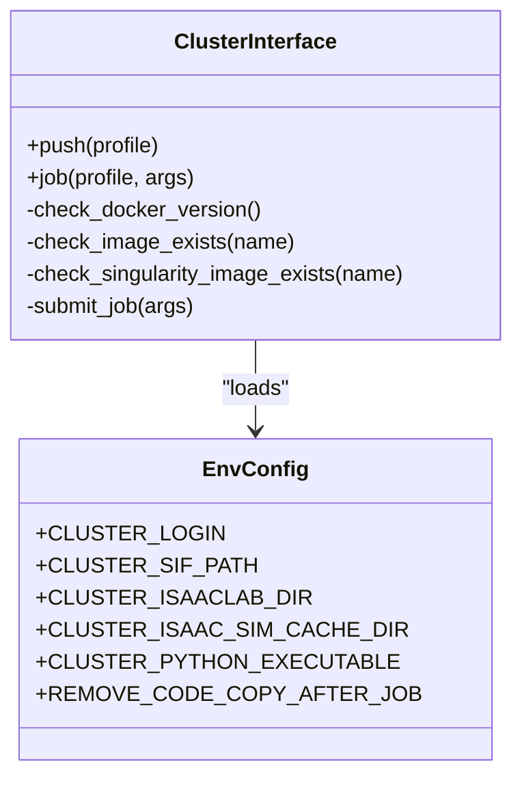
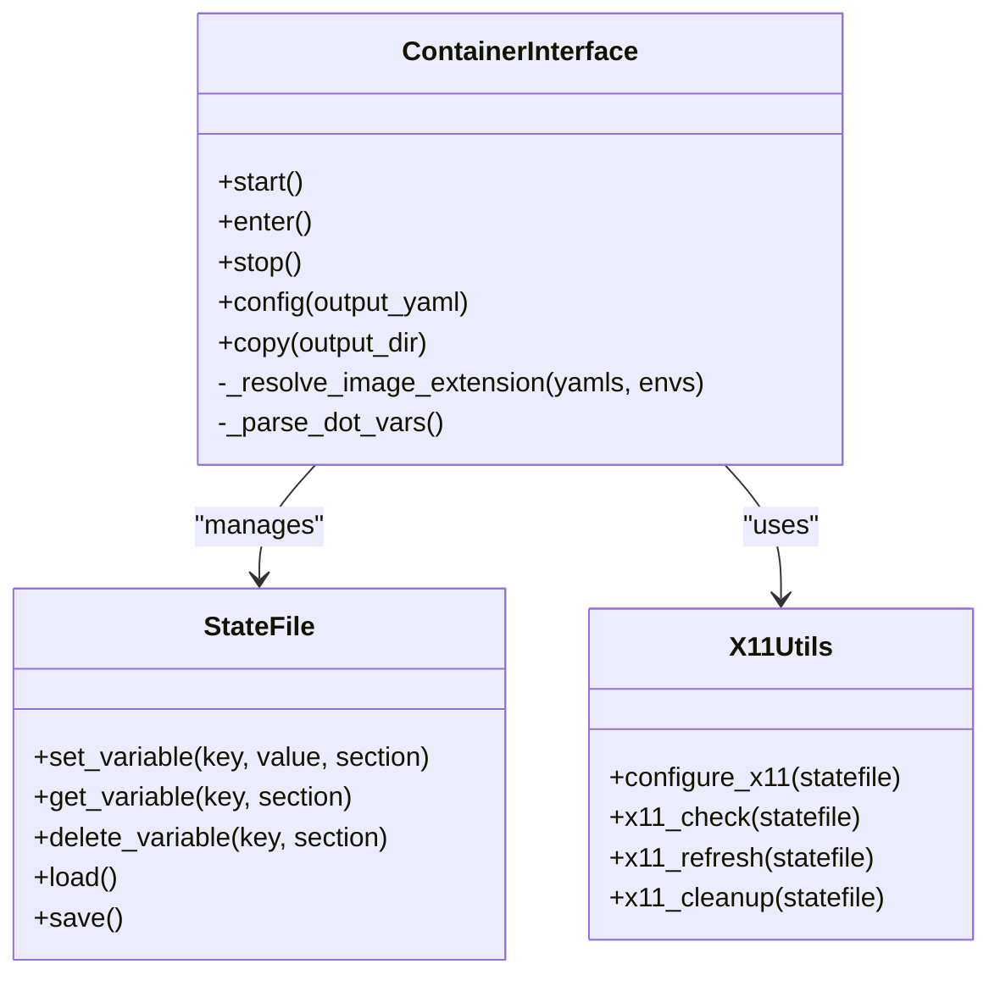
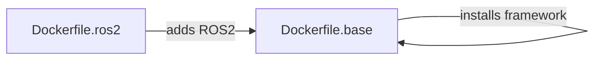
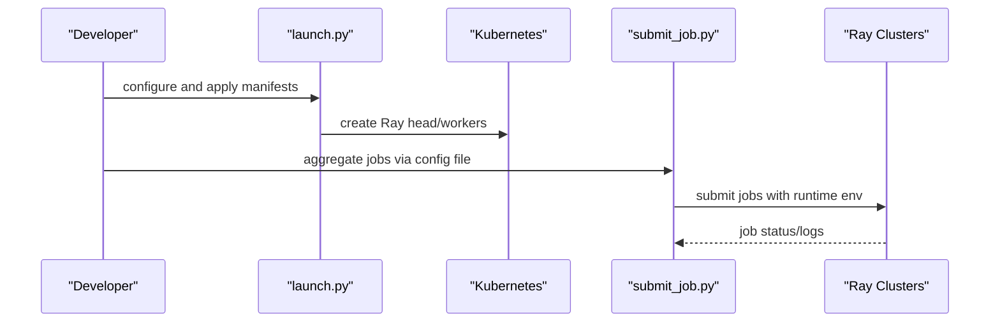
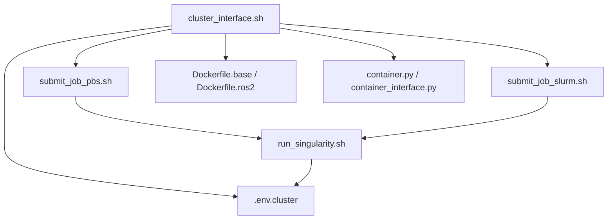

# Cluster and HPC Deployment

<cite>
**Referenced Files in This Document**
- [cluster_interface.sh](file://docker/cluster/cluster_interface.sh)
- [run_singularity.sh](file://docker/cluster/run_singularity.sh)
- [submit_job_pbs.sh](file://docker/cluster/submit_job_pbs.sh)
- [submit_job_slurm.sh](file://docker/cluster/submit_job_slurm.sh)
- [Dockerfile.base](file://docker/Dockerfile.base)
- [Dockerfile.ros2](file://docker/Dockerfile.ros2)
- [container.py](file://docker/container.py)
- [container.sh](file://docker/container.sh)
- [container_interface.py](file://docker/utils/container_interface.py)
- [state_file.py](file://docker/utils/state_file.py)
- [x11_utils.py](file://docker/utils/x11_utils.py)
- [environment.yml](file://environment.yml)
- [launch.py](file://scripts/reinforcement_learning/ray/launch.py)
- [submit_job.py](file://scripts/reinforcement_learning/ray/submit_job.py)
</cite>

## Table of Contents
1. [Introduction](#introduction)
2. [Project Structure](#project-structure)
3. [Core Components](#core-components)
4. [Architecture Overview](#architecture-overview)
5. [Detailed Component Analysis](#detailed-component-analysis)
6. [Dependency Analysis](#dependency-analysis)
7. [Performance Considerations](#performance-considerations)
8. [Troubleshooting Guide](#troubleshooting-guide)
9. [Conclusion](#conclusion)
10. [Appendices](#appendices)

## Introduction
This document explains cluster and high-performance computing (HPC) deployment strategies for the repository’s reinforcement learning and simulation workflows. It focuses on:
- Singularity containerization for HPC environments, including container conversion, runtime configuration, and GPU resource allocation
- Job submission systems for PBS and Slurm schedulers, including job script creation, queue management, and resource specification
- Cluster interface utilities for managing distributed training jobs, monitoring system status, and handling job dependencies
- Practical examples for deploying an ablation study framework across multiple nodes, configuring GPU scheduling, and optimizing resource utilization
- Cluster-specific considerations such as file system access, network topology, and inter-node communication
- Troubleshooting guides and performance optimization techniques for large-scale distributed training

## Project Structure
The repository provides a cohesive set of scripts and utilities to support containerized HPC deployments:
- Cluster orchestration and job submission: Bash scripts under docker/cluster
- Container build and management: Python utilities under docker/utils and Dockerfiles under docker
- HPC-ready container base: Dockerfile.base and Dockerfile.ros2
- Distributed training helpers: Ray-based scripts under scripts/reinforcement_learning/ray

**Diagram sources**
- [cluster_interface.sh:140-212](file://docker/cluster/cluster_interface.sh#L140-L212)
- [run_singularity.sh:36-83](file://docker/cluster/run_singularity.sh#L36-L83)
- [submit_job_pbs.sh:8-24](file://docker/cluster/submit_job_pbs.sh#L8-L24)
- [submit_job_slurm.sh:8-26](file://docker/cluster/submit_job_slurm.sh#L8-L26)
- [Dockerfile.base:10-112](file://docker/Dockerfile.base#L10-L112)
- [Dockerfile.ros2:7-40](file://docker/Dockerfile.ros2#L7-L40)

**Section sources**
- [cluster_interface.sh:140-212](file://docker/cluster/cluster_interface.sh#L140-L212)
- [run_singularity.sh:36-83](file://docker/cluster/run_singularity.sh#L36-L83)
- [submit_job_pbs.sh:8-24](file://docker/cluster/submit_job_pbs.sh#L8-L24)
- [submit_job_slurm.sh:8-26](file://docker/cluster/submit_job_slurm.sh#L8-L26)
- [Dockerfile.base:10-112](file://docker/Dockerfile.base#L10-L112)
- [Dockerfile.ros2:7-40](file://docker/Dockerfile.ros2#L7-L40)

## Core Components
- Cluster interface wrapper: Orchestrates container conversion to Singularity, transfers images and code to the cluster, and submits jobs to PBS or Slurm.
- Runtime executor: Prepares caches, binds directories, launches Singularity with GPU and writable containment, and synchronizes results back.
- Scheduler adapters: Generate job scripts with resource specs and invoke the runtime executor.
- Container build system: Provides a Python CLI to build/start/enter/stop containers and manage environment overlays.
- HPC base image: Installs dependencies, sets up symbolic links, and prepares directories for Singularity bind mounts.

Key responsibilities:
- Container conversion: Build Singularity sandbox from Docker image, tar for efficient transfer, and upload to cluster storage.
- Job lifecycle: Sync code, validate image presence, submit job, and optionally remove temporary copies after completion.
- Resource binding: Map cache directories and logs into the container for persistent state and performance.

**Section sources**
- [cluster_interface.sh:140-212](file://docker/cluster/cluster_interface.sh#L140-L212)
- [run_singularity.sh:36-83](file://docker/cluster/run_singularity.sh#L36-L83)
- [submit_job_pbs.sh:8-24](file://docker/cluster/submit_job_pbs.sh#L8-L24)
- [submit_job_slurm.sh:8-26](file://docker/cluster/submit_job_slurm.sh#L8-L26)
- [container.py:93-143](file://docker/container.py#L93-L143)
- [container_interface.py:17-317](file://docker/utils/container_interface.py#L17-L317)
- [Dockerfile.base:51-112](file://docker/Dockerfile.base#L51-L112)

## Architecture Overview
The deployment pipeline converts a Docker image into a Singularity image, transfers it to the cluster, syncs the local codebase, and submits a job to the chosen scheduler. The compute node executes the runtime script, which mounts caches and logs, runs the simulation/training entrypoint, and persists outputs.

**Diagram sources**
- [cluster_interface.sh:140-212](file://docker/cluster/cluster_interface.sh#L140-L212)
- [submit_job_pbs.sh:8-24](file://docker/cluster/submit_job_pbs.sh#L8-L24)
- [submit_job_slurm.sh:8-26](file://docker/cluster/submit_job_slurm.sh#L8-L26)
- [run_singularity.sh:36-83](file://docker/cluster/run_singularity.sh#L36-L83)

## Detailed Component Analysis

### Singularity Containerization for HPC
- Conversion: The cluster interface builds a Singularity sandbox from the local Docker image and tars it for fast transfer to the cluster.
- Image placement: The tarball is uploaded to a cluster-wide path and later extracted on the compute node.
- Runtime execution: The runtime script sets up cache directories, binds host caches/logs into the container, and executes the training entrypoint with GPU support.

**Diagram sources**
- [cluster_interface.sh:155-176](file://docker/cluster/cluster_interface.sh#L155-L176)
- [run_singularity.sh:9-25](file://docker/cluster/run_singularity.sh#L9-L25)
- [run_singularity.sh:60-72](file://docker/cluster/run_singularity.sh#L60-L72)

**Section sources**
- [cluster_interface.sh:155-176](file://docker/cluster/cluster_interface.sh#L155-L176)
- [run_singularity.sh:9-25](file://docker/cluster/run_singularity.sh#L9-L25)
- [run_singularity.sh:60-72](file://docker/cluster/run_singularity.sh#L60-L72)

### Job Submission Systems (PBS and Slurm)
- PBS adapter: Generates a job script with resource directives (nodes, cpus, gpus, walltime), attaches log merging, and submits via qsub.
- Slurm adapter: Creates a job script with task and GPU directives, sets mail notifications, and submits via sbatch.
- Both adapters pass the cluster directory and container profile to the runtime script.

**Diagram sources**
- [submit_job_pbs.sh:8-24](file://docker/cluster/submit_job_pbs.sh#L8-L24)
- [submit_job_slurm.sh:8-26](file://docker/cluster/submit_job_slurm.sh#L8-L26)
- [run_singularity.sh:58-72](file://docker/cluster/run_singularity.sh#L58-L72)

**Section sources**
- [submit_job_pbs.sh:8-24](file://docker/cluster/submit_job_pbs.sh#L8-L24)
- [submit_job_slurm.sh:8-26](file://docker/cluster/submit_job_slurm.sh#L8-L26)

### Cluster Interface Utilities
- Command dispatch: push (convert and upload), job (sync code, validate image, submit).
- Environment sourcing: Loads cluster-specific variables for paths and credentials.
- Version checks: Validates Docker and Apptainer versions for compatibility.
- Remote execution: Uses SSH to prepare directories, rsync code, and run scheduler adapters.

**Diagram sources**
- [cluster_interface.sh:140-212](file://docker/cluster/cluster_interface.sh#L140-L212)

**Section sources**
- [cluster_interface.sh:140-212](file://docker/cluster/cluster_interface.sh#L140-L212)

### Container Build and Management
- Python CLI: Provides commands to start, enter, stop, config, and copy artifacts from containers.
- Profiles and overlays: Supports base and extended profiles, merges YAML and env files, and manages X11 forwarding state.
- State persistence: Uses a state file to track X11 forwarding configuration and temporary artifacts.

**Diagram sources**
- [container_interface.py:17-317](file://docker/utils/container_interface.py#L17-L317)
- [state_file.py:14-152](file://docker/utils/state_file.py#L14-L152)
- [x11_utils.py:19-228](file://docker/utils/x11_utils.py#L19-L228)

**Section sources**
- [container.py:93-143](file://docker/container.py#L93-L143)
- [container_interface.py:17-317](file://docker/utils/container_interface.py#L17-L317)
- [state_file.py:14-152](file://docker/utils/state_file.py#L14-L152)
- [x11_utils.py:19-228](file://docker/utils/x11_utils.py#L19-L228)

### HPC Base Image and ROS2 Extension
- Base image: Installs dependencies, sets up symbolic links to Isaac Sim, prepares cache directories, and installs the framework.
- ROS2 extension: Extends the base image to include ROS2 packages and RMW configurations.

**Diagram sources**
- [Dockerfile.base:51-112](file://docker/Dockerfile.base#L51-L112)
- [Dockerfile.ros2:13-40](file://docker/Dockerfile.ros2#L13-L40)

**Section sources**
- [Dockerfile.base:51-112](file://docker/Dockerfile.base#L51-L112)
- [Dockerfile.ros2:13-40](file://docker/Dockerfile.ros2#L13-L40)

### Distributed Training Helpers (Ray)
- Cluster provisioning: Launches Kubernetes-based Ray clusters with configurable accelerators and worker counts.
- Job submission: Distributes aggregate jobs across clusters, supports splitting by delimiters, and fetches logs.

**Diagram sources**
- [launch.py:40-85](file://scripts/reinforcement_learning/ray/launch.py#L40-L85)
- [submit_job.py:58-107](file://scripts/reinforcement_learning/ray/submit_job.py#L58-L107)

**Section sources**
- [launch.py:40-85](file://scripts/reinforcement_learning/ray/launch.py#L40-L85)
- [submit_job.py:58-107](file://scripts/reinforcement_learning/ray/submit_job.py#L58-L107)

## Dependency Analysis
- Cluster interface depends on environment variables for cluster connectivity and paths.
- Runtime script depends on cache/log bind paths and Singularity invocation flags.
- Scheduler adapters depend on cluster resource quotas and queue policies.
- Container build system depends on Docker Compose and environment overlays.

**Diagram sources**
- [cluster_interface.sh:140-212](file://docker/cluster/cluster_interface.sh#L140-L212)
- [run_singularity.sh:36-83](file://docker/cluster/run_singularity.sh#L36-L83)
- [submit_job_pbs.sh:8-24](file://docker/cluster/submit_job_pbs.sh#L8-L24)
- [submit_job_slurm.sh:8-26](file://docker/cluster/submit_job_slurm.sh#L8-L26)
- [Dockerfile.base:10-112](file://docker/Dockerfile.base#L10-L112)
- [Dockerfile.ros2:7-40](file://docker/Dockerfile.ros2#L7-L40)
- [container.py:93-143](file://docker/container.py#L93-L143)
- [container_interface.py:17-317](file://docker/utils/container_interface.py#L17-L317)

**Section sources**
- [cluster_interface.sh:140-212](file://docker/cluster/cluster_interface.sh#L140-L212)
- [run_singularity.sh:36-83](file://docker/cluster/run_singularity.sh#L36-L83)
- [submit_job_pbs.sh:8-24](file://docker/cluster/submit_job_pbs.sh#L8-L24)
- [submit_job_slurm.sh:8-26](file://docker/cluster/submit_job_slurm.sh#L8-L26)
- [Dockerfile.base:10-112](file://docker/Dockerfile.base#L10-L112)
- [Dockerfile.ros2:7-40](file://docker/Dockerfile.ros2#L7-L40)
- [container.py:93-143](file://docker/container.py#L93-L143)
- [container_interface.py:17-317](file://docker/utils/container_interface.py#L17-L317)

## Performance Considerations
- Container conversion: Prefer sandbox builds and tar transfers to minimize overhead during cluster uploads.
- Cache reuse: Bind cache directories to reduce repeated downloads and speed up startup.
- GPU scheduling: Specify accurate GPU counts and types in job scripts; align with cluster queue policies.
- I/O locality: Place cache and logs on shared filesystems accessible to compute nodes.
- Concurrency: For Slurm, use job arrays or batch submissions to maximize queue utilization without overloading the scheduler.
- Network: Ensure inter-node communication paths are optimized; avoid excessive data movement between nodes.

[No sources needed since this section provides general guidance]

## Troubleshooting Guide
Common issues and resolutions:
- Docker/Apptainer version mismatch: The cluster interface validates versions and warns on non-tested combinations. Align versions as indicated by the compatibility checks.
- Missing Docker image: The interface checks for the image locally before conversion; ensure the image exists or build it first.
- Missing Singularity image on cluster: The interface verifies the tarball presence on the remote host; confirm upload succeeded.
- SSH connectivity: Ensure SSH keys are configured and the cluster login host is reachable.
- Scheduler resource limits: Adjust PBS/Slurm directives to match cluster quotas; verify queue availability.
- Cache synchronization: Confirm bind paths for caches and logs; ensure sufficient disk space on the shared filesystem.
- Ray cluster provisioning: Validate Kubernetes configuration and manifests; ensure required secrets and RBAC are present.

**Section sources**
- [cluster_interface.sh:30-53](file://docker/cluster/cluster_interface.sh#L30-L53)
- [cluster_interface.sh:55-72](file://docker/cluster/cluster_interface.sh#L55-L72)
- [run_singularity.sh:9-25](file://docker/cluster/run_singularity.sh#L9-L25)

## Conclusion
The repository provides a robust, modular pipeline for HPC deployment:
- Convert Docker images to Singularity for portable, GPU-accelerated execution
- Automate job submission to PBS and Slurm with scheduler-specific adapters
- Manage containerized environments with flexible profiles and overlays
- Support distributed training via Kubernetes-based Ray clusters
Adhering to the outlined practices ensures reliable, scalable, and maintainable HPC workflows.

[No sources needed since this section summarizes without analyzing specific files]

## Appendices

### Appendix A: Environment and Profiles
- Environment files: Use .env.cluster and .env.base to configure cluster paths and container settings.
- Profiles: Base and extended profiles (e.g., ros) are supported; pass profile names to container and cluster commands.

**Section sources**
- [environment.yml:6-12](file://environment.yml#L6-L12)
- [container.py:24-60](file://docker/container.py#L24-L60)
- [container_interface.py:56-72](file://docker/utils/container_interface.py#L56-L72)

### Appendix B: Practical Deployment Examples
- Ablation study across nodes:
  - Prepare a base profile container and upload to the cluster.
  - Write Slurm/PBS job scripts specifying multiple nodes and GPUs.
  - Launch distributed training with inter-node communication enabled.
- GPU scheduling:
  - Select appropriate GPU types and counts in job scripts.
  - Verify queue policies and adjust walltime/mem-per-cpu accordingly.
- Resource optimization:
  - Reuse caches via bind mounts.
  - Minimize code sync frequency; remove temporary copies after successful runs.

[No sources needed since this section provides general guidance]