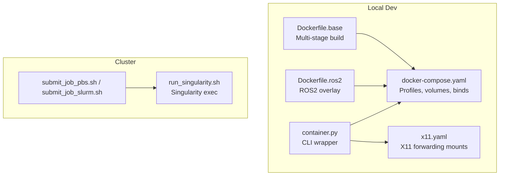
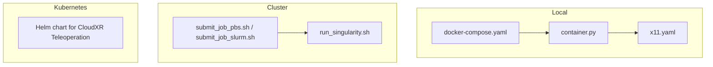
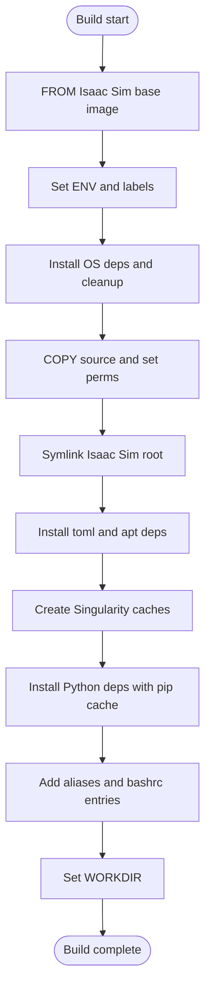
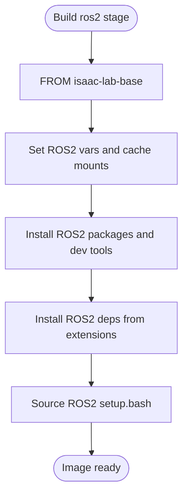
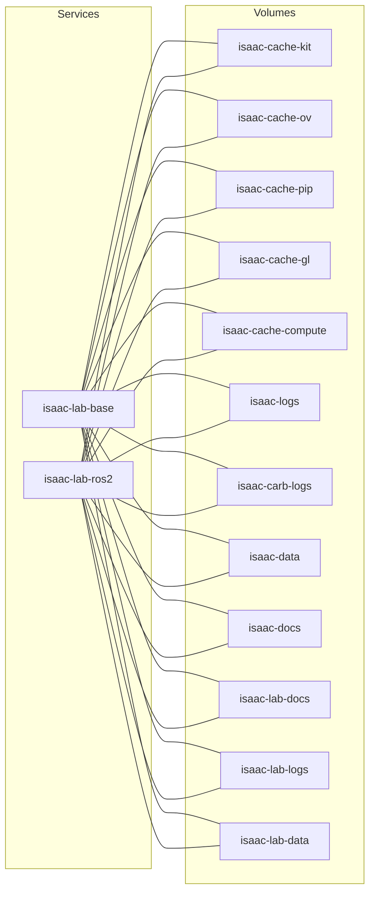
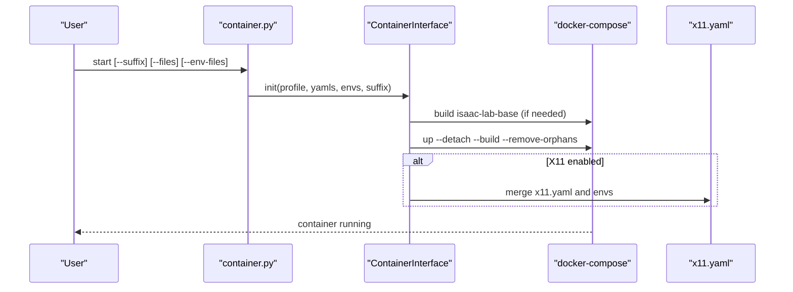
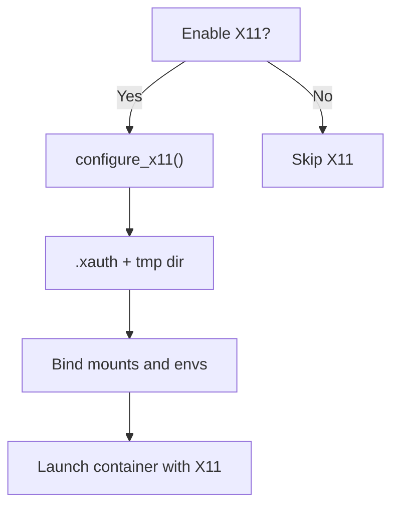
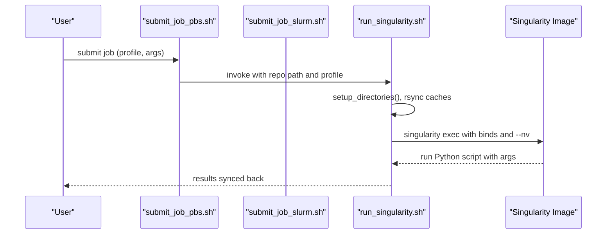
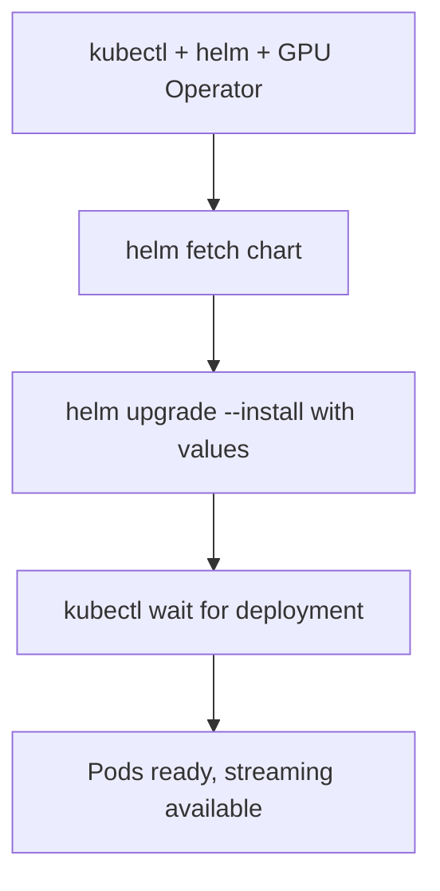
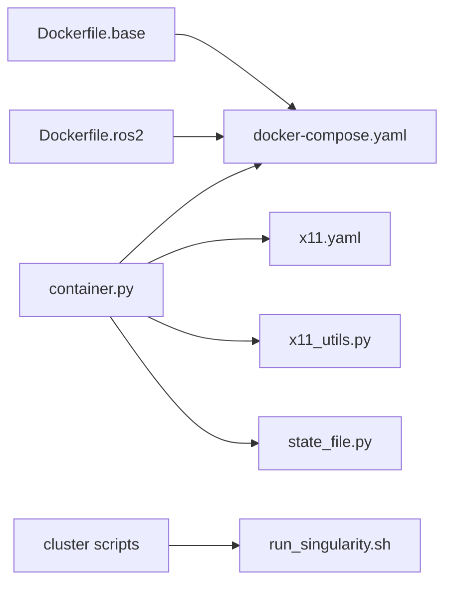

# Containerization and Deployment

<cite>
**Referenced Files in This Document**
- [Dockerfile.base](file://docker/Dockerfile.base)
- [Dockerfile.ros2](file://docker/Dockerfile.ros2)
- [docker-compose.yaml](file://docker/docker-compose.yaml)
- [container.py](file://docker/container.py)
- [container.sh](file://docker/container.sh)
- [container_interface.py](file://docker/utils/container_interface.py)
- [x11_utils.py](file://docker/utils/x11_utils.py)
- [state_file.py](file://docker/utils/state_file.py)
- [x11.yaml](file://docker/x11.yaml)
- [submit_job_pbs.sh](file://docker/cluster/submit_job_pbs.sh)
- [submit_job_slurm.sh](file://docker/cluster/submit_job_slurm.sh)
- [run_singularity.sh](file://docker/cluster/run_singularity.sh)
- [test_docker.py](file://docker/test/test_docker.py)
- [deployment/index.rst](file://docs/source/deployment/index.rst)
- [deployment/docker.rst](file://docs/source/deployment/docker.rst)
- [deployment/cluster.rst](file://docs/source/deployment/cluster.rst)
- [cloudxr_teleoperation_cluster.rst](file://docs/source/deployment/cloudxr_teleoperation_cluster.rst)
</cite>

## Table of Contents
1. [Introduction](#introduction)
2. [Project Structure](#project-structure)
3. [Core Components](#core-components)
4. [Architecture Overview](#architecture-overview)
5. [Detailed Component Analysis](#detailed-component-analysis)
6. [Dependency Analysis](#dependency-analysis)
7. [Performance Considerations](#performance-considerations)
8. [Troubleshooting Guide](#troubleshooting-guide)
9. [Conclusion](#conclusion)
10. [Appendices](#appendices)

## Introduction
This document explains the containerization and deployment infrastructure supporting scalable training of the ablation study framework. It covers Docker multi-stage builds, environment provisioning, distributed training on clusters using PBS/Slurm, Singularity/HPC workflows, cloud and Kubernetes deployments, networking and volumes, inter-process communication, and operational best practices for reproducibility and performance.

## Project Structure
The deployment stack centers on:
- Docker base image layered on top of the Isaac Sim base image
- Multi-stage Dockerfile extensions (base and ROS2)
- docker-compose orchestration with persistent volumes and host binds
- CLI automation for container lifecycle and X11 forwarding
- Cluster submission scripts for PBS and Slurm, plus Singularity execution
- Documentation for Docker, cluster, and Kubernetes CloudXR deployments

**Diagram sources**
- [Dockerfile.base:10-12](file://docker/Dockerfile.base#L10-L12)
- [Dockerfile.ros2:7-7](file://docker/Dockerfile.ros2#L7-L7)
- [docker-compose.yaml:86-137](file://docker/docker-compose.yaml#L86-L137)
- [container.py:103-135](file://docker/container.py#L103-L135)
- [x11.yaml:6-41](file://docker/x11.yaml#L6-L41)
- [submit_job_pbs.sh:8-22](file://docker/cluster/submit_job_pbs.sh#L8-L22)
- [submit_job_slurm.sh:8-24](file://docker/cluster/submit_job_slurm.sh#L8-L24)
- [run_singularity.sh:50-72](file://docker/cluster/run_singularity.sh#L50-L72)

**Section sources**
- [deployment/index.rst:1-24](file://docs/source/deployment/index.rst#L1-L24)
- [docker-compose.yaml:10-71](file://docker/docker-compose.yaml#L10-L71)

## Core Components
- Base image build: Extends the Isaac Sim base image, installs OS and Python dependencies, symlinks the Isaac Sim root, and prepares caches for Singularity compatibility.
- ROS2 extension: Installs ROS2 Humble and RMW implementations, and sources ROS2 in the shell.
- Orchestration: docker-compose profiles for base and ros2, with persistent volumes for caches/logs/data and host binds for rapid iteration.
- CLI automation: container.py orchestrates builds, starts/stops containers, enters shells, copies artifacts, and merges additional compose/env files.
- X11 forwarding: Optional GUI support via temporary .xauth and bind mounts.
- Cluster integration: Job wrappers for PBS/Slurm and Singularity execution on compute nodes.

**Section sources**
- [Dockerfile.base:10-112](file://docker/Dockerfile.base#L10-L112)
- [Dockerfile.ros2:7-40](file://docker/Dockerfile.ros2#L7-L40)
- [docker-compose.yaml:86-137](file://docker/docker-compose.yaml#L86-L137)
- [container.py:93-143](file://docker/container.py#L93-L143)
- [x11_utils.py:64-121](file://docker/utils/x11_utils.py#L64-L121)
- [x11.yaml:6-41](file://docker/x11.yaml#L6-L41)

## Architecture Overview
The system supports three primary deployment modes:
- Local Docker Desktop for development and testing
- HPC clusters via Singularity with PBS/Slurm scheduling
- Kubernetes for CloudXR teleoperation

**Diagram sources**
- [docker-compose.yaml:86-137](file://docker/docker-compose.yaml#L86-L137)
- [container.py:103-135](file://docker/container.py#L103-L135)
- [x11.yaml:6-41](file://docker/x11.yaml#L6-L41)
- [submit_job_pbs.sh:8-22](file://docker/cluster/submit_job_pbs.sh#L8-L22)
- [submit_job_slurm.sh:8-24](file://docker/cluster/submit_job_slurm.sh#L8-L24)
- [run_singularity.sh:50-72](file://docker/cluster/run_singularity.sh#L50-L72)
- [cloudxr_teleoperation_cluster.rst:68-128](file://docs/source/deployment/cloudxr_teleoperation_cluster.rst#L68-L128)

## Detailed Component Analysis

### Docker Base Image Build
- Uses the Isaac Sim base image as ARG-driven foundation.
- Installs OS/build tools, sets environment variables, and prepares caches for Singularity compatibility.
- Symlinks the Isaac Sim root and installs Python dependencies via isaaclab.sh.
- Sets convenient aliases and working directory.

**Diagram sources**
- [Dockerfile.base:10-112](file://docker/Dockerfile.base#L10-L112)

**Section sources**
- [Dockerfile.base:10-112](file://docker/Dockerfile.base#L10-L112)

### ROS2 Image Extension
- Builds atop the base image, installs ROS2 Humble and RMWs, sources ROS2 in .bashrc, and integrates ROS2 dependencies declared by extensions.

**Diagram sources**
- [Dockerfile.ros2:7-40](file://docker/Dockerfile.ros2#L7-L40)

**Section sources**
- [Dockerfile.ros2:7-40](file://docker/Dockerfile.ros2#L7-L40)

### Docker Compose Orchestration
- Profiles: base and ros2
- Persistent volumes for caches/logs/data and host binds for source/docs/scripts/tools
- GPU exposure via device reservations
- Host networking for GUI/X11 and direct access

**Diagram sources**
- [docker-compose.yaml:10-71](file://docker/docker-compose.yaml#L10-L71)
- [docker-compose.yaml:86-137](file://docker/docker-compose.yaml#L86-L137)

**Section sources**
- [docker-compose.yaml:10-71](file://docker/docker-compose.yaml#L10-L71)
- [docker-compose.yaml:86-137](file://docker/docker-compose.yaml#L86-L137)

### CLI Automation and Lifecycle Management
- container.py wraps docker-compose with commands: start, enter, config, copy, stop.
- Supports merging additional compose/env files and optional suffix for image/container naming.
- Integrates X11 forwarding via x11.yaml and temporary .xauth management.

**Diagram sources**
- [container.py:103-135](file://docker/container.py#L103-L135)
- [container_interface.py:111-151](file://docker/utils/container_interface.py#L111-L151)
- [x11.yaml:6-41](file://docker/x11.yaml#L6-L41)

**Section sources**
- [container.py:93-143](file://docker/container.py#L93-L143)
- [container_interface.py:17-83](file://docker/utils/container_interface.py#L17-L83)
- [x11_utils.py:64-121](file://docker/utils/x11_utils.py#L64-L121)
- [x11.yaml:6-41](file://docker/x11.yaml#L6-L41)

### X11 Forwarding Utilities
- Creates and manages a temporary .xauth file and bind-mounts required paths.
- Persists state in a .container.cfg file for repeatable sessions.

**Diagram sources**
- [x11_utils.py:21-61](file://docker/utils/x11_utils.py#L21-L61)
- [x11.yaml:6-41](file://docker/x11.yaml#L6-L41)

**Section sources**
- [x11_utils.py:64-121](file://docker/utils/x11_utils.py#L64-L121)
- [x11.yaml:6-41](file://docker/x11.yaml#L6-L41)

### Cluster Submission and Singularity Execution
- Job scripts define scheduler directives and delegate to run_singularity.sh.
- run_singularity.sh prepares caches, syncs code, executes within Singularity with GPU access, and rsyncs results back.

**Diagram sources**
- [submit_job_pbs.sh:8-22](file://docker/cluster/submit_job_pbs.sh#L8-L22)
- [submit_job_slurm.sh:8-24](file://docker/cluster/submit_job_slurm.sh#L8-L24)
- [run_singularity.sh:9-82](file://docker/cluster/run_singularity.sh#L9-L82)

**Section sources**
- [submit_job_pbs.sh:1-24](file://docker/cluster/submit_job_pbs.sh#L1-L24)
- [submit_job_slurm.sh:1-26](file://docker/cluster/submit_job_slurm.sh#L1-L26)
- [run_singularity.sh:1-83](file://docker/cluster/run_singularity.sh#L1-L83)

### Kubernetes CloudXR Teleoperation
- Helm chart deployment for CloudXR Teleoperation on Kubernetes with GPU Operator and host network or LoadBalancer.
- Validates readiness and provides uninstall steps.

**Diagram sources**
- [cloudxr_teleoperation_cluster.rst:68-128](file://docs/source/deployment/cloudxr_teleoperation_cluster.rst#L68-L128)

**Section sources**
- [cloudxr_teleoperation_cluster.rst:1-205](file://docs/source/deployment/cloudxr_teleoperation_cluster.rst#L1-L205)

## Dependency Analysis
- Dockerfile.base depends on the Isaac Sim base image and installs OS/Python dependencies.
- Dockerfile.ros2 depends on the base image and installs ROS2 packages and RMWs.
- docker-compose.yaml depends on environment variables and binds volumes for caches/logs/data.
- container.py depends on container_interface.py and x11_utils.py for orchestration and X11.
- Cluster scripts depend on Singularity/apptainer and cluster environment variables.

**Diagram sources**
- [Dockerfile.base:10-112](file://docker/Dockerfile.base#L10-L112)
- [Dockerfile.ros2:7-40](file://docker/Dockerfile.ros2#L7-L40)
- [docker-compose.yaml:86-137](file://docker/docker-compose.yaml#L86-L137)
- [container.py:103-135](file://docker/container.py#L103-L135)
- [x11.yaml:6-41](file://docker/x11.yaml#L6-L41)
- [x11_utils.py:64-121](file://docker/utils/x11_utils.py#L64-L121)
- [state_file.py:14-152](file://docker/utils/state_file.py#L14-L152)
- [run_singularity.sh:50-72](file://docker/cluster/run_singularity.sh#L50-L72)

**Section sources**
- [container_interface.py:269-317](file://docker/utils/container_interface.py#L269-L317)
- [x11_utils.py:64-121](file://docker/utils/x11_utils.py#L64-L121)

## Performance Considerations
- Use host networking for low-latency GUI and direct GPU access during development.
- Persist caches and logs via named volumes to reduce cold-start costs and accelerate asset loading.
- Prefer bind mounts for source/docs/scripts/tools to avoid rebuilds during iteration.
- On clusters, pre-export Singularity images and stage caches to minimize per-job overhead.
- For large-scale training, leverage GPU reservations and scheduler placement to avoid contention.

[No sources needed since this section provides general guidance]

## Troubleshooting Guide
Common issues and resolutions:
- Docker not installed or permission denied: ensure Docker Engine and Docker Compose are installed and post-install steps are followed.
- X11 forwarding failures: install xauth and enable X11 via the CLI; confirm .xauth file and bind mounts are present.
- Container not running: use the enter command to verify status; rebuild if X11 state is missing.
- Cluster job failures: verify scheduler directives, internet access on compute nodes, and Singularity/apptainer versions.
- Kubernetes deployment: ensure GPU Operator and NVIDIA Container Toolkit are installed and RBAC permissions are granted.

**Section sources**
- [deployment/docker.rst:21-37](file://docs/source/deployment/docker.rst#L21-L37)
- [x11_utils.py:40-44](file://docker/utils/x11_utils.py#L40-L44)
- [x11_utils.py:220-227](file://docker/utils/x11_utils.py#L220-L227)
- [deployment/cluster.rst:14-26](file://docs/source/deployment/cluster.rst#L14-L26)
- [cloudxr_teleoperation_cluster.rst:18-38](file://docs/source/deployment/cloudxr_teleoperation_cluster.rst#L18-L38)

## Conclusion
The deployment infrastructure combines Docker multi-stage builds, docker-compose orchestration, and cluster-ready Singularity workflows to support reproducible, scalable training. With persistent caches, host binds, and optional X11 forwarding, developers can iterate quickly locally, while cluster and Kubernetes deployments enable large-scale distributed training and CloudXR teleoperation.

[No sources needed since this section summarizes without analyzing specific files]

## Appendices

### Practical Examples
- Local container lifecycle:
  - Start base or ros2 container with optional suffix and additional compose/env files.
  - Enter the running container and run Python scripts.
  - Copy artifacts from logs/docs/data_storage to host.
  - Stop and remove the container.
- Cluster job submission:
  - Configure cluster parameters in the cluster environment file.
  - Export Singularity image once, then submit jobs with scheduler-specific scripts.
  - Pass training arguments; ensure outputs are written under logs for persistence.
- Kubernetes CloudXR:
  - Fetch Helm chart, install with host network or LoadBalancer, and verify readiness.

**Section sources**
- [deployment/docker.rst:76-118](file://docs/source/deployment/docker.rst#L76-L118)
- [deployment/cluster.rst:179-204](file://docs/source/deployment/cluster.rst#L179-L204)
- [cloudxr_teleoperation_cluster.rst:68-128](file://docs/source/deployment/cloudxr_teleoperation_cluster.rst#L68-L128)

### Resource Allocation and Scaling Strategies
- Local: Use docker-compose GPU reservations to expose all GPUs to the container.
- Cluster: Define CPU/GPU/time limits per job; stage caches to reduce startup time.
- Kubernetes: Allocate GPUs via Helm values and ensure sufficient storage for logs and datasets.

**Section sources**
- [docker-compose.yaml:77-84](file://docker/docker-compose.yaml#L77-L84)
- [submit_job_slurm.sh:11-21](file://docker/cluster/submit_job_slurm.sh#L11-L21)
- [submit_job_pbs.sh:11-16](file://docker/cluster/submit_job_pbs.sh#L11-L16)
- [cloudxr_teleoperation_cluster.rst:68-128](file://docs/source/deployment/cloudxr_teleoperation_cluster.rst#L68-L128)

### Monitoring Distributed Systems
- Logs: Persist training logs under logs to synchronize between compute nodes and cluster directories.
- Metrics: Use TensorBoard via the container’s Python alias for training metrics.
- Kubernetes: Monitor pod status and logs via kubectl.

**Section sources**
- [run_singularity.sh:45-47](file://docker/cluster/run_singularity.sh#L45-L47)
- [docker-compose.yaml:212-217](file://docker/docker-compose.yaml#L212-L217)
- [deployment/docker.rst:156-167](file://docs/source/deployment/docker.rst#L156-L167)