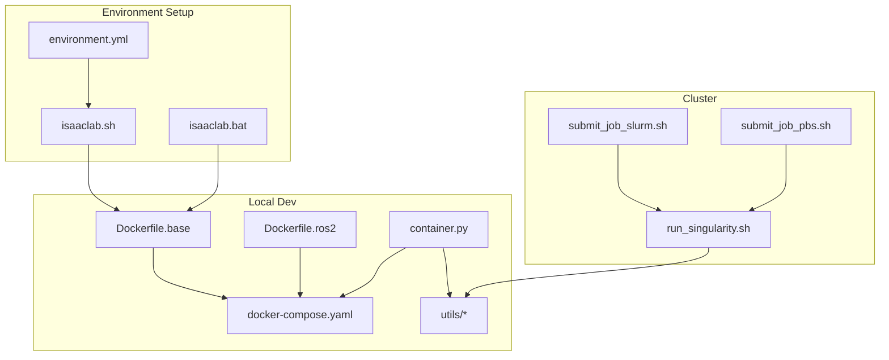
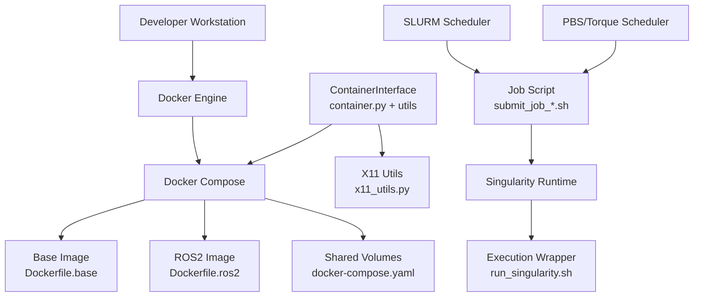
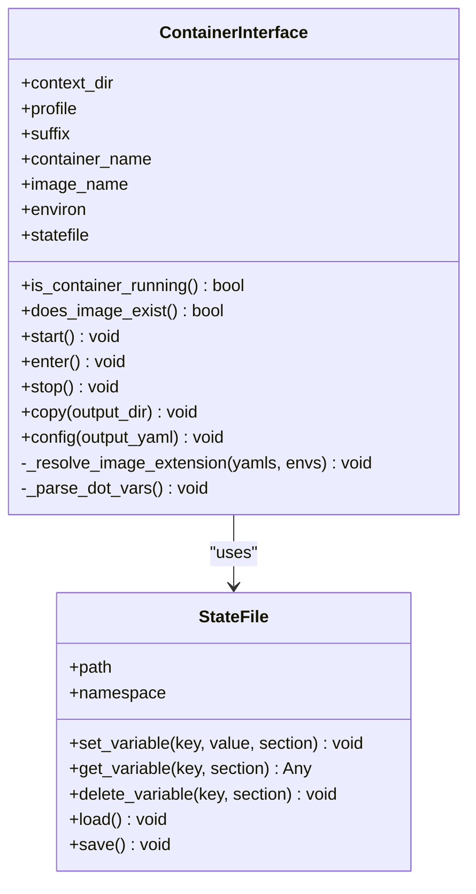
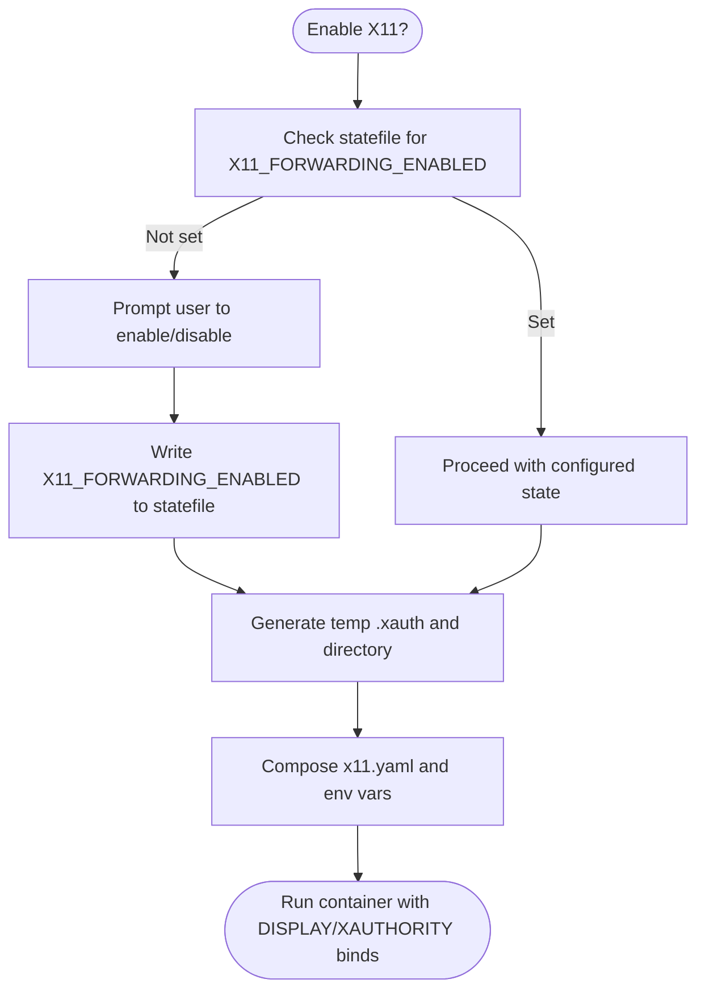
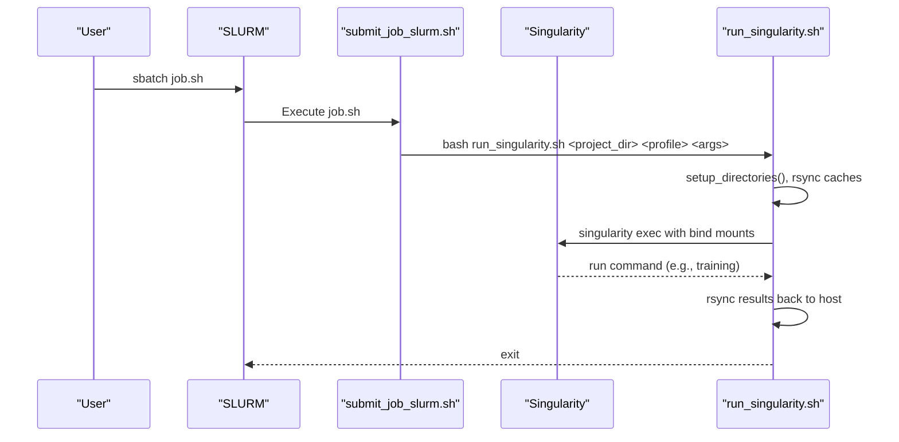
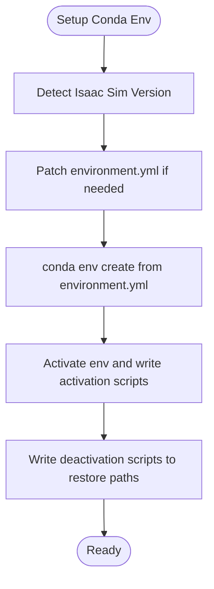
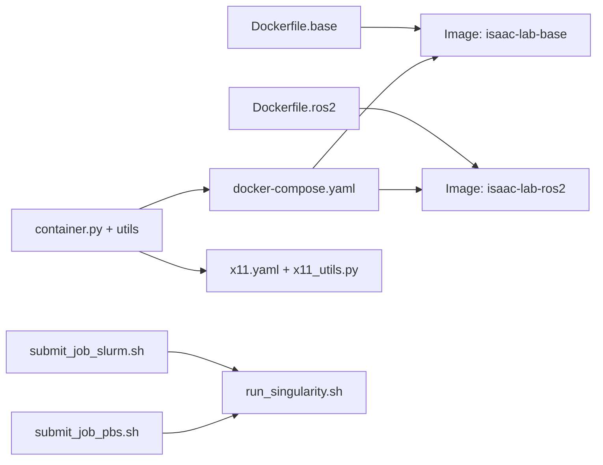
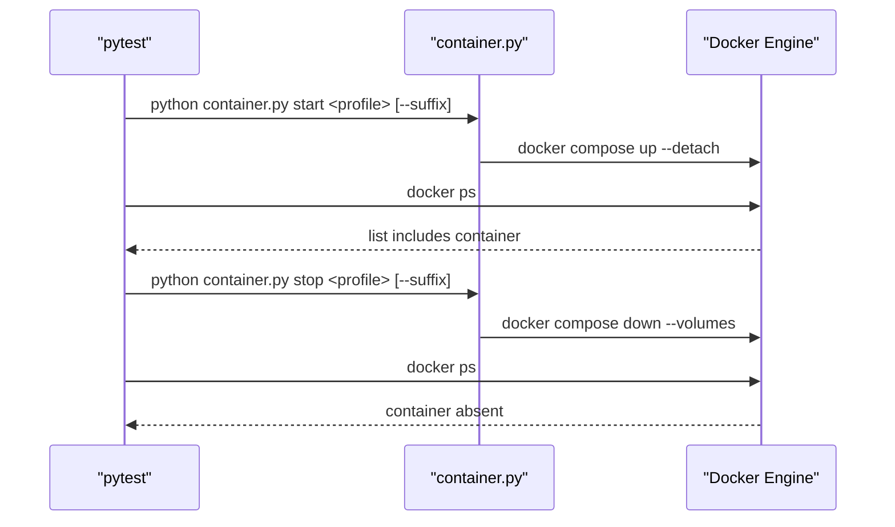
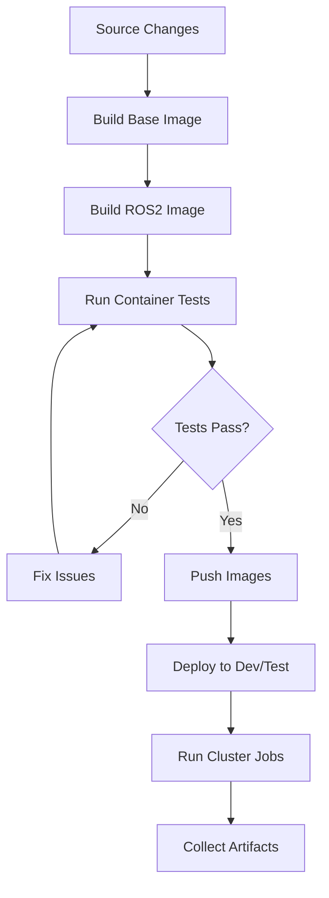

# Deployment Strategies and Best Practices

<cite>
**Referenced Files in This Document**
- [Dockerfile.base](file://docker/Dockerfile.base)
- [Dockerfile.ros2](file://docker/Dockerfile.ros2)
- [docker-compose.yaml](file://docker/docker-compose.yaml)
- [container.py](file://docker/container.py)
- [container_interface.py](file://docker/utils/container_interface.py)
- [state_file.py](file://docker/utils/state_file.py)
- [x11_utils.py](file://docker/utils/x11_utils.py)
- [x11.yaml](file://docker/x11.yaml)
- [test_docker.py](file://docker/test/test_docker.py)
- [run_singularity.sh](file://docker/cluster/run_singularity.sh)
- [submit_job_slurm.sh](file://docker/cluster/submit_job_slurm.sh)
- [submit_job_pbs.sh](file://docker/cluster/submit_job_pbs.sh)
- [isaaclab.sh](file://isaaclab.sh)
- [isaaclab.bat](file://isaaclab.bat)
- [environment.yml](file://environment.yml)
</cite>

## Table of Contents
1. [Introduction](#introduction)
2. [Project Structure](#project-structure)
3. [Core Components](#core-components)
4. [Architecture Overview](#architecture-overview)
5. [Detailed Component Analysis](#detailed-component-analysis)
6. [Dependency Analysis](#dependency-analysis)
7. [Performance Considerations](#performance-considerations)
8. [Testing Framework](#testing-framework)
9. [Deployment Pipelines and CI/CD](#deployment-pipelines-and-cicd)
10. [Infrastructure as Code (IaC)](#infrastructure-as-code-iac)
11. [Monitoring and Observability](#monitoring-and-observability)
12. [Updates and Rollbacks](#updates-and-rollbacks)
13. [Troubleshooting Guide](#troubleshooting-guide)
14. [Conclusion](#conclusion)

## Introduction
This document provides comprehensive deployment strategies and best practices for the project across diverse environments: local development, cloud computing platforms, high-performance computing (HPC) clusters, and edge deployment scenarios. It documents containerization and orchestration tooling, testing procedures for validating container deployments, utility functions for container management and environment setup, production-ready configuration examples, security hardening, performance optimization, CI/CD pipelines, infrastructure as code (IaC), monitoring, updates and rollbacks, and troubleshooting.

## Project Structure
The deployment tooling centers on Docker and Docker Compose for containerization, Singularity for HPC clusters, and helper scripts for environment setup and automation. The repository organizes deployment assets under the docker/ directory, with supporting scripts and configuration files enabling reproducible environments across platforms.

**Diagram sources**
- [Dockerfile.base:1-112](file://docker/Dockerfile.base#L1-L112)
- [Dockerfile.ros2:1-40](file://docker/Dockerfile.ros2#L1-L40)
- [docker-compose.yaml:1-154](file://docker/docker-compose.yaml#L1-L154)
- [container.py:1-143](file://docker/container.py#L1-L143)
- [container_interface.py:1-317](file://docker/utils/container_interface.py#L1-L317)
- [run_singularity.sh:1-83](file://docker/cluster/run_singularity.sh#L1-L83)
- [submit_job_slurm.sh:1-26](file://docker/cluster/submit_job_slurm.sh#L1-L26)
- [submit_job_pbs.sh:1-24](file://docker/cluster/submit_job_pbs.sh#L1-L24)
- [isaaclab.sh:1-547](file://isaaclab.sh#L1-L547)
- [isaaclab.bat:1-682](file://isaaclab.bat#L1-L682)
- [environment.yml:1-12](file://environment.yml#L1-L12)

**Section sources**
- [Dockerfile.base:1-112](file://docker/Dockerfile.base#L1-L112)
- [Dockerfile.ros2:1-40](file://docker/Dockerfile.ros2#L1-L40)
- [docker-compose.yaml:1-154](file://docker/docker-compose.yaml#L1-L154)
- [container.py:1-143](file://docker/container.py#L1-L143)
- [container_interface.py:1-317](file://docker/utils/container_interface.py#L1-L317)
- [run_singularity.sh:1-83](file://docker/cluster/run_singularity.sh#L1-L83)
- [submit_job_slurm.sh:1-26](file://docker/cluster/submit_job_slurm.sh#L1-L26)
- [submit_job_pbs.sh:1-24](file://docker/cluster/submit_job_pbs.sh#L1-L24)
- [isaaclab.sh:1-547](file://isaaclab.sh#L1-L547)
- [isaaclab.bat:1-682](file://isaaclab.bat#L1-L682)
- [environment.yml:1-12](file://environment.yml#L1-L12)

## Core Components
- Container base and ROS2 images: Base image builds the project, installs dependencies, and prepares runtime aliases. ROS2 image extends the base to include ROS2 Humble and related DDS implementations.
- Orchestration: docker-compose defines shared volumes, environment variables, GPU resource reservations, and profiles for base and ROS2 variants.
- Container management utility: A CLI wrapper orchestrating Docker Compose commands, X11 forwarding, and artifact copying.
- Cluster execution: Singularity wrapper and job submission scripts for SLURM/PBS batch systems.
- Environment setup: Cross-platform scripts to create conda environments, align Python versions with Isaac Sim, and manage environment activation/deactivation.

**Section sources**
- [Dockerfile.base:1-112](file://docker/Dockerfile.base#L1-L112)
- [Dockerfile.ros2:1-40](file://docker/Dockerfile.ros2#L1-L40)
- [docker-compose.yaml:1-154](file://docker/docker-compose.yaml#L1-L154)
- [container.py:1-143](file://docker/container.py#L1-L143)
- [container_interface.py:1-317](file://docker/utils/container_interface.py#L1-L317)
- [run_singularity.sh:1-83](file://docker/cluster/run_singularity.sh#L1-L83)
- [isaaclab.sh:193-308](file://isaaclab.sh#L193-L308)
- [isaaclab.bat:134-276](file://isaaclab.bat#L134-L276)

## Architecture Overview
The deployment architecture integrates local containerized development with cluster-scale execution. Local developers use Docker Compose to spin up base or ROS2-enabled containers, while HPC operators submit jobs that execute Singularity containers on compute nodes.

**Diagram sources**
- [docker-compose.yaml:85-137](file://docker/docker-compose.yaml#L85-L137)
- [Dockerfile.base:1-112](file://docker/Dockerfile.base#L1-L112)
- [Dockerfile.ros2:1-40](file://docker/Dockerfile.ros2#L1-L40)
- [container.py:93-143](file://docker/container.py#L93-L143)
- [container_interface.py:17-317](file://docker/utils/container_interface.py#L17-L317)
- [x11_utils.py:19-228](file://docker/utils/x11_utils.py#L19-L228)
- [submit_job_slurm.sh:1-26](file://docker/cluster/submit_job_slurm.sh#L1-L26)
- [submit_job_pbs.sh:1-24](file://docker/cluster/submit_job_pbs.sh#L1-L24)
- [run_singularity.sh:1-83](file://docker/cluster/run_singularity.sh#L1-L83)

## Detailed Component Analysis

### Container Management Utility
The container management utility provides a unified CLI to build, start, enter, stop, and copy artifacts from containers. It integrates with Docker Compose, supports optional X11 forwarding, and manages state via a configuration file.

**Diagram sources**
- [container_interface.py:17-317](file://docker/utils/container_interface.py#L17-L317)
- [state_file.py:14-152](file://docker/utils/state_file.py#L14-L152)

**Section sources**
- [container.py:15-143](file://docker/container.py#L15-L143)
- [container_interface.py:17-317](file://docker/utils/container_interface.py#L17-L317)
- [state_file.py:14-152](file://docker/utils/state_file.py#L14-L152)

### X11 Forwarding for GUI Apps
X11 utilities enable secure display forwarding by generating temporary authority files and injecting environment variables/volume mounts into the container.

**Diagram sources**
- [x11_utils.py:64-121](file://docker/utils/x11_utils.py#L64-L121)
- [x11.yaml:6-41](file://docker/x11.yaml#L6-L41)

**Section sources**
- [x11_utils.py:19-228](file://docker/utils/x11_utils.py#L19-L228)
- [x11.yaml:1-42](file://docker/x11.yaml#L1-L42)

### Cluster Execution with Singularity
The cluster execution pipeline copies the project and caches to a temporary directory on the compute node, launches Singularity with bind mounts for caches/logs/data, and synchronizes results back.

**Diagram sources**
- [submit_job_slurm.sh:1-26](file://docker/cluster/submit_job_slurm.sh#L1-L26)
- [run_singularity.sh:1-83](file://docker/cluster/run_singularity.sh#L1-L83)

**Section sources**
- [run_singularity.sh:9-83](file://docker/cluster/run_singularity.sh#L9-L83)
- [submit_job_slurm.sh:1-26](file://docker/cluster/submit_job_slurm.sh#L1-L26)
- [submit_job_pbs.sh:1-24](file://docker/cluster/submit_job_pbs.sh#L1-L24)

### Environment Setup Scripts
Cross-platform environment setup scripts create conda environments aligned with Isaac Sim versions, manage Python and library paths, and provide aliases for convenient operations.

**Diagram sources**
- [isaaclab.sh:193-308](file://isaaclab.sh#L193-L308)
- [isaaclab.bat:134-276](file://isaaclab.bat#L134-L276)
- [environment.yml:1-12](file://environment.yml#L1-L12)

**Section sources**
- [isaaclab.sh:193-308](file://isaaclab.sh#L193-L308)
- [isaaclab.bat:134-276](file://isaaclab.bat#L134-L276)
- [environment.yml:1-12](file://environment.yml#L1-L12)

## Dependency Analysis
- Container images depend on the base Isaac Sim image and project source code. The base image installs system dependencies, sets up caches for performance, and prepares runtime aliases. The ROS2 image adds ROS2 packages and DDS implementations.
- Orchestration depends on Docker Compose profiles and environment files to assemble the correct configuration per deployment target.
- Cluster execution depends on job schedulers and Singularity runtime, with careful bind-mounting of caches and data directories.

**Diagram sources**
- [Dockerfile.base:1-112](file://docker/Dockerfile.base#L1-L112)
- [Dockerfile.ros2:1-40](file://docker/Dockerfile.ros2#L1-L40)
- [docker-compose.yaml:85-137](file://docker/docker-compose.yaml#L85-L137)
- [container.py:93-143](file://docker/container.py#L93-L143)
- [container_interface.py:17-317](file://docker/utils/container_interface.py#L17-L317)
- [x11_utils.py:19-228](file://docker/utils/x11_utils.py#L19-L228)
- [x11.yaml:1-42](file://docker/x11.yaml#L1-L42)
- [submit_job_slurm.sh:1-26](file://docker/cluster/submit_job_slurm.sh#L1-L26)
- [submit_job_pbs.sh:1-24](file://docker/cluster/submit_job_pbs.sh#L1-L24)
- [run_singularity.sh:1-83](file://docker/cluster/run_singularity.sh#L1-L83)

**Section sources**
- [Dockerfile.base:1-112](file://docker/Dockerfile.base#L1-L112)
- [Dockerfile.ros2:1-40](file://docker/Dockerfile.ros2#L1-L40)
- [docker-compose.yaml:85-137](file://docker/docker-compose.yaml#L85-L137)
- [container_interface.py:17-317](file://docker/utils/container_interface.py#L17-L317)
- [x11_utils.py:19-228](file://docker/utils/x11_utils.py#L19-L228)
- [x11.yaml:1-42](file://docker/x11.yaml#L1-L42)
- [run_singularity.sh:1-83](file://docker/cluster/run_singularity.sh#L1-L83)
- [submit_job_slurm.sh:1-26](file://docker/cluster/submit_job_slurm.sh#L1-L26)
- [submit_job_pbs.sh:1-24](file://docker/cluster/submit_job_pbs.sh#L1-L24)

## Performance Considerations
- GPU resource reservations: Compose deploys include GPU device reservations to ensure containers can access accelerators.
- Persistent caches: Dedicated volumes for caches (kit, ov, pip, GL, Compute) reduce rebuild times and improve startup performance.
- Bind-mounted source directories: Immediate reflection of local changes avoids rebuilding for iterative development.
- Singularity cache synchronization: On-cluster execution copies caches to TMPDIR and rsyncs them back to preserve performance across runs.

**Section sources**
- [docker-compose.yaml:77-84](file://docker/docker-compose.yaml#L77-L84)
- [docker-compose.yaml:10-71](file://docker/docker-compose.yaml#L10-L71)
- [run_singularity.sh:40-83](file://docker/cluster/run_singularity.sh#L40-L83)

## Testing Framework
Automated tests validate container lifecycle operations (start/stop) for base and ROS2 profiles with and without suffixes. Tests execute the container utility and verify container presence in Docker’s process list.

**Diagram sources**
- [test_docker.py:13-64](file://docker/test/test_docker.py#L13-L64)

**Section sources**
- [test_docker.py:1-65](file://docker/test/test_docker.py#L1-L65)
- [container.py:93-143](file://docker/container.py#L93-L143)
- [container_interface.py:111-188](file://docker/utils/container_interface.py#L111-L188)

## Deployment Pipelines and CI/CD
Recommended CI/CD workflow:
- Build stages:
  - Build base image from Dockerfile.base.
  - Build ROS2 image from Dockerfile.ros2 extending base.
- Test stages:
  - Run container lifecycle tests against base and ros2 profiles.
  - Validate X11 forwarding configuration and environment variables.
- Release stages:
  - Tag and push images to registry.
  - Publish artifacts (logs, docs, data) via container copy operations.
- Cluster stages:
  - Submit jobs to SLURM/PBS with appropriate resource requests.
  - Execute Singularity containers with bind mounts for caches and outputs.

[No sources needed since this diagram shows conceptual workflow, not actual code structure]

## Infrastructure as Code (IaC)
- Docker Compose: Define services, volumes, environment variables, and GPU reservations as code. Use profiles to toggle ROS2 support.
- Environment files: Externalize secrets and environment-specific variables for Compose and cluster scripts.
- Cluster job templates: Parameterize SLURM/PBS job scripts for different resource profiles.

**Section sources**
- [docker-compose.yaml:85-137](file://docker/docker-compose.yaml#L85-L137)
- [submit_job_slurm.sh:8-21](file://docker/cluster/submit_job_slurm.sh#L8-L21)
- [submit_job_pbs.sh:8-19](file://docker/cluster/submit_job_pbs.sh#L8-L19)

## Monitoring and Observability
- Logs volumes: Persistent logs volumes for both containerized and cluster runs facilitate post-run inspection.
- Metrics and tracing: Integrate with platform-native monitoring where applicable; ensure logs are rotated and retained according to compliance.
- Health checks: Add lightweight health checks for long-running services and training loops.

**Section sources**
- [docker-compose.yaml:139-154](file://docker/docker-compose.yaml#L139-L154)
- [run_singularity.sh:45-47](file://docker/cluster/run_singularity.sh#L45-L47)

## Updates and Rollbacks
- Image tagging: Use semantic versioning for images and promote tags through environments.
- Blue-green or rolling updates: For service-like deployments, switch traffic between versions after validation.
- Rollback strategy: Re-tag previous image versions and redeploy quickly if issues arise.
- Data preservation: Rely on persistent volumes for datasets and logs to minimize data loss during rollbacks.

[No sources needed since this section provides general guidance]

## Troubleshooting Guide
Common issues and resolutions:
- Docker not installed: The container utility checks for Docker and raises a clear error with guidance.
- X11 forwarding failures: Ensure xauth is installed and enable X11 via statefile; refresh temporary authority files if DISPLAY changes.
- Container not running: Verify container status and ensure the correct profile and suffix are used; use enter to attach to a running container.
- Cluster cache synchronization: Confirm cache directories exist and are writable; ensure rsync completes successfully.

**Section sources**
- [container.py:95-100](file://docker/container.py#L95-L100)
- [x11_utils.py:40-44](file://docker/utils/x11_utils.py#L40-L44)
- [x11_utils.py:124-143](file://docker/utils/x11_utils.py#L124-L143)
- [container_interface.py:88-100](file://docker/utils/container_interface.py#L88-L100)
- [container_interface.py:153-171](file://docker/utils/container_interface.py#L153-L171)
- [run_singularity.sh:40-47](file://docker/cluster/run_singularity.sh#L40-L47)

## Conclusion
This repository provides a robust, reproducible deployment toolkit spanning local development, cloud, and HPC environments. By leveraging Docker Compose, Singularity, and cross-platform environment scripts, teams can achieve consistent setups, validated container lifecycles, and scalable cluster execution. Adhering to the outlined CI/CD, IaC, monitoring, and troubleshooting practices ensures reliable, maintainable deployments across diverse targets.