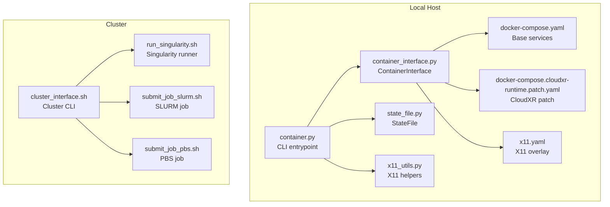
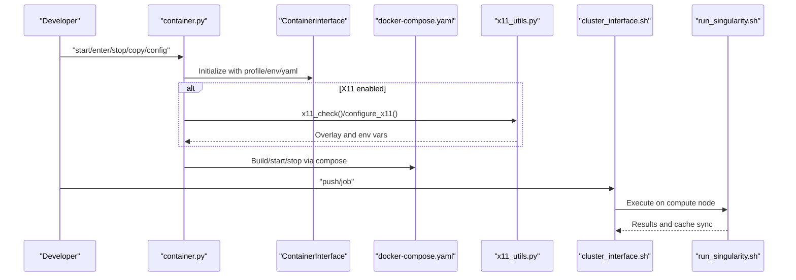
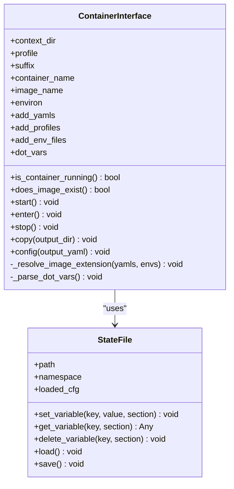
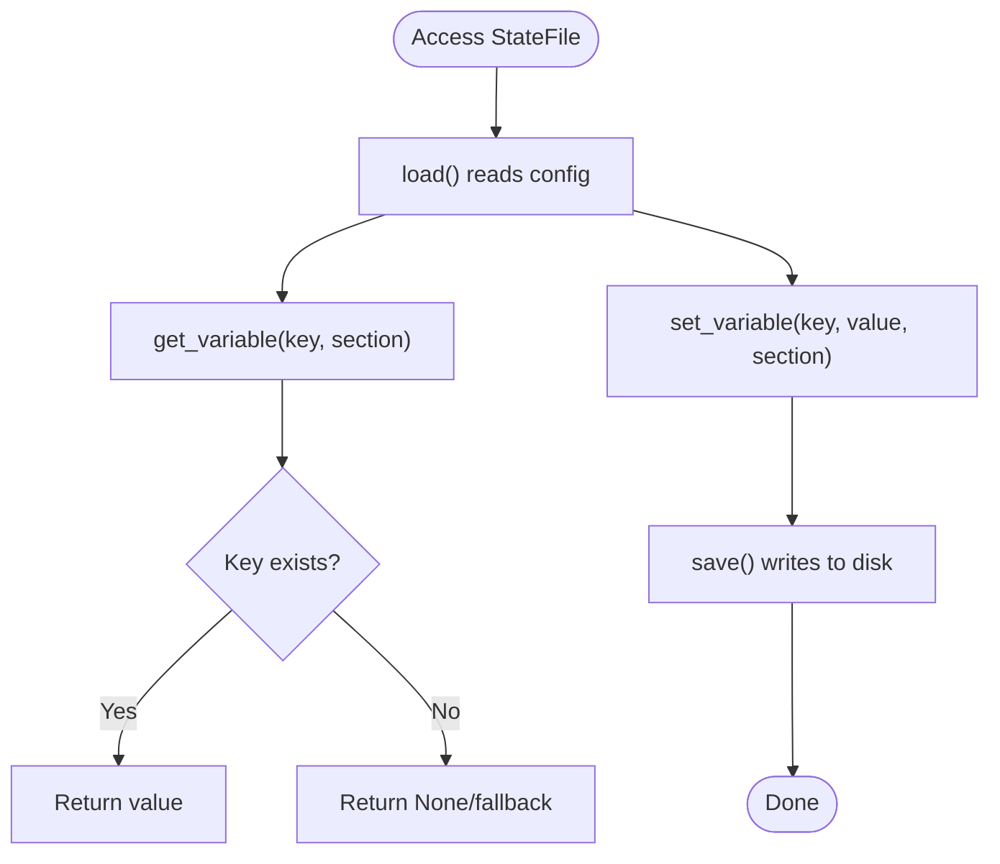
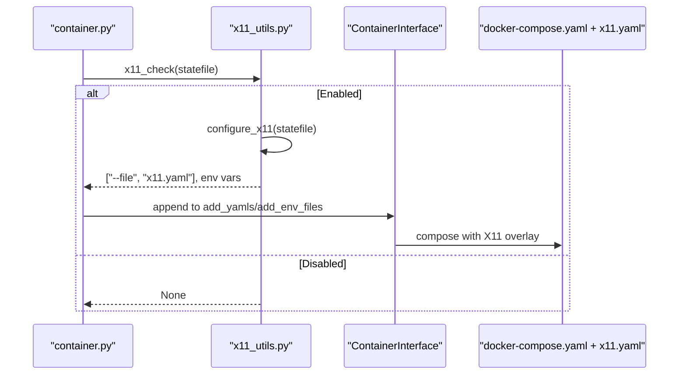
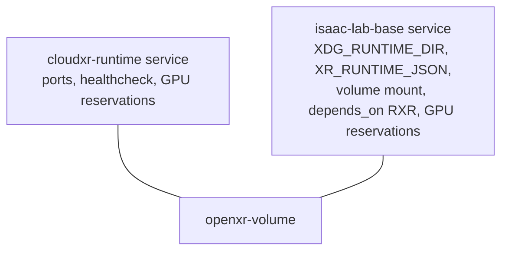
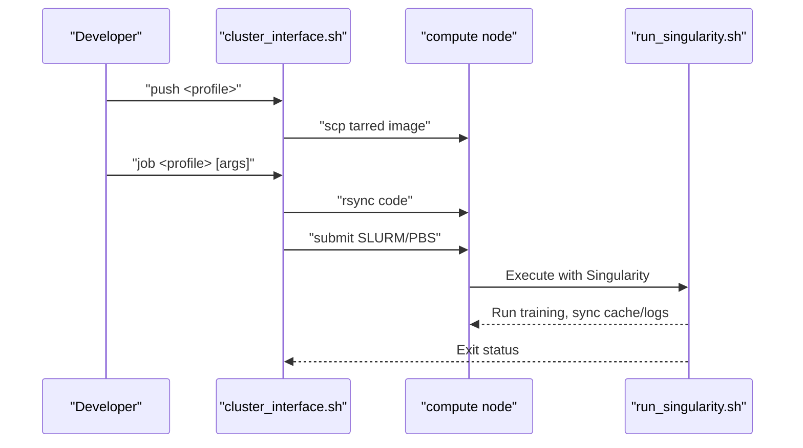
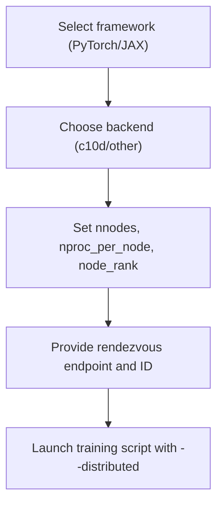
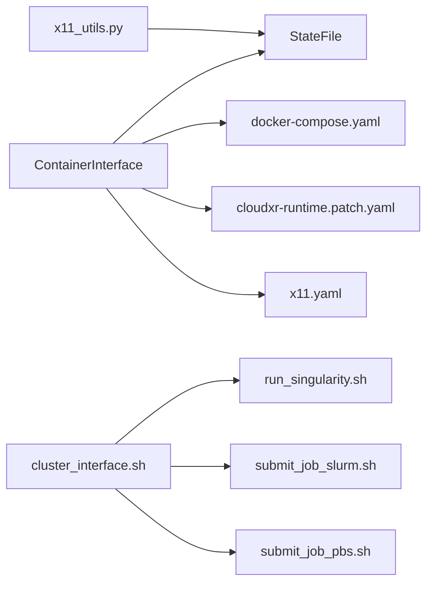

# Distributed Training Orchestration

<cite>
**Referenced Files in This Document**
- [container.py](file://docker/container.py)
- [container_interface.py](file://docker/utils/container_interface.py)
- [state_file.py](file://docker/utils/state_file.py)
- [x11_utils.py](file://docker/utils/x11_utils.py)
- [docker-compose.yaml](file://docker/docker-compose.yaml)
- [docker-compose.cloudxr-runtime.patch.yaml](file://docker/docker-compose.cloudxr-runtime.patch.yaml)
- [x11.yaml](file://docker/x11.yaml)
- [cluster_interface.sh](file://docker/cluster/cluster_interface.sh)
- [run_singularity.sh](file://docker/cluster/run_singularity.sh)
- [submit_job_slurm.sh](file://docker/cluster/submit_job_slurm.sh)
- [submit_job_pbs.sh](file://docker/cluster/submit_job_pbs.sh)
- [multi_gpu.rst](file://docs/source/features/multi_gpu.rst)
- [app_launcher.py](file://source/isaaclab/isaaclab/app/app_launcher.py)
</cite>

## Table of Contents
1. [Introduction](#introduction)
2. [Project Structure](#project-structure)
3. [Core Components](#core-components)
4. [Architecture Overview](#architecture-overview)
5. [Detailed Component Analysis](#detailed-component-analysis)
6. [Dependency Analysis](#dependency-analysis)
7. [Performance Considerations](#performance-considerations)
8. [Troubleshooting Guide](#troubleshooting-guide)
9. [Conclusion](#conclusion)
10. [Appendices](#appendices)

## Introduction
This document explains how the repository orchestrates distributed training using containerized environments. It covers:
- Container interface utilities for multi-container deployments, state management, and inter-process communication
- State file management for tracking training progress, checkpoints, and experiment metadata
- X11 utilities for remote GUI access and visualization
- CloudXR runtime patching for extended rendering and cloud-based training integrations
- Practical guidance for setting up clusters, load balancing, fault tolerance, monitoring, logging, and scaling to large concurrency

## Project Structure
The distributed orchestration spans Python utilities, Docker Compose definitions, Singularity/cluster scripts, and documentation. The most relevant pieces are:
- Python orchestration and state management under docker/utils
- Docker Compose base and optional overlays for X11 and CloudXR
- Cluster submission and execution scripts for SLURM/PBS
- Multi-node training guidance in documentation

**Diagram sources**
- [container.py:1-143](file://docker/container.py#L1-L143)
- [container_interface.py:17-317](file://docker/utils/container_interface.py#L17-L317)
- [state_file.py:14-152](file://docker/utils/state_file.py#L14-L152)
- [x11_utils.py:19-228](file://docker/utils/x11_utils.py#L19-L228)
- [docker-compose.yaml:1-154](file://docker/docker-compose.yaml#L1-L154)
- [docker-compose.cloudxr-runtime.patch.yaml:1-53](file://docker/docker-compose.cloudxr-runtime.patch.yaml#L1-L53)
- [x11.yaml:1-42](file://docker/x11.yaml#L1-L42)
- [cluster_interface.sh:1-212](file://docker/cluster/cluster_interface.sh#L1-L212)
- [run_singularity.sh:1-83](file://docker/cluster/run_singularity.sh#L1-L83)
- [submit_job_slurm.sh:1-26](file://docker/cluster/submit_job_slurm.sh#L1-L26)
- [submit_job_pbs.sh:1-24](file://docker/cluster/submit_job_pbs.sh#L1-L24)

**Section sources**
- [container.py:1-143](file://docker/container.py#L1-L143)
- [container_interface.py:17-317](file://docker/utils/container_interface.py#L17-L317)
- [docker-compose.yaml:1-154](file://docker/docker-compose.yaml#L1-L154)

## Core Components
- ContainerInterface: Builds, starts/stops containers, enters shells, copies artifacts, and composes docker-compose commands with profiles and env overlays.
- StateFile: Manages persistent configuration for runtime state (e.g., X11 temp paths, flags).
- X11 utilities: Configure X11 forwarding, create temporary .xauth cookies, refresh and clean up.
- Docker Compose: Base services with GPU reservations, host networking, and persistent volumes; optional overlays for X11 and CloudXR.
- Cluster interface: Push images to clusters, synchronize code, and submit jobs to SLURM/PBS via Singularity.

**Section sources**
- [container_interface.py:17-317](file://docker/utils/container_interface.py#L17-L317)
- [state_file.py:14-152](file://docker/utils/state_file.py#L14-L152)
- [x11_utils.py:19-228](file://docker/utils/x11_utils.py#L19-L228)
- [docker-compose.yaml:85-137](file://docker/docker-compose.yaml#L85-L137)
- [docker-compose.cloudxr-runtime.patch.yaml:6-53](file://docker/docker-compose.cloudxr-runtime.patch.yaml#L6-L53)
- [x11.yaml:6-42](file://docker/x11.yaml#L6-L42)
- [cluster_interface.sh:74-212](file://docker/cluster/cluster_interface.sh#L74-L212)

## Architecture Overview
The system combines local container orchestration with cluster-scale job execution. Local CLI drives Docker Compose; cluster CLI pushes images and submits jobs to schedulers, which execute via Singularity on compute nodes.

**Diagram sources**
- [container.py:93-143](file://docker/container.py#L93-L143)
- [container_interface.py:111-189](file://docker/utils/container_interface.py#L111-L189)
- [x11_utils.py:64-122](file://docker/utils/x11_utils.py#L64-L122)
- [cluster_interface.sh:177-212](file://docker/cluster/cluster_interface.sh#L177-L212)
- [run_singularity.sh:57-83](file://docker/cluster/run_singularity.sh#L57-L83)

## Detailed Component Analysis

### Container Interface Utilities
ContainerInterface encapsulates Docker Compose operations and supports profile-driven customization, environment overlays, and artifact management. It integrates with StateFile to persist runtime flags and with X11 utilities for GUI forwarding.

**Diagram sources**
- [container_interface.py:17-317](file://docker/utils/container_interface.py#L17-L317)
- [state_file.py:14-152](file://docker/utils/state_file.py#L14-L152)

**Section sources**
- [container_interface.py:88-189](file://docker/utils/container_interface.py#L88-L189)
- [container_interface.py:269-317](file://docker/utils/container_interface.py#L269-L317)

### State File Management
StateFile persists runtime flags and paths (e.g., X11 temp file) to a configuration file, enabling cross-session continuity for container orchestration and X11 forwarding.

**Diagram sources**
- [state_file.py:139-152](file://docker/utils/state_file.py#L139-L152)

**Section sources**
- [state_file.py:51-134](file://docker/utils/state_file.py#L51-L134)

### X11 Utilities for Remote GUI Access
X11 utilities manage temporary .xauth files, environment propagation, and lifecycle cleanup. They integrate with ContainerInterface to optionally extend docker-compose with X11 overlays.

**Diagram sources**
- [x11_utils.py:64-122](file://docker/utils/x11_utils.py#L64-L122)
- [container_interface.py:111-120](file://docker/utils/container_interface.py#L111-L120)
- [x11.yaml:6-42](file://docker/x11.yaml#L6-L42)

**Section sources**
- [x11_utils.py:21-61](file://docker/utils/x11_utils.py#L21-L61)
- [x11_utils.py:124-143](file://docker/utils/x11_utils.py#L124-L143)
- [x11_utils.py:182-228](file://docker/utils/x11_utils.py#L182-L228)

### CloudXR Runtime Patching
The CloudXR patch defines a dedicated runtime service with GPU reservations and shared OpenXR volume, and configures the base service to use it via environment variables and dependencies.

**Diagram sources**
- [docker-compose.cloudxr-runtime.patch.yaml:6-53](file://docker/docker-compose.cloudxr-runtime.patch.yaml#L6-L53)

**Section sources**
- [docker-compose.cloudxr-runtime.patch.yaml:6-53](file://docker/docker-compose.cloudxr-runtime.patch.yaml#L6-L53)

### Cluster Orchestration and Job Submission
The cluster interface supports pushing Docker images to clusters (via Apptainer/Singularity), synchronizing code, and submitting jobs to SLURM or PBS. Compute nodes execute via a Singularity wrapper that mounts caches and logs.

**Diagram sources**
- [cluster_interface.sh:141-212](file://docker/cluster/cluster_interface.sh#L141-L212)
- [run_singularity.sh:57-83](file://docker/cluster/run_singularity.sh#L57-L83)
- [submit_job_slurm.sh:8-26](file://docker/cluster/submit_job_slurm.sh#L8-L26)
- [submit_job_pbs.sh:8-24](file://docker/cluster/submit_job_pbs.sh#L8-L24)

**Section sources**
- [cluster_interface.sh:74-212](file://docker/cluster/cluster_interface.sh#L74-L212)
- [run_singularity.sh:9-83](file://docker/cluster/run_singularity.sh#L9-L83)
- [submit_job_slurm.sh:1-26](file://docker/cluster/submit_job_slurm.sh#L1-L26)
- [submit_job_pbs.sh:1-24](file://docker/cluster/submit_job_pbs.sh#L1-L24)

### Multi-Node Training and Distributed Launch
Documentation provides examples for launching distributed training across nodes using PyTorch and JAX frameworks. It highlights rendezvous configuration and performance caveats related to inter-node latency.

**Diagram sources**
- [multi_gpu.rst:91-222](file://docs/source/features/multi_gpu.rst#L91-L222)

**Section sources**
- [multi_gpu.rst:91-222](file://docs/source/features/multi_gpu.rst#L91-L222)

### XR and Viewport Settings
Application launcher resolves XR and viewport settings for performance tuning in headless/cloud environments.

**Section sources**
- [app_launcher.py:612-640](file://source/isaaclab/isaaclab/app/app_launcher.py#L612-L640)

## Dependency Analysis
- ContainerInterface depends on StateFile for persistence and on docker-compose files for orchestration.
- X11 utilities depend on StateFile and environment variables to manage temporary credentials.
- Cluster scripts depend on environment variables defined in .env.cluster and .env.* files.
- CloudXR patch depends on environment variables and shared volumes.

**Diagram sources**
- [container_interface.py:14-14](file://docker/utils/container_interface.py#L14-L14)
- [state_file.py:14-14](file://docker/utils/state_file.py#L14-L14)
- [docker-compose.yaml:1-154](file://docker/docker-compose.yaml#L1-L154)
- [docker-compose.cloudxr-runtime.patch.yaml:1-53](file://docker/docker-compose.cloudxr-runtime.patch.yaml#L1-L53)
- [x11.yaml:1-42](file://docker/x11.yaml#L1-L42)
- [x11_utils.py:16-16](file://docker/utils/x11_utils.py#L16-L16)
- [cluster_interface.sh:1-212](file://docker/cluster/cluster_interface.sh#L1-L212)
- [run_singularity.sh:1-83](file://docker/cluster/run_singularity.sh#L1-L83)
- [submit_job_slurm.sh:1-26](file://docker/cluster/submit_job_slurm.sh#L1-L26)
- [submit_job_pbs.sh:1-24](file://docker/cluster/submit_job_pbs.sh#L1-L24)

**Section sources**
- [container_interface.py:14-14](file://docker/utils/container_interface.py#L14-L14)
- [x11_utils.py:16-16](file://docker/utils/x11_utils.py#L16-L16)

## Performance Considerations
- Network mode host: Services use host networking to reduce overhead and simplify GPU/graphics access.
- GPU reservations: Both base and CloudXR services reserve all GPUs for deterministic resource allocation.
- Persistent volumes: Logs, docs builds, and data storage are persisted in named volumes for reliability and faster rebuilds.
- X11 forwarding: Mitigates GUI latency by caching X authority and reusing temporary files; refresh when DISPLAY changes.
- CloudXR: Offloads rendering to a dedicated runtime with GPU reservations and shared OpenXR volume.

[No sources needed since this section provides general guidance]

## Troubleshooting Guide
- X11 forwarding not working:
  - Ensure xauth is installed and enabled; the system will prompt to enable it if not configured.
  - Refresh the .xauth cookie if DISPLAY changes; otherwise, rebuild the container.
  - Verify the temporary .xauth path is recorded in the state file and bind-mounted into the container.
- CloudXR runtime errors:
  - Confirm the runtime service is healthy and exposes the expected ports.
  - Ensure the base service sets XDG_RUNTIME_DIR and XR_RUNTIME_JSON and mounts the shared volume.
- Cluster job failures:
  - Validate scheduler-specific job scripts and resource requests.
  - Confirm Singularity image tar exists on the remote host and directories are created before execution.
  - Check that code is synchronized and the compute node can reach the cluster cache directories.

**Section sources**
- [x11_utils.py:40-61](file://docker/utils/x11_utils.py#L40-L61)
- [x11_utils.py:182-228](file://docker/utils/x11_utils.py#L182-L228)
- [docker-compose.cloudxr-runtime.patch.yaml:17-22](file://docker/docker-compose.cloudxr-runtime.patch.yaml#L17-L22)
- [docker-compose.cloudxr-runtime.patch.yaml:35-50](file://docker/docker-compose.cloudxr-runtime.patch.yaml#L35-L50)
- [cluster_interface.sh:65-72](file://docker/cluster/cluster_interface.sh#L65-L72)
- [run_singularity.sh:57-83](file://docker/cluster/run_singularity.sh#L57-L83)

## Conclusion
The repository provides a cohesive toolkit for distributed training orchestration:
- ContainerInterface and StateFile offer reliable multi-container lifecycle and state persistence.
- X11 utilities enable remote GUI access with secure credential management.
- CloudXR patching integrates rendering offload for cloud-based training.
- Cluster scripts and job schedulers enable scalable, reproducible job execution across nodes.
Adhering to the documented patterns yields robust, observable, and scalable distributed training setups.

[No sources needed since this section summarizes without analyzing specific files]

## Appendices

### Practical Examples

- Setting up a distributed training cluster:
  - Prepare environment files (.env.base, .env.<profile>) and compose overlays (x11.yaml, cloudxr-runtime.patch.yaml).
  - Use the cluster interface to push images and submit jobs to SLURM/PBS.
  - On compute nodes, Singularity executes the training with mounted caches and logs.

- Configuring load balancing:
  - Distribute workloads across nodes using scheduler job arrays or per-node ranks.
  - Use rendezvous endpoints and IDs to coordinate workers consistently.

- Fault tolerance:
  - Persist logs and artifacts via named volumes.
  - Rebuild containers when X11 .xauth is missing; refresh X11 credentials when DISPLAY changes.
  - Monitor CloudXR runtime health and retry initialization if needed.

- Monitoring, logging, and metrics:
  - Logs are persisted in named volumes and can be copied after runs.
  - Use framework-native logging and metrics collection in training scripts.
  - Benchmark utilities demonstrate storing custom measurements for performance tracking.

- Scaling to large concurrency:
  - Use host networking and GPU reservations to minimize overhead.
  - Prefer batch submissions via SLURM/PBS for large-scale scheduling.
  - Optimize inter-node communication by grouping nodes on low-latency networks.

**Section sources**
- [docker-compose.yaml:85-137](file://docker/docker-compose.yaml#L85-L137)
- [docker-compose.cloudxr-runtime.patch.yaml:6-53](file://docker/docker-compose.cloudxr-runtime.patch.yaml#L6-L53)
- [x11.yaml:6-42](file://docker/x11.yaml#L6-L42)
- [cluster_interface.sh:141-212](file://docker/cluster/cluster_interface.sh#L141-L212)
- [run_singularity.sh:57-83](file://docker/cluster/run_singularity.sh#L57-L83)
- [multi_gpu.rst:91-222](file://docs/source/features/multi_gpu.rst#L91-L222)