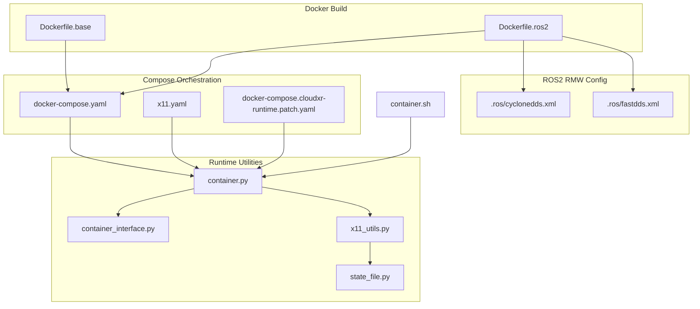
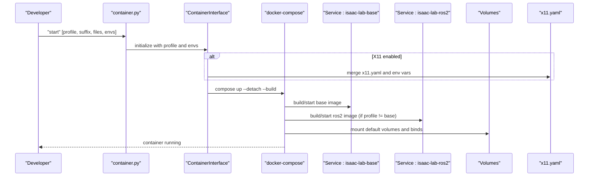
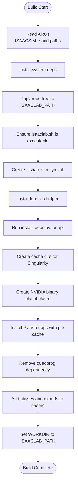
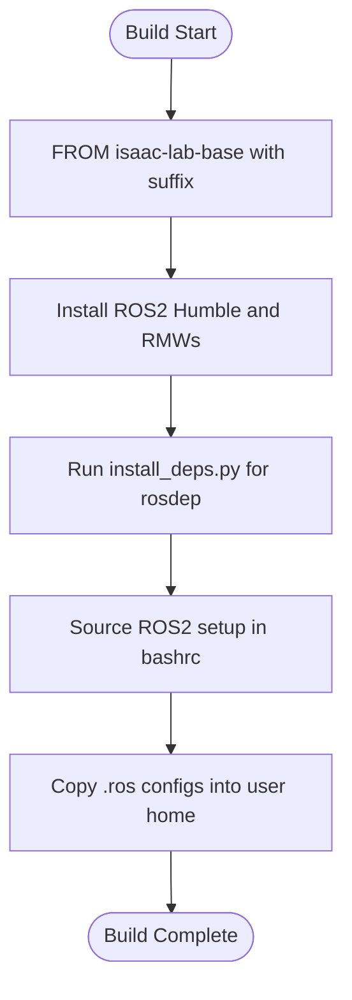
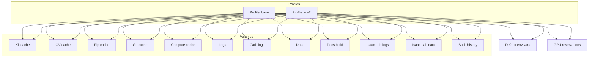
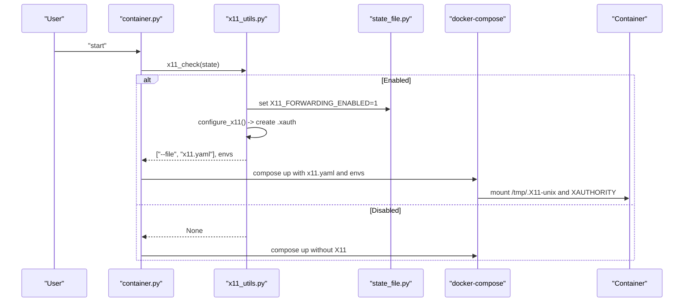
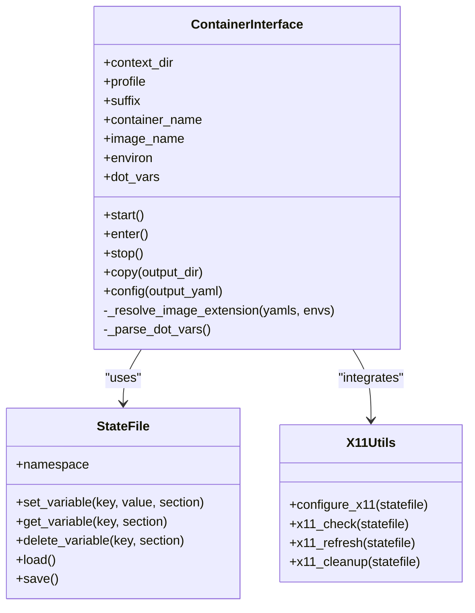
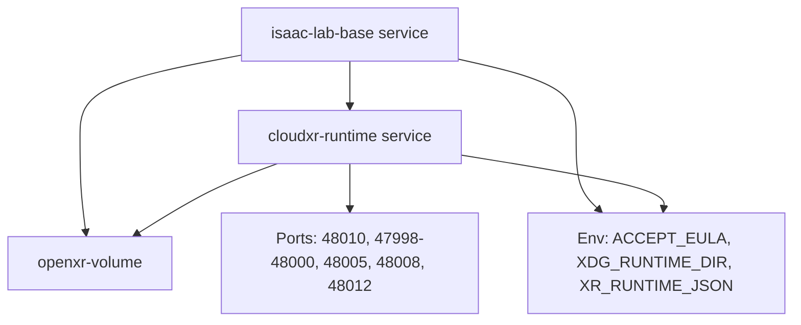
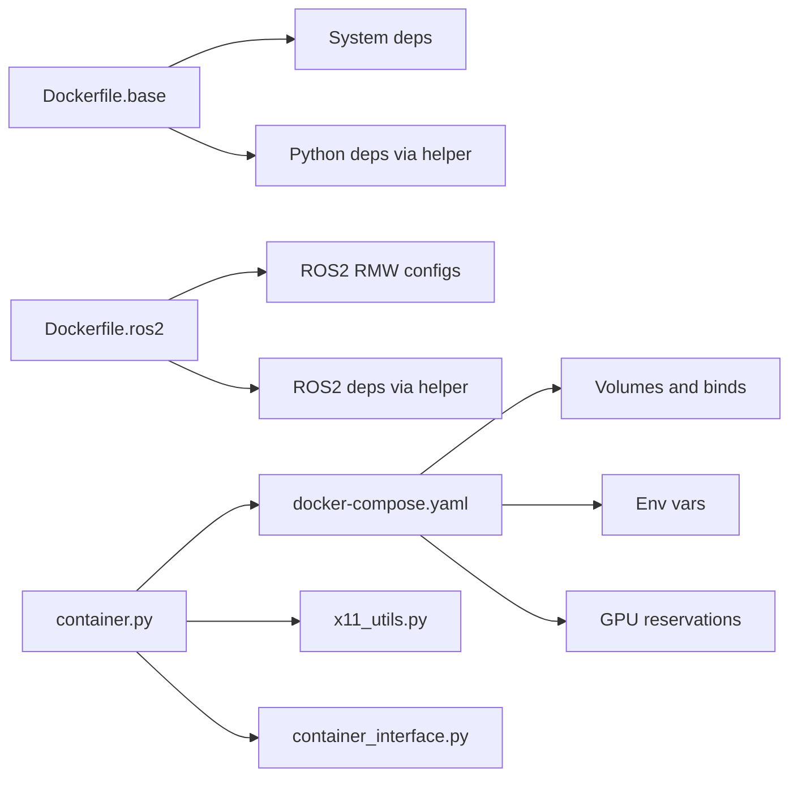

# Docker Container Infrastructure

<cite>
**Referenced Files in This Document**
- [Dockerfile.base](file://docker/Dockerfile.base)
- [Dockerfile.ros2](file://docker/Dockerfile.ros2)
- [docker-compose.yaml](file://docker/docker-compose.yaml)
- [x11.yaml](file://docker/x11.yaml)
- [docker-compose.cloudxr-runtime.patch.yaml](file://docker/docker-compose.cloudxr-runtime.patch.yaml)
- [container.py](file://docker/container.py)
- [container.sh](file://docker/container.sh)
- [container_interface.py](file://docker/utils/container_interface.py)
- [x11_utils.py](file://docker/utils/x11_utils.py)
- [state_file.py](file://docker/utils/state_file.py)
- [cyclonedds.xml](file://docker/.ros/cyclonedds.xml)
- [fastdds.xml](file://docker/.ros/fastdds.xml)
- [test_docker.py](file://docker/test/test_docker.py)
</cite>

## Table of Contents
1. [Introduction](#introduction)
2. [Project Structure](#project-structure)
3. [Core Components](#core-components)
4. [Architecture Overview](#architecture-overview)
5. [Detailed Component Analysis](#detailed-component-analysis)
6. [Dependency Analysis](#dependency-analysis)
7. [Performance Considerations](#performance-considerations)
8. [Troubleshooting Guide](#troubleshooting-guide)
9. [Conclusion](#conclusion)
10. [Appendices](#appendices)

## Introduction
This document explains the Docker container infrastructure supporting the ablation study framework. It covers the base Dockerfile configuration (multi-stage build, environment provisioning, and dependency management), container initialization, symbolic linking between Isaac Sim and Isaac Lab, and automated installation of Python dependencies. It also documents docker-compose orchestration for multi-container deployments, X11 forwarding for GUI applications, and volume mounting strategies. Runtime configuration, environment variable management, and user permission handling are detailed, along with practical examples for building custom containers, modifying base images, and troubleshooting common containerization issues. Security considerations, resource limits, and performance optimization for GPU-accelerated training are addressed.

## Project Structure
The Docker infrastructure is organized under the docker/ directory with:
- Base and ROS2 Dockerfiles for building images
- docker-compose orchestration with reusable composition fragments
- X11 forwarding configuration overlays
- CloudXR runtime patch for OpenXR-enabled deployments
- Python-based container management utilities
- Test suite validating container lifecycle

**Diagram sources**
- [Dockerfile.base](file://docker/Dockerfile.base)
- [Dockerfile.ros2](file://docker/Dockerfile.ros2)
- [docker-compose.yaml](file://docker/docker-compose.yaml)
- [x11.yaml](file://docker/x11.yaml)
- [docker-compose.cloudxr-runtime.patch.yaml](file://docker/docker-compose.cloudxr-runtime.patch.yaml)
- [container.py](file://docker/container.py)
- [container_interface.py](file://docker/utils/container_interface.py)
- [x11_utils.py](file://docker/utils/x11_utils.py)
- [state_file.py](file://docker/utils/state_file.py)
- [cyclonedds.xml](file://docker/.ros/cyclonedds.xml)
- [fastdds.xml](file://docker/.ros/fastdds.xml)
- [container.sh](file://docker/container.sh)

**Section sources**
- [Dockerfile.base](file://docker/Dockerfile.base)
- [Dockerfile.ros2](file://docker/Dockerfile.ros2)
- [docker-compose.yaml](file://docker/docker-compose.yaml)
- [x11.yaml](file://docker/x11.yaml)
- [docker-compose.cloudxr-runtime.patch.yaml](file://docker/docker-compose.cloudxr-runtime.patch.yaml)
- [container.py](file://docker/container.py)
- [container.sh](file://docker/container.sh)

## Core Components
- Base image builder: Multi-stage build that installs system dependencies, sets up symbolic links to Isaac Sim, and automates Python dependency installation and aliases.
- ROS2 image builder: Extends the base image to include ROS2 Humble and RMW configurations.
- Compose orchestration: Defines default volumes, environment variables, GPU resource reservations, and profiles for base and ROS2 images.
- X11 forwarding utilities: Dynamically manages .xauth cookies and bind-mounts for GUI applications.
- Container management CLI: Python wrapper around docker-compose with commands to start, enter, stop, copy artifacts, and generate configs.
- CloudXR runtime patch: Adds an OpenXR runtime service and mounts shared volumes for XR workflows.

**Section sources**
- [Dockerfile.base](file://docker/Dockerfile.base)
- [Dockerfile.ros2](file://docker/Dockerfile.ros2)
- [docker-compose.yaml](file://docker/docker-compose.yaml)
- [x11.yaml](file://docker/x11.yaml)
- [docker-compose.cloudxr-runtime.patch.yaml](file://docker/docker-compose.cloudxr-runtime.patch.yaml)
- [container.py](file://docker/container.py)
- [container_interface.py](file://docker/utils/container_interface.py)
- [x11_utils.py](file://docker/utils/x11_utils.py)
- [state_file.py](file://docker/utils/state_file.py)

## Architecture Overview
The system uses a layered approach:
- Build layer: Dockerfiles produce base and ROS2 images.
- Orchestration layer: docker-compose defines services, volumes, environment, and GPU reservations.
- Runtime layer: Python utilities manage lifecycle, X11 forwarding, and state persistence.
- Integration layer: Optional CloudXR patch enables XR-capable deployments.

**Diagram sources**
- [container.py](file://docker/container.py)
- [container_interface.py](file://docker/utils/container_interface.py)
- [docker-compose.yaml](file://docker/docker-compose.yaml)
- [x11.yaml](file://docker/x11.yaml)

## Detailed Component Analysis

### Base Image Builder (Dockerfile.base)
Key behaviors:
- Accepts build arguments for Isaac Sim base image, version, root path, and Isaac Lab path.
- Sets environment variables and installs system dependencies.
- Copies the Isaac Lab repository tree and ensures executable permissions for entry scripts.
- Creates a symbolic link from the installed Isaac Sim root to a fixed path within the lab workspace.
- Installs Python dependencies via a helper script and cleans caches.
- Removes a problematic dependency post-install.
- Exposes convenient aliases for isaaclab and Python/Pip/TensorBoard.
- Sets the working directory to the Isaac Lab path.

**Diagram sources**
- [Dockerfile.base](file://docker/Dockerfile.base)

**Section sources**
- [Dockerfile.base](file://docker/Dockerfile.base)

### ROS2 Image Builder (Dockerfile.ros2)
Key behaviors:
- Starts from the base image with optional suffix.
- Installs ROS2 Humble and RMW implementations (CycloneDDS and FastDDS).
- Runs the helper script to install ROS2 dependencies declared by extensions.
- Adds sourcing of ROS2 setup to bashrc.
- Copies RMW configuration files into the user’s .ros directory.

**Diagram sources**
- [Dockerfile.ros2](file://docker/Dockerfile.ros2)
- [cyclonedds.xml](file://docker/.ros/cyclonedds.xml)
- [fastdds.xml](file://docker/.ros/fastdds.xml)

**Section sources**
- [Dockerfile.ros2](file://docker/Dockerfile.ros2)
- [.ros configs](file://docker/.ros/cyclonedds.xml)
- [.ros configs](file://docker/.ros/fastdds.xml)

### Compose Orchestration (docker-compose.yaml)
Key behaviors:
- Defines reusable volume fragments for caches, logs, and persistent data.
- Mounts local source/scripts/docs/tools as bind mounts for live development.
- Provides default environment variables including the Isaac Sim path and a flag to allow root in Kit.
- Declares GPU resource reservations via device drivers for all GPUs.
- Exposes two profiles: base and ros2, each building respective images and sharing volumes.
- Uses host networking for simplified networking in GUI/GPU scenarios.

**Diagram sources**
- [docker-compose.yaml](file://docker/docker-compose.yaml)

**Section sources**
- [docker-compose.yaml](file://docker/docker-compose.yaml)

### X11 Forwarding Setup (x11.yaml and x11_utils.py)
Key behaviors:
- Dynamically creates and manages a temporary .xauth file and a temporary directory.
- Prompts the user to enable or disable X11 forwarding and persists the choice.
- On enablement, merges x11.yaml into compose to bind-mount X11 unix socket and timezone, and passes XAUTHORITY and DISPLAY.
- Provides refresh and cleanup routines to regenerate or remove the .xauth file.

**Diagram sources**
- [container.py](file://docker/container.py)
- [x11_utils.py](file://docker/utils/x11_utils.py)
- [state_file.py](file://docker/utils/state_file.py)
- [x11.yaml](file://docker/x11.yaml)

**Section sources**
- [x11.yaml](file://docker/x11.yaml)
- [x11_utils.py](file://docker/utils/x11_utils.py)
- [state_file.py](file://docker/utils/state_file.py)

### Container Management CLI (container.py and container_interface.py)
Key behaviors:
- Provides commands: start, enter, config, copy, stop.
- Resolves compose files, profiles, and env files; supports suffixes for custom naming.
- Builds base image when needed, then starts the target profile.
- Manages artifact copying from container logs/docs/data_storage to host.
- Integrates X11 utilities for interactive sessions.

**Diagram sources**
- [container_interface.py](file://docker/utils/container_interface.py)
- [state_file.py](file://docker/utils/state_file.py)
- [x11_utils.py](file://docker/utils/x11_utils.py)
- [container.py](file://docker/container.py)

**Section sources**
- [container.py](file://docker/container.py)
- [container_interface.py](file://docker/utils/container_interface.py)
- [state_file.py](file://docker/utils/state_file.py)
- [x11_utils.py](file://docker/utils/x11_utils.py)

### CloudXR Runtime Patch (docker-compose.cloudxr-runtime.patch.yaml)
Key behaviors:
- Adds a cloudxr-runtime service exposing XR-related ports and health checks.
- Mounts a shared volume for XR runtime data and sets environment variables for XDG_RUNTIME_DIR and XR_RUNTIME_JSON.
- Applies GPU reservations to both the runtime and the base service.
- Declares a dependency so the base service waits for the runtime.

**Diagram sources**
- [docker-compose.cloudxr-runtime.patch.yaml](file://docker/docker-compose.cloudxr-runtime.patch.yaml)

**Section sources**
- [docker-compose.cloudxr-runtime.patch.yaml](file://docker/docker-compose.cloudxr-runtime.patch.yaml)

### Symbolic Linking Between Isaac Sim and Isaac Lab
- The base Dockerfile creates a symbolic link from the installed Isaac Sim root path to a fixed location within the lab workspace. This ensures consistent resolution of the embedded Python interpreter and tools during containerized runs.

**Section sources**
- [Dockerfile.base](file://docker/Dockerfile.base)

### Automated Python Dependency Installation
- The base Dockerfile invokes a helper script to install Python dependencies and cleans caches for efficiency.
- The ROS2 Dockerfile additionally installs ROS2-specific dependencies via the same helper mechanism.

**Section sources**
- [Dockerfile.base](file://docker/Dockerfile.base)
- [Dockerfile.ros2](file://docker/Dockerfile.ros2)

### Volume Mounting Strategies
- Persistent volumes: caches, logs, Carb logs, data, docs build, and logs/data storage.
- Bind mounts: source, scripts, docs, tools directories for live development.
- History persistence: bash history is bind-mounted to preserve command history across runs.

**Section sources**
- [docker-compose.yaml](file://docker/docker-compose.yaml)

### Environment Variable Management
- Default environment includes the Isaac Sim path and a flag to allow root in Kit.
- ROS2 profile sources ROS2 setup in bashrc.
- X11 forwarding injects DISPLAY, TERM, QT_X11_NO_MITSHM, and XAUTHORITY.

**Section sources**
- [docker-compose.yaml](file://docker/docker-compose.yaml)
- [Dockerfile.ros2](file://docker/Dockerfile.ros2)
- [x11.yaml](file://docker/x11.yaml)

### User Permission Handling
- The base Dockerfile sets the default shell to bash and prepares cache directories with appropriate ownership for the root user within the container.
- The compose configuration uses host networking and bind mounts; ensure host-side permissions align with intended user access.

**Section sources**
- [Dockerfile.base](file://docker/Dockerfile.base)
- [docker-compose.yaml](file://docker/docker-compose.yaml)

## Dependency Analysis
- Build-time dependencies:
  - System packages installed in the base image.
  - Helper script-driven installation of Python and ROS2 dependencies.
- Runtime dependencies:
  - Isaac Sim root symlink for tool resolution.
  - ROS2 RMW configurations for DDS communication.
  - X11 utilities for GUI forwarding.
- Orchestration dependencies:
  - Compose profiles and environment files.
  - Optional CloudXR patch for XR workflows.

**Diagram sources**
- [Dockerfile.base](file://docker/Dockerfile.base)
- [Dockerfile.ros2](file://docker/Dockerfile.ros2)
- [docker-compose.yaml](file://docker/docker-compose.yaml)
- [container.py](file://docker/container.py)
- [container_interface.py](file://docker/utils/container_interface.py)
- [x11_utils.py](file://docker/utils/x11_utils.py)

**Section sources**
- [Dockerfile.base](file://docker/Dockerfile.base)
- [Dockerfile.ros2](file://docker/Dockerfile.ros2)
- [docker-compose.yaml](file://docker/docker-compose.yaml)
- [container.py](file://docker/container.py)
- [container_interface.py](file://docker/utils/container_interface.py)
- [x11_utils.py](file://docker/utils/x11_utils.py)

## Performance Considerations
- GPU resource reservations: Both base and ros2 services reserve all GPUs via device drivers, ensuring training workloads have exclusive access.
- Caching: Pip cache is mounted to speed up repeated installations; apt cache is used during build stages.
- Host networking: Simplifies networking for GUI and GPU-bound applications but should be considered for security posture.
- Volume separation: Logs and data are isolated in volumes to prevent host-root contamination and improve I/O performance.

[No sources needed since this section provides general guidance]

## Troubleshooting Guide
Common issues and resolutions:
- Docker not installed: The CLI checks for Docker presence and raises a clear error with a documentation link.
- X11 forwarding prerequisites: If xauth is missing, the utility instructs to install it and exits.
- X11 enabled but .xauth missing: The utility advises rebuilding the container after enabling X11.
- Container not running: Commands like enter and copy validate the container state and raise descriptive errors.
- Test coverage: A test suite validates starting/stopping base and ros2 profiles with and without suffixes.

**Section sources**
- [container.py](file://docker/container.py)
- [x11_utils.py](file://docker/utils/x11_utils.py)
- [test_docker.py](file://docker/test/test_docker.py)

## Conclusion
The Docker infrastructure provides a robust, multi-profile containerization solution for the ablation study framework. The base and ROS2 images encapsulate system and Python dependencies, while compose orchestrates volumes, environment variables, and GPU reservations. X11 utilities enable GUI workflows, and the CLI streamlines lifecycle operations. Optional CloudXR patching extends the setup to XR-capable environments. Adhering to the documented patterns ensures reproducible, secure, and performant GPU-accelerated training.

[No sources needed since this section summarizes without analyzing specific files]

## Appendices

### Practical Examples

- Build a custom base image with a specific Isaac Sim version:
  - Set build arguments for the base image tag and version, then build the base profile.
  - Reference: [docker-compose.yaml](file://docker/docker-compose.yaml), [Dockerfile.base](file://docker/Dockerfile.base)

- Add a custom ROS2 package:
  - Extend the ROS2 Dockerfile by adding the desired package to the apt install list.
  - Reference: [Dockerfile.ros2](file://docker/Dockerfile.ros2)

- Enable X11 forwarding:
  - Run the CLI start command; when prompted, choose to enable X11. The system will create and manage .xauth and bind-mount X11 sockets.
  - Reference: [container.py](file://docker/container.py), [x11_utils.py](file://docker/utils/x11_utils.py), [x11.yaml](file://docker/x11.yaml)

- Run with CloudXR:
  - Merge the CloudXR patch into the compose configuration and start both services; the base service will wait for the runtime.
  - Reference: [docker-compose.cloudxr-runtime.patch.yaml](file://docker/docker-compose.cloudxr-runtime.patch.yaml)

- Modify environment variables:
  - Use env files and pass additional env files to the CLI; compose merges them in order.
  - Reference: [docker-compose.yaml](file://docker/docker-compose.yaml), [container.py](file://docker/container.py)

- Copy artifacts after training:
  - Use the copy command to fetch logs, docs build, and data_storage from the container to the host.
  - Reference: [container_interface.py](file://docker/utils/container_interface.py)

### Security Considerations
- Prefer non-root users in production images when feasible; the base image operates as root for compatibility.
- Limit host networking exposure; use port mappings only when necessary.
- Restrict bind mounts to only required directories to minimize host filesystem exposure.
- Validate and prune volumes regularly to avoid accumulation of sensitive data.

[No sources needed since this section provides general guidance]

### Resource Limits and Optimization
- GPU reservations: All GPUs are reserved for services; adjust counts or capabilities as needed.
- CPU/memory: Consider adding resource limits in compose for multi-tenant hosts.
- Disk I/O: Use SSD-backed volumes for caches and logs; separate logs/data volumes to reduce contention.

**Section sources**
- [docker-compose.yaml](file://docker/docker-compose.yaml)