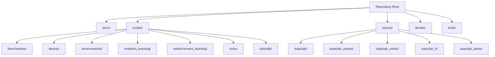
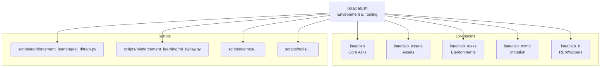
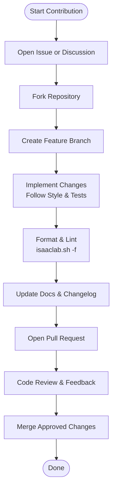
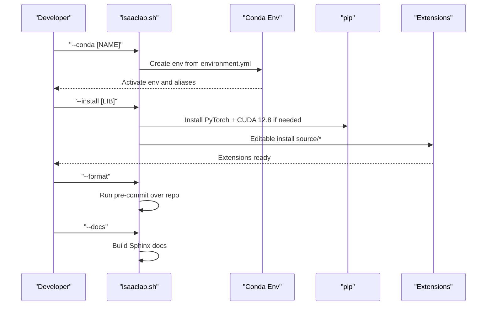
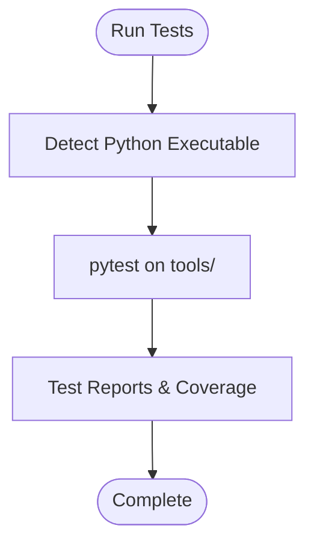
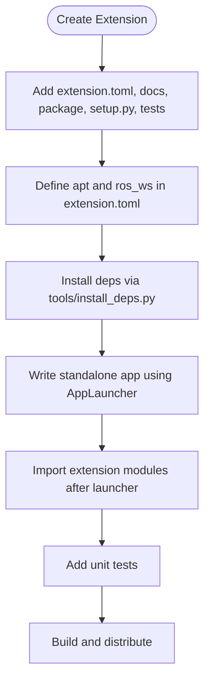
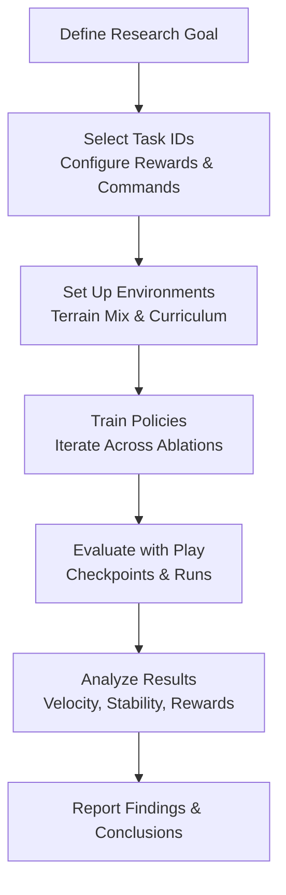
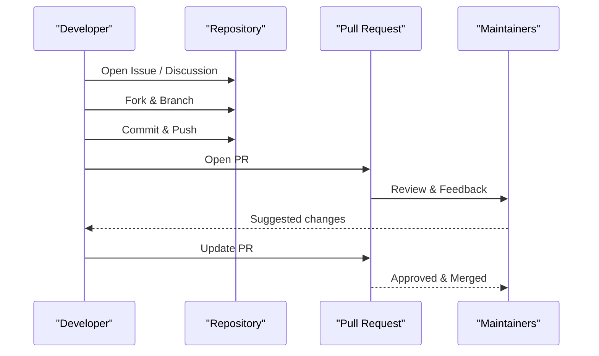
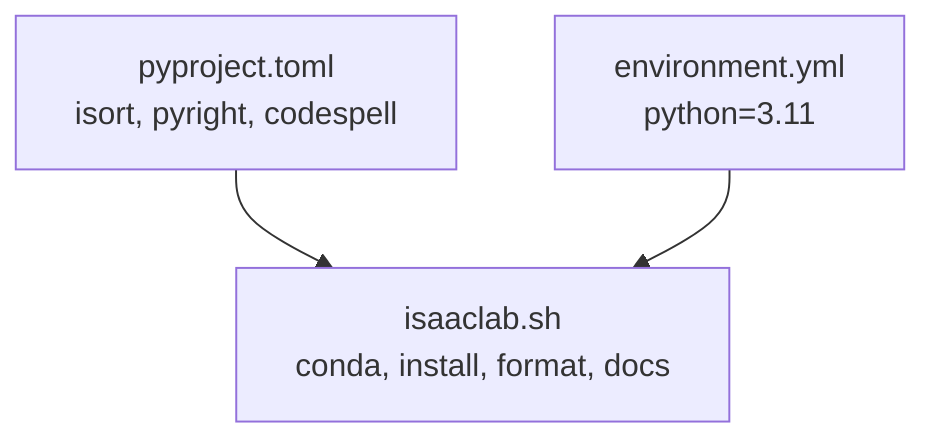

# Contributing and Development

<cite>
**Referenced Files in This Document**
- [CONTRIBUTING.md](file://CONTRIBUTING.md)
- [docs/source/refs/contributing.rst](file://docs/source/refs/contributing.rst)
- [docs/source/refs/license.rst](file://docs/source/refs/license.rst)
- [docs/source/refs/issues.rst](file://docs/source/refs/issues.rst)
- [docs/source/overview/developer-guide/development.rst](file://docs/source/overview/developer-guide/development.rst)
- [docs/source/overview/developer-guide/repo_structure.rst](file://docs/source/overview/developer-guide/repo_structure.rst)
- [README.md](file://README.md)
- [SECURITY.md](file://SECURITY.md)
- [CITATION.cff](file://CITATION.cff)
- [pyproject.toml](file://pyproject.toml)
- [environment.yml](file://environment.yml)
- [isaaclab.sh](file://isaaclab.sh)
- [scripts/reinforcement_learning/rsl_rl/train.py](file://scripts/reinforcement_learning/rsl_rl/train.py)
- [scripts/reinforcement_learning/rsl_rl/play.py](file://scripts/reinforcement_learning/rsl_rl/play.py)
- [source/isaaclab_tasks/isaaclab_tasks/direct/go2/go2_env_cfg.py](file://source/isaaclab_tasks/isaaclab_tasks/direct/go2/go2_env_cfg.py)
- [source/isaaclab_tasks/isaaclab_tasks/direct/go2/go2_env.py](file://source/isaaclab_tasks/isaaclab_tasks/direct/go2/go2_env.py)
- [source/isaaclab_tasks/isaaclab_tasks/direct/go2/agents/rsl_rl_ppo_cfg.py](file://source/isaaclab_tasks/isaaclab_tasks/direct/go2/agents/rsl_rl_ppo_cfg.py)
- [source/isaaclab_tasks/isaaclab_tasks/direct/go2/agents/actor_critic_scan.py](file://source/isaaclab_tasks/isaaclab_tasks/direct/go2/agents/actor_critic_scan.py)
- [source/isaaclab_tasks/isaaclab_tasks/direct/go2/__init__.py](file://source/isaaclab_tasks/isaaclab_tasks/direct/go2/__init__.py)
</cite>

## Table of Contents
1. [Introduction](#introduction)
2. [Project Structure](#project-structure)
3. [Core Components](#core-components)
4. [Architecture Overview](#architecture-overview)
5. [Detailed Component Analysis](#detailed-component-analysis)
6. [Dependency Analysis](#dependency-analysis)
7. [Performance Considerations](#performance-considerations)
8. [Troubleshooting Guide](#troubleshooting-guide)
9. [Conclusion](#conclusion)
10. [Appendices](#appendices)

## Introduction
This document provides comprehensive contributing and development guidance for researchers and developers working with the Extreme Quadruped Parkour framework. It covers contribution guidelines, development workflow, testing procedures, extension development, research methodology, and community engagement. It also outlines licensing, contributor agreements, and intellectual property considerations.

## Project Structure
The repository is organized as a collection of extensions and supporting scripts and documentation. The primary extensions reside under source/, while scripts/ contains runnable applications and workflows. The isaaclab.sh helper script orchestrates environment setup, installation, formatting, testing, documentation builds, and Docker utilities.

**Diagram sources**
- [docs/source/overview/developer-guide/repo_structure.rst:1-70](file://docs/source/overview/developer-guide/repo_structure.rst#L1-L70)

**Section sources**
- [docs/source/overview/developer-guide/repo_structure.rst:1-70](file://docs/source/overview/developer-guide/repo_structure.rst#L1-L70)

## Core Components
- Environment and task configuration for the Go2 quadruped parkour ablations
- Reinforcement learning training and evaluation scripts
- Extension development and dependency management guidelines
- Contribution standards, testing, and documentation practices

Key implementation locations:
- Environment configuration and registration: [source/isaaclab_tasks/isaaclab_tasks/direct/go2/go2_env_cfg.py](file://source/isaaclab_tasks/isaaclab_tasks/direct/go2/go2_env_cfg.py), [source/isaaclab_tasks/isaaclab_tasks/direct/go2/__init__.py](file://source/isaaclab_tasks/isaaclab_tasks/direct/go2/__init__.py)
- Environment logic and ablation toggles: [source/isaaclab_tasks/isaaclab_tasks/direct/go2/go2_env.py](file://source/isaaclab_tasks/isaaclab_tasks/direct/go2/go2_env.py)
- Policy and training configuration: [source/isaaclab_tasks/isaaclab_tasks/direct/go2/agents/rsl_rl_ppo_cfg.py](file://source/isaaclab_tasks/isaaclab_tasks/direct/go2/agents/rsl_rl_ppo_cfg.py)
- Scan and private observation encoders: [source/isaaclab_tasks/isaaclab_tasks/direct/go2/agents/actor_critic_scan.py](file://source/isaaclab_tasks/isaaclab_tasks/direct/go2/agents/actor_critic_scan.py)
- Training and evaluation entry points: [scripts/reinforcement_learning/rsl_rl/train.py](file://scripts/reinforcement_learning/rsl_rl/train.py), [scripts/reinforcement_learning/rsl_rl/play.py](file://scripts/reinforcement_learning/rsl_rl/play.py)

**Section sources**
- [README.md:44-68](file://README.md#L44-L68)
- [source/isaaclab_tasks/isaaclab_tasks/direct/go2/go2_env_cfg.py](file://source/isaaclab_tasks/isaaclab_tasks/direct/go2/go2_env_cfg.py)
- [source/isaaclab_tasks/isaaclab_tasks/direct/go2/go2_env.py](file://source/isaaclab_tasks/isaaclab_tasks/direct/go2/go2_env.py)
- [source/isaaclab_tasks/isaaclab_tasks/direct/go2/agents/rsl_rl_ppo_cfg.py](file://source/isaaclab_tasks/isaaclab_tasks/direct/go2/agents/rsl_rl_ppo_cfg.py)
- [source/isaaclab_tasks/isaaclab_tasks/direct/go2/agents/actor_critic_scan.py](file://source/isaaclab_tasks/isaaclab_tasks/direct/go2/agents/actor_critic_scan.py)
- [source/isaaclab_tasks/isaaclab_tasks/direct/go2/__init__.py](file://source/isaaclab_tasks/isaaclab_tasks/direct/go2/__init__.py)
- [scripts/reinforcement_learning/rsl_rl/train.py](file://scripts/reinforcement_learning/rsl_rl/train.py)
- [scripts/reinforcement_learning/rsl_rl/play.py](file://scripts/reinforcement_learning/rsl_rl/play.py)

## Architecture Overview
The framework integrates:
- Extensions (isaaclab, isaaclab_assets, isaaclab_tasks, isaaclab_mimic, isaaclab_rl)
- Standalone scripts for training, evaluation, demos, and tools
- A helper script (isaaclab.sh) for environment management and automation
- Documentation and contribution guidelines

**Diagram sources**
- [docs/source/overview/developer-guide/repo_structure.rst:35-70](file://docs/source/overview/developer-guide/repo_structure.rst#L35-L70)
- [isaaclab.sh:325-547](file://isaaclab.sh#L325-L547)

**Section sources**
- [docs/source/overview/developer-guide/repo_structure.rst:35-70](file://docs/source/overview/developer-guide/repo_structure.rst#L35-L70)
- [isaaclab.sh:325-547](file://isaaclab.sh#L325-L547)

## Detailed Component Analysis

### Contribution Workflow and Standards
- Contribution channels: Issues for bugs, Discussions for feature ideas, Pull Requests for code/doc changes
- Coding style: Google Python Style Guide; adherence to PEP-8, PEP-484, PEP-585; type hints in signatures
- Documentation: reStructuredText with Sphinx; Book Theme; build via helper script
- Formatting and linting: pre-commit, black, flake8; run via helper script
- Changelog and metadata: extension.toml and CHANGELOG.rst per extension; semantic versioning

**Diagram sources**
- [docs/source/refs/contributing.rst:24-55](file://docs/source/refs/contributing.rst#L24-L55)
- [docs/source/refs/contributing.rst:416-441](file://docs/source/refs/contributing.rst#L416-L441)

**Section sources**
- [docs/source/refs/contributing.rst:1-441](file://docs/source/refs/contributing.rst#L1-L441)
- [CONTRIBUTING.md:1-46](file://CONTRIBUTING.md#L1-L46)

### Environment Setup and Development Workflow
- Conda environment creation and activation via helper script
- Extension installation and editable installs for development
- Python and simulator execution helpers
- Documentation build and VS Code settings setup

**Diagram sources**
- [isaaclab.sh:193-308](file://isaaclab.sh#L193-L308)
- [isaaclab.sh:359-421](file://isaaclab.sh#L359-L421)
- [isaaclab.sh:436-463](file://isaaclab.sh#L436-L463)
- [isaaclab.sh:517-535](file://isaaclab.sh#L517-L535)
- [environment.yml:1-12](file://environment.yml#L1-L12)

**Section sources**
- [isaaclab.sh:193-308](file://isaaclab.sh#L193-L308)
- [isaaclab.sh:359-421](file://isaaclab.sh#L359-L421)
- [isaaclab.sh:436-463](file://isaaclab.sh#L436-L463)
- [isaaclab.sh:517-535](file://isaaclab.sh#L517-L535)
- [environment.yml:1-12](file://environment.yml#L1-L12)

### Testing Framework
- Unit testing with pytest
- Test discovery under tools/ and extension test directories
- Example usage via helper script’s test command

**Diagram sources**
- [isaaclab.sh:493-500](file://isaaclab.sh#L493-L500)
- [docs/source/refs/contributing.rst:416-441](file://docs/source/refs/contributing.rst#L416-L441)

**Section sources**
- [isaaclab.sh:493-500](file://isaaclab.sh#L493-L500)
- [docs/source/refs/contributing.rst:416-441](file://docs/source/refs/contributing.rst#L416-L441)

### Extension Development Guidelines
- Extension structure: config/extension.toml, docs/, package dir, setup.py, tests/
- Standalone applications: launch AppLauncher, then import extension modules
- Dependencies: apt and ROS workspaces via extension.toml and install_deps.py
- Metadata and changelog maintenance per Semantic Versioning

**Diagram sources**
- [docs/source/overview/developer-guide/development.rst:1-171](file://docs/source/overview/developer-guide/development.rst#L1-L171)

**Section sources**
- [docs/source/overview/developer-guide/development.rst:1-171](file://docs/source/overview/developer-guide/development.rst#L1-L171)

### Research Methodology Guidelines
- Experimental design: define task IDs, terrain generators, reward scaling, curriculum, and command profiles
- Ablation studies: systematically vary actor/critic observation pathways and encoders
- Validation: use play mode with specific runs and checkpoints; adjust terrain levels and parameters as needed

**Diagram sources**
- [README.md:5-172](file://README.md#L5-L172)
- [source/isaaclab_tasks/isaaclab_tasks/direct/go2/go2_env_cfg.py](file://source/isaaclab_tasks/isaaclab_tasks/direct/go2/go2_env_cfg.py)
- [source/isaaclab_tasks/isaaclab_tasks/direct/go2/agents/rsl_rl_ppo_cfg.py](file://source/isaaclab_tasks/isaaclab_tasks/direct/go2/agents/rsl_rl_ppo_cfg.py)

**Section sources**
- [README.md:5-172](file://README.md#L5-L172)
- [source/isaaclab_tasks/isaaclab_tasks/direct/go2/go2_env_cfg.py](file://source/isaaclab_tasks/isaaclab_tasks/direct/go2/go2_env_cfg.py)
- [source/isaaclab_tasks/isaaclab_tasks/direct/go2/agents/rsl_rl_ppo_cfg.py](file://source/isaaclab_tasks/isaaclab_tasks/direct/go2/agents/rsl_rl_ppo_cfg.py)

### Practical Examples
- Code contribution: Open issue, fork, branch, implement, format/lint, update docs/changelog, open PR
- Bug reporting: Use issue tracker with clear scope and deliverables
- Feature request: Propose in discussions with rationale and scope
- Training example: Use provided task IDs and num_envs; optional headless mode
- Evaluation example: Load run and checkpoint with play script

**Diagram sources**
- [docs/source/refs/contributing.rst:24-55](file://docs/source/refs/contributing.rst#L24-L55)

**Section sources**
- [docs/source/refs/contributing.rst:24-55](file://docs/source/refs/contributing.rst#L24-L55)
- [README.md:120-172](file://README.md#L120-L172)

## Dependency Analysis
- Python toolchain and formatters/linters configured in pyproject.toml
- Conda environment pinned to Python 3.11; version adjusted for Isaac Sim 4.5
- Helper script manages editable installs for extensions and RL frameworks

**Diagram sources**
- [pyproject.toml:1-101](file://pyproject.toml#L1-L101)
- [environment.yml:1-12](file://environment.yml#L1-L12)
- [isaaclab.sh:220-225](file://isaaclab.sh#L220-L225)

**Section sources**
- [pyproject.toml:1-101](file://pyproject.toml#L1-L101)
- [environment.yml:1-12](file://environment.yml#L1-L12)
- [isaaclab.sh:220-225](file://isaaclab.sh#L220-L225)

## Performance Considerations
- Training scalability: adjust num_envs based on hardware; use headless mode for heavier loads
- Observation design: scan encoding for both actor and critic yields best stability; avoid raw scan in critic
- Curriculum and reward scaling: tune for convergence and stability on challenging terrains

[No sources needed since this section provides general guidance]

## Troubleshooting Guide
- Known simulator issues: stale sensor values after reset, blank initial camera frames, instanceable assets limitations, process exit errors, GLIBCXX errors in Conda
- Workarounds: render steps after camera init, PhysX kinematic update attribute, reorder torch imports after AppLauncher

**Section sources**
- [docs/source/refs/issues.rst:1-104](file://docs/source/refs/issues.rst#L1-L104)

## Conclusion
This guide consolidates contribution, development, testing, extension creation, and research practices for the Extreme Quadruped Parkour framework. By following the documented workflows and standards, contributors can efficiently collaborate and extend the platform while maintaining quality and reproducibility.

## Appendices

### Licensing and Intellectual Property
- Isaac Lab is open-sourced under BSD-3-Clause
- Citation guidance references both the Isaac Lab repository and the Orbit paper
- Security reporting procedures are provided separately

**Section sources**
- [docs/source/refs/license.rst:13-48](file://docs/source/refs/license.rst#L13-L48)
- [CITATION.cff:1-54](file://CITATION.cff#L1-L54)
- [SECURITY.md:1-39](file://SECURITY.md#L1-L39)