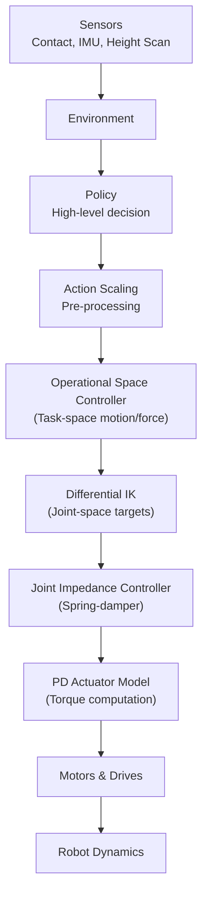
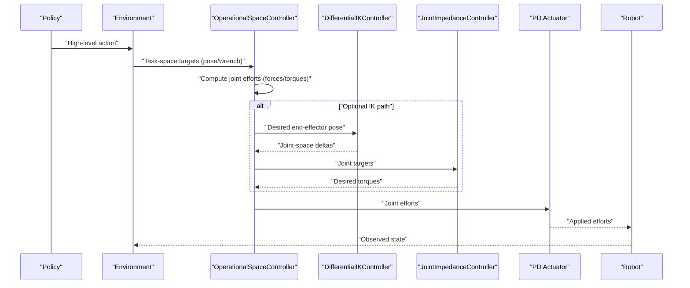
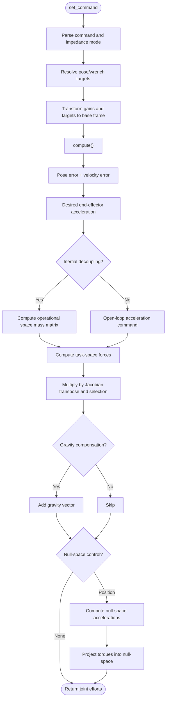
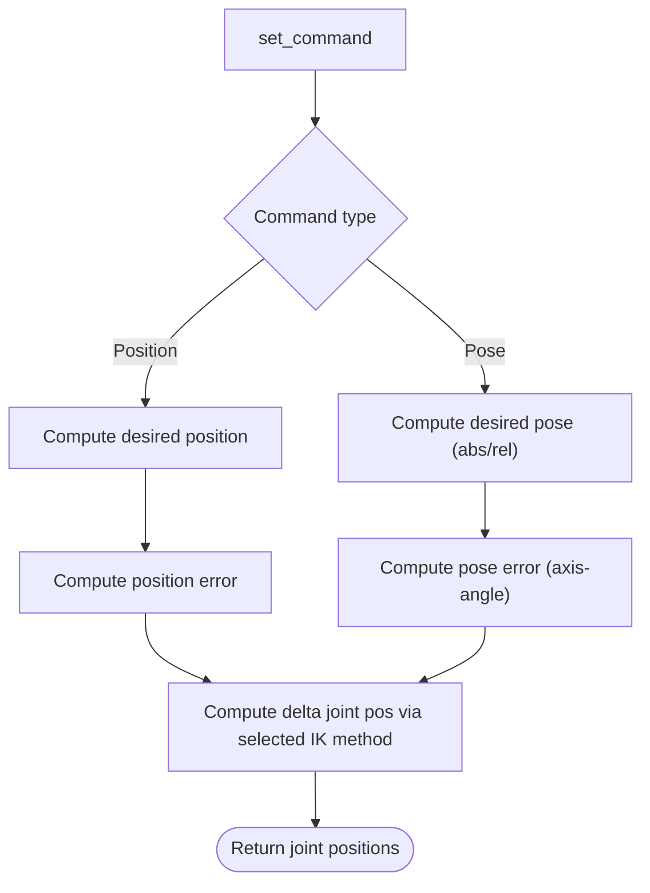
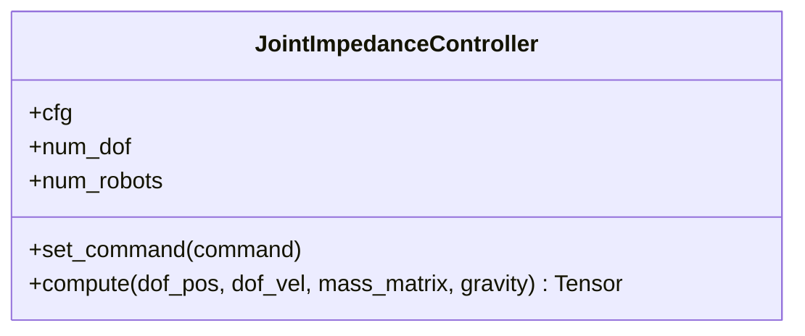
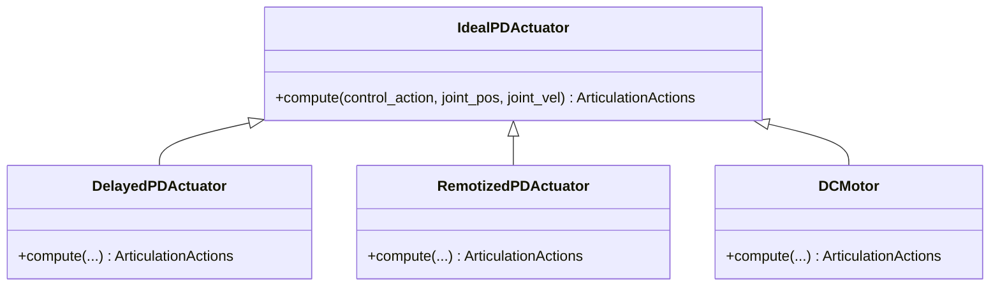
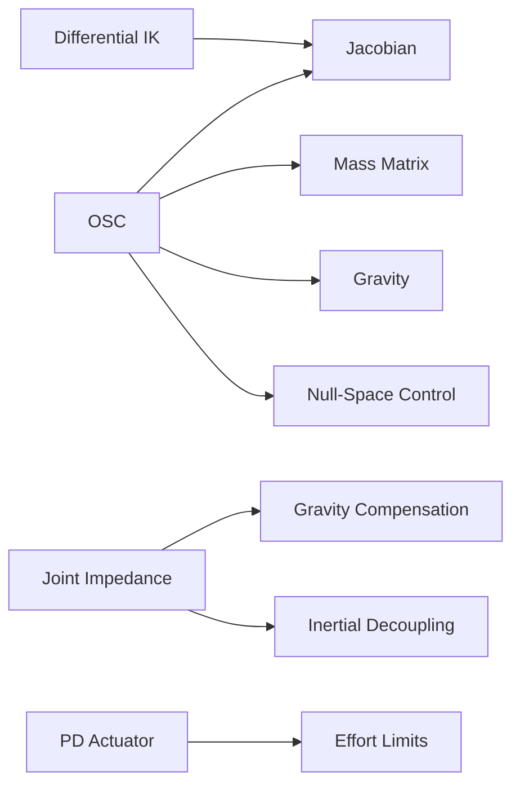
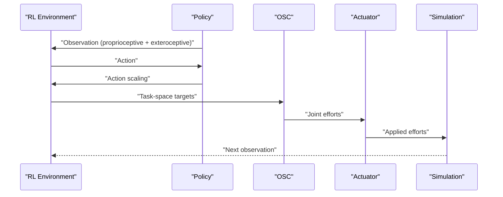

# Control Architecture Overview

<cite>
**Referenced Files in This Document**
- [operational_space.py](file://source/isaaclab/isaaclab/controllers/operational_space.py)
- [operational_space_cfg.py](file://source/isaaclab/isaaclab/controllers/operational_space_cfg.py)
- [joint_impedance.py](file://source/isaaclab/isaaclab/controllers/joint_impedance.py)
- [differential_ik.py](file://source/isaaclab/isaaclab/controllers/differential_ik.py)
- [actuator_pd.py](file://source/isaaclab/isaaclab/actuators/actuator_pd.py)
- [README.md](file://README.md)
- [create_quadruped_base_env.py](file://scripts/tutorials/03_envs/create_quadruped_base_env.py)
- [contact_sensor_cfg.py](file://source/isaaclab/isaaclab/sensors/contact_sensor/contact_sensor_cfg.py)
</cite>

## Table of Contents
1. [Introduction](#introduction)
2. [Project Structure](#project-structure)
3. [Core Components](#core-components)
4. [Architecture Overview](#architecture-overview)
5. [Detailed Component Analysis](#detailed-component-analysis)
6. [Dependency Analysis](#dependency-analysis)
7. [Performance Considerations](#performance-considerations)
8. [Troubleshooting Guide](#troubleshooting-guide)
9. [Conclusion](#conclusion)
10. [Appendices](#appendices)

## Introduction
This document explains the hierarchical control architecture implemented for the Go2 quadruped platform within the repository. The control system integrates:
- Low-level PD actuator model
- Joint impedance control (PD-like spring-damper regulation)
- Inverse kinematics (differential IK)
- Operational space control (OSC) for task-space motion and force control

It documents the control flow from high-level policy decisions to low-level motor commands, the roles of each control layer, parameter scheduling strategies, stability analysis methods, and real-time performance considerations. It also connects control systems to the ablation study framework that evaluates sensor fusion architectures and their impact on control performance.

## Project Structure
The control stack spans several modules:
- Controllers: OSC, joint impedance, differential IK
- Actuators: PD-based actuator models
- Sensors: contact and IMU sensors used for perception and feedback
- Environments: RL environments that orchestrate policies and control loops
- Ablation study: documented in the repository’s README with training commands and outcomes

**Diagram sources**
- [operational_space.py:23-549](file://source/isaaclab/isaaclab/controllers/operational_space.py#L23-L549)
- [differential_ik.py:17-241](file://source/isaaclab/isaaclab/controllers/differential_ik.py#L17-L241)
- [joint_impedance.py:59-230](file://source/isaaclab/isaaclab/controllers/joint_impedance.py#L59-L230)
- [actuator_pd.py:148-449](file://source/isaaclab/isaaclab/actuators/actuator_pd.py#L148-L449)

**Section sources**
- [operational_space.py:23-549](file://source/isaaclab/isaaclab/controllers/operational_space.py#L23-L549)
- [differential_ik.py:17-241](file://source/isaaclab/isaaclab/controllers/differential_ik.py#L17-L241)
- [joint_impedance.py:59-230](file://source/isaaclab/isaaclab/controllers/joint_impedance.py#L59-L230)
- [actuator_pd.py:148-449](file://source/isaaclab/isaaclab/actuators/actuator_pd.py#L148-L449)

## Core Components
- Operational Space Controller (OSC): Computes joint efforts from task-space pose/wrench targets using Jacobian, inertial decoupling, gravity compensation, and null-space control.
- Differential IK: Converts task-space targets into joint-space deltas via pseudo-inverses (Moore–Penrose, SVD, transpose, damped least-squares).
- Joint Impedance Controller: Produces desired torques from joint position/desired-position commands with optional inverse dynamics and gravity compensation.
- PD Actuator Model: Applies PD control to translate desired torques into motor efforts with saturation/clipping.

Key configuration knobs:
- OSC: target types, motion/force control axes, stiffness/damping, inertial decoupling, gravity compensation, null-space control, and impedance modes.
- Differential IK: command types (position/pose), relative mode, and IK method selection.
- Joint Impedance: command type (absolute/relative), stiffness/damping, and compensation flags.
- Actuator: stiffness/damping parameters and effort/velocity limits.

**Section sources**
- [operational_space_cfg.py:14-91](file://source/isaaclab/isaaclab/controllers/operational_space_cfg.py#L14-L91)
- [operational_space.py:34-161](file://source/isaaclab/isaaclab/controllers/operational_space.py#L34-L161)
- [differential_ik.py:54-85](file://source/isaaclab/isaaclab/controllers/differential_ik.py#L54-L85)
- [joint_impedance.py:13-57](file://source/isaaclab/isaaclab/controllers/joint_impedance.py#L13-L57)
- [actuator_pd.py:148-199](file://source/isaaclab/isaaclab/actuators/actuator_pd.py#L148-L199)

## Architecture Overview
The control pipeline proceeds as follows:
1. Policy generates high-level actions (e.g., base velocity, terrain-following targets).
2. Environment scales actions and passes them to the OSC.
3. OSC computes task-space forces/torques from pose/wrench targets and transforms them into joint efforts.
4. Optional: Differential IK converts desired end-effector pose into joint targets for the joint impedance controller.
5. Joint impedance controller computes desired torques from joint-space commands.
6. PD actuator model computes applied efforts and sends them to motors.
7. Robot dynamics execute and sensors observe state for the next cycle.

**Diagram sources**
- [operational_space.py:345-549](file://source/isaaclab/isaaclab/controllers/operational_space.py#L345-L549)
- [differential_ik.py:148-174](file://source/isaaclab/isaaclab/controllers/differential_ik.py#L148-L174)
- [joint_impedance.py:183-230](file://source/isaaclab/isaaclab/controllers/joint_impedance.py#L183-L230)
- [actuator_pd.py:184-199](file://source/isaaclab/isaaclab/actuators/actuator_pd.py#L184-L199)

## Detailed Component Analysis

### Operational Space Controller
- Purpose: Implements task-space motion and force control with inertial decoupling, gravity compensation, and null-space control.
- Inputs: Jacobian in base frame, current end-effector pose/velocity/force, mass matrix, gravity vector, joint positions/velocities, and optional null-space targets.
- Outputs: Joint efforts (torques).
- Modes:
  - Fixed/variable stiffness and damping for motion control.
  - Closed-loop force control with selection matrices for contact wrench axes.
  - Null-space control for redundant manipulators (position control).
- Stability and performance:
  - Inertial decoupling reduces coupling between translation and rotation.
  - Partial decoupling option simplifies computation.
  - Selection matrices isolate controlled axes to avoid cross-coupling.

**Diagram sources**
- [operational_space.py:173-549](file://source/isaaclab/isaaclab/controllers/operational_space.py#L173-L549)
- [operational_space_cfg.py:14-91](file://source/isaaclab/isaaclab/controllers/operational_space_cfg.py#L14-L91)

**Section sources**
- [operational_space.py:23-549](file://source/isaaclab/isaaclab/controllers/operational_space.py#L23-L549)
- [operational_space_cfg.py:14-91](file://source/isaaclab/isaaclab/controllers/operational_space_cfg.py#L14-L91)

### Differential Inverse Kinematics
- Purpose: Compute joint deltas from desired end-effector pose changes using pseudo-inverse methods.
- Methods: Moore–Penrose, adaptive SVD, transpose, damped least-squares.
- Modes: Position-only or full pose (absolute or relative).
- Robustness: Singularity handling via damping and adaptive SVD.

**Diagram sources**
- [differential_ik.py:98-241](file://source/isaaclab/isaaclab/controllers/differential_ik.py#L98-L241)

**Section sources**
- [differential_ik.py:17-241](file://source/isaaclab/isaaclab/controllers/differential_ik.py#L17-L241)

### Joint Impedance Controller
- Purpose: Spring-damper regulation around desired joint positions with optional inverse dynamics and gravity compensation.
- Modes: Fixed stiffness, variable stiffness, and variable stiffness plus damping.
- Command types: Absolute or relative joint positions.

**Diagram sources**
- [joint_impedance.py:59-230](file://source/isaaclab/isaaclab/controllers/joint_impedance.py#L59-L230)

**Section sources**
- [joint_impedance.py:59-230](file://source/isaaclab/isaaclab/controllers/joint_impedance.py#L59-L230)

### PD Actuator Model
- Purpose: Translate desired torques into applied efforts using PD control with saturation/clipping.
- Features: Ideal PD, delayed PD, angle-dependent torque limits (remotized), and DC motor saturation model.

**Diagram sources**
- [actuator_pd.py:148-449](file://source/isaaclab/isaaclab/actuators/actuator_pd.py#L148-L449)

**Section sources**
- [actuator_pd.py:148-449](file://source/isaaclab/isaaclab/actuators/actuator_pd.py#L148-L449)

## Dependency Analysis
- OSC depends on:
  - Jacobian (geometric), mass matrix, gravity vector, selection matrices, and task-frame transforms.
  - Null-space control depends on redundant degrees-of-freedom and pseudo-inverse selection.
- Differential IK depends on:
  - Command type and IK method selection; robustness via damping/SVD.
- Joint Impedance depends on:
  - Stiffness/damping gains and optional inverse dynamics/gravity compensation.
- Actuator depends on:
  - PD gains and effort/velocity limits; optional delays and angle-dependent torque limits.

**Diagram sources**
- [operational_space.py:345-549](file://source/isaaclab/isaaclab/controllers/operational_space.py#L345-L549)
- [differential_ik.py:148-241](file://source/isaaclab/isaaclab/controllers/differential_ik.py#L148-L241)
- [joint_impedance.py:183-230](file://source/isaaclab/isaaclab/controllers/joint_impedance.py#L183-L230)
- [actuator_pd.py:184-199](file://source/isaaclab/isaaclab/actuators/actuator_pd.py#L184-L199)

**Section sources**
- [operational_space.py:345-549](file://source/isaaclab/isaaclab/controllers/operational_space.py#L345-L549)
- [differential_ik.py:148-241](file://source/isaaclab/isaaclab/controllers/differential_ik.py#L148-L241)
- [joint_impedance.py:183-230](file://source/isaaclab/isaaclab/controllers/joint_impedance.py#L183-L230)
- [actuator_pd.py:184-199](file://source/isaaclab/isaaclab/actuators/actuator_pd.py#L184-L199)

## Performance Considerations
- Computational overhead:
  - OSC: matrix inversions and pseudo-inverses dominate cost; partial decoupling reduces coupling but still requires inversion of sub-blocks.
  - Differential IK: SVD and damped least-squares are more expensive than Moore–Penrose; choose method based on singularity risk.
  - Joint Impedance: lightweight spring-damper computation; inverse dynamics adds cost.
  - Actuator: PD computation with clipping is efficient.
- Real-time constraints:
  - Prefer explicit actuator models for deterministic latency; implicit actuator relies on simulation PD internally.
  - Use partial inertial decoupling in OSC to reduce matrix inversion costs.
  - Tune IK method to balance accuracy and speed (transpose for speed, SVD for robustness).
- Parameter scheduling:
  - Increase stiffness gradually during training; reduce damping for faster response, but ensure stability margins.
  - Use variable stiffness/damping modes to adapt to terrain and gait transitions.
  - Apply action scaling in environments to match actuator capabilities.

[No sources needed since this section provides general guidance]

## Troubleshooting Guide
Common issues and remedies:
- OSC errors:
  - Missing inputs: ensure mass matrix, gravity, and end-effector pose/velocity are provided when required.
  - Null-space control: verify redundant DoFs and correct pseudo-inverse selection.
- Differential IK:
  - Unsupported method or missing parameters; verify IK method and parameters.
  - Relative commands require current pose/orientation.
- Joint Impedance:
  - Invalid command shapes or modes; ensure action dimension matches configured mode.
- Actuator:
  - Effort/velocity limits exceeded; adjust gains or limits; consider DC motor saturation model.

**Section sources**
- [operational_space.py:380-393](file://source/isaaclab/isaaclab/controllers/operational_space.py#L380-L393)
- [differential_ik.py:114-118](file://source/isaaclab/isaaclab/controllers/differential_ik.py#L114-L118)
- [joint_impedance.py:152-156](file://source/isaaclab/isaaclab/controllers/joint_impedance.py#L152-L156)
- [actuator_pd.py:292-304](file://source/isaaclab/isaaclab/actuators/actuator_pd.py#L292-L304)

## Conclusion
The Go2 control architecture layers task-space operational control with joint impedance and PD actuation, enabling precise motion and force control. OSC provides robust task-space control with inertial decoupling and null-space shaping; Differential IK bridges task to joint space; Joint Impedance offers compliant control; and PD actuators realize torques with realistic saturation. Proper parameter scheduling, stability checks, and method selection are essential for real-time performance and reliable operation.

[No sources needed since this section summarizes without analyzing specific files]

## Appendices

### Control Parameter Scheduling Strategies
- Stiffness/damping:
  - Start with moderate stiffness; increase gradually as stability improves.
  - Use variable stiffness/damping modes to adapt to terrain and activity.
- IK method:
  - Use transpose for speed; switch to SVD or damped least-squares when encountering singularities.
- OSC decoupling:
  - Enable partial decoupling for reduced cost; full decoupling for higher fidelity.
- Actuator limits:
  - Calibrate effort/velocity limits to hardware capabilities; use DC motor model for realistic torque-speed curves.

[No sources needed since this section provides general guidance]

### Stability Analysis Methods
- Lyapunov-based analysis:
  - For joint impedance, verify positive definiteness of stiffness/damping matrices.
  - For OSC, ensure selection matrices isolate controlled axes and decoupling stabilizes subsystems.
- Singularity handling:
  - Use damped least-squares or adaptive SVD in IK; monitor condition numbers.
- Energy-based methods:
  - Track potential/kinetic energy and ensure boundedness of control inputs.

[No sources needed since this section provides general guidance]

### Real-Time Performance Considerations
- Minimize GPU/CPU synchronization; batch computations across environments.
- Reduce matrix operations: prefer partial decoupling; avoid full OSC mass matrix inversion when unnecessary.
- Choose IK method based on environment complexity; use transpose for simple motions, SVD for complex tasks.
- Use explicit actuator models for predictable latency; tune control frequency to simulation timestep.

[No sources needed since this section provides general guidance]

### Integration Patterns with Reinforcement Learning
- Environment orchestration:
  - Scale policy actions and pass them to OSC; collect observations from sensors.
  - Use contact sensors to inform terrain-aware policies.
- Training commands and ablations:
  - Follow repository training commands and ablation setups to evaluate sensor fusion impacts on control performance.

**Diagram sources**
- [create_quadruped_base_env.py:204-245](file://scripts/tutorials/03_envs/create_quadruped_base_env.py#L204-L245)

**Section sources**
- [create_quadruped_base_env.py:204-245](file://scripts/tutorials/03_envs/create_quadruped_base_env.py#L204-L245)
- [contact_sensor_cfg.py:14-77](file://source/isaaclab/isaaclab/sensors/contact_sensor/contact_sensor_cfg.py#L14-L77)
- [README.md:109-152](file://README.md#L109-L152)

### Relationship Between Control Systems and Ablation Study
- The repository’s ablation study evaluates how sensor fusion affects policy performance. Control parameters (e.g., stiffness, IK method, OSC decoupling) should be tuned to match the sensor modalities used by the policy (e.g., raw scans, encoded scans, privileged observations).
- Best-performing ablations emphasize scan encoding for both actor and critic and avoid privileged observation encoding for the critic, aligning with stable control and perception.

**Section sources**
- [README.md:109-152](file://README.md#L109-L152)