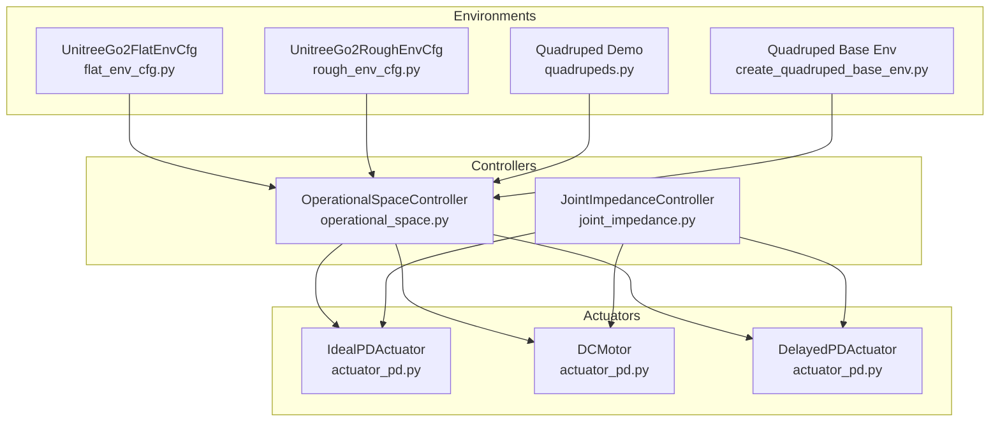
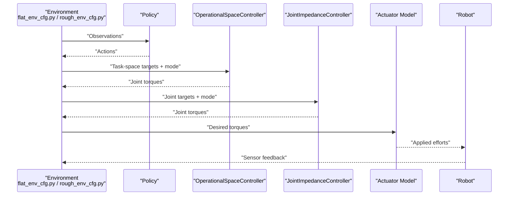
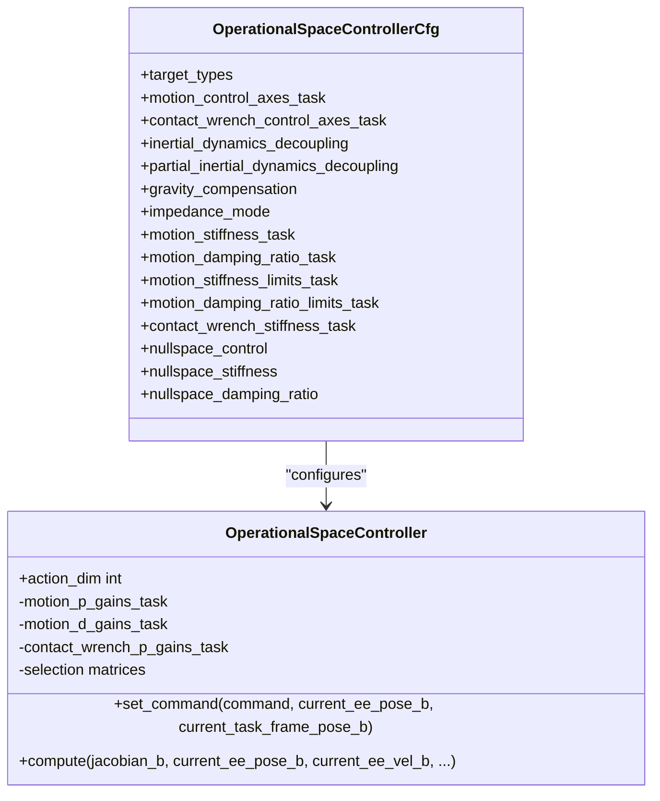
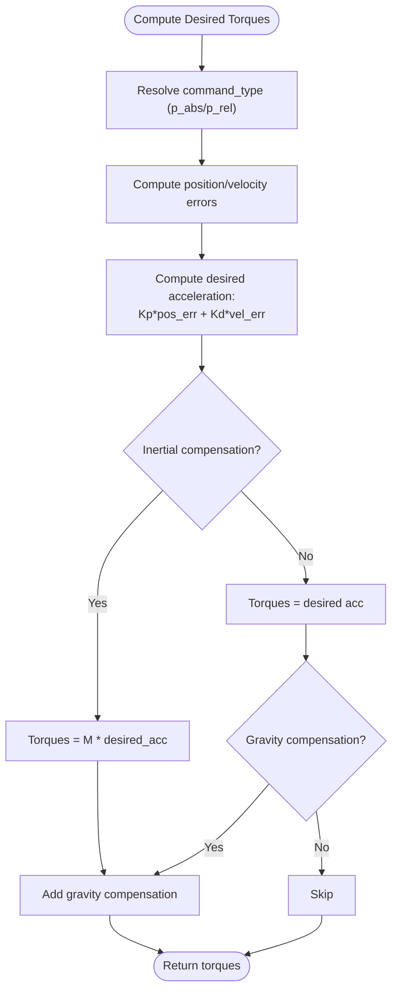
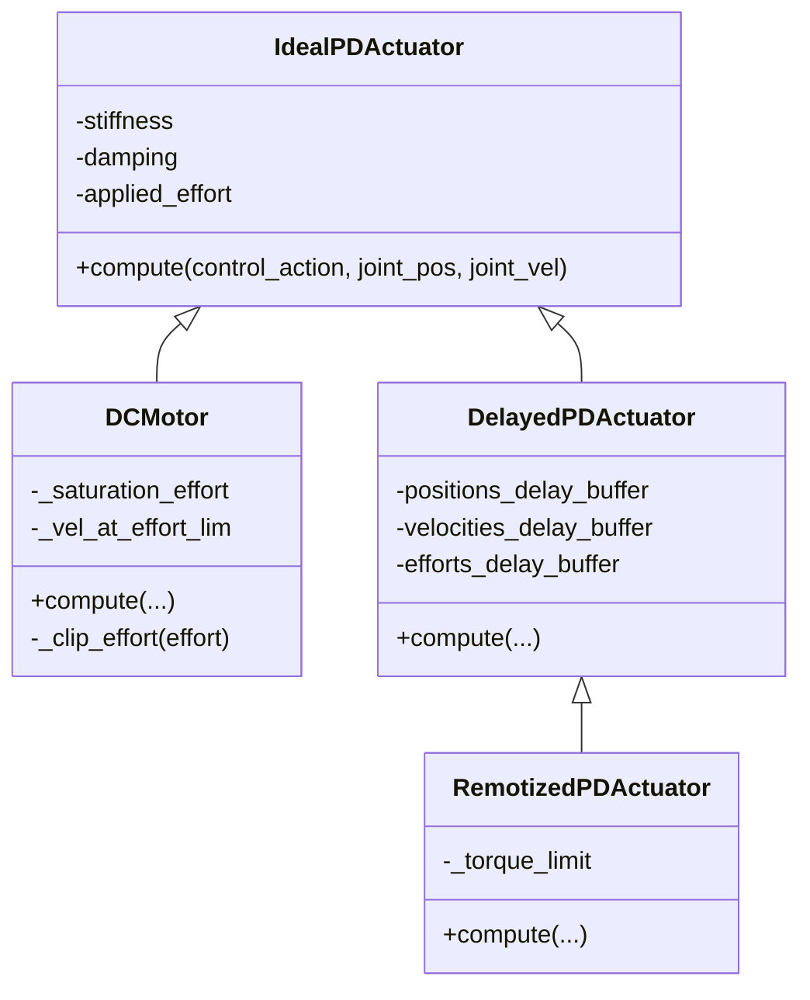
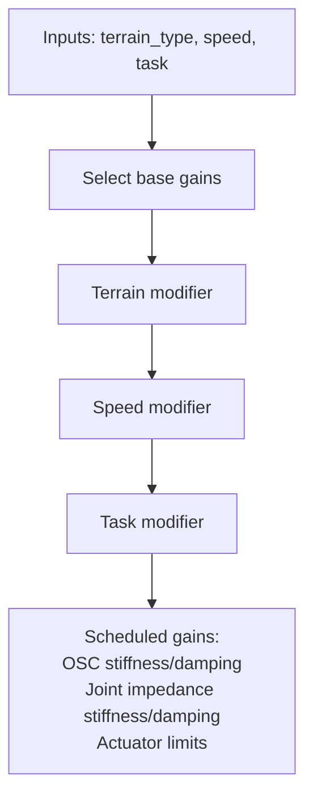
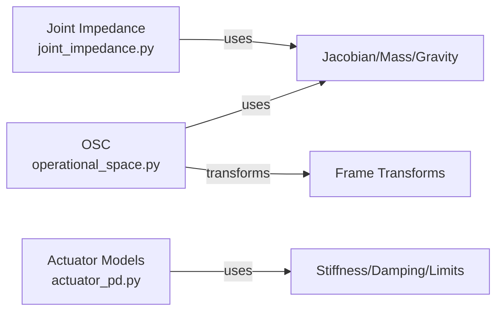

# Control Parameter Tuning and Optimization

<cite>
**Referenced Files in This Document**
- [operational_space.py](file://source/isaaclab/isaaclab/controllers/operational_space.py)
- [operational_space_cfg.py](file://source/isaaclab/isaaclab/controllers/operational_space_cfg.py)
- [joint_impedance.py](file://source/isaaclab/isaaclab/controllers/joint_impedance.py)
- [actuator_pd.py](file://source/isaaclab/isaaclab/actuators/actuator_pd.py)
- [run_osc.py](file://scripts/tutorials/05_controllers/run_osc.py)
- [flat_env_cfg.py](file://source/isaaclab_tasks/isaaclab_tasks/manager_based/locomotion/velocity/config/go2/flat_env_cfg.py)
- [rough_env_cfg.py](file://source/isaaclab_tasks/isaaclab_tasks/manager_based/locomotion/velocity/config/go2/rough_env_cfg.py)
- [create_quadruped_base_env.py](file://scripts/tutorials/03_envs/create_quadruped_base_env.py)
- [quadrupeds.py](file://scripts/demos/quadrupeds.py)
</cite>

## Table of Contents
1. [Introduction](#introduction)
2. [Project Structure](#project-structure)
3. [Core Components](#core-components)
4. [Architecture Overview](#architecture-overview)
5. [Detailed Component Analysis](#detailed-component-analysis)
6. [Dependency Analysis](#dependency-analysis)
7. [Performance Considerations](#performance-considerations)
8. [Troubleshooting Guide](#troubleshooting-guide)
9. [Conclusion](#conclusion)
10. [Appendices](#appendices)

## Introduction
This document explains control parameter tuning and optimization strategies for quadruped locomotion systems in the repository, focusing on:
- PD gains and actuator modeling
- Operational Space Control (OSC) stiffness/damping and impedance modes
- Joint impedance control parameters
- Parameter scheduling across terrain types, speeds, and tasks
- Sensor fusion and ablation considerations
- Practical workflows for parameter identification, optimization, and automated tuning
- Stability analysis, performance metrics, and real-time adaptation

The content is grounded in the controller implementations and environment configurations present in the repository.

## Project Structure
The control stack integrates:
- Controllers: Operational Space Control (OSC) and joint impedance control
- Actuator models: Ideal PD, delayed PD, and DC motor models
- Environments: Go2 quadruped locomotion configurations for flat and rough terrains
- Tutorials and demos: Examples of controller usage and environment setup

**Diagram sources**
- [operational_space.py:23-549](file://source/isaaclab/isaaclab/controllers/operational_space.py#L23-L549)
- [joint_impedance.py:59-230](file://source/isaaclab/isaaclab/controllers/joint_impedance.py#L59-L230)
- [actuator_pd.py:148-449](file://source/isaaclab/isaaclab/actuators/actuator_pd.py#L148-L449)
- [flat_env_cfg.py:11-44](file://source/isaaclab_tasks/isaaclab_tasks/manager_based/locomotion/velocity/config/go2/flat_env_cfg.py#L11-L44)
- [rough_env_cfg.py:16-86](file://source/isaaclab_tasks/isaaclab_tasks/manager_based/locomotion/velocity/config/go2/rough_env_cfg.py#L16-L86)
- [quadrupeds.py:104-107](file://scripts/demos/quadrupeds.py#L104-L107)
- [create_quadruped_base_env.py:102-102](file://scripts/tutorials/03_envs/create_quadruped_base_env.py#L102-L102)

**Section sources**
- [operational_space.py:23-549](file://source/isaaclab/isaaclab/controllers/operational_space.py#L23-L549)
- [joint_impedance.py:59-230](file://source/isaaclab/isaaclab/controllers/joint_impedance.py#L59-L230)
- [actuator_pd.py:148-449](file://source/isaaclab/isaaclab/actuators/actuator_pd.py#L148-L449)
- [flat_env_cfg.py:11-44](file://source/isaaclab_tasks/isaaclab_tasks/manager_based/locomotion/velocity/config/go2/flat_env_cfg.py#L11-L44)
- [rough_env_cfg.py:16-86](file://source/isaaclab_tasks/isaaclab_tasks/manager_based/locomotion/velocity/config/go2/rough_env_cfg.py#L16-L86)
- [quadrupeds.py:104-107](file://scripts/demos/quadrupeds.py#L104-L107)
- [create_quadruped_base_env.py:102-102](file://scripts/tutorials/03_envs/create_quadruped_base_env.py#L102-L102)

## Core Components
- Operational Space Controller (OSC)
  - Implements task-space motion control, optional contact wrench control, gravity compensation, and null-space control.
  - Supports fixed, variable_kp, and variable impedance modes for stiffness/damping scheduling.
  - Uses selection matrices to enable/disable axes and transforms gains between task and root frames.
- Joint Impedance Controller
  - Provides joint-space spring-damper control with optional inertial compensation and gravity compensation.
  - Supports fixed, variable_kp, and variable impedance modes for stiffness/damping scheduling.
- Actuator Models
  - Ideal PD actuator with effort clipping
  - DC motor model with velocity-dependent torque limits
  - Delayed PD actuator with configurable time lag
  - Remotized PD actuator with angle-dependent torque limits

Key parameter families:
- OSC: motion stiffness/damping, contact wrench stiffness, selection axes, gravity compensation, null-space gains
- Joint Impedance: stiffness, damping ratio, inertial compensation, gravity compensation
- Actuators: stiffness, damping, effort/velocity limits, delay, torque limit lookup

**Section sources**
- [operational_space.py:34-141](file://source/isaaclab/isaaclab/controllers/operational_space.py#L34-L141)
- [operational_space_cfg.py:14-91](file://source/isaaclab/isaaclab/controllers/operational_space_cfg.py#L14-L91)
- [joint_impedance.py:66-131](file://source/isaaclab/isaaclab/controllers/joint_impedance.py#L66-L131)
- [actuator_pd.py:148-449](file://source/isaaclab/isaaclab/actuators/actuator_pd.py#L148-L449)

## Architecture Overview
The control pipeline connects environment sensors and policies to actuators via controllers. OSC and joint impedance operate at different levels:
- OSC operates at task space (end-effector pose/force) and can schedule stiffness/damping per-axis and per-mode.
- Joint impedance operates at joint space and schedules stiffness/damping per DOF.

**Diagram sources**
- [flat_env_cfg.py:11-44](file://source/isaaclab_tasks/isaaclab_tasks/manager_based/locomotion/velocity/config/go2/flat_env_cfg.py#L11-L44)
- [rough_env_cfg.py:16-86](file://source/isaaclab_tasks/isaaclab_tasks/manager_based/locomotion/velocity/config/go2/rough_env_cfg.py#L16-L86)
- [operational_space.py:173-344](file://source/isaaclab/isaaclab/controllers/operational_space.py#L173-L344)
- [joint_impedance.py:145-229](file://source/isaaclab/isaaclab/controllers/joint_impedance.py#L145-L229)
- [actuator_pd.py:184-198](file://source/isaaclab/isaaclab/actuators/actuator_pd.py#L184-L198)

## Detailed Component Analysis

### Operational Space Control (OSC)
- Motion control
  - Stiffness gains and damping gains derived from stiffness and damping ratio.
  - Selection matrices enable axis-wise control; gains transformed between task and root frames.
- Contact wrench control
  - Optional closed-loop force control with proportional gains; currently only linear force feedback is used.
- Impedance modes
  - Fixed: gains set by configuration
  - Variable_kp: stiffness scheduled per-env; damping derived from stiffness and fixed damping ratio
  - Variable: stiffness and damping scheduled per-env
- Null-space control
  - Position control in null space with configurable stiffness/damping and optional inertia-aware projection.

**Diagram sources**
- [operational_space.py:34-141](file://source/isaaclab/isaaclab/controllers/operational_space.py#L34-L141)
- [operational_space_cfg.py:14-91](file://source/isaaclab/isaaclab/controllers/operational_space_cfg.py#L14-L91)

**Section sources**
- [operational_space.py:34-141](file://source/isaaclab/isaaclab/controllers/operational_space.py#L34-L141)
- [operational_space.py:173-344](file://source/isaaclab/isaaclab/controllers/operational_space.py#L173-L344)
- [operational_space.py:345-549](file://source/isaaclab/isaaclab/controllers/operational_space.py#L345-L549)
- [operational_space_cfg.py:14-91](file://source/isaaclab/isaaclab/controllers/operational_space_cfg.py#L14-L91)

### Joint Impedance Control
- Computes desired joint accelerations from position/velocity errors and converts to torques.
- Supports inertial compensation (inverse dynamics) and gravity compensation.
- Impedance modes mirror OSC: fixed, variable_kp, variable.

**Diagram sources**
- [joint_impedance.py:183-229](file://source/isaaclab/isaaclab/controllers/joint_impedance.py#L183-L229)

**Section sources**
- [joint_impedance.py:66-131](file://source/isaaclab/isaaclab/controllers/joint_impedance.py#L66-L131)
- [joint_impedance.py:145-229](file://source/isaaclab/isaaclab/controllers/joint_impedance.py#L145-L229)

### Actuator Models
- Ideal PD
  - Torque = Kp*(pos_des - pos) + Kd*(vel_des - vel) + effort_ff
  - Effort clipped by constant limits
- DC Motor
  - Velocity-dependent torque limits modeled by linear torque-speed curve
- Delayed PD
  - Adds configurable delay buffers for position/velocity/effort
- Remotized PD
  - Angle-dependent torque limits via lookup table interpolation

**Diagram sources**
- [actuator_pd.py:148-449](file://source/isaaclab/isaaclab/actuators/actuator_pd.py#L148-L449)

**Section sources**
- [actuator_pd.py:148-449](file://source/isaaclab/isaaclab/actuators/actuator_pd.py#L148-L449)

### Parameter Scheduling Across Tasks and Terrains
- Go2 environments
  - Flat and rough configurations adjust rewards and terrain generators to reflect different locomotion demands.
  - Action scaling and event configurations tailor control difficulty and robustness.
- Practical scheduling ideas
  - Terrain: increase stiffness/damping on rough terrains; reduce for flat, smooth surfaces
  - Speed: higher damping for high-speed trotting; lower for slow walking
  - Task: stance-phase vs swing-phase gains; terrain-following vs velocity tracking
  - Sensor fusion: use height scan and IMU projections to modulate compliance and damping

[No sources needed since this diagram shows conceptual workflow, not actual code structure]

**Section sources**
- [flat_env_cfg.py:11-44](file://source/isaaclab_tasks/isaaclab_tasks/manager_based/locomotion/velocity/config/go2/flat_env_cfg.py#L11-L44)
- [rough_env_cfg.py:16-86](file://source/isaaclab_tasks/isaaclab_tasks/manager_based/locomotion/velocity/config/go2/rough_env_cfg.py#L16-L86)
- [create_quadruped_base_env.py:102-102](file://scripts/tutorials/03_envs/create_quadruped_base_env.py#L102-L102)

### Relationship Between Control Parameters and Sensor Fusion (Ablation Study Framework)
- Sensor inputs used in environments:
  - IMU projected gravity, base linear/angular velocity, joint positions/velocities
  - Height scanner for terrain adaptation
- Ablation study guidance:
  - Remove height scan to assess terrain-following reliance
  - Remove IMU projections to assess posture control sensitivity
  - Vary sensor noise to evaluate robustness of tuned gains
- Parameter impact:
  - Reduced sensing increases reliance on compliant control (higher damping/stiffness)
  - Enhanced sensing enables more aggressive control (lower damping/stiffness)

**Section sources**
- [create_quadruped_base_env.py:142-157](file://scripts/tutorials/03_envs/create_quadruped_base_env.py#L142-L157)

### Practical Workflows for Parameter Identification and Optimization
- System identification
  - Estimate inertia and Coriolis effects from motion trajectories
  - Fit actuator models (DC motor) from torque-speed curves
- Offline optimization
  - Grid search over stiffness/damping ranges; cost includes tracking error, energy, and contact stability
  - Bayesian optimization over OSC and joint impedance parameters
- Online adaptation
  - Sliding-window metrics for tracking error and contact force variance
  - Gain scheduling based on terrain classifier or terrain height statistics
- Automated tuning
  - Hyperparameter sweeps for impedance modes and selection axes
  - Multi-objective optimization balancing speed, energy, and stability

[No sources needed since this section provides general guidance]

### Stability Analysis Methods and Performance Metrics
- Stability
  - Passivity-based analysis: ensure positive-definiteness of stiffness/damping matrices
  - Modal analysis: inspect dominant modes and damping ratios for oscillatory tendencies
  - Lyapunov-like criteria: verify that control error derivatives are negative semi-definite
- Metrics
  - Tracking error: pose/force tracking RMSE
  - Energy: mean and variance of actuator efforts and joint torques
  - Contact stability: normal force variance, foot-ground contact duration
  - Gait metrics: feet air time, step frequency, stride length

[No sources needed since this section provides general guidance]

### Real-Time Adaptation and Fault Tolerance
- Real-time adaptation
  - Switch between impedance modes based on terrain classification
  - Reduce stiffness/damping when contact force spikes detected
- Fault tolerance
  - Detect actuator saturation and reduce gains temporarily
  - Enable passive compliance when sensors fail
  - Fallback to joint impedance control if OSC Jacobian is ill-conditioned

[No sources needed since this section provides general guidance]

## Dependency Analysis
- OSC depends on:
  - Selection matrices and frame transforms
  - Inertia-aware mass matrix inversion for decoupling
  - Gravity compensation vector
- Joint Impedance depends on:
  - Mass matrix for inertial compensation
  - Gravity vector for bias correction
- Actuator models depend on:
  - Stiffness/damping parameters
  - Effort/velocity limits
  - Lookup tables for remotized models

**Diagram sources**
- [operational_space.py:345-549](file://source/isaaclab/isaaclab/controllers/operational_space.py#L345-L549)
- [joint_impedance.py:183-229](file://source/isaaclab/isaaclab/controllers/joint_impedance.py#L183-L229)
- [actuator_pd.py:184-198](file://source/isaaclab/isaaclab/actuators/actuator_pd.py#L184-L198)

**Section sources**
- [operational_space.py:345-549](file://source/isaaclab/isaaclab/controllers/operational_space.py#L345-L549)
- [joint_impedance.py:183-229](file://source/isaaclab/isaaclab/controllers/joint_impedance.py#L183-L229)
- [actuator_pd.py:184-198](file://source/isaaclab/isaaclab/actuators/actuator_pd.py#L184-L198)

## Performance Considerations
- Numerical conditioning
  - Ensure selection matrices and frame rotations are well-conditioned
  - Use partial inertia decoupling to mitigate coupling effects
- Computational efficiency
  - Prefer fixed impedance mode for real-time control; switch to variable modes for offline tuning
  - Minimize repeated matrix inversions; cache where appropriate
- Actuator bandwidth
  - Match actuator delay/limit profiles to control gains to avoid instability

[No sources needed since this section provides general guidance]

## Troubleshooting Guide
- OSC errors
  - Missing inputs: ensure current end-effector pose/velocity and mass/gravity are provided when required
  - Invalid selection matrices or gains: verify axis selection and limits
- Joint Impedance errors
  - Invalid command type or shape
  - Missing inertial quantities when compensation is enabled
- Actuator issues
  - Effort clipping due to limits; adjust limits or reduce gains
  - Delay mismatch causing lag; tune delay buffers and control gains

**Section sources**
- [operational_space.py:379-392](file://source/isaaclab/isaaclab/controllers/operational_space.py#L379-L392)
- [joint_impedance.py:198-210](file://source/isaaclab/isaaclab/controllers/joint_impedance.py#L198-L210)
- [actuator_pd.py:184-198](file://source/isaaclab/isaaclab/actuators/actuator_pd.py#L184-L198)

## Conclusion
The repository provides a flexible control stack for quadruped locomotion:
- OSC and joint impedance controllers support multiple impedance modes and frame-aware control
- Actuator models capture realistic hardware behavior
- Go2 environments demonstrate parameter scheduling across terrains and tasks
- Sensor fusion and ablation studies guide robust control design
Adopting structured tuning workflows, stability analysis, and real-time adaptation yields reliable performance across diverse conditions.

## Appendices

### Appendix A: OSC Parameter Reference
- Motion control
  - Axes selection: enable/disable axes per-task
  - Stiffness/damping: per-axis gains; limits enforced
  - Impedance modes: fixed, variable_kp, variable
- Force control
  - Contact wrench stiffness: closed-loop force control with linear force feedback
- Null-space control
  - Position control with configurable stiffness/damping

**Section sources**
- [operational_space_cfg.py:21-91](file://source/isaaclab/isaaclab/controllers/operational_space_cfg.py#L21-L91)
- [operational_space.py:173-344](file://source/isaaclab/isaaclab/controllers/operational_space.py#L173-L344)

### Appendix B: Joint Impedance Parameter Reference
- Stiffness/damping: per-DOF gains; limits enforced
- Modes: fixed, variable_kp, variable
- Compensation: inertial and gravity compensation

**Section sources**
- [joint_impedance.py:14-57](file://source/isaaclab/isaaclab/controllers/joint_impedance.py#L14-L57)
- [joint_impedance.py:66-131](file://source/isaaclab/isaaclab/controllers/joint_impedance.py#L66-L131)

### Appendix C: Actuator Parameter Reference
- Ideal PD: stiffness, damping, effort/velocity limits
- DC Motor: saturation effort, velocity limit, effort limit
- Delayed PD: min/max delay, time lag buffers
- Remotized PD: angle samples, transmission ratios, max torque samples

**Section sources**
- [actuator_pd.py:148-449](file://source/isaaclab/isaaclab/actuators/actuator_pd.py#L148-L449)

### Appendix D: Example Usage and Environment Setup
- OSC tutorial demonstrates setting targets, task frames, and computing torques
- Go2 environments illustrate terrain and reward configuration for tuning

**Section sources**
- [run_osc.py:127-278](file://scripts/tutorials/05_controllers/run_osc.py#L127-L278)
- [flat_env_cfg.py:11-44](file://source/isaaclab_tasks/isaaclab_tasks/manager_based/locomotion/velocity/config/go2/flat_env_cfg.py#L11-L44)
- [rough_env_cfg.py:16-86](file://source/isaaclab_tasks/isaaclab_tasks/manager_based/locomotion/velocity/config/go2/rough_env_cfg.py#L16-L86)
- [quadrupeds.py:104-107](file://scripts/demos/quadrupeds.py#L104-L107)
- [create_quadruped_base_env.py:102-102](file://scripts/tutorials/03_envs/create_quadruped_base_env.py#L102-L102)