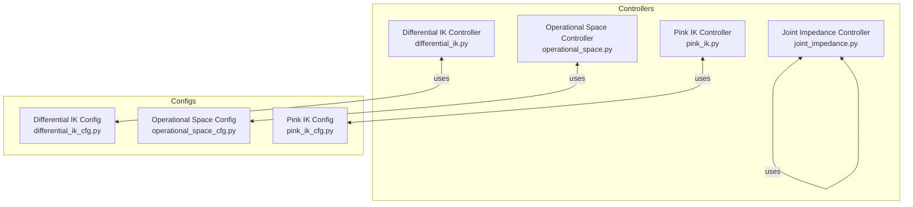
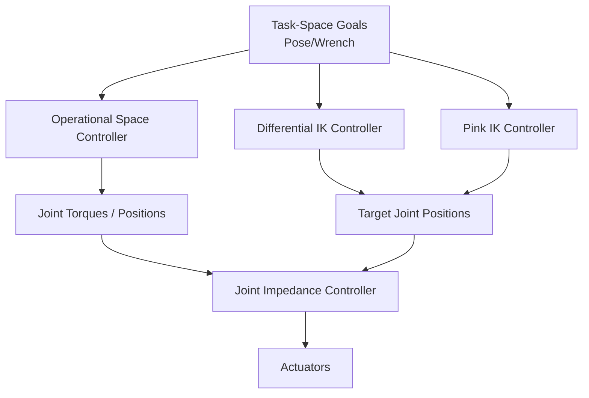
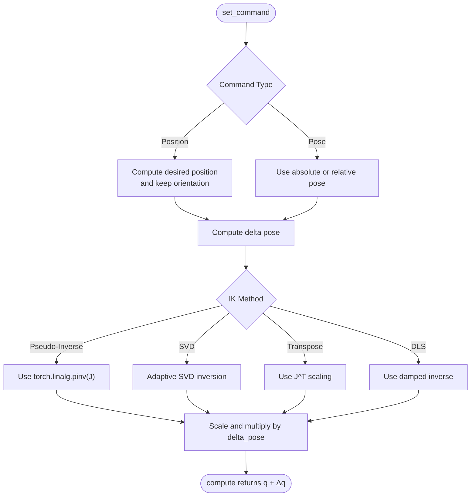
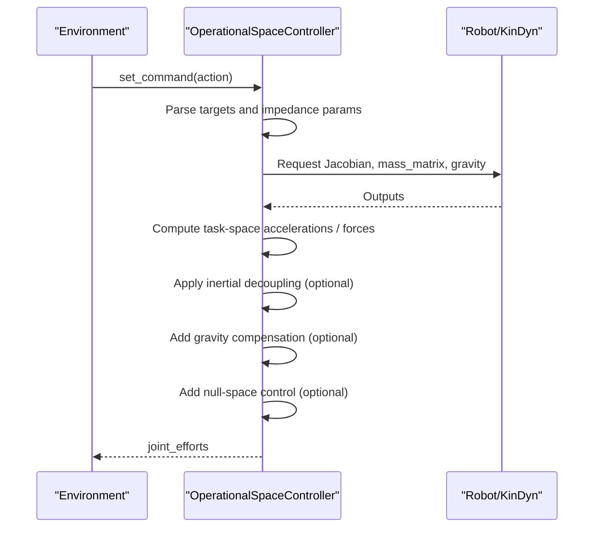
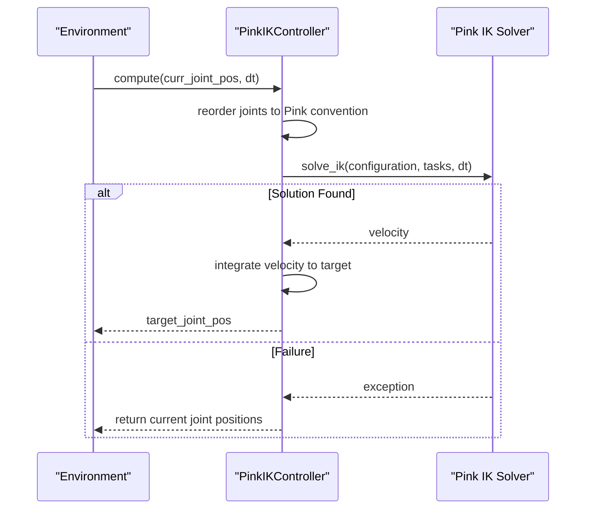
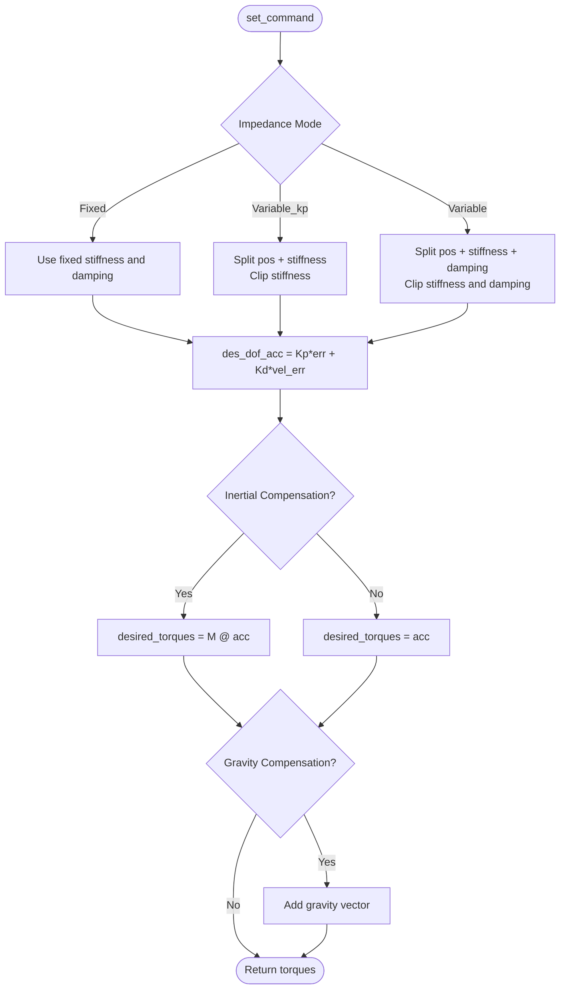
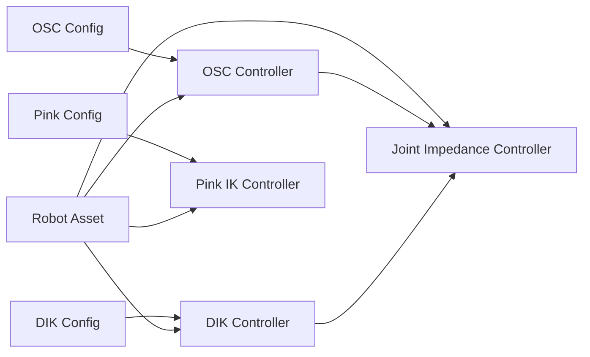

# Control Systems

<cite>
**Referenced Files in This Document**
- [differential_ik.py](file://source/isaaclab/isaaclab/controllers/differential_ik.py)
- [differential_ik_cfg.py](file://source/isaaclab/isaaclab/controllers/differential_ik_cfg.py)
- [operational_space.py](file://source/isaaclab/isaaclab/controllers/operational_space.py)
- [operational_space_cfg.py](file://source/isaaclab/isaaclab/controllers/operational_space_cfg.py)
- [pink_ik.py](file://source/isaaclab/isaaclab/controllers/pink_ik.py)
- [pink_ik_cfg.py](file://source/isaaclab/isaaclab/controllers/pink_ik_cfg.py)
- [joint_impedance.py](file://source/isaaclab/isaaclab/controllers/joint_impedance.py)
- [test_differential_ik.py](file://source/isaaclab/test/controllers/test_differential_ik.py)
- [test_operational_space.py](file://source/isaaclab/test/controllers/test_operational_space.py)
- [test_pink_ik.py](file://source/isaaclab/test/controllers/test_pink_ik.py)
</cite>

## Table of Contents
1. [Introduction](#introduction)
2. [Project Structure](#project-structure)
3. [Core Components](#core-components)
4. [Architecture Overview](#architecture-overview)
5. [Detailed Component Analysis](#detailed-component-analysis)
6. [Dependency Analysis](#dependency-analysis)
7. [Performance Considerations](#performance-considerations)
8. [Troubleshooting Guide](#troubleshooting-guide)
9. [Conclusion](#conclusion)
10. [Appendices](#appendices)

## Introduction
This document explains the control systems implemented for the quadruped platform within the repository. It focuses on the hierarchical control architecture that combines:
- Joint impedance control for dynamic stability and compliance
- Differential inverse kinematics (IK) for precise foot placement
- Operational space control (OSC) for compliant task-space interactions
- Pink IK for advanced task-space control leveraging a differentiable IK solver

It also documents control parameterization, configuration, and how these systems integrate with the broader simulation and reinforcement learning workflows. Practical guidance is provided for control configuration, tuning, and real-time performance considerations.

## Project Structure
The control systems are implemented as modular controllers under the controllers package. Each controller exposes a configuration class and a runtime compute method. Tests demonstrate usage patterns and validate convergence and behavior across different modes.

**Diagram sources**
- [differential_ik.py:17-241](file://source/isaaclab/isaaclab/controllers/differential_ik.py#L17-L241)
- [operational_space.py:23-549](file://source/isaaclab/isaaclab/controllers/operational_space.py#L23-L549)
- [pink_ik.py:22-134](file://source/isaaclab/isaaclab/controllers/pink_ik.py#L22-L134)
- [joint_impedance.py:59-230](file://source/isaaclab/isaaclab/controllers/joint_impedance.py#L59-L230)
- [differential_ik_cfg.py:14-71](file://source/isaaclab/isaaclab/controllers/differential_ik_cfg.py#L14-L71)
- [operational_space_cfg.py:14-91](file://source/isaaclab/isaaclab/controllers/operational_space_cfg.py#L14-L91)
- [pink_ik_cfg.py:15-60](file://source/isaaclab/isaaclab/controllers/pink_ik_cfg.py#L15-L60)

**Section sources**
- [differential_ik.py:17-241](file://source/isaaclab/isaaclab/controllers/differential_ik.py#L17-L241)
- [operational_space.py:23-549](file://source/isaaclab/isaaclab/controllers/operational_space.py#L23-L549)
- [pink_ik.py:22-134](file://source/isaaclab/isaaclab/controllers/pink_ik.py#L22-L134)
- [joint_impedance.py:59-230](file://source/isaaclab/isaaclab/controllers/joint_impedance.py#L59-L230)
- [differential_ik_cfg.py:14-71](file://source/isaaclab/isaaclab/controllers/differential_ik_cfg.py#L14-L71)
- [operational_space_cfg.py:14-91](file://source/isaaclab/isaaclab/controllers/operational_space_cfg.py#L14-L91)
- [pink_ik_cfg.py:15-60](file://source/isaaclab/isaaclab/controllers/pink_ik_cfg.py#L15-L60)

## Core Components
- Differential IK Controller: Computes target joint positions from desired end-effector pose using pseudo-inverse, SVD, transpose, or damped least-squares methods. Supports absolute or relative commands and position or pose control.
- Operational Space Controller: Implements task-space impedance control with configurable motion and wrench control axes, optional inertial decoupling, gravity compensation, and null-space control for redundant systems.
- Pink IK Controller: Integrates a differentiable IK solver (Pink) to compute joint trajectories from task-space targets, handling variable and fixed tasks and joint name remapping.
- Joint Impedance Controller: Provides spring-damper joint control with fixed or variable stiffness and damping; supports inertial compensation and gravity compensation.

**Section sources**
- [differential_ik.py:17-241](file://source/isaaclab/isaaclab/controllers/differential_ik.py#L17-L241)
- [operational_space.py:23-549](file://source/isaaclab/isaaclab/controllers/operational_space.py#L23-L549)
- [pink_ik.py:22-134](file://source/isaaclab/isaaclab/controllers/pink_ik.py#L22-L134)
- [joint_impedance.py:59-230](file://source/isaaclab/isaaclab/controllers/joint_impedance.py#L59-L230)

## Architecture Overview
The control hierarchy typically proceeds as follows:
- High-level task-space goals (e.g., foot trajectory, terrain interaction wrench) are expressed in operational space.
- Operational space control computes joint torques or desired joint positions.
- For precise foot placement, differential IK can be used to map desired end-effector poses to joint targets.
- Pink IK complements task-space control by solving differentiable IK problems with multiple tasks.
- Joint impedance control stabilizes the system around desired joint positions or torques, adding compliance and bias corrections.

**Diagram sources**
- [operational_space.py:345-549](file://source/isaaclab/isaaclab/controllers/operational_space.py#L345-L549)
- [differential_ik.py:148-174](file://source/isaaclab/isaaclab/controllers/differential_ik.py#L148-L174)
- [pink_ik.py:83-134](file://source/isaaclab/isaaclab/controllers/pink_ik.py#L83-L134)
- [joint_impedance.py:183-230](file://source/isaaclab/isaaclab/controllers/joint_impedance.py#L183-L230)

## Detailed Component Analysis

### Differential IK Controller
- Purpose: Compute target joint positions from desired end-effector pose using geometric Jacobian-based methods.
- Modes:
  - Command type: position or pose
  - Relative or absolute mode
  - Methods: pseudo-inverse, adaptive SVD, transpose, damped least-squares
- Inputs: current end-effector pose, Jacobian, current joint positions
- Outputs: target joint positions
- Stability and conditioning: SVD and DLS methods improve numerical stability near singularities.

**Diagram sources**
- [differential_ik.py:98-174](file://source/isaaclab/isaaclab/controllers/differential_ik.py#L98-L174)
- [differential_ik.py:180-241](file://source/isaaclab/isaaclab/controllers/differential_ik.py#L180-L241)

**Section sources**
- [differential_ik.py:17-241](file://source/isaaclab/isaaclab/controllers/differential_ik.py#L17-L241)
- [differential_ik_cfg.py:14-71](file://source/isaaclab/isaaclab/controllers/differential_ik_cfg.py#L14-L71)

### Operational Space Controller
- Purpose: Task-space impedance control with configurable axes, inertial decoupling, gravity compensation, and null-space control.
- Capabilities:
  - Motion control: pose tracking with stiffness and damping gains
  - Force control: open-loop or closed-loop wrench control
  - Axes selection: enable/disable control along specific task coordinates
  - Null-space control: redundant manipulator posture control
- Inputs: Jacobian, current pose/velocity, mass matrix, gravity, contact wrench
- Outputs: joint efforts (torques)

**Diagram sources**
- [operational_space.py:345-549](file://source/isaaclab/isaaclab/controllers/operational_space.py#L345-L549)

**Section sources**
- [operational_space.py:23-549](file://source/isaaclab/isaaclab/controllers/operational_space.py#L23-L549)
- [operational_space_cfg.py:14-91](file://source/isaaclab/isaaclab/controllers/operational_space_cfg.py#L14-L91)

### Pink IK Controller
- Purpose: Differentiable IK using the Pink framework to solve task-space targets with variable and fixed tasks.
- Workflow:
  - Build robot model via URDF and meshes
  - Map joint names between Isaac Lab and Pink conventions
  - Update configuration from current joint positions
  - Solve IK using a quadratic optimizer
  - Convert resulting velocities to target joint positions

**Diagram sources**
- [pink_ik.py:83-134](file://source/isaaclab/isaaclab/controllers/pink_ik.py#L83-L134)

**Section sources**
- [pink_ik.py:22-134](file://source/isaaclab/isaaclab/controllers/pink_ik.py#L22-L134)
- [pink_ik_cfg.py:15-60](file://source/isaaclab/isaaclab/controllers/pink_ik_cfg.py#L15-L60)

### Joint Impedance Controller
- Purpose: Spring-damper joint control with optional inertial compensation and gravity compensation.
- Modes:
  - Fixed stiffness
  - Variable stiffness (critical damping)
  - Variable stiffness and damping
- Inputs: current joint positions/velocities, optional mass matrix and gravity
- Outputs: desired joint torques

**Diagram sources**
- [joint_impedance.py:183-230](file://source/isaaclab/isaaclab/controllers/joint_impedance.py#L183-L230)

**Section sources**
- [joint_impedance.py:59-230](file://source/isaaclab/isaaclab/controllers/joint_impedance.py#L59-L230)

## Dependency Analysis
- Differential IK depends on:
  - Geometric Jacobian from the robot asset
  - Configuration specifying command type, relative mode, and IK method with parameters
- Operational Space depends on:
  - Jacobian, mass matrix, gravity vector
  - Selection matrices for motion and wrench axes
  - Null-space control settings for redundant systems
- Pink IK depends on:
  - URDF and mesh paths
  - Variable and fixed tasks
  - Joint name mapping between frameworks
- Joint Impedance depends on:
  - Position/velocity measurements
  - Optional mass matrix and gravity vector

**Diagram sources**
- [differential_ik_cfg.py:14-71](file://source/isaaclab/isaaclab/controllers/differential_ik_cfg.py#L14-L71)
- [operational_space_cfg.py:14-91](file://source/isaaclab/isaaclab/controllers/operational_space_cfg.py#L14-L91)
- [pink_ik_cfg.py:15-60](file://source/isaaclab/isaaclab/controllers/pink_ik_cfg.py#L15-L60)
- [differential_ik.py:17-241](file://source/isaaclab/isaaclab/controllers/differential_ik.py#L17-L241)
- [operational_space.py:23-549](file://source/isaaclab/isaaclab/controllers/operational_space.py#L23-L549)
- [pink_ik.py:22-134](file://source/isaaclab/isaaclab/controllers/pink_ik.py#L22-L134)
- [joint_impedance.py:59-230](file://source/isaaclab/isaaclab/controllers/joint_impedance.py#L59-L230)

**Section sources**
- [differential_ik.py:17-241](file://source/isaaclab/isaaclab/controllers/differential_ik.py#L17-L241)
- [operational_space.py:23-549](file://source/isaaclab/isaaclab/controllers/operational_space.py#L23-L549)
- [pink_ik.py:22-134](file://source/isaaclab/isaaclab/controllers/pink_ik.py#L22-L134)
- [joint_impedance.py:59-230](file://source/isaaclab/isaaclab/controllers/joint_impedance.py#L59-L230)

## Performance Considerations
- Numerical conditioning:
  - Use SVD or DLS methods in differential IK for improved stability near singularities.
  - Prefer inertial decoupling in OSC for better separation of task and null-space dynamics.
- Real-time constraints:
  - OSC and DIK rely on Jacobian and mass matrix operations; ensure efficient batched GPU operations.
  - Limit the number of active tasks in Pink IK to reduce solver overhead.
- Parameter scheduling:
  - Adjust stiffness and damping ratios per task to balance responsiveness and stability.
  - Use variable stiffness modes to adapt to terrain or payload changes.

[No sources needed since this section provides general guidance]

## Troubleshooting Guide
- Differential IK convergence issues:
  - Verify command type and relative mode match the intended control.
  - Switch to SVD or DLS methods if encountering singularities.
  - Confirm Jacobian orientation and frame alignment.
- Operational Space instability:
  - Reduce stiffness or increase damping ratios.
  - Enable inertial decoupling and verify mass matrix availability.
  - Ensure selection matrices align with the task frame.
- Pink IK solver failures:
  - Check URDF/mesh paths and joint name mapping.
  - Validate that tasks are feasible given current configuration.
  - Consider reducing task priority or increasing regularization.
- Joint Impedance drift:
  - Enable gravity compensation and verify gravity vector availability.
  - Tune stiffness/damping to avoid excessive oscillations.

**Section sources**
- [differential_ik.py:194-238](file://source/isaaclab/isaaclab/controllers/differential_ik.py#L194-L238)
- [operational_space.py:424-450](file://source/isaaclab/isaaclab/controllers/operational_space.py#L424-L450)
- [pink_ik.py:104-116](file://source/isaaclab/isaaclab/controllers/pink_ik.py#L104-L116)
- [joint_impedance.py:226-228](file://source/isaaclab/isaaclab/controllers/joint_impedance.py#L226-L228)

## Conclusion
The repository implements a flexible, modular control stack suitable for quadruped locomotion and manipulation. Differential IK ensures precise foot placement, OSC enables compliant task-space interactions with tunable stiffness/damping, Pink IK extends task-space control with differentiable solvers, and joint impedance adds dynamic stability and bias corrections. Together, they support real-time control and can be integrated with reinforcement learning pipelines.

[No sources needed since this section summarizes without analyzing specific files]

## Appendices

### Practical Configuration and Tuning Workflows
- Differential IK:
  - Choose command_type (position/pose), use_relative_mode, and ik_method (pinv/svd/trans/dls).
  - Tune k_val or lambda_val depending on the method.
  - Example references: [test_differential_ik.py:87-120](file://source/isaaclab/test/controllers/test_differential_ik.py#L87-L120)
- Operational Space:
  - Configure target_types, motion_control_axes_task, contact_wrench_control_axes_task.
  - Select impedance_mode (fixed/variable_kp/variable) and stiffness/damping limits.
  - Enable inertial_dynamics_decoupling and gravity_compensation as needed.
  - Example references: [test_operational_space.py:212-406](file://source/isaaclab/test/controllers/test_operational_space.py#L212-L406)
- Pink IK:
  - Provide urdf_path, mesh_path, variable_input_tasks, fixed_input_tasks, and joint_names.
  - Validate solver convergence and adjust task priorities.
  - Example references: [test_pink_ik.py:76-210](file://source/isaaclab/test/controllers/test_pink_ik.py#L76-L210)
- Joint Impedance:
  - Select command_type (p_abs/p_rel), impedance_mode, and stiffness/damping.
  - Enable inertial_compensation and gravity_compensation.
  - Example references: [joint_impedance.py:14-112](file://source/isaaclab/isaaclab/controllers/joint_impedance.py#L14-L112)

### Relationship to Ablation Study Framework
- The controllers can be individually toggled or modified to evaluate their impact on performance:
  - Disable OSC inertial decoupling to assess task-space stability.
  - Switch IK method in DIK to compare convergence speed and robustness.
  - Toggle Pink IK tasks to quantify task prioritization effects.
  - Adjust joint impedance gains to study dynamic stability trade-offs.
- Sensor fusion architectures influence control performance primarily through:
  - Accurate estimation of base pose/velocity and external forces/torques.
  - Timely availability of Jacobian and mass matrix data.
  - Reliable contact detection for wrench control.

[No sources needed since this section provides general guidance]