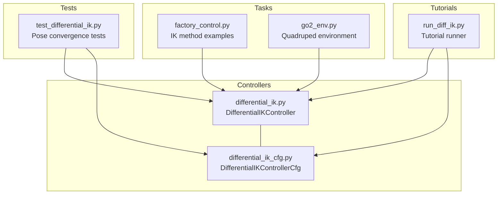
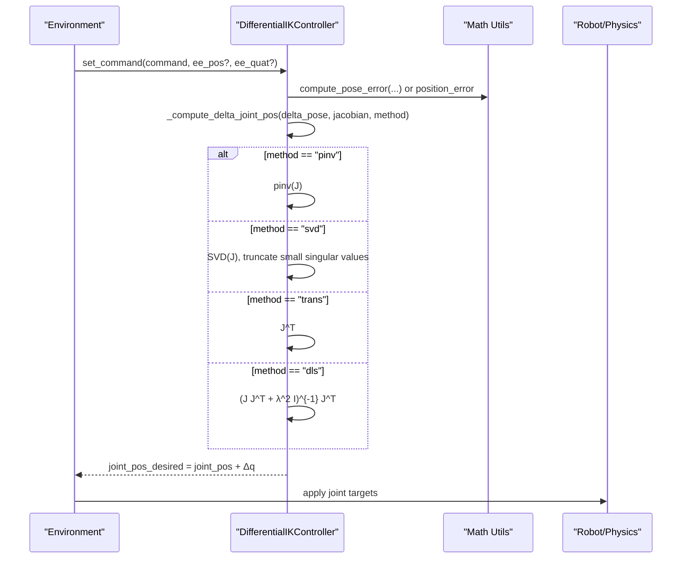
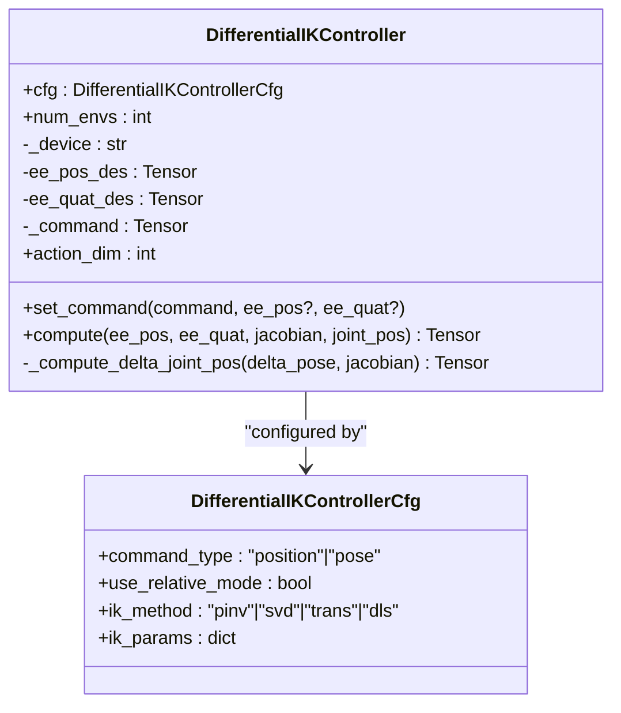
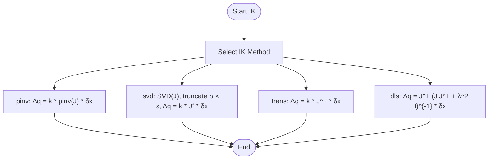
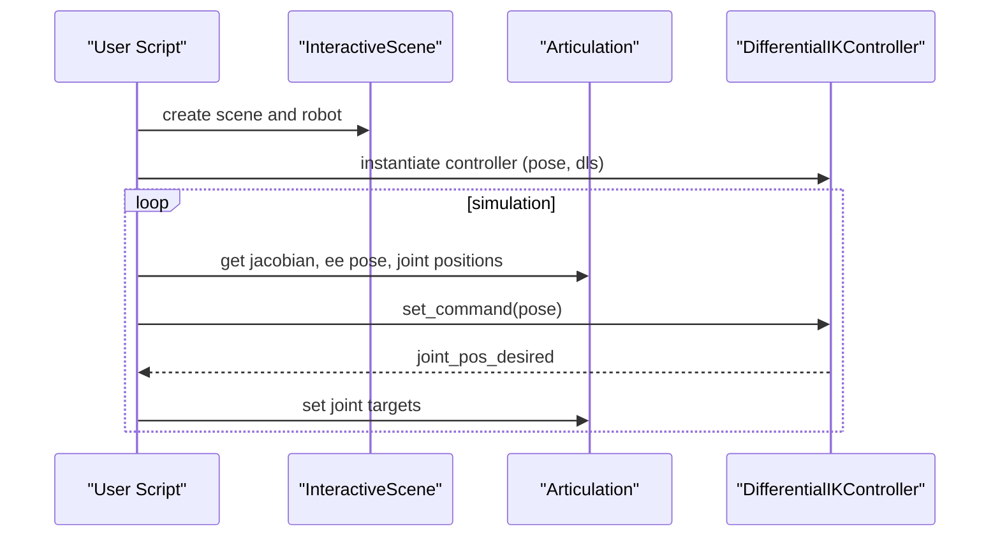
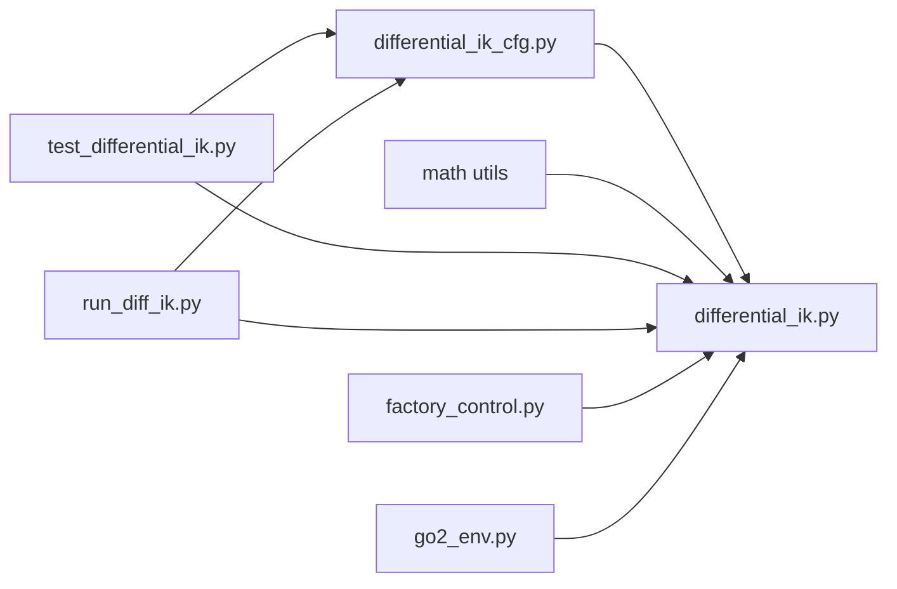

# Differential Inverse Kinematics Control

<cite>
**Referenced Files in This Document**
- [differential_ik.py](file://source/isaaclab/isaaclab/controllers/differential_ik.py)
- [differential_ik_cfg.py](file://source/isaaclab/isaaclab/controllers/differential_ik_cfg.py)
- [test_differential_ik.py](file://source/isaaclab/test/controllers/test_differential_ik.py)
- [run_diff_ik.py](file://scripts/tutorials/05_controllers/run_diff_ik.py)
- [factory_control.py](file://source/isaaclab_tasks/isaaclab_tasks/direct/automate/factory_control.py)
- [go2_env.py](file://source/isaaclab_tasks/isaaclab_tasks/direct/go2/go2_env.py)
</cite>

## Table of Contents
1. [Introduction](#introduction)
2. [Project Structure](#project-structure)
3. [Core Components](#core-components)
4. [Architecture Overview](#architecture-overview)
5. [Detailed Component Analysis](#detailed-component-analysis)
6. [Dependency Analysis](#dependency-analysis)
7. [Performance Considerations](#performance-considerations)
8. [Troubleshooting Guide](#troubleshooting-guide)
9. [Conclusion](#conclusion)
10. [Appendices](#appendices)

## Introduction
This document explains the Differential Inverse Kinematics (IK) control system used for end-effector positioning and foot placement in quadruped locomotion. It covers the mathematical foundation of differential IK using the Jacobian to map task-space pose errors to joint-space corrections, and documents the implementation of multiple IK solution methods: pseudo-inverse (pinv), adaptive SVD, Jacobian transpose, and damped least squares (DLS). It also describes command types (position, pose, relative mode), practical tuning guidelines, singularity handling, stability considerations, and selection criteria for real-time performance.

## Project Structure
The IK control system is implemented as a reusable controller with a configuration class and supporting utilities. Example usage appears in tutorials and task environments.

**Diagram sources**
- [differential_ik.py:17-240](file://source/isaaclab/isaaclab/controllers/differential_ik.py#L17-L240)
- [differential_ik_cfg.py:14-71](file://source/isaaclab/isaaclab/controllers/differential_ik_cfg.py#L14-L71)
- [test_differential_ik.py:87-231](file://source/isaaclab/test/controllers/test_differential_ik.py#L87-L231)
- [run_diff_ik.py:92-188](file://scripts/tutorials/05_controllers/run_diff_ik.py#L92-L188)
- [factory_control.py:150-185](file://source/isaaclab_tasks/isaaclab_tasks/direct/automate/factory_control.py#L150-L185)
- [go2_env.py:1-200](file://source/isaaclab_tasks/isaaclab_tasks/direct/go2/go2_env.py#L1-L200)

**Section sources**
- [differential_ik.py:17-240](file://source/isaaclab/isaaclab/controllers/differential_ik.py#L17-L240)
- [differential_ik_cfg.py:14-71](file://source/isaaclab/isaaclab/controllers/differential_ik_cfg.py#L14-L71)
- [test_differential_ik.py:87-231](file://source/isaaclab/test/controllers/test_differential_ik.py#L87-L231)
- [run_diff_ik.py:92-188](file://scripts/tutorials/05_controllers/run_diff_ik.py#L92-L188)
- [factory_control.py:150-185](file://source/isaaclab_tasks/isaaclab_tasks/direct/automate/factory_control.py#L150-L185)
- [go2_env.py:1-200](file://source/isaaclab_tasks/isaaclab_tasks/direct/go2/go2_env.py#L1-L200)

## Core Components
- DifferentialIKController: Implements differential IK with four supported methods for solving Δq from Δx via the Jacobian. Supports position-only or full pose commands, and absolute or relative modes.
- DifferentialIKControllerCfg: Configuration class defining command type, relative mode flag, IK method, and per-method parameters.

Key capabilities:
- Command types: position (3 DOF) and pose (6 DOF), with optional relative mode interpretation.
- IK methods:
  - pinv: Moore-Penrose pseudo-inverse with scaling.
  - svd: Adaptive SVD with singular value truncation threshold.
  - trans: Jacobian transpose with scaling.
  - dls: Damped least squares with damping coefficient.
- Robustness: Singularity handling via SVD truncation and damping.

**Section sources**
- [differential_ik.py:17-240](file://source/isaaclab/isaaclab/controllers/differential_ik.py#L17-L240)
- [differential_ik_cfg.py:14-71](file://source/isaaclab/isaaclab/controllers/differential_ik_cfg.py#L14-L71)

## Architecture Overview
The controller operates in a loop: receive task-space command, compute pose error, select IK method, compute Δq, and integrate into desired joint positions.

**Diagram sources**
- [differential_ik.py:98-174](file://source/isaaclab/isaaclab/controllers/differential_ik.py#L98-L174)
- [differential_ik.py:180-240](file://source/isaaclab/isaaclab/controllers/differential_ik.py#L180-L240)

## Detailed Component Analysis

### DifferentialIKController
- Purpose: Convert task-space commands into joint-space targets using differential IK.
- Action dimension: 3 (position), 6 (pose in relative mode), or 7 (absolute pose quaternion).
- Methods:
  - pinv: Uses torch.linalg.pinv on the Jacobian.
  - svd: Performs SVD, suppresses small singular values, reconstructs pseudoinverse.
  - trans: Uses the transpose of the Jacobian.
  - dls: Adds damping to J J^T before inversion.
- Pose handling:
  - Position-only commands require orientation for display/initialization.
  - Pose commands use axis-angle rotation error.
- Relative mode:
  - Position relative: adds command to current position.
  - Pose relative: applies delta pose to current pose using frame transforms.

**Diagram sources**
- [differential_ik.py:17-240](file://source/isaaclab/isaaclab/controllers/differential_ik.py#L17-L240)
- [differential_ik_cfg.py:14-71](file://source/isaaclab/isaaclab/controllers/differential_ik_cfg.py#L14-L71)

**Section sources**
- [differential_ik.py:76-84](file://source/isaaclab/isaaclab/controllers/differential_ik.py#L76-L84)
- [differential_ik.py:98-147](file://source/isaaclab/isaaclab/controllers/differential_ik.py#L98-L147)
- [differential_ik.py:148-174](file://source/isaaclab/isaaclab/controllers/differential_ik.py#L148-L174)
- [differential_ik.py:180-240](file://source/isaaclab/isaaclab/controllers/differential_ik.py#L180-L240)
- [differential_ik_cfg.py:21-51](file://source/isaaclab/isaaclab/controllers/differential_ik_cfg.py#L21-L51)

### IK Solution Methods
- Pseudo-inverse (pinv)
  - Parameters: k_val (scaling).
  - Behavior: Applies scaling to the pseudoinverse of the Jacobian.
- Adaptive SVD
  - Parameters: k_val (scaling), min_singular_value (threshold).
  - Behavior: Truncates singular values below threshold to stabilize inversion near singularity.
- Jacobian transpose (trans)
  - Parameters: k_val (scaling).
  - Behavior: Uses the transpose of the Jacobian; often less accurate but computationally cheap.
- Damped Least Squares (DLS)
  - Parameters: lambda_val (damping coefficient).
  - Behavior: Adds damping to J J^T to regularize inversion and improve stability.

**Diagram sources**
- [differential_ik.py:197-238](file://source/isaaclab/isaaclab/controllers/differential_ik.py#L197-L238)
- [differential_ik_cfg.py:42-51](file://source/isaaclab/isaaclab/controllers/differential_ik_cfg.py#L42-L51)

**Section sources**
- [differential_ik.py:197-238](file://source/isaaclab/isaaclab/controllers/differential_ik.py#L197-L238)
- [differential_ik_cfg.py:42-51](file://source/isaaclab/isaaclab/controllers/differential_ik_cfg.py#L42-L51)

### Command Types and Modes
- Command types:
  - position: Controls end-effector position only (3 DOF). Orientation is still required for initialization/display.
  - pose: Controls full pose (position + orientation).
- Modes:
  - Absolute: command specifies target pose.
  - Relative: command specifies delta; for pose, delta is applied via frame transforms.

Practical implications:
- Relative mode is useful for walking gaits and foothold adjustments where incremental motions are preferred.
- Pose mode enables precise foot placement and body orientation control.

**Section sources**
- [differential_ik.py:79-84](file://source/isaaclab/isaaclab/controllers/differential_ik.py#L79-L84)
- [differential_ik.py:122-146](file://source/isaaclab/isaaclab/controllers/differential_ik.py#L122-L146)
- [differential_ik_cfg.py:21-33](file://source/isaaclab/isaaclab/controllers/differential_ik_cfg.py#L21-L33)

### Implementation Examples and Usage Patterns
- Tutorial runner: Demonstrates setting up the controller, obtaining Jacobians from the physics backend, transforming frames, and applying joint targets.
- Task environments: Show IK usage in quadruped locomotion contexts and factory automation tasks.

**Diagram sources**
- [run_diff_ik.py:98-188](file://scripts/tutorials/05_controllers/run_diff_ik.py#L98-L188)
- [test_differential_ik.py:122-231](file://source/isaaclab/test/controllers/test_differential_ik.py#L122-L231)

**Section sources**
- [run_diff_ik.py:98-188](file://scripts/tutorials/05_controllers/run_diff_ik.py#L98-L188)
- [test_differential_ik.py:122-231](file://source/isaaclab/test/controllers/test_differential_ik.py#L122-L231)

## Dependency Analysis
- Controller depends on:
  - Configuration class for method and parameters.
  - Math utilities for pose error computation and delta pose application.
- Tests depend on:
  - Physics-backed Jacobians and frame transforms.
  - Robot assets and simulation context.
- Tutorial demonstrates integration with the physics backend to fetch Jacobians and apply targets.

**Diagram sources**
- [differential_ik.py:11-14](file://source/isaaclab/isaaclab/controllers/differential_ik.py#L11-L14)
- [differential_ik_cfg.py:11-11](file://source/isaaclab/isaaclab/controllers/differential_ik_cfg.py#L11-L11)
- [test_differential_ik.py:24-32](file://source/isaaclab/test/controllers/test_differential_ik.py#L24-L32)
- [run_diff_ik.py:44-51](file://scripts/tutorials/05_controllers/run_diff_ik.py#L44-L51)
- [factory_control.py:150-185](file://source/isaaclab_tasks/isaaclab_tasks/direct/automate/factory_control.py#L150-L185)
- [go2_env.py:1-200](file://source/isaaclab_tasks/isaaclab_tasks/direct/go2/go2_env.py#L1-L200)

**Section sources**
- [differential_ik.py:11-14](file://source/isaaclab/isaaclab/controllers/differential_ik.py#L11-L14)
- [differential_ik_cfg.py:11-11](file://source/isaaclab/isaaclab/controllers/differential_ik_cfg.py#L11-L11)
- [test_differential_ik.py:24-32](file://source/isaaclab/test/controllers/test_differential_ik.py#L24-L32)
- [run_diff_ik.py:44-51](file://scripts/tutorials/05_controllers/run_diff_ik.py#L44-L51)
- [factory_control.py:150-185](file://source/isaaclab_tasks/isaaclab_tasks/direct/automate/factory_control.py#L150-L185)
- [go2_env.py:1-200](file://source/isaaclab_tasks/isaaclab_tasks/direct/go2/go2_env.py#L1-L200)

## Performance Considerations
- Computational cost:
  - pinv: Relatively inexpensive; depends on backend implementation.
  - svd: More expensive due to SVD decomposition; beneficial near singularities.
  - trans: Cheapest; suitable for coarse motions or real-time constraints.
  - dls: Moderate cost; good balance of stability and speed.
- Parameter tuning:
  - k_val: Scale Δq; too large causes overshoot; too small slows convergence.
  - min_singular_value: Trade-off between conditioning and accuracy near singularity.
  - lambda_val: Damping strength; higher values increase stability but reduce tracking fidelity.
- Real-time tips:
  - Prefer trans or pinv for very tight loops; switch to svd or dls when encountering near-singular configurations.
  - Cache and reuse transforms (e.g., base rotation matrices) to reduce overhead.
  - Keep batch sizes aligned with GPU/accelerator capabilities.

[No sources needed since this section provides general guidance]

## Troubleshooting Guide
Common issues and remedies:
- Unsupported method or missing parameters:
  - Ensure ik_method is one of the supported values and ik_params are provided or defaulted.
- Relative mode frame mismatches:
  - Verify that ee_pos and/or ee_quat are supplied when required by the command type.
- Convergence problems:
  - Increase k_val moderately; consider switching to svd or dls.
  - Check for numerical conditioning of the Jacobian; inspect singular values.
- Orientation handling:
  - For position-only commands, ensure a valid orientation is passed for initialization.
- Simulation synchronization:
  - After resets, skip the first control step to allow Jacobians to update.

**Section sources**
- [differential_ik_cfg.py:53-70](file://source/isaaclab/isaaclab/controllers/differential_ik_cfg.py#L53-L70)
- [differential_ik.py:114-118](file://source/isaaclab/isaaclab/controllers/differential_ik.py#L114-L118)
- [test_differential_ik.py:169-231](file://source/isaaclab/test/controllers/test_differential_ik.py#L169-L231)

## Conclusion
The Differential IK controller provides a flexible, numerically robust framework for end-effector and foot-placement control. By combining Jacobian-based differential IK with multiple solution strategies—pinv, adaptive SVD, transpose, and DLS—you can tailor accuracy, stability, and computational cost to your application. Proper configuration of command types and relative mode, along with thoughtful parameter tuning, ensures reliable performance across diverse terrains and tasks.

[No sources needed since this section summarizes without analyzing specific files]

## Appendices

### Practical Tuning Guidelines
- Position control:
  - Start with pinv and k_val around 1.0; increase cautiously.
  - Switch to svd if oscillations occur near singular postures.
- Pose control:
  - Use DLS with moderate lambda_val for stable tracking.
  - If drift persists, slightly increase damping or reduce k_val.
- Relative mode:
  - Keep command amplitudes small for stability; increase gradually during tuning.
- Quadruped foot placement:
  - Use pose mode for precise foot orientation; consider relative mode for incremental steps.
  - Monitor contact forces and adjust gains to prevent foot slippage.

[No sources needed since this section provides general guidance]

### Mathematical Foundations
- Differential IK:
  - Δq = J^† Δx, where J^† is the pseudoinverse of the geometric Jacobian.
  - Pose error is computed as position error plus axis-angle rotation error.
- Methods:
  - pinv: Direct pseudoinverse.
  - svd: Truncate small singular values to regularize inversion.
  - trans: Use J^T for approximate solution.
  - dls: Add damping to invert J J^T.

**Section sources**
- [differential_ik.py:18-30](file://source/isaaclab/isaaclab/controllers/differential_ik.py#L18-L30)
- [differential_ik.py:168-172](file://source/isaaclab/isaaclab/controllers/differential_ik.py#L168-L172)