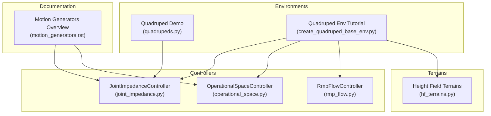
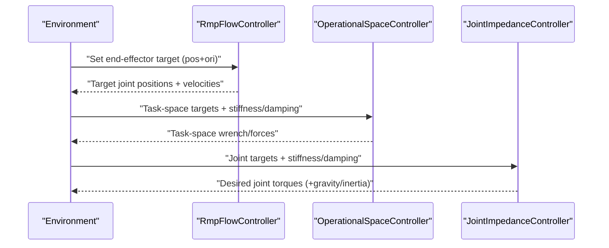
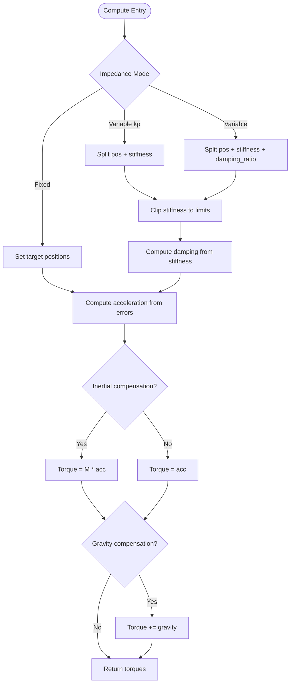
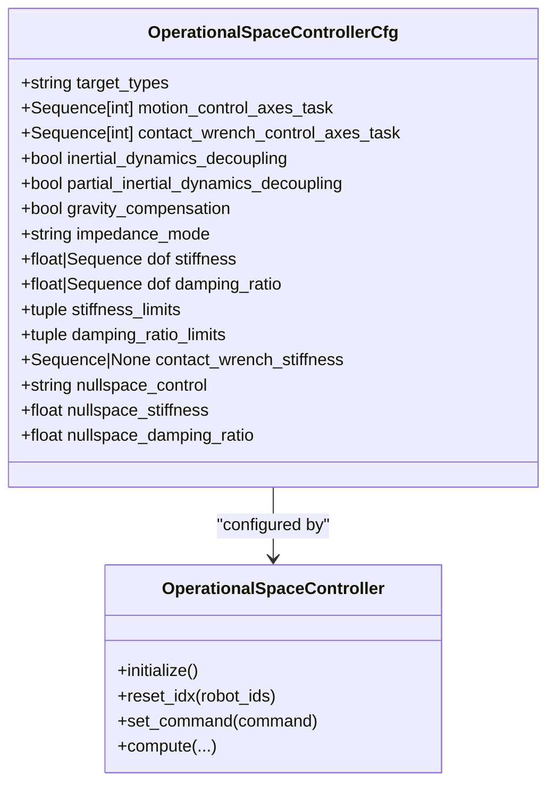
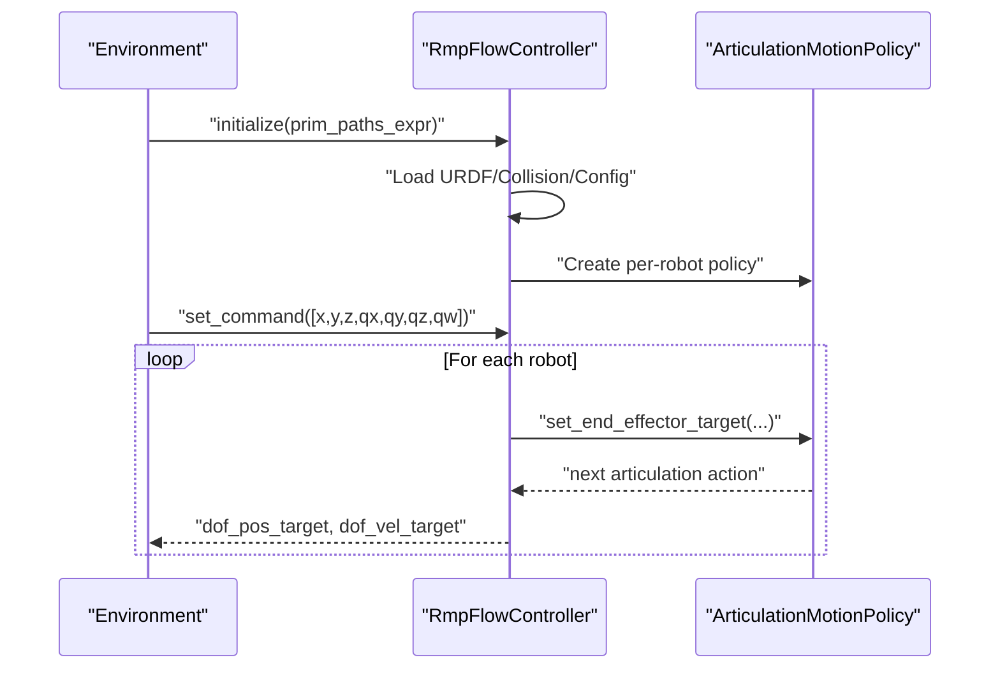
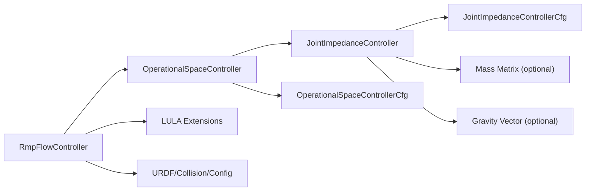

# Joint Impedance Control

<cite>
**Referenced Files in This Document**
- [joint_impedance.py](file://source/isaaclab/isaaclab/controllers/joint_impedance.py)
- [rmp_flow.py](file://source/isaaclab/isaaclab/controllers/rmp_flow.py)
- [motion_generators.rst](file://docs/source/overview/core-concepts/motion_generators.rst)
- [README.md](file://README.md)
- [quadrupeds.py](file://scripts/demos/quadrupeds.py)
- [create_quadruped_base_env.py](file://scripts/tutorials/03_envs/create_quadruped_base_env.py)
- [operational_space.py](file://source/isaaclab/isaaclab/controllers/operational_space.py)
- [operational_space_cfg.py](file://source/isaaclab/isaaclab/controllers/operational_space_cfg.py)
- [hf_terrains.py](file://source/isaaclab/isaaclab/terrains/height_field/hf_terrains.py)
</cite>

## Table of Contents
1. [Introduction](#introduction)
2. [Project Structure](#project-structure)
3. [Core Components](#core-components)
4. [Architecture Overview](#architecture-overview)
5. [Detailed Component Analysis](#detailed-component-analysis)
6. [Dependency Analysis](#dependency-analysis)
7. [Performance Considerations](#performance-considerations)
8. [Troubleshooting Guide](#troubleshooting-guide)
9. [Conclusion](#conclusion)
10. [Appendices](#appendices)

## Introduction
This document explains the Joint Impedance Control system used for dynamic stability and compliant interactions in quadruped locomotion. It covers the theoretical foundation of impedance control (stiffness, damping, and inertia), the implementation of joint-level controllers for load adaptation, impact absorption, and energy management, and the integration with the RMP (Riemannian Motion Policies) flow framework for dynamic movement planning. Practical guidance is provided for parameter tuning across terrains and speeds, scheduling strategies, real-time adaptation, and computational efficiency for multi-joint systems.

## Project Structure
The repository organizes controllers, motion generation, and environment demos under the Isaaclab package. The joint impedance controller resides in the controllers subpackage, alongside operational space control and RMP-Flow motion generation. Demos and tutorials illustrate quadruped environments and terrain configurations that benefit from compliant control.

**Diagram sources**
- [joint_impedance.py:1-230](file://source/isaaclab/isaaclab/controllers/joint_impedance.py#L1-L230)
- [operational_space.py:198-261](file://source/isaaclab/isaaclab/controllers/operational_space.py#L198-L261)
- [rmp_flow.py:1-157](file://source/isaaclab/isaaclab/controllers/rmp_flow.py#L1-L157)
- [quadrupeds.py:1-194](file://scripts/demos/quadrupeds.py#L1-L194)
- [create_quadruped_base_env.py:1-246](file://scripts/tutorials/03_envs/create_quadruped_base_env.py#L1-L246)
- [motion_generators.rst:99-129](file://docs/source/overview/core-concepts/motion_generators.rst#L99-L129)
- [hf_terrains.py:86-390](file://source/isaaclab/isaaclab/terrains/height_field/hf_terrains.py#L86-L390)

**Section sources**
- [joint_impedance.py:1-230](file://source/isaaclab/isaaclab/controllers/joint_impedance.py#L1-L230)
- [rmp_flow.py:1-157](file://source/isaaclab/isaaclab/controllers/rmp_flow.py#L1-L157)
- [operational_space.py:198-261](file://source/isaaclab/isaaclab/controllers/operational_space.py#L198-L261)
- [motion_generators.rst:99-129](file://docs/source/overview/core-concepts/motion_generators.rst#L99-L129)
- [quadrupeds.py:1-194](file://scripts/demos/quadrupeds.py#L1-L194)
- [create_quadruped_base_env.py:1-246](file://scripts/tutorials/03_envs/create_quadruped_base_env.py#L1-L246)
- [hf_terrains.py:86-390](file://source/isaaclab/isaaclab/terrains/height_field/hf_terrains.py#L86-L390)

## Core Components
- JointImpedanceController: Implements spring-damper-like control in joint space with optional inertial and gravity compensation. Supports fixed, variable stiffness, and variable impedance modes. Action dimension depends on mode and number of degrees of freedom.
- OperationalSpaceController: Provides task-space control with stiffness/damping scheduling and selection matrices for motion/contact control axes.
- RmpFlowController: Integrates LULA’s RMP-Flow motion policies for dynamic collision avoidance and trajectory generation in task space, returning target joint positions and velocities.

Key capabilities:
- Compliant joint control via stiffness and damping scheduling
- Inertial compensation (inverse dynamics) and gravity bias
- Task-space motion generation with RMP-Flow for dynamic movement planning
- Batched environments and multi-robot support

**Section sources**
- [joint_impedance.py:13-56](file://source/isaaclab/isaaclab/controllers/joint_impedance.py#L13-L56)
- [joint_impedance.py:59-230](file://source/isaaclab/isaaclab/controllers/joint_impedance.py#L59-L230)
- [operational_space.py:198-261](file://source/isaaclab/isaaclab/controllers/operational_space.py#L198-L261)
- [operational_space_cfg.py:14-91](file://source/isaaclab/isaaclab/controllers/operational_space_cfg.py#L14-L91)
- [rmp_flow.py:25-75](file://source/isaaclab/isaaclab/controllers/rmp_flow.py#L25-L75)
- [rmp_flow.py:74-157](file://source/isaaclab/isaaclab/controllers/rmp_flow.py#L74-L157)

## Architecture Overview
The system couples motion generation with joint-level compliance:
- RMP-Flow computes desired end-effector trajectories and returns target joint positions and velocities.
- JointImpedanceController translates these targets into torque commands using stiffness/damping scheduling and optional inertial/gravity compensation.
- OperationalSpaceController complements task-space motion control with stiffness/damping scheduling and selection matrices.

**Diagram sources**
- [rmp_flow.py:129-157](file://source/isaaclab/isaaclab/controllers/rmp_flow.py#L129-L157)
- [operational_space.py:198-261](file://source/isaaclab/isaaclab/controllers/operational_space.py#L198-L261)
- [joint_impedance.py:183-230](file://source/isaaclab/isaaclab/controllers/joint_impedance.py#L183-L230)

## Detailed Component Analysis

### Joint Impedance Controller
The controller implements a decoupled spring-mass-damper model in joint space with optional inverse dynamics compensation. It supports three impedance modes:
- Fixed: stiffness and damping are constant; action space equals DOF.
- Variable stiffness (kp): action includes desired joint positions plus stiffness; damping is computed as critically damped from stiffness.
- Variable impedance: action includes desired joint positions, stiffness, and damping ratio; damping is computed accordingly.

Processing logic:
- Command parsing resolves action dimension based on mode.
- Desired joint positions are clipped to joint limits; velocity error is negated for damping.
- Acceleration is computed from position and velocity errors using stiffness and damping gains.
- Torques are produced either as acceleration commands (no inertia) or via inverse dynamics (with inertia matrix).
- Gravity compensation adds the gravity vector to the torque command.

**Diagram sources**
- [joint_impedance.py:145-181](file://source/isaaclab/isaaclab/controllers/joint_impedance.py#L145-L181)
- [joint_impedance.py:183-230](file://source/isaaclab/isaaclab/controllers/joint_impedance.py#L183-L230)

**Section sources**
- [joint_impedance.py:13-56](file://source/isaaclab/isaaclab/controllers/joint_impedance.py#L13-L56)
- [joint_impedance.py:59-230](file://source/isaaclab/isaaclab/controllers/joint_impedance.py#L59-L230)
- [motion_generators.rst:99-129](file://docs/source/overview/core-concepts/motion_generators.rst#L99-L129)

### Operational Space Controller (for context)
While task-space control is not the focus, it complements joint impedance by providing stiffness/damping scheduling and selection matrices for motion and contact directions. It supports similar impedance modes and integrates with selection matrices to define controlled directions.

**Diagram sources**
- [operational_space_cfg.py:14-91](file://source/isaaclab/isaaclab/controllers/operational_space_cfg.py#L14-L91)
- [operational_space.py:198-261](file://source/isaaclab/isaaclab/controllers/operational_space.py#L198-L261)

**Section sources**
- [operational_space_cfg.py:14-91](file://source/isaaclab/isaaclab/controllers/operational_space_cfg.py#L14-L91)
- [operational_space.py:198-261](file://source/isaaclab/isaaclab/controllers/operational_space.py#L198-L261)

### RMP-Flow Controller (Dynamic Movement Planning)
RMP-Flow generates dynamic collision-avoiding trajectories in task space and returns target joint positions and velocities. It wraps LULA’s RMPFlow policies and supports batched environments.

**Diagram sources**
- [rmp_flow.py:74-157](file://source/isaaclab/isaaclab/controllers/rmp_flow.py#L74-L157)

**Section sources**
- [rmp_flow.py:25-75](file://source/isaaclab/isaaclab/controllers/rmp_flow.py#L25-L75)
- [rmp_flow.py:74-157](file://source/isaaclab/isaaclab/controllers/rmp_flow.py#L74-L157)
- [motion_generators.rst:212-216](file://docs/source/overview/core-concepts/motion_generators.rst#L212-L216)

## Dependency Analysis
- JointImpedanceController depends on:
  - Configuration for stiffness, damping ratio, and limits
  - Optional mass matrix and gravity vectors for inverse dynamics
  - Joint position/velocity measurements
- OperationalSpaceController complements task-space motion control with stiffness/damping scheduling and selection matrices.
- RmpFlowController depends on LULA extensions and URDF/collision models; it returns target joint positions and velocities consumed by joint impedance control.

**Diagram sources**
- [joint_impedance.py:66-111](file://source/isaaclab/isaaclab/controllers/joint_impedance.py#L66-L111)
- [operational_space.py:198-261](file://source/isaaclab/isaaclab/controllers/operational_space.py#L198-L261)
- [rmp_flow.py:14-21](file://source/isaaclab/isaaclab/controllers/rmp_flow.py#L14-L21)
- [rmp_flow.py:74-109](file://source/isaaclab/isaaclab/controllers/rmp_flow.py#L74-L109)

**Section sources**
- [joint_impedance.py:66-111](file://source/isaaclab/isaaclab/controllers/joint_impedance.py#L66-L111)
- [operational_space.py:198-261](file://source/isaaclab/isaaclab/controllers/operational_space.py#L198-L261)
- [rmp_flow.py:14-21](file://source/isaaclab/isaaclab/controllers/rmp_flow.py#L14-L21)
- [rmp_flow.py:74-109](file://source/isaaclab/isaaclab/controllers/rmp_flow.py#L74-L109)

## Performance Considerations
- Prefer variable stiffness mode for real-time adaptation to terrain and loading conditions to reduce command dimension compared to full variable impedance.
- Use inertial compensation judiciously; it increases computational cost but improves accuracy on stiff or heavy payloads.
- Limit action dimensions by selecting appropriate impedance mode and avoiding unnecessary gains scheduling.
- Batch processing with RMP-Flow reduces overhead for multi-robot scenarios.
- Terrain complexity impacts control frequency; ensure simulation timestep and control decimation align with performance targets.

[No sources needed since this section provides general guidance]

## Troubleshooting Guide
Common issues and remedies:
- Invalid command shapes: Ensure action dimensions match the configured impedance mode and DOF count.
- Excessive oscillations: Increase damping ratio or reduce stiffness; verify joint limits are not overly restrictive.
- Instability with payload: Enable inertial compensation and gravity compensation; tune damping ratio to achieve critical or near-critical damping.
- RMP-Flow target misalignment: Verify URDF and collision files; confirm frame name matches the end-effector link.
- Numerical drift: Periodically reset RMP policies when encountering persistent drift.

**Section sources**
- [joint_impedance.py:152-156](file://source/isaaclab/isaaclab/controllers/joint_impedance.py#L152-L156)
- [joint_impedance.py:180-181](file://source/isaaclab/isaaclab/controllers/joint_impedance.py#L180-L181)
- [rmp_flow.py:120-128](file://source/isaaclab/isaaclab/controllers/rmp_flow.py#L120-L128)

## Conclusion
The Joint Impedance Control system provides a flexible, compliant interface for quadruped locomotion, enabling load adaptation, impact absorption, and energy management. Combined with RMP-Flow for dynamic movement planning, it achieves stable and adaptive locomotion across challenging terrains. Proper parameter scheduling, real-time adaptation, and computational efficiency are key to robust performance in parkour-like scenarios.

[No sources needed since this section summarizes without analyzing specific files]

## Appendices

### Practical Parameter Tuning Examples
- Low-compliance (rigid contact):
  - Stiffness: moderate to high
  - Damping ratio: near critical (around 1.0)
  - Modes: fixed or variable stiffness
- High-compliance (soft contact/obstacle negotiation):
  - Stiffness: low to moderate
  - Damping ratio: moderate (0.5–0.8)
  - Modes: variable stiffness or variable impedance
- Heavy payload:
  - Enable inertial compensation
  - Increase damping ratio slightly above critical
  - Verify gravity compensation is active
- Rough terrain:
  - Reduce stiffness on initial contact; ramp up after stabilization
  - Use variable stiffness to adapt to ground irregularities
- High-speed running:
  - Slightly higher damping ratio to suppress oscillations
  - Consider smoother stiffness transitions

[No sources needed since this section provides general guidance]

### Relationship to System Stability in Parkour Scenarios
- Stiffness governs energy storage and rebound; too high causes bouncing and chatter; too low reduces terrain adaptation.
- Damping governs energy dissipation; insufficient damping leads to oscillations; excessive damping increases settling time.
- Inertial compensation improves tracking accuracy under varying loads; gravity compensation stabilizes stance phases.
- RMP-Flow complements joint impedance by providing dynamic collision avoidance and smooth trajectory updates, reducing high-stress impacts.

**Section sources**
- [motion_generators.rst:99-129](file://docs/source/overview/core-concepts/motion_generators.rst#L99-L129)
- [README.md:62-108](file://README.md#L62-L108)

### Integration with Environments and Terrains
- Quadruped demo and environment tutorial demonstrate multi-robot spawning and sensor configurations suitable for evaluating impedance control.
- Height-field terrains provide diverse challenges (stepping stones, gaps, stairs, debris) ideal for testing impedance parameter scheduling and adaptation.

**Section sources**
- [quadrupeds.py:66-124](file://scripts/demos/quadrupeds.py#L66-L124)
- [create_quadruped_base_env.py:82-119](file://scripts/tutorials/03_envs/create_quadruped_base_env.py#L82-L119)
- [hf_terrains.py:356-390](file://source/isaaclab/isaaclab/terrains/height_field/hf_terrains.py#L356-L390)