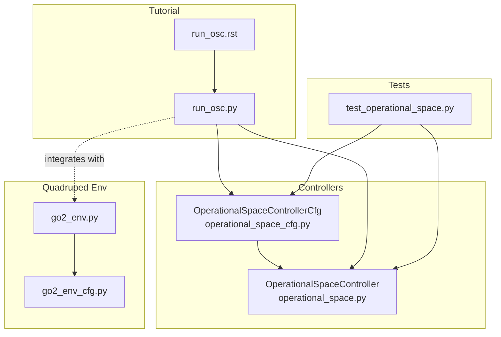
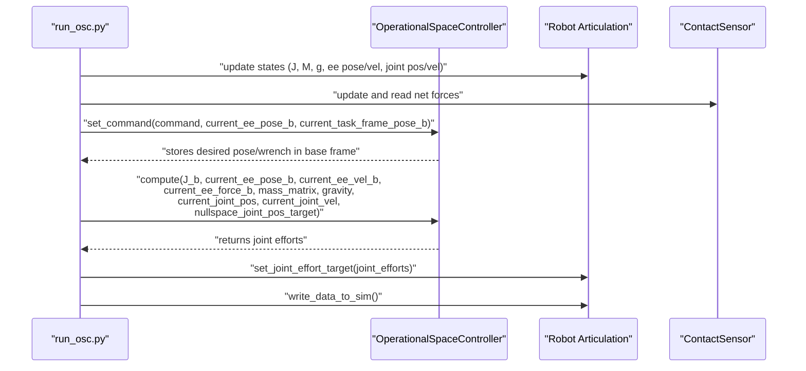
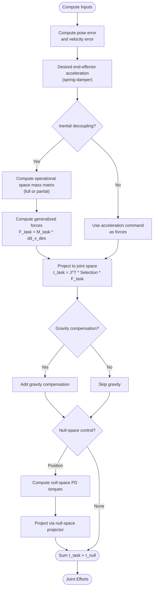
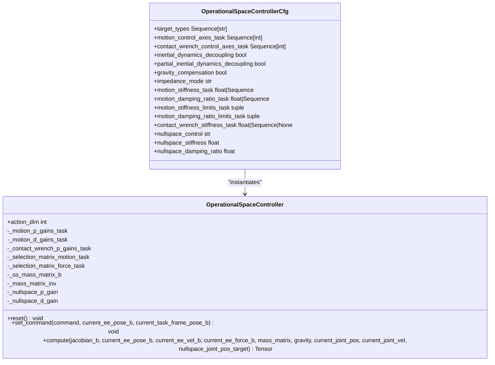
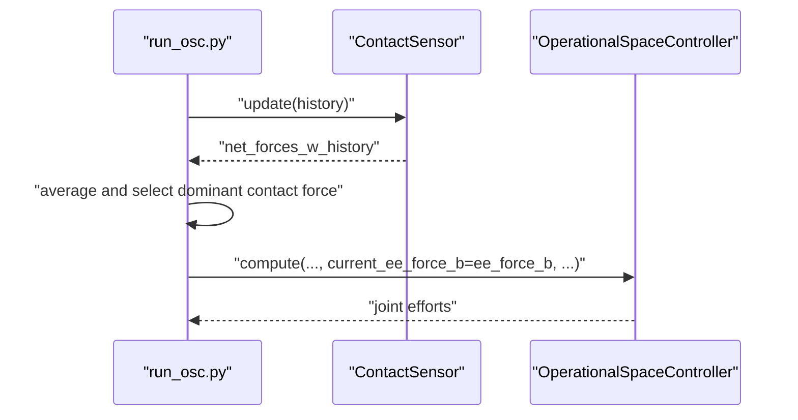
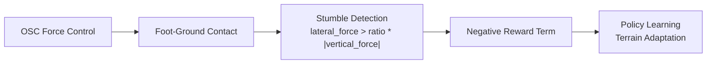
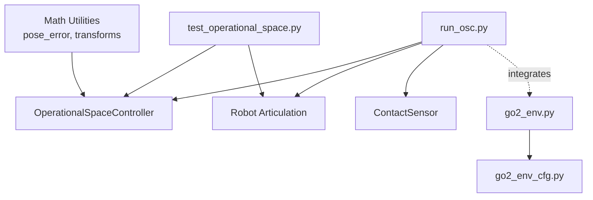

# Operational Space Control

<cite>
**Referenced Files in This Document**
- [operational_space.py](file://source/isaaclab/isaaclab/controllers/operational_space.py)
- [operational_space_cfg.py](file://source/isaaclab/isaaclab/controllers/operational_space_cfg.py)
- [run_osc.py](file://scripts/tutorials/05_controllers/run_osc.py)
- [run_osc.rst](file://docs/source/tutorials/05_controllers/run_osc.rst)
- [test_operational_space.py](file://source/isaaclab/test/controllers/test_operational_space.py)
- [go2_env.py](file://source/isaaclab_tasks/isaaclab_tasks/direct/go2/go2_env.py)
- [go2_env_cfg.py](file://source/isaaclab_tasks/isaaclab_tasks/direct/go2/go2_env_cfg.py)
</cite>

## Table of Contents
1. [Introduction](#introduction)
2. [Project Structure](#project-structure)
3. [Core Components](#core-components)
4. [Architecture Overview](#architecture-overview)
5. [Detailed Component Analysis](#detailed-component-analysis)
6. [Dependency Analysis](#dependency-analysis)
7. [Performance Considerations](#performance-considerations)
8. [Troubleshooting Guide](#troubleshooting-guide)
9. [Conclusion](#conclusion)
10. [Appendices](#appendices)

## Introduction
This document explains the Operational Space Control (OSC) system used for compliant interactions and force control in quadruped locomotion. It covers the operational space formulation for task-space control, including the mathematical background of Jacobian pseudoinverse methods and null-space projections. It documents the implementation of operational space controllers for foot-ground interaction, including stiffness and damping parameters, and details the integration with contact detection and force regulation systems. Practical examples demonstrate OSC parameter tuning for different terrain conditions, compliance characteristics, and load-bearing scenarios. The document also explains the relationship between operational space control and terrain adaptation, particularly in parkour-style movements, and provides guidance on stability analysis, parameter scheduling for varying terrains, and optimization strategies for computational efficiency in real-time control loops.

## Project Structure
The OSC implementation resides in the controllers module and is demonstrated via a tutorial script that integrates with the simulation environment. Tests exercise various configurations, including hybrid pose-force control and null-space control. The quadruped locomotion environment integrates contact sensing and reward shaping that complements OSC-based compliance.

**Diagram sources**
- [operational_space.py:23-549](file://source/isaaclab/isaaclab/controllers/operational_space.py#L23-L549)
- [operational_space_cfg.py:14-91](file://source/isaaclab/isaaclab/controllers/operational_space_cfg.py#L14-L91)
- [run_osc.py:1-485](file://scripts/tutorials/05_controllers/run_osc.py#L1-L485)
- [run_osc.rst:1-192](file://docs/source/tutorials/05_controllers/run_osc.rst#L1-L192)
- [test_operational_space.py:1-200](file://source/isaaclab/test/controllers/test_operational_space.py#L1-L200)
- [go2_env.py:1-200](file://source/isaaclab_tasks/isaaclab_tasks/direct/go2/go2_env.py#L1-L200)
- [go2_env_cfg.py:279-297](file://source/isaaclab_tasks/isaaclab_tasks/direct/go2/go2_env_cfg.py#L279-L297)

**Section sources**
- [operational_space.py:23-549](file://source/isaaclab/isaaclab/controllers/operational_space.py#L23-L549)
- [operational_space_cfg.py:14-91](file://source/isaaclab/isaaclab/controllers/operational_space_cfg.py#L14-L91)
- [run_osc.py:1-485](file://scripts/tutorials/05_controllers/run_osc.py#L1-L485)
- [run_osc.rst:1-192](file://docs/source/tutorials/05_controllers/run_osc.rst#L1-L192)
- [test_operational_space.py:1-200](file://source/isaaclab/test/controllers/test_operational_space.py#L1-L200)
- [go2_env.py:1-200](file://source/isaaclab_tasks/isaaclab_tasks/direct/go2/go2_env.py#L1-L200)
- [go2_env_cfg.py:279-297](file://source/isaaclab_tasks/isaaclab_tasks/direct/go2/go2_env_cfg.py#L279-L297)

## Core Components
- OperationalSpaceController: Implements task-space motion control, closed-/open-loop force control, inertial dynamics decoupling, gravity compensation, and null-space control. It supports multiple target types (absolute/relative pose, absolute wrench), configurable control axes per DOF, and variable impedance modes.
- OperationalSpaceControllerCfg: Configuration class defining target types, motion/force control axes, inertial decoupling options, gravity compensation, impedance modes, stiffness/damping parameters, and null-space control settings.

Key capabilities:
- Task-space motion control with spring-damper dynamics and selection matrices for axes.
- Closed-loop contact force control using measured forces (linear component) and feedforward wrench targets.
- Inertial dynamics decoupling via operational space mass matrix; partial decoupling option.
- Null-space PD control for redundant manipulators; dynamically consistent pseudo-inverse for decoupled null/task projection.
- Batched PyTorch computation supporting multiple environments.

**Section sources**
- [operational_space.py:23-549](file://source/isaaclab/isaaclab/controllers/operational_space.py#L23-L549)
- [operational_space_cfg.py:14-91](file://source/isaaclab/isaaclab/controllers/operational_space_cfg.py#L14-L91)

## Architecture Overview
The OSC pipeline separates command setting and computation:
- Command setting: Accepts concatenated task-space targets and optional impedance parameters; transforms targets to the task frame; builds selection matrices and stiffness/damping gains; stores desired end-effector pose and wrench in the base frame.
- Computation: Computes joint efforts from Jacobian, mass matrix, and kinematic/dynamic quantities; applies motion control forces, contact wrench commands, gravity compensation, and null-space torques; returns effort commands.

**Diagram sources**
- [run_osc.py:108-278](file://scripts/tutorials/05_controllers/run_osc.py#L108-L278)
- [operational_space.py:345-548](file://source/isaaclab/isaaclab/controllers/operational_space.py#L345-L548)

**Section sources**
- [run_osc.py:108-278](file://scripts/tutorials/05_controllers/run_osc.py#L108-L278)
- [operational_space.py:345-548](file://source/isaaclab/isaaclab/controllers/operational_space.py#L345-L548)

## Detailed Component Analysis

### Mathematical Background and Formulation
- Operational space motion control: The controller computes desired end-effector accelerations from pose and velocity errors, then projects them into joint space using the Jacobian transpose and selection matrices. Inertial decoupling replaces acceleration command with generalized forces via the operational space mass matrix.
- Force control: Closed-loop control uses measured contact force (linear component) and desired wrench targets; open-loop control applies desired wrench directly.
- Null-space control: Uses pseudo-inverse of the Jacobian and null-space projector to apply PD torques in the uncontrolled degrees of freedom; dynamically consistent pseudo-inverse enables decoupled task/null-space acceleration.

**Diagram sources**
- [operational_space.py:408-548](file://source/isaaclab/isaaclab/controllers/operational_space.py#L408-L548)

**Section sources**
- [operational_space.py:408-548](file://source/isaaclab/isaaclab/controllers/operational_space.py#L408-L548)

### Implementation Details: OperationalSpaceController
- Initialization:
  - Resolves target dimensions from configuration.
  - Builds selection matrices for motion and force axes in task frame and transforms them to base frame.
  - Sets motion stiffness and damping gains; computes damping gains from stiffness and damping ratios.
  - Initializes buffers for operational space mass matrix, inverse mass matrix placeholder, and contact wrench feedback.
  - Configures null-space stiffness and damping gains.
- Command setting:
  - Validates action dimension based on impedance mode.
  - Splits command into targets and optional impedance parameters; clips stiffness/damping when applicable.
  - Transforms targets to task frame (relative pose requires current end-effector pose).
  - Rotates gains and selection matrices from task to base frame.
  - Converts desired pose and wrench to base frame.
- Computation:
  - Motion control: computes pose/velocity errors, desired accelerations, and forces; optionally decouples inertial effects; projects to joint space.
  - Force control: applies closed-loop or open-loop wrench command using measured force.
  - Gravity compensation: adds gravity vector if enabled.
  - Null-space control: computes pseudo-inverse and null-space projector; applies PD torques; supports mass-matrix-aware projection when available.

**Diagram sources**
- [operational_space.py:23-549](file://source/isaaclab/isaaclab/controllers/operational_space.py#L23-L549)
- [operational_space_cfg.py:14-91](file://source/isaaclab/isaaclab/controllers/operational_space_cfg.py#L14-L91)

**Section sources**
- [operational_space.py:34-141](file://source/isaaclab/isaaclab/controllers/operational_space.py#L34-L141)
- [operational_space.py:173-344](file://source/isaaclab/isaaclab/controllers/operational_space.py#L173-L344)
- [operational_space.py:345-548](file://source/isaaclab/isaaclab/controllers/operational_space.py#L345-L548)
- [operational_space_cfg.py:14-91](file://source/isaaclab/isaaclab/controllers/operational_space_cfg.py#L14-L91)

### Integration with Contact Detection and Force Regulation
- Tutorial script demonstrates closed-loop force control by reading contact sensor data and feeding measured normal force into the controller’s wrench command computation.
- The controller applies only the linear component of the contact wrench in feedback; rotational components remain open-loop.
- The tutorial uses a task frame aligned with a tilted wall to isolate force control along the wall-normal direction.

**Diagram sources**
- [run_osc.py:343-369](file://scripts/tutorials/05_controllers/run_osc.py#L343-L369)
- [run_osc.py:250-261](file://scripts/tutorials/05_controllers/run_osc.py#L250-L261)
- [operational_space.py:454-476](file://source/isaaclab/isaaclab/controllers/operational_space.py#L454-L476)

**Section sources**
- [run_osc.py:343-369](file://scripts/tutorials/05_controllers/run_osc.py#L343-L369)
- [operational_space.py:454-476](file://source/isaaclab/isaaclab/controllers/operational_space.py#L454-L476)

### Practical Parameter Tuning Examples
- Fixed impedance with gravity compensation and inertial decoupling for pose-only tracking.
- Variable stiffness (kp) with critical damping ratio for adaptive compliance.
- Hybrid pose-force control with closed-loop normal force regulation.
- Null-space position control to stabilize redundant joints during contact tasks.

These examples are exercised in tests and the tutorial script.

**Section sources**
- [test_operational_space.py:309-405](file://source/isaaclab/test/controllers/test_operational_space.py#L309-L405)
- [test_operational_space.py:769-804](file://source/isaaclab/test/controllers/test_operational_space.py#L769-L804)
- [test_operational_space.py:968-994](file://source/isaaclab/test/controllers/test_operational_space.py#L968-L994)
- [test_operational_space.py:997-1220](file://source/isaaclab/test/controllers/test_operational_space.py#L997-L1220)
- [run_osc.py:127-172](file://scripts/tutorials/05_controllers/run_osc.py#L127-L172)

### Relationship to Terrain Adaptation and Parkour Movements
- Quadruped environment rewards emphasize air time, hip position deviations, and foot stumble detection, aligning with compliant contact interactions.
- Foot stumble reward uses normalized lateral force against vertical support to discourage sliding; this complements OSC’s force control to maintain stable foot-ground contact.
- Terrain adaptation benefits from OSC’s ability to regulate normal force and adjust compliance in real time, enabling parkour-style maneuvers such as precise footholds and controlled impacts.

**Diagram sources**
- [go2_env.py:433-436](file://source/isaaclab_tasks/isaaclab_tasks/direct/go2/go2_env.py#L433-L436)
- [go2_env_cfg.py:295-296](file://source/isaaclab_tasks/isaaclab_tasks/direct/go2/go2_env_cfg.py#L295-L296)

**Section sources**
- [go2_env.py:419-437](file://source/isaaclab_tasks/isaaclab_tasks/direct/go2/go2_env.py#L419-L437)
- [go2_env_cfg.py:279-297](file://source/isaaclab_tasks/isaaclab_tasks/direct/go2/go2_env_cfg.py#L279-L297)

## Dependency Analysis
- Controller depends on math utilities for pose transforms, rotations, and pose errors.
- Tutorial script orchestrates robot state extraction, contact sensor updates, and OSC command computation.
- Tests instantiate robots, configure OSC, and run simulations to validate controller behavior under various settings.

**Diagram sources**
- [operational_space.py:11-17](file://source/isaaclab/isaaclab/controllers/operational_space.py#L11-L17)
- [run_osc.py:108-278](file://scripts/tutorials/05_controllers/run_osc.py#L108-L278)
- [test_operational_space.py:1-200](file://source/isaaclab/test/controllers/test_operational_space.py#L1-L200)
- [go2_env.py:1-200](file://source/isaaclab_tasks/isaaclab_tasks/direct/go2/go2_env.py#L1-L200)
- [go2_env_cfg.py:279-297](file://source/isaaclab_tasks/isaaclab_tasks/direct/go2/go2_env_cfg.py#L279-L297)

**Section sources**
- [operational_space.py:11-17](file://source/isaaclab/isaaclab/controllers/operational_space.py#L11-L17)
- [run_osc.py:108-278](file://scripts/tutorials/05_controllers/run_osc.py#L108-L278)
- [test_operational_space.py:1-200](file://source/isaaclab/test/controllers/test_operational_space.py#L1-L200)
- [go2_env.py:1-200](file://source/isaaclab_tasks/isaaclab_tasks/direct/go2/go2_env.py#L1-L200)
- [go2_env_cfg.py:279-297](file://source/isaaclab_tasks/isaaclab_tasks/direct/go2/go2_env_cfg.py#L279-L297)

## Performance Considerations
- Batched computation: The controller operates on batches of environments, enabling efficient vectorized operations across multiple robots.
- Inertial decoupling: Full decoupling improves accuracy for aggressive motions but increases cost; partial decoupling reduces coupling between translation and rotation while keeping costs lower.
- Pseudo-inverse choice: Using the dynamically consistent pseudo-inverse enables decoupled null/task control and can improve stability; otherwise, the Moore-Penrose pseudo-inverse is used.
- Null-space projection: Computing the null-space projector and projecting torques adds computational overhead; disable when not needed.
- Contact force computation: Closed-loop force control uses measured forces; ensure sensor update periods and averaging windows are tuned for responsiveness and noise reduction.

[No sources needed since this section provides general guidance]

## Troubleshooting Guide
Common issues and resolutions:
- Invalid command shape or impedance mode: Ensure the command tensor matches the computed action dimension and that the impedance mode is supported.
- Missing inputs for motion control or force control: Provide end-effector pose/velocity for motion control and current contact force for closed-loop force control.
- Null-space control for non-redundant systems: Null-space control requires more than six degrees of freedom; otherwise, an error is raised.
- Dynamically consistent pseudo-inverse requirements: When using full inertial decoupling, ensure mass matrix and its inverse are provided.
- Dimension mismatch for null-space targets: The target joint positions must match the current joint positions.

**Section sources**
- [operational_space.py:210-256](file://source/isaaclab/isaaclab/controllers/operational_space.py#L210-L256)
- [operational_space.py:406-407](file://source/isaaclab/isaaclab/controllers/operational_space.py#L406-L407)
- [operational_space.py:459-460](file://source/isaaclab/isaaclab/controllers/operational_space.py#L459-L460)
- [operational_space.py:496-499](file://source/isaaclab/isaaclab/controllers/operational_space.py#L496-L499)
- [operational_space.py:513-525](file://source/isaaclab/isaaclab/controllers/operational_space.py#L513-L525)

## Conclusion
The Operational Space Control implementation provides a flexible, batched framework for task-space motion and force control, with inertial decoupling, closed-loop force regulation, and null-space stabilization. It integrates seamlessly with simulation environments and contact sensors, enabling compliant interactions essential for quadruped locomotion and parkour-style maneuvers. Proper parameter scheduling and decoupling choices are crucial for stability and performance across varied terrains.

[No sources needed since this section summarizes without analyzing specific files]

## Appendices

### Configuration Options Summary
- Target types: pose_abs/pose_rel/wrench_abs combinations.
- Axes control: motion_control_axes_task and contact_wrench_control_axes_task per DOF.
- Impedance modes: fixed, variable_kp (stiffness), variable (stiffness + damping).
- Inertial decoupling: full or partial.
- Gravity compensation: enable/disable.
- Null-space control: none/position.

**Section sources**
- [operational_space_cfg.py:21-91](file://source/isaaclab/isaaclab/controllers/operational_space_cfg.py#L21-L91)
- [run_osc.rst:38-108](file://docs/source/tutorials/05_controllers/run_osc.rst#L38-L108)