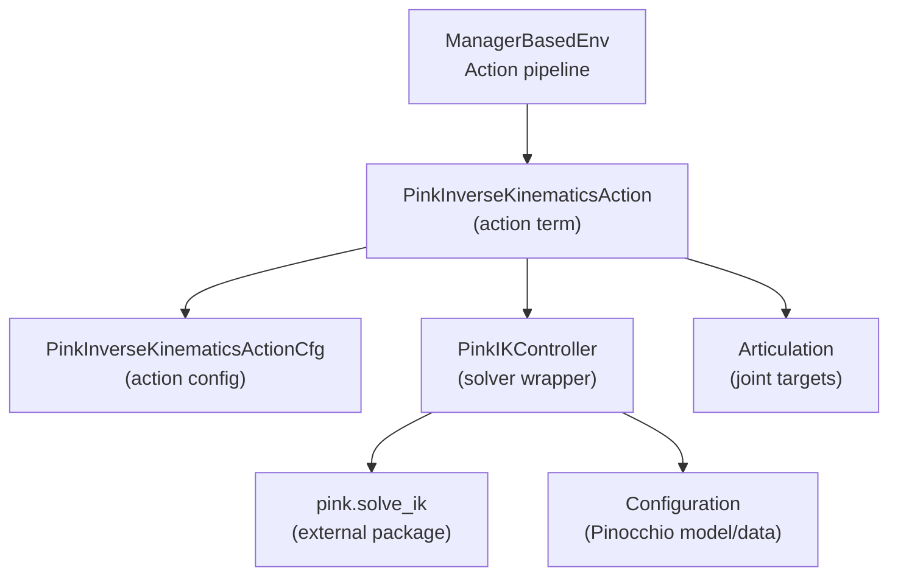
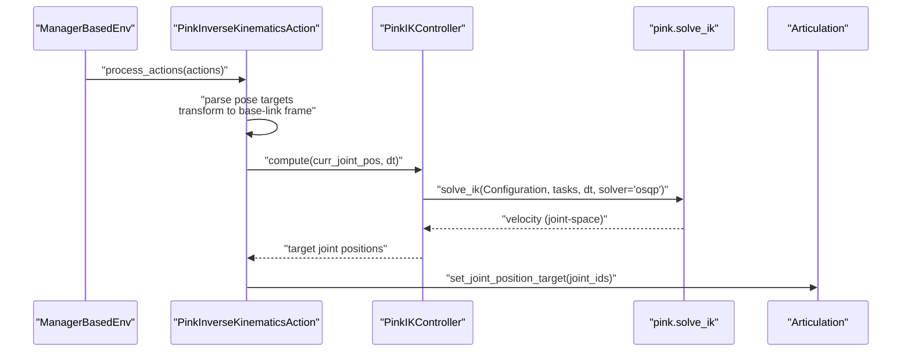
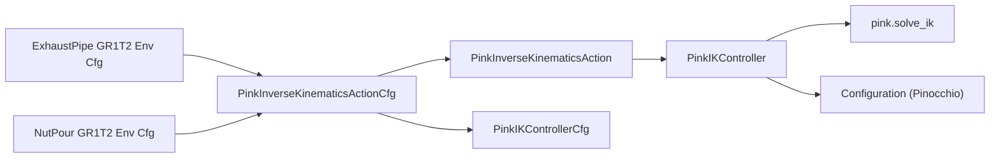

# Pink Inverse Kinematics Control

<cite>
**Referenced Files in This Document**
- [pink_ik.py](file://source/isaaclab/isaaclab/controllers/pink_ik.py)
- [pink_ik_cfg.py](file://source/isaaclab/isaaclab/controllers/pink_ik_cfg.py)
- [pink_task_space_actions.py](file://source/isaaclab/isaaclab/envs/mdp/actions/pink_task_space_actions.py)
- [pink_actions_cfg.py](file://source/isaaclab/isaaclab/envs/mdp/actions/pink_actions_cfg.py)
- [test_pink_ik.py](file://source/isaaclab/test/controllers/test_pink_ik.py)
- [exhaustpipe_gr1t2_pink_ik_env_cfg.py](file://source/isaaclab_tasks/isaaclab_tasks/manager_based/manipulation/pick_place/exhaustpipe_gr1t2_pink_ik_env_cfg.py)
- [nutpour_gr1t2_pink_ik_env_cfg.py](file://source/isaaclab_tasks/isaaclab_tasks/manager_based/manipulation/pick_place/nutpour_gr1t2_pink_ik_env_cfg.py)
- [operational_space.py](file://source/isaaclab/isaaclab/controllers/operational_space.py)
</cite>

## Table of Contents
1. [Introduction](#introduction)
2. [Project Structure](#project-structure)
3. [Core Components](#core-components)
4. [Architecture Overview](#architecture-overview)
5. [Detailed Component Analysis](#detailed-component-analysis)
6. [Dependency Analysis](#dependency-analysis)
7. [Performance Considerations](#performance-considerations)
8. [Troubleshooting Guide](#troubleshooting-guide)
9. [Conclusion](#conclusion)
10. [Appendices](#appendices)

## Introduction
This document explains the Pink Inverse Kinematics (Pink IK) control system integrated into the Isaac Lab framework for task-space control in articulated robots. It covers the theoretical foundations of Pink IK (geometric mechanics and manifold optimization), the implementation details for redundant manipulators (including null-space handling), and practical guidance for configuration, optimization objectives, constraint handling, and real-time deployment considerations. The focus here is on how Pink IK is integrated into the control hierarchy, how tasks are defined and solved, and how it compares to classical Jacobian-based methods in terms of redundancy resolution and optimization criteria.

## Project Structure
The Pink IK implementation spans three layers:
- Environment-level action term that parses user commands and sets task targets.
- Controller-level solver that invokes the Pink IK library to compute joint trajectories.
- Task configuration that defines variable and fixed tasks, costs, and gains.

**Diagram sources**
- [pink_task_space_actions.py:25-235](file://source/isaaclab/isaaclab/envs/mdp/actions/pink_task_space_actions.py#L25-L235)
- [pink_actions_cfg.py:15-37](file://source/isaaclab/isaaclab/envs/mdp/actions/pink_actions_cfg.py#L15-L37)
- [pink_ik.py:22-134](file://source/isaaclab/isaaclab/controllers/pink_ik.py#L22-L134)

**Section sources**
- [pink_task_space_actions.py:25-235](file://source/isaaclab/isaaclab/envs/mdp/actions/pink_task_space_actions.py#L25-L235)
- [pink_ik.py:22-134](file://source/isaaclab/isaaclab/controllers/pink_ik.py#L22-L134)

## Core Components
- PinkInverseKinematicsAction: Converts environment actions into task targets and applies resulting joint position targets to the robot.
- PinkIKController: Wraps the external Pink library, manages Pinocchio model and configuration, and solves IK using a quadratic program.
- PinkIKControllerCfg: Defines URDF/mesh paths, task lists (variable and fixed), joint naming, and solver options.
- Environment configurations: Demonstrate how to define variable and fixed tasks, cost weights, and solver damping/gains.

Key implementation highlights:
- Joint ordering mapping between USD and URDF conventions.
- Transformation of task targets from environment origin to base-link frame.
- Solver invocation with OSQP and safe fallback on failure.
- Hand joint positions appended to the IK output for full-body control.

**Section sources**
- [pink_task_space_actions.py:25-235](file://source/isaaclab/isaaclab/envs/mdp/actions/pink_task_space_actions.py#L25-L235)
- [pink_ik.py:22-134](file://source/isaaclab/isaaclab/controllers/pink_ik.py#L22-L134)
- [pink_ik_cfg.py:15-60](file://source/isaaclab/isaaclab/controllers/pink_ik_cfg.py#L15-L60)
- [exhaustpipe_gr1t2_pink_ik_env_cfg.py:114-146](file://source/isaaclab_tasks/isaaclab_tasks/manager_based/manipulation/pick_place/exhaustpipe_gr1t2_pink_ik_env_cfg.py#L114-L146)
- [nutpour_gr1t2_pink_ik_env_cfg.py:114-143](file://source/isaaclab_tasks/isaaclab_tasks/manager_based/manipulation/pick_place/nutpour_gr1t2_pink_ik_env_cfg.py#L114-L143)

## Architecture Overview
The control flow from environment actions to robot motion is:

**Diagram sources**
- [pink_task_space_actions.py:158-227](file://source/isaaclab/isaaclab/envs/mdp/actions/pink_task_space_actions.py#L158-L227)
- [pink_ik.py:83-133](file://source/isaaclab/isaaclab/controllers/pink_ik.py#L83-L133)

## Detailed Component Analysis

### PinkInverseKinematicsAction
Responsibilities:
- Parse action tensor into per-task 6-DoF poses (position + quaternion).
- Transform poses from environment origin frame to base-link frame.
- Assign targets to variable tasks; keep fixed tasks unchanged.
- Invoke controller per environment; concatenate IK joint targets with hand joint positions.
- Apply resulting targets to the articulation.

Notable behaviors:
- Action dimension equals number of tasks times pose dimension plus hand joint dimension.
- Base-link pose is cached at initialization to avoid repeated computation.
- Uses batched transformations for efficiency across environments.

**Section sources**
- [pink_task_space_actions.py:25-235](file://source/isaaclab/isaaclab/envs/mdp/actions/pink_task_space_actions.py#L25-L235)

### PinkIKController
Responsibilities:
- Build Pinocchio model and initial configuration from URDF/mesh.
- Map joint indices between USD and URDF conventions.
- Update internal configuration with current joint positions.
- Solve IK using OSQP; handle exceptions by returning current positions.
- Convert joint velocity solution to target joint positions.

Solver and safety:
- Uses OSQP backend for quadratic programming.
- On solver failure, prints a warning (optional) and returns current joint positions.

Joint ordering:
- Skips the first six DoFs (root and floating base) when mapping to/from Pink conventions.

**Section sources**
- [pink_ik.py:22-134](file://source/isaaclab/isaaclab/controllers/pink_ik.py#L22-L134)

### Task Definition and Configuration
Variable tasks:
- Define controllable end-effector or frame poses with position and orientation costs, damping, and gains.
- Enable task-specific prioritization and stabilization.

Fixed tasks:
- Fix certain frames to desired poses (e.g., head or waist) to constrain posture.

Environment examples:
- Demonstrate two-hand control with explicit variable tasks and optional fixed tasks.
- Show URDF conversion and joint locking to reduce kinematic redundancy for stability.

**Section sources**
- [exhaustpipe_gr1t2_pink_ik_env_cfg.py:114-146](file://source/isaaclab_tasks/isaaclab_tasks/manager_based/manipulation/pick_place/exhaustpipe_gr1t2_pink_ik_env_cfg.py#L114-L146)
- [nutpour_gr1t2_pink_ik_env_cfg.py:114-143](file://source/isaaclab_tasks/isaaclab_tasks/manager_based/manipulation/pick_place/nutpour_gr1t2_pink_ik_env_cfg.py#L114-L143)

### Operational Space Controller Context
While Pink IK operates at the task level, it fits into a broader control hierarchy. The operational space controller demonstrates null-space concepts and redundancy handling that complement Pink IK’s optimization-based approach.

Highlights:
- Null-space projection and position control are supported.
- Redundancy-aware control enables secondary objectives (e.g., joint centering) alongside primary task tracking.

**Section sources**
- [operational_space.py:505-528](file://source/isaaclab/isaaclab/controllers/operational_space.py#L505-L528)

## Dependency Analysis
Internal dependencies:
- Action term depends on controller configuration and controller implementation.
- Controller depends on Pinocchio model and the external Pink library.
- Environment configurations define tasks and solver parameters.

External dependencies:
- Pink library for differentiable IK solving.
- Pinocchio for robot model and kinematics.

**Diagram sources**
- [pink_actions_cfg.py:15-37](file://source/isaaclab/isaaclab/envs/mdp/actions/pink_actions_cfg.py#L15-L37)
- [pink_task_space_actions.py:38-61](file://source/isaaclab/isaaclab/envs/mdp/actions/pink_task_space_actions.py#L38-L61)
- [pink_ik_cfg.py:15-60](file://source/isaaclab/isaaclab/controllers/pink_ik_cfg.py#L15-L60)
- [exhaustpipe_gr1t2_pink_ik_env_cfg.py:114-146](file://source/isaaclab_tasks/isaaclab_tasks/manager_based/manipulation/pick_place/exhaustpipe_gr1t2_pink_ik_env_cfg.py#L114-L146)
- [nutpour_gr1t2_pink_ik_env_cfg.py:114-143](file://source/isaaclab_tasks/isaaclab_tasks/manager_based/manipulation/pick_place/nutpour_gr1t2_pink_ik_env_cfg.py#L114-L143)

**Section sources**
- [pink_task_space_actions.py:38-61](file://source/isaaclab/isaaclab/envs/mdp/actions/pink_task_space_actions.py#L38-L61)
- [pink_ik.py:35-59](file://source/isaaclab/isaaclab/controllers/pink_ik.py#L35-L59)

## Performance Considerations
- Solver backend: OSQP is used for robust quadratic programming; ensure appropriate task costs and damping to maintain numerical conditioning.
- Joint ordering overhead: Mapping between USD and URDF joint orders is linear in the number of controlled joints; minimize unnecessary remapping by aligning joint lists.
- Batch processing: The action term supports multiple environments; leverage batching to amortize per-environment setup costs.
- Warning verbosity: Disabling warnings reduces I/O overhead in steady-state operation.
- Real-time constraints: For quadruped platforms, consider reducing task count, simplifying geometry, and tuning gains to meet control frequency.

[No sources needed since this section provides general guidance]

## Troubleshooting Guide
Common issues and remedies:
- IK solver failure:
  - Symptom: Repeated warnings and no motion.
  - Causes: Infeasible targets, excessive task gains, or ill-conditioned problem.
  - Actions: Reduce task gains, increase damping, relax target poses, or disable conflicting fixed tasks.
- Target frame mismatch:
  - Symptom: Robot moves unexpectedly or oscillates.
  - Causes: Incorrect base-link frame transformation or mismatched coordinate frames.
  - Actions: Verify base-link name and ensure targets are transformed from environment origin to base-link frame.
- Joint ordering problems:
  - Symptom: Arms move in unexpected directions.
  - Causes: Mismatch between USD joint names and URDF joint order.
  - Actions: Confirm joint_names alignment and task joint lists.
- Convergence checks:
  - Use the provided test to validate pose tracking tolerances and adaptability to changing targets.

**Section sources**
- [test_pink_ik.py:76-210](file://source/isaaclab/test/controllers/test_pink_ik.py#L76-L210)
- [pink_ik.py:103-116](file://source/isaaclab/isaaclab/controllers/pink_ik.py#L103-L116)

## Conclusion
Pink IK provides a powerful, optimization-based approach to task-space control that naturally handles kinematic redundancy and integrates cleanly into the Isaac Lab control hierarchy. By defining variable and fixed tasks with appropriate costs and gains, and by transforming targets consistently into the base-link frame, engineers can achieve precise, adaptive motion control suitable for complex manipulation and locomotion scenarios. Proper tuning of solver parameters and careful management of task priorities ensure reliable real-time performance on hardware platforms.

[No sources needed since this section summarizes without analyzing specific files]

## Appendices

### Practical Configuration Examples
- Two-hand control with variable tasks for left/right hands and optional fixed tasks for head/waist.
- URDF conversion and joint locking to stabilize the lower body for locomotion-relevant tasks.
- Hand joint positions appended to the action to control fine manipulation.

**Section sources**
- [exhaustpipe_gr1t2_pink_ik_env_cfg.py:27-146](file://source/isaaclab_tasks/isaaclab_tasks/manager_based/manipulation/pick_place/exhaustpipe_gr1t2_pink_ik_env_cfg.py#L27-L146)
- [nutpour_gr1t2_pink_ik_env_cfg.py:25-143](file://source/isaaclab_tasks/isaaclab_tasks/manager_based/manipulation/pick_place/nutpour_gr1t2_pink_ik_env_cfg.py#L25-L143)

### Theoretical Foundations and Advantages
- Geometric mechanics and manifold optimization:
  - Pink IK formulates IK as a quadratic program over the robot’s configuration manifold, enabling principled redundancy resolution and natural incorporation of optimization criteria.
- Advantages over Jacobian-based methods:
  - Better handling of kinematic redundancy through explicit optimization rather than pseudo-inverse or SVD truncation.
  - Seamless integration of inequality constraints (e.g., joint limits) and equality constraints (e.g., posture tasks).
  - Improved stability and convergence in the presence of singularities and conflicting tasks.

[No sources needed since this section provides general guidance]