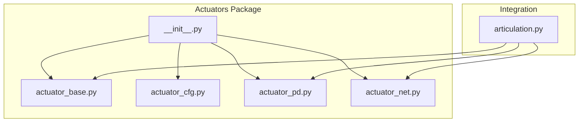
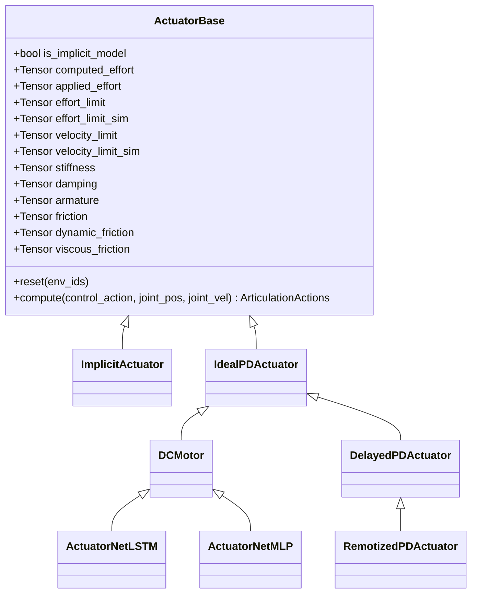
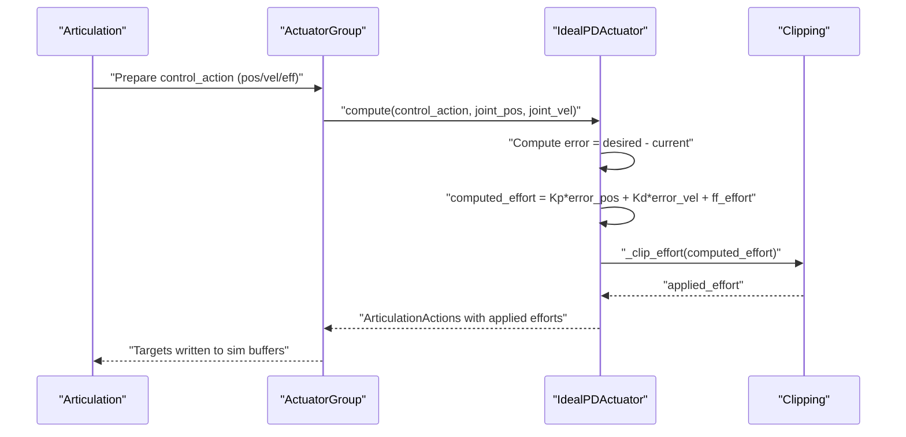
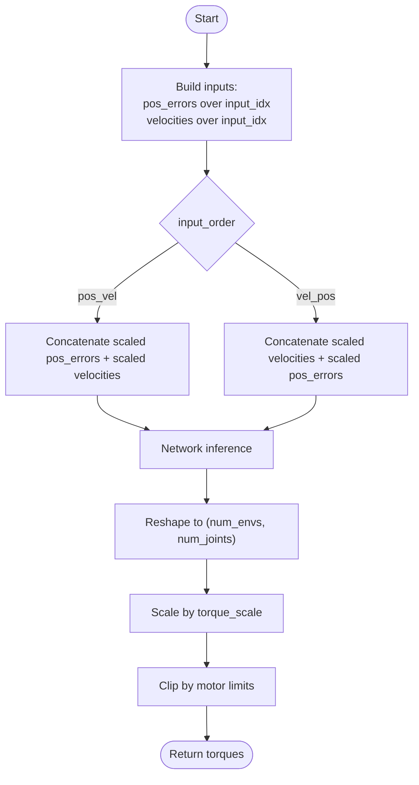
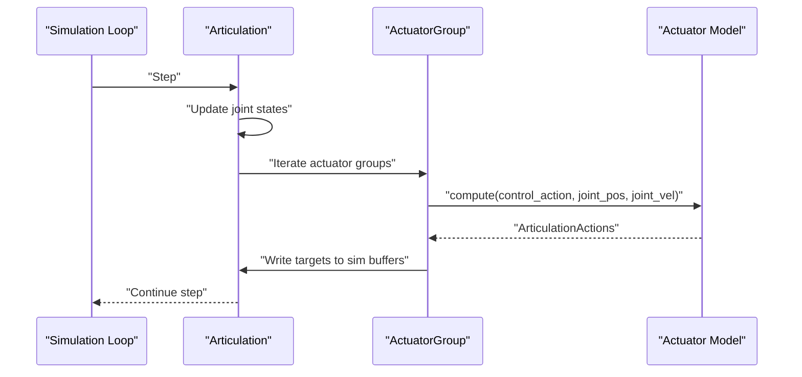
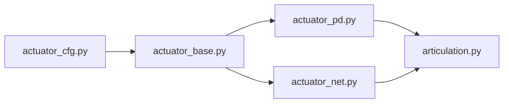

# Actuator System

<cite>
**Referenced Files in This Document**
- [__init__.py](file://source/isaaclab/isaaclab/actuators/__init__.py)
- [actuator_base.py](file://source/isaaclab/isaaclab/actuators/actuator_base.py)
- [actuator_cfg.py](file://source/isaaclab/isaaclab/actuators/actuator_cfg.py)
- [actuator_pd.py](file://source/isaaclab/isaaclab/actuators/actuator_pd.py)
- [actuator_net.py](file://source/isaaclab/isaaclab/actuators/actuator_net.py)
- [articulation.py](file://source/isaaclab/isaaclab/assets/articulation/articulation.py)
- [actuators.rst](file://docs/source/overview/core-concepts/actuators.rst)
- [quadrupeds.py](file://scripts/demos/quadrupeds.py)
</cite>

## Table of Contents
1. [Introduction](#introduction)
2. [Project Structure](#project-structure)
3. [Core Components](#core-components)
4. [Architecture Overview](#architecture-overview)
5. [Detailed Component Analysis](#detailed-component-analysis)
6. [Dependency Analysis](#dependency-analysis)
7. [Performance Considerations](#performance-considerations)
8. [Troubleshooting Guide](#troubleshooting-guide)
9. [Conclusion](#conclusion)
10. [Appendices](#appendices)

## Introduction
This document explains the actuator system component of the Extreme Quadruped Parkour framework. It covers the actuator modeling and control implementation, focusing on the actuator base class architecture, configuration system, and PD control variants. It also documents actuator dynamics, torque limits, and joint space control mechanisms. The content is structured for both beginners who want a conceptual understanding of actuator behavior and experienced developers who need technical details to implement custom actuators and integrate them into control systems.

## Project Structure
The actuator system resides under the isaaclab actuators package and integrates with the Articulation asset. The key files are:
- Base class and configuration definitions
- Explicit actuator models (PD, DC motor, delayed/remotized variants)
- Neural-net-based actuators (MLP/LSTM)
- Integration with the Articulation asset pipeline

**Diagram sources**
- [__init__.py:25-38](file://source/isaaclab/isaaclab/actuators/__init__.py#L25-L38)
- [actuator_base.py:20-365](file://source/isaaclab/isaaclab/actuators/actuator_base.py#L20-L365)
- [actuator_cfg.py:16-286](file://source/isaaclab/isaaclab/actuator_cfg.py#L16-L286)
- [actuator_pd.py:34-449](file://source/isaaclab/isaaclab/actuator_pd.py#L34-L449)
- [actuator_net.py:30-188](file://source/isaaclab/isaaclab/actuator_net.py#L30-L188)
- [articulation.py:1802-1840](file://source/isaaclab/isaaclab/assets/articulation/articulation.py#L1802-L1840)

**Section sources**
- [__init__.py:6-38](file://source/isaaclab/isaaclab/actuators/__init__.py#L6-L38)
- [actuators.rst:1-101](file://docs/source/overview/core-concepts/actuators.rst#L1-L101)

## Core Components
- ActuatorBase: Defines the common interface for actuator models, parsing configuration, resolving per-joint parameters, and providing buffers for computed/applied efforts and limits.
- Actuator configurations: Typed configuration classes for implicit and explicit actuators, including PD gains, effort/velocity limits, and model-specific parameters (e.g., saturation effort for DC motor).
- Explicit actuator models: Ideal PD, DC motor (velocity-dependent saturation), delayed PD, remotized PD (angle-dependent torque limits), and neural-net variants (MLP/LSTM).
- Integration: Articulation composes actuator groups and applies them during simulation steps.

Key responsibilities:
- Parameter resolution: Joint-wise parsing from configuration or defaults, with logging of applied values.
- Control computation: PD control in joint space, effort clipping, and optional delays or angle-dependent limits.
- Simulation integration: Writing targets (positions/velocities/efforts) into the simulation buffers.

**Section sources**
- [actuator_base.py:20-365](file://source/isaaclab/isaaclab/actuators/actuator_base.py#L20-L365)
- [actuator_cfg.py:16-286](file://source/isaaclab/isaaclab/actuators/actuator_cfg.py#L16-L286)
- [actuator_pd.py:148-449](file://source/isaaclab/isaaclab/actuator_pd.py#L148-L449)
- [actuator_net.py:30-188](file://source/isaaclab/isaaclab/actuator_net.py#L30-L188)
- [articulation.py:1802-1840](file://source/isaaclab/isaaclab/assets/articulation/articulation.py#L1802-L1840)

## Architecture Overview
The actuator system is designed around a base class with multiple specialized models. The Articulation asset orchestrates actuator groups, passing desired joint targets and current joint states to compute applied efforts or targets.

**Diagram sources**
- [actuator_base.py:20-365](file://source/isaaclab/isaaclab/actuators/actuator_base.py#L20-L365)
- [actuator_pd.py:34-449](file://source/isaaclab/isaaclab/actuator_pd.py#L34-L449)
- [actuator_net.py:30-188](file://source/isaaclab/isaaclab/actuator_net.py#L30-L188)

## Detailed Component Analysis

### ActuatorBase: Base Class and Configuration Resolution
ActuatorBase centralizes:
- Parameter parsing: Joint-wise stiffness, damping, effort/velocity limits, armature, and friction parameters. Supports scalar values or per-joint dictionaries keyed by joint names or regex expressions.
- Buffers: computed_effort and applied_effort tensors, plus per-joint limit tensors.
- Resolution logging: Records differences between USD defaults and applied configuration values.
- Clipping: Clips computed efforts to per-joint effort limits.

Implementation highlights:
- Joint parameter resolution uses regex matching for joint names and builds per-joint tensors.
- For explicit actuators without explicit simulation limits, a large default effort limit is used to avoid solver clipping.
- String representation prints model type, number of joints, and selected joint names/indices.

Practical usage:
- Configure per-joint gains and limits via configuration dictionaries.
- Use effort_limit_sim and velocity_limit_sim to tune solver constraints safely.

**Section sources**
- [actuator_base.py:104-365](file://source/isaaclab/isaaclab/actuators/actuator_base.py#L104-L365)
- [actuator_cfg.py:16-165](file://source/isaaclab/isaaclab/actuators/actuator_cfg.py#L16-L165)

### PD Control Implementations
- IdealPDActuator: Implements PD control in joint space with feed-forward efforts and simple clipping by effort_limit.
- DCMotor: Extends IdealPDActuator with a velocity-dependent saturation model based on a linear four-quadrant torque-speed curve. Uses saturation effort and velocity_limit to compute per-step torque bounds.
- DelayedPDActuator: Adds configurable command delays using circular buffers for positions, velocities, and efforts. Delays are randomized within configured bounds at reset.
- RemotizedPDActuator: Applies angle-dependent torque limits by interpolating a lookup table of joint angle vs. maximum torque. Overrides base effort/velocity limits.

**Diagram sources**
- [actuator_pd.py:148-199](file://source/isaaclab/isaaclab/actuator_pd.py#L148-L199)
- [articulation.py:1802-1840](file://source/isaaclab/isaaclab/assets/articulation/articulation.py#L1802-L1840)

**Section sources**
- [actuator_pd.py:148-305](file://source/isaaclab/isaaclab/actuator_pd.py#L148-L305)

### Neural Net-Based Actuators (MLP/LSTM)
- ActuatorNetMLP: Uses a trained MLP to predict torques from joint position errors and velocities over a configurable history window. Inputs are scaled and concatenated according to input_order. Predictions are scaled by torque_scale and clipped by motor limits.
- ActuatorNetLSTM: Similar to MLP but uses an LSTM to capture temporal dynamics without maintaining a large history buffer. Hidden/cell states are maintained per environment and joint.

**Diagram sources**
- [actuator_net.py:100-188](file://source/isaaclab/isaaclab/actuator_net.py#L100-L188)

**Section sources**
- [actuator_net.py:30-188](file://source/isaaclab/isaaclab/actuator_net.py#L30-L188)

### Integration with Articulation
Articulation composes actuator groups and applies them during simulation:
- For each actuator group, prepares ArticulationActions with targets and current joint states.
- Calls actuator.compute to produce applied efforts or targets.
- Writes results into simulation buffers and updates internal state (computed/applied torques, soft limits).

**Diagram sources**
- [articulation.py:1802-1840](file://source/isaaclab/isaaclab/assets/articulation/articulation.py#L1802-L1840)

**Section sources**
- [articulation.py:52-77](file://source/isaaclab/isaaclab/assets/articulation/articulation.py#L52-L77)
- [articulation.py:1802-1840](file://source/isaaclab/isaaclab/assets/articulation/articulation.py#L1802-L1840)

## Dependency Analysis
- ActuatorBase depends on configuration classes and string utilities for regex-based joint name resolution.
- Explicit actuator models depend on ActuatorBase and optionally on delay buffers and interpolation utilities.
- Neural-net actuators depend on DCMotor and TorchScript-loaded networks.
- Articulation depends on actuator models to transform control actions into simulation targets.

**Diagram sources**
- [actuator_cfg.py:16-286](file://source/isaaclab/isaaclab/actuators/actuator_cfg.py#L16-L286)
- [actuator_base.py:20-365](file://source/isaaclab/isaaclab/actuators/actuator_base.py#L20-L365)
- [actuator_pd.py:34-449](file://source/isaaclab/isaaclab/actuator_pd.py#L34-L449)
- [actuator_net.py:30-188](file://source/isaaclab/isaaclab/actuator_net.py#L30-L188)
- [articulation.py:1802-1840](file://source/isaaclab/isaaclab/assets/articulation/articulation.py#L1802-L1840)

**Section sources**
- [__init__.py:25-38](file://source/isaaclab/isaaclab/actuators/__init__.py#L25-L38)

## Performance Considerations
- Explicit actuators compute torques and clip them; for non-implicit models, solver clipping is avoided by default large effort_limit_sim unless intentionally reduced for safety.
- DCMotor’s velocity-dependent clipping introduces per-step computation; ensure velocity_limit and saturation_effort are set appropriately to avoid excessive clipping.
- Neural-net actuators (MLP/LSTM) add inference overhead; choose input_idx and network sizes carefully to balance fidelity and latency.
- Delays in DelayedPDActuator and RemotizedPDActuator affect control responsiveness; tune min/max delay and lookup tables for the intended behavior.

[No sources needed since this section provides general guidance]

## Troubleshooting Guide
Common issues and resolutions:
- Unexpected effort limits: Verify effort_limit_sim vs. effort_limit and their interplay for implicit vs. explicit models.
- Velocity limit conflicts: Tight velocity_limit_sim can cause solver convergence issues; relax limits or adjust PD gains.
- DC motor clipping surprises: Ensure saturation_effort and velocity_limit are set consistently with the motor’s capabilities.
- Angle-dependent torque limits: Confirm the lookup table covers the expected joint range and interpolation behavior.
- Parameter resolution mismatches: Check the recorded resolution table for discrepancies between USD defaults and applied configuration.

**Section sources**
- [actuator_cfg.py:79-110](file://source/isaaclab/isaaclab/actuators/actuator_cfg.py#L79-L110)
- [actuator_base.py:283-353](file://source/isaaclab/isaaclab/actuators/actuator_base.py#L283-L353)
- [actuator_pd.py:201-305](file://source/isaaclab/isaaclab/actuator_pd.py#L201-L305)
- [actuators.rst:80-101](file://docs/source/overview/core-concepts/actuators.rst#L80-L101)

## Conclusion
The actuator system provides a flexible, extensible framework for modeling joint-space dynamics in simulation. The base class and configuration system enable precise control over PD gains, limits, and delays, while explicit models and neural nets capture realistic actuator behavior. Integration with Articulation ensures seamless application of computed efforts or targets into the simulation.

[No sources needed since this section summarizes without analyzing specific files]

## Appendices

### Practical Examples and Usage Patterns
- Basic PD control: Configure IdealPDActuator with stiffness and damping; use effort_limit for clipping.
- DC motor modeling: Provide saturation_effort and velocity_limit; rely on velocity-dependent torque limits.
- Delayed control: Use DelayedPDActuator to emulate communication/control latency; set min/max delay.
- Angle-dependent limits: Use RemotizedPDActuator with a joint-angle-to-torque lookup table.
- Neural-net actuators: Load MLP/LSTM networks via ActuatorNetMLP/ActuatorNetLSTM; configure input scaling and history indices.

Integration example outline:
- Define actuator groups in the Articulation configuration.
- Set joint position/velocity targets on the Articulation.
- Call write_data_to_sim to apply actuator-computed targets.
- Step the simulation and update the Articulation state.

**Section sources**
- [actuator_cfg.py:188-286](file://source/isaaclab/isaaclab/actuators/actuator_cfg.py#L188-L286)
- [actuator_pd.py:148-449](file://source/isaaclab/isaaclab/actuator_pd.py#L148-L449)
- [actuator_net.py:30-188](file://source/isaaclab/isaaclab/actuator_net.py#L30-L188)
- [articulation.py:52-77](file://source/isaaclab/isaaclab/assets/articulation/articulation.py#L52-L77)
- [quadrupeds.py:127-169](file://scripts/demos/quadrupeds.py#L127-L169)