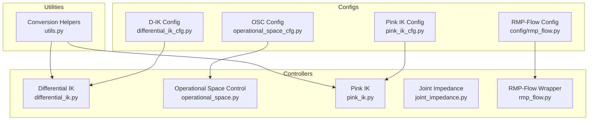
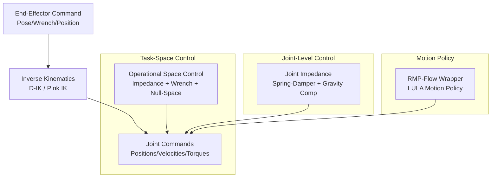
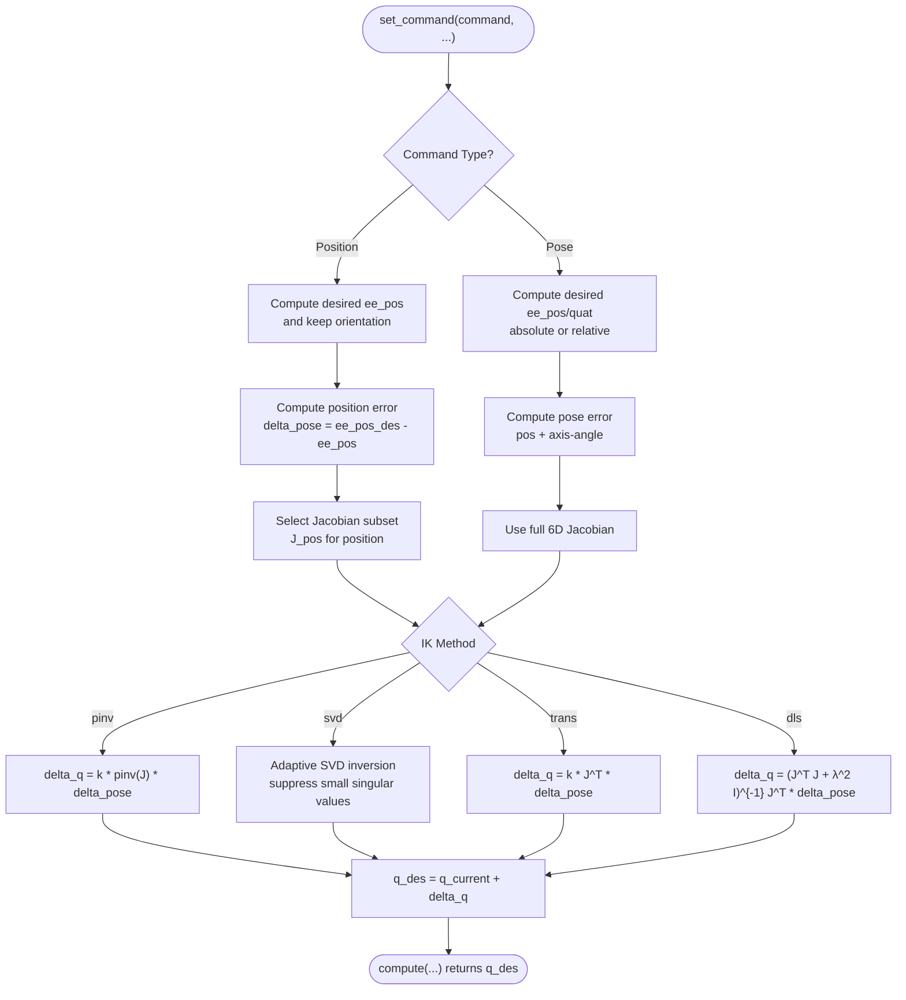
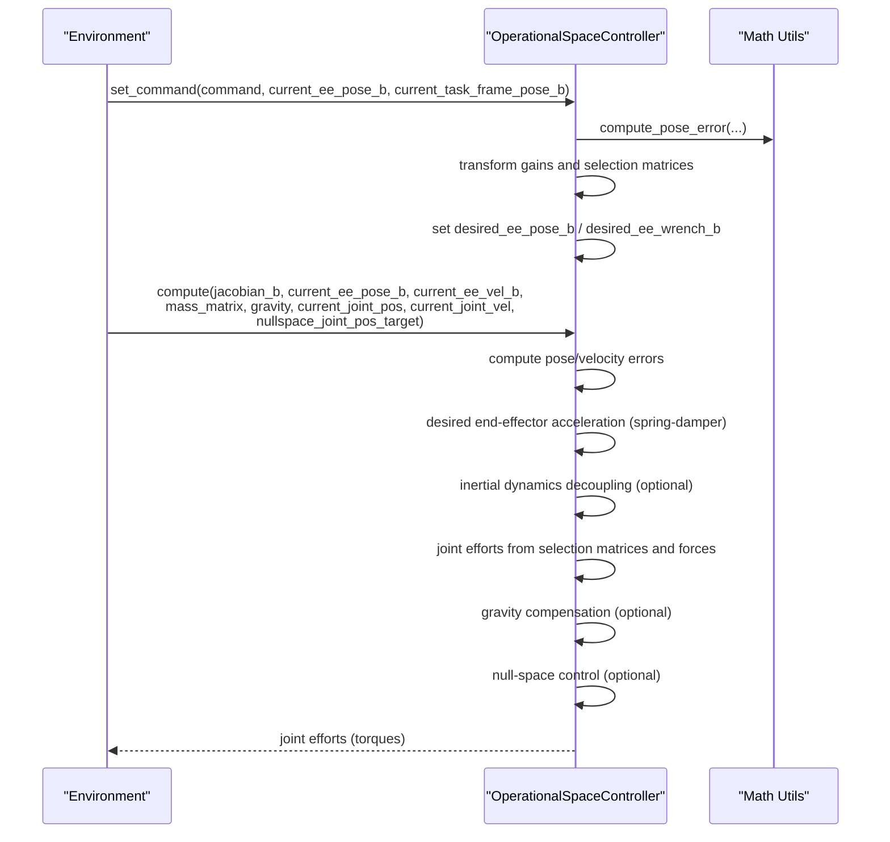
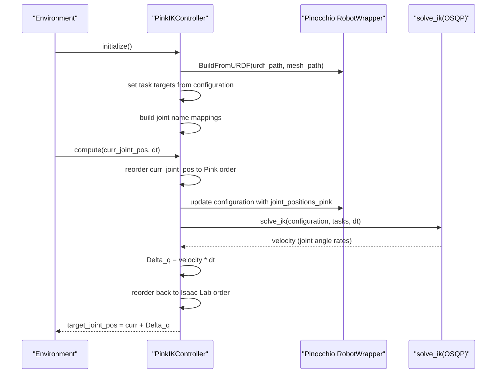
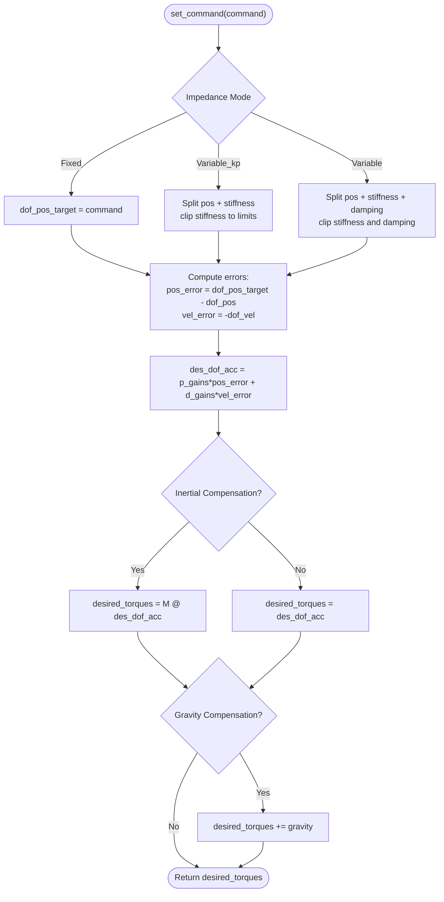
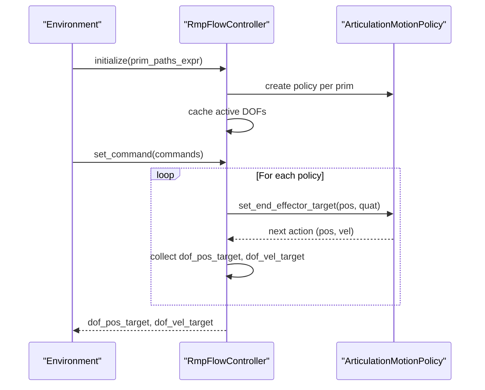
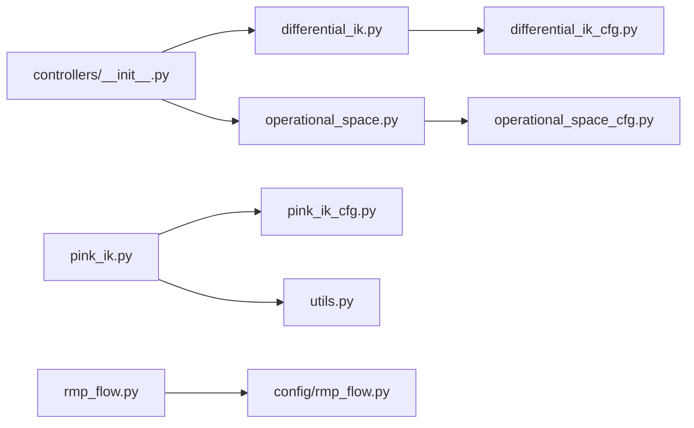

# Controller System

<cite>
**Referenced Files in This Document**
- [controllers/__init__.py](file://source/isaaclab/isaaclab/controllers/__init__.py)
- [differential_ik.py](file://source/isaaclab/isaaclab/controllers/differential_ik.py)
- [differential_ik_cfg.py](file://source/isaaclab/isaaclab/controllers/differential_ik_cfg.py)
- [operational_space.py](file://source/isaaclab/isaaclab/controllers/operational_space.py)
- [operational_space_cfg.py](file://source/isaaclab/isaaclab/controllers/operational_space_cfg.py)
- [pink_ik.py](file://source/isaaclab/isaaclab/controllers/pink_ik.py)
- [pink_ik_cfg.py](file://source/isaaclab/isaaclab/controllers/pink_ik_cfg.py)
- [joint_impedance.py](file://source/isaaclab/isaaclab/controllers/joint_impedance.py)
- [rmp_flow.py](file://source/isaaclab/isaaclab/controllers/rmp_flow.py)
- [rmp_flow.py (config)](file://source/isaaclab/isaaclab/controllers/config/rmp_flow.py)
- [utils.py](file://source/isaaclab/isaaclab/controllers/utils.py)
- [run_diff_ik.py](file://scripts/tutorials/05_controllers/run_diff_ik.py)
- [run_osc.py](file://scripts/tutorials/05_controllers/run_osc.py)
</cite>

## Table of Contents
1. [Introduction](#introduction)
2. [Project Structure](#project-structure)
3. [Core Components](#core-components)
4. [Architecture Overview](#architecture-overview)
5. [Detailed Component Analysis](#detailed-component-analysis)
6. [Dependency Analysis](#dependency-analysis)
7. [Performance Considerations](#performance-considerations)
8. [Troubleshooting Guide](#troubleshooting-guide)
9. [Conclusion](#conclusion)
10. [Appendices](#appendices)

## Introduction
This document explains the controller system component of the Extreme Quadruped Parkour framework. It focuses on the hierarchical control architecture implemented in the repository, covering:
- Differential inverse kinematics (D-IK)
- Operational space control (OSC)
- Pink inverse kinematics (Pink IK)
- Joint impedance control
- Optional RMP-Flow motion policy wrapper

It provides both conceptual overviews for beginners and technical details for advanced users implementing custom controllers. Terminology follows robotics control conventions (task space, operational space, impedance, null space, Jacobian, mass matrix, gravity compensation).

## Project Structure
The controller package is organized by algorithmic families and shared utilities:
- Differential IK: [differential_ik.py](file://source/isaaclab/isaaclab/controllers/differential_ik.py), [differential_ik_cfg.py](file://source/isaaclab/isaaclab/controllers/differential_ik_cfg.py)
- Operational Space Control: [operational_space.py](file://source/isaaclab/isaaclab/controllers/operational_space.py), [operational_space_cfg.py](file://source/isaaclab/isaaclab/controllers/operational_space_cfg.py)
- Pink IK: [pink_ik.py](file://source/isaaclab/isaaclab/controllers/pink_ik.py), [pink_ik_cfg.py](file://source/isaaclab/isaaclab/controllers/pink_ik_cfg.py)
- Joint Impedance: [joint_impedance.py](file://source/isaaclab/isaaclab/controllers/joint_impedance.py)
- RMP-Flow Wrapper: [rmp_flow.py](file://source/isaaclab/isaaclab/controllers/rmp_flow.py), [rmp_flow.py (config)](file://source/isaaclab/isaaclab/controllers/config/rmp_flow.py)
- Utilities: [utils.py](file://source/isaaclab/isaaclab/controllers/utils.py)
- Package exports: [controllers/__init__.py](file://source/isaaclab/isaaclab/controllers/__init__.py)

**Diagram sources**
- [differential_ik.py:17-241](file://source/isaaclab/isaaclab/controllers/differential_ik.py#L17-L241)
- [operational_space.py:23-549](file://source/isaaclab/isaaclab/controllers/operational_space.py#L23-L549)
- [pink_ik.py:22-134](file://source/isaaclab/isaaclab/controllers/pink_ik.py#L22-L134)
- [joint_impedance.py:59-230](file://source/isaaclab/isaaclab/controllers/joint_impedance.py#L59-L230)
- [rmp_flow.py:45-157](file://source/isaaclab/isaaclab/controllers/rmp_flow.py#L45-L157)
- [differential_ik_cfg.py:14-71](file://source/isaaclab/isaaclab/controllers/differential_ik_cfg.py#L14-L71)
- [operational_space_cfg.py:14-91](file://source/isaaclab/isaaclab/controllers/operational_space_cfg.py#L14-L91)
- [pink_ik_cfg.py:15-60](file://source/isaaclab/isaaclab/controllers/pink_ik_cfg.py#L15-L60)
- [rmp_flow.py (config):20-37](file://source/isaaclab/isaaclab/controllers/config/rmp_flow.py#L20-L37)
- [utils.py:22-101](file://source/isaaclab/isaaclab/controllers/utils.py#L22-L101)

**Section sources**
- [controllers/__init__.py:6-18](file://source/isaaclab/isaaclab/controllers/__init__.py#L6-L18)

## Core Components
- Differential IK Controller: Computes target joint positions from desired end-effector pose using pseudo-inverse, SVD, transpose, or damped least squares. Supports absolute or relative commands and position/pose control.
- Operational Space Controller: Implements task-space impedance control with configurable axes, inertial decoupling, gravity compensation, optional contact wrench control, and null-space control for redundant systems.
- Pink IK Controller: Integrates the Pink differentiable IK solver with a URDF model and joint name mapping to produce target joint positions.
- Joint Impedance Controller: Provides joint-level spring-damper control with fixed/variable stiffness and damping, optional inertial and gravity compensation.
- RMP-Flow Wrapper: Wraps LULA’s RMP-Flow motion policy for batched environments, exposing end-effector pose targets and returning joint position/velocity targets.

**Section sources**
- [differential_ik.py:17-241](file://source/isaaclab/isaaclab/controllers/differential_ik.py#L17-L241)
- [operational_space.py:23-549](file://source/isaaclab/isaaclab/controllers/operational_space.py#L23-L549)
- [pink_ik.py:22-134](file://source/isaaclab/isaaclab/controllers/pink_ik.py#L22-L134)
- [joint_impedance.py:59-230](file://source/isaaclab/isaaclab/controllers/joint_impedance.py#L59-L230)
- [rmp_flow.py:45-157](file://source/isaaclab/isaaclab/controllers/rmp_flow.py#L45-L157)

## Architecture Overview
The controller system supports a layered control architecture:
- Low-level joint impedance control for stiffness/damping and bias compensation.
- Mid-level task-space control via OSC for pose and wrench tracking with optional inertial decoupling and null-space shaping.
- High-level kinematic control via D-IK or Pink IK to translate desired end-effector trajectories into joint commands.
- Optional motion policy wrapper (RMP-Flow) for higher-level motion generation.

[No sources needed since this diagram shows conceptual workflow, not actual code structure]

## Detailed Component Analysis

### Differential Inverse Kinematics (D-IK)
- Purpose: Convert desired end-effector pose/position into target joint positions using a selected IK method.
- Methods:
  - Pseudo-inverse (pinv)
  - Adaptive SVD
  - Transpose
  - Damped least squares (DLS)
- Modes:
  - Position or pose control
  - Absolute or relative commands
- Inputs: current end-effector pose, geometric Jacobian, current joint positions, and command tensor.
- Outputs: target joint positions.

**Diagram sources**
- [differential_ik.py:98-174](file://source/isaaclab/isaaclab/controllers/differential_ik.py#L98-L174)
- [differential_ik.py:180-241](file://source/isaaclab/isaaclab/controllers/differential_ik.py#L180-L241)

Key configuration parameters:
- command_type: position or pose
- use_relative_mode: enables delta commands
- ik_method: pinv, svd, trans, dls
- ik_params: method-specific parameters (scaling, damping, threshold)

Practical tips:
- Prefer SVD or DLS near singularities; pinv is fast but can blow up near singularities.
- Use relative mode for incremental motions to avoid drift.
- Tune k_val or damping lambda for stability and convergence speed.

**Section sources**
- [differential_ik.py:17-241](file://source/isaaclab/isaaclab/controllers/differential_ik.py#L17-L241)
- [differential_ik_cfg.py:14-71](file://source/isaaclab/isaaclab/controllers/differential_ik_cfg.py#L14-L71)

### Operational Space Control (OSC)
- Purpose: Task-space impedance control with configurable axes, inertial decoupling, gravity compensation, and null-space shaping.
- Capabilities:
  - Motion control: pose tracking with stiffness/damping per axis
  - Contact wrench control: optional closed-loop force control
  - Null-space control: redundant manipulator posture control
  - Inertial decoupling: operational space mass matrix computation
- Inputs: Jacobian in base frame, current pose/velocity, mass matrix, gravity vector, contact wrench, joint positions/velocities, null-space targets.
- Outputs: joint efforts (torques).

**Diagram sources**
- [operational_space.py:173-344](file://source/isaaclab/isaaclab/controllers/operational_space.py#L173-L344)
- [operational_space.py:345-548](file://source/isaaclab/isaaclab/controllers/operational_space.py#L345-L548)

Configuration highlights:
- target_types: pose_abs/pose_rel/wrench_abs combinations
- motion_control_axes_task and contact_wrench_control_axes_task: enable/disable axes
- inertial_dynamics_decoupling and partial_inertial_dynamics_decoupling
- gravity_compensation
- impedance_mode: fixed, variable_kp, variable
- nullspace_control: none or position
- nullspace_stiffness and nullspace_damping_ratio

Stability and tuning:
- Use critically damped gains: d = 2 * sqrt(p) * damping_ratio
- Limit stiffness and damping ratios to prevent oscillations
- Prefer partial decoupling when full inverse is unavailable

**Section sources**
- [operational_space.py:23-549](file://source/isaaclab/isaaclab/controllers/operational_space.py#L23-L549)
- [operational_space_cfg.py:14-91](file://source/isaaclab/isaaclab/controllers/operational_space_cfg.py#L14-L91)

### Pink Inverse Kinematics (Pink IK)
- Purpose: Differentiable IK using the Pink framework with task-based control.
- Workflow:
  - Build robot model from URDF and meshes
  - Initialize configuration and tasks
  - Map joint names between USD and URDF conventions
  - Update configuration with current joint positions
  - Solve IK using OSQP; integrate velocity to get target joint positions
- Inputs: current joint positions, time step
- Outputs: target joint positions

**Diagram sources**
- [pink_ik.py:28-134](file://source/isaaclab/isaaclab/controllers/pink_ik.py#L28-L134)

Configuration highlights:
- urdf_path, mesh_path
- variable_input_tasks and fixed_input_tasks
- joint_names mapping
- show_ik_warnings

Integration notes:
- Requires URDF export; see utilities for conversion helpers.
- Handles solver failures gracefully by returning current positions.

**Section sources**
- [pink_ik.py:22-134](file://source/isaaclab/isaaclab/controllers/pink_ik.py#L22-L134)
- [pink_ik_cfg.py:15-60](file://source/isaaclab/isaaclab/controllers/pink_ik_cfg.py#L15-L60)
- [utils.py:22-101](file://source/isaaclab/isaaclab/controllers/utils.py#L22-L101)

### Joint Impedance Control
- Purpose: Spring-damper control at the joint level with optional inertial and gravity compensation.
- Modes:
  - Fixed: joint positions only
  - Variable_kp: joint positions + stiffness
  - Variable: joint positions + stiffness + damping ratio
- Inputs: current joint positions/velocities, optional mass matrix and gravity vector
- Outputs: target joint torques

**Diagram sources**
- [joint_impedance.py:145-229](file://source/isaaclab/isaaclab/controllers/joint_impedance.py#L145-L229)

Tuning guidelines:
- Choose stiffness within hardware limits; clip to configured bounds.
- Use damping ratio ≈ 1 for critical damping; adjust for desired response.
- Enable inertial compensation for accurate inverse dynamics control.
- Enable gravity compensation to counteract static effects.

**Section sources**
- [joint_impedance.py:59-230](file://source/isaaclab/isaaclab/controllers/joint_impedance.py#L59-L230)

### RMP-Flow Wrapper
- Purpose: Batched wrapper around LULA’s RMP-Flow motion policy for end-effector pose tracking.
- Workflow:
  - Initialize policies for multiple robots using URDF/collision descriptors
  - Set end-effector targets per robot
  - Compute next articulation actions (positions/velocities)
- Inputs: end-effector pose commands per robot
- Outputs: target joint positions and velocities

**Diagram sources**
- [rmp_flow.py:74-156](file://source/isaaclab/isaaclab/controllers/rmp_flow.py#L74-L156)
- [rmp_flow.py (config):20-37](file://source/isaaclab/isaaclab/controllers/config/rmp_flow.py#L20-L37)

Notes:
- Requires LULA extensions; configurations are provided for supported robots.
- Evaluations per frame controls internal integration resolution.

**Section sources**
- [rmp_flow.py:45-157](file://source/isaaclab/isaaclab/controllers/rmp_flow.py#L45-L157)
- [rmp_flow.py (config):20-37](file://source/isaaclab/isaaclab/controllers/config/rmp_flow.py#L20-L37)

## Dependency Analysis
- Exported controller classes are exposed via the package init for easy import in environments.
- Pink IK depends on external libraries (pink, pinocchio) and requires URDF/mesh assets.
- OSC depends on math utilities for transforms and pose errors.
- RMP-Flow depends on IsaacSim motion generation extensions.

**Diagram sources**
- [controllers/__init__.py:14-18](file://source/isaaclab/isaaclab/controllers/__init__.py#L14-L18)
- [differential_ik.py:54-66](file://source/isaaclab/isaaclab/controllers/differential_ik.py#L54-L66)
- [operational_space.py:34-49](file://source/isaaclab/isaaclab/controllers/operational_space.py#L34-L49)
- [pink_ik.py:28-59](file://source/isaaclab/isaaclab/controllers/pink_ik.py#L28-L59)
- [rmp_flow.py:48-58](file://source/isaaclab/isaaclab/controllers/rmp_flow.py#L48-L58)

**Section sources**
- [controllers/__init__.py:6-18](file://source/isaaclab/isaaclab/controllers/__init__.py#L6-L18)

## Performance Considerations
- Numerical conditioning:
  - Prefer SVD or DLS for D-IK near singularities.
  - Use partial inertial decoupling in OSC when full mass matrix inverse is unavailable.
- Computational cost:
  - OSC with full decoupling involves matrix inversions; consider partial decoupling for speed.
  - Pink IK solves QP at each step; tune dt and solver settings carefully.
- Stability margins:
  - Clip stiffness and damping ratios in OSC and joint impedance modes.
  - Use critical damping relations to avoid overshoot.
- Real-time constraints:
  - RMP-Flow evaluations_per_frame trades accuracy for speed; adjust based on simulation frequency.

[No sources needed since this section provides general guidance]

## Troubleshooting Guide
Common issues and resolutions:
- D-IK warnings or divergence:
  - Switch to SVD/DLS; increase k_val or damping lambda.
  - Verify command frames and relative mode usage.
- OSC instability:
  - Reduce stiffness; verify damping ratios.
  - Ensure mass matrix and gravity vectors are provided when compensation is enabled.
- Pink IK solver failure:
  - Check joint name mapping and URDF validity.
  - Enable warnings to detect solver failures; fallback returns current positions.
- RMP-Flow initialization:
  - Confirm URDF/collision paths and LULA extensions are available.
  - Validate end-effector frame name exists in URDF.

**Section sources**
- [differential_ik.py:194-238](file://source/isaaclab/isaaclab/controllers/differential_ik.py#L194-L238)
- [operational_space.py:424-450](file://source/isaaclab/isaaclab/controllers/operational_space.py#L424-L450)
- [pink_ik.py:103-116](file://source/isaaclab/isaaclab/controllers/pink_ik.py#L103-L116)
- [rmp_flow.py:99-109](file://source/isaaclab/isaaclab/controllers/rmp_flow.py#L99-L109)

## Conclusion
The controller system offers a flexible, modular toolkit for quadruped parkour and general robotic control:
- D-IK for precise end-effector tracking under various numerical regimes
- OSC for robust task-space control with inertial decoupling and null-space shaping
- Pink IK for differentiable, task-based IK suitable for learning and optimization
- Joint impedance for compliant joint-level control
- RMP-Flow for high-level motion policy integration

By combining these components and tuning parameters thoughtfully, practitioners can achieve stable, responsive locomotion and manipulation behaviors.

[No sources needed since this section summarizes without analyzing specific files]

## Appendices

### Practical Examples and Integration Tips
- Differential IK usage:
  - Configure command_type and ik_method; set ik_params appropriately.
  - Provide Jacobian and current joint positions; handle relative vs absolute commands.
  - See [run_diff_ik.py](file://scripts/tutorials/05_controllers/run_diff_ik.py) for a working example.
- Operational Space Control usage:
  - Define target_types and control axes; enable inertial decoupling and gravity compensation as needed.
  - Provide mass matrix and gravity when required; supply null-space targets for redundancy.
  - See [run_osc.py](file://scripts/tutorials/05_controllers/run_osc.py) for a working example.
- Pink IK integration:
  - Export URDF from USD assets using [utils.py:22-71](file://source/isaaclab/isaaclab/controllers/utils.py#L22-L71).
  - Build robot wrapper and tasks; ensure joint name mapping matches the asset.
- Joint Impedance tuning:
  - Start with critical damping; gradually increase stiffness within hardware limits.
  - Enable inertial compensation for dynamic tracking; enable gravity compensation for statics.
- RMP-Flow configuration:
  - Use provided configs for supported robots; adjust evaluations_per_frame for real-time needs.

**Section sources**
- [run_diff_ik.py](file://scripts/tutorials/05_controllers/run_diff_ik.py)
- [run_osc.py](file://scripts/tutorials/05_controllers/run_osc.py)
- [utils.py:22-101](file://source/isaaclab/isaaclab/controllers/utils.py#L22-L101)
- [rmp_flow.py (config):20-37](file://source/isaaclab/isaaclab/controllers/config/rmp_flow.py#L20-L37)