# Core Framework Components

<cite>
**Referenced Files in This Document**
- [README.md](file://README.md)
- [__init__.py](file://source/isaaclab/isaaclab/__init__.py)
- [manager_base.py](file://source/isaaclab/isaaclab/managers/manager_base.py)
- [simulation_context.py](file://source/isaaclab/isaaclab/sim/simulation_context.py)
- [interactive_scene.py](file://source/isaaclab/isaaclab/scene/interactive_scene.py)
- [actuator_base.py](file://source/isaaclab/isaaclab/actuators/actuator_base.py)
- [sensor_base.py](file://source/isaaclab/isaaclab/sensors/sensor_base.py)
- [differential_ik.py](file://source/isaaclab/isaaclab/controllers/differential_ik.py)
- [manager_based_env.py](file://source/isaaclab/isaaclab/envs/manager_based_env.py)
- [go2_env_cfg.py](file://source/isaaclab_tasks/isaaclab_tasks/direct/go2/go2_env_cfg.py)
- [go2_env.py](file://source/isaaclab_tasks/isaaclab_tasks/direct/go2/go2_env.py)
- [create_quadruped_base_env.py](file://scripts/tutorials/03_envs/create_quadruped_base_env.py)
- [add_sensors_on_robot.py](file://scripts/tutorials/04_sensors/add_sensors_on_robot.py)
</cite>

## Table of Contents
1. [Introduction](#introduction)
2. [Project Structure](#project-structure)
3. [Core Components](#core-components)
4. [Architecture Overview](#architecture-overview)
5. [Detailed Component Analysis](#detailed-component-analysis)
6. [Dependency Analysis](#dependency-analysis)
7. [Performance Considerations](#performance-considerations)
8. [Troubleshooting Guide](#troubleshooting-guide)
9. [Conclusion](#conclusion)

## Introduction
This document explains the core framework components of the Extreme Quadruped Parkour system built on the Isaac Lab framework. It provides a layered understanding of the modular architecture spanning simulation control, environment orchestration, actuators, sensors, and controllers. The content is designed for both beginners seeking conceptual clarity and advanced practitioners needing technical implementation details. Practical examples demonstrate component integration patterns and common usage scenarios for quadruped locomotion with height-scan perception and parkour-style terrain challenges.

## Project Structure
The repository organizes the framework into:
- Core framework packages under source/isaaclab/isaaclab: simulation context, scene management, actuators, sensors, controllers, managers, and environment abstractions.
- Task-specific implementations under source/isaaclab_tasks/isaaclab_tasks/direct/go2 for the Go2 quadruped parkour environment.
- Tutorials and demos under scripts/tutorials showcasing environment creation, sensor integration, and policy-driven control.

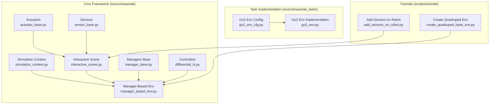

**Diagram sources**
- [simulation_context.py:41-800](file://source/isaaclab/isaaclab/sim/simulation_context.py#L41-800)
- [interactive_scene.py:41-786](file://source/isaaclab/isaaclab/scene/interactive_scene.py#L41-786)
- [manager_base.py:127-415](file://source/isaaclab/isaaclab/managers/manager_base.py#L127-415)
- [manager_based_env.py:30-561](file://source/isaaclab/isaaclab/envs/manager_based_env.py#L30-561)
- [actuator_base.py:20-365](file://source/isaaclab/isaaclab/actuators/actuator_base.py#L20-365)
- [sensor_base.py:34-358](file://source/isaaclab/isaaclab/sensors/sensor_base.py#L34-358)
- [differential_ik.py:17-241](file://source/isaaclab/isaaclab/controllers/differential_ik.py#L17-241)
- [go2_env_cfg.py:34-353](file://source/isaaclab_tasks/isaaclab_tasks/direct/go2/go2_env_cfg.py#L34-353)
- [go2_env.py:20-635](file://source/isaaclab_tasks/isaaclab_tasks/direct/go2/go2_env.py#L20-635)
- [create_quadruped_base_env.py:81-203](file://scripts/tutorials/03_envs/create_quadruped_base_env.py#L81-203)
- [add_sensors_on_robot.py:56-180](file://scripts/tutorials/04_sensors/add_sensors_on_robot.py#L56-180)

**Section sources**
- [README.md:1-172](file://README.md#L1-172)
- [__init__.py:1-20](file://source/isaaclab/isaaclab/__init__.py#L1-20)

## Core Components
This section introduces the foundational building blocks of the framework and their roles in the parkour system.

- Simulation Context: Controls physics stepping, rendering modes, and global simulation settings. It initializes the stage, applies rendering presets, and manages device/backend specifics.
- Interactive Scene: Spawns and manages assets (robots, terrain, objects), sensors, and collections across multiple environments with optional physics cloning for performance.
- Managers: Modular components that orchestrate observations, actions, events, and recordings. Terms are configured declaratively and resolved at runtime.
- Actuators: Drive dynamics models for articulated joints, converting desired commands into applied efforts with limits and friction characteristics.
- Sensors: Lazy-evaluated data sources (cameras, IMUs, contact sensors, ray casters) with configurable update periods and debug visualization.
- Controllers: Operational/control laws such as differential IK for end-effector targeting and PD control integration.
- Environment Abstractions: Manager-based environments provide a unified MDP interface with configurable decimation, time-stepping, and IO descriptor exports.

Practical example references:
- Creating a manager-based environment with height-scan perception and terrain generation.
- Adding on-board sensors (camera, height scanner, contact sensors) to a quadruped robot.

**Section sources**
- [simulation_context.py:41-800](file://source/isaaclab/isaaclab/sim/simulation_context.py#L41-800)
- [interactive_scene.py:41-786](file://source/isaaclab/isaaclab/scene/interactive_scene.py#L41-786)
- [manager_base.py:127-415](file://source/isaaclab/isaaclab/managers/manager_base.py#L127-415)
- [actuator_base.py:20-365](file://source/isaaclab/isaaclab/actuators/actuator_base.py#L20-365)
- [sensor_base.py:34-358](file://source/isaaclab/isaaclab/sensors/sensor_base.py#L34-358)
- [differential_ik.py:17-241](file://source/isaaclab/isaaclab/controllers/differential_ik.py#L17-241)
- [manager_based_env.py:30-561](file://source/isaaclab/isaaclab/envs/manager_based_env.py#L30-561)
- [create_quadruped_base_env.py:81-203](file://scripts/tutorials/03_envs/create_quadruped_base_env.py#L81-203)
- [add_sensors_on_robot.py:56-180](file://scripts/tutorials/04_sensors/add_sensors_on_robot.py#L56-180)

## Architecture Overview
The Extreme Quadruped Parkour system follows a layered architecture:
- Simulation Layer: SimulationContext controls physics and rendering, providing the backend for all dynamic updates.
- Scene Layer: InteractiveScene constructs and manages the world, including robots, terrain, and sensors, across multiple environments.
- Environment Layer: ManagerBasedEnv orchestrates the MDP lifecycle, coordinating actions, observations, events, and recordings.
- Control Layer: Actuators and controllers translate high-level commands into joint-level actions and end-effector trajectories.
- Perception Layer: Sensors capture environment data (visual, tactile, inertial) and provide structured observations for policy decisions.

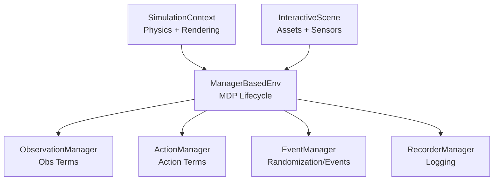

**Diagram sources**
- [simulation_context.py:41-800](file://source/isaaclab/isaaclab/sim/simulation_context.py#L41-800)
- [interactive_scene.py:41-786](file://source/isaaclab/isaaclab/scene/interactive_scene.py#L41-786)
- [manager_based_env.py:30-561](file://source/isaaclab/isaaclab/envs/manager_based_env.py#L30-561)
- [manager_base.py:127-415](file://source/isaaclab/isaaclab/managers/manager_base.py#L127-415)

## Detailed Component Analysis

### Simulation Context
The SimulationContext encapsulates physics stepping, rendering modes, and global settings. It supports:
- Physics time-step configuration, solver parameters, and gravity.
- Rendering presets (performance/balanced/quality) and RTX sensor detection.
- Fabric interface for efficient USD read/write operations.
- Headless and GUI-aware rendering modes with throttling and viewport control.

Key capabilities:
- RenderMode selection (NO_GUI_OR_RENDERING, NO_RENDERING, PARTIAL_RENDERING, FULL_RENDERING).
- Setting camera view and managing render intervals.
- Applying Carb settings and initializing stage contexts.

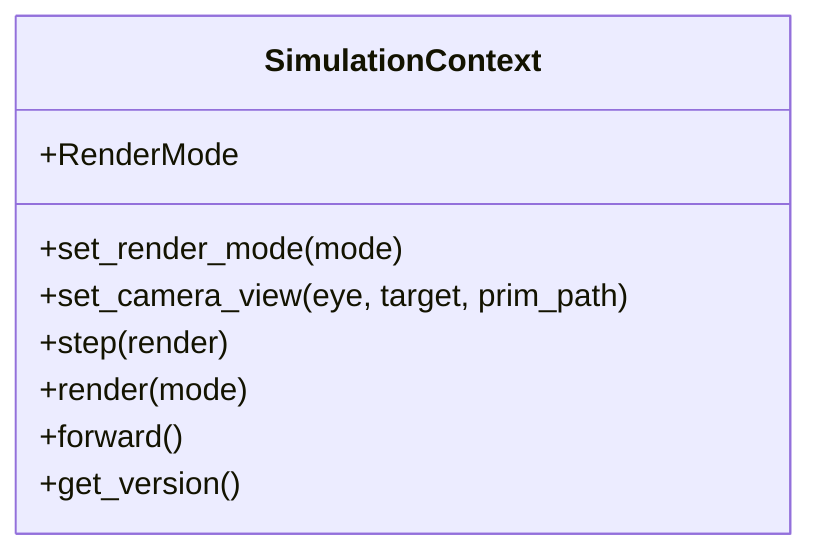

**Diagram sources**
- [simulation_context.py:41-800](file://source/isaaclab/isaaclab/sim/simulation_context.py#L41-800)

**Section sources**
- [simulation_context.py:41-800](file://source/isaaclab/isaaclab/sim/simulation_context.py#L41-800)

### Interactive Scene
InteractiveScene builds the simulation world from configuration, supporting:
- Environment cloning with replicate_physics for performance or heterogeneous setups.
- Registration of assets (articulations, deformable objects, rigid objects, collections), sensors, and extra prims.
- Collision filtering and terrain integration.
- Lazy sensor updates and state capture/reset utilities.

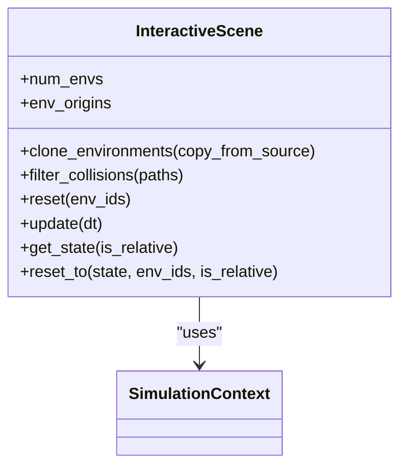

**Diagram sources**
- [interactive_scene.py:41-786](file://source/isaaclab/isaaclab/scene/interactive_scene.py#L41-786)
- [simulation_context.py:41-800](file://source/isaaclab/isaaclab/sim/simulation_context.py#L41-800)

**Section sources**
- [interactive_scene.py:41-786](file://source/isaaclab/isaaclab/scene/interactive_scene.py#L41-786)

### Managers Base
Managers provide modular, declarative control over environment behavior:
- ManagerBase defines the base class for manager terms with configuration parsing, scene entity resolution, and lifecycle hooks.
- ManagerTermBase provides the interface for manager terms, including reset and callable evaluation.

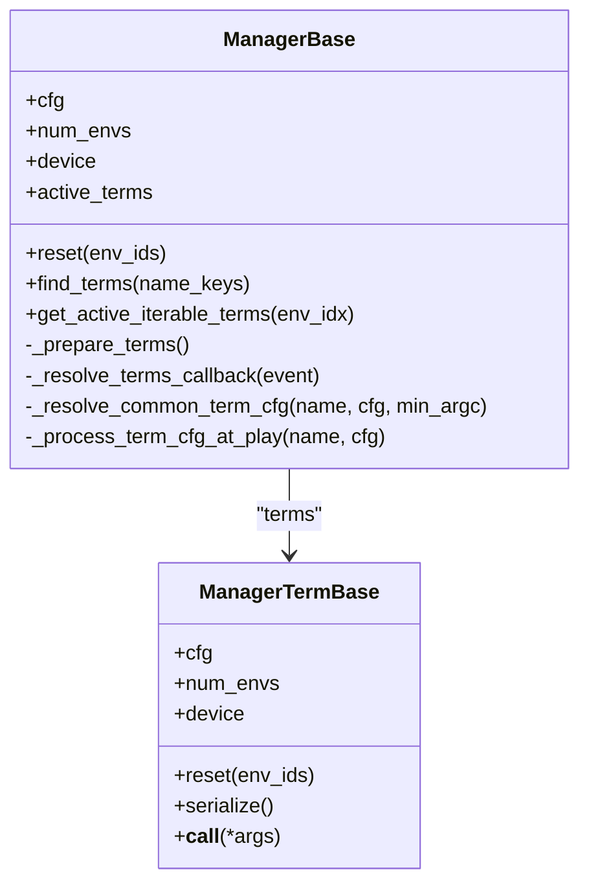

**Diagram sources**
- [manager_base.py:127-415](file://source/isaaclab/isaaclab/managers/manager_base.py#L127-415)

**Section sources**
- [manager_base.py:127-415](file://source/isaaclab/isaaclab/managers/manager_base.py#L127-415)

### Actuators
Actuator models augment simulated joints with drive dynamics:
- ActuatorBase defines buffers for effort/velocity limits, stiffness/damping, armature, and friction.
- Parameter parsing supports per-joint overrides via configuration or USD defaults.
- Computation methods convert desired commands into applied efforts with clipping.

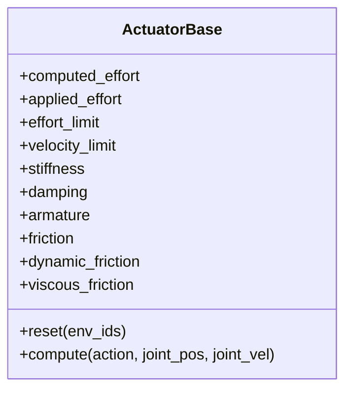

**Diagram sources**
- [actuator_base.py:20-365](file://source/isaaclab/isaaclab/actuators/actuator_base.py#L20-365)

**Section sources**
- [actuator_base.py:20-365](file://source/isaaclab/isaaclab/actuators/actuator_base.py#L20-365)

### Sensors
Sensor implementations follow a lazy-evaluation pattern:
- SensorBase initializes stage handles, registers callbacks, and manages debug visualization.
- Update cycles respect update periods and history lengths, with force recomputation for visualization or history.
- Provides hooks for initialization, buffer updates, and debug visualization callbacks.

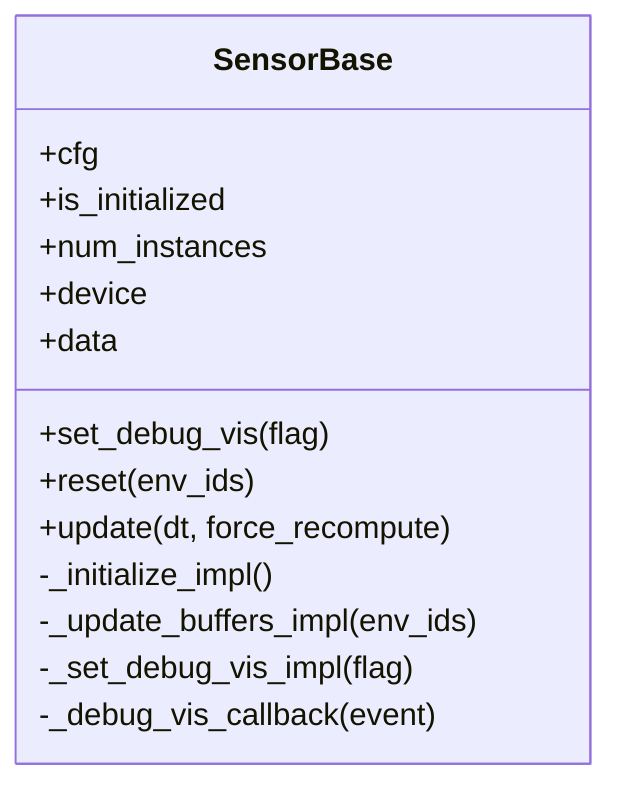

**Diagram sources**
- [sensor_base.py:34-358](file://source/isaaclab/isaaclab/sensors/sensor_base.py#L34-358)

**Section sources**
- [sensor_base.py:34-358](file://source/isaaclab/isaaclab/sensors/sensor_base.py#L34-358)

### Controllers
Differential IK controller computes end-effector trajectories:
- Supports position and pose commands with relative mode.
- Uses inverse-Jacobian methods (Moore-Penrose pseudo-inverse, SVD, transpose, damped least squares).
- Integrates with geometric Jacobians to compute desired joint positions.

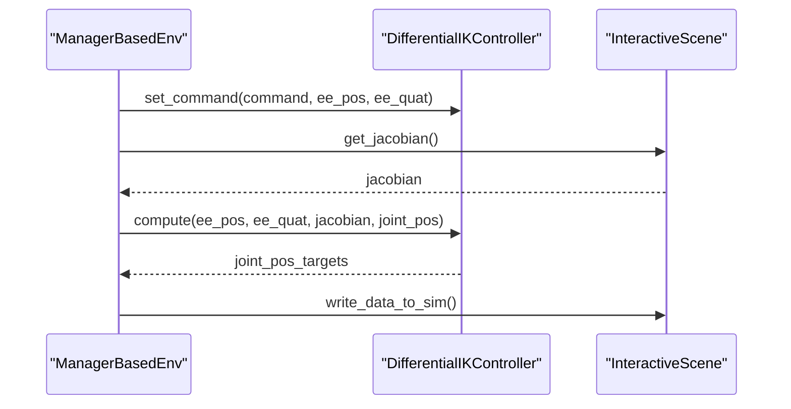

**Diagram sources**
- [differential_ik.py:98-174](file://source/isaaclab/isaaclab/controllers/differential_ik.py#L98-174)
- [manager_based_env.py:427-477](file://source/isaaclab/isaaclab/envs/manager_based_env.py#L427-477)
- [interactive_scene.py:477-496](file://source/isaaclab/isaaclab/scene/interactive_scene.py#L477-496)

**Section sources**
- [differential_ik.py:17-241](file://source/isaaclab/isaaclab/controllers/differential_ik.py#L17-241)
- [manager_based_env.py:427-477](file://source/isaaclab/isaaclab/envs/manager_based_env.py#L427-477)

### Environment Abstractions
ManagerBasedEnv provides the MDP interface:
- Initializes SimulationContext, InteractiveScene, and managers.
- Handles environment stepping with configurable decimation and physics time-step.
- Manages reset, step, and close lifecycles with event-driven randomization and recording.

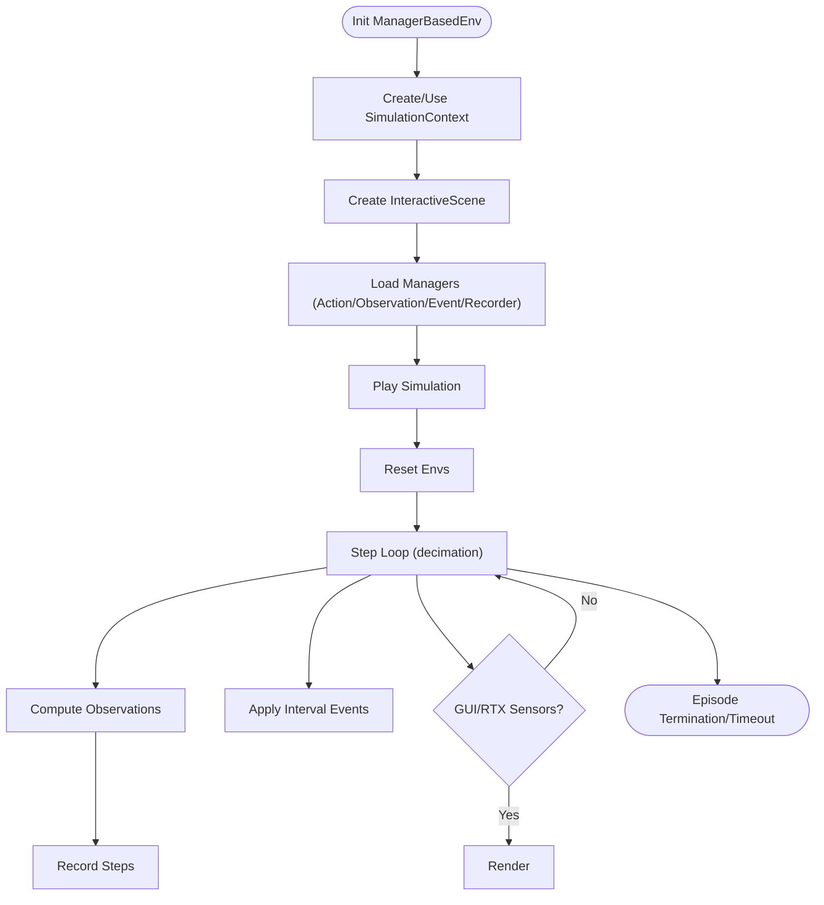

**Diagram sources**
- [manager_based_env.py:71-561](file://source/isaaclab/isaaclab/envs/manager_based_env.py#L71-561)

**Section sources**
- [manager_based_env.py:30-561](file://source/isaaclab/isaaclab/envs/manager_based_env.py#L30-561)

### Task-Specific Implementation: Go2 Parkour Environment
The Go2 environment integrates:
- Terrain generation (flat and rough) with curriculum and procedural composition.
- Height-scan perception via ray caster for terrain height prediction.
- Privileged observations (mass, COM, friction, PD gains) for policy and critic.
- Reward shaping tailored for parkour-like locomotion (velocity tracking, stability, work penalty).

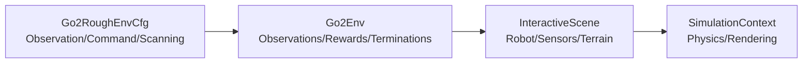

**Diagram sources**
- [go2_env_cfg.py:34-353](file://source/isaaclab_tasks/isaaclab_tasks/direct/go2/go2_env_cfg.py#L34-353)
- [go2_env.py:20-635](file://source/isaaclab_tasks/isaaclab_tasks/direct/go2/go2_env.py#L20-635)
- [interactive_scene.py:41-786](file://source/isaaclab/isaaclab/scene/interactive_scene.py#L41-786)
- [simulation_context.py:41-800](file://source/isaaclab/isaaclab/sim/simulation_context.py#L41-800)

**Section sources**
- [go2_env_cfg.py:34-353](file://source/isaaclab_tasks/isaaclab_tasks/direct/go2/go2_env_cfg.py#L34-353)
- [go2_env.py:20-635](file://source/isaaclab_tasks/isaaclab_tasks/direct/go2/go2_env.py#L20-635)

### Practical Examples and Integration Patterns
- Creating a manager-based environment with height-scan perception and terrain generation.
- Adding on-board sensors (camera, height scanner, contact sensors) to a quadruped robot and reading sensor outputs.

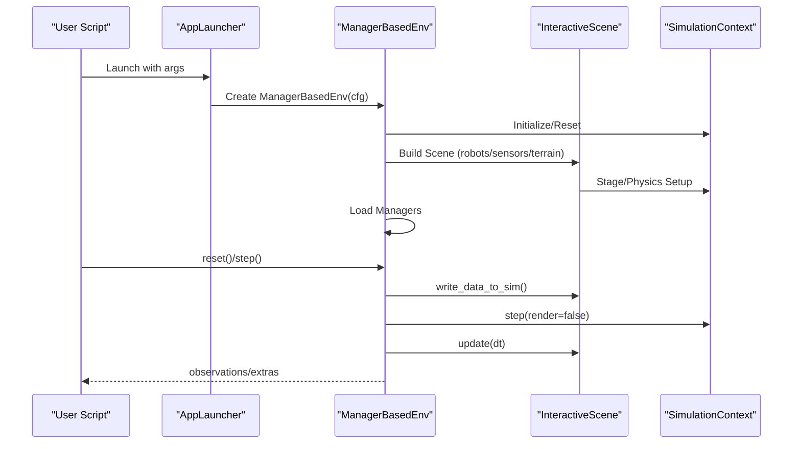

**Diagram sources**
- [create_quadruped_base_env.py:204-245](file://scripts/tutorials/03_envs/create_quadruped_base_env.py#L204-245)
- [manager_based_env.py:318-477](file://source/isaaclab/isaaclab/envs/manager_based_env.py#L318-477)
- [interactive_scene.py:463-496](file://source/isaaclab/isaaclab/scene/interactive_scene.py#L463-496)
- [simulation_context.py:600-687](file://source/isaaclab/isaaclab/sim/simulation_context.py#L600-687)

**Section sources**
- [create_quadruped_base_env.py:81-203](file://scripts/tutorials/03_envs/create_quadruped_base_env.py#L81-203)
- [add_sensors_on_robot.py:56-180](file://scripts/tutorials/04_sensors/add_sensors_on_robot.py#L56-180)

## Dependency Analysis
The framework exhibits clear separation of concerns with explicit dependencies:
- SimulationContext is a singleton used by ManagerBasedEnv and InteractiveScene.
- InteractiveScene depends on SimulationContext for stage and physics handles and manages assets/sensors.
- ManagerBasedEnv composes managers (Action/Observation/Event/Recorder) and orchestrates environment lifecycle.
- Actuators and sensors integrate with assets managed by InteractiveScene.
- Controllers operate on data provided by sensors and assets.

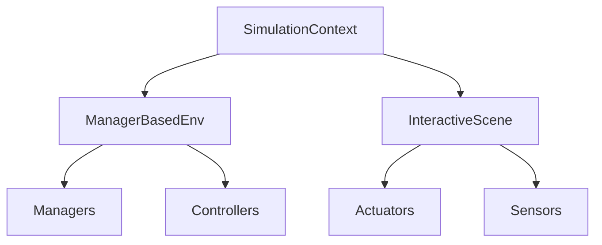

**Diagram sources**
- [simulation_context.py:41-800](file://source/isaaclab/isaaclab/sim/simulation_context.py#L41-800)
- [interactive_scene.py:41-786](file://source/isaaclab/isaaclab/scene/interactive_scene.py#L41-786)
- [manager_based_env.py:30-561](file://source/isaaclab/isaaclab/envs/manager_based_env.py#L30-561)
- [actuator_base.py:20-365](file://source/isaaclab/isaaclab/actuators/actuator_base.py#L20-365)
- [sensor_base.py:34-358](file://source/isaaclab/isaaclab/sensors/sensor_base.py#L34-358)
- [differential_ik.py:17-241](file://source/isaaclab/isaaclab/controllers/differential_ik.py#L17-241)
- [manager_base.py:127-415](file://source/isaaclab/isaaclab/managers/manager_base.py#L127-415)

**Section sources**
- [simulation_context.py:41-800](file://source/isaaclab/isaaclab/sim/simulation_context.py#L41-800)
- [interactive_scene.py:41-786](file://source/isaaclab/isaaclab/scene/interactive_scene.py#L41-786)
- [manager_based_env.py:30-561](file://source/isaaclab/isaaclab/envs/manager_based_env.py#L30-561)

## Performance Considerations
- Decimation and time-stepping: Configure sim.dt and env.decimation to balance physics fidelity and control frequency.
- Rendering modes: Use RenderMode.NO_RENDERING or PARTIAL_RENDERING for headless training to reduce overhead.
- Physics cloning: Enable replicate_physics for homogeneous scenes to accelerate environment instantiation.
- Sensor update periods: Tune sensor update_period to align with control frequency and reduce computation.
- Fabric interface: Enable fabric when available to minimize USD read/write overhead.
- GPU utilization: Ensure device alignment and avoid frequent CUDA device switches during reset/step.

[No sources needed since this section provides general guidance]

## Troubleshooting Guide
Common issues and resolutions:
- Simulation context conflicts: ManagerBasedEnv enforces single SimulationContext creation; avoid creating multiple instances.
- Sensor initialization timing: Sensors initialize on simulator PLAY events; ensure scene is reset before first play.
- Rendering artifacts: Use render() calls judiciously; leverage throttling in NO_RENDERING mode.
- Sensor callbacks: Ensure proper cleanup of callbacks on deletion to prevent crashes.
- Actuator parameter mismatches: Use _parse_joint_parameter to reconcile configuration vs USD defaults.

**Section sources**
- [manager_based_env.py:95-104](file://source/isaaclab/isaaclab/envs/manager_based_env.py#L95-104)
- [sensor_base.py:288-343](file://source/isaaclab/isaaclab/sensors/sensor_base.py#L288-343)
- [simulation_context.py:644-691](file://source/isaaclab/isaaclab/sim/simulation_context.py#L644-691)
- [actuator_base.py:295-353](file://source/isaaclab/isaaclab/actuators/actuator_base.py#L295-353)

## Conclusion
The Extreme Quadruped Parkour system leverages a modular, manager-based architecture within Isaac Lab to compose simulation, perception, control, and environment management. The SimulationContext, InteractiveScene, and ManagerBasedEnv provide a robust foundation, while Actuators, Sensors, and Controllers offer extensible building blocks for complex locomotion tasks. The provided examples demonstrate practical integration patterns for sensor addition, environment creation, and policy-driven control on challenging parkour terrains.