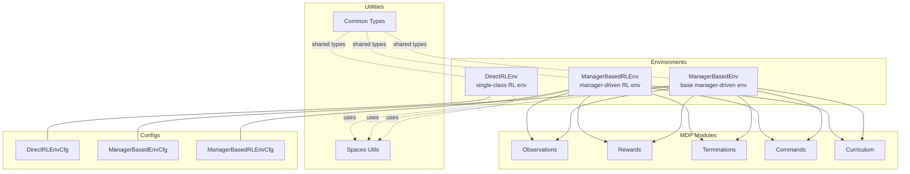
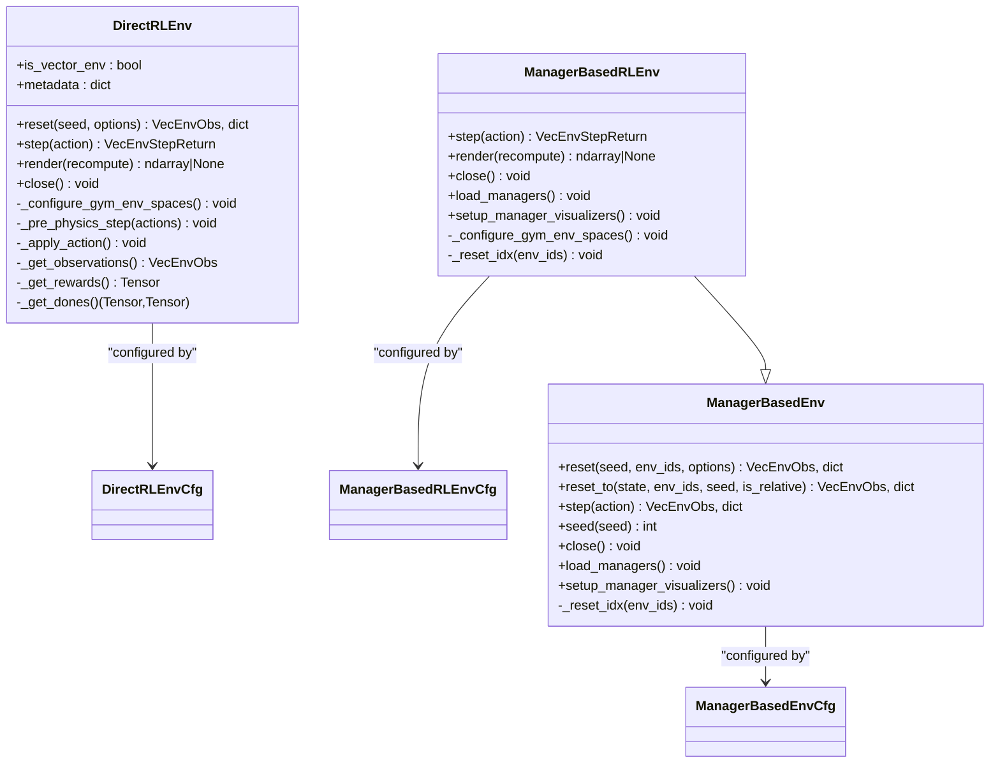
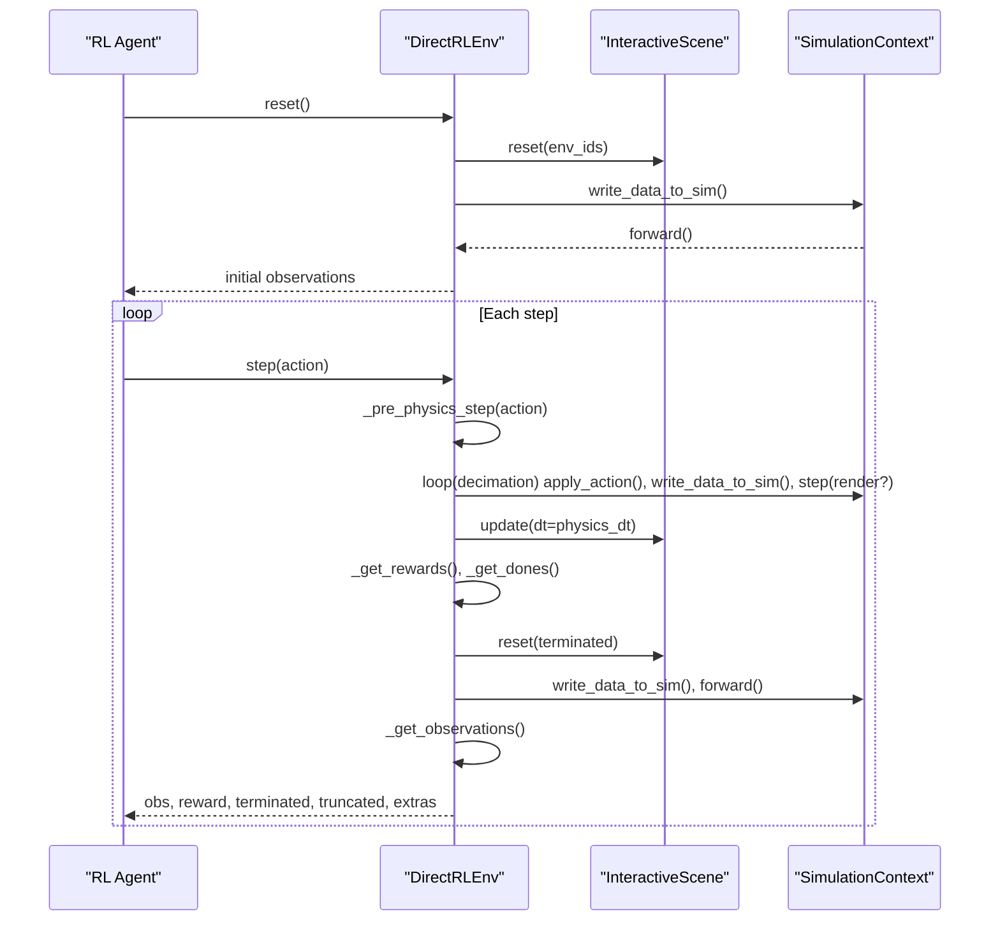
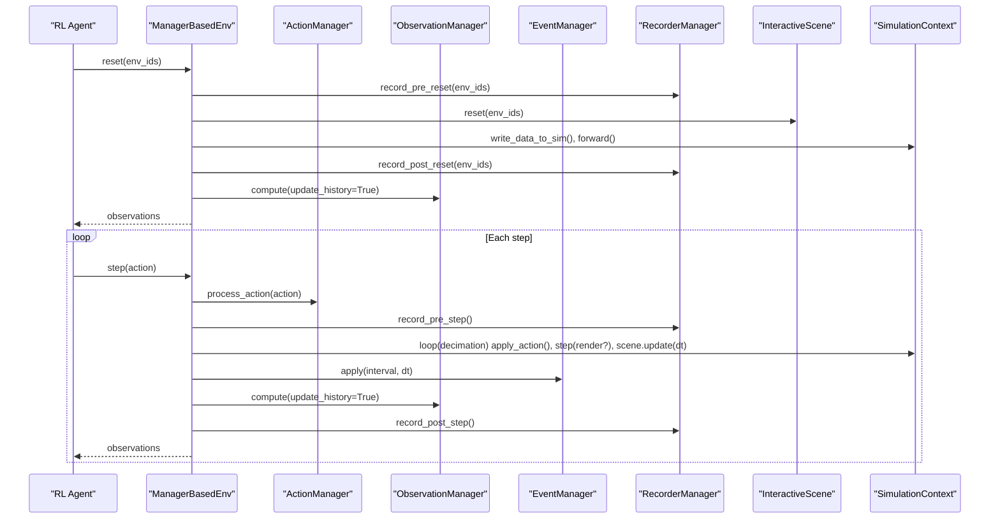
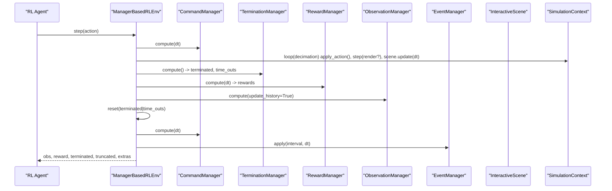
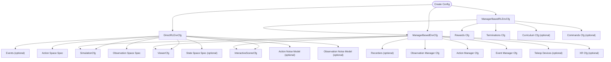
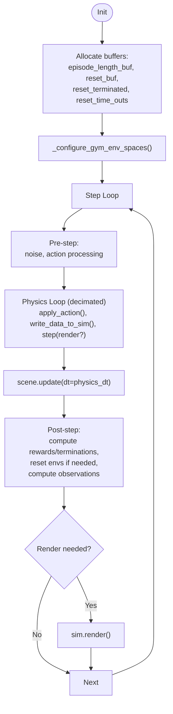
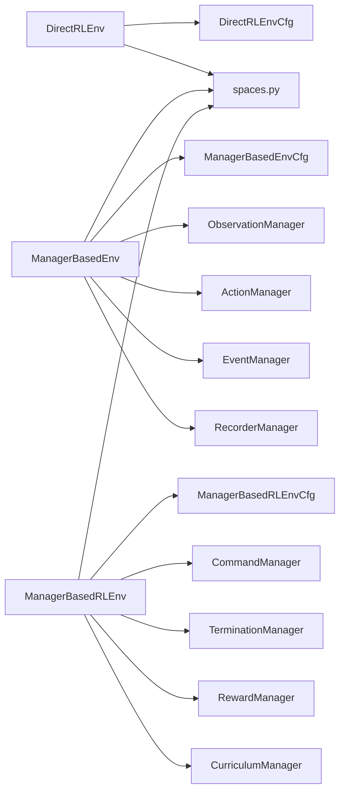

# Environment Management

<cite>
**Referenced Files in This Document**
- [envs/__init__.py](file://source/isaaclab/isaaclab/envs/__init__.py)
- [envs/common.py](file://source/isaaclab/isaaclab/envs/common.py)
- [envs/direct_rl_env.py](file://source/isaaclab/isaaclab/envs/direct_rl_env.py)
- [envs/direct_rl_env_cfg.py](file://source/isaaclab/isaaclab/envs/direct_rl_env_cfg.py)
- [envs/manager_based_env.py](file://source/isaaclab/isaaclab/envs/manager_based_env.py)
- [envs/manager_based_env_cfg.py](file://source/isaaclab/isaaclab/envs/manager_based_env_cfg.py)
- [envs/manager_based_rl_env.py](file://source/isaaclab/isaaclab/envs/manager_based_rl_env.py)
- [envs/manager_based_rl_env_cfg.py](file://source/isaaclab/isaaclab/envs/manager_based_rl_env_cfg.py)
- [envs/utils/spaces.py](file://source/isaaclab/isaaclab/envs/utils/spaces.py)
- [envs/mdp/observations.py](file://source/isaaclab/isaaclab/envs/mdp/observations.py)
- [envs/mdp/rewards.py](file://source/isaaclab/isaaclab/envs/mdp/rewards.py)
- [envs/mdp/terminations.py](file://source/isaaclab/isaaclab/envs/mdp/terminations.py)
</cite>

## Table of Contents
1. [Introduction](#introduction)
2. [Project Structure](#project-structure)
3. [Core Components](#core-components)
4. [Architecture Overview](#architecture-overview)
5. [Detailed Component Analysis](#detailed-component-analysis)
6. [Dependency Analysis](#dependency-analysis)
7. [Performance Considerations](#performance-considerations)
8. [Troubleshooting Guide](#troubleshooting-guide)
9. [Conclusion](#conclusion)
10. [Appendices](#appendices)

## Introduction
This document explains the environment management component of the Extreme Quadruped Parkour framework. It covers the environment lifecycle, configuration system, state management, and interaction patterns with simulation and control systems. The focus is on three design workflows:
- Direct RL environment: a single-class implementation for rapid prototyping.
- Manager-based environment: a modular decomposition into managers for observations, actions, events, rewards, terminations, and curriculum.
- Manager-based RL environment: the manager-based workflow extended with MDP signals (rewards, terminations, commands, curriculum).

The guide provides both conceptual overviews for beginners and technical details for advanced users implementing custom environments.

## Project Structure
The environment package centers around:
- Base environment classes and configuration classes for direct and manager-based workflows.
- MDP building blocks (observations, rewards, terminations, commands, curriculum) used by manager-based environments.
- Utilities for Gym space handling and environment-wide types.

**Diagram sources**
- [envs/direct_rl_env.py:40-697](file://source/isaaclab/isaaclab/envs/direct_rl_env.py#L40-L697)
- [envs/manager_based_env.py:30-561](file://source/isaaclab/isaaclab/envs/manager_based_env.py#L30-L561)
- [envs/manager_based_rl_env.py:26-397](file://source/isaaclab/isaaclab/envs/manager_based_rl_env.py#L26-L397)
- [envs/direct_rl_env_cfg.py:18-232](file://source/isaaclab/isaaclab/envs/direct_rl_env_cfg.py#L18-L232)
- [envs/manager_based_env_cfg.py:27-134](file://source/isaaclab/isaaclab/envs/manager_based_env_cfg.py#L27-L134)
- [envs/manager_based_rl_env_cfg.py:14-81](file://source/isaaclab/isaaclab/envs/manager_based_rl_env_cfg.py#L14-L81)
- [envs/mdp/observations.py:1-690](file://source/isaaclab/isaaclab/envs/mdp/observations.py#L1-L690)
- [envs/mdp/rewards.py:1-320](file://source/isaaclab/isaaclab/envs/mdp/rewards.py#L1-L320)
- [envs/mdp/terminations.py:1-162](file://source/isaaclab/isaaclab/envs/mdp/terminations.py#L1-L162)
- [envs/utils/spaces.py:15-222](file://source/isaaclab/isaaclab/envs/utils/spaces.py#L15-L222)
- [envs/common.py:19-147](file://source/isaaclab/isaaclab/envs/common.py#L19-L147)

**Section sources**
- [envs/__init__.py:6-58](file://source/isaaclab/isaaclab/envs/__init__.py#L6-L58)

## Core Components
- DirectRLEnv: Implements a vectorized RL environment with configurable action/observation/state spaces, noise models, and rendering. It manages scene creation, event application, and the environment step loop with decimated physics.
- ManagerBasedEnv: Base environment that composes managers for observations, actions, events, and recordings. It initializes managers after simulator reset and provides reset/step APIs.
- ManagerBasedRLEnv: Extends the manager-based base with reward computation, termination detection, command generation, and curriculum updates, returning Gym-compatible signals (obs, rewards, terminated, truncated, extras).
- Common types and spaces: Define shared types (VecEnvObs, VecEnvStepReturn, ViewerCfg, SpaceType) and utilities to convert space specs to Gym spaces and sample tensors.

Key responsibilities:
- Lifecycle: initialization, reset, step, render, close.
- Configuration: simulation parameters, viewer, seed, decimation, episode length, scene, events, action/observation/state spaces, noise models, UI window.
- Interaction: writing actions to simulation, reading sensor/asset states, applying rewards/terminations, and exporting IO descriptors.

**Section sources**
- [envs/direct_rl_env.py:40-697](file://source/isaaclab/isaaclab/envs/direct_rl_env.py#L40-L697)
- [envs/manager_based_env.py:30-561](file://source/isaaclab/isaaclab/envs/manager_based_env.py#L30-L561)
- [envs/manager_based_rl_env.py:26-397](file://source/isaaclab/isaaclab/envs/manager_based_rl_env.py#L26-L397)
- [envs/common.py:19-147](file://source/isaaclab/isaaclab/envs/common.py#L19-L147)
- [envs/utils/spaces.py:15-222](file://source/isaaclab/isaaclab/envs/utils/spaces.py#L15-L222)

## Architecture Overview
The environment architecture separates concerns via composition and configuration:
- SimulationContext controls physics and rendering.
- InteractiveScene manages assets, sensors, and environment origins.
- Managers encapsulate domain logic: actions, observations, events, rewards, terminations, commands, curriculum, and recording.
- Environment classes orchestrate the managers and expose Gym-compatible APIs.

**Diagram sources**
- [envs/direct_rl_env.py:40-697](file://source/isaaclab/isaaclab/envs/direct_rl_env.py#L40-L697)
- [envs/manager_based_env.py:30-561](file://source/isaaclab/isaaclab/envs/manager_based_env.py#L30-L561)
- [envs/manager_based_rl_env.py:26-397](file://source/isaaclab/isaaclab/envs/manager_based_rl_env.py#L26-L397)
- [envs/direct_rl_env_cfg.py:18-232](file://source/isaaclab/isaaclab/envs/direct_rl_env_cfg.py#L18-L232)
- [envs/manager_based_env_cfg.py:27-134](file://source/isaaclab/isaaclab/envs/manager_based_env_cfg.py#L27-L134)
- [envs/manager_based_rl_env_cfg.py:14-81](file://source/isaaclab/isaaclab/envs/manager_based_rl_env_cfg.py#L14-L81)

## Detailed Component Analysis

### Direct RL Environment
DirectRLEnv is a single-class environment ideal for rapid prototyping. It:
- Creates a SimulationContext and InteractiveScene.
- Applies pre-startup events, starts the simulator, and populates scene buffers.
- Manages action and observation spaces via Gymnasium, supports optional state space for asymmetric actor-critics.
- Implements a decimated physics loop, applies action/observation noise, computes rewards and dones, resets terminated environments, and renders when needed.

**Diagram sources**
- [envs/direct_rl_env.py:273-400](file://source/isaaclab/isaaclab/envs/direct_rl_env.py#L273-L400)
- [envs/direct_rl_env.py:628-687](file://source/isaaclab/isaaclab/envs/direct_rl_env.py#L628-L687)

**Section sources**
- [envs/direct_rl_env.py:40-697](file://source/isaaclab/isaaclab/envs/direct_rl_env.py#L40-L697)
- [envs/direct_rl_env_cfg.py:18-232](file://source/isaaclab/isaaclab/envs/direct_rl_env_cfg.py#L18-L232)
- [envs/utils/spaces.py:15-94](file://source/isaaclab/isaaclab/envs/utils/spaces.py#L15-L94)

### Manager-Based Environment
ManagerBasedEnv provides a modular architecture:
- Scene creation and initialization.
- Manager loading after simulator reset: event, recorder, action, observation managers.
- Step loop mirrors the direct environment but delegates to managers for processing actions and computing observations.

**Diagram sources**
- [envs/manager_based_env.py:318-477](file://source/isaaclab/isaaclab/envs/manager_based_env.py#L318-L477)
- [envs/manager_based_env.py:271-305](file://source/isaaclab/isaaclab/envs/manager_based_env.py#L271-L305)

**Section sources**
- [envs/manager_based_env.py:30-561](file://source/isaaclab/isaaclab/envs/manager_based_env.py#L30-L561)
- [envs/manager_based_env_cfg.py:27-134](file://source/isaaclab/isaaclab/envs/manager_based_env_cfg.py#L27-L134)

### Manager-Based RL Environment
ManagerBasedRLEnv extends ManagerBasedEnv with MDP signals:
- Loads command, termination, reward, and curriculum managers.
- Computes rewards and terminations per step, resets terminated environments, updates commands, and exports IO descriptors.

**Diagram sources**
- [envs/manager_based_rl_env.py:154-243](file://source/isaaclab/isaaclab/envs/manager_based_rl_env.py#L154-L243)
- [envs/manager_based_rl_env.py:110-137](file://source/isaaclab/isaaclab/envs/manager_based_rl_env.py#L110-L137)

**Section sources**
- [envs/manager_based_rl_env.py:26-397](file://source/isaaclab/isaaclab/envs/manager_based_rl_env.py#L26-L397)
- [envs/manager_based_rl_env_cfg.py:14-81](file://source/isaaclab/isaaclab/envs/manager_based_rl_env_cfg.py#L14-L81)

### Environment Configuration System
Configuration classes define environment behavior:
- DirectRLEnvCfg: simulation, viewer, UI window, seed, decimation, episode length, scene, events, action/observation/state spaces, noise models, rendering flags, XR configuration.
- ManagerBasedEnvCfg: viewer, simulation, UI window, seed, decimation, scene, recorders, observations/actions/event managers, rendering flags, XR, teleoperation devices, IO descriptor export.
- ManagerBasedRLEnvCfg: inherits base config and adds rewards, terminations, curriculum, and commands.

**Diagram sources**
- [envs/direct_rl_env_cfg.py:18-232](file://source/isaaclab/isaaclab/envs/direct_rl_env_cfg.py#L18-L232)
- [envs/manager_based_env_cfg.py:27-134](file://source/isaaclab/isaaclab/envs/manager_based_env_cfg.py#L27-L134)
- [envs/manager_based_rl_env_cfg.py:14-81](file://source/isaaclab/isaaclab/envs/manager_based_rl_env_cfg.py#L14-L81)

**Section sources**
- [envs/direct_rl_env_cfg.py:18-232](file://source/isaaclab/isaaclab/envs/direct_rl_env_cfg.py#L18-L232)
- [envs/manager_based_env_cfg.py:27-134](file://source/isaaclab/isaaclab/envs/manager_based_env_cfg.py#L27-L134)
- [envs/manager_based_rl_env_cfg.py:14-81](file://source/isaaclab/isaaclab/envs/manager_based_rl_env_cfg.py#L14-L81)

### State Management and Interaction Patterns
- State buffers: episode length, reset flags (terminated, time_outs), common step counter, extras dictionary for logs/metrics.
- Decimation loop: actions applied decimated; sensors/scene updated at physics dt; optional rendering at render interval.
- Noise models: optional action and observation noise applied before/after environment computations.
- Rendering: supports human and rgb_array modes; validates render mode against simulation capabilities.
- IO descriptors: exportable metadata for observations, actions, articulations, and scene.

**Diagram sources**
- [envs/direct_rl_env.py:313-400](file://source/isaaclab/isaaclab/envs/direct_rl_env.py#L313-L400)
- [envs/manager_based_env.py:427-477](file://source/isaaclab/isaaclab/envs/manager_based_env.py#L427-L477)
- [envs/manager_based_rl_env.py:154-243](file://source/isaaclab/isaaclab/envs/manager_based_rl_env.py#L154-L243)

**Section sources**
- [envs/direct_rl_env.py:183-224](file://source/isaaclab/isaaclab/envs/direct_rl_env.py#L183-L224)
- [envs/manager_based_env.py:126-131](file://source/isaaclab/isaaclab/envs/manager_based_env.py#L126-L131)
- [envs/manager_based_rl_env.py:75-91](file://source/isaaclab/isaaclab/envs/manager_based_rl_env.py#L75-L91)

### Environment Utilities
- Spaces utilities: convert space specs to Gymnasium spaces, sample tensors, serialize/deserialize spaces, and replace spaces in configs for persistence.
- Common types: VecEnvObs, VecEnvStepReturn, ViewerCfg, SpaceType, and multi-agent variants.

**Section sources**
- [envs/utils/spaces.py:15-222](file://source/isaaclab/isaaclab/envs/utils/spaces.py#L15-L222)
- [envs/common.py:19-147](file://source/isaaclab/isaaclab/envs/common.py#L19-L147)

### MDP Building Blocks
- Observations: root/body/joint states, sensor data (IMU, cameras, raycasters), actions, commands, time.
- Rewards: alive/terminated penalties, orientation/height/root velocity penalties, joint torques/velocities/accelerations, contact-based penalties, action rate/energy penalties, velocity tracking rewards.
- Termination: time-out, command resampling, bad orientation, root height limits, joint position/velocity/effort limits, contact-based illegal contacts.

These are consumed by managers in manager-based environments to construct policies and control loops.

**Section sources**
- [envs/mdp/observations.py:1-690](file://source/isaaclab/isaaclab/envs/mdp/observations.py#L1-L690)
- [envs/mdp/rewards.py:1-320](file://source/isaaclab/isaaclab/envs/mdp/rewards.py#L1-L320)
- [envs/mdp/terminations.py:1-162](file://source/isaaclab/isaaclab/envs/mdp/terminations.py#L1-L162)

## Dependency Analysis
Environment classes depend on:
- SimulationContext for stepping and rendering.
- InteractiveScene for asset/sensor state and environment origins.
- Managers for modular MDP logic.
- Gymnasium for vectorized environments and spaces.
- IO descriptors export utilities.

**Diagram sources**
- [envs/direct_rl_env.py:73-104](file://source/isaaclab/isaaclab/envs/direct_rl_env.py#L73-L104)
- [envs/manager_based_env.py:71-104](file://source/isaaclab/isaaclab/envs/manager_based_env.py#L71-L104)
- [envs/manager_based_rl_env.py:67-82](file://source/isaaclab/isaaclab/envs/manager_based_rl_env.py#L67-L82)
- [envs/utils/spaces.py:15-94](file://source/isaaclab/isaaclab/envs/utils/spaces.py#L15-L94)

**Section sources**
- [envs/direct_rl_env.py:27-37](file://source/isaaclab/isaaclab/envs/direct_rl_env.py#L27-L37)
- [envs/manager_based_env.py:17-27](file://source/isaaclab/isaaclab/envs/manager_based_env.py#L17-L27)
- [envs/manager_based_rl_env.py:18-24](file://source/isaaclab/isaaclab/envs/manager_based_rl_env.py#L18-L24)

## Performance Considerations
- Decimation: Tune decimation vs. physics dt to balance stability and throughput.
- Rendering: Rendering inside the physics loop is optional; use render_interval judiciously to avoid redundant renders.
- Noise models: Adding noise increases computation; apply only when needed.
- Sensors: RTX sensors incur overhead; disable rerender_on_reset unless observations require fresh sensor data.
- Vectorization: The environment is vectorized; minimize per-step Python overhead and leverage tensorized operations.

[No sources needed since this section provides general guidance]

## Troubleshooting Guide
- Simulation context conflicts: Creating multiple SimulationContext instances raises an error; ensure only one instance per environment lifecycle.
- Render mode mismatch: Requesting rgb_array without proper simulation render mode raises an error; set the simulation render mode accordingly.
- Seed determinism: Set seed in configuration for deterministic runs; warnings are logged if seed is missing.
- Assets loading: Optionally wait for textures to finish loading before rendering or returning observations.
- Debug visualization: Toggle debug visualization if the environment supports it; subscription to post-update events is managed internally.

**Section sources**
- [envs/direct_rl_env.py:85-104](file://source/isaaclab/isaaclab/envs/direct_rl_env.py#L85-L104)
- [envs/direct_rl_env.py:422-484](file://source/isaaclab/isaaclab/envs/direct_rl_env.py#L422-L484)
- [envs/direct_rl_env.py:94-98](file://source/isaaclab/isaaclab/envs/direct_rl_env.py#L94-L98)
- [envs/manager_based_env.py:161-171](file://source/isaaclab/isaaclab/envs/manager_based_env.py#L161-L171)

## Conclusion
The environment management component offers two complementary design workflows:
- DirectRLEnv for fast iteration with a single class.
- ManagerBasedEnv and ManagerBasedRLEnv for scalable, modular environments with rich MDP logic.

By leveraging configuration classes, manager-based modularity, and utilities for spaces and IO descriptors, developers can implement custom environments efficiently while maintaining strong integration with simulation and control systems.

[No sources needed since this section summarizes without analyzing specific files]

## Appendices

### Practical Examples and Integration Patterns
- Direct environment setup: Instantiate a DirectRLEnv with a DirectRLEnvCfg that defines simulation, viewer, scene, and action/observation spaces. Initialize, reset, and step in a loop; optionally render.
- Manager-based environment setup: Configure ManagerBasedEnvCfg with scene, managers (observations, actions, events), and optional recorders. Call load_managers after simulator reset; then reset and step.
- RL environment setup: Configure ManagerBasedRLEnvCfg with rewards, terminations, commands, and curriculum; load managers and step to receive Gym-compatible signals.

[No sources needed since this section provides general guidance]