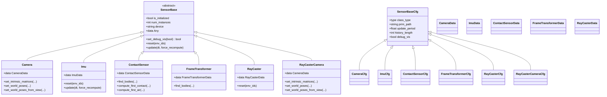
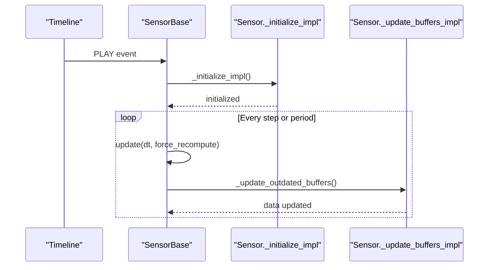
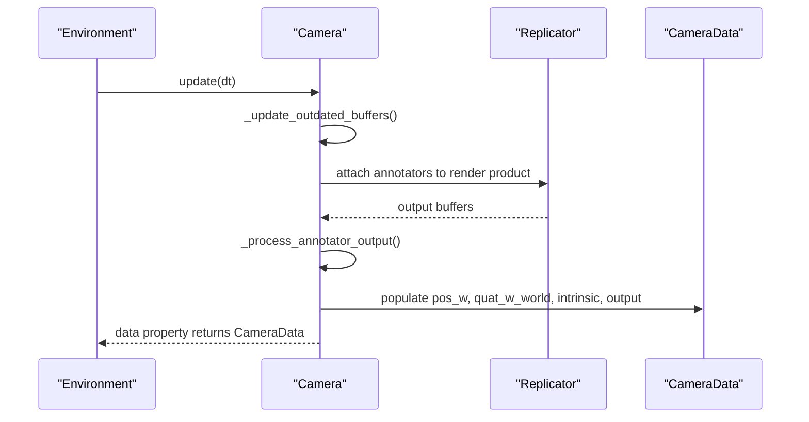
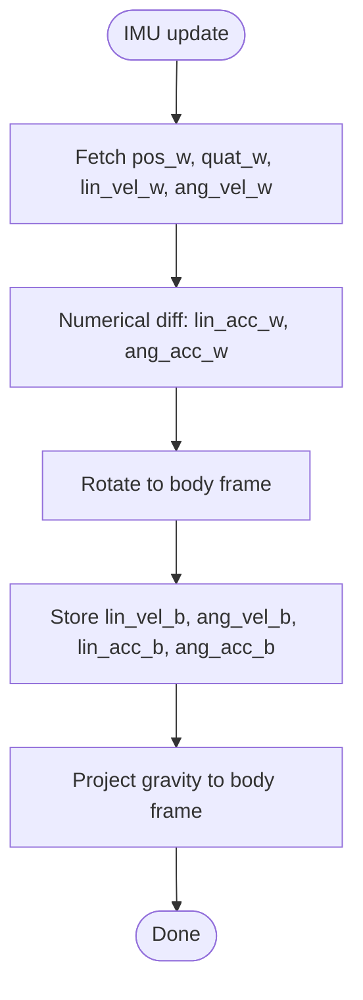
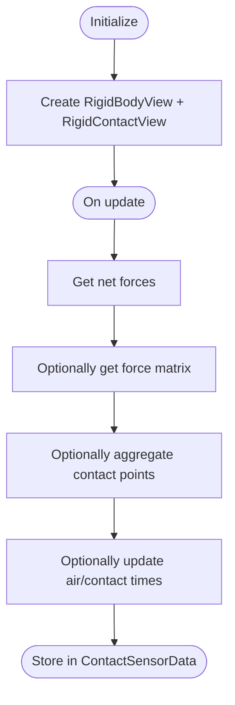
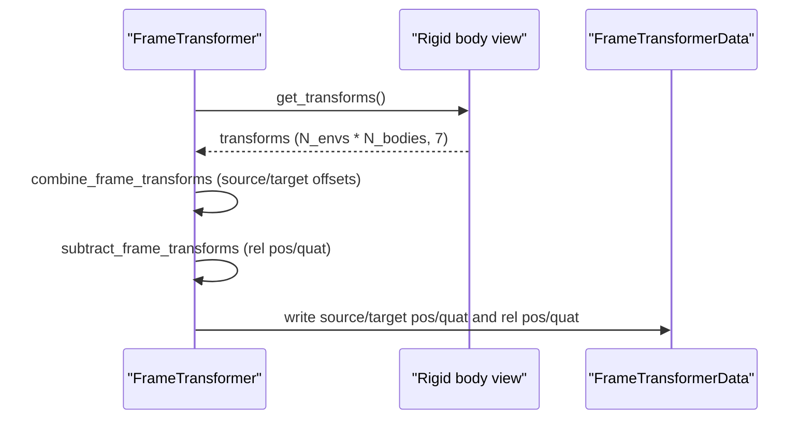
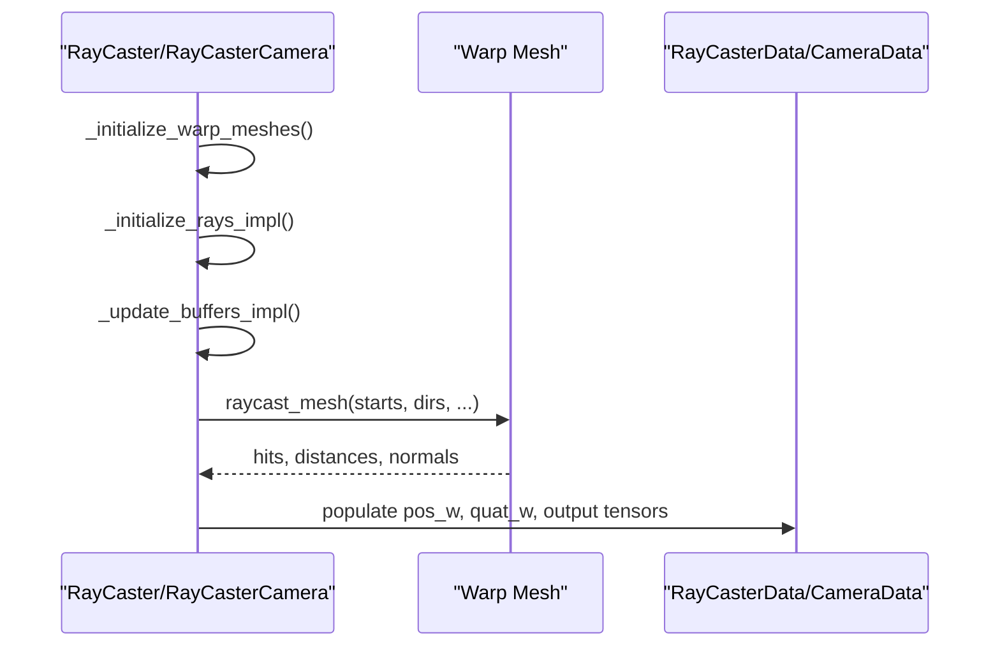
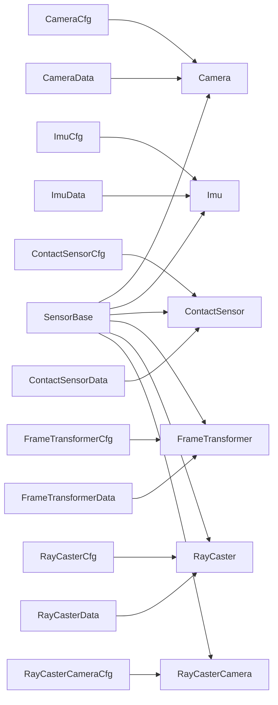

# Sensor System

<cite>
**Referenced Files in This Document**
- [sensor_base.py](file://source/isaaclab/isaaclab/sensors/sensor_base.py)
- [sensor_base_cfg.py](file://source/isaaclab/isaaclab/sensors/sensor_base_cfg.py)
- [camera.py](file://source/isaaclab/isaaclab/sensors/camera/camera.py)
- [camera_cfg.py](file://source/isaaclab/isaaclab/sensors/camera/camera_cfg.py)
- [camera_data.py](file://source/isaaclab/isaaclab/sensors/camera/camera_data.py)
- [imu.py](file://source/isaaclab/isaaclab/sensors/imu/imu.py)
- [imu_cfg.py](file://source/isaaclab/isaaclab/sensors/imu/imu_cfg.py)
- [imu_data.py](file://source/isaaclab/isaaclab/sensors/imu/imu_data.py)
- [contact_sensor.py](file://source/isaaclab/isaaclab/sensors/contact_sensor/contact_sensor.py)
- [contact_sensor_cfg.py](file://source/isaaclab/isaaclab/sensors/contact_sensor/contact_sensor_cfg.py)
- [contact_sensor_data.py](file://source/isaaclab/isaaclab/sensors/contact_sensor/contact_sensor_data.py)
- [frame_transformer.py](file://source/isaaclab/isaaclab/sensors/frame_transformer/frame_transformer.py)
- [frame_transformer_cfg.py](file://source/isaaclab/isaaclab/sensors/frame_transformer/frame_transformer_cfg.py)
- [frame_transformer_data.py](file://source/isaaclab/isaaclab/sensors/frame_transformer/frame_transformer_data.py)
- [ray_caster.py](file://source/isaaclab/isaaclab/sensors/ray_caster/ray_caster.py)
- [ray_caster_cfg.py](file://source/isaaclab/isaaclab/sensors/ray_caster/ray_caster_cfg.py)
- [ray_caster_data.py](file://source/isaaclab/isaaclab/sensors/ray_caster/ray_caster_data.py)
- [ray_caster_camera.py](file://source/isaaclab/isaaclab/sensors/ray_caster/ray_caster_camera.py)
- [ray_caster_camera_cfg.py](file://source/isaaclab/isaaclab/sensors/ray_caster/ray_caster_camera_cfg.py)
- [__init__.py](file://source/isaaclab/isaaclab/sensors/__init__.py)
- [add_sensors_on_robot.py](file://scripts/tutorials/04_sensors/add_sensors_on_robot.py)
- [cameras.py](file://scripts/demos/sensors/cameras.py)
- [imu_sensor.py](file://scripts/demos/sensors/imu_sensor.py)
- [contact_sensor.py](file://scripts/demos/sensors/contact_sensor.py)
- [frame_transformer_sensor.py](file://scripts/demos/sensors/frame_transformer_sensor.py)
- [raycaster_sensor.py](file://scripts/demos/sensors/raycaster_sensor.py)
</cite>

## Table of Contents
1. [Introduction](#introduction)
2. [Project Structure](#project-structure)
3. [Core Components](#core-components)
4. [Architecture Overview](#architecture-overview)
5. [Detailed Component Analysis](#detailed-component-analysis)
6. [Dependency Analysis](#dependency-analysis)
7. [Performance Considerations](#performance-considerations)
8. [Troubleshooting Guide](#troubleshooting-guide)
9. [Conclusion](#conclusion)
10. [Appendices](#appendices)

## Introduction
This document describes the sensor system component of the Extreme Quadruped Parkour framework. It explains the multi-modal sensor integration architecture, the base class design, configuration system, and implementations for cameras, IMUs, contact sensors, frame transformers, and ray-casters. It covers the sensor data processing pipeline, coordinate transformations, and observation generation mechanisms. Practical examples demonstrate sensor configuration, data collection, and integration with control systems.

## Project Structure
The sensor system is organized under the sensors package with modular sub-packages for each sensor type. Each sensor inherits from a common base class and exposes a typed configuration class and a data container. The package also exports a unified namespace for easy imports.

```mermaid
graph TB
subgraph "Sensors Package"
SB["sensor_base.py"]
SBCFG["sensor_base_cfg.py"]
subgraph "Camera"
CAM["camera.py"]
CAMCFG["camera_cfg.py"]
CAMDATA["camera_data.py"]
end
subgraph "IMU"
IMU["imu.py"]
IMUCFG["imu_cfg.py"]
IMUDATA["imu_data.py"]
end
subgraph "Contact Sensor"
CS["contact_sensor.py"]
CSCFG["contact_sensor_cfg.py"]
CSDATA["contact_sensor_data.py"]
end
subgraph "Frame Transformer"
FT["frame_transformer.py"]
FTCFG["frame_transformer_cfg.py"]
FTDATA["frame_transformer_data.py"]
end
subgraph "Ray Caster"
RC["ray_caster.py"]
RCCFG["ray_caster_cfg.py"]
RCDATA["ray_caster_data.py"]
end
subgraph "Ray Caster Camera"
RCCAM["ray_caster_camera.py"]
RCCAMCFG["ray_caster_camera_cfg.py"]
end
end
INIT["__init__.py"]
INIT --> SB
INIT --> SBCFG
INIT --> CAM
INIT --> IMU
INIT --> CS
INIT --> FT
INIT --> RC
INIT --> RCCAM
```

**Diagram sources**
- [__init__.py:1-45](file://source/isaaclab/isaaclab/sensors/__init__.py#L1-45)
- [sensor_base.py:1-358](file://source/isaaclab/isaaclab/sensors/sensor_base.py#L1-358)
- [sensor_base_cfg.py:1-43](file://source/isaaclab/isaaclab/sensors/sensor_base_cfg.py#L1-43)
- [camera.py:1-720](file://source/isaaclab/isaaclab/sensors/camera/camera.py#L1-720)
- [camera_cfg.py:1-143](file://source/isaaclab/isaaclab/sensors/camera/camera_cfg.py#L1-143)
- [camera_data.py:1-92](file://source/isaaclab/isaaclab/sensors/camera/camera_data.py#L1-92)
- [imu.py:1-257](file://source/isaaclab/isaaclab/sensors/imu/imu.py#L1-257)
- [imu_cfg.py:1-47](file://source/isaaclab/isaaclab/sensors/imu/imu_cfg.py#L1-47)
- [imu_data.py:1-57](file://source/isaaclab/isaaclab/sensors/imu/imu_data.py#L1-57)
- [contact_sensor.py:1-481](file://source/isaaclab/isaaclab/sensors/contact_sensor/contact_sensor.py#L1-481)
- [contact_sensor_cfg.py:1-77](file://source/isaaclab/isaaclab/sensors/contact_sensor/contact_sensor_cfg.py#L1-77)
- [contact_sensor_data.py](file://source/isaaclab/isaaclab/sensors/contact_sensor/contact_sensor_data.py)
- [frame_transformer.py:1-527](file://source/isaaclab/isaaclab/sensors/frame_transformer/frame_transformer.py#L1-527)
- [frame_transformer_cfg.py](file://source/isaaclab/isaaclab/sensors/frame_transformer/frame_transformer_cfg.py)
- [frame_transformer_data.py](file://source/isaaclab/isaaclab/sensors/frame_transformer/frame_transformer_data.py)
- [ray_caster.py:1-335](file://source/isaaclab/isaaclab/sensors/ray_caster/ray_caster.py#L1-335)
- [ray_caster_cfg.py](file://source/isaaclab/isaaclab/sensors/ray_caster/ray_caster_cfg.py)
- [ray_caster_data.py](file://source/isaaclab/isaaclab/sensors/ray_caster/ray_caster_data.py)
- [ray_caster_camera.py:1-434](file://source/isaaclab/isaaclab/sensors/ray_caster/ray_caster_camera.py#L1-434)
- [ray_caster_camera_cfg.py](file://source/isaaclab/isaaclab/sensors/ray_caster/ray_caster_camera_cfg.py)

**Section sources**
- [__init__.py:1-45](file://source/isaaclab/isaaclab/sensors/__init__.py#L1-45)

## Core Components
- SensorBase: Defines the common interface and lifecycle for all sensors. Implements lazy evaluation, periodic updates, debug visualization hooks, and timeline/primitive lifecycle callbacks.
- SensorBaseCfg: Provides shared configuration fields such as prim_path, update_period, history_length, and debug_vis.
- Per-sensor implementations:
  - Camera: USD-based camera sensor with Replicator annotators, intrinsic matrices, pose setting, and multi-modal outputs.
  - IMU: Rigid-body inertial sensor providing pose, velocities, accelerations, and gravity projection.
  - ContactSensor: PhysX-based contact reporting with force accumulation, optional filtering, and optional contact-time tracking.
  - FrameTransformer: Computes relative transforms between source and target rigid bodies with optional offsets.
  - RayCaster: Warp-based ray-casting against static meshes; supports multiple ray patterns and drift.
  - RayCasterCamera: Warp-based “camera” using ray casting to produce depth/normals-like images.

Key design principles:
- Lazy evaluation: Sensors update only when data is requested or when forced by configuration.
- Periodic scheduling: update_period controls frequency; zero means every step.
- Environment-aware batching: Sensors operate over multiple environments and instances.
- Debug visualization: Optional marker-based visualization with runtime toggles.

**Section sources**
- [sensor_base.py:34-358](file://source/isaaclab/isaaclab/sensors/sensor_base.py#L34-358)
- [sensor_base_cfg.py:13-43](file://source/isaaclab/isaaclab/sensors/sensor_base_cfg.py#L13-43)
- [camera.py:40-720](file://source/isaaclab/isaaclab/sensors/camera/camera.py#L40-720)
- [imu.py:27-257](file://source/isaaclab/isaaclab/sensors/imu/imu.py#L27-257)
- [contact_sensor.py:32-481](file://source/isaaclab/isaaclab/sensors/contact_sensor/contact_sensor.py#L32-481)
- [frame_transformer.py:36-527](file://source/isaaclab/isaaclab/sensors/frame_transformer/frame_transformer.py#L36-527)
- [ray_caster.py:35-335](file://source/isaaclab/isaaclab/sensors/ray_caster/ray_caster.py#L35-335)
- [ray_caster_camera.py:26-434](file://source/isaaclab/isaaclab/sensors/ray_caster/ray_caster_camera.py#L26-434)

## Architecture Overview
The sensor system integrates heterogeneous modalities (visual, inertial, contact, geometric) into a unified MDP observation pipeline. Each sensor exposes a data container and a typed configuration. Sensors are attached to USD prims or physics bodies and are updated according to the simulation timeline.



**Diagram sources**
- [sensor_base.py:34-358](file://source/isaaclab/isaaclab/sensors/sensor_base.py#L34-358)
- [sensor_base_cfg.py:13-43](file://source/isaaclab/isaaclab/sensors/sensor_base_cfg.py#L13-43)
- [camera.py:40-720](file://source/isaaclab/isaaclab/sensors/camera/camera.py#L40-720)
- [camera_cfg.py:16-143](file://source/isaaclab/isaaclab/sensors/camera/camera_cfg.py#L16-143)
- [camera_data.py:13-92](file://source/isaaclab/isaaclab/sensors/camera/camera_data.py#L13-92)
- [imu.py:27-257](file://source/isaaclab/isaaclab/sensors/imu/imu.py#L27-257)
- [imu_cfg.py:16-47](file://source/isaaclab/isaaclab/sensors/imu/imu_cfg.py#L16-47)
- [imu_data.py:12-57](file://source/isaaclab/isaaclab/sensors/imu/imu_data.py#L12-57)
- [contact_sensor.py:32-481](file://source/isaaclab/isaaclab/sensors/contact_sensor/contact_sensor.py#L32-481)
- [contact_sensor_cfg.py:14-77](file://source/isaaclab/isaaclab/sensors/contact_sensor/contact_sensor_cfg.py#L14-77)
- [contact_sensor_data.py](file://source/isaaclab/isaaclab/sensors/contact_sensor/contact_sensor_data.py)
- [frame_transformer.py:36-527](file://source/isaaclab/isaaclab/sensors/frame_transformer/frame_transformer.py#L36-527)
- [frame_transformer_cfg.py](file://source/isaaclab/isaaclab/sensors/frame_transformer/frame_transformer_cfg.py)
- [frame_transformer_data.py](file://source/isaaclab/isaaclab/sensors/frame_transformer/frame_transformer_data.py)
- [ray_caster.py:35-335](file://source/isaaclab/isaaclab/sensors/ray_caster/ray_caster.py#L35-335)
- [ray_caster_cfg.py](file://source/isaaclab/isaaclab/sensors/ray_caster/ray_caster_cfg.py)
- [ray_caster_data.py](file://source/isaaclab/isaaclab/sensors/ray_caster/ray_caster_data.py)
- [ray_caster_camera.py:26-434](file://source/isaaclab/isaaclab/sensors/ray_caster/ray_caster_camera.py#L26-434)
- [ray_caster_camera_cfg.py](file://source/isaaclab/isaaclab/sensors/ray_caster/ray_caster_camera_cfg.py)

## Detailed Component Analysis

### Sensor Base and Configuration
- Lifecycle and scheduling:
  - Initialization occurs on timeline PLAY and invalidates on STOP.
  - Sensors maintain a timestamp and an “outdated” flag to decide when to refresh.
  - update(dt, force_recompute) advances time and triggers refresh if period elapsed or debug/history requires it.
- Debug visualization:
  - set_debug_vis toggles callbacks and marker visibility.
  - _set_debug_vis_impl and _debug_vis_callback are implemented per sensor.
- Environment indexing:
  - Uses prim path expressions and environment namespaces to resolve multiple instances.



**Diagram sources**
- [sensor_base.py:183-358](file://source/isaaclab/isaaclab/sensors/sensor_base.py#L183-358)

**Section sources**
- [sensor_base.py:46-358](file://source/isaaclab/isaaclab/sensors/sensor_base.py#L46-358)
- [sensor_base_cfg.py:13-43](file://source/isaaclab/isaaclab/sensors/sensor_base_cfg.py#L13-43)

### Camera Sensor
- Capabilities:
  - USD-based camera via Replicator annotators (rgb, depth, normals, segmentation variants).
  - Pose setting in multiple conventions (OpenGL, ROS, World).
  - Intrinsic matrix management and pose caching.
  - Depth clipping behavior and semantic filtering.
- Data model:
  - CameraData holds world pose, intrinsic matrices, and a dictionary of outputs keyed by annotator name.
- Coordinate conventions:
  - Converts between OpenGL, ROS, and World conventions for poses and quaternions.
- Performance:
  - Supports history and debug visualization toggles.
  - Enforces rendering enablement flag.



**Diagram sources**
- [camera.py:382-708](file://source/isaaclab/isaaclab/sensors/camera/camera.py#L382-708)
- [camera_data.py:13-92](file://source/isaaclab/isaaclab/sensors/camera/camera_data.py#L13-92)

**Section sources**
- [camera.py:40-720](file://source/isaaclab/isaaclab/sensors/camera/camera.py#L40-720)
- [camera_cfg.py:16-143](file://source/isaaclab/isaaclab/sensors/camera/camera_cfg.py#L16-143)
- [camera_data.py:13-92](file://source/isaaclab/isaaclab/sensors/camera/camera_data.py#L13-92)

### IMU Sensor
- Capabilities:
  - Reports body-frame linear/angular velocities/accelerations and world pose/gravity projection.
  - Numerical differentiation for accelerations; accuracy depends on physics timestep.
  - Optional gravity bias subtraction.
- Data model:
  - ImuData includes position, orientation, projected gravity, and body-frame kinematic states.
- Physics integration:
  - Uses physics sim view to fetch transforms and velocities; applies offsets consistently.



**Diagram sources**
- [imu.py:151-195](file://source/isaaclab/isaaclab/sensors/imu/imu.py#L151-195)
- [imu_data.py:12-57](file://source/isaaclab/isaaclab/sensors/imu/imu_data.py#L12-57)

**Section sources**
- [imu.py:27-257](file://source/isaaclab/isaaclab/sensors/imu/imu.py#L27-257)
- [imu_cfg.py:16-47](file://source/isaaclab/isaaclab/sensors/imu/imu_cfg.py#L16-47)
- [imu_data.py:12-57](file://source/isaaclab/isaaclab/sensors/imu/imu_data.py#L12-57)

### Contact Sensor
- Capabilities:
  - Reports net contact forces and optionally filtered force matrix against specific shapes.
  - Tracks contact-time and air-time when configured.
  - Aggregates contact points and computes per-body statistics.
- Physics integration:
  - Uses PhysX RigidContactView and RigidBodyView; requires contact reporter activation on assets.
- Filtering:
  - Supports filter_prim_paths_expr to isolate forces against specific bodies; one-to-many filtering only.



**Diagram sources**
- [contact_sensor.py:255-438](file://source/isaaclab/isaaclab/sensors/contact_sensor/contact_sensor.py#L255-438)
- [contact_sensor_data.py](file://source/isaaclab/isaaclab/sensors/contact_sensor/contact_sensor_data.py)

**Section sources**
- [contact_sensor.py:32-481](file://source/isaaclab/isaaclab/sensors/contact_sensor/contact_sensor.py#L32-481)
- [contact_sensor_cfg.py:14-77](file://source/isaaclab/isaaclab/sensors/contact_sensor/contact_sensor_cfg.py#L14-77)
- [contact_sensor_data.py](file://source/isaaclab/isaaclab/sensors/contact_sensor/contact_sensor_data.py)

### Frame Transformer Sensor
- Capabilities:
  - Computes relative transforms between a source frame and multiple target frames.
  - Supports offsets for source and target frames; optimized path when offsets are identity.
  - Visualizes frames and connecting lines for debugging.
- Physics integration:
  - Resolves prims, validates rigid-body API, and extracts transforms via physics view.
  - Handles environment ordering and duplication for multi-target scenarios.



**Diagram sources**
- [frame_transformer.py:361-425](file://source/isaaclab/isaaclab/sensors/frame_transformer/frame_transformer.py#L361-425)
- [frame_transformer_data.py](file://source/isaaclab/isaaclab/sensors/frame_transformer/frame_transformer_data.py)

**Section sources**
- [frame_transformer.py:36-527](file://source/isaaclab/isaaclab/sensors/frame_transformer/frame_transformer.py#L36-527)
- [frame_transformer_cfg.py](file://source/isaaclab/isaaclab/sensors/frame_transformer/frame_transformer_cfg.py)
- [frame_transformer_data.py](file://source/isaaclab/isaaclab/sensors/frame_transformer/frame_transformer_data.py)

### Ray Caster and Ray Caster Camera
- RayCaster:
  - Ray-casts against static meshes using Warp; supports multiple ray patterns and drift.
  - Operates on articulated or rigid bodies or falls back to XFormPrim.
- RayCasterCamera:
  - Produces camera-like outputs (distance_to_image_plane, distance_to_camera, normals) via ray casting.
  - Exposes intrinsic matrices and pose-setting APIs similar to Camera.



**Diagram sources**
- [ray_caster.py:131-335](file://source/isaaclab/isaaclab/sensors/ray_caster/ray_caster.py#L131-335)
- [ray_caster_camera.py:234-434](file://source/isaaclab/isaaclab/sensors/ray_caster/ray_caster_camera.py#L234-434)
- [ray_caster_data.py](file://source/isaaclab/isaaclab/sensors/ray_caster/ray_caster_data.py)
- [camera_data.py:13-92](file://source/isaaclab/isaaclab/sensors/camera/camera_data.py#L13-92)

**Section sources**
- [ray_caster.py:35-335](file://source/isaaclab/isaaclab/sensors/ray_caster/ray_caster.py#L35-335)
- [ray_caster_cfg.py](file://source/isaaclab/isaaclab/sensors/ray_caster/ray_caster_cfg.py)
- [ray_caster_data.py](file://source/isaaclab/isaaclab/sensors/ray_caster/ray_caster_data.py)
- [ray_caster_camera.py:26-434](file://source/isaaclab/isaaclab/sensors/ray_caster/ray_caster_camera.py#L26-434)
- [ray_caster_camera_cfg.py](file://source/isaaclab/isaaclab/sensors/ray_caster/ray_caster_camera_cfg.py)

## Dependency Analysis
- Imports and exports:
  - The sensors package exports all sensor classes and the base classes for convenient imports.
- Internal dependencies:
  - Each sensor imports SensorBase and its configuration/data containers.
  - Utilities for math conversions, visualization markers, and warp mesh conversion are used across sensors.
- External integrations:
  - Camera relies on Replicator and USD camera prim.
  - IMU and ContactSensor rely on PhysX views and APIs.
  - RayCaster and RayCasterCamera rely on Warp mesh conversion and raycasting routines.



**Diagram sources**
- [__init__.py:38-44](file://source/isaaclab/isaaclab/sensors/__init__.py#L38-44)
- [sensor_base.py:34-358](file://source/isaaclab/isaaclab/sensors/sensor_base.py#L34-358)
- [camera.py:40-720](file://source/isaaclab/isaaclab/sensors/camera/camera.py#L40-720)
- [imu.py:27-257](file://source/isaaclab/isaaclab/sensors/imu/imu.py#L27-257)
- [contact_sensor.py:32-481](file://source/isaaclab/isaaclab/sensors/contact_sensor/contact_sensor.py#L32-481)
- [frame_transformer.py:36-527](file://source/isaaclab/isaaclab/sensors/frame_transformer/frame_transformer.py#L36-527)
- [ray_caster.py:35-335](file://source/isaaclab/isaaclab/sensors/ray_caster/ray_caster.py#L35-335)
- [ray_caster_camera.py:26-434](file://source/isaaclab/isaaclab/sensors/ray_caster/ray_caster_camera.py#L26-434)

**Section sources**
- [__init__.py:1-45](file://source/isaaclab/isaaclab/sensors/__init__.py#L1-45)

## Performance Considerations
- Lazy evaluation: Sensors avoid recomputation unless accessed or forced; tune update_period to balance fidelity and throughput.
- History buffers: history_length increases memory footprint; use judiciously for temporal smoothing.
- Rendering overhead: Camera sensors require enabling rendering and may trigger Replicator overhead; disable debug visualization in production.
- Physics views: Prefer PhysX views (articulation/rigid) when available; XFormPrim fallback is slower.
- Ray casting: RayCasterCamera avoids USD rendering but still performs GPU raycasts; adjust pattern density and mesh complexity.
- Contact reporting: Increase max_contact_data_count_per_prim for dense contacts to prevent truncation.

## Troubleshooting Guide
Common issues and resolutions:
- Camera not initializing:
  - Ensure rendering is enabled and camera prim exists at prim_path.
  - Verify data_types compatibility and Replicator availability.
- IMU prim type:
  - Requires a rigid body with RigidBodyAPI; otherwise initialization fails.
- Contact sensor filtering:
  - filter_prim_paths_expr must match a single sensor body per environment; multi-body filtering is not supported.
- Frame transformer offsets:
  - Identity offsets are optimized away; non-identity offsets incur extra computation.
- Ray caster mesh:
  - Only one mesh prim supported; static meshes only; ensure valid prim paths.

**Section sources**
- [camera.py:382-412](file://source/isaaclab/isaaclab/sensors/camera/camera.py#L382-412)
- [imu.py:131-141](file://source/isaaclab/isaaclab/sensors/imu/imu.py#L131-141)
- [contact_sensor.py:255-298](file://source/isaaclab/isaaclab/sensors/contact_sensor/contact_sensor.py#L255-298)
- [frame_transformer.py:144-240](file://source/isaaclab/isaaclab/sensors/frame_transformer/frame_transformer.py#L144-240)
- [ray_caster.py:162-211](file://source/isaaclab/isaaclab/sensors/ray_caster/ray_caster.py#L162-211)

## Conclusion
The sensor system provides a cohesive, extensible foundation for multi-modal perception in quadruped parkour tasks. Its base class enforces consistent lifecycle and scheduling, while specialized sensors expose domain-specific capabilities and data containers. With careful configuration of update periods, history, and visualization, developers can integrate diverse sensors into control loops efficiently.

## Appendices

### Practical Examples and Integration Patterns
- Adding sensors on a robot:
  - Tutorial script demonstrates attaching cameras, IMUs, and contact sensors to robot links and reading observations.
- Demo scripts:
  - Cameras demo, IMU demo, contact sensor demo, frame transformer demo, and raycaster demo illustrate instantiation, configuration, and data consumption.

These examples serve as templates for integrating sensors into custom environments and control stacks.

**Section sources**
- [add_sensors_on_robot.py](file://scripts/tutorials/04_sensors/add_sensors_on_robot.py)
- [cameras.py](file://scripts/demos/sensors/cameras.py)
- [imu_sensor.py](file://scripts/demos/sensors/imu_sensor.py)
- [contact_sensor.py](file://scripts/demos/sensors/contact_sensor.py)
- [frame_transformer_sensor.py](file://scripts/demos/sensors/frame_transformer_sensor.py)
- [raycaster_sensor.py](file://scripts/demos/sensors/raycaster_sensor.py)