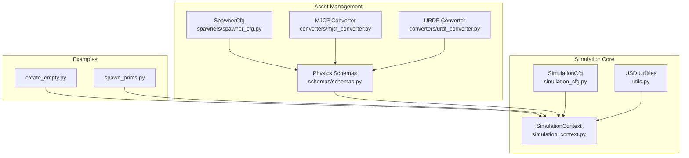
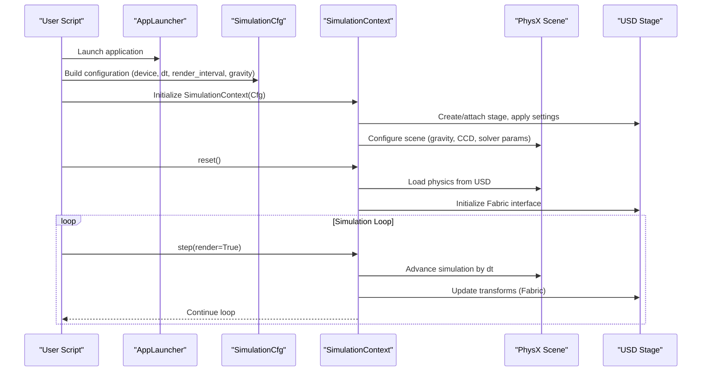
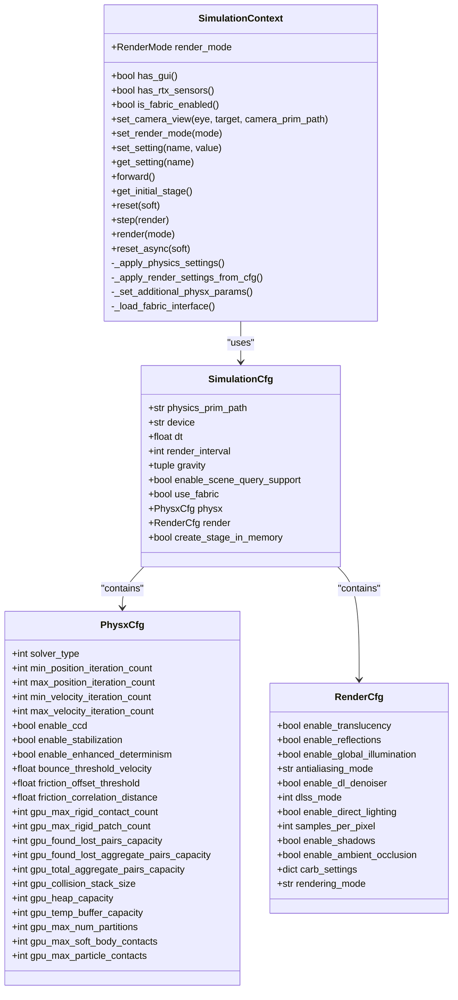
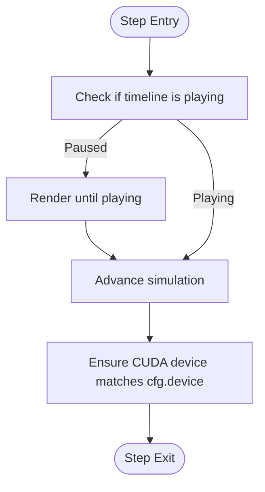
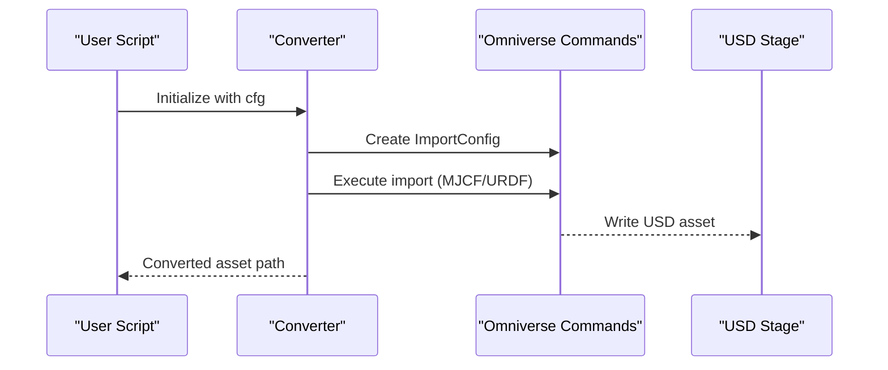
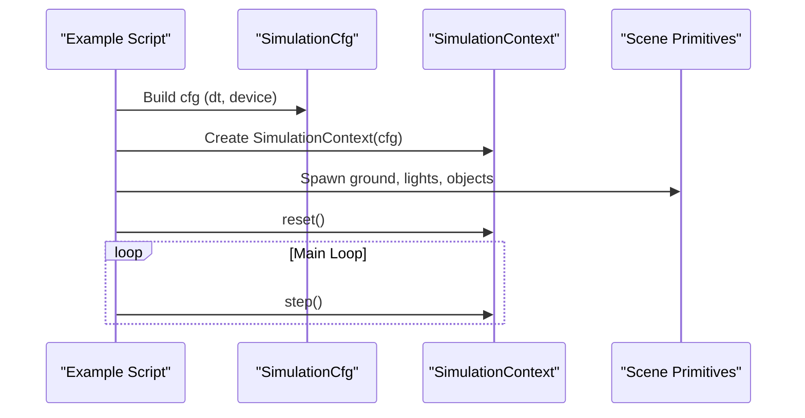
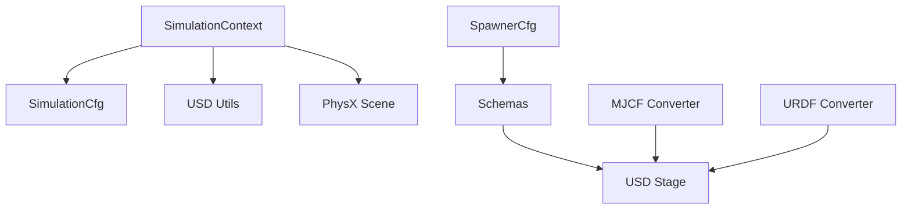

# Simulation System

<cite>
**Referenced Files in This Document**
- [simulation_context.py](file://source/isaaclab/isaaclab/sim/simulation_context.py)
- [simulation_cfg.py](file://source/isaaclab/isaaclab/sim/simulation_cfg.py)
- [utils.py](file://source/isaaclab/isaaclab/sim/utils.py)
- [spawner_cfg.py](file://source/isaaclab/isaaclab/sim/spawners/spawner_cfg.py)
- [schemas.py](file://source/isaaclab/isaaclab/sim/schemas/schemas.py)
- [mjcf_converter.py](file://source/isaaclab/isaaclab/sim/converters/mjcf_converter.py)
- [urdf_converter.py](file://source/isaaclab/isaaclab/sim/converters/urdf_converter.py)
- [create_empty.py](file://scripts/tutorials/00_sim/create_empty.py)
- [spawn_prims.py](file://scripts/tutorials/00_sim/spawn_prims.py)
</cite>

## Table of Contents
1. [Introduction](#introduction)
2. [Project Structure](#project-structure)
3. [Core Components](#core-components)
4. [Architecture Overview](#architecture-overview)
5. [Detailed Component Analysis](#detailed-component-analysis)
6. [Dependency Analysis](#dependency-analysis)
7. [Performance Considerations](#performance-considerations)
8. [Troubleshooting Guide](#troubleshooting-guide)
9. [Conclusion](#conclusion)
10. [Appendices](#appendices)

## Introduction
This document explains the simulation system component of the Extreme Quadruped Parkour framework within the Isaac Lab ecosystem. It focuses on the physics simulation engine integration with Omniverse Isaac Sim, covering simulation context management, configuration system, runtime utilities, and the initialization of the physics world. The content is designed for both beginners who are new to simulation architecture and experienced developers working with physics engines. Practical examples demonstrate setup, parameter tuning, and performance optimization techniques aligned with the Isaac Lab framework.

## Project Structure
The simulation system is organized around a core SimulationContext class that manages physics stepping, rendering, and runtime settings. Supporting modules include configuration classes for simulation parameters, rendering presets, and PhysX solver settings; utilities for USD operations and material binding; and spawner and schema modules for asset creation and low-level physics property application. Converters enable importing robot models from MJCF and URDF into USD.

**Diagram sources**
- [simulation_context.py:117-284](file://source/isaaclab/isaaclab/sim/simulation_context.py#L117-L284)
- [simulation_cfg.py:265-347](file://source/isaaclab/isaaclab/sim/simulation_cfg.py#L265-L347)
- [utils.py:324-449](file://source/isaaclab/isaaclab/sim/utils.py#L324-L449)
- [spawner_cfg.py:17-118](file://source/isaaclab/isaaclab/sim/spawners/spawner_cfg.py#L17-L118)
- [schemas.py:30-184](file://source/isaaclab/isaaclab/sim/schemas/schemas.py#L30-L184)
- [mjcf_converter.py:18-103](file://source/isaaclab/isaaclab/sim/converters/mjcf_converter.py#L18-L103)
- [urdf_converter.py:21-323](file://source/isaaclab/isaaclab/sim/converters/urdf_converter.py#L21-L323)
- [create_empty.py:34-55](file://scripts/tutorials/00_sim/create_empty.py#L34-L55)
- [spawn_prims.py:94-109](file://scripts/tutorials/00_sim/spawn_prims.py#L94-L109)

**Section sources**
- [simulation_context.py:117-284](file://source/isaaclab/isaaclab/sim/simulation_context.py#L117-L284)
- [simulation_cfg.py:265-347](file://source/isaaclab/isaaclab/sim/simulation_cfg.py#L265-L347)
- [utils.py:324-449](file://source/isaaclab/isaaclab/sim/utils.py#L324-L449)
- [spawner_cfg.py:17-118](file://source/isaaclab/isaaclab/sim/spawners/spawner_cfg.py#L17-L118)
- [schemas.py:30-184](file://source/isaaclab/isaaclab/sim/schemas/schemas.py#L30-L184)
- [mjcf_converter.py:18-103](file://source/isaaclab/isaaclab/sim/converters/mjcf_converter.py#L18-L103)
- [urdf_converter.py:21-323](file://source/isaaclab/isaaclab/sim/converters/urdf_converter.py#L21-L323)
- [create_empty.py:34-55](file://scripts/tutorials/00_sim/create_empty.py#L34-L55)
- [spawn_prims.py:94-109](file://scripts/tutorials/00_sim/spawn_prims.py#L94-L109)

## Core Components
- SimulationContext: Central controller for physics stepping, rendering, and runtime settings. Inherits from the Isaac Sim SimulationContext and extends it with configuration-driven setup, render mode management, and Fabric/Fabric interface integration for efficient state updates.
- SimulationCfg: Configuration class defining physics time-step, render interval, gravity, device selection, scene query support, Fabric usage, default physics material, and nested PhysX and Render configurations.
- USD Utilities: Functions for safe attribute setting on USD schemas/prims, decorators for applying operations across prim hierarchies, material binding helpers, and traversal utilities.
- SpawnerCfg and Schemas: Typed configuration classes for spawning rigid/deformable objects and applying PhysX schemas (articulation roots, rigid bodies, collisions, mass, drives, tendons) with validation and nested application.
- Converters: MJCF and URDF converters that integrate with Isaac Sim’s importer extensions to lazily produce USD assets with configurable import settings and optional joint drive parameterization.

**Section sources**
- [simulation_context.py:41-80](file://source/isaaclab/isaaclab/sim/simulation_context.py#L41-L80)
- [simulation_cfg.py:265-347](file://source/isaaclab/isaaclab/sim/simulation_cfg.py#L265-L347)
- [utils.py:46-131](file://source/isaaclab/isaaclab/sim/utils.py#L46-L131)
- [spawner_cfg.py:17-118](file://source/isaaclab/isaaclab/sim/spawners/spawner_cfg.py#L17-L118)
- [schemas.py:30-184](file://source/isaaclab/isaaclab/sim/schemas/schemas.py#L30-L184)
- [mjcf_converter.py:18-103](file://source/isaaclab/isaaclab/sim/converters/mjcf_converter.py#L18-L103)
- [urdf_converter.py:21-323](file://source/isaaclab/isaaclab/sim/converters/urdf_converter.py#L21-L323)

## Architecture Overview
The simulation system integrates with Omniverse Isaac Sim through a layered architecture:
- Configuration Layer: SimulationCfg encapsulates all simulation parameters, including PhysX solver settings, rendering presets, and device selection.
- Context Layer: SimulationContext initializes the simulation with the provided configuration, applies Carb settings, sets up rendering modes, and manages the Fabric interface for efficient state propagation.
- Asset Layer: Spawners and schemas create and configure USD prims with appropriate PhysX APIs and properties. Converters transform external robot descriptions into USD assets.
- Runtime Layer: Step/render loops, render mode switching, and callback handling ensure deterministic stepping and responsive UI updates.

**Diagram sources**
- [simulation_context.py:262-284](file://source/isaaclab/isaaclab/sim/simulation_context.py#L262-L284)
- [simulation_cfg.py:265-347](file://source/isaaclab/isaaclab/sim/simulation_cfg.py#L265-L347)
- [create_empty.py:37-55](file://scripts/tutorials/00_sim/create_empty.py#L37-L55)

## Detailed Component Analysis

### SimulationContext: Physics and Rendering Control
SimulationContext orchestrates physics stepping and rendering with the following responsibilities:
- Configuration-driven initialization: Validates SimulationCfg, applies Carb settings, and sets up render modes and viewport contexts.
- Time stepping: step() advances the simulation by dt and optionally triggers rendering; render() refreshes UI/viewports according to the current RenderMode.
- Render modes: NO_GUI_OR_RENDERING, NO_RENDERING, PARTIAL_RENDERING, FULL_RENDERING; supports throttling and viewport visibility toggles.
- Fabric integration: Loads and uses the PhysX Fabric interface to efficiently propagate transform updates to the renderer.
- Additional PhysX parameters: Enables CCD, sets GPU collision stack size, enhanced determinism, gravity direction/magnitude, and solver iteration counts.
- Default physics material: Creates and binds a default material to the scene.

**Diagram sources**
- [simulation_context.py:41-80](file://source/isaaclab/isaaclab/sim/simulation_context.py#L41-L80)
- [simulation_cfg.py:19-347](file://source/isaaclab/isaaclab/sim/simulation_cfg.py#L19-L347)

**Section sources**
- [simulation_context.py:117-284](file://source/isaaclab/isaaclab/sim/simulation_context.py#L117-L284)
- [simulation_cfg.py:19-347](file://source/isaaclab/isaaclab/sim/simulation_cfg.py#L19-L347)

### Simulation Parameters and Time Stepping
Key parameters and their roles:
- dt: Physics time-step in seconds; controls solver frequency and stability.
- render_interval: Number of physics steps per rendering step; decouples rendering cost from simulation fidelity.
- device: Target device for simulation (cpu/cuda[:N]); influences GPU acceleration and CUDA device selection.
- gravity: Vector defining gravitational acceleration; SimulationContext converts to PhysX gravity direction and magnitude.
- enable_scene_query_support: Controls availability of raycast/sweep/overlap queries; automatically enabled when GUI is present.
- use_fabric: Enables direct buffer access for state updates, improving throughput in large scenes.

Time stepping behavior:
- step(render): Advances physics by dt; if paused, continues stepping until playing; ensures CUDA device consistency post-step.
- render(mode): Updates UI/viewports based on RenderMode; throttles updates in NO_RENDERING mode; uses forward() to update Fabric before app update.

**Diagram sources**
- [simulation_context.py:600-643](file://source/isaaclab/isaaclab/sim/simulation_context.py#L600-L643)

**Section sources**
- [simulation_context.py:600-643](file://source/isaaclab/isaaclab/sim/simulation_context.py#L600-L643)
- [simulation_cfg.py:281-285](file://source/isaaclab/isaaclab/sim/simulation_cfg.py#L281-L285)

### Physics World Initialization and Material Binding
Initialization sequence:
- Stage creation: Optionally creates stage in memory based on create_stage_in_memory.
- Carb settings: Applies scene graph instancing, PhysX dispatcher, contact processing flags, and collision geometry settings.
- Render presets: Loads rendering mode presets from TOML kits and applies user-friendly render settings.
- PhysX scene setup: Enables CCD, sets GPU collision stack size, enhanced determinism, gravity direction/magnitude, and solver iteration counts.
- Default physics material: Creates defaultMaterial under physicsPrimPath and binds it to the scene.

Material binding utilities:
- bind_visual_material: Binds visual materials to prims with configurable binding strength.
- bind_physics_material: Binds physics materials to eligible prims (colliders, deformable bodies, particle systems) with proper API presence checks.

**Section sources**
- [simulation_context.py:286-313](file://source/isaaclab/isaaclab/sim/simulation_context.py#L286-L313)
- [simulation_context.py:745-791](file://source/isaaclab/isaaclab/sim/simulation_context.py#L745-L791)
- [utils.py:324-449](file://source/isaaclab/isaaclab/sim/utils.py#L324-L449)

### Asset Spawning and Schema Application
Spawner configuration:
- SpawnerCfg: Base configuration for spawning assets, including visibility, semantic tags, and cloning behavior.
- RigidObjectSpawnerCfg: Adds mass, rigid body, collision, and contact sensor activation options.
- DeformableObjectSpawnerCfg: Adds mass and deformable body properties.

Schema application:
- define_articulation_root_properties and modify_articulation_root_properties: Apply ArticulationRootAPI and PhysxArticulationAPI with solver and stabilization parameters; supports fixing root link to world.
- define_rigid_body_properties and modify_rigid_body_properties: Apply RigidBodyAPI and PhysxRigidBodyAPI; supports kinematic/static bodies.
- define_collision_properties and modify_collision_properties: Apply CollisionAPI and PhysxCollisionAPI; tunes contact behavior.
- define_mass_properties and modify_mass_properties: Apply MassAPI; computes mass from density or explicit mass.
- activate_contact_sensors: Adds PhysxContactReportAPI to rigid bodies under a prim path with configurable thresholds.
- Joint drive and tendon properties: Modify DriveAPI and PhysX tendon schemas for articulated systems.

Cloning and decoration:
- apply_nested: Decorator to apply functions across prim hierarchies, skipping nested schemas.
- clone: Decorator to spawn and clone prims across matching paths, with options for fabric and physics replication.

**Section sources**
- [spawner_cfg.py:17-118](file://source/isaaclab/isaaclab/sim/spawners/spawner_cfg.py#L17-L118)
- [schemas.py:30-184](file://source/isaaclab/isaaclab/sim/schemas/schemas.py#L30-L184)
- [schemas.py:192-282](file://source/isaaclab/isaaclab/sim/schemas/schemas.py#L192-L282)
- [schemas.py:290-377](file://source/isaaclab/isaaclab/sim/schemas/schemas.py#L290-L377)
- [schemas.py:385-464](file://source/isaaclab/isaaclab/sim/schemas/schemas.py#L385-L464)
- [schemas.py:472-533](file://source/isaaclab/isaaclab/sim/schemas/schemas.py#L472-L533)
- [schemas.py:541-640](file://source/isaaclab/isaaclab/sim/schemas/schemas.py#L541-L640)
- [schemas.py:648-705](file://source/isaaclab/isaaclab/sim/schemas/schemas.py#L648-L705)
- [schemas.py:713-776](file://source/isaaclab/isaaclab/sim/schemas/schemas.py#L713-L776)
- [utils.py:138-212](file://source/isaaclab/isaaclab/sim/utils.py#L138-L212)
- [utils.py:215-316](file://source/isaaclab/isaaclab/sim/utils.py#L215-L316)

### Robot Model Importers (MJCF and URDF)
MJCF Converter:
- Lazily converts MJCF to USD with instanceable mesh output.
- Configurable import settings including site parsing, density, inertia tensor import, base fixation, and self-collision.

URDF Converter:
- Integrates with isaacsim.asset.importer.urdf extension.
- Parses URDF, optionally updates joint drives (drive type/target type/gains), sets root link name, and generates USD with configurable import settings.

**Diagram sources**
- [mjcf_converter.py:52-103](file://source/isaaclab/isaaclab/sim/converters/mjcf_converter.py#L52-L103)
- [urdf_converter.py:61-93](file://source/isaaclab/isaaclab/sim/converters/urdf_converter.py#L61-L93)

**Section sources**
- [mjcf_converter.py:18-103](file://source/isaaclab/isaaclab/sim/converters/mjcf_converter.py#L18-L103)
- [urdf_converter.py:21-323](file://source/isaaclab/isaaclab/sim/converters/urdf_converter.py#L21-L323)

### Practical Examples and Usage Patterns
- Minimal simulation setup: Demonstrates initializing SimulationCfg, creating SimulationContext, resetting, and stepping in a loop.
- Scene spawning: Shows creating a ground plane, lights, rigid/deformable objects, and USD meshes; illustrates how to configure rigid body and collision properties.

**Diagram sources**
- [create_empty.py:37-55](file://scripts/tutorials/00_sim/create_empty.py#L37-L55)
- [spawn_prims.py:94-109](file://scripts/tutorials/00_sim/spawn_prims.py#L94-L109)

**Section sources**
- [create_empty.py:34-55](file://scripts/tutorials/00_sim/create_empty.py#L34-L55)
- [spawn_prims.py:94-109](file://scripts/tutorials/00_sim/spawn_prims.py#L94-L109)

## Dependency Analysis
The simulation system exhibits clear separation of concerns:
- SimulationContext depends on SimulationCfg and internal utilities for stage creation, render settings, and PhysX scene setup.
- SpawnerCfg and schemas depend on USD APIs and PhysX schemas to apply properties consistently across prim hierarchies.
- Converters depend on Isaac Sim importer extensions and Omniverse commands to produce USD assets.

**Diagram sources**
- [simulation_context.py:117-284](file://source/isaaclab/isaaclab/sim/simulation_context.py#L117-L284)
- [simulation_cfg.py:265-347](file://source/isaaclab/isaaclab/sim/simulation_cfg.py#L265-L347)
- [spawner_cfg.py:17-118](file://source/isaaclab/isaaclab/sim/spawners/spawner_cfg.py#L17-L118)
- [schemas.py:30-184](file://source/isaaclab/isaaclab/sim/schemas/schemas.py#L30-L184)
- [mjcf_converter.py:18-103](file://source/isaaclab/isaaclab/sim/converters/mjcf_converter.py#L18-L103)
- [urdf_converter.py:21-323](file://source/isaaclab/isaaclab/sim/converters/urdf_converter.py#L21-L323)

**Section sources**
- [simulation_context.py:117-284](file://source/isaaclab/isaaclab/sim/simulation_context.py#L117-L284)
- [simulation_cfg.py:265-347](file://source/isaaclab/isaaclab/sim/simulation_cfg.py#L265-L347)
- [spawner_cfg.py:17-118](file://source/isaaclab/isaaclab/sim/spawners/spawner_cfg.py#L17-L118)
- [schemas.py:30-184](file://source/isaaclab/isaaclab/sim/schemas/schemas.py#L30-L184)
- [mjcf_converter.py:18-103](file://source/isaaclab/isaaclab/sim/converters/mjcf_converter.py#L18-L103)
- [urdf_converter.py:21-323](file://source/isaaclab/isaaclab/sim/converters/urdf_converter.py#L21-L323)

## Performance Considerations
- Use Fabric: Enable use_fabric to bypass USD synchronization overhead and improve throughput in large scenes; required for GPU visualization.
- Tune render_interval: Increase render_interval to reduce rendering cost when high-frequency rendering is unnecessary.
- Solver iterations: Adjust min/max position/velocity iteration counts to balance accuracy and performance; higher counts improve stability at the cost of speed.
- Device selection: Prefer CUDA devices for GPU-accelerated simulation; ensure CUDA device consistency after app updates.
- Scene query support: Disable enable_scene_query_support when not needed to reduce overhead.
- Rendering modes: Use NO_RENDERING or PARTIAL_RENDERING in headless or batch modes to minimize UI overhead.
- Buffer sizing (GPU): For GPU PhysX, configure adequate GPU buffer capacities to avoid runtime failures and stalls.

[No sources needed since this section provides general guidance]

## Troubleshooting Guide
Common issues and remedies:
- Large dt without stabilization: Warning is emitted when dt exceeds a threshold without enable_stabilization; enable stabilization or reduce dt.
- GUI-dependent features: Some features require GUI; SimulationContext overrides enable_scene_query_support to True when GUI is present.
- Fabric not updating: Ensure use_fabric is True and Fabric interface is loaded; forward() updates kinematics and fabric before render.
- Contact sensors: activate_contact_sensors requires rigid bodies under the prim path; ensure prims have RigidBodyAPI.
- Material binding: bind_physics_material requires eligible prims with collision or deformable APIs; check prim eligibility before binding.

**Section sources**
- [simulation_context.py:254-260](file://source/isaaclab/isaaclab/sim/simulation_context.py#L254-L260)
- [simulation_context.py:217-218](file://source/isaaclab/isaaclab/sim/simulation_context.py#L217-L218)
- [simulation_context.py:590-598](file://source/isaaclab/isaaclab/sim/simulation_context.py#L590-L598)
- [schemas.py:472-533](file://source/isaaclab/isaaclab/sim/schemas/schemas.py#L472-L533)
- [utils.py:380-449](file://source/isaaclab/isaaclab/sim/utils.py#L380-L449)

## Conclusion
The simulation system in the Extreme Quadruped Parkour framework provides a robust, configuration-driven foundation for physics simulation within Isaac Sim. SimulationContext centralizes control over stepping, rendering, and runtime settings, while SimulationCfg and supporting modules offer fine-grained control over PhysX parameters, rendering presets, and asset creation. By leveraging Fabric, tuned solver parameters, and appropriate render modes, users can achieve both accurate simulations and high performance suitable for complex quadruped parkour scenarios.

[No sources needed since this section summarizes without analyzing specific files]

## Appendices

### Appendix A: Example Scripts
- Minimal setup: Initializes SimulationCfg, creates SimulationContext, resets, and steps in a loop.
- Scene spawning: Creates ground, lights, rigid/deformable objects, and USD meshes; configures rigid body and collision properties.

**Section sources**
- [create_empty.py:34-55](file://scripts/tutorials/00_sim/create_empty.py#L34-L55)
- [spawn_prims.py:94-109](file://scripts/tutorials/00_sim/spawn_prims.py#L94-L109)