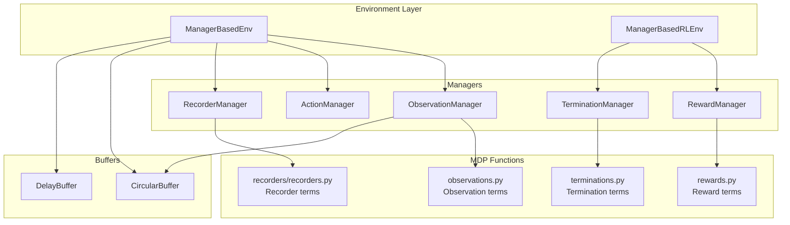
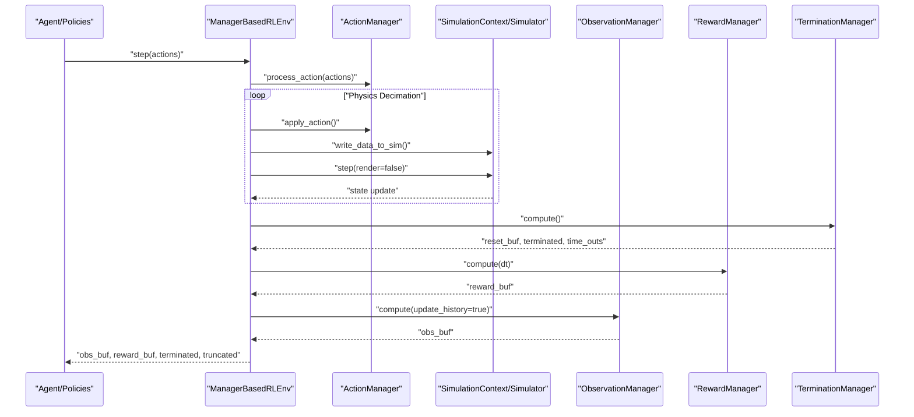
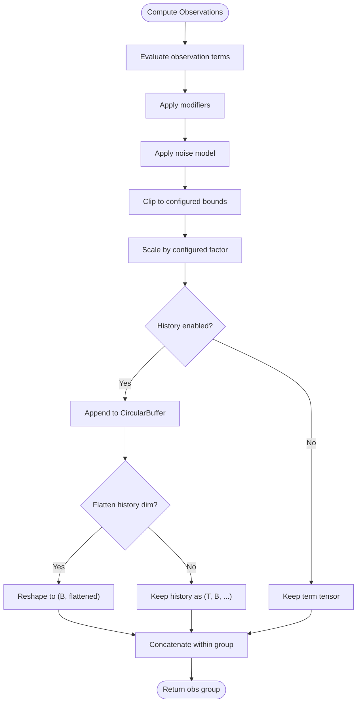
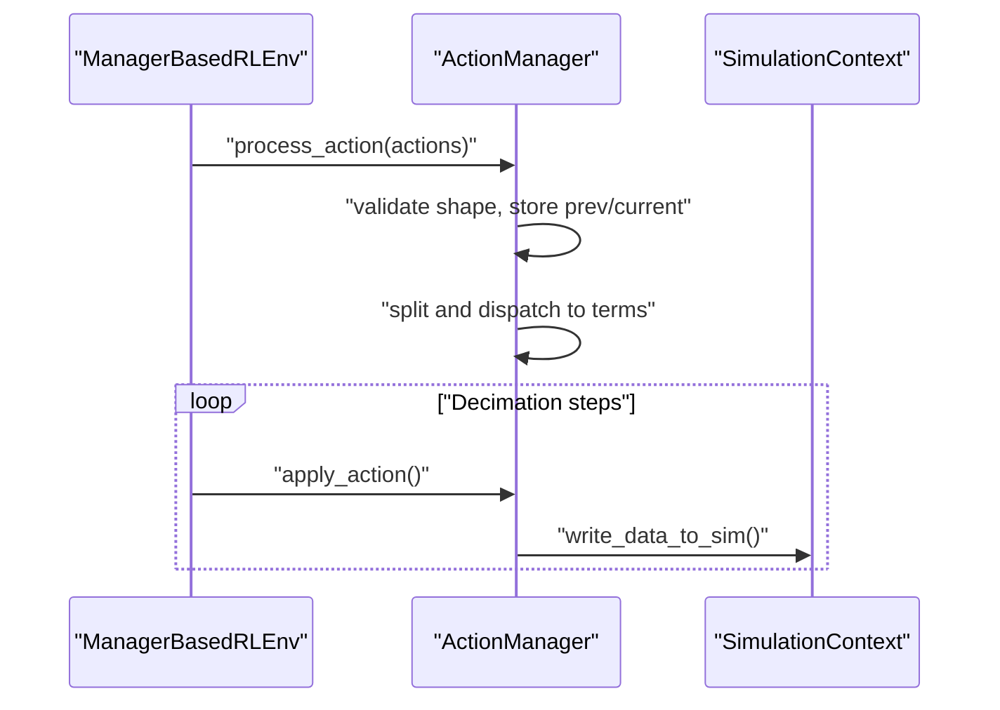
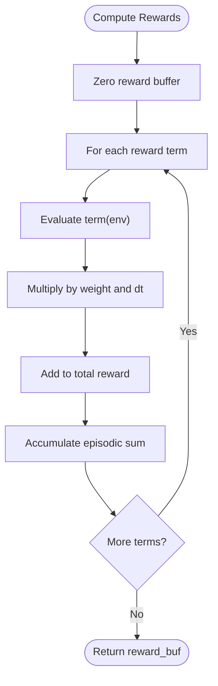
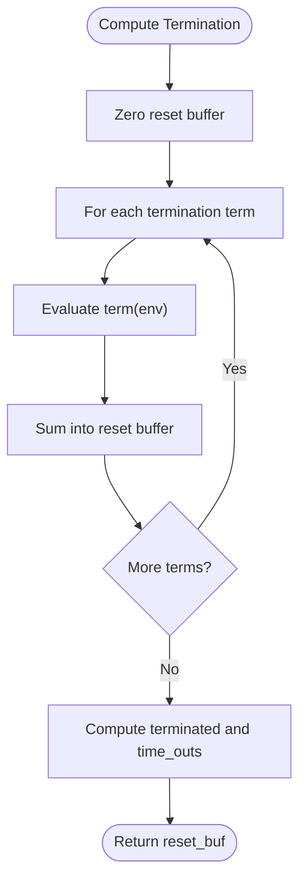
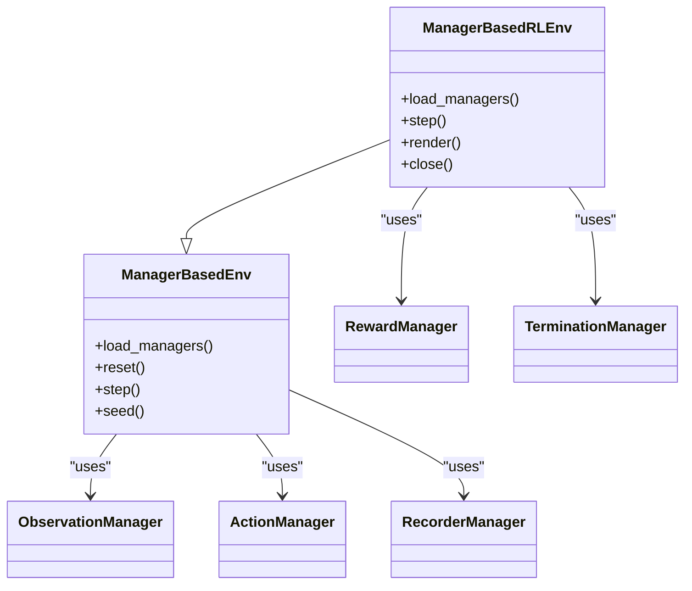
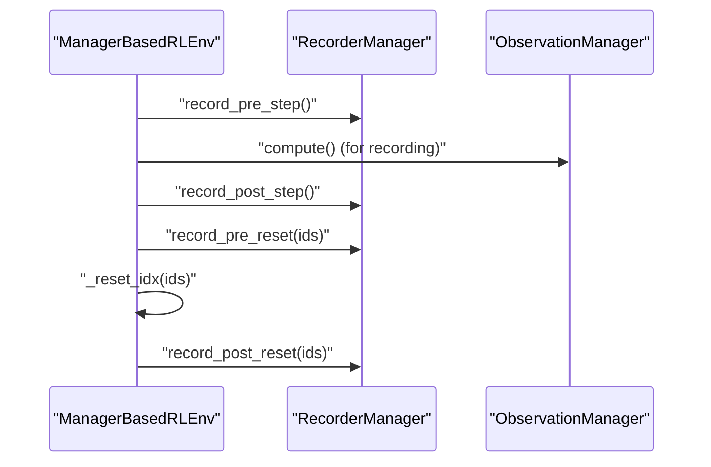
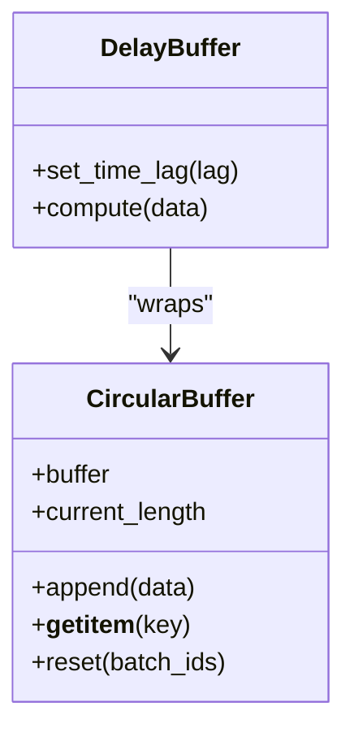
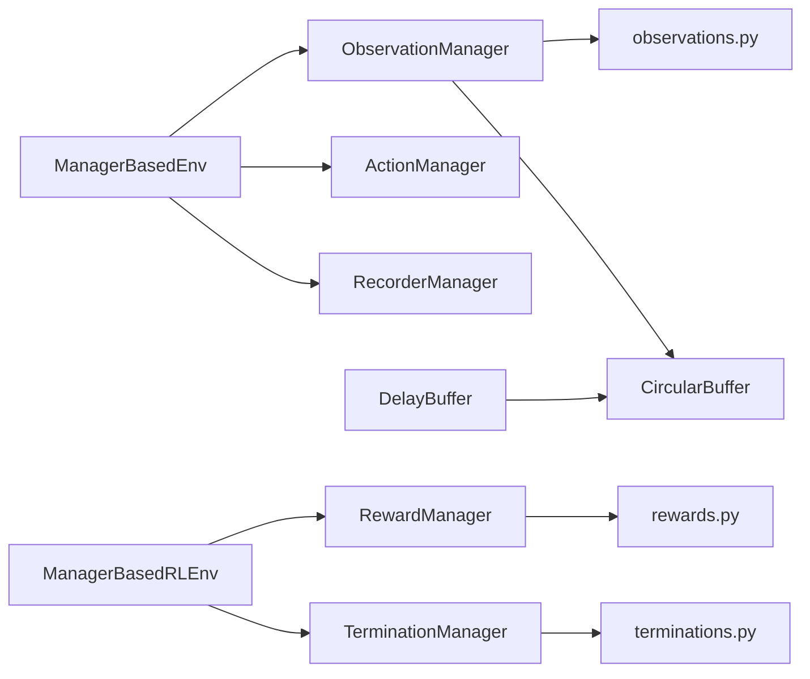

# Data Flow Patterns

<cite>
**Referenced Files in This Document**
- [manager_based_env.py](file://source/isaaclab/isaaclab/envs/manager_based_env.py)
- [manager_based_rl_env.py](file://source/isaaclab/isaaclab/envs/manager_based_rl_env.py)
- [observation_manager.py](file://source/isaaclab/isaaclab/managers/observation_manager.py)
- [action_manager.py](file://source/isaaclab/isaaclab/managers/action_manager.py)
- [reward_manager.py](file://source/isaaclab/isaaclab/managers/reward_manager.py)
- [termination_manager.py](file://source/isaaclab/isaaclab/managers/termination_manager.py)
- [observations.py](file://source/isaaclab/isaaclab/envs/mdp/observations.py)
- [rewards.py](file://source/isaaclab/isaaclab/envs/mdp/rewards.py)
- [terminations.py](file://source/isaaclab/isaaclab/envs/mdp/terminations.py)
- [recorders.py](file://source/isaaclab/isaaclab/envs/mdp/recorders/recorders.py)
- [circular_buffer.py](file://source/isaaclab/isaaclab/utils/buffers/circular_buffer.py)
- [delay_buffer.py](file://source/isaaclab/isaaclab/utils/buffers/delay_buffer.py)
- [multi_gpu.rst](file://docs/source/features/multi_gpu.rst)
- [play.py (sb3)](file://scripts/reinforcement_learning/sb3/play.py)
- [play.py (skrl)](file://scripts/reinforcement_learning/skrl/play.py)
</cite>

## Table of Contents
1. [Introduction](#introduction)
2. [Project Structure](#project-structure)
3. [Core Components](#core-components)
4. [Architecture Overview](#architecture-overview)
5. [Detailed Component Analysis](#detailed-component-analysis)
6. [Dependency Analysis](#dependency-analysis)
7. [Performance Considerations](#performance-considerations)
8. [Troubleshooting Guide](#troubleshooting-guide)
9. [Conclusion](#conclusion)

## Introduction
This document describes the end-to-end data flow for the Extreme Quadruped Parkour system, focusing on how sensor data is collected, transformed into observations, processed through managers, and used for policy inference and control execution. It explains the MDP data flow patterns (state representation, action processing, reward computation, termination logic) and the manager-based architecture that coordinates these stages. It also covers buffer management for training, real-time streaming patterns, performance considerations for high-frequency data processing, and optimization strategies for multi-GPU training.

## Project Structure
The system is built around a manager-based environment that orchestrates:
- Scene and sensors
- Observation manager (observation composition, history, noise, scaling)
- Action manager (action parsing, splitting, application)
- Reward manager (weighted reward aggregation)
- Termination manager (episode termination and timeouts)
- Recorder manager (pre/post-step data logging)
- Utilities for buffering and delay compensation

**Diagram sources**
- [manager_based_env.py:271-305](file://source/isaaclab/isaaclab/envs/manager_based_env.py#L271-L305)
- [manager_based_rl_env.py:110-133](file://source/isaaclab/isaaclab/envs/manager_based_rl_env.py#L110-L133)
- [observation_manager.py:65-83](file://source/isaaclab/isaaclab/managers/observation_manager.py#L65-L83)
- [action_manager.py:371-392](file://source/isaaclab/isaaclab/managers/action_manager.py#L371-L392)
- [reward_manager.py:43-66](file://source/isaaclab/isaaclab/managers/reward_manager.py#L43-L66)
- [termination_manager.py:49-68](file://source/isaaclab/isaaclab/managers/termination_manager.py#L49-L68)
- [observations.py:1-690](file://source/isaaclab/isaaclab/envs/mdp/observations.py#L1-L690)
- [rewards.py:1-320](file://source/isaaclab/isaaclab/envs/mdp/rewards.py#L1-L320)
- [terminations.py:1-162](file://source/isaaclab/isaaclab/envs/mdp/terminations.py#L1-L162)
- [recorders.py:40-61](file://source/isaaclab/isaaclab/envs/mdp/recorders/recorders.py#L40-L61)
- [circular_buffer.py:10-168](file://source/isaaclab/isaaclab/utils/buffers/circular_buffer.py#L10-L168)
- [delay_buffer.py:29-62](file://source/isaaclab/isaaclab/utils/buffers/delay_buffer.py#L29-L62)

**Section sources**
- [manager_based_env.py:30-69](file://source/isaaclab/isaaclab/envs/manager_based_env.py#L30-L69)
- [manager_based_rl_env.py:26-54](file://source/isaaclab/isaaclab/envs/manager_based_rl_env.py#L26-L54)

## Core Components
- ManagerBasedEnv: Initializes simulation, scene, and managers; provides step/reset mechanics and real-time rendering hooks.
- ManagerBasedRLEnv: Extends the base environment with RL-specific MDP computations (rewards, terminations, curriculum).
- ObservationManager: Computes concatenated or grouped observations, applies modifiers, noise, clipping, scaling, and maintains histories via CircularBuffer.
- ActionManager: Validates, splits, and applies actions to the simulation; tracks previous/current actions.
- RewardManager: Aggregates weighted reward terms and maintains per-step and episodic sums.
- TerminationManager: Evaluates termination and timeout signals; supports per-term inspection and configuration.
- RecorderManager: Hooks pre/post-step/reset to capture and export data.
- Buffers: CircularBuffer and DelayBuffer support temporal histories and lag compensation.

**Section sources**
- [manager_based_env.py:271-305](file://source/isaaclab/isaaclab/envs/manager_based_env.py#L271-L305)
- [manager_based_rl_env.py:110-133](file://source/isaaclab/isaaclab/envs/manager_based_rl_env.py#L110-L133)
- [observation_manager.py:65-112](file://source/isaaclab/isaaclab/managers/observation_manager.py#L65-L112)
- [action_manager.py:371-392](file://source/isaaclab/isaaclab/managers/action_manager.py#L371-L392)
- [reward_manager.py:43-66](file://source/isaaclab/isaaclab/managers/reward_manager.py#L43-L66)
- [termination_manager.py:49-68](file://source/isaaclab/isaaclab/managers/termination_manager.py#L49-L68)
- [circular_buffer.py:10-168](file://source/isaaclab/isaaclab/utils/buffers/circular_buffer.py#L10-L168)
- [delay_buffer.py:29-62](file://source/isaaclab/isaaclab/utils/buffers/delay_buffer.py#L29-L62)

## Architecture Overview
The RL loop integrates physics stepping with manager orchestration. At each environment step:
- Actions are processed and applied across the decimation period.
- Sensors and scene state are polled; observations are computed with optional history.
- Rewards and terminations are computed; resets are triggered when needed.
- New observations are produced and returned to the agent.

**Diagram sources**
- [manager_based_rl_env.py:154-243](file://source/isaaclab/isaaclab/envs/manager_based_rl_env.py#L154-L243)
- [observation_manager.py:312-337](file://source/isaaclab/isaaclab/managers/observation_manager.py#L312-L337)
- [reward_manager.py:128-158](file://source/isaaclab/isaaclab/managers/reward_manager.py#L128-L158)
- [termination_manager.py:193-204](file://source/isaaclab/isaaclab/managers/termination_manager.py#L193-L204)

## Detailed Component Analysis

### Observation Pipeline and State Representation
Observations are composed from multiple terms grouped by usage (e.g., policy group). Each term can be modified, corrupted, clipped, and scaled. Observation history is maintained per term using a CircularBuffer, enabling temporal contexts without concatenating across environments.

Key processing steps:
- Evaluate each term function to produce a tensor of shape (num_envs, ...).
- Apply modifiers, noise, clipping, and scaling in sequence.
- Optionally append to CircularBuffer history; flatten or preserve history dimensions.
- Concatenate within a group or return as a dictionary keyed by term name.

**Diagram sources**
- [observation_manager.py:340-431](file://source/isaaclab/isaaclab/managers/observation_manager.py#L340-L431)
- [circular_buffer.py:107-168](file://source/isaaclab/isaaclab/utils/buffers/circular_buffer.py#L107-L168)

Concrete examples of observation transformations:
- Root state, body pose, joint positions/velocities, IMU data, raycast height scans, and image features.
- Image preprocessing (normalize, depth correction, orthographic conversion) and optional feature extraction via pre-trained encoders.

**Section sources**
- [observations.py:42-127](file://source/isaaclab/isaaclab/envs/mdp/observations.py#L42-L127)
- [observations.py:135-183](file://source/isaaclab/isaaclab/envs/mdp/observations.py#L135-L183)
- [observations.py:191-281](file://source/isaaclab/isaaclab/envs/mdp/observations.py#L191-L281)
- [observations.py:312-370](file://source/isaaclab/isaaclab/envs/mdp/observations.py#L312-L370)
- [observations.py:373-421](file://source/isaaclab/isaaclab/envs/mdp/observations.py#L373-L421)
- [observations.py:424-548](file://source/isaaclab/isaaclab/envs/mdp/observations.py#L424-L548)
- [observation_manager.py:388-424](file://source/isaaclab/isaaclab/managers/observation_manager.py#L388-L424)

### Action Processing and Control Execution
Actions are validated against total action dimension, stored, and split per action term. Each term receives its portion and can apply further processing (e.g., PD control, actuator dynamics). Actions are applied to the simulation within the decimation loop.

**Diagram sources**
- [action_manager.py:371-392](file://source/isaaclab/isaaclab/managers/action_manager.py#L371-L392)
- [manager_based_rl_env.py:182-198](file://source/isaaclab/isaaclab/envs/manager_based_rl_env.py#L182-L198)

**Section sources**
- [action_manager.py:352-392](file://source/isaaclab/isaaclab/managers/action_manager.py#L352-L392)
- [manager_based_env.py:451-477](file://source/isaaclab/isaaclab/envs/manager_based_env.py#L451-L477)

### Reward Computation (MDP Reward)
Rewards are computed as a weighted sum of reward terms evaluated at each step. Episode sums are maintained per term and normalized by episode duration for reporting. Time-step dt is used to balance reward magnitudes across different simulation cadences.

**Diagram sources**
- [reward_manager.py:128-158](file://source/isaaclab/isaaclab/managers/reward_manager.py#L128-L158)
- [rewards.py:31-38](file://source/isaaclab/isaaclab/envs/mdp/rewards.py#L31-L38)
- [rewards.py:41-68](file://source/isaaclab/isaaclab/envs/mdp/rewards.py#L41-L68)

**Section sources**
- [reward_manager.py:100-158](file://source/isaaclab/isaaclab/managers/reward_manager.py#L100-L158)
- [rewards.py:31-68](file://source/isaaclab/isaaclab/envs/mdp/rewards.py#L31-L68)

### Termination Logic (MDP Termination)
Termination signals are computed per step and aggregated into terminated and time_outs masks. Multiple termination terms can be active simultaneously; timeouts are excluded from reward penalties.

**Diagram sources**
- [termination_manager.py:193-204](file://source/isaaclab/isaaclab/managers/termination_manager.py#L193-L204)
- [rewards.py:61-68](file://source/isaaclab/isaaclab/envs/mdp/rewards.py#L61-L68)

**Section sources**
- [termination_manager.py:49-68](file://source/isaaclab/isaaclab/managers/termination_manager.py#L49-L68)
- [termination_manager.py:193-204](file://source/isaaclab/isaaclab/managers/termination_manager.py#L193-L204)
- [terminations.py:30-42](file://source/isaaclab/isaaclab/envs/mdp/terminations.py#L30-L42)

### Manager-Based Coordination
The manager-based architecture ensures ordered initialization and reset sequences, and consistent data access across managers. The RL environment loads managers in a specific order to satisfy interdependencies (e.g., observation manager needs command/action managers; reward manager needs termination manager).

**Diagram sources**
- [manager_based_env.py:271-305](file://source/isaaclab/isaaclab/envs/manager_based_env.py#L271-L305)
- [manager_based_rl_env.py:110-133](file://source/isaaclab/isaaclab/envs/manager_based_rl_env.py#L110-L133)

**Section sources**
- [manager_based_env.py:271-305](file://source/isaaclab/isaaclab/envs/manager_based_env.py#L271-L305)
- [manager_based_rl_env.py:110-133](file://source/isaaclab/isaaclab/envs/manager_based_rl_env.py#L110-L133)

### Recording and Real-Time Streaming
Recorder terms capture pre-step observations and processed actions, enabling offline analysis and export. During the RL loop, pre/post-step recordings are triggered around environment steps and resets.

**Diagram sources**
- [manager_based_rl_env.py:176-231](file://source/isaaclab/isaaclab/envs/manager_based_rl_env.py#L176-L231)
- [recorders.py:40-61](file://source/isaaclab/isaaclab/envs/mdp/recorders/recorders.py#L40-L61)

**Section sources**
- [recorders.py:40-61](file://source/isaaclab/isaaclab/envs/mdp/recorders/recorders.py#L40-L61)
- [manager_based_rl_env.py:176-231](file://source/isaaclab/isaaclab/envs/manager_based_rl_env.py#L176-L231)

### Buffer Management for Training
- CircularBuffer: Stores a rolling window of tensors per environment; supports retrieval by relative lag and reset semantics.
- DelayBuffer: Wraps a CircularBuffer to support constant or per-batch time lags; used to align historical data across environments.

**Diagram sources**
- [circular_buffer.py:10-168](file://source/isaaclab/isaaclab/utils/buffers/circular_buffer.py#L10-L168)
- [delay_buffer.py:29-62](file://source/isaaclab/isaaclab/utils/buffers/delay_buffer.py#L29-L62)

**Section sources**
- [circular_buffer.py:107-168](file://source/isaaclab/isaaclab/utils/buffers/circular_buffer.py#L107-L168)
- [delay_buffer.py:29-62](file://source/isaaclab/isaaclab/utils/buffers/delay_buffer.py#L29-L62)

## Dependency Analysis
- Environment-to-Managers: ManagerBasedEnv initializes Recorder, Action, and Observation managers; ManagerBasedRLEnv adds Reward and Termination managers.
- Managers-to-MDP Functions: ObservationManager invokes functions from observations.py; RewardManager invokes functions from rewards.py; TerminationManager invokes functions from terminations.py.
- Managers-to-Utilities: ObservationManager uses CircularBuffer; DelayBuffer composes CircularBuffer.
- Managers-to-Each Other: RewardManager reads TerminationManager state; ObservationManager reads CommandManager and ActionManager outputs.

**Diagram sources**
- [manager_based_env.py:287-304](file://source/isaaclab/isaaclab/envs/manager_based_env.py#L287-L304)
- [manager_based_rl_env.py:110-133](file://source/isaaclab/isaaclab/envs/manager_based_rl_env.py#L110-L133)
- [observation_manager.py:65-83](file://source/isaaclab/isaaclab/managers/observation_manager.py#L65-L83)
- [circular_buffer.py:10-168](file://source/isaaclab/isaaclab/utils/buffers/circular_buffer.py#L10-L168)
- [delay_buffer.py:29-62](file://source/isaaclab/isaaclab/utils/buffers/delay_buffer.py#L29-L62)

**Section sources**
- [manager_based_env.py:287-304](file://source/isaaclab/isaaclab/envs/manager_based_env.py#L287-L304)
- [manager_based_rl_env.py:110-133](file://source/isaaclab/isaaclab/envs/manager_based_rl_env.py#L110-L133)

## Performance Considerations
- High-frequency data processing:
  - Physics decimation reduces per-step cost; ensure decimation aligns with control bandwidth and sensor refresh rates.
  - Minimize redundant tensor copies; leverage in-place ops where safe.
  - Use appropriate device placement (e.g., offload heavy image inference to a dedicated device when feasible).
- Memory management for large-scale simulations:
  - Prefer grouped observations with concatenation where shapes permit to reduce dictionary overhead.
  - Limit history lengths and flatten where possible to reduce memory footprint.
  - Reset buffers explicitly after resets to avoid stale data accumulation.
- Multi-GPU training:
  - Each GPU runs independent processes with its own environment and policy; synchronization occurs only for gradient updates.
  - Configure resource allocation per worker to match GPU/CPU/RAM needs.

[No sources needed since this section provides general guidance]

## Troubleshooting Guide
- Observation shape mismatch:
  - Ensure observation term shapes are consistent within a group if concatenation is enabled; otherwise disable concatenation.
- Action shape mismatch:
  - Validate total action dimension equals the sum of action term dimensions; mismatches raise errors during action processing.
- Empty or uninitialized buffers:
  - CircularBuffer raises runtime errors if queried before appending; ensure at least one append per environment path.
- Rendering artifacts:
  - Verify render interval is not smaller than decimation to avoid excessive renders; adjust render_interval accordingly.

**Section sources**
- [observation_manager.py:104-109](file://source/isaaclab/isaaclab/managers/observation_manager.py#L104-L109)
- [observation_manager.py:558-563](file://source/isaaclab/isaaclab/managers/observation_manager.py#L558-L563)
- [action_manager.py:380-382](file://source/isaaclab/isaaclab/managers/action_manager.py#L380-L382)
- [circular_buffer.py:159-161](file://source/isaaclab/isaaclab/utils/buffers/circular_buffer.py#L159-L161)
- [manager_based_env.py:118-124](file://source/isaaclab/isaaclab/envs/manager_based_env.py#L118-L124)

## Conclusion
The Extreme Quadruped Parkour system implements a robust manager-based MDP pipeline. Sensor data is transformed into structured observations via modular terms, actions are validated and applied through the action manager, and rewards and terminations are computed consistently with environment dynamics. Temporal histories and delay compensation are supported through dedicated buffers. The architecture enables scalable, high-frequency real-time simulation and training, with clear pathways for multi-GPU distribution and performance tuning.