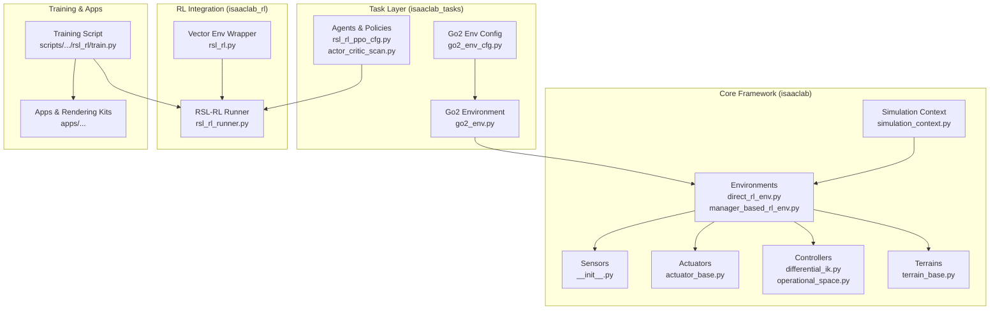
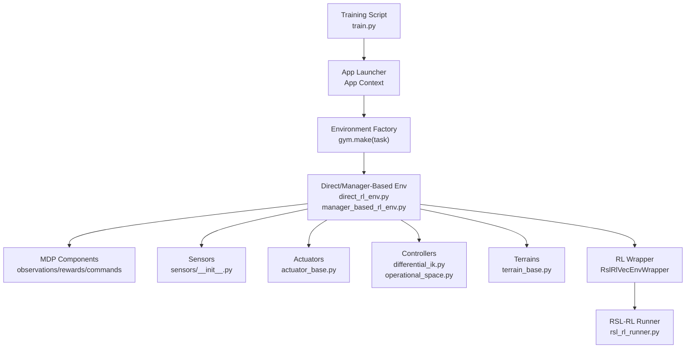
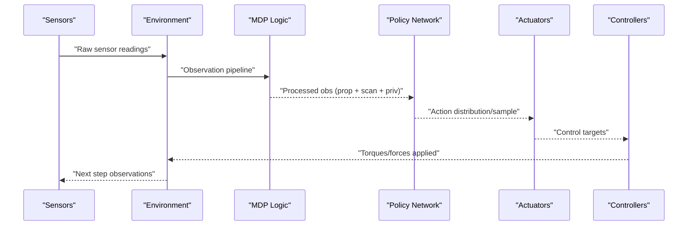
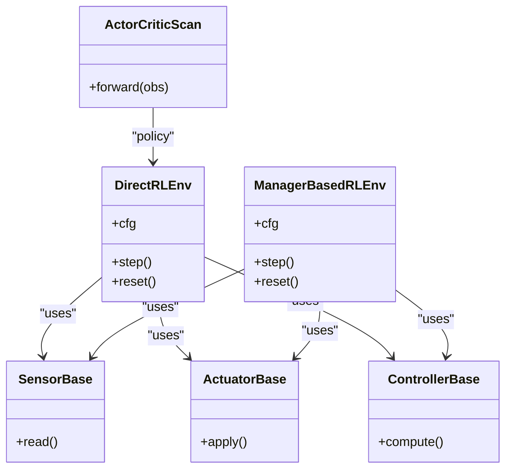
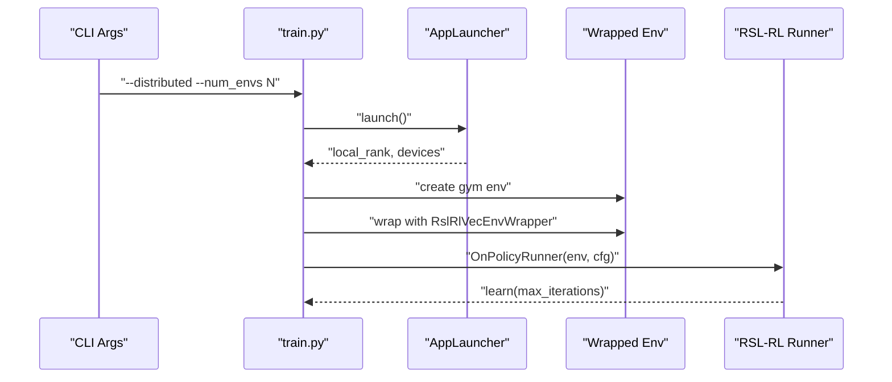
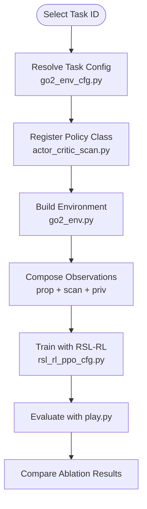
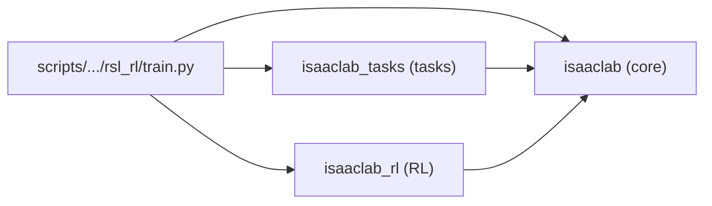
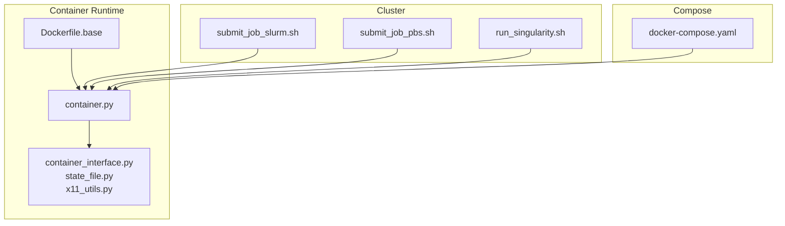

# Framework Architecture

<cite>
**Referenced Files in This Document**
- [README.md](file://README.md)
- [pyproject.toml](file://pyproject.toml)
- [source/isaaclab/isaaclab/__init__.py](file://source/isaaclab/isaaclab/__init__.py)
- [source/isaaclab/isaaclab/envs/direct_rl_env.py](file://source/isaaclab/isaaclab/envs/direct_rl_env.py)
- [source/isaaclab/isaaclab/envs/manager_based_rl_env.py](file://source/isaaclab/isaaclab/envs/manager_based_rl_env.py)
- [source/isaaclab/isaaclab/sim/simulation_context.py](file://source/isaaclab/isaaclab/sim/simulation_context.py)
- [source/isaaclab/isaaclab/sim/spawners/from_files/from_files.py](file://source/isaaclab/isaaclab/sim/spawners/from_files/from_files.py)
- [source/isaaclab/isaaclab/sensors/__init__.py](file://source/isaaclab/isaaclab/sensors/__init__.py)
- [source/isaaclab/isaaclab/actuators/actuator_base.py](file://source/isaaclab/isaaclab/actuators/actuator_base.py)
- [source/isaaclab/isaaclab/controllers/differential_ik.py](file://source/isaaclab/isaaclab/controllers/differential_ik.py)
- [source/isaaclab/isaaclab/controllers/operational_space.py](file://source/isaaclab/isaaclab/controllers/operational_space.py)
- [source/isaaclab/isaaclab/terrains/terrain_base.py](file://source/isaaclab/isaaclab/terrains/terrain_base.py)
- [source/isaaclab/isaaclab_rl/isaaclab_rl/rsl_rl.py](file://source/isaaclab_rl/isaaclab_rl/isaaclab_rl/rsl_rl.py)
- [source/isaaclab_rl/isaaclab_rl/rsl_rl/rsl_rl_runner.py](file://source/isaaclab_rl/isaaclab_rl/rsl_rl/rsl_rl_runner.py)
- [source/isaaclab_tasks/isaaclab_tasks/direct/go2/go2_env_cfg.py](file://source/isaaclab_tasks/isaaclab_tasks/direct/go2/go2_env_cfg.py)
- [source/isaaclab_tasks/isaaclab_tasks/direct/go2/go2_env.py](file://source/isaaclab_tasks/isaaclab_tasks/direct/go2/go2_env.py)
- [source/isaaclab_tasks/isaaclab_tasks/direct/go2/agents/rsl_rl_ppo_cfg.py](file://source/isaaclab_tasks/isaaclab_tasks/direct/go2/agents/rsl_rl_ppo_cfg.py)
- [source/isaaclab_tasks/isaaclab_tasks/direct/go2/agents/actor_critic_scan.py](file://source/isaaclab_tasks/isaaclab_tasks/direct/go2/agents/actor_critic_scan.py)
- [scripts/reinforcement_learning/rsl_rl/train.py](file://scripts/reinforcement_learning/rsl_rl/train.py)
- [docker/Dockerfile.base](file://docker/Dockerfile.base)
- [docker/docker-compose.yaml](file://docker/docker-compose.yaml)
- [docker/cluster/submit_job_slurm.sh](file://docker/cluster/submit_job_slurm.sh)
- [docker/cluster/submit_job_pbs.sh](file://docker/cluster/submit_job_pbs.sh)
- [docker/cluster/run_singularity.sh](file://docker/cluster/run_singularity.sh)
- [docker/container.py](file://docker/container.py)
- [docker/utils/container_interface.py](file://docker/utils/container_interface.py)
- [docker/utils/state_file.py](file://docker/utils/state_file.py)
- [docker/utils/x11_utils.py](file://docker/utils/x11_utils.py)
</cite>

## Table of Contents
1. [Introduction](#introduction)
2. [Project Structure](#project-structure)
3. [Core Components](#core-components)
4. [Architecture Overview](#architecture-overview)
5. [Detailed Component Analysis](#detailed-component-analysis)
6. [Dependency Analysis](#dependency-analysis)
7. [Performance Considerations](#performance-considerations)
8. [Troubleshooting Guide](#troubleshooting-guide)
9. [Conclusion](#conclusion)
10. [Appendices](#appendices)

## Introduction
This document describes the architectural design of the Extreme Quadruped Parkour framework built on the Isaac Lab ecosystem. It explains the layered architecture, plugin-style composition of simulation, control, learning, and visualization components, and the system boundaries between these layers. It also documents the data flow from sensor observations through policy networks to control execution, the ablation study framework, multi-environment support, and distributed training infrastructure. Finally, it outlines infrastructure requirements for multi-GPU training and deployment topology options.

## Project Structure
The repository is organized as a multi-package Python project with clear separation of concerns:
- Core simulation and environment framework: isaaclab
- Task-specific environments and ablations: isaaclab_tasks
- Reinforcement learning integrations: isaaclab_rl
- Assets and extensions: isaaclab_assets
- Application kits and rendering modes: apps
- Scripts for training, demos, and tools: scripts
- Documentation and licensing: docs
- Containerization and cluster deployment: docker

**Diagram sources**
- [source/isaaclab/isaaclab/sim/simulation_context.py](file://source/isaaclab/isaaclab/sim/simulation_context.py)
- [source/isaaclab/isaaclab/envs/direct_rl_env.py](file://source/isaaclab/isaaclab/envs/direct_rl_env.py)
- [source/isaaclab/isaaclab/envs/manager_based_rl_env.py](file://source/isaaclab/isaaclab/envs/manager_based_rl_env.py)
- [source/isaaclab/isaaclab/sensors/__init__.py](file://source/isaaclab/isaaclab/sensors/__init__.py)
- [source/isaaclab/isaaclab/actuators/actuator_base.py](file://source/isaaclab/isaaclab/actuators/actuator_base.py)
- [source/isaaclab/isaaclab/controllers/differential_ik.py](file://source/isaaclab/isaaclab/controllers/differential_ik.py)
- [source/isaaclab/isaaclab/controllers/operational_space.py](file://source/isaaclab/isaaclab/controllers/operational_space.py)
- [source/isaaclab/isaaclab/terrains/terrain_base.py](file://source/isaaclab/isaaclab/terrains/terrain_base.py)
- [source/isaaclab_tasks/isaaclab_tasks/direct/go2/go2_env_cfg.py](file://source/isaaclab_tasks/isaaclab_tasks/direct/go2/go2_env_cfg.py)
- [source/isaaclab_tasks/isaaclab_tasks/direct/go2/go2_env.py](file://source/isaaclab_tasks/isaaclab_tasks/direct/go2/go2_env.py)
- [source/isaaclab_tasks/isaaclab_tasks/direct/go2/agents/rsl_rl_ppo_cfg.py](file://source/isaaclab_tasks/isaaclab_tasks/direct/go2/agents/rsl_rl_ppo_cfg.py)
- [source/isaaclab_tasks/isaaclab_tasks/direct/go2/agents/actor_critic_scan.py](file://source/isaaclab_tasks/isaaclab_tasks/direct/go2/agents/actor_critic_scan.py)
- [source/isaaclab_rl/isaaclab_rl/rsl_rl/rsl_rl_runner.py](file://source/isaaclab_rl/isaaclab_rl/rsl_rl/rsl_rl_runner.py)
- [source/isaaclab_rl/isaaclab_rl/isaaclab_rl/rsl_rl.py](file://source/isaaclab_rl/isaaclab_rl/isaaclab_rl/rsl_rl.py)
- [scripts/reinforcement_learning/rsl_rl/train.py](file://scripts/reinforcement_learning/rsl_rl/train.py)

**Section sources**
- [README.md:44-50](file://README.md#L44-L50)
- [pyproject.toml:56-62](file://pyproject.toml#L56-L62)

## Core Components
- Simulation layer: Provides the physics simulation context, spawner utilities, and asset conversion mechanisms.
- Environment layer: Offers direct and manager-based RL environments with MDP components for observations, rewards, commands, and terminations.
- Control layer: Implements controllers (e.g., differential IK, operational space) and actuators for applying control signals.
- Sensors layer: Defines sensor abstractions and plugins for capturing environment data.
- Task layer: Implements the Go2 parkour environment configuration and environment logic, including ablation-specific policies.
- RL integration: Wraps environments for RSL-RL and orchestrates training runs.
- Training script: Launches the application, resolves task configurations, sets up distributed training, and manages logging and checkpoints.

Key implementation references:
- Simulation context and spawners: [simulation_context.py](file://source/isaaclab/isaaclab/sim/simulation_context.py), [from_files.py](file://source/isaaclab/isaaclab/sim/spawners/from_files/from_files.py)
- Environments: [direct_rl_env.py](file://source/isaaclab/isaaclab/envs/direct_rl_env.py), [manager_based_rl_env.py](file://source/isaaclab/isaaclab/envs/manager_based_rl_env.py)
- Controllers and actuators: [differential_ik.py](file://source/isaaclab/isaaclab/controllers/differential_ik.py), [operational_space.py](file://source/isaaclab/isaaclab/controllers/operational_space.py), [actuator_base.py](file://source/isaaclab/isaaclab/actuators/actuator_base.py)
- Sensors: [sensors/__init__.py](file://source/isaaclab/isaaclab/sensors/__init__.py)
- Task environment and ablations: [go2_env_cfg.py](file://source/isaaclab_tasks/isaaclab_tasks/direct/go2/go2_env_cfg.py), [go2_env.py](file://source/isaaclab_tasks/isaaclab_tasks/direct/go2/go2_env.py), [actor_critic_scan.py](file://source/isaaclab_tasks/isaaclab_tasks/direct/go2/agents/actor_critic_scan.py), [rsl_rl_ppo_cfg.py](file://source/isaaclab_tasks/isaaclab_tasks/direct/go2/agents/rsl_rl_ppo_cfg.py)
- RL integration: [rsl_rl.py](file://source/isaaclab_rl/isaaclab_rl/isaaclab_rl/rsl_rl.py), [rsl_rl_runner.py](file://source/isaaclab_rl/isaaclab_rl/rsl_rl/rsl_rl_runner.py)
- Training orchestration: [train.py](file://scripts/reinforcement_learning/rsl_rl/train.py)

**Section sources**
- [source/isaaclab/isaaclab/sim/simulation_context.py](file://source/isaaclab/isaaclab/sim/simulation_context.py)
- [source/isaaclab/isaaclab/envs/direct_rl_env.py](file://source/isaaclab/isaaclab/envs/direct_rl_env.py)
- [source/isaaclab/isaaclab/envs/manager_based_rl_env.py](file://source/isaaclab/isaaclab/envs/manager_based_rl_env.py)
- [source/isaaclab/isaaclab/controllers/differential_ik.py](file://source/isaaclab/isaaclab/controllers/differential_ik.py)
- [source/isaaclab/isaaclab/controllers/operational_space.py](file://source/isaaclab/isaaclab/controllers/operational_space.py)
- [source/isaaclab/isaaclab/actuators/actuator_base.py](file://source/isaaclab/isaaclab/actuators/actuator_base.py)
- [source/isaaclab/isaaclab/sensors/__init__.py](file://source/isaaclab/isaaclab/sensors/__init__.py)
- [source/isaaclab_tasks/isaaclab_tasks/direct/go2/go2_env_cfg.py](file://source/isaaclab_tasks/isaaclab_tasks/direct/go2/go2_env_cfg.py)
- [source/isaaclab_tasks/isaaclab_tasks/direct/go2/go2_env.py](file://source/isaaclab_tasks/isaaclab_tasks/direct/go2/go2_env.py)
- [source/isaaclab_tasks/isaaclab_tasks/direct/go2/agents/actor_critic_scan.py](file://source/isaaclab_tasks/isaaclab_tasks/direct/go2/agents/actor_critic_scan.py)
- [source/isaaclab_tasks/isaaclab_tasks/direct/go2/agents/rsl_rl_ppo_cfg.py](file://source/isaaclab_tasks/isaaclab_tasks/direct/go2/agents/rsl_rl_ppo_cfg.py)
- [source/isaaclab_rl/isaaclab_rl/isaaclab_rl/rsl_rl.py](file://source/isaaclab_rl/isaaclab_rl/isaaclab_rl/rsl_rl.py)
- [source/isaaclab_rl/isaaclab_rl/rsl_rl/rsl_rl_runner.py](file://source/isaaclab_rl/isaaclab_rl/rsl_rl/rsl_rl_runner.py)
- [scripts/reinforcement_learning/rsl_rl/train.py](file://scripts/reinforcement_learning/rsl_rl/train.py)

## Architecture Overview
The system follows a layered architecture with explicit boundaries:
- Simulation layer: Physics engine, asset spawning, and stage creation.
- Environment layer: Task definition, MDP logic, and observation/reward computation.
- Control layer: Actuator dynamics and controller execution.
- Learning layer: Policy networks, vectorized environments, and training runners.
- Visualization layer: Rendering kits and camera outputs.

System boundaries and integration patterns:
- The training script launches the application, resolves task configurations, and wires environments to RL runners.
- The task layer extends the environment with ablation-specific policies and observation mappings.
- The RL integration wraps environments and delegates training to RSL-RL.

**Diagram sources**
- [scripts/reinforcement_learning/rsl_rl/train.py](file://scripts/reinforcement_learning/rsl_rl/train.py)
- [source/isaaclab/isaaclab/envs/direct_rl_env.py](file://source/isaaclab/isaaclab/envs/direct_rl_env.py)
- [source/isaaclab/isaaclab/envs/manager_based_rl_env.py](file://source/isaaclab/isaaclab/envs/manager_based_rl_env.py)
- [source/isaaclab/isaaclab/sensors/__init__.py](file://source/isaaclab/isaaclab/sensors/__init__.py)
- [source/isaaclab/isaaclab/actuators/actuator_base.py](file://source/isaaclab/isaaclab/actuators/actuator_base.py)
- [source/isaaclab/isaaclab/controllers/differential_ik.py](file://source/isaaclab/isaaclab/controllers/differential_ik.py)
- [source/isaaclab/isaaclab/controllers/operational_space.py](file://source/isaaclab/isaaclab/controllers/operational_space.py)
- [source/isaaclab/isaaclab/terrains/terrain_base.py](file://source/isaaclab/isaaclab/terrains/terrain_base.py)
- [source/isaaclab_rl/isaaclab_rl/isaaclab_rl/rsl_rl.py](file://source/isaaclab_rl/isaaclab_rl/isaaclab_rl/rsl_rl.py)
- [source/isaaclab_rl/isaaclab_rl/rsl_rl/rsl_rl_runner.py](file://source/isaaclab_rl/isaaclab_rl/rsl_rl/rsl_rl_runner.py)

## Detailed Component Analysis

### Data Flow: Sensor Observations to Control Execution
The data flow moves from sensors to environment MDP logic, then to the policy network, and finally to actuators and controllers.

**Diagram sources**
- [source/isaaclab/isaaclab/sensors/__init__.py](file://source/isaaclab/isaaclab/sensors/__init__.py)
- [source/isaaclab/isaaclab/envs/direct_rl_env.py](file://source/isaaclab/isaaclab/envs/direct_rl_env.py)
- [source/isaaclab_tasks/isaaclab_tasks/direct/go2/agents/actor_critic_scan.py](file://source/isaaclab_tasks/isaaclab_tasks/direct/go2/agents/actor_critic_scan.py)
- [source/isaaclab/isaaclab/actuators/actuator_base.py](file://source/isaaclab/isaaclab/actuators/actuator_base.py)
- [source/isaaclab/isaaclab/controllers/differential_ik.py](file://source/isaaclab/isaaclab/controllers/differential_ik.py)
- [source/isaaclab/isaaclab/controllers/operational_space.py](file://source/isaaclab/isaaclab/controllers/operational_space.py)

### Abstraction and Plugin Patterns
- Environment plugins: Sensors, actuators, and controllers are modular and can be composed per task.
- Task registration: Tasks are registered via the task layer and resolved by the training script.
- Policy ablation: Different policy architectures are exposed as task IDs with distinct observation mappings.

**Diagram sources**
- [source/isaaclab/isaaclab/envs/direct_rl_env.py](file://source/isaaclab/isaaclab/envs/direct_rl_env.py)
- [source/isaaclab/isaaclab/envs/manager_based_rl_env.py](file://source/isaaclab/isaaclab/envs/manager_based_rl_env.py)
- [source/isaaclab/isaaclab/sensors/__init__.py](file://source/isaaclab/isaaclab/sensors/__init__.py)
- [source/isaaclab/isaaclab/actuators/actuator_base.py](file://source/isaaclab/isaaclab/actuators/actuator_base.py)
- [source/isaaclab/isaaclab/controllers/differential_ik.py](file://source/isaaclab/isaaclab/controllers/differential_ik.py)
- [source/isaaclab/isaaclab/controllers/operational_space.py](file://source/isaaclab/isaaclab/controllers/operational_space.py)
- [source/isaaclab_tasks/isaaclab_tasks/direct/go2/agents/actor_critic_scan.py](file://source/isaaclab_tasks/isaaclab_tasks/direct/go2/agents/actor_critic_scan.py)

### Distributed Training Orchestration
The training script supports distributed training and integrates with the application launcher to distribute environments across GPUs/nodes.

**Diagram sources**
- [scripts/reinforcement_learning/rsl_rl/train.py](file://scripts/reinforcement_learning/rsl_rl/train.py)
- [source/isaaclab_rl/isaaclab_rl/isaaclab_rl/rsl_rl.py](file://source/isaaclab_rl/isaaclab_rl/isaaclab_rl/rsl_rl.py)
- [source/isaaclab_rl/isaaclab_rl/rsl_rl/rsl_rl_runner.py](file://source/isaaclab_rl/isaaclab_rl/rsl_rl/rsl_rl_runner.py)

### Ablation Study Framework
The framework exposes multiple ablation variants via task IDs and configuration-driven observation mappings. The ablation-specific policy is registered at runtime and wired into the environment.

**Diagram sources**
- [source/isaaclab_tasks/isaaclab_tasks/direct/go2/go2_env_cfg.py](file://source/isaaclab_tasks/isaaclab_tasks/direct/go2/go2_env_cfg.py)
- [source/isaaclab_tasks/isaaclab_tasks/direct/go2/go2_env.py](file://source/isaaclab_tasks/isaaclab_tasks/direct/go2/go2_env.py)
- [source/isaaclab_tasks/isaaclab_tasks/direct/go2/agents/actor_critic_scan.py](file://source/isaaclab_tasks/isaaclab_tasks/direct/go2/agents/actor_critic_scan.py)
- [source/isaaclab_tasks/isaaclab_tasks/direct/go2/agents/rsl_rl_ppo_cfg.py](file://source/isaaclab_tasks/isaaclab_tasks/direct/go2/agents/rsl_rl_ppo_cfg.py)
- [scripts/reinforcement_learning/rsl_rl/train.py](file://scripts/reinforcement_learning/rsl_rl/train.py)

**Section sources**
- [README.md:5-18](file://README.md#L5-L18)
- [README.md:44-68](file://README.md#L44-L68)
- [source/isaaclab_tasks/isaaclab_tasks/direct/go2/go2_env_cfg.py](file://source/isaaclab_tasks/isaaclab_tasks/direct/go2/go2_env_cfg.py)
- [source/isaaclab_tasks/isaaclab_tasks/direct/go2/go2_env.py](file://source/isaaclab_tasks/isaaclab_tasks/direct/go2/go2_env.py)
- [source/isaaclab_tasks/isaaclab_tasks/direct/go2/agents/actor_critic_scan.py](file://source/isaaclab_tasks/isaaclab_tasks/direct/go2/agents/actor_critic_scan.py)
- [source/isaaclab_tasks/isaaclab_tasks/direct/go2/agents/rsl_rl_ppo_cfg.py](file://source/isaaclab_tasks/isaaclab_tasks/direct/go2/agents/rsl_rl_ppo_cfg.py)
- [scripts/reinforcement_learning/rsl_rl/train.py](file://scripts/reinforcement_learning/rsl_rl/train.py)

## Dependency Analysis
The project uses a multi-package structure with explicit imports across isaaclab, isaaclab_tasks, and isaaclab_rl. The training script depends on the application launcher and task registration to construct environments and RL runners.

**Diagram sources**
- [scripts/reinforcement_learning/rsl_rl/train.py](file://scripts/reinforcement_learning/rsl_rl/train.py)
- [pyproject.toml:56-62](file://pyproject.toml#L56-L62)

**Section sources**
- [pyproject.toml:56-62](file://pyproject.toml#L56-L62)
- [source/isaaclab/isaaclab/__init__.py](file://source/isaaclab/isaaclab/__init__.py)

## Performance Considerations
- Multi-GPU training: The training script supports distributing environments across GPUs/nodes and adjusts seeds per rank to ensure diversity.
- Large-scale environments: The framework targets 4096 environments; users should adjust --num_envs if memory constraints arise.
- Headless mode: Use headless rendering to reduce overhead during heavy simulations.
- Camera performance: Rendering and video capture add overhead; disable or limit video recording for performance-sensitive runs.

Practical guidance:
- Adjust --num_envs according to GPU memory capacity.
- Prefer headless mode for large-scale training.
- Limit video recording frequency and duration.

**Section sources**
- [README.md:30-42](file://README.md#L30-L42)
- [README.md:120-141](file://README.md#L120-L141)
- [scripts/reinforcement_learning/rsl_rl/train.py](file://scripts/reinforcement_learning/rsl_rl/train.py)

## Troubleshooting Guide
- Version compatibility: Ensure the installed RSL-RL version meets the minimum requirement for distributed training.
- Environment seeding: Seeds are adjusted per rank in distributed mode; mismatches can cause lack of diversity.
- IO descriptors: Exporting IO descriptors is supported only for manager-based RL environments.
- Video recording: Enable cameras explicitly when recording videos during training.

Operational checks:
- Verify RSL-RL version before launching distributed jobs.
- Confirm environment seed and device assignment in distributed runs.
- Validate IO descriptor export path for manager-based environments.

**Section sources**
- [scripts/reinforcement_learning/rsl_rl/train.py](file://scripts/reinforcement_learning/rsl_rl/train.py)

## Conclusion
The Extreme Quadruped Parkour framework leverages the layered architecture of Isaac Lab to compose simulation, environment, control, and learning components. The task layer enables ablation studies through configurable observation mappings and policy architectures. Distributed training is integrated via the application launcher and RL wrapper, while containerization and cluster scripts support scalable deployment. The documented data flow and system boundaries provide a clear blueprint for extending the framework to new environments and policies.

## Appendices

### Infrastructure Requirements and Deployment Topologies
- Containerization: Base Dockerfile and container utilities support runtime configuration and X11 forwarding for visualization.
- Cluster scheduling: SLURM and PBS job submission scripts enable batch training on clusters.
- Singularity support: Run isolated containers with Singularity for HPC environments.
- Compose-based deployment: docker-compose files define service topologies for orchestrated runs.

**Diagram sources**
- [docker/Dockerfile.base](file://docker/Dockerfile.base)
- [docker/container.py](file://docker/container.py)
- [docker/utils/container_interface.py](file://docker/utils/container_interface.py)
- [docker/utils/state_file.py](file://docker/utils/state_file.py)
- [docker/utils/x11_utils.py](file://docker/utils/x11_utils.py)
- [docker/cluster/submit_job_slurm.sh](file://docker/cluster/submit_job_slurm.sh)
- [docker/cluster/submit_job_pbs.sh](file://docker/cluster/submit_job_pbs.sh)
- [docker/cluster/run_singularity.sh](file://docker/cluster/run_singularity.sh)
- [docker/docker-compose.yaml](file://docker/docker-compose.yaml)