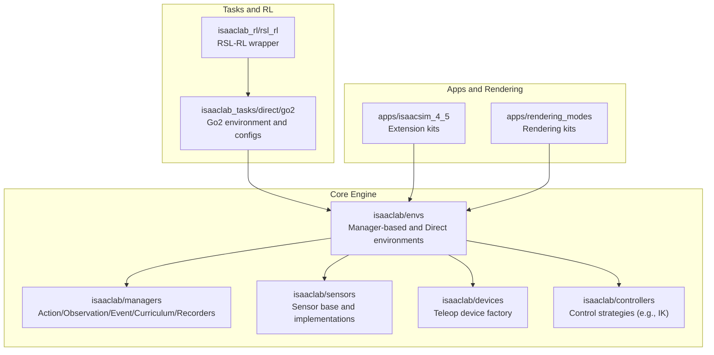
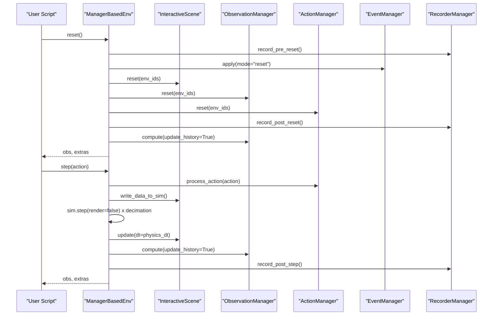
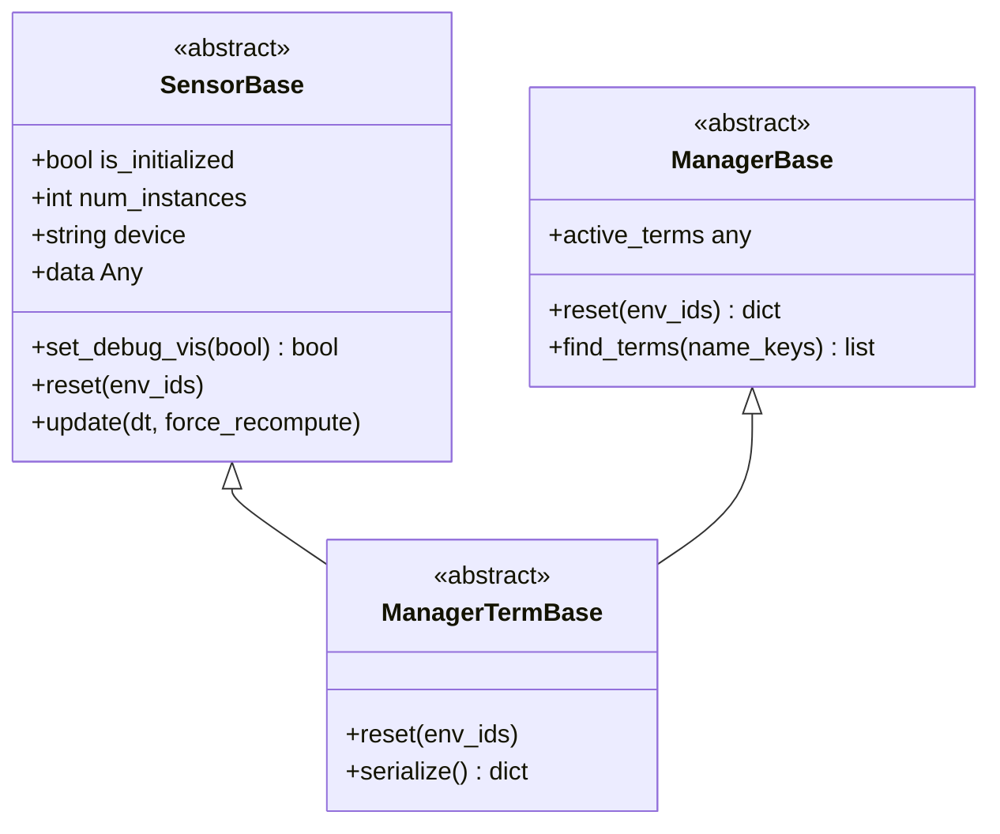
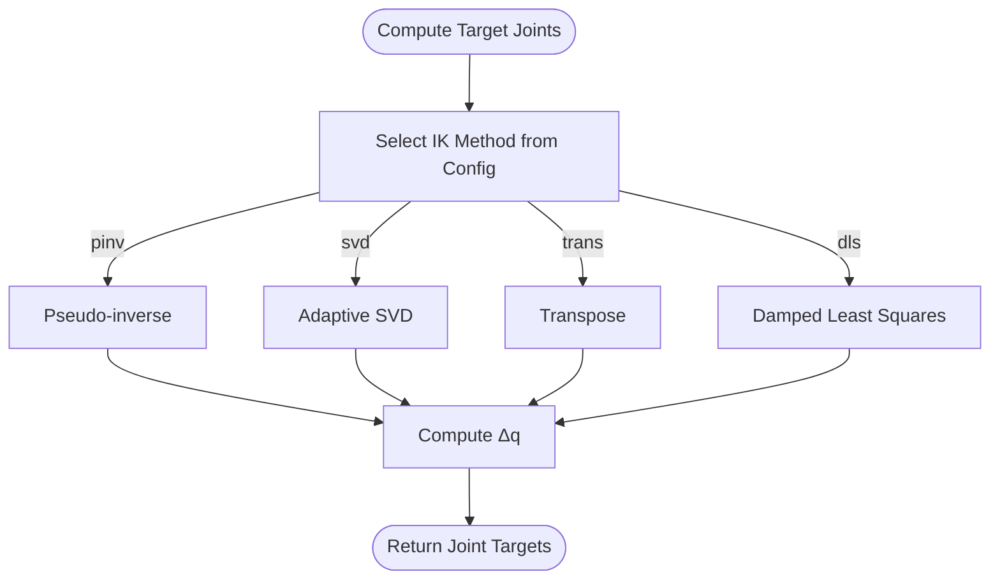
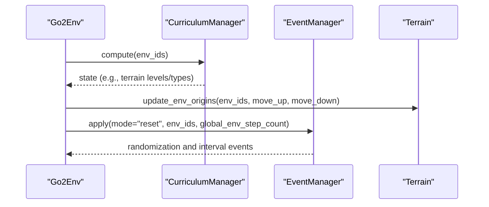
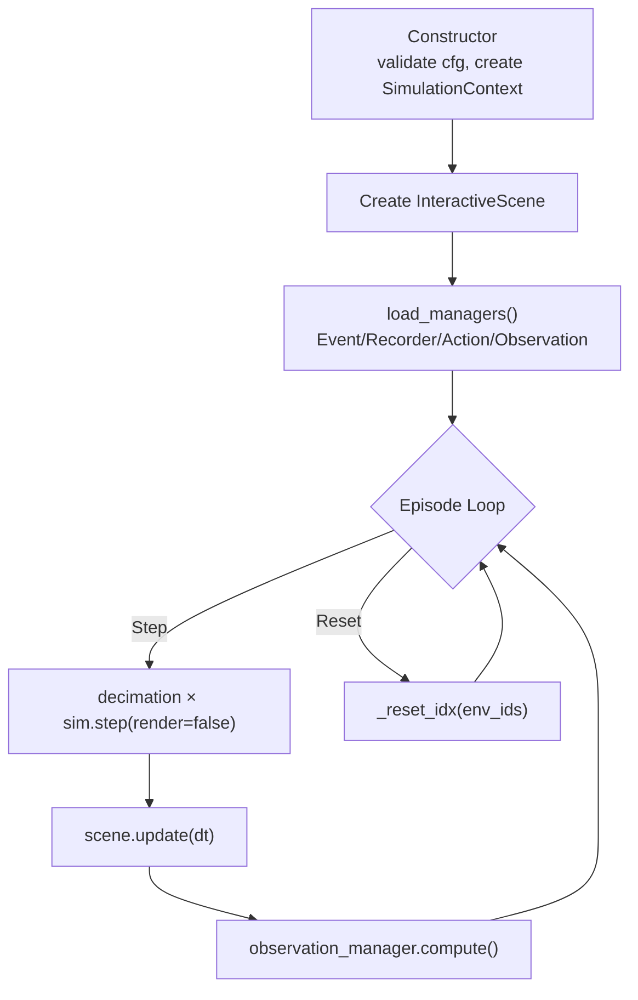
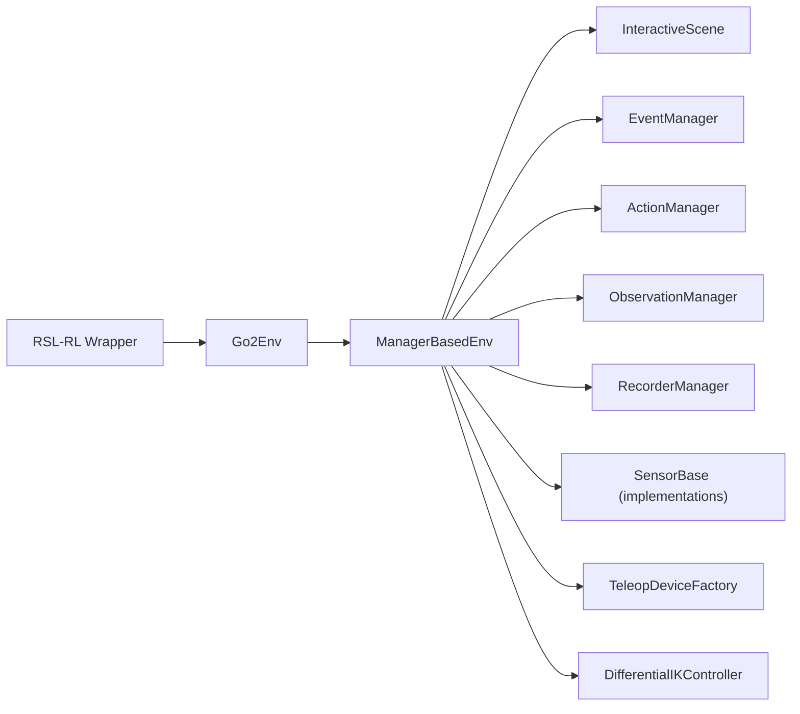

# Integration Patterns

<cite>
**Referenced Files in This Document**
- [README.md](file://README.md)
- [teleop_device_factory.py](file://source/isaaclab/isaaclab/devices/teleop_device_factory.py)
- [sensor_base.py](file://source/isaaclab/isaaclab/sensors/sensor_base.py)
- [manager_base.py](file://source/isaaclab/isaaclab/managers/manager_base.py)
- [manager_based_env.py](file://source/isaaclab/isaaclab/envs/manager_based_env.py)
- [event_manager.py](file://source/isaaclab/isaaclab/managers/event_manager.py)
- [curriculum_manager.py](file://source/isaaclab/isaaclab/managers/curriculum_manager.py)
- [differential_ik.py](file://source/isaaclab/isaaclab/controllers/differential_ik.py)
- [go2_env.py](file://source/isaaclab_tasks/isaaclab_tasks/direct/go2/go2_env.py)
- [rsl_rl_ppo_cfg.py](file://source/isaaclab_tasks/isaaclab_tasks/direct/go2/agents/rsl_rl_ppo_cfg.py)
- [benchmark_cameras.py](file://scripts/benchmarks/benchmark_cameras.py)
- [parse_cfg.py](file://source/isaaclab_tasks/isaaclab_tasks/utils/parse_cfg.py)
- [extension.toml](file://apps/isaacsim_4_5/extension.toml)
- [extension.toml](file://apps/rendering_modes/extension.toml)
- [extension.toml](file://source/isaaclab/config/extension.toml)
- [extension.toml](file://source/isaaclab_assets/config/extension.toml)
- [extension.toml](file://source/isaaclab_mimic/config/extension.toml)
- [extension.toml](file://source/isaaclab_rl/config/extension.toml)
- [extension.toml](file://source/isaaclab_tasks/config/extension.toml)
</cite>

## Table of Contents
1. [Introduction](#introduction)
2. [Project Structure](#project-structure)
3. [Core Components](#core-components)
4. [Architecture Overview](#architecture-overview)
5. [Detailed Component Analysis](#detailed-component-analysis)
6. [Dependency Analysis](#dependency-analysis)
7. [Performance Considerations](#performance-considerations)
8. [Troubleshooting Guide](#troubleshooting-guide)
9. [Conclusion](#conclusion)
10. [Appendices](#appendices)

## Introduction
This document explains the integration patterns and architectural design patterns used in the Extreme Quadruped Parkour framework. It focuses on:
- Factory pattern for environment and sensor creation
- Strategy pattern for pluggable control algorithms
- Observer pattern for event-driven curriculum learning
- Template method pattern for standardized environment lifecycle
- Integration touchpoints with Isaac Sim physics engine, RSL-RL training framework, and distributed computing infrastructure
- Headless vs. GUI operation modes, rendering pipeline integration, and resource management strategies for large-scale deployments

The content is grounded in the repository’s source code and configuration extensions, with diagrams and references mapped to actual files.

## Project Structure
The framework is organized into cohesive packages:
- Core engine and environment orchestration: source/isaaclab/*
- Task-specific environments and training configs: source/isaaclab_tasks/*
- RL wrappers and integrations: source/isaaclab_rl/*
- Assets and mimic pipelines: source/isaaclab_assets/*, source/isaaclab_mimic/*
- Apps and rendering kits: apps/*
- Scripts and benchmarks: scripts/*

**Diagram sources**
- [manager_based_env.py:30-69](file://source/isaaclab/isaaclab/envs/manager_based_env.py#L30-L69)
- [manager_base.py:127-147](file://source/isaaclab/isaaclab/managers/manager_base.py#L127-L147)
- [sensor_base.py:34-44](file://source/isaaclab/isaaclab/sensors/sensor_base.py#L34-L44)
- [teleop_device_factory.py:55-115](file://source/isaaclab/isaaclab/devices/teleop_device_factory.py#L55-L115)
- [differential_ik.py:17-52](file://source/isaaclab/isaaclab/controllers/differential_ik.py#L17-L52)
- [go2_env.py:20-25](file://source/isaaclab_tasks/isaaclab_tasks/direct/go2/go2_env.py#L20-L25)
- [rsl_rl_ppo_cfg.py:86-130](file://source/isaaclab_tasks/isaaclab_tasks/direct/go2/agents/rsl_rl_ppo_cfg.py#L86-L130)
- [extension.toml:1-200](file://apps/isaacsim_4_5/extension.toml#L1-L200)
- [extension.toml:1-200](file://apps/rendering_modes/extension.toml#L1-L200)

**Section sources**
- [README.md:44-50](file://README.md#L44-L50)

## Core Components
- Environment orchestration: Manager-based environment coordinates scene, managers, and lifecycle. See [manager_based_env.py:71-196](file://source/isaaclab/isaaclab/envs/manager_based_env.py#L71-L196).
- Managers: Action, observation, event, curriculum, and recorder managers are configured via typed configs and resolved at runtime. See [manager_base.py:127-174](file://source/isaaclab/isaaclab/managers/manager_base.py#L127-L174).
- Sensors: SensorBase defines a common interface and lifecycle with lazy evaluation and debug visualization hooks. See [sensor_base.py:34-122](file://source/isaaclab/isaaclab/sensors/sensor_base.py#L34-L122).
- Teleop device factory: Factory resolves device and retargeter classes from configuration dictionaries. See [teleop_device_factory.py:55-115](file://source/isaaclab/isaaclab/devices/teleop_device_factory.py#L55-L115).
- Control strategies: Differential IK controller demonstrates strategy-like selection among inversion methods. See [differential_ik.py:17-52](file://source/isaaclab/isaaclab/controllers/differential_ik.py#L17-L52).
- Task environment: Go2 environment implements direct workflow with observations, rewards, curriculum, and resets. See [go2_env.py:20-120](file://source/isaaclab_tasks/isaaclab_tasks/direct/go2/go2_env.py#L20-L120).

**Section sources**
- [manager_based_env.py:71-196](file://source/isaaclab/isaaclab/envs/manager_based_env.py#L71-L196)
- [manager_base.py:127-174](file://source/isaaclab/isaaclab/managers/manager_base.py#L127-L174)
- [sensor_base.py:34-122](file://source/isaaclab/isaaclab/sensors/sensor_base.py#L34-L122)
- [teleop_device_factory.py:55-115](file://source/isaaclab/isaaclab/devices/teleop_device_factory.py#L55-L115)
- [differential_ik.py:17-52](file://source/isaaclab/isaaclab/controllers/differential_ik.py#L17-L52)
- [go2_env.py:20-120](file://source/isaaclab_tasks/isaaclab_tasks/direct/go2/go2_env.py#L20-L120)

## Architecture Overview
The system follows a manager-based environment pattern with clear separation of concerns:
- Environment lifecycle: template method with explicit hooks for reset, step, and close.
- Event-driven orchestration: event manager triggers randomized and interval-based operations.
- Curriculum-driven adaptation: curriculum manager updates environment difficulty based on agent performance.
- Pluggable control: strategy-like selection of IK methods and other control algorithms.
- Sensor pipeline: lazy evaluation with debug visualization and timeline callbacks.

**Diagram sources**
- [manager_based_env.py:318-477](file://source/isaaclab/isaaclab/envs/manager_based_env.py#L318-L477)
- [event_manager.py:150-274](file://source/isaaclab/isaaclab/managers/event_manager.py#L150-L274)
- [manager_base.py:127-174](file://source/isaaclab/isaaclab/managers/manager_base.py#L127-L174)

## Detailed Component Analysis

### Factory Pattern: Environment and Sensor Creation
- SensorBase provides a common interface and lifecycle with lazy evaluation and debug visualization hooks. It registers timeline and prim deletion callbacks and initializes handles on simulation play. See [sensor_base.py:34-122](file://source/isaaclab/isaaclab/sensors/sensor_base.py#L34-L122) and [sensor_base.py:197-246](file://source/isaaclab/isaaclab/sensors/sensor_base.py#L197-L246).
- Teleop device factory maps configuration types to concrete device and retargeter classes, instantiating them based on configuration and optional callbacks. See [teleop_device_factory.py:34-53](file://source/isaaclab/isaaclab/devices/teleop_device_factory.py#L34-L53) and [teleop_device_factory.py:55-115](file://source/isaaclab/isaaclab/devices/teleop_device_factory.py#L55-L115).

**Diagram sources**
- [sensor_base.py:34-122](file://source/isaaclab/isaaclab/sensors/sensor_base.py#L34-L122)
- [manager_base.py:28-125](file://source/isaaclab/isaaclab/managers/manager_base.py#L28-L125)

**Section sources**
- [sensor_base.py:34-122](file://source/isaaclab/isaaclab/sensors/sensor_base.py#L34-L122)
- [teleop_device_factory.py:34-53](file://source/isaaclab/isaaclab/devices/teleop_device_factory.py#L34-L53)
- [teleop_device_factory.py:55-115](file://source/isaaclab/isaaclab/devices/teleop_device_factory.py#L55-L115)

### Strategy Pattern: Pluggable Control Algorithms
- Differential IK controller selects among inversion methods (pseudo-inverse, SVD, transpose, damped least squares) via configuration. This enables swapping strategies without changing client code. See [differential_ik.py:17-52](file://source/isaaclab/isaaclab/controllers/differential_ik.py#L17-L52) and [differential_ik.py:176-241](file://source/isaaclab/isaaclab/controllers/differential_ik.py#L176-L241).

**Diagram sources**
- [differential_ik.py:176-241](file://source/isaaclab/isaaclab/controllers/differential_ik.py#L176-L241)

**Section sources**
- [differential_ik.py:17-52](file://source/isaaclab/isaaclab/controllers/differential_ik.py#L17-L52)
- [differential_ik.py:176-241](file://source/isaaclab/isaaclab/controllers/differential_ik.py#L176-L241)

### Observer Pattern: Event-Driven Curriculum Learning
- EventManager orchestrates operations based on simulation events (startup, reset, interval). It maintains per-term timers and triggers functions at specified cadence. See [event_manager.py:150-274](file://source/isaaclab/isaaclab/managers/event_manager.py#L150-L274).
- CurriculumManager updates environment quantities according to curriculum terms and logs states. See [curriculum_manager.py:124-174](file://source/isaaclab/isaaclab/managers/curriculum_manager.py#L124-L174).
- Go2 environment integrates curriculum progression by terrain origin updates and logs curriculum metrics. See [go2_env.py:473-526](file://source/isaaclab_tasks/isaaclab_tasks/direct/go2/go2_env.py#L473-L526).

**Diagram sources**
- [curriculum_manager.py:124-174](file://source/isaaclab/isaaclab/managers/curriculum_manager.py#L124-L174)
- [event_manager.py:150-274](file://source/isaaclab/isaaclab/managers/event_manager.py#L150-L274)
- [go2_env.py:473-526](file://source/isaaclab_tasks/isaaclab_tasks/direct/go2/go2_env.py#L473-L526)

**Section sources**
- [event_manager.py:150-274](file://source/isaaclab/isaaclab/managers/event_manager.py#L150-L274)
- [curriculum_manager.py:124-174](file://source/isaaclab/isaaclab/managers/curriculum_manager.py#L124-L174)
- [go2_env.py:473-526](file://source/isaaclab_tasks/isaaclab_tasks/direct/go2/go2_env.py#L473-L526)

### Template Method Pattern: Standardized Environment Lifecycle
- ManagerBasedEnv implements a template method lifecycle: initialization, scene creation, manager loading, and step loop. Reset and step are composed of ordered hooks. See [manager_based_env.py:71-196](file://source/isaaclab/isaaclab/envs/manager_based_env.py#L71-L196) and [manager_based_env.py:318-477](file://source/isaaclab/isaaclab/envs/manager_based_env.py#L318-L477).

**Diagram sources**
- [manager_based_env.py:71-196](file://source/isaaclab/isaaclab/envs/manager_based_env.py#L71-L196)
- [manager_based_env.py:318-477](file://source/isaaclab/isaaclab/envs/manager_based_env.py#L318-L477)

**Section sources**
- [manager_based_env.py:71-196](file://source/isaaclab/isaaclab/envs/manager_based_env.py#L71-L196)
- [manager_based_env.py:318-477](file://source/isaaclab/isaaclab/envs/manager_based_env.py#L318-L477)

### Integration with External Systems

#### Isaac Sim Physics Engine
- SimulationContext controls physics stepping and rendering. The environment prints effective step sizes and warns on inconsistent render intervals. See [manager_based_env.py:106-125](file://source/isaaclab/isaaclab/envs/manager_based_env.py#L106-L125).
- Sensors register timeline and prim deletion callbacks and initialize handles on simulation play. See [sensor_base.py:251-343](file://source/isaaclab/isaaclab/sensors/sensor_base.py#L251-L343).

**Section sources**
- [manager_based_env.py:106-125](file://source/isaaclab/isaaclab/envs/manager_based_env.py#L106-L125)
- [sensor_base.py:251-343](file://source/isaaclab/isaaclab/sensors/sensor_base.py#L251-L343)

#### RSL-RL Training Framework
- Policy and runner configurations are defined via configclasses and passed to the RSL-RL wrapper. See [rsl_rl_ppo_cfg.py:86-130](file://source/isaaclab_tasks/isaaclab_tasks/direct/go2/agents/rsl_rl_ppo_cfg.py#L86-L130).
- The README documents training commands and task IDs for RSL-RL. See [README.md:120-167](file://README.md#L120-L167).

**Section sources**
- [rsl_rl_ppo_cfg.py:86-130](file://source/isaaclab_tasks/isaaclab_tasks/direct/go2/agents/rsl_rl_ppo_cfg.py#L86-L130)
- [README.md:120-167](file://README.md#L120-L167)

#### Distributed Computing Infrastructure
- Cluster submission and resource wrapping scripts demonstrate distributed training patterns. See [README.md:120-167](file://README.md#L120-L167) and [cluster_interface.sh:1-200](file://docker/cluster/cluster_interface.sh#L1-L200).

**Section sources**
- [README.md:120-167](file://README.md#L120-L167)
- [cluster_interface.sh:1-200](file://docker/cluster/cluster_interface.sh#L1-L200)

### Headless vs. GUI Operation Modes and Rendering Pipeline
- Rendering modes are exposed via extension kits. The environment detects render mode and adjusts viewport camera controller availability. See [manager_based_env.py:140-148](file://source/isaaclab/isaaclab/envs/manager_based_env.py#L140-L148).
- Rendering kits and extension.toml files define rendering profiles and capabilities. See [extension.toml:1-200](file://apps/isaacsim_4_5/extension.toml#L1-L200) and [extension.toml:1-200](file://apps/rendering_modes/extension.toml#L1-L200).

**Section sources**
- [manager_based_env.py:140-148](file://source/isaaclab/isaaclab/envs/manager_based_env.py#L140-L148)
- [extension.toml:1-200](file://apps/isaacsim_4_5/extension.toml#L1-L200)
- [extension.toml:1-200](file://apps/rendering_modes/extension.toml#L1-L200)

### Resource Management Strategies for Large-Scale Deployments
- Benchmarking utilities demonstrate camera injection and environment scaling. See [benchmark_cameras.py:480-518](file://scripts/benchmarks/benchmark_cameras.py#L480-L518).
- Configuration parsing supports device and fabric overrides for performance tuning. See [parse_cfg.py:117-143](file://source/isaaclab_tasks/isaaclab_tasks/utils/parse_cfg.py#L117-L143).

**Section sources**
- [benchmark_cameras.py:480-518](file://scripts/benchmarks/benchmark_cameras.py#L480-L518)
- [parse_cfg.py:117-143](file://source/isaaclab_tasks/isaaclab_tasks/utils/parse_cfg.py#L117-L143)

## Dependency Analysis
The environment depends on managers and sensors, which in turn depend on the simulation context and timeline. The task environment extends the manager-based environment and integrates curriculum and terrain updates.

**Diagram sources**
- [manager_based_env.py:132-196](file://source/isaaclab/isaaclab/envs/manager_based_env.py#L132-L196)
- [event_manager.py:61-74](file://source/isaaclab/isaaclab/managers/event_manager.py#L61-L74)
- [manager_base.py:127-174](file://source/isaaclab/isaaclab/managers/manager_base.py#L127-L174)
- [sensor_base.py:34-122](file://source/isaaclab/isaaclab/sensors/sensor_base.py#L34-L122)
- [teleop_device_factory.py:55-115](file://source/isaaclab/isaaclab/devices/teleop_device_factory.py#L55-L115)
- [differential_ik.py:17-52](file://source/isaaclab/isaaclab/controllers/differential_ik.py#L17-L52)
- [go2_env.py:20-25](file://source/isaaclab_tasks/isaaclab_tasks/direct/go2/go2_env.py#L20-L25)
- [rsl_rl_ppo_cfg.py:86-130](file://source/isaaclab_tasks/isaaclab_tasks/direct/go2/agents/rsl_rl_ppo_cfg.py#L86-L130)

**Section sources**
- [manager_based_env.py:132-196](file://source/isaaclab/isaaclab/envs/manager_based_env.py#L132-L196)
- [go2_env.py:20-25](file://source/isaaclab_tasks/isaaclab_tasks/direct/go2/go2_env.py#L20-L25)

## Performance Considerations
- Lazy sensor evaluation reduces unnecessary computation; ensure sensors are only polled when needed. See [sensor_base.py:104-122](file://source/isaaclab/isaaclab/sensors/sensor_base.py#L104-L122).
- Decimation and render intervals should align to avoid redundant renders. The environment warns when render interval is smaller than decimation. See [manager_based_env.py:118-124](file://source/isaaclab/isaaclab/envs/manager_based_env.py#L118-L124).
- Benchmarking scripts assist in estimating camera throughput and environment scaling. See [benchmark_cameras.py:480-518](file://scripts/benchmarks/benchmark_cameras.py#L480-L518).

[No sources needed since this section provides general guidance]

## Troubleshooting Guide
- Seed and determinism: The environment seeds PyTorch and Replicator if available; missing seeds produce warnings. See [manager_based_env.py:489-497](file://source/isaaclab/isaaclab/envs/manager_based_env.py#L489-L497).
- Simulation context conflicts: Creating multiple contexts raises runtime errors; ensure a single SimulationContext per session. See [manager_based_env.py:94-104](file://source/isaaclab/isaaclab/envs/manager_based_env.py#L94-L104).
- Sensor initialization: Sensors require a valid SimulationContext; errors occur if not initialized. See [sensor_base.py:197-207](file://source/isaaclab/isaaclab/sensors/sensor_base.py#L197-L207).
- Curriculum and event misconfiguration: EventManager validates modes and raises errors for invalid parameters. See [event_manager.py:191-201](file://source/isaaclab/isaaclab/managers/event_manager.py#L191-L201).

**Section sources**
- [manager_based_env.py:94-104](file://source/isaaclab/isaaclab/envs/manager_based_env.py#L94-L104)
- [manager_based_env.py:489-497](file://source/isaaclab/isaaclab/envs/manager_based_env.py#L489-L497)
- [sensor_base.py:197-207](file://source/isaaclab/isaaclab/sensors/sensor_base.py#L197-L207)
- [event_manager.py:191-201](file://source/isaaclab/isaaclab/managers/event_manager.py#L191-L201)

## Conclusion
The Extreme Quadruped Parkour framework leverages well-established design patterns—factory, strategy, observer, and template method—to achieve modularity, extensibility, and robust lifecycle management. Integration with Isaac Sim, RSL-RL, and distributed clusters is facilitated through clear extension points, configuration classes, and standardized environment interfaces. The patterns enable scalable, event-driven curriculum learning and efficient sensor/control pipelines suitable for large-scale deployments.

[No sources needed since this section summarizes without analyzing specific files]

## Appendices

### Configuration Class Usage Examples
- RSL-RL runner configuration with actor-critic policy and algorithm settings. See [rsl_rl_ppo_cfg.py:86-130](file://source/isaaclab_tasks/isaaclab_tasks/direct/go2/agents/rsl_rl_ppo_cfg.py#L86-L130).
- Parsing environment configuration with device and fabric overrides. See [parse_cfg.py:117-143](file://source/isaaclab_tasks/isaaclab_tasks/utils/parse_cfg.py#L117-L143).

**Section sources**
- [rsl_rl_ppo_cfg.py:86-130](file://source/isaaclab_tasks/isaaclab_tasks/direct/go2/agents/rsl_rl_ppo_cfg.py#L86-L130)
- [parse_cfg.py:117-143](file://source/isaaclab_tasks/isaaclab_tasks/utils/parse_cfg.py#L117-L143)

### Extension Point Implementations and Plugin Registration Mechanisms
- Extension kits expose rendering and runtime capabilities via extension.toml. See [extension.toml:1-200](file://apps/isaacsim_4_5/extension.toml#L1-L200) and [extension.toml:1-200](file://apps/rendering_modes/extension.toml#L1-L200).
- Core engine extensions define package-level entry points. See [extension.toml:1-200](file://source/isaaclab/config/extension.toml#L1-L200), [extension.toml:1-200](file://source/isaaclab_assets/config/extension.toml#L1-L200), [extension.toml:1-200](file://source/isaaclab_mimic/config/extension.toml#L1-L200), [extension.toml:1-200](file://source/isaaclab_rl/config/extension.toml#L1-L200), [extension.toml:1-200](file://source/isaaclab_tasks/config/extension.toml#L1-L200).

**Section sources**
- [extension.toml:1-200](file://apps/isaacsim_4_5/extension.toml#L1-L200)
- [extension.toml:1-200](file://apps/rendering_modes/extension.toml#L1-L200)
- [extension.toml:1-200](file://source/isaaclab/config/extension.toml#L1-L200)
- [extension.toml:1-200](file://source/isaaclab_assets/config/extension.toml#L1-L200)
- [extension.toml:1-200](file://source/isaaclab_mimic/config/extension.toml#L1-L200)
- [extension.toml:1-200](file://source/isaaclab_rl/config/extension.toml#L1-L200)
- [extension.toml:1-200](file://source/isaaclab_tasks/config/extension.toml#L1-L200)