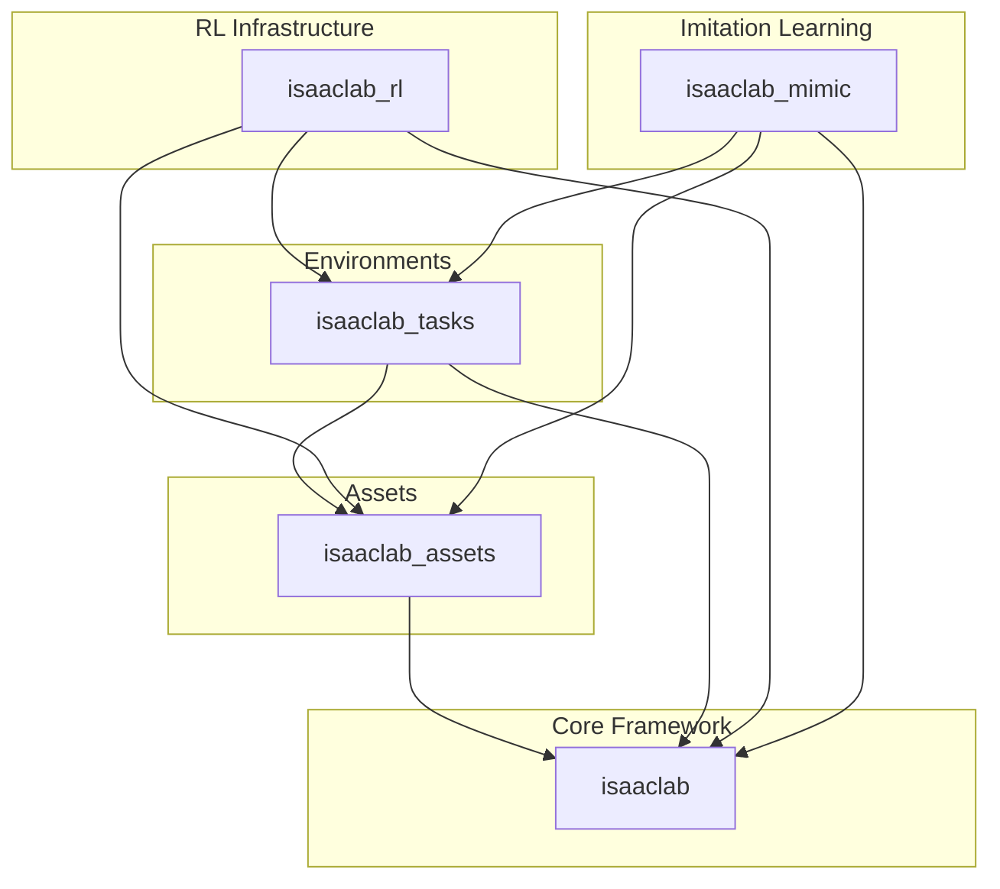
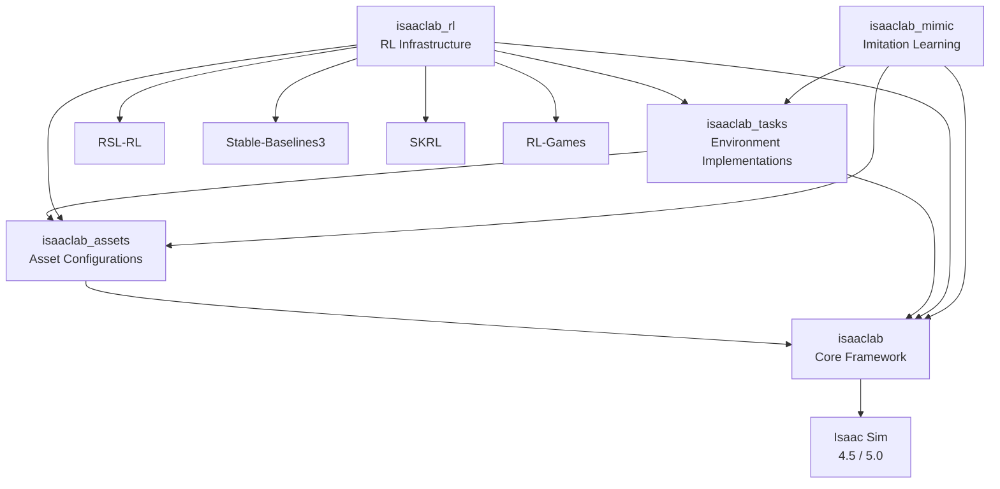
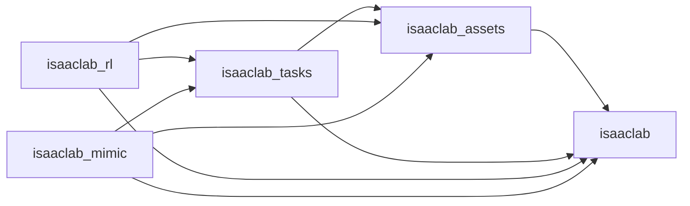

# Package Architecture

<cite>
**Referenced Files in This Document**
- [setup.py](file://source/isaaclab/setup.py)
- [extension.toml](file://source/isaaclab/config/extension.toml)
- [__init__.py](file://source/isaaclab/isaaclab/__init__.py)
- [setup.py](file://source/isaaclab_rl/setup.py)
- [extension.toml](file://source/isaaclab_rl/config/extension.toml)
- [__init__.py](file://source/isaaclab_rl/isaaclab_rl/__init__.py)
- [setup.py](file://source/isaaclab_tasks/setup.py)
- [extension.toml](file://source/isaaclab_tasks/config/extension.toml)
- [__init__.py](file://source/isaaclab_tasks/isaaclab_tasks/__init__.py)
- [setup.py](file://source/isaaclab_mimic/setup.py)
- [extension.toml](file://source/isaaclab_mimic/config/extension.toml)
- [__init__.py](file://source/isaaclab_mimic/isaaclab_mimic/__init__.py)
- [setup.py](file://source/isaaclab_assets/setup.py)
- [extension.toml](file://source/isaaclab_assets/config/extension.toml)
- [__init__.py](file://source/isaaclab_assets/isaaclab_assets/__init__.py)
</cite>

## Table of Contents
1. [Introduction](#introduction)
2. [Project Structure](#project-structure)
3. [Core Components](#core-components)
4. [Architecture Overview](#architecture-overview)
5. [Detailed Component Analysis](#detailed-component-analysis)
6. [Dependency Analysis](#dependency-analysis)
7. [Performance Considerations](#performance-considerations)
8. [Troubleshooting Guide](#troubleshooting-guide)
9. [Conclusion](#conclusion)

## Introduction
This document explains the package architecture and modular design of the Extreme Quadruped Parkour framework built on the Isaac Lab ecosystem. It focuses on the separation of concerns across:
- isaaclab (core framework)
- isaaclab_tasks (environment implementations)
- isaaclab_rl (reinforcement learning infrastructure)
- isaaclab_mimic (imitation learning)
- isaaclab_assets (robot assets)

It documents dependency relationships, import patterns, integration mechanisms, configuration options, parameter passing, and extension points. It also clarifies relationships with external dependencies such as RSL-RL and Isaac Sim.

## Project Structure
The repository is organized as a multi-package workspace with each package under source/<package_name>/ containing:
- A Python package named after the package
- A config/extension.toml file defining metadata and dependencies
- A setup.py defining installation requirements and extras
- Optional tests and documentation

Key characteristics:
- Each package defines its own Python module and registers it in extension.toml.
- Packages declare interdependencies in their extension.toml files.
- The core isaaclab package sets foundational interfaces and abstractions.
- isaaclab_tasks builds environments on top of isaaclab and isaaclab_assets.
- isaaclab_rl depends on isaaclab, isaaclab_assets, and isaaclab_tasks to provide RL wrappers and training integrations.
- isaaclab_mimic depends on isaaclab, isaaclab_assets, and isaaclab_tasks for data generation and IL workflows.
- isaaclab_assets provides reusable asset and sensor configurations consumed by other packages.

**Diagram sources**
- [extension.toml:14-17](file://source/isaaclab_rl/config/extension.toml#L14-L17)
- [extension.toml:14-16](file://source/isaaclab_tasks/config/extension.toml#L14-L16)
- [extension.toml:17-21](file://source/isaaclab_mimic/config/extension.toml#L17-L21)
- [extension.toml:13-14](file://source/isaaclab_assets/config/extension.toml#L13-L14)

**Section sources**
- [extension.toml:1-41](file://source/isaaclab/config/extension.toml#L1-L41)
- [extension.toml:1-24](file://source/isaaclab_rl/config/extension.toml#L1-L24)
- [extension.toml:1-23](file://source/isaaclab_tasks/config/extension.toml#L1-L23)
- [extension.toml:1-30](file://source/isaaclab_mimic/config/extension.toml#L1-L30)
- [extension.toml:1-22](file://source/isaaclab_assets/config/extension.toml#L1-L22)

## Core Components
- isaaclab (core framework):
  - Provides foundational interfaces and abstractions for robotics simulation and learning.
  - Defines metadata and versioning via extension.toml and exposes __version__ in its __init__.py.
  - Declares minimal runtime requirements in setup.py and Pip API requirements in extension.toml.

- isaaclab_assets (robot assets):
  - Supplies asset and sensor configuration instances.
  - Exposes imported robot and sensor namespaces in its __init__.py.
  - Declares dependency on isaaclab in extension.toml.

- isaaclab_tasks (environment implementations):
  - Implements environment suites for robot learning.
  - Registers Gym environments by importing task packages during initialization.
  - Declares dependencies on isaaclab and isaaclab_assets in extension.toml.

- isaaclab_rl (reinforcement learning infrastructure):
  - Wraps environments for multiple RL frameworks (e.g., RSL-RL, SB3, SKRL, RL-Games).
  - Depends on isaaclab, isaaclab_assets, and isaaclab_tasks.
  - Provides extras_require for framework-specific dependencies.

- isaaclab_mimic (imitation learning):
  - Provides data generation and IL utilities.
  - Depends on isaaclab, isaaclab_assets, and isaaclab_tasks.
  - Includes optional robomimic extras on Linux.

**Section sources**
- [__init__.py:1-20](file://source/isaaclab/isaaclab/__init__.py#L1-L20)
- [extension.toml:1-41](file://source/isaaclab/config/extension.toml#L1-L41)
- [setup.py:1-83](file://source/isaaclab/setup.py#L1-L83)
- [__init__.py:1-25](file://source/isaaclab_assets/isaaclab_assets/__init__.py#L1-L25)
- [extension.toml:1-22](file://source/isaaclab_assets/config/extension.toml#L1-L22)
- [setup.py:1-39](file://source/isaaclab_assets/setup.py#L1-L39)
- [__init__.py:1-32](file://source/isaaclab_tasks/isaaclab_tasks/__init__.py#L1-L32)
- [extension.toml:1-23](file://source/isaaclab_tasks/config/extension.toml#L1-L23)
- [setup.py:1-57](file://source/isaaclab_tasks/setup.py#L1-L57)
- [__init__.py:1-20](file://source/isaaclab_rl/isaaclab_rl/__init__.py#L1-L20)
- [extension.toml:1-24](file://source/isaaclab_rl/config/extension.toml#L1-L24)
- [setup.py:1-83](file://source/isaaclab_rl/setup.py#L1-L83)
- [__init__.py:1-9](file://source/isaaclab_mimic/isaaclab_mimic/__init__.py#L1-L9)
- [extension.toml:1-30](file://source/isaaclab_mimic/config/extension.toml#L1-L30)
- [setup.py:1-63](file://source/isaaclab_mimic/setup.py#L1-L63)

## Architecture Overview
The architecture follows a layered design:
- isaaclab provides core abstractions and interfaces.
- isaaclab_assets centralizes asset and sensor configurations.
- isaaclab_tasks implements environment logic and registers Gym environments.
- isaaclab_rl integrates environments with RL frameworks and manages training workflows.
- isaaclab_mimic adds IL data generation and augmentation pipelines.

External dependencies:
- Isaac Sim: Supported versions are declared in classifiers across packages.
- RL libraries: RSL-RL, Stable-Baselines3, SKRL, RL-Games are supported via extras_require.
- Gymnasium: Used for environment registration and wrappers.

**Diagram sources**
- [extension.toml:14-17](file://source/isaaclab_rl/config/extension.toml#L14-L17)
- [extension.toml:14-16](file://source/isaaclab_tasks/config/extension.toml#L14-L16)
- [extension.toml:17-21](file://source/isaaclab_mimic/config/extension.toml#L17-L21)
- [extension.toml:78-79](file://source/isaaclab/config/extension.toml#L78-L79)
- [setup.py:41-52](file://source/isaaclab_rl/setup.py#L41-L52)

## Detailed Component Analysis

### isaaclab (Core Framework)
Responsibilities:
- Defines foundational interfaces for environments, sensors, controllers, actuators, scenes, and simulation.
- Provides metadata and versioning via extension.toml and __init__.py.
- Declares runtime dependencies and platform-specific requirements in setup.py.
- Supports Pip API modules for seamless integration with Isaac Sim extensions.

Configuration and initialization:
- Metadata loaded from extension.toml and exposed as module-level attributes.
- Version derived from extension.toml package.version.

Integration points:
- Serves as the base for isaaclab_tasks and isaaclab_mimic.
- Consumed by isaaclab_rl for environment wrappers and training orchestration.

**Section sources**
- [__init__.py:1-20](file://source/isaaclab/isaaclab/__init__.py#L1-L20)
- [extension.toml:1-41](file://source/isaaclab/config/extension.toml#L1-L41)
- [setup.py:1-83](file://source/isaaclab/setup.py#L1-L83)

### isaaclab_assets (Robot Assets)
Responsibilities:
- Centralizes asset and sensor configurations for robots and sensors.
- Exposes imported namespaces for easy consumption by tasks and RL components.

Initialization and imports:
- Imports robot and sensor modules in __init__.py to expose them at package level.
- Data directory path resolved from extension.toml location.

Integration points:
- Consumed by isaaclab_tasks for environment construction.
- Consumed by isaaclab_rl for asset-aware environment wrappers.

**Section sources**
- [__init__.py:1-25](file://source/isaaclab_assets/isaaclab_assets/__init__.py#L1-L25)
- [extension.toml:1-22](file://source/isaaclab_assets/config/extension.toml#L1-L22)
- [setup.py:1-39](file://source/isaaclab_assets/setup.py#L1-L39)

### isaaclab_tasks (Environment Implementations)
Responsibilities:
- Implements environment suites for robot learning.
- Registers Gym environments by importing task packages during initialization.

Registration mechanism:
- Uses import_packages from utils to dynamically import task modules while excluding blacklisted subpackages.
- Blacklist prevents importing certain subpackages until compatibility is ensured.

Integration points:
- Depends on isaaclab for core interfaces.
- Depends on isaaclab_assets for asset configurations.

**Section sources**
- [__init__.py:1-32](file://source/isaaclab_tasks/isaaclab_tasks/__init__.py#L1-L32)
- [extension.toml:1-23](file://source/isaaclab_tasks/config/extension.toml#L1-L23)
- [setup.py:1-57](file://source/isaaclab_tasks/setup.py#L1-L57)

### isaaclab_rl (Reinforcement Learning Infrastructure)
Responsibilities:
- Provides environment wrappers for multiple RL frameworks.
- Manages training orchestration and logging.

Dependencies and extras:
- Declares dependencies on isaaclab, isaaclab_assets, and isaaclab_tasks.
- Extras include support for RSL-RL, Stable-Baselines3, SKRL, and RL-Games.

Integration points:
- Wraps environments produced by isaaclab_tasks and isaaclab_assets.
- Exposes framework-specific training scripts and utilities.

**Section sources**
- [__init__.py:1-20](file://source/isaaclab_rl/isaaclab_rl/__init__.py#L1-L20)
- [extension.toml:1-24](file://source/isaaclab_rl/config/extension.toml#L1-L24)
- [setup.py:1-83](file://source/isaaclab_rl/setup.py#L1-L83)

### isaaclab_mimic (Imitation Learning)
Responsibilities:
- Provides data generation and IL utilities.
- Integrates with tasks and assets for demonstration and dataset creation.

Dependencies:
- Depends on isaaclab, isaaclab_assets, and isaaclab_tasks.
- On Linux, supports robomimic via extras_require.

Integration points:
- Works with isaaclab_tasks environments to generate demonstrations.
- Leverages isaaclab_assets for sensor and robot configurations.

**Section sources**
- [__init__.py:1-9](file://source/isaaclab_mimic/isaaclab_mimic/__init__.py#L1-L9)
- [extension.toml:1-30](file://source/isaaclab_mimic/config/extension.toml#L1-L30)
- [setup.py:1-63](file://source/isaaclab_mimic/setup.py#L1-L63)

## Dependency Analysis
Inter-package dependencies are declared in extension.toml:
- isaaclab_rl depends on isaaclab, isaaclab_assets, and isaaclab_tasks.
- isaaclab_tasks depends on isaaclab and isaaclab_assets.
- isaaclab_mimic depends on isaaclab, isaaclab_assets, and isaaclab_tasks.
- isaaclab_assets depends on isaaclab.

Runtime dependency loading:
- isaaclab_tasks initializes by importing task packages, enabling Gym environment registration.
- isaaclab_rl and isaaclab_mimic rely on the presence of isaaclab and isaaclab_assets to function.

**Diagram sources**
- [extension.toml:14-17](file://source/isaaclab_rl/config/extension.toml#L14-L17)
- [extension.toml:14-16](file://source/isaaclab_tasks/config/extension.toml#L14-L16)
- [extension.toml:17-21](file://source/isaaclab_mimic/config/extension.toml#L17-L21)
- [extension.toml:13-14](file://source/isaaclab_assets/config/extension.toml#L13-L14)

**Section sources**
- [extension.toml:14-17](file://source/isaaclab_rl/config/extension.toml#L14-L17)
- [extension.toml:14-16](file://source/isaaclab_tasks/config/extension.toml#L14-L16)
- [extension.toml:17-21](file://source/isaaclab_mimic/config/extension.toml#L17-L21)
- [extension.toml:13-14](file://source/isaaclab_assets/config/extension.toml#L13-L14)

## Performance Considerations
- Package boundaries reduce coupling by isolating concerns:
  - isaaclab_assets centralizes asset configuration, minimizing duplication across tasks.
  - isaaclab_tasks encapsulates environment logic, simplifying RL integration in isaaclab_rl.
- Lazy imports in isaaclab_tasks (via import_packages) defer heavy imports until needed, improving startup time.
- Platform-specific dependencies (e.g., Linux-only packages) are isolated to minimize overhead on non-Linux systems.

[No sources needed since this section provides general guidance]

## Troubleshooting Guide
Common issues and resolutions:
- Missing dependencies:
  - Ensure the correct extras are installed for the chosen RL framework (e.g., rsl-rl, sb3, skrl, rl-games).
  - Verify platform-specific dependencies are present (e.g., Linux-only packages for certain features).
- Environment registration failures:
  - Confirm that isaaclab_tasks is installed and that task packages are importable.
  - Check that the blacklist excludes incompatible subpackages as intended.
- Asset-related errors:
  - Verify that isaaclab_assets is installed and that asset configurations are resolvable.
- Version mismatches:
  - Align Python and Torch versions per package classifiers and setup.py constraints.
  - Confirm Isaac Sim version compatibility indicated in classifiers.

**Section sources**
- [setup.py:41-52](file://source/isaaclab_rl/setup.py#L41-L52)
- [__init__.py:25-31](file://source/isaaclab_tasks/isaaclab_tasks/__init__.py#L25-L31)
- [extension.toml:78-79](file://source/isaaclab/config/extension.toml#L78-L79)
- [setup.py:70-71](file://source/isaaclab/setup.py#L70-L71)

## Conclusion
The Extreme Quadruped Parkour framework employs a clean, layered architecture:
- isaaclab provides core abstractions.
- isaaclab_assets consolidates asset configurations.
- isaaclab_tasks implements environment logic and registers Gym environments.
- isaaclab_rl integrates environments with RL frameworks and manages training.
- isaaclab_mimic enables IL workflows with shared assets and tasks.

Dependencies are explicitly declared, initialization patterns are explicit, and extension points are clearly defined. This modularity facilitates customization, maintainability, and interoperability with external RL ecosystems and Isaac Sim.