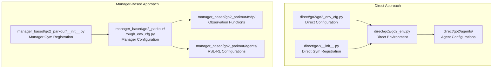
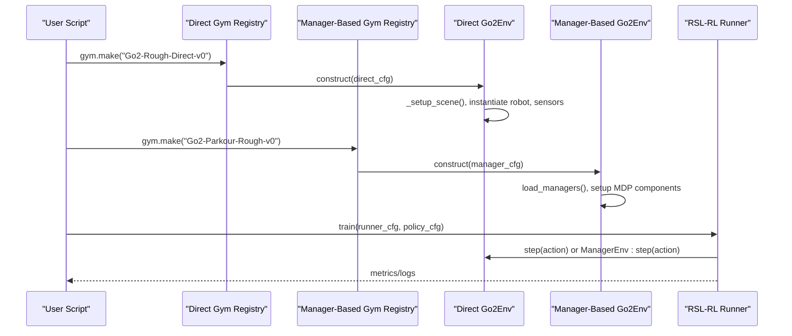
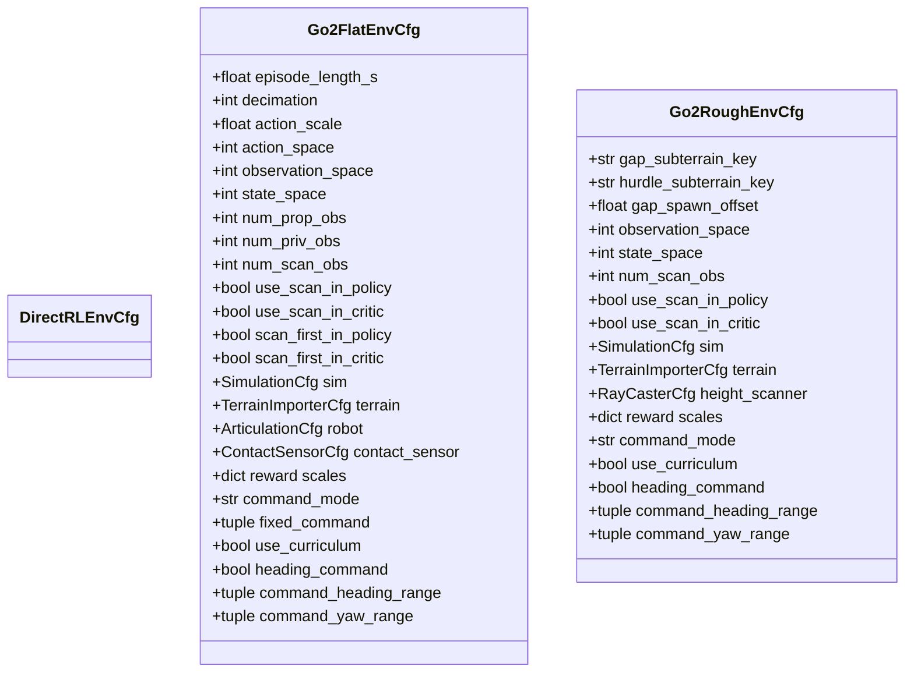
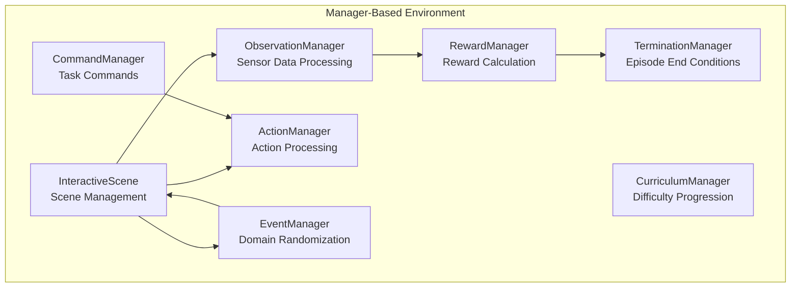
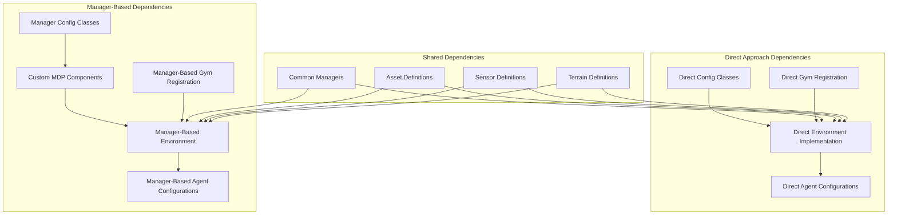
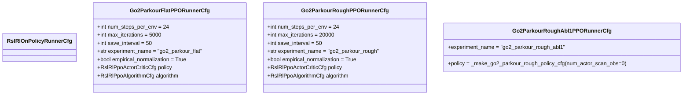

# Environment Configuration and Setup

<cite>
**Referenced Files in This Document**
- [go2_env_cfg.py](file://source/isaaclab_tasks/isaaclab_tasks/direct/go2/go2_env_cfg.py)
- [go2_env.py](file://source/isaaclab_tasks/isaaclab_tasks/direct/go2/go2_env.py)
- [rsl_rl_ppo_cfg.py](file://source/isaaclab_tasks/isaaclab_tasks/direct/go2/agents/rsl_rl_ppo_cfg.py)
- [__init__.py](file://source/isaaclab_tasks/isaaclab_tasks/direct/go2/__init__.py)
- [terrain_generator.py](file://source/isaaclab/isaaclab/terrains/terrain_generator.py)
- [configclass.py](file://source/isaaclab/isaaclab/utils/configclass.py)
- [rough_env_cfg.py](file://source/isaaclab_tasks/isaaclab_tasks/manager_based/locomotion/velocity/config/go2_parkour/rough_env_cfg.py)
- [__init__.py](file://source/isaaclab_tasks/isaaclab_tasks/manager_based/locomotion/velocity/config/go2_parkour/__init__.py)
- [observations.py](file://source/isaaclab_tasks/isaaclab_tasks/manager_based/locomotion/velocity/config/go2_parkour/mdp/observations.py)
- [rsl_rl_ppo_cfg.py](file://source/isaaclab_tasks/isaaclab_tasks/manager_based/locomotion/velocity/config/go2_parkour/agents/rsl_rl_ppo_cfg.py)
- [manager_based_env.py](file://source/isaaclab/isaaclab/envs/manager_based_env.py)
- [manager_based_env_cfg.py](file://source/isaaclab/isaaclab/envs/manager_based_env_cfg.py)
- [manager_based_rl_env_cfg.py](file://source/isaaclab/isaaclab/envs/manager_based_rl_env_cfg.py)
- [train.py](file://scripts/reinforcement_learning/rsl_rl/train.py)
- [run_train_envs.py](file://tools/run_train_envs.py)
</cite>

## Update Summary
**Changes Made**
- Added comprehensive documentation for manager-based environment configuration system
- Documented new manager-based Go2 parkour environment setup with flat/rough/play variants
- Added training commands and Gym registration for manager-based environments
- Enhanced ablation study framework with manager-based variants
- Updated architecture diagrams to reflect both direct and manager-based approaches
- Added practical examples for manager-based environment configuration

## Table of Contents
1. [Introduction](#introduction)
2. [Project Structure](#project-structure)
3. [Core Components](#core-components)
4. [Architecture Overview](#architecture-overview)
5. [Detailed Component Analysis](#detailed-component-analysis)
6. [Manager-Based Environment System](#manager-based-environment-system)
7. [Dependency Analysis](#dependency-analysis)
8. [Performance Considerations](#performance-considerations)
9. [Training Commands and Setup](#training-commands-and-setup)
10. [Troubleshooting Guide](#troubleshooting-guide)
11. [Conclusion](#conclusion)

## Introduction
This document explains the Go2 Environment Configuration and Setup system used for quadruped parkour and locomotion research. The system now supports both direct and manager-based configuration approaches, providing enhanced modularity and flexibility for environment design. Key features include:
- Dual configuration paradigms: direct configuration classes and manager-based configuration classes
- Comprehensive environment variants: flat, rough, play, and ablation studies
- Advanced manager-based MDP components: observations, rewards, commands, and curriculum
- Unified Gym registration system supporting both configuration approaches
- Complete training pipeline with manager-based environment setup

## Project Structure
The Go2 environment system now includes both direct and manager-based implementations organized under the isaaclab_tasks package:



**Diagram sources**
- [go2_env_cfg.py:70-170](file://source/isaaclab_tasks/isaaclab_tasks/direct/go2/go2_env_cfg.py#L70-L170)
- [rough_env_cfg.py:448-462](file://source/isaaclab_tasks/isaaclab_tasks/manager_based/locomotion/velocity/config/go2_parkour/rough_env_cfg.py#L448-L462)
- [__init__.py:18-47](file://source/isaaclab_tasks/isaaclab_tasks/direct/go2/__init__.py#L18-L47)
- [__init__.py:21-51](file://source/isaaclab_tasks/isaaclab_tasks/manager_based/locomotion/velocity/config/go2_parkour/__init__.py#L21-L51)

**Section sources**
- [go2_env_cfg.py:70-170](file://source/isaaclab_tasks/isaaclab_tasks/direct/go2/go2_env_cfg.py#L70-L170)
- [rough_env_cfg.py:448-462](file://source/isaaclab_tasks/isaaclab_tasks/manager_based/locomotion/velocity/config/go2_parkour/rough_env_cfg.py#L448-L462)
- [__init__.py:18-47](file://source/isaaclab_tasks/isaaclab_tasks/direct/go2/__init__.py#L18-L47)
- [__init__.py:21-51](file://source/isaaclab_tasks/isaaclab_tasks/manager_based/locomotion/velocity/config/go2_parkour/__init__.py#L21-L51)

## Core Components

### Direct Environment Components
- **Go2FlatEnvCfg**: Base configuration for flat terrain with minimal proprioceptive inputs
- **Go2RoughEnvCfg**: Enhanced configuration for rough, procedurally generated terrain with height scanner
- **Go2RoughPlayEnvCfg**: Evaluation variant with curriculum disabled and fixed commands
- **Ablation Variants**: Abl1, Abl2.5, Abl3.5, Abl4.0, Abl7.0 for perception ablation studies

### Manager-Based Environment Components
- **Go2ParkourFlatEnvCfg**: Manager-based flat terrain configuration mirroring direct approach
- **Go2ParkourRoughEnvCfg**: Manager-based rough terrain with custom parkour terrains
- **Go2ParkourRoughPlayEnvCfg**: Manager-based evaluation variant
- **Go2ParkourRoughAbl1-Abl7.0**: Manager-based ablation variants with scan encoding options

**Section sources**
- [go2_env_cfg.py:70-170](file://source/isaaclab_tasks/isaaclab_tasks/direct/go2/go2_env_cfg.py#L70-L170)
- [go2_env_cfg.py:172-314](file://source/isaaclab_tasks/isaaclab_tasks/direct/go2/go2_env_cfg.py#L172-L314)
- [rough_env_cfg.py:505-757](file://source/isaaclab_tasks/isaaclab_tasks/manager_based/locomotion/velocity/config/go2_parkour/rough_env_cfg.py#L505-L757)

## Architecture Overview
The environment system now supports two distinct architectural approaches while maintaining compatibility:



**Diagram sources**
- [__init__.py:18-47](file://source/isaaclab_tasks/isaaclab_tasks/direct/go2/__init__.py#L18-L47)
- [__init__.py:21-51](file://source/isaaclab_tasks/isaaclab_tasks/manager_based/locomotion/velocity/config/go2_parkour/__init__.py#L21-L51)
- [manager_based_env.py:110-157](file://source/isaaclab/isaaclab/envs/manager_based_env.py#L110-L157)

## Detailed Component Analysis

### Direct Environment Configuration Classes
The direct approach maintains the original configuration structure with enhanced ablation capabilities:



**Diagram sources**
- [go2_env_cfg.py:70-170](file://source/isaaclab_tasks/isaaclab_tasks/direct/go2/go2_env_cfg.py#L70-L170)
- [go2_env_cfg.py:172-314](file://source/isaaclab_tasks/isaaclab_tasks/direct/go2/go2_env_cfg.py#L172-L314)

### Manager-Based Environment Configuration Classes
The manager-based approach introduces a modular MDP architecture with dedicated configuration classes:

```mermaid
classDiagram
class ManagerBasedRLEnvCfg {
+ViewerCfg viewer
+SimulationCfg sim
+InteractiveSceneCfg scene
+ObservationManager obs_mgr
+ActionManager action_mgr
+EventManager event_mgr
+RewardManager reward_mgr
+TerminationManager term_mgr
+CurriculumManager curr_mgr
+CommandManager cmd_mgr
+int decimation
+float episode_length_s
}
class Go2ParkourSceneCfg {
+TerrainImporterCfg terrain
+ArticulationCfg robot
+RayCasterCfg height_scanner
+ContactSensorCfg contact_forces
+AssetBaseCfg sky_light
+int num_envs
+float env_spacing
}
class Go2ParkourObservationsCfg {
+ObsGroup policy
+ObsGroup critic
+class PolicyCfg
+class CriticCfg
}
class Go2ParkourRewardsCfg {
+RewTerm track_lin_vel_xy_exp
+RewTerm track_ang_vel_z_exp
+RewTerm lin_vel_z_l2
+RewTerm ang_vel_xy_l2
+RewTerm dof_torques_l2
+RewTerm action_rate_l2
+RewTerm feet_air_time
+RewTerm undesired_contacts
+RewTerm flat_orientation_l2
+RewTerm base_height
}
class Go2ParkourCommandsCfg {
+CommandTerm base_velocity
}
class Go2ParkourActionsCfg {
+ActionTerm joint_pos
}
class Go2ParkourEventCfg {
+EventTerm physics_material
+EventTerm add_base_mass
+EventTerm base_com
+EventTerm randomize_pd
+EventTerm reset_base
+EventTerm reset_robot_joints
}
class Go2ParkourTerminationsCfg {
+DoneTerm time_out
+DoneTerm base_contact
}
class Go2ParkourCurriculumCfg {
+CurrTerm terrain_levels
}
```



**Diagram sources**
- [manager_based_rl_env_cfg.py:14-81](file://source/isaaclab/isaaclab/envs/manager_based_rl_env_cfg.py#L14-L81)
- [rough_env_cfg.py:57-170](file://source/isaaclab_tasks/isaaclab_tasks/manager_based/locomotion/velocity/config/go2_parkour/rough_env_cfg.py#L57-L170)
- [rough_env_cfg.py:177-441](file://source/isaaclab_tasks/isaaclab_tasks/manager_based/locomotion/velocity/config/go2_parkour/rough_env_cfg.py#L177-L441)

**Section sources**
- [manager_based_rl_env_cfg.py:14-81](file://source/isaaclab/isaaclab/envs/manager_based_rl_env_cfg.py#L14-L81)
- [rough_env_cfg.py:57-170](file://source/isaaclab_tasks/isaaclab_tasks/manager_based/locomotion/velocity/config/go2_parkour/rough_env_cfg.py#L57-L170)
- [rough_env_cfg.py:177-441](file://source/isaaclab_tasks/isaaclab_tasks/manager_based/locomotion/velocity/config/go2_parkour/rough_env_cfg.py#L177-L441)

## Manager-Based Environment System

### Manager Architecture
The manager-based system introduces a modular approach with dedicated managers for different aspects of the environment:



**Diagram sources**
- [manager_based_env.py:30-69](file://source/isaaclab/isaaclab/envs/manager_based_env.py#L30-L69)
- [manager_based_env.py:110-157](file://source/isaaclab/isaaclab/envs/manager_based_env.py#L110-L157)

### Custom MDP Components
The manager-based system includes custom MDP components for parkour-specific functionality:

- **Custom Observations**: Privileged observations for mass, COM, friction, and PD gain scaling
- **Custom Rewards**: Parkour-specific reward terms including torque sum, stop penalties, and mechanical work
- **Custom Commands**: Velocity commands with heading control for parkour navigation
- **Custom Events**: Domain randomization for physics properties and robot configuration

**Section sources**
- [observations.py:33-111](file://source/isaaclab_tasks/isaaclab_tasks/manager_based/locomotion/velocity/config/go2_parkour/mdp/observations.py#L33-L111)
- [rough_env_cfg.py:367-423](file://source/isaaclab_tasks/isaaclab_tasks/manager_based/locomotion/velocity/config/go2_parkour/rough_env_cfg.py#L367-L423)
- [rough_env_cfg.py:177-195](file://source/isaaclab_tasks/isaaclab_tasks/manager_based/locomotion/velocity/config/go2_parkour/rough_env_cfg.py#L177-L195)

## Dependency Analysis
The dual configuration system maintains clear separation of concerns while enabling shared functionality:



**Diagram sources**
- [go2_env_cfg.py:70-170](file://source/isaaclab_tasks/isaaclab_tasks/direct/go2/go2_env_cfg.py#L70-L170)
- [rough_env_cfg.py:448-462](file://source/isaaclab_tasks/isaaclab_tasks/manager_based/locomotion/velocity/config/go2_parkour/rough_env_cfg.py#L448-L462)
- [manager_based_env_cfg.py:39-134](file://source/isaaclab/isaaclab/envs/manager_based_env_cfg.py#L39-L134)

**Section sources**
- [go2_env_cfg.py:70-170](file://source/isaaclab_tasks/isaaclab_tasks/direct/go2/go2_env_cfg.py#L70-L170)
- [rough_env_cfg.py:448-462](file://source/isaaclab_tasks/isaaclab_tasks/manager_based/locomotion/velocity/config/go2_parkour/rough_env_cfg.py#L448-L462)
- [manager_based_env_cfg.py:39-134](file://source/isaaclab/isaaclab/envs/manager_based_env_cfg.py#L39-L134)

## Performance Considerations
Both configuration approaches offer distinct performance characteristics:

### Direct Approach Performance
- **Memory Efficiency**: Lower memory overhead due to direct sensor instantiation
- **Computation Speed**: Faster observation computation with direct tensor access
- **Simplicity**: Straightforward implementation with minimal manager overhead

### Manager-Based Approach Performance
- **Modularity**: Higher memory usage due to manager overhead and intermediate buffers
- **Flexibility**: More computationally expensive but highly configurable
- **Extensibility**: Easy addition of new managers and MDP components
- **Customization**: Supports complex MDP configurations with custom functions

## Training Commands and Setup

### Manager-Based Environment Registration
The manager-based system provides comprehensive Gym registration for all environment variants:

```python
# Flat terrain registration
gym.register(
    id="Go2-Parkour-Flat-v0",
    entry_point="isaaclab.envs:ManagerBasedRLEnv",
    disable_env_checker=True,
    kwargs={
        "env_cfg_entry_point": f"{__name__}.rough_env_cfg:Go2ParkourFlatEnvCfg",
        "rsl_rl_cfg_entry_point": f"{agents.__name__}.rsl_rl_ppo_cfg:Go2ParkourFlatPPORunnerCfg",
    },
)

# Rough terrain registration  
gym.register(
    id="Go2-Parkour-Rough-v0",
    entry_point="isaaclab.envs:ManagerBasedRLEnv",
    disable_env_checker=True,
    kwargs={
        "env_cfg_entry_point": f"{__name__}.rough_env_cfg:Go2ParkourRoughEnvCfg",
        "rsl_rl_cfg_entry_point": f"{agents.__name__}.rsl_rl_ppo_cfg:Go2ParkourRoughPPORunnerCfg",
    },
)
```

### Training Commands
The manager-based system supports the same training workflow as the direct approach:

```bash
# Train manager-based rough environment
python scripts/reinforcement_learning/rsl_rl/train.py \
    --task Go2-Parkour-Rough-v0 \
    --num_envs 4096 \
    --max_iterations 20000

# Train manager-based flat environment
python scripts/reinforcement_learning/rsl_rl/train.py \
    --task Go2-Parkour-Flat-v0 \
    --num_envs 1024 \
    --max_iterations 5000

# Run multiple environments with commit tags
python tools/run_train_envs.py --lib-name rsl_rl
```

### Agent Configuration for Manager-Based Environments
Manager-based environments use specialized agent configurations with scan encoding support:



**Diagram sources**
- [rsl_rl_ppo_cfg.py:49-158](file://source/isaaclab_tasks/isaaclab_tasks/manager_based/locomotion/velocity/config/go2_parkour/agents/rsl_rl_ppo_cfg.py#L49-L158)

**Section sources**
- [__init__.py:21-51](file://source/isaaclab_tasks/isaaclab_tasks/manager_based/locomotion/velocity/config/go2_parkour/__init__.py#L21-L51)
- [train.py:119-220](file://scripts/reinforcement_learning/rsl_rl/train.py#L119-L220)
- [run_train_envs.py:40-80](file://tools/run_train_envs.py#L40-L80)
- [rsl_rl_ppo_cfg.py:49-158](file://source/isaaclab_tasks/isaaclab_tasks/manager_based/locomotion/velocity/config/go2_parkour/agents/rsl_rl_ppo_cfg.py#L49-L158)

## Troubleshooting Guide

### Manager-Based Environment Issues
- **Missing Manager Configuration**: Ensure all required managers (observations, actions, rewards, terminations) are properly configured
- **Custom MDP Function Errors**: Verify custom observation and reward functions are properly imported and accessible
- **Sensor Configuration Problems**: Check that manager-based sensors are properly defined in the scene configuration
- **IO Descriptor Export**: Manager-based environments support IO descriptor export for policy deployment

### Dual Configuration Compatibility
- **Parameter Synchronization**: When switching between direct and manager-based configurations, ensure equivalent parameter values
- **Observation Space Differences**: Manager-based environments may have different observation spaces due to modular MDP components
- **Reward Function Variations**: Manager-based custom rewards may differ from direct reward implementations
- **Training Stability**: Manager-based environments may require different hyperparameters due to increased complexity

**Section sources**
- [manager_based_env.py:193-200](file://source/isaaclab/isaaclab/envs/manager_based_env.py#L193-L200)
- [train.py:158-165](file://scripts/reinforcement_learning/rsl_rl/train.py#L158-L165)
- [configclass.py:221-236](file://source/isaaclab/isaaclab/utils/configclass.py#L221-L236)

## Conclusion
The enhanced Go2 Environment Configuration and Setup system now provides a comprehensive dual-approach framework supporting both direct and manager-based configuration paradigms. The manager-based approach offers superior modularity and extensibility for complex parkour environments, while maintaining compatibility with the established direct approach. Both systems support comprehensive ablation studies, advanced terrain generation, and unified Gym registration for seamless training workflows. The addition of manager-based environments significantly expands the toolkit for quadruped parkour research while preserving backward compatibility and familiar interfaces.