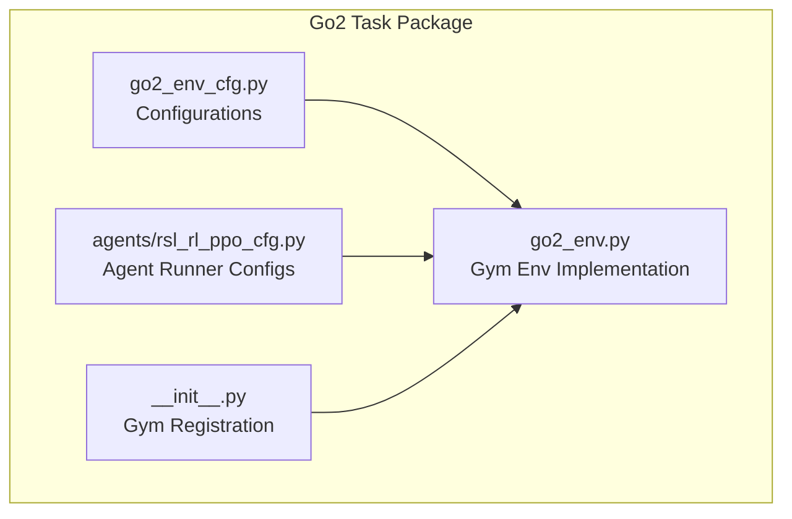
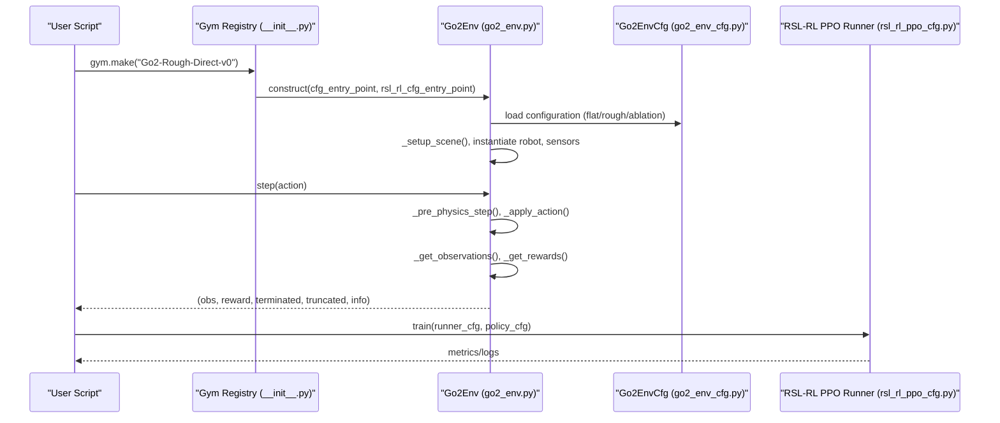
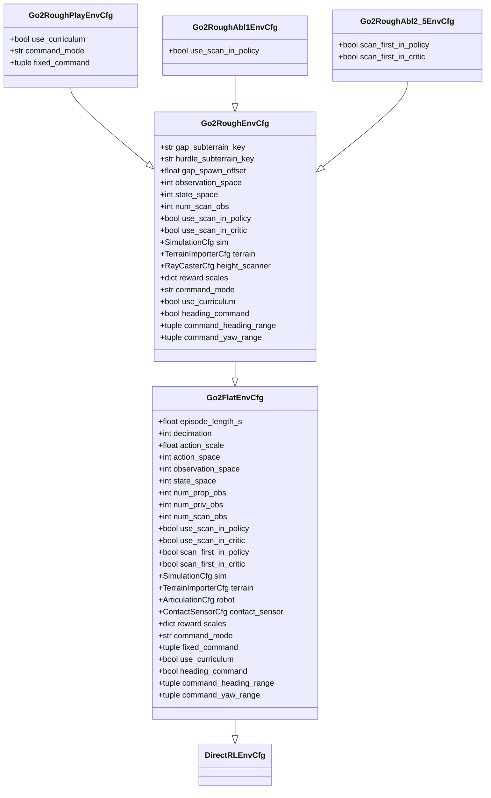
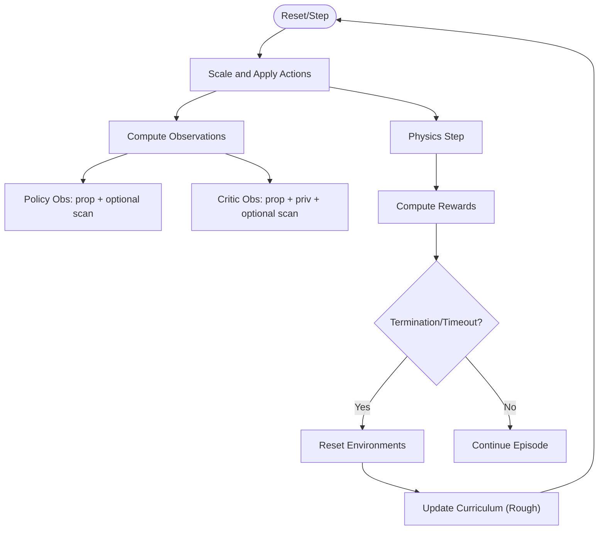
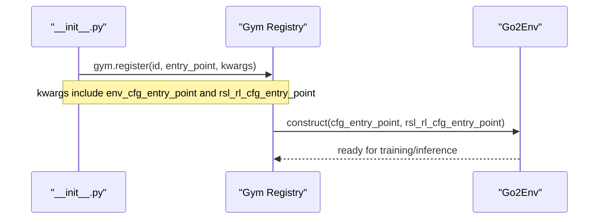
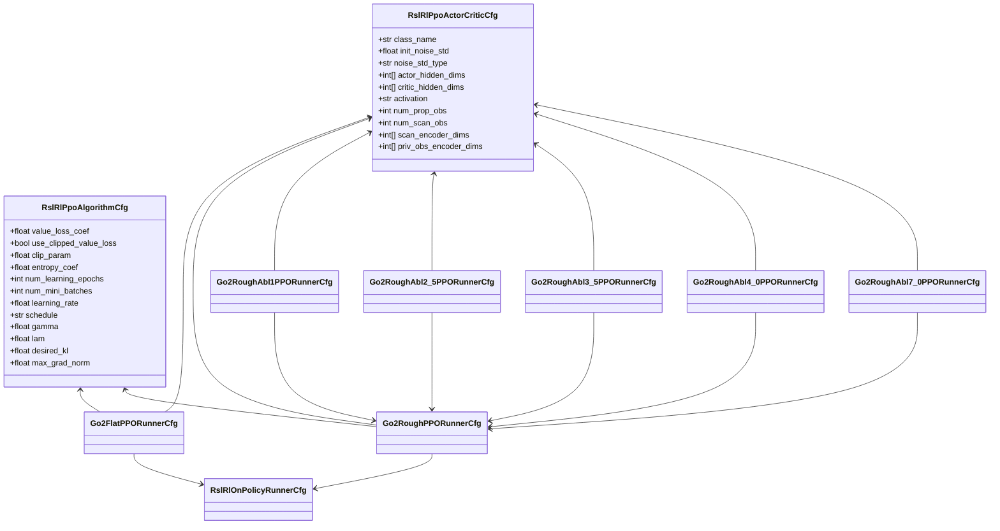
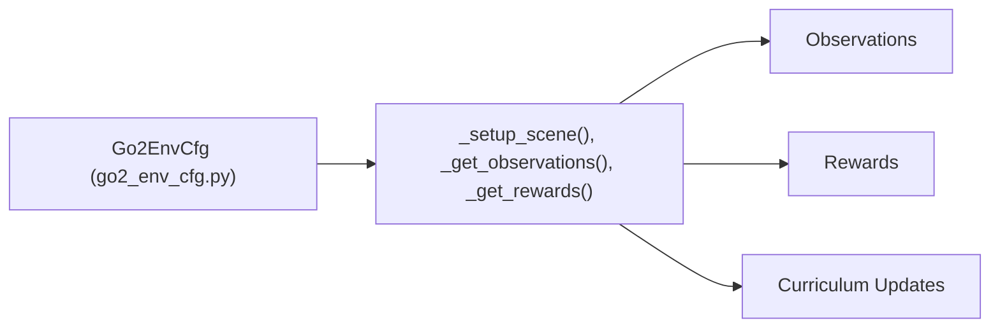
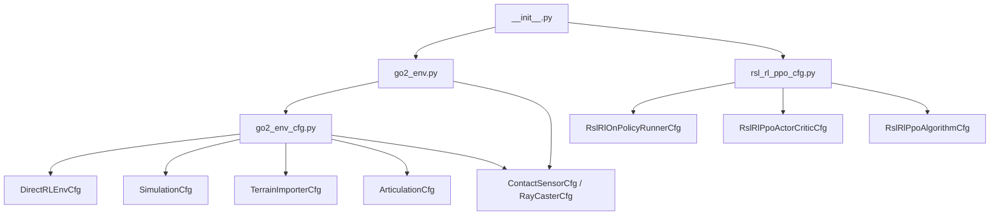

# Environment Configuration and Setup

<cite>
**Referenced Files in This Document**
- [go2_env_cfg.py](file://source/isaaclab_tasks/isaaclab_tasks/direct/go2/go2_env_cfg.py)
- [go2_env.py](file://source/isaaclab_tasks/isaaclab_tasks/direct/go2/go2_env.py)
- [rsl_rl_ppo_cfg.py](file://source/isaaclab_tasks/isaaclab_tasks/direct/go2/agents/rsl_rl_ppo_cfg.py)
- [__init__.py](file://source/isaaclab_tasks/isaaclab_tasks/direct/go2/__init__.py)
- [terrain_generator.py](file://source/isaaclab/isaaclab/terrains/terrain_generator.py)
- [configclass.py](file://source/isaaclab/isaaclab/utils/configclass.py)
</cite>

## Table of Contents
1. [Introduction](#introduction)
2. [Project Structure](#project-structure)
3. [Core Components](#core-components)
4. [Architecture Overview](#architecture-overview)
5. [Detailed Component Analysis](#detailed-component-analysis)
6. [Dependency Analysis](#dependency-analysis)
7. [Performance Considerations](#performance-considerations)
8. [Troubleshooting Guide](#troubleshooting-guide)
9. [Conclusion](#conclusion)

## Introduction
This document explains the Go2 Environment Configuration and Setup system used for quadruped parkour and locomotion research. It focuses on:
- Environment configuration classes Go2FlatEnvCfg and Go2RoughEnvCfg and their roles in the ablation study framework
- Terrain generation parameters, reward function scaling, sensor integration, and curriculum learning settings
- Environment registration via Gym and Gymnasium, and the Gym-compatible environment setup
- Agent configuration system using PPO hyperparameters, neural network architectures, and training parameters
- Practical examples for different terrain types, reward customization, and ablation setups
- Parameter validation and default value handling mechanisms

## Project Structure
The Go2 environment is organized under the isaaclab_tasks package with three primary modules:
- Environment configuration: defines environment parameters and reward terms
- Environment runtime: implements the Gymnasium-compatible RL environment
- Agent configuration: defines PPO runner and policy configurations for training

**Diagram sources**
- [go2_env_cfg.py:70-170](file://source/isaaclab_tasks/isaaclab_tasks/direct/go2/go2_env_cfg.py#L70-L170)
- [go2_env.py:20-60](file://source/isaaclab_tasks/isaaclab_tasks/direct/go2/go2_env.py#L20-L60)
- [rsl_rl_ppo_cfg.py:44-112](file://source/isaaclab_tasks/isaaclab_tasks/direct/go2/agents/rsl_rl_ppo_cfg.py#L44-L112)
- [__init__.py:18-47](file://source/isaaclab_tasks/isaaclab_tasks/direct/go2/__init__.py#L18-L47)

**Section sources**
- [go2_env_cfg.py:70-170](file://source/isaaclab_tasks/isaaclab_tasks/direct/go2/go2_env_cfg.py#L70-L170)
- [go2_env.py:20-60](file://source/isaaclab_tasks/isaaclab_tasks/direct/go2/go2_env.py#L20-L60)
- [rsl_rl_ppo_cfg.py:44-112](file://source/isaaclab_tasks/isaaclab_tasks/direct/go2/agents/rsl_rl_ppo_cfg.py#L44-L112)
- [__init__.py:18-47](file://source/isaaclab_tasks/isaaclab_tasks/direct/go2/__init__.py#L18-L47)

## Core Components
- Go2FlatEnvCfg: Base configuration for flat terrain with minimal proprioceptive inputs and a simple reward function. Suitable for basic locomotion and baseline training.
- Go2RoughEnvCfg: Enhanced configuration for rough, procedurally generated terrain with a height scanner (ray caster) providing dense spatial observations. Includes curriculum learning and advanced reward terms tuned for parkour-like challenges.
- Go2RoughPlayEnvCfg: Evaluation variant that disables curriculum and sets fixed commands for deterministic playback.
- Ablation variants (Abl1, Abl2.5, Abl3.5, Abl4.0, Abl7.0): Specialized subclasses that remove or alter sensor fusion and encoder pathways to isolate the contribution of perception to policy performance.
- Agent runner configurations: PPO runner settings and policy architectures tailored to the Go2 task, including ablation-specific policies.

Key configuration parameters:
- Observation spaces: proprioceptive (prop) + optional scan (187 rays) for policy/critic
- Reward scales: configurable per task and terrain difficulty
- Sensors: contact sensors and a height scanner (ray caster) for terrain-aware locomotion
- Curriculum: terrain difficulty progression and command sampling modes

**Section sources**
- [go2_env_cfg.py:70-170](file://source/isaaclab_tasks/isaaclab_tasks/direct/go2/go2_env_cfg.py#L70-L170)
- [go2_env_cfg.py:172-314](file://source/isaaclab_tasks/isaaclab_tasks/direct/go2/go2_env_cfg.py#L172-L314)
- [go2_env_cfg.py:316-353](file://source/isaaclab_tasks/isaaclab_tasks/direct/go2/go2_env_cfg.py#L316-L353)
- [go2_env.py:293-355](file://source/isaaclab_tasks/isaaclab_tasks/direct/go2/go2_env.py#L293-L355)
- [rsl_rl_ppo_cfg.py:44-155](file://source/isaaclab_tasks/isaaclab_tasks/direct/go2/agents/rsl_rl_ppo_cfg.py#L44-L155)

## Architecture Overview
The environment integrates configuration-driven behavior with a Gymnasium-compatible interface. The configuration classes define the environment’s dynamics, sensors, rewards, and curriculum. The environment runtime constructs the scene, applies actions, computes observations and rewards, and manages resets and curriculum updates.

**Diagram sources**
- [__init__.py:18-47](file://source/isaaclab_tasks/isaaclab_tasks/direct/go2/__init__.py#L18-L47)
- [go2_env.py:20-60](file://source/isaaclab_tasks/isaaclab_tasks/direct/go2/go2_env.py#L20-L60)
- [go2_env_cfg.py:70-170](file://source/isaaclab_tasks/isaaclab_tasks/direct/go2/go2_env_cfg.py#L70-L170)
- [rsl_rl_ppo_cfg.py:44-112](file://source/isaaclab_tasks/isaaclab_tasks/direct/go2/agents/rsl_rl_ppo_cfg.py#L44-L112)

## Detailed Component Analysis

### Environment Configuration Classes
- Go2FlatEnvCfg
  - Proprioceptive-only observations (no scan)
  - Flat terrain with plane ground
  - Basic reward terms for velocity tracking and stabilization
  - Command sampling modes and curriculum toggle
- Go2RoughEnvCfg
  - Adds a height scanner (ray caster) for dense terrain perception
  - Procedurally generated rough terrain with curriculum
  - Extended reward terms for parkour-relevant behaviors
  - Heading command mode and fixed command overrides for parkour-like training
- Play configuration
  - Disables curriculum and sets fixed commands for evaluation
- Ablation configurations
  - Abl1: removes scan from policy
  - Abl2.5: scans first in policy/critic
  - Abl3.5–Abl7.0: variations in scan encoding and privilege observation encoding

**Diagram sources**
- [go2_env_cfg.py:70-170](file://source/isaaclab_tasks/isaaclab_tasks/direct/go2/go2_env_cfg.py#L70-L170)
- [go2_env_cfg.py:172-314](file://source/isaaclab_tasks/isaaclab_tasks/direct/go2/go2_env_cfg.py#L172-L314)
- [go2_env_cfg.py:316-353](file://source/isaaclab_tasks/isaaclab_tasks/direct/go2/go2_env_cfg.py#L316-L353)

**Section sources**
- [go2_env_cfg.py:70-170](file://source/isaaclab_tasks/isaaclab_tasks/direct/go2/go2_env_cfg.py#L70-L170)
- [go2_env_cfg.py:172-314](file://source/isaaclab_tasks/isaaclab_tasks/direct/go2/go2_env_cfg.py#L172-L314)
- [go2_env_cfg.py:316-353](file://source/isaaclab_tasks/isaaclab_tasks/direct/go2/go2_env_cfg.py#L316-L353)

### Environment Runtime and Sensor Integration
- Scene setup: instantiates robot, contact sensor, and optionally the height scanner for rough terrain
- Action pipeline: scales actions and applies joint position targets
- Observations:
  - Policy input: prop + optional scan (order controlled by scan_first flags)
  - Critic input: prop + privileged obs (mass, COM, friction, PD gains) + optional scan
- Rewards: composite of velocity tracking, stabilization, contact penalties, and terrain-aware terms
- Curriculum: updates terrain difficulty based on achieved distance and command speed

**Diagram sources**
- [go2_env.py:233-274](file://source/isaaclab_tasks/isaaclab_tasks/direct/go2/go2_env.py#L233-L274)
- [go2_env.py:293-355](file://source/isaaclab_tasks/isaaclab_tasks/direct/go2/go2_env.py#L293-L355)
- [go2_env.py:467-535](file://source/isaaclab_tasks/isaaclab_tasks/direct/go2/go2_env.py#L467-L535)

**Section sources**
- [go2_env.py:212-232](file://source/isaaclab_tasks/isaaclab_tasks/direct/go2/go2_env.py#L212-L232)
- [go2_env.py:293-355](file://source/isaaclab_tasks/isaaclab_tasks/direct/go2/go2_env.py#L293-L355)
- [go2_env.py:467-535](file://source/isaaclab_tasks/isaaclab_tasks/direct/go2/go2_env.py#L467-L535)

### Environment Registration and Gym-Compatible Setup
- Registers multiple Gym environments:
  - Flat: Go2-Direct-v0
  - Rough: Go2-Rough-Direct-v0 and Abl variants
  - Play: Go2-Rough-Direct-Play-v0 and Abl Play variants
- Each registration passes environment and agent configuration entry points to the environment constructor

**Diagram sources**
- [__init__.py:18-47](file://source/isaaclab_tasks/isaaclab_tasks/direct/go2/__init__.py#L18-L47)
- [__init__.py:49-147](file://source/isaaclab_tasks/isaaclab_tasks/direct/go2/__init__.py#L49-L147)

**Section sources**
- [__init__.py:18-47](file://source/isaaclab_tasks/isaaclab_tasks/direct/go2/__init__.py#L18-L47)
- [__init__.py:49-147](file://source/isaaclab_tasks/isaaclab_tasks/direct/go2/__init__.py#L49-L147)

### Agent Configuration System (PPO)
- Runner configurations:
  - Go2FlatPPORunnerCfg: baseline PPO with proprioceptive-only policy
  - Go2RoughPPORunnerCfg: PPO with scan observations and higher learning rate
  - Abl variants:
    - Abl1: policy without scan
    - Abl2.5: policy without scan encoder (ActorCritic)
    - Abl3.5–Abl7.0: policy with scan encoder and/or privileged encoder modifications
- Policy architecture:
  - Actor/Critic hidden layers and activation
  - Scan encoder dimensions and privilege encoder dimensions
  - Noise initialization and KL divergence targeting

**Diagram sources**
- [rsl_rl_ppo_cfg.py:44-155](file://source/isaaclab_tasks/isaaclab_tasks/direct/go2/agents/rsl_rl_ppo_cfg.py#L44-L155)

**Section sources**
- [rsl_rl_ppo_cfg.py:44-155](file://source/isaaclab_tasks/isaaclab_tasks/direct/go2/agents/rsl_rl_ppo_cfg.py#L44-L155)

### Practical Examples

- Flat terrain baseline
  - Use Go2-Direct-v0 with Go2FlatEnvCfg and Go2FlatPPORunnerCfg
  - Ideal for initial policy learning and debugging

- Rough terrain parkour
  - Use Go2-Rough-Direct-v0 with Go2RoughEnvCfg and Go2RoughPPORunnerCfg
  - Enables curriculum learning and heading command modes

- Ablation studies
  - Abl1: remove scan from policy (Go2-Rough-Direct-Abl1-v0)
  - Abl2.5: remove scan encoder (Go2-Rough-Direct-Abl2_5-v0)
  - Abl3.5: scan encoder for policy/critic (Go2-Rough-Direct-Abl3_5-v0)
  - Abl4.0: scan encoder for policy only (Go2-Rough-Direct-Abl4_0-v0)
  - Abl7.0: scan and privileged encoders (Go2-Rough-Direct-Abl7_0-v0)

- Reward customization
  - Adjust reward scales in the environment configuration classes (e.g., Go2RoughEnvCfg overrides)
  - Example scales for parkour-like behaviors are provided in the rough configuration

- Curriculum learning
  - Enable curriculum via use_curriculum flag
  - Configure command_mode and heading_command for parkour-like training

**Section sources**
- [__init__.py:18-47](file://source/isaaclab_tasks/isaaclab_tasks/direct/go2/__init__.py#L18-L47)
- [__init__.py:49-147](file://source/isaaclab_tasks/isaaclab_tasks/direct/go2/__init__.py#L49-L147)
- [go2_env_cfg.py:172-314](file://source/isaaclab_tasks/isaaclab_tasks/direct/go2/go2_env_cfg.py#L172-L314)
- [go2_env_cfg.py:279-297](file://source/isaaclab_tasks/isaaclab_tasks/direct/go2/go2_env_cfg.py#L279-L297)

### Relationship Between Configuration and Implementation
- Configuration drives environment behavior:
  - Observation space composition (prop + scan)
  - Sensor instantiation (contact sensor, height scanner)
  - Reward computation and logging
  - Curriculum updates and command sampling
- Implementation validates and applies configuration:
  - Post-init recalculation of observation/state spaces
  - Conditional sensor creation for rough terrain
  - Dynamic command selection and heading control

**Diagram sources**
- [go2_env_cfg.py:311-313](file://source/isaaclab_tasks/isaaclab_tasks/direct/go2/go2_env_cfg.py#L311-L313)
- [go2_env.py:212-232](file://source/isaaclab_tasks/isaaclab_tasks/direct/go2/go2_env.py#L212-L232)
- [go2_env.py:293-355](file://source/isaaclab_tasks/isaaclab_tasks/direct/go2/go2_env.py#L293-L355)
- [go2_env.py:473-535](file://source/isaaclab_tasks/isaaclab_tasks/direct/go2/go2_env.py#L473-L535)

**Section sources**
- [go2_env_cfg.py:311-313](file://source/isaaclab_tasks/isaaclab_tasks/direct/go2/go2_env_cfg.py#L311-L313)
- [go2_env.py:212-232](file://source/isaaclab_tasks/isaaclab_tasks/direct/go2/go2_env.py#L212-L232)
- [go2_env.py:293-355](file://source/isaaclab_tasks/isaaclab_tasks/direct/go2/go2_env.py#L293-L355)
- [go2_env.py:473-535](file://source/isaaclab_tasks/isaaclab_tasks/direct/go2/go2_env.py#L473-L535)

## Dependency Analysis
- Environment configuration depends on:
  - DirectRLEnvCfg base class
  - Simulation and terrain configuration classes
  - Asset and sensor configuration classes
- Environment runtime depends on:
  - Configuration classes for behavior
  - Sensor classes for observations
  - Reward computation logic
- Agent runner depends on:
  - PPO runner and algorithm configurations
  - Policy configuration with optional scan encoders

**Diagram sources**
- [go2_env_cfg.py:70-170](file://source/isaaclab_tasks/isaaclab_tasks/direct/go2/go2_env_cfg.py#L70-L170)
- [go2_env.py:20-60](file://source/isaaclab_tasks/isaaclab_tasks/direct/go2/go2_env.py#L20-L60)
- [rsl_rl_ppo_cfg.py:44-155](file://source/isaaclab_tasks/isaaclab_tasks/direct/go2/agents/rsl_rl_ppo_cfg.py#L44-L155)
- [__init__.py:18-47](file://source/isaaclab_tasks/isaaclab_tasks/direct/go2/__init__.py#L18-L47)

**Section sources**
- [go2_env_cfg.py:70-170](file://source/isaaclab_tasks/isaaclab_tasks/direct/go2/go2_env_cfg.py#L70-L170)
- [go2_env.py:20-60](file://source/isaaclab_tasks/isaaclab_tasks/direct/go2/go2_env.py#L20-L60)
- [rsl_rl_ppo_cfg.py:44-155](file://source/isaaclab_tasks/isaaclab_tasks/direct/go2/agents/rsl_rl_ppo_cfg.py#L44-L155)
- [__init__.py:18-47](file://source/isaaclab_tasks/isaaclab_tasks/direct/go2/__init__.py#L18-L47)

## Performance Considerations
- Observation composition:
  - Adding scan observations increases policy/critic input size; tune scan resolution and encoder dimensions accordingly
- Curriculum and terrain generation:
  - Larger terrain grids and diverse sub-terrains improve generalization but increase compute
- Simulation settings:
  - GPU patch counts and solver iterations impact stability and speed
- Learning rates and batch sizes:
  - Higher learning rates for rough terrain may require adjusted KL targets and gradient norms

## Troubleshooting Guide
- Missing type annotations or defaults:
  - The configuration system enforces type hints and default values; ensure all fields are annotated or initialized
- Unexpected observation sizes:
  - Verify use_scan_in_policy/use_scan_in_critic flags and scan_first_* settings; post-init recalculations derive observation/state spaces
- Curriculum not updating:
  - Confirm use_curriculum is enabled and that terrain origins are available; check episode length and distance thresholds
- Sensor not appearing:
  - Height scanner is only instantiated for rough terrain configurations; ensure the environment uses Go2RoughEnvCfg or derived classes

**Section sources**
- [configclass.py:221-236](file://source/isaaclab/isaaclab/utils/configclass.py#L221-L236)
- [go2_env_cfg.py:311-313](file://source/isaaclab_tasks/isaaclab_tasks/direct/go2/go2_env_cfg.py#L311-L313)
- [go2_env.py:473-535](file://source/isaaclab_tasks/isaaclab_tasks/direct/go2/go2_env.py#L473-L535)
- [go2_env.py:212-232](file://source/isaaclab_tasks/isaaclab_tasks/direct/go2/go2_env.py#L212-L232)

## Conclusion
The Go2 Environment Configuration and Setup system provides a flexible, modular framework for quadruped locomotion and parkour research. Go2FlatEnvCfg offers a simple baseline, while Go2RoughEnvCfg enables advanced perception and curriculum learning. The Gym registration and agent runner configurations support reproducible ablation studies and scalable training. Proper configuration of sensors, rewards, and curriculum yields robust policies capable of navigating challenging terrains.