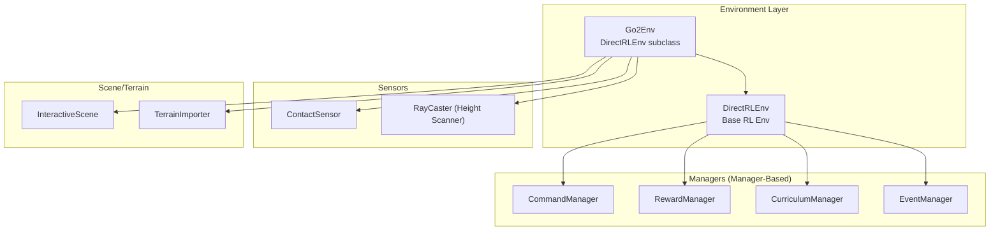
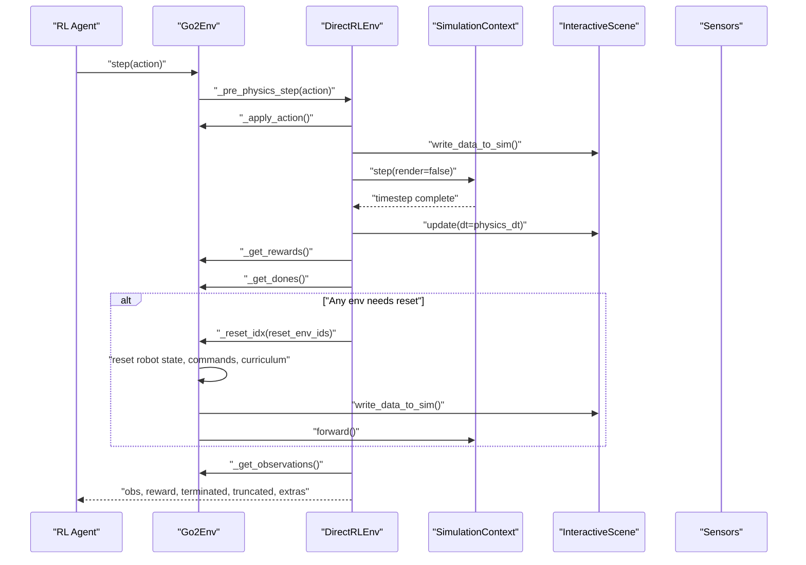
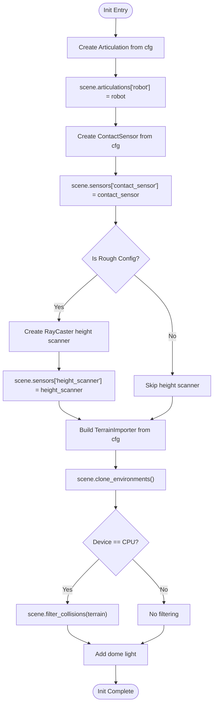
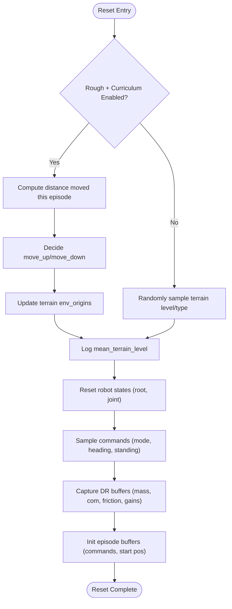
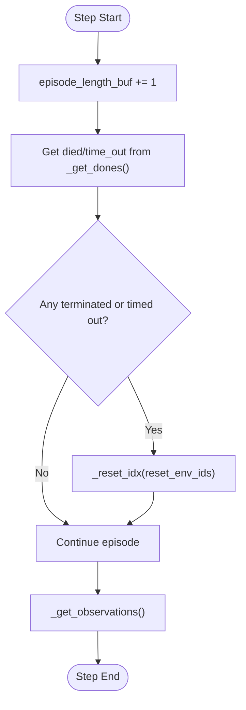
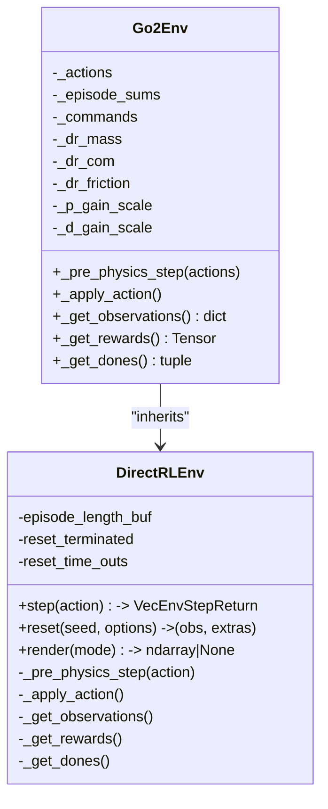
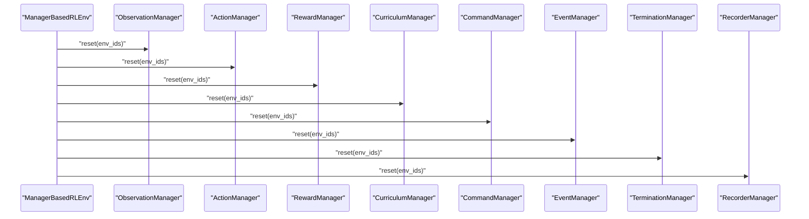
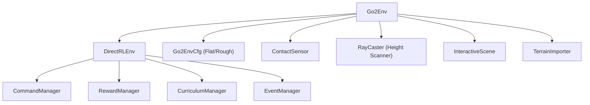

# Environment Lifecycle and State Management

<cite>
**Referenced Files in This Document**
- [go2_env.py](file://source/isaaclab_tasks/isaaclab_tasks/direct/go2/go2_env.py)
- [go2_env_cfg.py](file://source/isaaclab_tasks/isaaclab_tasks/direct/go2/go2_env_cfg.py)
- [direct_rl_env.py](file://source/isaaclab/isaaclab/envs/direct_rl_env.py)
- [manager_based_rl_env.py](file://source/isaaclab/isaaclab/envs/manager_based_rl_env.py)
- [command_manager.py](file://source/isaaclab/isaaclab/managers/command_manager.py)
- [reward_manager.py](file://source/isaaclab/isaaclab/managers/reward_manager.py)
- [event_manager.py](file://source/isaaclab/isaaclab/managers/event_manager.py)
- [curriculum_manager.py](file://source/isaaclab/isaaclab/managers/curriculum_manager.py)
- [contact_sensor.rst](file://docs/source/overview/core-concepts/sensors/contact_sensor.rst)
- [add_sensors_on_robot.rst](file://docs/source/tutorials/04_sensors/add_sensors_on_robot.rst)
- [replay_demos.py](file://scripts/tools/replay_demos.py)
- [troubleshooting.rst](file://docs/source/refs/troubleshooting.rst)
- [common.py](file://source/isaaclab/isaaclab/envs/common.py)
</cite>

## Table of Contents
1. [Introduction](#introduction)
2. [Project Structure](#project-structure)
3. [Core Components](#core-components)
4. [Architecture Overview](#architecture-overview)
5. [Detailed Component Analysis](#detailed-component-analysis)
6. [Dependency Analysis](#dependency-analysis)
7. [Performance Considerations](#performance-considerations)
8. [Troubleshooting Guide](#troubleshooting-guide)
9. [Conclusion](#conclusion)
10. [Appendices](#appendices)

## Introduction
This document explains the lifecycle and state management of the Go2 Environment within the Isaac Lab framework. It covers environment initialization (robot setup, sensor configuration, contact sensor initialization, and height scanner setup for rough terrain), reset mechanisms (robot state restoration, command sampling, curriculum-based terrain updates, and domain randomization), episode lifecycle (length management, termination conditions, and statistics tracking), state management (action processing, physics step integration, and observation computation), and logging/monitoring (reward tracking, performance metrics, and curriculum progress). It also provides debugging and troubleshooting guidance and describes integration with the broader Isaac Lab environment management system and customization options for research workflows.

## Project Structure
The Go2 environment is implemented as a direct RL environment subclassing the base environment class. It integrates with sensors (contact sensor and ray-cast height scanner), and uses configuration classes to define simulation, scene, terrain, and reward parameters. The environment’s lifecycle is orchestrated by the base environment class, which manages physics stepping, observation computation, reward calculation, and reset logic.

**Diagram sources**
- [go2_env.py:20-635](file://source/isaaclab_tasks/isaaclab_tasks/direct/go2/go2_env.py#L20-L635)
- [direct_rl_env.py:40-697](file://source/isaaclab/isaaclab/envs/direct_rl_env.py#L40-L697)
- [manager_based_rl_env.py:26-397](file://source/isaaclab/isaaclab/envs/manager_based_rl_env.py#L26-L397)

**Section sources**
- [go2_env.py:20-635](file://source/isaaclab_tasks/isaaclab_tasks/direct/go2/go2_env.py#L20-L635)
- [go2_env_cfg.py:71-353](file://source/isaaclab_tasks/isaaclab_tasks/direct/go2/go2_env_cfg.py#L71-L353)
- [direct_rl_env.py:73-224](file://source/isaaclab/isaaclab/envs/direct_rl_env.py#L73-L224)

## Core Components
- Go2Env: Implements environment-specific logic including action processing, physics integration hooks, observation computation, reward computation, termination detection, and reset logic. It also manages domain randomization buffers and privileged observations.
- DirectRLEnv: Base environment class orchestrating simulation stepping, decimation, noise injection, and reset handling. It maintains episode length buffers and provides hooks for environment subclasses.
- Managers (Command, Reward, Curriculum, Event): Provide modularized logic for command sampling, reward computation, curriculum progression, and domain randomization/events.
- Sensors: ContactSensor for foot-ground contact and RayCaster for terrain height perception in rough terrain configurations.
- Configurations: Go2FlatEnvCfg and Go2RoughEnvCfg define simulation parameters, scene setup, terrain, sensors, and reward scales.

Key responsibilities:
- Initialization: Robot instantiation, sensor registration, terrain setup, lighting, and replication.
- Step: Action preprocessing, action application, physics stepping with decimation, observation computation, reward calculation, termination checks, and reset handling.
- Reset: Robot state restoration, command sampling, curriculum updates, and domain randomization application.
- Logging: Episode statistics, termination counts, and curriculum metrics.

**Section sources**
- [go2_env.py:20-635](file://source/isaaclab_tasks/isaaclab_tasks/direct/go2/go2_env.py#L20-L635)
- [direct_rl_env.py:313-400](file://source/isaaclab/isaaclab/envs/direct_rl_env.py#L313-L400)
- [go2_env_cfg.py:71-353](file://source/isaaclab_tasks/isaaclab_tasks/direct/go2/go2_env_cfg.py#L71-L353)

## Architecture Overview
The environment lifecycle follows a deterministic sequence per step and reset. The base environment class manages the physics loop and orchestration, while the Go2 environment subclass provides implementation-specific logic.

**Diagram sources**
- [direct_rl_env.py:313-400](file://source/isaaclab/isaaclab/envs/direct_rl_env.py#L313-L400)
- [go2_env.py:233-355](file://source/isaaclab_tasks/isaaclab_tasks/direct/go2/go2_env.py#L233-L355)

## Detailed Component Analysis

### Environment Initialization
- Robot setup: Articulation is instantiated via configuration and registered in the scene.
- Sensor configuration: ContactSensor is created and registered; in rough terrain configuration, a RayCaster height scanner is added to the base frame.
- Terrain setup: TerrainImporter is constructed from configuration and terrain generator parameters; environment origins are propagated to robots.
- Scene replication and collision filtering: Environments are cloned; CPU simulation requires explicit collision filtering against terrain.
- Lighting: A dome light is added to improve visualization.

**Diagram sources**
- [go2_env.py:212-232](file://source/isaaclab_tasks/isaaclab_tasks/direct/go2/go2_env.py#L212-L232)
- [go2_env_cfg.py:119-134](file://source/isaaclab_tasks/isaaclab_tasks/direct/go2/go2_env_cfg.py#L119-L134)
- [go2_env_cfg.py:191-277](file://source/isaaclab_tasks/isaaclab_tasks/direct/go2/go2_env_cfg.py#L191-L277)

**Section sources**
- [go2_env.py:212-232](file://source/isaaclab_tasks/isaaclab_tasks/direct/go2/go2_env.py#L212-L232)
- [go2_env_cfg.py:119-134](file://source/isaaclab_tasks/isaaclab_tasks/direct/go2/go2_env_cfg.py#L119-L134)
- [go2_env_cfg.py:191-277](file://source/isaaclab_tasks/isaaclab_tasks/direct/go2/go2_env_cfg.py#L191-L277)

### Environment Reset Mechanism
- Curriculum updates: In rough terrain, curriculum evaluates movement distance and command speed to decide terrain level/type adjustments; when disabled, terrain levels/types are randomly sampled per reset.
- Robot state restoration: Root pose/velocity and joint positions/velocities are restored from default states plus terrain origin offsets.
- Command sampling: Commands are sampled according to mode (random/fixed) and optionally include heading control and standing environments.
- Domain randomization: Mass, center of mass, friction, and PD gains are captured from simulation and applied as privileged observations; friction buckets are mirrored into environment buffers.

**Diagram sources**
- [go2_env.py:473-635](file://source/isaaclab_tasks/isaaclab_tasks/direct/go2/go2_env.py#L473-L635)

**Section sources**
- [go2_env.py:473-635](file://source/isaaclab_tasks/isaaclab_tasks/direct/go2/go2_env.py#L473-L635)

### Episode Lifecycle
- Episode length management: The base environment maintains an episode length buffer incremented each step; maximum episode length is derived from configuration and step time.
- Termination conditions: Two primary conditions are evaluated: died (base contact force exceeding a threshold) and time_out (episode length reaching maximum).
- Episode statistics tracking: Rewards are accumulated per-term and logged as averages normalized by episode duration; termination counts are recorded in extras.

**Diagram sources**
- [direct_rl_env.py:366-373](file://source/isaaclab/isaaclab/envs/direct_rl_env.py#L366-L373)
- [go2_env.py:467-471](file://source/isaaclab_tasks/isaaclab_tasks/direct/go2/go2_env.py#L467-L471)

**Section sources**
- [direct_rl_env.py:260-268](file://source/isaaclab/isaaclab/envs/direct_rl_env.py#L260-L268)
- [direct_rl_env.py:366-373](file://source/isaaclab/isaaclab/envs/direct_rl_env.py#L366-L373)
- [go2_env.py:467-471](file://source/isaaclab_tasks/isaaclab_tasks/direct/go2/go2_env.py#L467-L471)

### State Management System
- Action processing: Actions are preprocessed to derive processed targets, scaled and biased by default joint positions.
- Physics step integration: The base environment applies actions via the environment hook, writes data to the simulator, steps physics, and updates scene buffers at physics time-step intervals.
- Observation computation: Observations combine proprioceptive data (joint positions/velocities, gravity projection, base velocities, commands, last actions, foot contacts) with optional scan data from the height scanner. Privileged observations include DR-derived mass/com/friction/PD gain scales.

**Diagram sources**
- [go2_env.py:233-355](file://source/isaaclab_tasks/isaaclab_tasks/direct/go2/go2_env.py#L233-L355)
- [direct_rl_env.py:313-400](file://source/isaaclab/isaaclab/envs/direct_rl_env.py#L313-L400)

**Section sources**
- [go2_env.py:233-355](file://source/isaaclab_tasks/isaaclab_tasks/direct/go2/go2_env.py#L233-L355)
- [direct_rl_env.py:342-392](file://source/isaaclab/isaaclab/envs/direct_rl_env.py#L342-L392)

### Logging and Monitoring
- Reward tracking: Per-term reward sums are maintained and logged as averages normalized by episode duration; these are aggregated into extras for downstream logging systems.
- Performance metrics: Termination counts (base contact and time out) are recorded in extras; curriculum metrics (e.g., mean terrain level) are logged when curriculum is active.
- Command logging: Optional periodic logging of commanded vs. achieved velocities and heading for debugging.

**Section sources**
- [go2_env.py:90-112](file://source/isaaclab_tasks/isaaclab_tasks/direct/go2/go2_env.py#L90-L112)
- [go2_env.py:621-635](file://source/isaaclab_tasks/isaaclab_tasks/direct/go2/go2_env.py#L621-L635)
- [direct_rl_env.py:109-117](file://source/isaaclab/isaaclab/envs/direct_rl_env.py#L109-L117)

### Integration with Isaac Lab Environment Management System
- Manager-based workflow: The manager-based environment class orchestrates command generation, reward computation, curriculum progression, and event-driven randomization. Resets propagate through manager order to ensure consistent state transitions.
- Manager ordering: During reset, managers are reset in a specific order (observation, action, rewards, curriculum, command, event, termination, recorder) to maintain dependencies.
- Interval events: Events can be applied at fixed intervals during episode execution.

**Diagram sources**
- [manager_based_rl_env.py:366-396](file://source/isaaclab/isaaclab/envs/manager_based_rl_env.py#L366-L396)

**Section sources**
- [manager_based_rl_env.py:110-137](file://source/isaaclab/isaaclab/envs/manager_based_rl_env.py#L110-L137)
- [manager_based_rl_env.py:366-396](file://source/isaaclab/isaaclab/envs/manager_based_rl_env.py#L366-L396)

### Customization Options for Research Workflows
- Command modes: Random vs. fixed commands; optional heading control and standing environments for specialized behaviors.
- Curriculum toggles: Enable/disable curriculum progression; adjust heading control stiffness and resampling intervals.
- Scan integration: Toggle scan inclusion in policy/critic observations and ordering (scan-first vs. prop-first).
- Reward scales: Tune reward weights for velocity tracking, orientation, torques, action rate, air time, contacts, base height, work, and stumble penalties.
- Terrain configuration: Adjust terrain generator size, proportions, and difficulty levels; control max initial terrain level and curriculum behavior.

**Section sources**
- [go2_env_cfg.py:156-170](file://source/isaaclab_tasks/isaaclab_tasks/direct/go2/go2_env_cfg.py#L156-L170)
- [go2_env_cfg.py:299-314](file://source/isaaclab_tasks/isaaclab_tasks/direct/go2/go2_env_cfg.py#L299-L314)
- [go2_env_cfg.py:334-353](file://source/isaaclab_tasks/isaaclab_tasks/direct/go2/go2_env_cfg.py#L334-L353)

## Dependency Analysis
The Go2 environment depends on:
- DirectRLEnv for orchestration of physics stepping, decimation, and reset logic.
- Sensors for contact and height scanning data.
- Configuration classes for simulation, scene, terrain, and reward parameters.
- Managers for command generation, reward computation, curriculum progression, and event-driven randomization.

**Diagram sources**
- [go2_env.py:20-635](file://source/isaaclab_tasks/isaaclab_tasks/direct/go2/go2_env.py#L20-L635)
- [go2_env_cfg.py:71-353](file://source/isaaclab_tasks/isaaclab_tasks/direct/go2/go2_env_cfg.py#L71-L353)
- [direct_rl_env.py:40-697](file://source/isaaclab/isaaclab/envs/direct_rl_env.py#L40-L697)

**Section sources**
- [go2_env.py:20-635](file://source/isaaclab_tasks/isaaclab_tasks/direct/go2/go2_env.py#L20-L635)
- [go2_env_cfg.py:71-353](file://source/isaaclab_tasks/isaaclab_tasks/direct/go2/go2_env_cfg.py#L71-L353)
- [direct_rl_env.py:40-697](file://source/isaaclab/isaaclab/envs/direct_rl_env.py#L40-L697)

## Performance Considerations
- Decimation and render interval: Ensure render interval equals decimation to avoid redundant renders; excessive rendering can bottleneck training.
- Sensor update rates: Contact sensor and height scanner update periods should align with simulation stability and desired fidelity.
- GPU utilization: Configure GPU rigid patch counts appropriately for complex terrains to balance performance and accuracy.
- Noise injection: Observation/action noise models add realism but can increase computation; tune noise parameters carefully.

[No sources needed since this section provides general guidance]

## Troubleshooting Guide
Common issues and remedies:
- Simulation instability: Verify robot and terrain asset parameters; consult the physics stability guide and use the PhysX Visual Debugger to inspect simulation states.
- NaN propagation: Check reward and observation computations for numerical stability; validate sensor data and ensure proper initialization of privileged observations.
- Rendering artifacts: Confirm simulation render mode supports requested modes and enable appropriate render intervals.
- State mismatches during replay: Use the demo replay tool to compare runtime and dataset states for articulations and rigid objects.

**Section sources**
- [troubleshooting.rst:12-25](file://docs/source/refs/troubleshooting.rst#L12-L25)
- [replay_demos.py:94-118](file://scripts/tools/replay_demos.py#L94-L118)

## Conclusion
The Go2 Environment’s lifecycle and state management are built on a robust foundation: a direct RL environment subclass that integrates sensors and terrain, orchestrated by a base environment class and supported by modular managers. The system provides flexible configuration for commands, curriculum, and observations, along with comprehensive logging and debugging aids. Researchers can tailor the environment for diverse locomotion tasks, from flat to rough terrains, while leveraging the broader Isaac Lab ecosystem for scalable training and evaluation.

[No sources needed since this section summarizes without analyzing specific files]

## Appendices

### Appendix A: Sensor Configuration References
- Contact sensor configuration and usage on robots are documented in the tutorials and core concepts documentation.
- Height scanner configuration for ray-cast terrain sensing is described in the sensor tutorials.

**Section sources**
- [contact_sensor.rst:19-50](file://docs/source/overview/core-concepts/sensors/contact_sensor.rst#L19-L50)
- [add_sensors_on_robot.rst:100-122](file://docs/source/tutorials/04_sensors/add_sensors_on_robot.rst#L100-L122)

### Appendix B: Environment Types and Spaces
- Observation and action spaces are configured in the environment configuration and exposed via the base environment class.

**Section sources**
- [go2_env_cfg.py:71-86](file://source/isaaclab_tasks/isaaclab_tasks/direct/go2/go2_env_cfg.py#L71-L86)
- [common.py:76-99](file://source/isaaclab/isaaclab/envs/common.py#L76-L99)