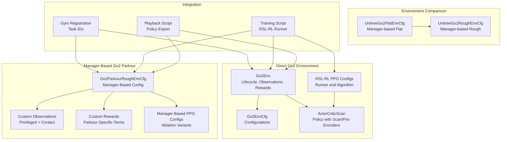
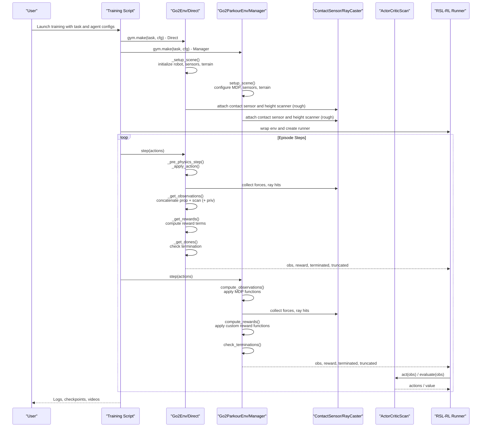
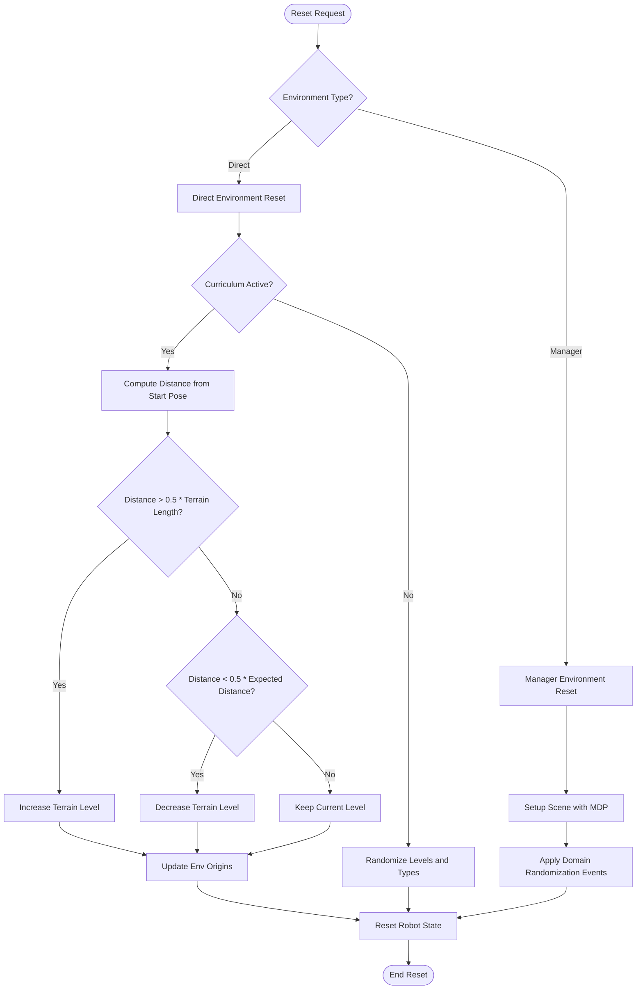
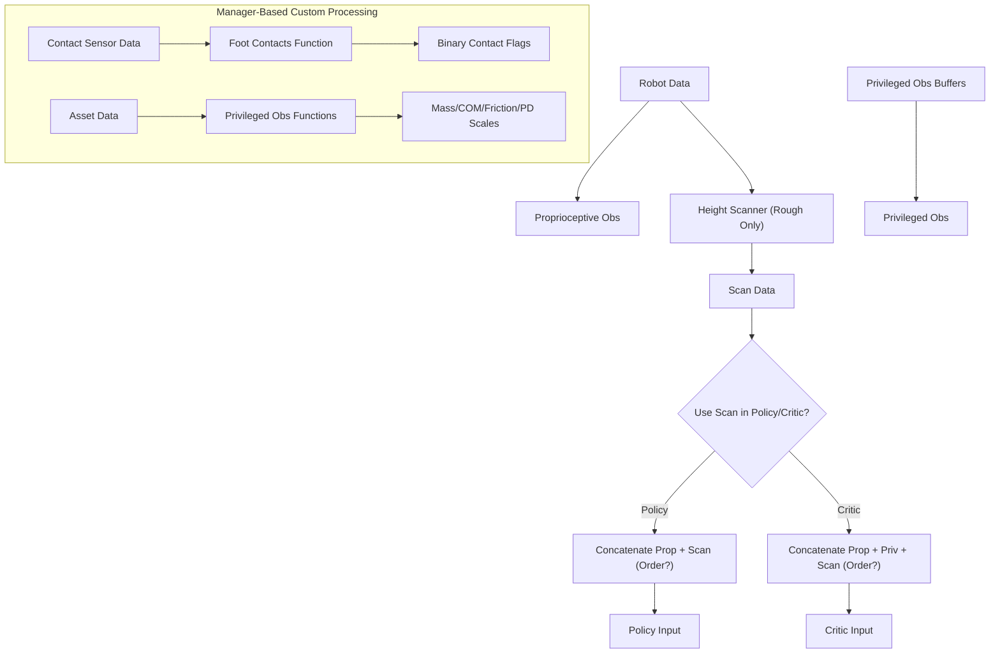
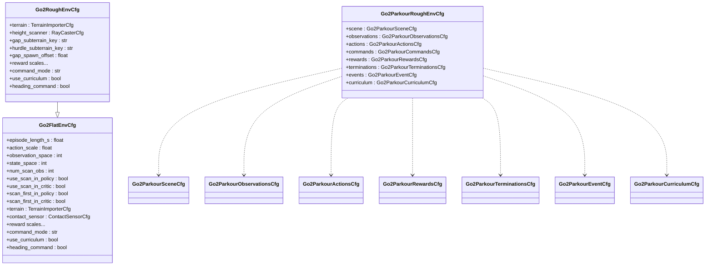
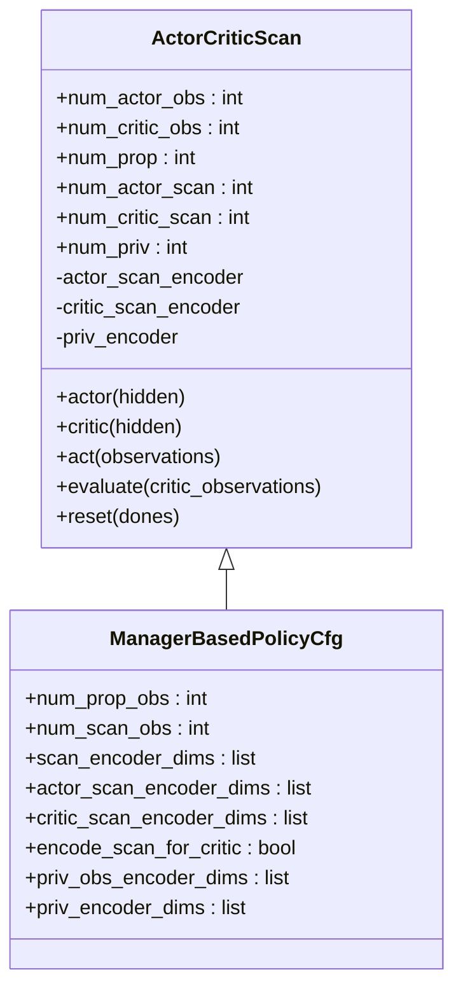
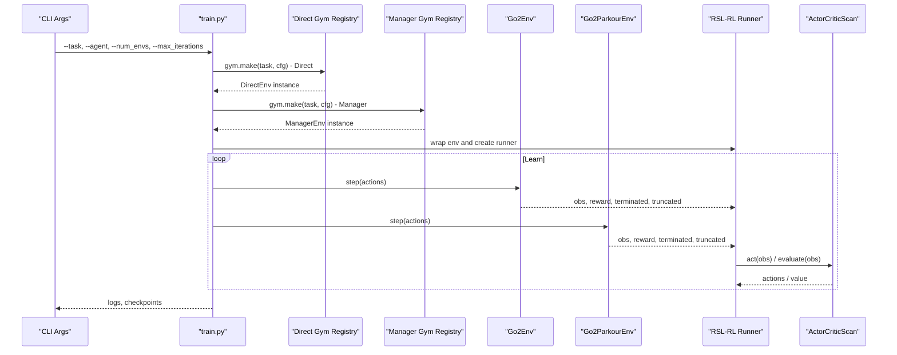
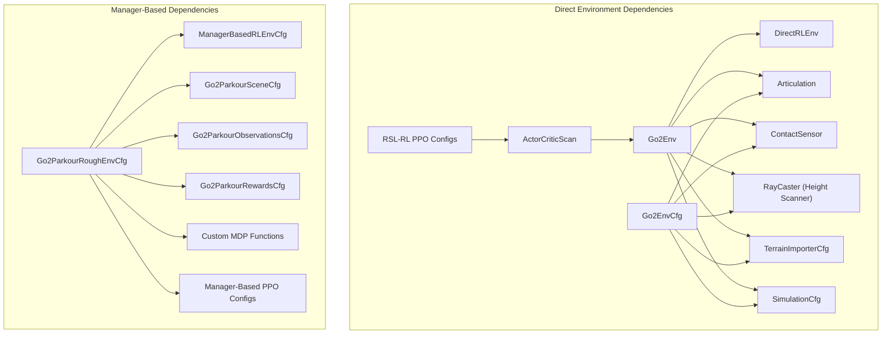

# Go2 Environment System

<cite>
**Referenced Files in This Document**
- [go2_env.py](file://source/isaaclab_tasks/isaaclab_tasks/direct/go2/go2_env.py)
- [go2_env_cfg.py](file://source/isaaclab_tasks/isaaclab_tasks/direct/go2/go2_env_cfg.py)
- [rsl_rl_ppo_cfg.py](file://source/isaaclab_tasks/isaaclab_tasks/direct/go2/agents/rsl_rl_ppo_cfg.py)
- [actor_critic_scan.py](file://source/isaaclab_tasks/isaaclab_tasks/direct/go2/agents/actor_critic_scan.py)
- [__init__.py](file://source/isaaclab_tasks/isaaclab_tasks/direct/go2/__init__.py)
- [flat_env_cfg.py](file://source/isaaclab_tasks/isaaclab_tasks/manager_based/locomotion/velocity/config/go2/flat_env_cfg.py)
- [rough_env_cfg.py](file://source/isaaclab_tasks/isaaclab_tasks/manager_based/locomotion/velocity/config/go2/rough_env_cfg.py)
- [go2_parkour_rough_env_cfg.py](file://source/isaaclab_tasks/isaaclab_tasks/manager_based/locomotion/velocity/config/go2_parkour/rough_env_cfg.py)
- [go2_parkour_observations.py](file://source/isaaclab_tasks/isaaclab_tasks/manager_based/locomotion/velocity/config/go2_parkour/mdp/observations.py)
- [go2_parkour_rewards.py](file://source/isaaclab_tasks/isaaclab_tasks/manager_based/locomotion/velocity/config/go2_parkour/mdp/rewards.py)
- [go2_parkour_rsl_rl_ppo_cfg.py](file://source/isaaclab_tasks/isaaclab_tasks/manager_based/locomotion/velocity/config/go2_parkour/agents/rsl_rl_ppo_cfg.py)
- [go2_parkour_init.py](file://source/isaaclab_tasks/isaaclab_tasks/manager_based/locomotion/velocity/config/go2_parkour/__init__.py)
- [README.md](file://README.md)
- [train.py](file://scripts/reinforcement_learning/rsl_rl/train.py)
- [play.py](file://scripts/reinforcement_learning/rsl_rl/play.py)
</cite>

## Update Summary
**Changes Made**
- Added comprehensive manager-based Go2 parkour environment system with custom observation processing and reward engineering
- Enhanced direct environment configuration with improved documentation
- Integrated new ablation study variants (Abl 3.5, 4.0, 7.0) with detailed policy configurations
- Added custom MDP functions for privileged observations and reward engineering
- Expanded training and evaluation capabilities with manager-based RL environments

## Table of Contents
1. [Introduction](#introduction)
2. [Project Structure](#project-structure)
3. [Core Components](#core-components)
4. [Architecture Overview](#architecture-overview)
5. [Detailed Component Analysis](#detailed-component-analysis)
6. [Dependency Analysis](#dependency-analysis)
7. [Performance Considerations](#performance-considerations)
8. [Troubleshooting Guide](#troubleshooting-guide)
9. [Conclusion](#conclusion)
10. [Appendices](#appendices)

## Introduction
The Go2 Environment System is the core component implementing quadruped locomotion in the extreme parkour setting within the Isaac Lab ecosystem. It serves as a benchmark environment for ablation studies, enabling controlled evaluation of sensor fusion strategies, reward engineering, and curriculum learning mechanisms. The environment integrates a Unitree Go2 robot with advanced terrain generation, height-scan perception, and a modular reward specification system. It supports both direct and manager-based environment configurations, with comprehensive ablation study variants for systematic evaluation of observation processing and reward engineering approaches.

The environment is designed to evaluate sensor fusion by combining proprioceptive observations with height-scan data, and to assess reward engineering by isolating and modifying individual reward terms. Curriculum learning is integrated to progressively increase terrain difficulty, ensuring robust skill acquisition under realistic conditions. The system now includes both traditional direct environments and modern manager-based environments with enhanced configurability and custom MDP functions.

## Project Structure
The Go2 environment system is organized into two main architectures with comprehensive ablation study support:

**Direct Environment Architecture:**
- Environment definition and lifecycle: [go2_env.py](file://source/isaaclab_tasks/isaaclab_tasks/direct/go2/go2_env.py)
- Configuration system: [go2_env_cfg.py](file://source/isaaclab_tasks/isaaclab_tasks/direct/go2/go2_env_cfg.py)
- Agent policy configuration: [rsl_rl_ppo_cfg.py](file://source/isaaclab_tasks/isaaclab_tasks/direct/go2/agents/rsl_rl_ppo_cfg.py)
- Neural network policy with scan and privileged observation encoders: [actor_critic_scan.py](file://source/isaaclab_tasks/isaaclab_tasks/direct/go2/agents/actor_critic_scan.py)
- Task registration for Gym environments: [__init__.py](file://source/isaaclab_tasks/isaaclab_tasks/direct/go2/__init__.py)

**Manager-Based Parkour Environment Architecture:**
- Manager-based environment configurations: [go2_parkour_rough_env_cfg.py](file://source/isaaclab_tasks/isaaclab_tasks/manager_based/locomotion/velocity/config/go2_parkour/rough_env_cfg.py)
- Custom observation processing functions: [go2_parkour_observations.py](file://source/isaaclab_tasks/isaaclab_tasks/manager_based/locomotion/velocity/config/go2_parkour/mdp/observations.py)
- Custom reward engineering functions: [go2_parkour_rewards.py](file://source/isaaclab_tasks/isaaclab_tasks/manager_based/locomotion/velocity/config/go2_parkour/mdp/rewards.py)
- Manager-based agent configurations: [go2_parkour_rsl_rl_ppo_cfg.py](file://source/isaaclab_tasks/isaaclab_tasks/manager_based/locomotion/velocity/config/go2_parkour/agents/rsl_rl_ppo_cfg.py)
- Manager-based task registration: [go2_parkour_init.py](file://source/isaaclab_tasks/isaaclab_tasks/manager_based/locomotion/velocity/config/go2_parkour/__init__.py)

**Additional Supporting Components:**
- Manager-based comparison environments: [flat_env_cfg.py](file://source/isaaclab_tasks/isaaclab_tasks/manager_based/locomotion/velocity/config/go2/flat_env_cfg.py), [rough_env_cfg.py](file://source/isaaclab_tasks/isaaclab_tasks/manager_based/locomotion/velocity/config/go2/rough_env_cfg.py)
- Training and playback scripts: [train.py](file://scripts/reinforcement_learning/rsl_rl/train.py), [play.py](file://scripts/reinforcement_learning/rsl_rl/play.py)
- Project overview and ablation findings: [README.md](file://README.md)

**Diagram sources**
- [go2_env.py:1-637](file://source/isaaclab_tasks/isaaclab_tasks/direct/go2/go2_env.py#L1-L637)
- [go2_env_cfg.py:1-353](file://source/isaaclab_tasks/isaaclab_tasks/direct/go2/go2_env_cfg.py#L1-L353)
- [rsl_rl_ppo_cfg.py:1-158](file://source/isaaclab_tasks/isaaclab_tasks/direct/go2/agents/rsl_rl_ppo_cfg.py#L1-L158)
- [actor_critic_scan.py:1-262](file://source/isaaclab_tasks/isaaclab_tasks/direct/go2/agents/actor_critic_scan.py#L1-L262)
- [go2_parkour_rough_env_cfg.py:1-757](file://source/isaaclab_tasks/isaaclab_tasks/manager_based/locomotion/velocity/config/go2_parkour/rough_env_cfg.py#L1-L757)
- [go2_parkour_observations.py:1-111](file://source/isaaclab_tasks/isaaclab_tasks/manager_based/locomotion/velocity/config/go2_parkour/mdp/observations.py#L1-L111)
- [go2_parkour_rewards.py:1-131](file://source/isaaclab_tasks/isaaclab_tasks/manager_based/locomotion/velocity/config/go2_parkour/mdp/rewards.py#L1-L131)
- [go2_parkour_rsl_rl_ppo_cfg.py:1-158](file://source/isaaclab_tasks/isaaclab_tasks/manager_based/locomotion/velocity/config/go2_parkour/agents/rsl_rl_ppo_cfg.py#L1-L158)
- [flat_env_cfg.py:1-44](file://source/isaaclab_tasks/isaaclab_tasks/manager_based/locomotion/velocity/config/go2/flat_env_cfg.py#L1-L44)
- [rough_env_cfg.py:1-86](file://source/isaaclab_tasks/isaaclab_tasks/manager_based/locomotion/velocity/config/go2/rough_env_cfg.py#L1-L86)
- [__init__.py:1-147](file://source/isaaclab_tasks/isaaclab_tasks/direct/go2/__init__.py#L1-L147)
- [go2_parkour_init.py:1-162](file://source/isaaclab_tasks/isaaclab_tasks/manager_based/locomotion/velocity/config/go2_parkour/__init__.py#L1-L162)
- [train.py:1-220](file://scripts/reinforcement_learning/rsl_rl/train.py#L1-L220)
- [play.py:1-206](file://scripts/reinforcement_learning/rsl_rl/play.py#L1-L206)

**Section sources**
- [README.md:110-177](file://README.md#L110-L177)
- [go2_parkour_init.py:1-162](file://source/isaaclab_tasks/isaaclab_tasks/manager_based/locomotion/velocity/config/go2_parkour/__init__.py#L1-L162)

## Core Components

### Direct Go2 Environment Components
- **Go2Env**: Implements the DirectRLEnv lifecycle, including setup, physics steps, observations, rewards, terminations, and curriculum updates. It manages privileged observations via domain randomization buffers and integrates a height scanner for rough terrain.
- **Go2EnvCfg**: Defines environment configurations for flat and rough terrains, including simulation parameters, terrain generation, reward scales, and curriculum settings. It also controls scan usage and ordering for policy and critic.
- **ActorCriticScan**: A neural network policy that optionally encodes scan and privileged observations separately for the actor and critic, supporting flexible observation modalities.
- **RSL-RL PPO Runner Configs**: Configure the PPO algorithm, policy architecture, and training hyperparameters for both flat and rough environments, including ablation variants.

### Manager-Based Go2 Parkour Environment Components
- **Go2ParkourRoughEnvCfg**: Manager-based environment configuration that mirrors the direct Go2 environment but uses the manager-based pattern. Includes custom MDP functions for observations and rewards.
- **Custom Observation Functions**: Privileged observation processing including foot contacts, base mass, center of mass, friction coefficients, and PD gain scales.
- **Custom Reward Functions**: Parkour-specific reward terms including torque sum, stop penalties, hip position penalties, stumble detection, joint deviations, and mechanical work calculation.
- **Manager-Based PPO Configs**: Comprehensive ablation study configurations (Abl 1, 2.5, 3.5, 4.0, 7.0) with varying scan encoding strategies and policy architectures.

### Enhanced Capabilities
- **Proprioceptive observations**: joint positions/velocities, projected gravity, root linear/angular velocities, commands, last action, and foot contacts.
- **Privileged observations (critic only)**: mass, center of mass, friction coefficient, and PD gain scales.
- **Height scan observations**: grid-based height measurements for rough terrain perception.
- **Reward specification**: modular rewards for velocity tracking, orientation, torques, accelerations, action rate, air time, undesired contacts, base height, stumbling, and work.
- **Curriculum learning**: terrain difficulty progression based on achieved distance and command speed.
- **Ablation study framework**: systematic evaluation of observation processing strategies and reward engineering approaches.

**Section sources**
- [go2_env.py:293-355](file://source/isaaclab_tasks/isaaclab_tasks/direct/go2/go2_env.py#L293-L355)
- [go2_env.py:357-465](file://source/isaaclab_tasks/isaaclab_tasks/direct/go2/go2_env.py#L357-L465)
- [go2_env.py:467-637](file://source/isaaclab_tasks/isaaclab_tasks/direct/go2/go2_env.py#L467-L637)
- [go2_env_cfg.py:71-314](file://source/isaaclab_tasks/isaaclab_tasks/direct/go2/go2_env_cfg.py#L71-L314)
- [actor_critic_scan.py:13-262](file://source/isaaclab_tasks/isaaclab_tasks/direct/go2/agents/actor_critic_scan.py#L13-L262)
- [rsl_rl_ppo_cfg.py:44-158](file://source/isaaclab_tasks/isaaclab_tasks/direct/go2/agents/rsl_rl_ppo_cfg.py#L44-L158)
- [go2_parkour_rough_env_cfg.py:448-757](file://source/isaaclab_tasks/isaaclab_tasks/manager_based/locomotion/velocity/config/go2_parkour/rough_env_cfg.py#L448-L757)
- [go2_parkour_observations.py:33-111](file://source/isaaclab_tasks/isaaclab_tasks/manager_based/locomotion/velocity/config/go2_parkour/mdp/observations.py#L33-L111)
- [go2_parkour_rewards.py:35-131](file://source/isaaclab_tasks/isaaclab_tasks/manager_based/locomotion/velocity/config/go2_parkour/mdp/rewards.py#L35-L131)

## Architecture Overview
The Go2 Environment System integrates both direct and manager-based architectures with configurable terrain, sensors, and reward engineering. The direct environment uses a custom implementation with flexible observation processing, while the manager-based system leverages the Isaac Lab manager framework with custom MDP functions. Both systems register Gym tasks, initialize robots and sensors, process observations, compute rewards, and apply curriculum updates.

**Diagram sources**
- [train.py:119-210](file://scripts/reinforcement_learning/rsl_rl/train.py#L119-L210)
- [go2_env.py:233-355](file://source/isaaclab_tasks/isaaclab_tasks/direct/go2/go2_env.py#L233-L355)
- [go2_parkour_rough_env_cfg.py:448-520](file://source/isaaclab_tasks/isaaclab_tasks/manager_based/locomotion/velocity/config/go2_parkour/rough_env_cfg.py#L448-L520)
- [actor_critic_scan.py:201-257](file://source/isaaclab_tasks/isaaclab_tasks/direct/go2/agents/actor_critic_scan.py#L201-L257)

## Detailed Component Analysis

### Environment Lifecycle and State Management

#### Direct Environment Lifecycle
- **Initialization**: Sets up action buffers, privileged observation buffers, hip joint indices, command vectors, and curriculum flags. Initializes episode sums for logging.
- **Physics integration**: Applies processed actions to joint position targets and updates heading commands when enabled.
- **Termination**: Determines death and timeout conditions based on contact forces and episode length.
- **Reset and curriculum**: Updates terrain origins based on distance traveled and command speed when curriculum is active; otherwise randomizes terrain levels and types.

#### Manager-Based Environment Lifecycle
- **Scene setup**: Configures terrain, robot, sensors, and lighting through manager-based configuration classes.
- **MDP execution**: Uses manager framework to execute observation processing, reward computation, and termination checking.
- **Event handling**: Manages domain randomization events and reset procedures through the manager event system.
- **Curriculum management**: Implements terrain level curriculum through manager-based curriculum terms.

**Diagram sources**
- [go2_env.py:473-531](file://source/isaaclab_tasks/isaaclab_tasks/direct/go2/go2_env.py#L473-L531)
- [go2_env.py:536-637](file://source/isaaclab_tasks/isaaclab_tasks/direct/go2/go2_env.py#L536-L637)
- [go2_parkour_rough_env_cfg.py:448-520](file://source/isaaclab_tasks/isaaclab_tasks/manager_based/locomotion/velocity/config/go2_parkour/rough_env_cfg.py#L448-L520)

**Section sources**
- [go2_env.py:23-119](file://source/isaaclab_tasks/isaaclab_tasks/direct/go2/go2_env.py#L23-L119)
- [go2_env.py:467-637](file://source/isaaclab_tasks/isaaclab_tasks/direct/go2/go2_env.py#L467-L637)
- [go2_parkour_rough_env_cfg.py:448-520](file://source/isaaclab_tasks/isaaclab_tasks/manager_based/locomotion/velocity/config/go2_parkour/rough_env_cfg.py#L448-L520)

### Observation Processing Pipeline

#### Direct Environment Observation Processing
- **Proprioceptive observations**: Concatenation of joint positions/deviations, joint velocities, projected gravity, root linear/angular velocities, commands, last action, and foot contacts.
- **Privileged observations (critic only)**: Mass, center of mass, friction coefficient, and PD gain scales captured via domain randomization buffers.
- **Height scan observations**: Grid-based height measurements computed from raycast hits, clipped and normalized for rough terrain.
- **Observation ordering**: Policy and critic can use either prop-first or scan-first configurations, controlled by flags in the environment configuration.

#### Manager-Based Environment Observation Processing
- **Asymmetric actor-critic observations**: Separate observation groups for policy (52D proprioceptive + optional 187D height scan) and critic (52D prop + 29D privileged + optional 187D height scan).
- **Custom observation functions**: Privileged observations processed through dedicated functions for base mass, COM, friction, and PD gain scales.
- **Foot contact processing**: Binary contact flags extracted from contact sensor data with configurable thresholds.
- **Height scan processing**: Grid-based height measurements with clipping and normalization.

**Diagram sources**
- [go2_env.py:293-355](file://source/isaaclab_tasks/isaaclab_tasks/direct/go2/go2_env.py#L293-L355)
- [go2_env_cfg.py:172-314](file://source/isaaclab_tasks/isaaclab_tasks/direct/go2/go2_env_cfg.py#L172-L314)
- [go2_parkour_observations.py:33-111](file://source/isaaclab_tasks/isaaclab_tasks/manager_based/locomotion/velocity/config/go2_parkour/mdp/observations.py#L33-L111)

**Section sources**
- [go2_env.py:293-355](file://source/isaaclab_tasks/isaaclab_tasks/direct/go2/go2_env.py#L293-L355)
- [go2_env_cfg.py:71-170](file://source/isaaclab_tasks/isaaclab_tasks/direct/go2/go2_env_cfg.py#L71-L170)
- [go2_parkour_observations.py:33-111](file://source/isaaclab_tasks/isaaclab_tasks/manager_based/locomotion/velocity/config/go2_parkour/mdp/observations.py#L33-L111)

### Reward Specification System

#### Direct Environment Reward System
Rewards are composed of multiple terms with configurable scales:
- **Tracking rewards**: linear velocity (XY), yaw rate, Z velocity, angular velocity (XY).
- **Penalizing terms**: joint torques, joint acceleration, action rate, undesired contacts, flat orientation, base height, stop penalties, DOF close to default, hip position deviation, stumbling.
- **Work consideration**: positive mechanical work is penalized using a clamped power signal.

#### Manager-Based Reward System
- **Standard tracking rewards**: exponential velocity tracking with configurable standard deviations.
- **Penalty terms**: L2 penalties for various motion characteristics and contact constraints.
- **Parkour-specific rewards**: torque sum, stop penalties, hip position penalties, stumble detection, joint deviations, and mechanical work.
- **Custom reward functions**: Dedicated functions for each reward term with proper tensor operations and broadcasting.

```mermaid
flowchart TD
Start(["Reward Computation"]) --> VTrack["Linear Velocity Tracking"]
Start --> YTrack["Yaw Rate Tracking"]
Start --> ZVel["Z Velocity Penalty"]
Start --> AVel["Angular Velocity XY Penalty"]
Start --> Torque["Joint Torques Penalty"]
Start --> Accel["Joint Acceleration Penalty"]
Start --> ActionRate["Action Rate Penalty"]
Start --> AirTime["Feet Air Time Reward"]
Start --> Undesired["Undesired Contacts Penalty"]
Start --> FlatOri["Flat Orientation Penalty"]
Start --> BaseH["Base Height Penalty"]
Start --> StopLin["Stop Penalty Lin"]
Start --> StopAng["Stop Penalty Ang"]
Start --> DofDef["DOF Close to Default Penalty"]
Start --> HipPos["Hip Position Deviation Penalty"]
Start --> Stumble["Feet Stumble Penalty"]
Start --> Work["Positive Work Penalty"]
VTrack --> Sum["Sum All Terms"]
YTrack --> Sum
ZVel --> Sum
AVel --> Sum
Torque --> Sum
Accel --> Sum
ActionRate --> Sum
AirTime --> Sum
Undesired --> Sum
FlatOri --> Sum
BaseH --> Sum
StopLin --> Sum
StopAng --> Sum
DofDef --> Sum
HipPos --> Sum
Stumble --> Sum
Work --> Sum
Sum --> End(["Total Reward"])
```

**Diagram sources**
- [go2_env.py:357-465](file://source/isaaclab_tasks/isaaclab_tasks/direct/go2/go2_env.py#L357-L465)
- [go2_parkour_rewards.py:35-131](file://source/isaaclab_tasks/isaaclab_tasks/manager_based/locomotion/velocity/config/go2_parkour/mdp/rewards.py#L35-L131)

**Section sources**
- [go2_env.py:357-465](file://source/isaaclab_tasks/isaaclab_tasks/direct/go2/go2_env.py#L357-L465)
- [go2_env_cfg.py:135-170](file://source/isaaclab_tasks/isaaclab_tasks/direct/go2/go2_env_cfg.py#L135-L170)
- [go2_parkour_rewards.py:35-131](file://source/isaaclab_tasks/isaaclab_tasks/manager_based/locomotion/velocity/config/go2_parkour/mdp/rewards.py#L35-L131)

### Environment Configuration System

#### Direct Environment Configuration
- **Flat environment**: Plane terrain, no height scanner, no scan in policy/critic, smaller observation/state spaces.
- **Rough environment**: Procedural terrain generator with diverse sub-terrains (boxes, random rough, debris field, gaps, hurdles, stairs, parkour steps), height scanner, scan in policy/critic, larger observation/state spaces.
- **Curriculum and commands**: Flags for curriculum activation, command modes (random/fixed), heading control, and logging intervals.

#### Manager-Based Configuration
- **Scene configuration**: Separate scene class defining terrain, robot, sensors, and lighting with manager-based configuration patterns.
- **Observation groups**: Asymmetric actor-critic observation groups with configurable concatenation order.
- **MDP configuration**: Separate classes for commands, actions, observations, rewards, terminations, events, and curriculum.
- **Ablation variants**: Comprehensive ablation study configurations with different scan encoding strategies and policy architectures.

**Diagram sources**
- [go2_env_cfg.py:71-314](file://source/isaaclab_tasks/isaaclab_tasks/direct/go2/go2_env_cfg.py#L71-L314)
- [go2_parkour_rough_env_cfg.py:448-757](file://source/isaaclab_tasks/isaaclab_tasks/manager_based/locomotion/velocity/config/go2_parkour/rough_env_cfg.py#L448-L757)

**Section sources**
- [go2_env_cfg.py:71-314](file://source/isaaclab_tasks/isaaclab_tasks/direct/go2/go2_env_cfg.py#L71-L314)
- [go2_parkour_rough_env_cfg.py:448-757](file://source/isaaclab_tasks/isaaclab_tasks/manager_based/locomotion/velocity/config/go2_parkour/rough_env_cfg.py#L448-L757)
- [flat_env_cfg.py:11-28](file://source/isaaclab_tasks/isaaclab_tasks/manager_based/locomotion/velocity/config/go2/flat_env_cfg.py#L11-L28)
- [rough_env_cfg.py:16-62](file://source/isaaclab_tasks/isaaclab_tasks/manager_based/locomotion/velocity/config/go2/rough_env_cfg.py#L16-L62)

### Policy Architecture with Scan and Privileged Observations

#### Direct Environment Policy
The policy supports optional encoding of scan and privileged observations:
- **Actor input**: prop_obs concatenated with encoded scan (if enabled).
- **Critic input**: prop_obs + encoded privileged obs + encoded scan (if enabled).
- **Encoder dimensions**: configurable actor/critic scan encoders and privileged encoders.

#### Manager-Based Policy Configuration
- **Flexible scan encoding**: Different configurations for actor and critic scan encoders.
- **Privileged observation encoding**: Optional encoding of privileged observations for critic.
- **Ablation study support**: Multiple policy configurations for systematic evaluation.

**Diagram sources**
- [actor_critic_scan.py:13-262](file://source/isaaclab_tasks/isaaclab_tasks/direct/go2/agents/actor_critic_scan.py#L13-L262)
- [go2_parkour_rsl_rl_ppo_cfg.py:16-46](file://source/isaaclab_tasks/isaaclab_tasks/manager_based/locomotion/velocity/config/go2_parkour/agents/rsl_rl_ppo_cfg.py#L16-L46)

**Section sources**
- [actor_critic_scan.py:13-262](file://source/isaaclab_tasks/isaaclab_tasks/direct/go2/agents/actor_critic_scan.py#L13-L262)
- [rsl_rl_ppo_cfg.py:11-41](file://source/isaaclab_tasks/isaaclab_tasks/direct/go2/agents/rsl_rl_ppo_cfg.py#L11-L41)
- [go2_parkour_rsl_rl_ppo_cfg.py:16-158](file://source/isaaclab_tasks/isaaclab_tasks/manager_based/locomotion/velocity/config/go2_parkour/agents/rsl_rl_ppo_cfg.py#L16-L158)

### Integration with RL Training Pipelines

#### Direct Environment Integration
- **Gym registration**: Registers multiple tasks for direct Go2 environments, including flat, rough, and ablation variants.
- **Training script**: Creates the environment, wraps it for RSL-RL, and runs the PPO algorithm with configurable hyperparameters.
- **Playback script**: Loads a trained checkpoint, exports the policy to JIT/ONNX, and runs inference in the environment.

#### Manager-Based Environment Integration
- **Enhanced Gym registration**: Extensive task registration including flat, rough, play, and ablation variants (14 total task IDs).
- **Custom MDP integration**: Seamless integration with manager-based RL framework and custom MDP functions.
- **Unified training interface**: Same training script works for both direct and manager-based environments.

**Diagram sources**
- [__init__.py:18-147](file://source/isaaclab_tasks/isaaclab_tasks/direct/go2/__init__.py#L18-L147)
- [go2_parkour_init.py:1-162](file://source/isaaclab_tasks/isaaclab_tasks/manager_based/locomotion/velocity/config/go2_parkour/__init__.py#L1-162)
- [train.py:119-210](file://scripts/reinforcement_learning/rsl_rl/train.py#L119-L210)
- [play.py:93-171](file://scripts/reinforcement_learning/rsl_rl/play.py#L93-L171)

**Section sources**
- [__init__.py:18-147](file://source/isaaclab_tasks/isaaclab_tasks/direct/go2/__init__.py#L18-L147)
- [go2_parkour_init.py:1-162](file://source/isaaclab_tasks/isaaclab_tasks/manager_based/locomotion/velocity/config/go2_parkour/__init__.py#L1-L162)
- [train.py:119-210](file://scripts/reinforcement_learning/rsl_rl/train.py#L119-L210)
- [play.py:93-171](file://scripts/reinforcement_learning/rsl_rl/play.py#L93-L171)

## Dependency Analysis
The Go2 environment system depends on:
- **Isaac Lab core**: DirectRLEnv, ManagerBasedRLEnv, Articulation, ContactSensor, RayCaster, SimulationCfg, TerrainImporterCfg.
- **Asset definitions**: Unitree Go2 robot configuration.
- **Sensor patterns**: GridPattern for height scanning.
- **Manager-based frameworks**: Manager-based RL environments, MDP functions, and custom observation/reward processing.
- **RL frameworks**: RSL-RL integration with custom policy architectures.

**Diagram sources**
- [go2_env.py:12-17](file://source/isaaclab_tasks/isaaclab_tasks/direct/go2/go2_env.py#L12-L17)
- [go2_env_cfg.py:8-31](file://source/isaaclab_tasks/isaaclab_tasks/direct/go2/go2_env_cfg.py#L8-L31)
- [actor_critic_scan.py:13-43](file://source/isaaclab_tasks/isaaclab_tasks/direct/go2/agents/actor_critic_scan.py#L13-L43)
- [go2_parkour_rough_env_cfg.py:448-520](file://source/isaaclab_tasks/isaaclab_tasks/manager_based/locomotion/velocity/config/go2_parkour/rough_env_cfg.py#L448-L520)

**Section sources**
- [go2_env.py:12-17](file://source/isaaclab_tasks/isaaclab_tasks/direct/go2/go2_env.py#L12-L17)
- [go2_env_cfg.py:8-31](file://source/isaaclab_tasks/isaaclab_tasks/direct/go2/go2_env_cfg.py#L8-L31)
- [go2_parkour_rough_env_cfg.py:448-520](file://source/isaaclab_tasks/isaaclab_tasks/manager_based/locomotion/velocity/config/go2_parkour/rough_env_cfg.py#L448-L520)

## Performance Considerations
- **Simulation fidelity**: Adjust GPU rigid patch counts and solver iterations for stability and performance.
- **Observation bandwidth**: Use scan-first ordering and selective scan inclusion to balance perception and computation.
- **Curriculum cadence**: Tune terrain update frequency and expected distance thresholds to prevent overfitting to specific terrains.
- **Command sampling**: Prefer fixed commands during evaluation to ensure reproducible performance metrics.
- **Manager-based optimization**: Leverage manager framework optimizations for efficient observation processing and reward computation.
- **Ablation study efficiency**: Systematic evaluation of different observation processing strategies reduces trial-and-error time.

## Troubleshooting Guide
Common issues and resolutions:
- **Missing height scanner**: Ensure the environment is configured as rough and the height scanner is attached in setup.
- **Privileged observation mismatch**: Verify domain randomization buffers are initialized and updated after startup events.
- **Curriculum instability**: Reduce curriculum update frequency or adjust terrain level thresholds.
- **Reward imbalance**: Start with default scales and gradually tune individual reward weights; monitor episode logs for dominant reward terms.
- **Manager-based configuration errors**: Verify all MDP function imports and ensure proper configuration inheritance.
- **Ablation study confusion**: Use the systematic approach outlined in the ablation study documentation to isolate variables effectively.

**Section sources**
- [go2_env.py:120-179](file://source/isaaclab_tasks/isaaclab_tasks/direct/go2/go2_env.py#L120-L179)
- [go2_env.py:473-531](file://source/isaaclab_tasks/isaaclab_tasks/direct/go2/go2_env.py#L473-L531)
- [README.md:110-177](file://README.md#L110-L177)

## Conclusion
The Go2 Environment System provides a comprehensive, configurable platform for quadruped locomotion research within Isaac Lab. The system now includes both traditional direct environments and modern manager-based environments with enhanced configurability and custom MDP functions. Its modular design enables precise ablation studies, comprehensive sensor fusion evaluation, and effective curriculum learning. The addition of manager-based environments with custom observation processing and reward engineering significantly expands the system's capabilities for systematic evaluation of different observation strategies and reward engineering approaches. By combining rich proprioceptive and height-scan observations with flexible reward specification and scalable policy architectures, it supports both research and practical deployment scenarios across multiple environment paradigms.

## Appendices

### Practical Examples

#### Environment Configuration
- **Direct environment configuration**: Use [Go2FlatEnvCfg:71-170](file://source/isaaclab_tasks/isaaclab_tasks/direct/go2/go2_env_cfg.py#L71-L170) for plane terrain and minimal observations, or [Go2RoughEnvCfg:172-314](file://source/isaaclab_tasks/isaaclab_tasks/direct/go2/go2_env_cfg.py#L172-L314) for procedural terrains and height scans.
- **Manager-based configuration**: Use [Go2ParkourRoughEnvCfg:448-520](file://source/isaaclab_tasks/isaaclab_tasks/manager_based/locomotion/velocity/config/go2_parkour/rough_env_cfg.py#L448-L520) for comprehensive parkour environments with custom MDP functions.
- **Ablation variants**: Direct environment ablations [Go2RoughAbl1EnvCfg:333-341](file://source/isaaclab_tasks/isaaclab_tasks/direct/go2/go2_env_cfg.py#L333-L341), [Go2RoughAbl2_5EnvCfg:343-352](file://source/isaaclab_tasks/isaaclab_tasks/direct/go2/go2_env_cfg.py#L343-L352); Manager-based ablations [Go2ParkourRoughAbl1EnvCfg:575-581](file://source/isaaclab_tasks/isaaclab_tasks/manager_based/locomotion/velocity/config/go2_parkour/rough_env_cfg.py#L575-L581), [Go2ParkourRoughAbl2_5EnvCfg:596-679](file://source/isaaclab_tasks/isaaclab_tasks/manager_based/locomotion/velocity/config/go2_parkour/rough_env_cfg.py#L596-L679).

#### Observation Space Analysis
- **Direct environment**: Proprioceptive (52D), Privileged (29D), Scan (187D), Policy ordering configurable.
- **Manager-based environment**: Asymmetric actor-critic with separate observation groups and customizable concatenation order.
- **Custom observation processing**: Privileged observations processed through dedicated functions for base mass, COM, friction, and PD gains.

#### Reward Function Customization
- **Direct environment**: Modify scales in [Go2FlatEnvCfg:135-170](file://source/isaaclab_tasks/isaaclab_tasks/direct/go2/go2_env_cfg.py#L135-L170) or [Go2RoughEnvCfg:279-298](file://source/isaaclab_tasks/isaaclab_tasks/direct/go2/go2_env_cfg.py#L279-L298).
- **Manager-based environment**: Customize reward weights in [Go2ParkourRewardsCfg:367-423](file://source/isaaclab_tasks/isaaclab_tasks/manager_based/locomotion/velocity/config/go2_parkour/rough_env_cfg.py#L367-L423).
- **Custom reward functions**: Implement new reward terms using [go2_parkour_rewards.py](file://source/isaaclab_tasks/isaaclab_tasks/manager_based/locomotion/velocity/config/go2_parkour/mdp/rewards.py).

#### Task Registration and Training
- **Direct environment registration**: Tasks registered in [__init__.py:18-147](file://source/isaaclab_tasks/isaaclab_tasks/direct/go2/__init__.py#L18-L147).
- **Manager-based environment registration**: Extensive registration in [go2_parkour_init.py:1-162](file://source/isaaclab_tasks/isaaclab_tasks/manager_based/locomotion/velocity/config/go2_parkour/__init__.py#L1-L162).
- **Training integration**: Unified training script [train.py:119-210](file://scripts/reinforcement_learning/rsl_rl/train.py#L119-L210) works with both environment types.
- **Ablation study execution**: Use training commands from [README.md:130-158](file://README.md#L130-L158) for systematic evaluation.

**Section sources**
- [README.md:110-177](file://README.md#L110-L177)
- [go2_env_cfg.py:71-314](file://source/isaaclab_tasks/isaaclab_tasks/direct/go2/go2_env_cfg.py#L71-L314)
- [go2_parkour_rough_env_cfg.py:448-757](file://source/isaaclab_tasks/isaaclab_tasks/manager_based/locomotion/velocity/config/go2_parkour/rough_env_cfg.py#L448-L757)
- [go2_env.py:357-465](file://source/isaaclab_tasks/isaaclab_tasks/direct/go2/go2_env.py#L357-L465)
- [__init__.py:18-147](file://source/isaaclab_tasks/isaaclab_tasks/direct/go2/__init__.py#L18-L147)
- [go2_parkour_init.py:1-162](file://source/isaaclab_tasks/isaaclab_tasks/manager_based/locomotion/velocity/config/go2_parkour/__init__.py#L1-L162)
- [train.py:119-210](file://scripts/reinforcement_learning/rsl_rl/train.py#L119-L210)