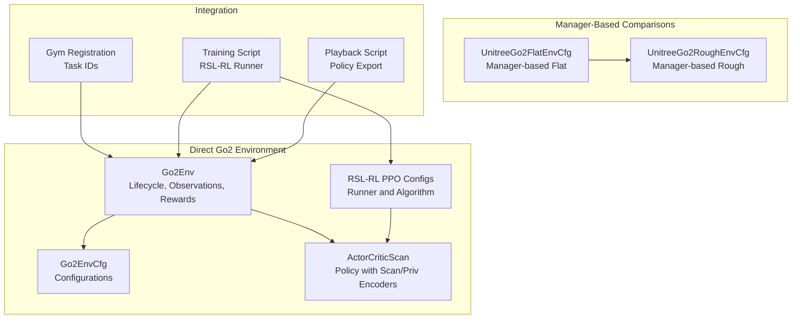
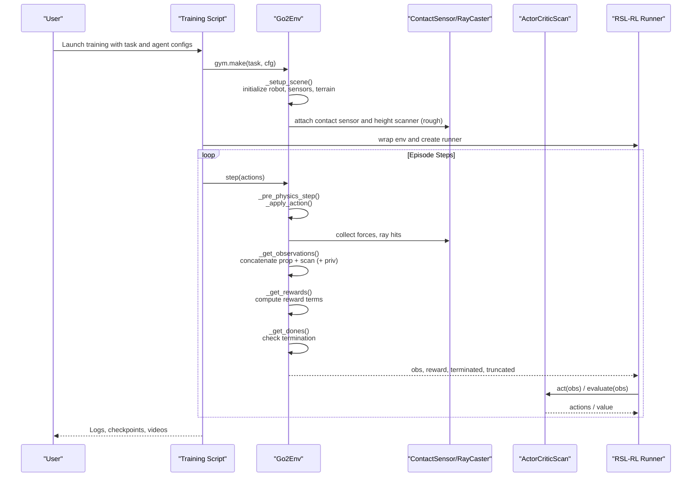
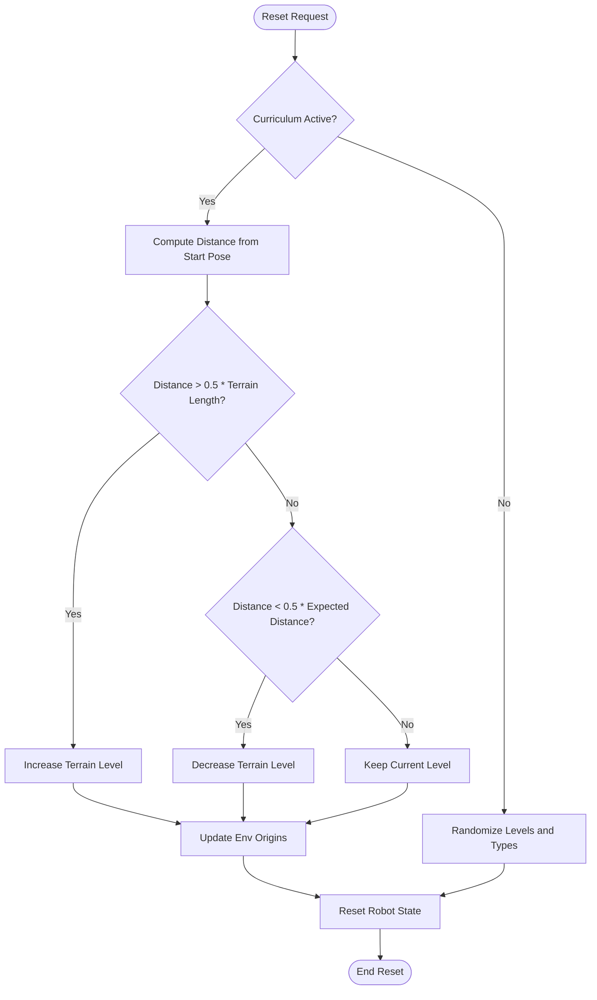
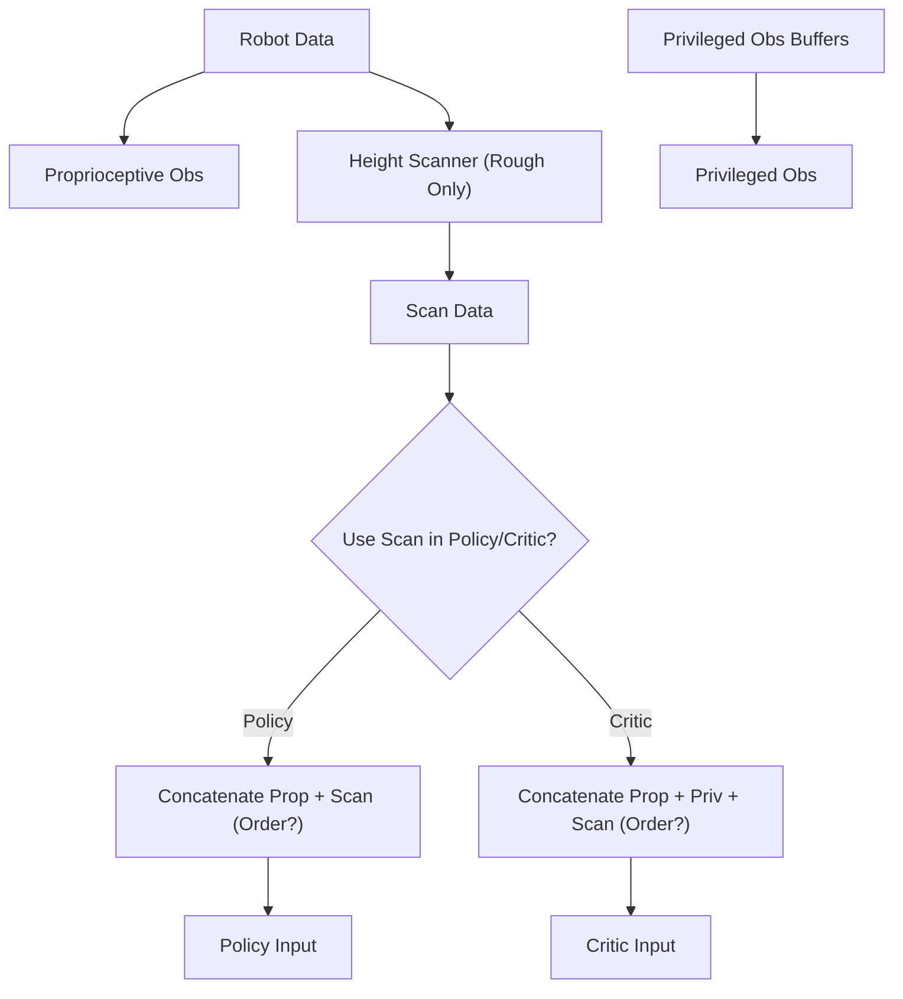
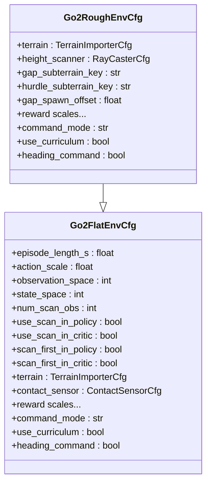
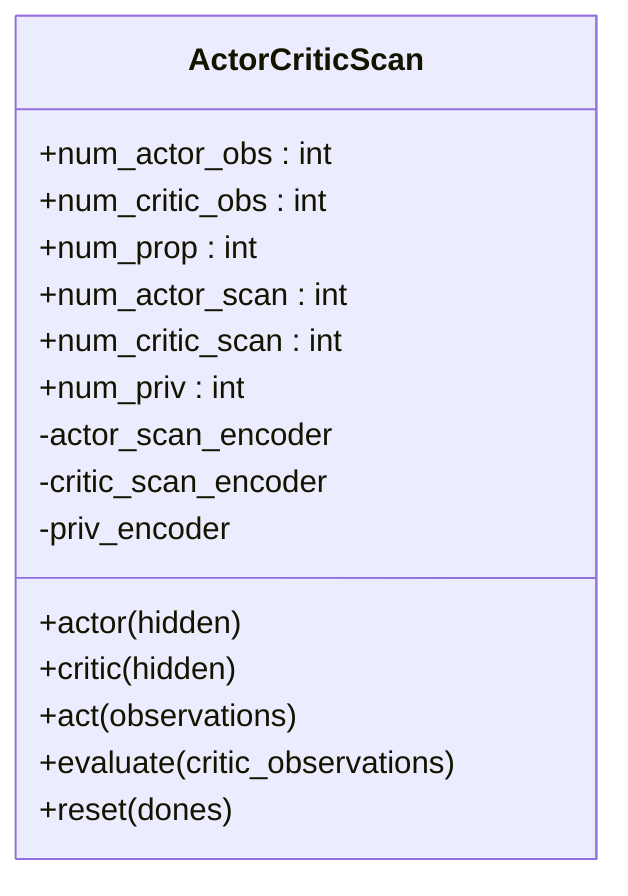
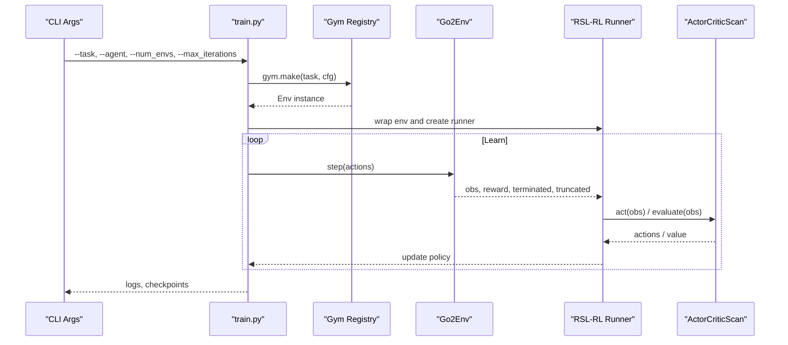
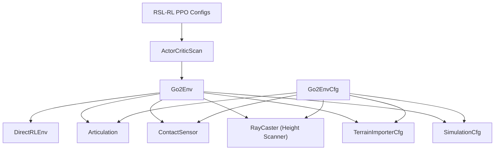

# Go2 Environment System

<cite>
**Referenced Files in This Document**
- [go2_env.py](file://source/isaaclab_tasks/isaaclab_tasks/direct/go2/go2_env.py)
- [go2_env_cfg.py](file://source/isaaclab_tasks/isaaclab_tasks/direct/go2/go2_env_cfg.py)
- [rsl_rl_ppo_cfg.py](file://source/isaaclab_tasks/isaaclab_tasks/direct/go2/agents/rsl_rl_ppo_cfg.py)
- [actor_critic_scan.py](file://source/isaaclab_tasks/isaaclab_tasks/direct/go2/agents/actor_critic_scan.py)
- [__init__.py](file://source/isaaclab_tasks/isaaclab_tasks/direct/go2/__init__.py)
- [flat_env_cfg.py](file://source/isaaclab_tasks/isaaclab_tasks/manager_based/locomotion/velocity/config/go2/flat_env_cfg.py)
- [rough_env_cfg.py](file://source/isaaclab_tasks/isaaclab_tasks/manager_based/locomotion/velocity/config/go2/rough_env_cfg.py)
- [README.md](file://README.md)
- [train.py](file://scripts/reinforcement_learning/rsl_rl/train.py)
- [play.py](file://scripts/reinforcement_learning/rsl_rl/play.py)
</cite>

## Table of Contents
1. [Introduction](#introduction)
2. [Project Structure](#project-structure)
3. [Core Components](#core-components)
4. [Architecture Overview](#architecture-overview)
5. [Detailed Component Analysis](#detailed-component-analysis)
6. [Dependency Analysis](#dependency-analysis)
7. [Performance Considerations](#performance-considerations)
8. [Troubleshooting Guide](#troubleshooting-guide)
9. [Conclusion](#conclusion)
10. [Appendices](#appendices)

## Introduction
The Go2 Environment System is the core component implementing quadruped locomotion in the extreme parkour setting within the Isaac Lab ecosystem. It serves as a benchmark environment for ablation studies, enabling controlled evaluation of sensor fusion strategies, reward engineering, and curriculum learning mechanisms. The environment integrates a Unitree Go2 robot with advanced terrain generation, height-scan perception, and a modular reward specification system. It supports both flat and rough terrains, with configurable observation modalities and reward scales tailored for performance and safety.

The environment is designed to evaluate sensor fusion by combining proprioceptive observations with height-scan data, and to assess reward engineering by isolating and modifying individual reward terms. Curriculum learning is integrated to progressively increase terrain difficulty, ensuring robust skill acquisition under realistic conditions.

## Project Structure
The Go2 environment is organized into several modules:
- Environment definition and lifecycle: [go2_env.py](file://source/isaaclab_tasks/isaaclab_tasks/direct/go2/go2_env.py)
- Configuration system: [go2_env_cfg.py](file://source/isaaclab_tasks/isaaclab_tasks/direct/go2/go2_env_cfg.py)
- Agent policy configuration: [rsl_rl_ppo_cfg.py](file://source/isaaclab_tasks/isaaclab_tasks/direct/go2/agents/rsl_rl_ppo_cfg.py)
- Neural network policy with scan and privileged observation encoders: [actor_critic_scan.py](file://source/isaaclab_tasks/isaaclab_tasks/direct/go2/agents/actor_critic_scan.py)
- Task registration for Gym environments: [__init__.py](file://source/isaaclab_tasks/isaaclab_tasks/direct/go2/__init__.py)
- Manager-based environment configurations for comparison: [flat_env_cfg.py](file://source/isaaclab_tasks/isaaclab_tasks/manager_based/locomotion/velocity/config/go2/flat_env_cfg.py), [rough_env_cfg.py](file://source/isaaclab_tasks/isaaclab_tasks/manager_based/locomotion/velocity/config/go2/rough_env_cfg.py)
- Training and playback scripts: [train.py](file://scripts/reinforcement_learning/rsl_rl/train.py), [play.py](file://scripts/reinforcement_learning/rsl_rl/play.py)
- Project overview and specs: [README.md](file://README.md)

**Diagram sources**
- [go2_env.py:1-635](file://source/isaaclab_tasks/isaaclab_tasks/direct/go2/go2_env.py#L1-L635)
- [go2_env_cfg.py:1-353](file://source/isaaclab_tasks/isaaclab_tasks/direct/go2/go2_env_cfg.py#L1-L353)
- [rsl_rl_ppo_cfg.py:1-155](file://source/isaaclab_tasks/isaaclab_tasks/direct/go2/agents/rsl_rl_ppo_cfg.py#L1-L155)
- [actor_critic_scan.py:1-262](file://source/isaaclab_tasks/isaaclab_tasks/direct/go2/agents/actor_critic_scan.py#L1-L262)
- [flat_env_cfg.py:1-44](file://source/isaaclab_tasks/isaaclab_tasks/manager_based/locomotion/velocity/config/go2/flat_env_cfg.py#L1-L44)
- [rough_env_cfg.py:1-86](file://source/isaaclab_tasks/isaaclab_tasks/manager_based/locomotion/velocity/config/go2/rough_env_cfg.py#L1-L86)
- [__init__.py:1-147](file://source/isaaclab_tasks/isaaclab_tasks/direct/go2/__init__.py#L1-L147)
- [train.py:1-220](file://scripts/reinforcement_learning/rsl_rl/train.py#L1-L220)
- [play.py:1-206](file://scripts/reinforcement_learning/rsl_rl/play.py#L1-L206)

**Section sources**
- [README.md:30-59](file://README.md#L30-L59)
- [__init__.py:18-147](file://source/isaaclab_tasks/isaaclab_tasks/direct/go2/__init__.py#L18-L147)

## Core Components
- Go2Env: Implements the DirectRLEnv lifecycle, including setup, physics steps, observations, rewards, terminations, and curriculum updates. It manages privileged observations via domain randomization buffers and integrates a height scanner for rough terrain.
- Go2EnvCfg: Defines environment configurations for flat and rough terrains, including simulation parameters, terrain generation, reward scales, and curriculum settings. It also controls scan usage and ordering for policy and critic.
- ActorCriticScan: A neural network policy that optionally encodes scan and privileged observations separately for the actor and critic, supporting flexible observation modalities.
- RSL-RL PPO Runner Configs: Configure the PPO algorithm, policy architecture, and training hyperparameters for both flat and rough environments, including ablation variants.

Key capabilities:
- Proprioceptive observations: joint positions/velocities, projected gravity, root linear/angular velocities, commands, last action, and foot contacts.
- Privileged observations (critic only): mass, center of mass, friction coefficient, and PD gain scales.
- Height scan observations: grid-based height measurements for rough terrain perception.
- Reward specification: modular rewards for velocity tracking, orientation, torques, accelerations, action rate, air time, undesired contacts, base height, stumbling, and work.
- Curriculum learning: terrain difficulty progression based on achieved distance and command speed.

**Section sources**
- [go2_env.py:293-355](file://source/isaaclab_tasks/isaaclab_tasks/direct/go2/go2_env.py#L293-L355)
- [go2_env.py:357-465](file://source/isaaclab_tasks/isaaclab_tasks/direct/go2/go2_env.py#L357-L465)
- [go2_env.py:467-635](file://source/isaaclab_tasks/isaaclab_tasks/direct/go2/go2_env.py#L467-L635)
- [go2_env_cfg.py:71-314](file://source/isaaclab_tasks/isaaclab_tasks/direct/go2/go2_env_cfg.py#L71-L314)
- [actor_critic_scan.py:13-262](file://source/isaaclab_tasks/isaaclab_tasks/direct/go2/agents/actor_critic_scan.py#L13-L262)
- [rsl_rl_ppo_cfg.py:44-155](file://source/isaaclab_tasks/isaaclab_tasks/direct/go2/agents/rsl_rl_ppo_cfg.py#L44-L155)

## Architecture Overview
The Go2 Environment System integrates the DirectRLEnv lifecycle with configurable terrain, sensors, and reward engineering. The environment registers Gym tasks, initializes the robot and sensors, processes observations, computes rewards, and applies curriculum updates. The policy is implemented as an ActorCriticScan that can incorporate scan and privileged observations.

**Diagram sources**
- [train.py:119-210](file://scripts/reinforcement_learning/rsl_rl/train.py#L119-L210)
- [go2_env.py:233-355](file://source/isaaclab_tasks/isaaclab_tasks/direct/go2/go2_env.py#L233-L355)
- [actor_critic_scan.py:201-257](file://source/isaaclab_tasks/isaaclab_tasks/direct/go2/agents/actor_critic_scan.py#L201-L257)

## Detailed Component Analysis

### Environment Lifecycle and State Management
- Initialization: Sets up action buffers, privileged observation buffers, hip joint indices, command vectors, and curriculum flags. Initializes episode sums for logging.
- Physics integration: Applies processed actions to joint position targets and updates heading commands when enabled.
- Termination: Determines death and timeout conditions based on contact forces and episode length.
- Reset and curriculum: Updates terrain origins based on distance traveled and command speed when curriculum is active; otherwise randomizes terrain levels and types.

**Diagram sources**
- [go2_env.py:473-531](file://source/isaaclab_tasks/isaaclab_tasks/direct/go2/go2_env.py#L473-L531)
- [go2_env.py:536-635](file://source/isaaclab_tasks/isaaclab_tasks/direct/go2/go2_env.py#L536-L635)

**Section sources**
- [go2_env.py:23-119](file://source/isaaclab_tasks/isaaclab_tasks/direct/go2/go2_env.py#L23-L119)
- [go2_env.py:467-635](file://source/isaaclab_tasks/isaaclab_tasks/direct/go2/go2_env.py#L467-L635)

### Observation Processing Pipeline
- Proprioceptive observations: Concatenation of joint positions/deviations, joint velocities, projected gravity, root linear/angular velocities, commands, last action, and foot contacts.
- Privileged observations (critic only): Mass, center of mass, friction coefficient, and PD gain scales captured via domain randomization buffers.
- Height scan observations: Grid-based height measurements computed from raycast hits, clipped and normalized for rough terrain.
- Observation ordering: Policy and critic can use either prop-first or scan-first configurations, controlled by flags in the environment configuration.

**Diagram sources**
- [go2_env.py:293-355](file://source/isaaclab_tasks/isaaclab_tasks/direct/go2/go2_env.py#L293-L355)
- [go2_env_cfg.py:172-314](file://source/isaaclab_tasks/isaaclab_tasks/direct/go2/go2_env_cfg.py#L172-L314)

**Section sources**
- [go2_env.py:293-355](file://source/isaaclab_tasks/isaaclab_tasks/direct/go2/go2_env.py#L293-L355)
- [go2_env_cfg.py:71-170](file://source/isaaclab_tasks/isaaclab_tasks/direct/go2/go2_env_cfg.py#L71-L170)

### Reward Specification System
Rewards are composed of multiple terms with configurable scales:
- Tracking rewards: linear velocity (XY), yaw rate, Z velocity, angular velocity (XY).
- Penalizing terms: joint torques, joint acceleration, action rate, undesired contacts, flat orientation, base height, stop penalties, DOF close to default, hip position deviation, stumbling.
- Work consideration: positive mechanical work is penalized using a clamped power signal.

**Diagram sources**
- [go2_env.py:357-465](file://source/isaaclab_tasks/isaaclab_tasks/direct/go2/go2_env.py#L357-L465)

**Section sources**
- [go2_env.py:357-465](file://source/isaaclab_tasks/isaaclab_tasks/direct/go2/go2_env.py#L357-L465)
- [go2_env_cfg.py:135-170](file://source/isaaclab_tasks/isaaclab_tasks/direct/go2/go2_env_cfg.py#L135-L170)

### Environment Configuration System
- Flat environment: Plane terrain, no height scanner, no scan in policy/critic, smaller observation/state spaces.
- Rough environment: Procedural terrain generator with diverse sub-terrains (boxes, random rough, debris field, gaps, hurdles, stairs, parkour steps), height scanner, scan in policy/critic, larger observation/state spaces.
- Curriculum and commands: Flags for curriculum activation, command modes (random/fixed), heading control, and logging intervals.

**Diagram sources**
- [go2_env_cfg.py:71-314](file://source/isaaclab_tasks/isaaclab_tasks/direct/go2/go2_env_cfg.py#L71-L314)

**Section sources**
- [go2_env_cfg.py:71-314](file://source/isaaclab_tasks/isaaclab_tasks/direct/go2/go2_env_cfg.py#L71-L314)
- [flat_env_cfg.py:11-28](file://source/isaaclab_tasks/isaaclab_tasks/manager_based/locomotion/velocity/config/go2/flat_env_cfg.py#L11-L28)
- [rough_env_cfg.py:16-62](file://source/isaaclab_tasks/isaaclab_tasks/manager_based/locomotion/velocity/config/go2/rough_env_cfg.py#L16-L62)

### Policy Architecture with Scan and Privileged Observations
The policy supports optional encoding of scan and privileged observations:
- Actor input: prop_obs concatenated with encoded scan (if enabled).
- Critic input: prop_obs + encoded privileged obs + encoded scan (if enabled).
- Encoder dimensions: configurable actor/critic scan encoders and privileged encoders.

**Diagram sources**
- [actor_critic_scan.py:13-262](file://source/isaaclab_tasks/isaaclab_tasks/direct/go2/agents/actor_critic_scan.py#L13-L262)

**Section sources**
- [actor_critic_scan.py:13-262](file://source/isaaclab_tasks/isaaclab_tasks/direct/go2/agents/actor_critic_scan.py#L13-L262)
- [rsl_rl_ppo_cfg.py:11-41](file://source/isaaclab_tasks/isaaclab_tasks/direct/go2/agents/rsl_rl_ppo_cfg.py#L11-L41)

### Integration with RL Training Pipelines
- Gym registration: Registers multiple tasks for direct Go2 environments, including flat, rough, and ablation variants.
- Training script: Creates the environment, wraps it for RSL-RL, and runs the PPO algorithm with configurable hyperparameters.
- Playback script: Loads a trained checkpoint, exports the policy to JIT/ONNX, and runs inference in the environment.

**Diagram sources**
- [__init__.py:18-147](file://source/isaaclab_tasks/isaaclab_tasks/direct/go2/__init__.py#L18-L147)
- [train.py:119-210](file://scripts/reinforcement_learning/rsl_rl/train.py#L119-L210)
- [play.py:93-171](file://scripts/reinforcement_learning/rsl_rl/play.py#L93-L171)

**Section sources**
- [__init__.py:18-147](file://source/isaaclab_tasks/isaaclab_tasks/direct/go2/__init__.py#L18-L147)
- [train.py:119-210](file://scripts/reinforcement_learning/rsl_rl/train.py#L119-L210)
- [play.py:93-171](file://scripts/reinforcement_learning/rsl_rl/play.py#L93-L171)

## Dependency Analysis
The Go2 environment depends on:
- Isaac Lab core: DirectRLEnv, Articulation, ContactSensor, RayCaster, SimulationCfg, TerrainImporterCfg.
- Asset definitions: Unitree Go2 robot configuration.
- Sensor patterns: GridPattern for height scanning.
- Manager-based comparisons: Flat and rough manager-based configurations for benchmarking.

**Diagram sources**
- [go2_env.py:12-17](file://source/isaaclab_tasks/isaaclab_tasks/direct/go2/go2_env.py#L12-L17)
- [go2_env_cfg.py:8-31](file://source/isaaclab_tasks/isaaclab_tasks/direct/go2/go2_env_cfg.py#L8-L31)
- [actor_critic_scan.py:13-43](file://source/isaaclab_tasks/isaaclab_tasks/direct/go2/agents/actor_critic_scan.py#L13-L43)

**Section sources**
- [go2_env.py:12-17](file://source/isaaclab_tasks/isaaclab_tasks/direct/go2/go2_env.py#L12-L17)
- [go2_env_cfg.py:8-31](file://source/isaaclab_tasks/isaaclab_tasks/direct/go2/go2_env_cfg.py#L8-L31)

## Performance Considerations
- Simulation fidelity: Adjust GPU rigid patch counts and solver iterations for stability and performance.
- Observation bandwidth: Use scan-first ordering and selective scan inclusion to balance perception and computation.
- Curriculum cadence: Tune terrain update frequency and expected distance thresholds to prevent overfitting to specific terrains.
- Command sampling: Prefer fixed commands during evaluation to ensure reproducible performance metrics.

[No sources needed since this section provides general guidance]

## Troubleshooting Guide
Common issues and resolutions:
- Missing height scanner: Ensure the environment is configured as rough and the height scanner is attached in setup.
- Privileged observation mismatch: Verify domain randomization buffers are initialized and updated after startup events.
- Curriculum instability: Reduce curriculum update frequency or adjust terrain level thresholds.
- Reward imbalance: Start with default scales and gradually tune individual reward weights; monitor episode logs for dominant reward terms.

**Section sources**
- [go2_env.py:120-179](file://source/isaaclab_tasks/isaaclab_tasks/direct/go2/go2_env.py#L120-L179)
- [go2_env.py:473-531](file://source/isaaclab_tasks/isaaclab_tasks/direct/go2/go2_env.py#L473-L531)

## Conclusion
The Go2 Environment System provides a robust, configurable platform for quadruped locomotion research within Isaac Lab. Its modular design enables precise ablation studies, comprehensive sensor fusion evaluation, and effective curriculum learning. By combining rich proprioceptive and height-scan observations with a flexible reward specification and a scalable policy architecture, it supports both research and practical deployment scenarios.

[No sources needed since this section summarizes without analyzing specific files]

## Appendices

### Practical Examples

- Environment configuration
  - Flat terrain: Use [Go2FlatEnvCfg:71-170](file://source/isaaclab_tasks/isaaclab_tasks/direct/go2/go2_env_cfg.py#L71-L170) for plane terrain and minimal observations.
  - Rough terrain: Use [Go2RoughEnvCfg:172-314](file://source/isaaclab_tasks/isaaclab_tasks/direct/go2/go2_env_cfg.py#L172-L314) for procedural terrains and height scans.
  - Ablation variants: Toggle scan usage and ordering via [Go2RoughAbl1EnvCfg:333-341](file://source/isaaclab_tasks/isaaclab_tasks/direct/go2/go2_env_cfg.py#L333-L341) and [Go2RoughAbl2_5EnvCfg:343-352](file://source/isaaclab_tasks/isaaclab_tasks/direct/go2/go2_env_cfg.py#L343-L352).

- Observation space analysis
  - Proprioceptive: 52D (joint positions/velocities, projected gravity, root velocities, commands, last action, foot contacts).
  - Privileged (critic): 29D (mass, COM, friction, PD gain scales).
  - Scan (rough): 187D grid height scan.
  - Ordering: Policy and critic can be configured to use prop-first or scan-first concatenation.

- Reward function customization
  - Modify scales in [Go2FlatEnvCfg:135-170](file://source/isaaclab_tasks/isaaclab_tasks/direct/go2/go2_env_cfg.py#L135-L170) or [Go2RoughEnvCfg:279-298](file://source/isaaclab_tasks/isaaclab_tasks/direct/go2/go2_env_cfg.py#L279-L298).
  - Add or remove reward terms in [_get_rewards:357-465](file://source/isaaclab_tasks/isaaclab_tasks/direct/go2/go2_env.py#L357-L465).

- Task registration and training
  - Register tasks in [__init__.py:18-147](file://source/isaaclab_tasks/isaaclab_tasks/direct/go2/__init__.py#L18-L147).
  - Launch training with [train.py:119-210](file://scripts/reinforcement_learning/rsl_rl/train.py#L119-L210) and agent configs in [rsl_rl_ppo_cfg.py:44-155](file://source/isaaclab_tasks/isaaclab_tasks/direct/go2/agents/rsl_rl_ppo_cfg.py#L44-L155).

**Section sources**
- [README.md:51-59](file://README.md#L51-L59)
- [go2_env_cfg.py:71-314](file://source/isaaclab_tasks/isaaclab_tasks/direct/go2/go2_env_cfg.py#L71-L314)
- [go2_env.py:357-465](file://source/isaaclab_tasks/isaaclab_tasks/direct/go2/go2_env.py#L357-L465)
- [__init__.py:18-147](file://source/isaaclab_tasks/isaaclab_tasks/direct/go2/__init__.py#L18-L147)
- [rsl_rl_ppo_cfg.py:44-155](file://source/isaaclab_tasks/isaaclab_tasks/direct/go2/agents/rsl_rl_ppo_cfg.py#L44-L155)
- [train.py:119-210](file://scripts/reinforcement_learning/rsl_rl/train.py#L119-L210)