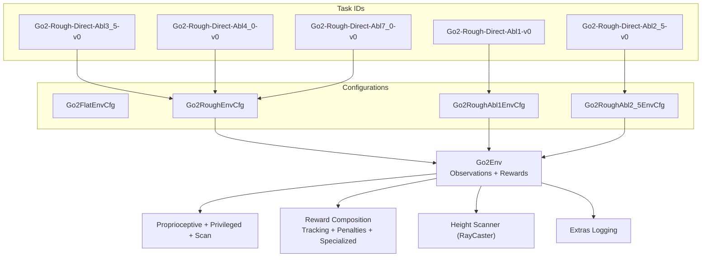
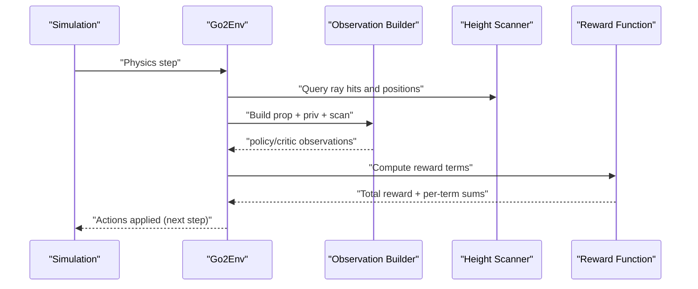
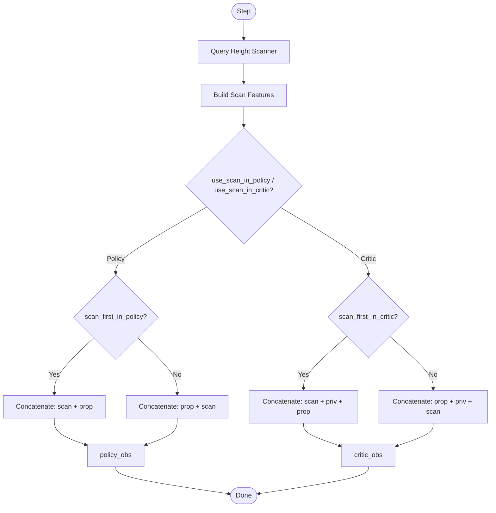
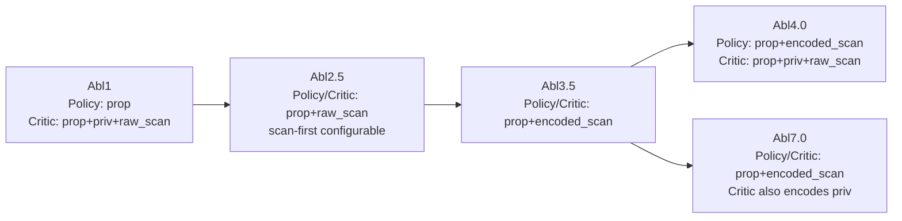
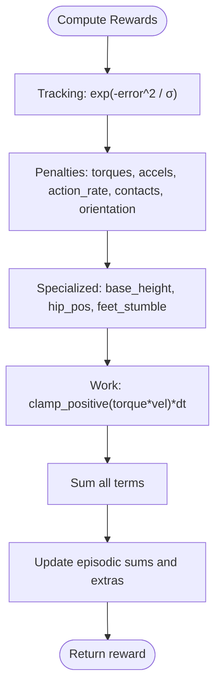
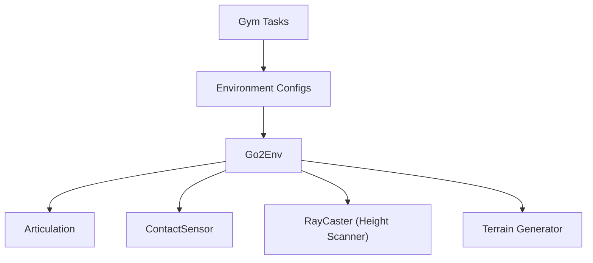

# Observation and Reward Systems

<cite>
**Referenced Files in This Document**
- [go2_env.py](file://source/isaaclab_tasks/isaaclab_tasks/direct/go2/go2_env.py)
- [go2_env_cfg.py](file://source/isaaclab_tasks/isaaclab_tasks/direct/go2/go2_env_cfg.py)
- [__init__.py](file://source/isaaclab_tasks/isaaclab_tasks/direct/go2/__init__.py)
- [rsl_rl_ppo_cfg.py](file://source/isaaclab_tasks/isaaclab_tasks/direct/go2/agents/rsl_rl_ppo_cfg.py)
- [README.md](file://README.md)
- [reward_manager.py](file://source/isaaclab/isaaclab/managers/reward_manager.py)
</cite>

## Table of Contents
1. [Introduction](#introduction)
2. [Project Structure](#project-structure)
3. [Core Components](#core-components)
4. [Architecture Overview](#architecture-overview)
5. [Detailed Component Analysis](#detailed-component-analysis)
6. [Dependency Analysis](#dependency-analysis)
7. [Performance Considerations](#performance-considerations)
8. [Troubleshooting Guide](#troubleshooting-guide)
9. [Conclusion](#conclusion)

## Introduction
This document explains the Go2 Environment’s Observation and Reward Systems used for extreme quadruped parkour locomotion. It covers:
- Observation processing pipeline: proprioceptive observations, privileged observations, and height scan data integration
- Sensor fusion strategies across ablation scenarios (scan-first vs prop-first)
- Reward function engineering: tracking rewards, penalties, and specialized parkour-style rewards
- Positive-work clamping, reward scaling, and reward logging
- Practical examples for observation space analysis, reward customization, and debugging reward shaping

## Project Structure
The Go2 environment is implemented as a direct RL environment with a custom reward composition and configurable observation spaces. Ablation variants are exposed via Gym task IDs and mapped to environment configurations and agent runner policies.

**Diagram sources**
- [go2_env.py:293-355](file://source/isaaclab_tasks/isaaclab_tasks/direct/go2/go2_env.py#L293-L355)
- [go2_env_cfg.py:71-352](file://source/isaaclab_tasks/isaaclab_tasks/direct/go2/go2_env_cfg.py#L71-L352)
- [__init__.py:49-147](file://source/isaaclab_tasks/isaaclab_tasks/direct/go2/__init__.py#L49-L147)

**Section sources**
- [go2_env.py:293-355](file://source/isaaclab_tasks/isaaclab_tasks/direct/go2/go2_env.py#L293-L355)
- [go2_env_cfg.py:71-352](file://source/isaaclab_tasks/isaaclab_tasks/direct/go2/go2_env_cfg.py#L71-L352)
- [__init__.py:49-147](file://source/isaaclab_tasks/isaaclab_tasks/direct/go2/__init__.py#L49-L147)

## Core Components
- Observation pipeline
  - Proprioceptive observations: joint positions, velocities, projected gravity, base linear/angular velocities, commands, last actions, and foot contact flags
  - Privileged observations: mass, center of mass, friction coefficient, and PD gain scales
  - Height scan data: ray-cast height differences integrated as scan features
  - Sensor fusion: configurable scan-first vs prop-first ordering for policy/critic
- Reward pipeline
  - Tracking rewards: exponential mapping of linear and yaw velocity errors
  - Penalty functions: torques, accelerations, action rate, undesired contacts, flat orientation, base height deviation, hip position drift, feet stumble detection
  - Work regularization: positive mechanical work clamped and scaled
  - Logging: per-term episodic sums and episode averages exported via extras

**Section sources**
- [go2_env.py:293-355](file://source/isaaclab_tasks/isaaclab_tasks/direct/go2/go2_env.py#L293-L355)
- [go2_env.py:357-465](file://source/isaaclab_tasks/isaaclab_tasks/direct/go2/go2_env.py#L357-L465)
- [go2_env_cfg.py:135-154](file://source/isaaclab_tasks/isaaclab_tasks/direct/go2/go2_env_cfg.py#L135-L154)

## Architecture Overview
The environment computes observations and rewards each step, integrates a height scanner for terrain awareness, and logs detailed metrics for analysis.

**Diagram sources**
- [go2_env.py:293-355](file://source/isaaclab_tasks/isaaclab_tasks/direct/go2/go2_env.py#L293-L355)
- [go2_env.py:357-465](file://source/isaaclab_tasks/isaaclab_tasks/direct/go2/go2_env.py#L357-L465)

## Detailed Component Analysis

### Observation Processing Pipeline
- Proprioceptive observations (size depends on configuration)
  - Joint positions relative to defaults, joint velocities, projected gravity, base linear and angular velocities, commanded velocities, last actions, and foot contact flags
- Privileged observations (critic only)
  - Robot mass and center of mass, terrain friction, and PD gain scales captured from simulation
- Height scan integration
  - Ray-caster measures height differences from base to ground; values are clipped and optionally fed to policy/critic
- Sensor fusion strategies
  - Policy and critic can receive scan-first or prop-first depending on configuration flags
  - Ablations control whether scan is used in policy/critic and the fusion order

**Diagram sources**
- [go2_env.py:293-355](file://source/isaaclab_tasks/isaaclab_tasks/direct/go2/go2_env.py#L293-L355)

**Section sources**
- [go2_env.py:293-355](file://source/isaaclab_tasks/isaaclab_tasks/direct/go2/go2_env.py#L293-L355)
- [go2_env_cfg.py:77-85](file://source/isaaclab_tasks/isaaclab_tasks/direct/go2/go2_env_cfg.py#L77-L85)
- [go2_env_cfg.py:180-185](file://source/isaaclab_tasks/isaaclab_tasks/direct/go2/go2_env_cfg.py#L180-L185)

### Sensor Fusion Strategies Across Ablations
- Abl1: Policy uses only proprioceptive; Critic uses proprioceptive + privileged + raw scan
- Abl2.5: Both policy and critic use proprioceptive + raw scan; scan-first order configurable
- Abl3.5: Best-performing variant; both policy and critic use proprioceptive + encoded scan
- Abl4.0: Policy uses encoded scan; Critic uses proprioceptive + privileged + raw scan
- Abl7.0: Policy uses encoded scan; Critic uses proprioceptive + encoded privileged + encoded scan

**Diagram sources**
- [README.md:12-18](file://README.md#L12-L18)
- [README.md:120-152](file://README.md#L120-L152)
- [rsl_rl_ppo_cfg.py:133-154](file://source/isaaclab_tasks/isaaclab_tasks/direct/go2/agents/rsl_rl_ppo_cfg.py#L133-L154)

**Section sources**
- [README.md:12-18](file://README.md#L12-L18)
- [README.md:120-152](file://README.md#L120-L152)
- [rsl_rl_ppo_cfg.py:133-154](file://source/isaaclab_tasks/isaaclab_tasks/direct/go2/agents/rsl_rl_ppo_cfg.py#L133-L154)

### Reward Function Engineering
- Tracking rewards
  - Exponential mapping of linear XY velocity error and yaw rate error
  - Stop penalties for residual linear/angular velocity
- Penalities
  - Joint torques, accelerations, action rate
  - Undesired contacts (e.g., thigh-ground contacts)
  - Flat orientation penalty
  - Base height deviation from a target
  - Hip position drift (parkour-style)
  - Feet stumble detection: lateral force dominance over vertical support
- Work regularization
  - Positive mechanical work only (regenerative braking clamped), scaled and integrated over time
- Reward scaling and logging
  - Each reward term is multiplied by a scalar scale and time-step dt
  - Per-term episodic sums maintained and exported via extras for monitoring

**Diagram sources**
- [go2_env.py:357-465](file://source/isaaclab_tasks/isaaclab_tasks/direct/go2/go2_env.py#L357-L465)

**Section sources**
- [go2_env.py:357-465](file://source/isaaclab_tasks/isaaclab_tasks/direct/go2/go2_env.py#L357-L465)
- [go2_env_cfg.py:135-154](file://source/isaaclab_tasks/isaaclab_tasks/direct/go2/go2_env_cfg.py#L135-L154)

### Reward Scaling Factors and Configuration
- Reward scales are defined in environment configurations and overridden for rough terrain
- Example scales include linear velocity, yaw rate, Z velocity, angular velocity, joint torque/acceleration, action rate, air time, undesired contacts, flat orientation, base height, torque, stop penalties, hip position, feet stumble, DOF proximity to defaults, and work
- These scales are multiplied by dt and summed to produce the total reward

**Section sources**
- [go2_env_cfg.py:135-154](file://source/isaaclab_tasks/isaaclab_tasks/direct/go2/go2_env_cfg.py#L135-L154)
- [go2_env_cfg.py:279-298](file://source/isaaclab_tasks/isaaclab_tasks/direct/go2/go2_env_cfg.py#L279-L298)

### Reward Logging System
- Per-term episodic sums are accumulated and normalized by episode length for reporting
- Extras include per-term averages and termination counts for diagnostics
- Reward manager supports modular term weighting and logging for broader RL frameworks

**Section sources**
- [go2_env.py:89-112](file://source/isaaclab_tasks/isaaclab_tasks/direct/go2/go2_env.py#L89-L112)
- [go2_env.py:621-635](file://source/isaaclab_tasks/isaaclab_tasks/direct/go2/go2_env.py#L621-L635)
- [reward_manager.py:100-158](file://source/isaaclab/isaaclab/managers/reward_manager.py#L100-L158)

### Observation Space Analysis Examples
- Flat terrain configuration defines base observation/state sizes and privileged observation dimensions
- Rough terrain configuration adds scan observations and adjusts sizes accordingly
- Ablation configurations override scan usage and fusion order

**Section sources**
- [go2_env_cfg.py:77-85](file://source/isaaclab_tasks/isaaclab_tasks/direct/go2/go2_env_cfg.py#L77-L85)
- [go2_env_cfg.py:180-185](file://source/isaaclab_tasks/isaaclab_tasks/direct/go2/go2_env_cfg.py#L180-L185)
- [go2_env_cfg.py:311-313](file://source/isaaclab_tasks/isaaclab_tasks/direct/go2/go2_env_cfg.py#L311-L313)

### Reward Function Customization
- Modify scales in environment configuration to emphasize or de-emphasize specific behaviors
- Add or remove reward terms by editing the reward composition
- Adjust thresholds (e.g., feet stumble ratio) or incorporate domain-specific penalties

**Section sources**
- [go2_env_cfg.py:135-154](file://source/isaaclab_tasks/isaaclab_tasks/direct/go2/go2_env_cfg.py#L135-L154)
- [go2_env.py:357-465](file://source/isaaclab_tasks/isaaclab_tasks/direct/go2/go2_env.py#L357-L465)

### Debugging Techniques for Reward Shaping
- Command logging: periodic printing of commanded vs actual velocities and heading for sanity checks
- Episode extras: inspect per-term averages and termination statistics
- Reward manager diagnostics: active terms listing and per-term values for verification

**Section sources**
- [go2_env.py:275-291](file://source/isaaclab_tasks/isaaclab_tasks/direct/go2/go2_env.py#L275-L291)
- [go2_env.py:621-635](file://source/isaaclab_tasks/isaaclab_tasks/direct/go2/go2_env.py#L621-L635)
- [reward_manager.py:71-85](file://source/isaaclab/isaaclab/managers/reward_manager.py#L71-L85)

## Dependency Analysis
- Environment depends on:
  - Robot articulation for joint states and applied torques
  - Contact sensor for foot contacts and air time
  - Height scanner for terrain-awareness scans
  - Terrain generator for curriculum and spawn offsets
- Ablations are controlled by Gym task registration and environment configuration overrides

**Diagram sources**
- [go2_env.py:212-232](file://source/isaaclab_tasks/isaaclab_tasks/direct/go2/go2_env.py#L212-L232)
- [__init__.py:49-147](file://source/isaaclab_tasks/isaaclab_tasks/direct/go2/__init__.py#L49-L147)

**Section sources**
- [go2_env.py:212-232](file://source/isaaclab_tasks/isaaclab_tasks/direct/go2/go2_env.py#L212-L232)
- [__init__.py:49-147](file://source/isaaclab_tasks/isaaclab_tasks/direct/go2/__init__.py#L49-L147)

## Performance Considerations
- Scan-first vs prop-first fusion affects training stability and convergence; best-performing ablation uses encoded scan for both policy and critic
- Privileged observation encoding for the critic can lead to overfitting to constants; avoid encoding privileged observations for the critic when using raw scans
- Proper reward scaling prevents overwhelming penalties or rewards from dominating learning signals

**Section sources**
- [README.md:116-118](file://README.md#L116-L118)

## Troubleshooting Guide
- No scan access (Abl1): Blind walking failure; enable scan in policy
- High-dimensional raw scan (Abl2.5): Feature extraction issues; prefer encoded scan
- Critic receiving raw scan (Abl4.0): Noisy value estimation; prefer encoded scan for critic
- Privileged encoding for critic (Abl7.0): Constants overfitting; avoid encoding privileged observations for critic
- Reward imbalance: adjust scales in configuration to balance tracking vs penalty magnitudes

**Section sources**
- [README.md:110-114](file://README.md#L110-L114)
- [go2_env_cfg.py:135-154](file://source/isaaclab_tasks/isaaclab_tasks/direct/go2/go2_env_cfg.py#L135-L154)

## Conclusion
The Go2 Environment’s observation and reward systems are designed for robust, terrain-adaptive quadruped locomotion. The proprioceptive + privileged + height scan pipeline, combined with configurable sensor fusion strategies, enables effective training across challenging parkour terrains. Carefully tuned reward scales and logging facilitate rapid iteration and debugging, while ablation studies guide optimal fusion choices for policy and critic.