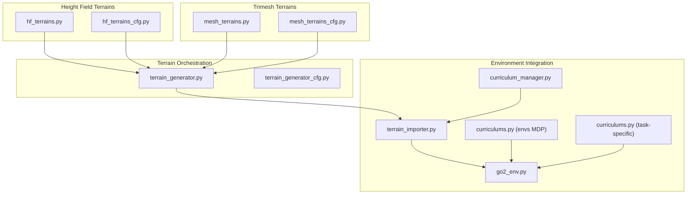
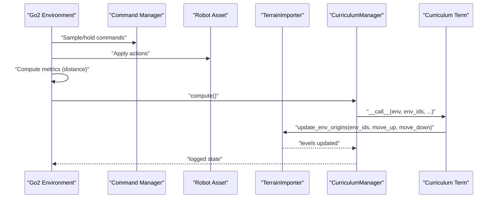
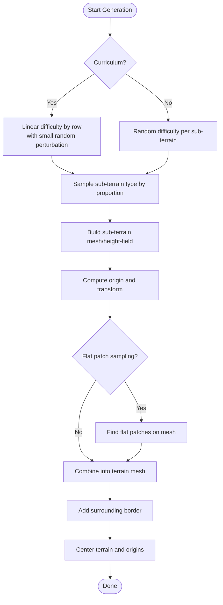
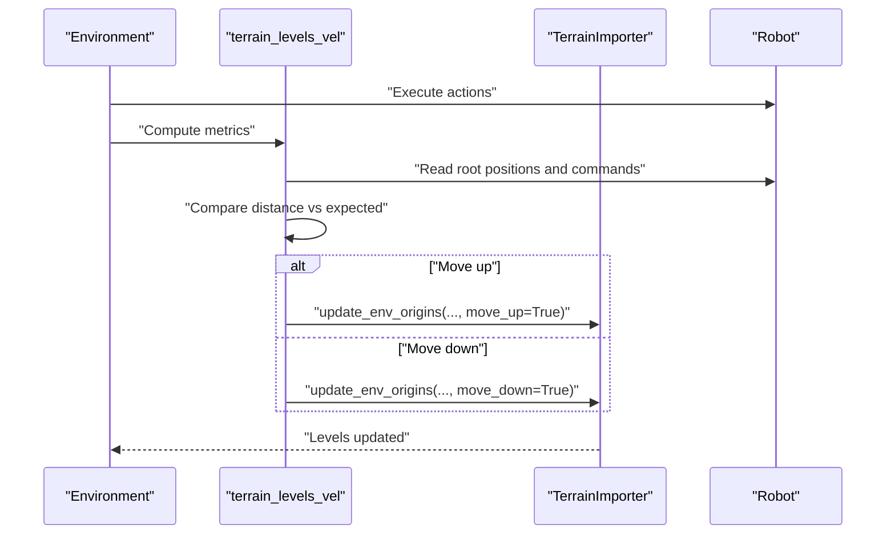
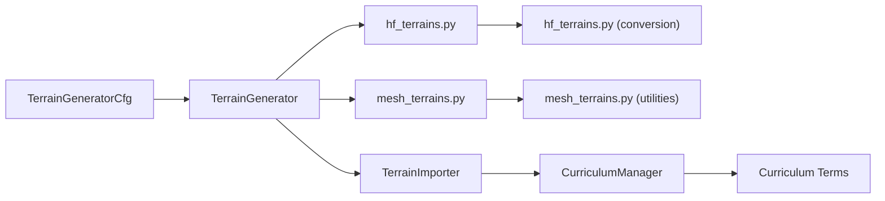

# Terrain Generation and Curriculum Learning

<cite>
**Referenced Files in This Document**
- [terrain_generator.py](file://source/isaaclab/isaaclab/terrains/terrain_generator.py)
- [terrain_generator_cfg.py](file://source/isaaclab/isaaclab/terrains/terrain_generator_cfg.py)
- [hf_terrains.py](file://source/isaaclab/isaaclab/terrains/height_field/hf_terrains.py)
- [hf_terrains_cfg.py](file://source/isaaclab/isaaclab/terrains/height_field/hf_terrains_cfg.py)
- [mesh_terrains.py](file://source/isaaclab/isaaclab/terrains/trimesh/mesh_terrains.py)
- [mesh_terrains_cfg.py](file://source/isaaclab/isaaclab/terrains/trimesh/mesh_terrains_cfg.py)
- [terrain_importer.py](file://source/isaaclab/isaaclab/terrains/terrain_importer.py)
- [curriculum_manager.py](file://source/isaaclab/isaaclab/managers/curriculum_manager.py)
- [curriculums.py](file://source/isaaclab/isaaclab/envs/mdp/curriculums.py)
- [curriculums.py](file://source/isaaclab_tasks/isaaclab_tasks/manager_based/locomotion/velocity/mdp/curriculums.py)
- [go2_env.py](file://source/isaaclab_tasks/isaaclab_tasks/direct/go2/go2_env.py)
</cite>

## Table of Contents
1. [Introduction](#introduction)
2. [Project Structure](#project-structure)
3. [Core Components](#core-components)
4. [Architecture Overview](#architecture-overview)
5. [Detailed Component Analysis](#detailed-component-analysis)
6. [Dependency Analysis](#dependency-analysis)
7. [Performance Considerations](#performance-considerations)
8. [Troubleshooting Guide](#troubleshooting-guide)
9. [Conclusion](#conclusion)
10. [Appendices](#appendices)

## Introduction
This document explains the Terrain Generation and Curriculum Learning system within the Go2 Environment. It covers:
- How terrains are generated: flat terrain setup, rough terrain with height fields, and procedurally generated parkour obstacles (gaps, hurdles, stairs, stepping stones).
- How curriculum learning adapts terrain difficulty based on agent performance using metrics such as distance traveled and command-following accuracy.
- Terrain level progression, terrain type randomization, and the relationship between terrain origins and environment positioning.
- Command sampling mechanisms, including random generation, fixed modes, and heading-based variants.
- Practical examples for configuration, curriculum progression tuning, and performance-based difficulty adjustment.
- Integration with the broader terrain system and customization options for research experiments.

## Project Structure
The terrain system is organized into:
- Height-field terrains: procedural height fields with configurable parameters and conversion to meshes.
- Trimesh-based terrains: explicit mesh construction for parkour-style obstacles and layouts.
- Terrain generator: orchestrates sub-terrains, difficulty sampling, and origin placement.
- Terrain importer: manages environment-level terrain instances and updates based on curriculum.
- Curriculum manager and terms: runtime adjustments to environment parameters and terrain levels.

**Diagram sources**
- [terrain_generator.py:1-398](file://source/isaaclab/isaaclab/terrains/terrain_generator.py#L1-L398)
- [terrain_generator_cfg.py:1-130](file://source/isaaclab/isaaclab/terrains/terrain_generator_cfg.py#L1-L130)
- [hf_terrains.py:1-437](file://source/isaaclab/isaaclab/terrains/height_field/hf_terrains.py#L1-L437)
- [hf_terrains_cfg.py:1-168](file://source/isaaclab/isaaclab/terrains/height_field/hf_terrains_cfg.py#L1-L168)
- [mesh_terrains.py:1-1159](file://source/isaaclab/isaaclab/terrains/trimesh/mesh_terrains.py#L1-L1159)
- [mesh_terrains_cfg.py:1-383](file://source/isaaclab/isaaclab/terrains/trimesh/mesh_terrains_cfg.py#L1-L383)
- [terrain_importer.py](file://source/isaaclab/isaaclab/terrains/terrain_importer.py)
- [curriculum_manager.py:1-204](file://source/isaaclab/isaaclab/managers/curriculum_manager.py#L1-L204)
- [curriculums.py:1-293](file://source/isaaclab/isaaclab/envs/mdp/curriculums.py#L1-L293)
- [curriculums.py:1-56](file://source/isaaclab_tasks/isaaclab_tasks/manager_based/locomotion/velocity/mdp/curriculums.py#L1-L56)
- [go2_env.py:490-608](file://source/isaaclab_tasks/isaaclab_tasks/direct/go2/go2_env.py#L490-L608)

**Section sources**
- [terrain_generator.py:1-398](file://source/isaaclab/isaaclab/terrains/terrain_generator.py#L1-L398)
- [terrain_generator_cfg.py:1-130](file://source/isaaclab/isaaclab/terrains/terrain_generator_cfg.py#L1-L130)
- [hf_terrains.py:1-437](file://source/isaaclab/isaaclab/terrains/height_field/hf_terrains.py#L1-L437)
- [hf_terrains_cfg.py:1-168](file://source/isaaclab/isaaclab/terrains/height_field/hf_terrains_cfg.py#L1-L168)
- [mesh_terrains.py:1-1159](file://source/isaaclab/isaaclab/terrains/trimesh/mesh_terrains.py#L1-L1159)
- [mesh_terrains_cfg.py:1-383](file://source/isaaclab/isaaclab/terrains/trimesh/mesh_terrains_cfg.py#L1-L383)
- [terrain_importer.py](file://source/isaaclab/isaaclab/terrains/terrain_importer.py)
- [curriculum_manager.py:1-204](file://source/isaaclab/isaaclab/managers/curriculum_manager.py#L1-L204)
- [curriculums.py:1-293](file://source/isaaclab/isaaclab/envs/mdp/curriculums.py#L1-L293)
- [curriculums.py:1-56](file://source/isaaclab_tasks/isaaclab_tasks/manager_based/locomotion/velocity/mdp/curriculums.py#L1-L56)
- [go2_env.py:490-608](file://source/isaaclab_tasks/isaaclab_tasks/direct/go2/go2_env.py#L490-L608)

## Core Components
- TerrainGenerator: builds composite terrains from sub-terrains, supports curriculum-based difficulty progression and random sampling, caches generated meshes, and computes origins and flat patches.
- Height-field terrains: procedural height fields (pyramid slopes/stairs, waves, stepping stones, obstacles) converted to meshes.
- Trimesh-based terrains: explicit mesh constructors for parkour-style strips (gaps, hurdles, stairs) and step-based sequences.
- TerrainImporter: binds terrain instances to environments, tracks levels, and updates origins based on curriculum signals.
- CurriculumManager and terms: runtime modifiers for environment parameters and terrain levels; task-specific curriculum uses distance and command-following metrics.

**Section sources**
- [terrain_generator.py:29-398](file://source/isaaclab/isaaclab/terrains/terrain_generator.py#L29-L398)
- [terrain_generator_cfg.py:26-130](file://source/isaaclab/isaaclab/terrains/terrain_generator_cfg.py#L26-L130)
- [hf_terrains.py:20-437](file://source/isaaclab/isaaclab/terrains/height_field/hf_terrains.py#L20-L437)
- [mesh_terrains.py:23-1159](file://source/isaaclab/isaaclab/terrains/trimesh/mesh_terrains.py#L23-L1159)
- [terrain_importer.py](file://source/isaaclab/isaaclab/terrains/terrain_importer.py)
- [curriculum_manager.py:22-204](file://source/isaaclab/isaaclab/managers/curriculum_manager.py#L22-L204)
- [curriculums.py:26-56](file://source/isaaclab_tasks/isaaclab_tasks/manager_based/locomotion/velocity/mdp/curriculums.py#L26-L56)

## Architecture Overview
The system integrates three generation pathways:
- Height-field terrains: generate height fields, then convert to meshes.
- Trimesh terrains: construct meshes directly for parkour layouts.
- TerrainGenerator composes sub-terrains into a grid, assigns difficulty, and records origins and optional flat patches.

Curriculum learning adjusts terrain difficulty by monitoring agent performance:
- Task-specific curriculum compares actual distance traveled against expected distance under commanded velocity.
- When the agent exceeds expectations, terrain levels advance; when significantly underperforming, levels regress.

**Diagram sources**
- [go2_env.py:490-608](file://source/isaaclab_tasks/isaaclab_tasks/direct/go2/go2_env.py#L490-L608)
- [curriculums.py:26-56](file://source/isaaclab_tasks/isaaclab_tasks/manager_based/locomotion/velocity/mdp/curriculums.py#L26-L56)
- [curriculum_manager.py:124-139](file://source/isaaclab/isaaclab/managers/curriculum_manager.py#L124-L139)
- [terrain_importer.py](file://source/isaaclab/isaaclab/terrains/terrain_importer.py)

## Detailed Component Analysis

### Terrain Generation Pipeline
- Height-field terrains:
  - Functions accept difficulty and configuration to produce 2D height fields, then convert to meshes with optional slope correction.
  - Examples include pyramid slopes/stairs, waves, stepping stones, and discrete obstacles.
- Trimesh-based terrains:
  - Explicit mesh constructors for parkour strips: gap strips, hurdle strips, up/down stair segments, and a rising-then-descending parkour step layout.
  - Side walls and run-up platforms ensure closed geometry and safe landings.
- TerrainGenerator:
  - Supports curriculum mode (linear difficulty increase along rows) and random mode (difficulty sampled per sub-terrain).
  - Computes origins for each sub-terrain and optionally samples flat patches for spawning.
  - Centers the assembled terrain and offsets origins accordingly.

**Diagram sources**
- [terrain_generator.py:209-261](file://source/isaaclab/isaaclab/terrains/terrain_generator.py#L209-L261)
- [terrain_generator.py:289-397](file://source/isaaclab/isaaclab/terrains/terrain_generator.py#L289-L397)

**Section sources**
- [hf_terrains.py:20-437](file://source/isaaclab/isaaclab/terrains/height_field/hf_terrains.py#L20-L437)
- [mesh_terrains.py:558-746](file://source/isaaclab/isaaclab/terrains/trimesh/mesh_terrains.py#L558-L746)
- [terrain_generator.py:209-397](file://source/isaaclab/isaaclab/terrains/terrain_generator.py#L209-L397)

### Procedural Parkour Obstacles
- Gap strip: repeated gaps with landing zones along X, preceded by a run-up platform.
- Hurdle strip: repeated hurdles with configurable height and gap spacing along X.
- Stair strip: alternating up/down segments with side walls and run-up.
- Parkour step: rising then descending steps with variable base length and step height.

These are configured via dedicated configuration classes that define ranges and counts for difficulty-driven parameter interpolation.

**Section sources**
- [mesh_terrains.py:600-746](file://source/isaaclab/isaaclab/terrains/trimesh/mesh_terrains.py#L600-L746)
- [mesh_terrains_cfg.py:143-207](file://source/isaaclab/isaaclab/terrains/trimesh/mesh_terrains_cfg.py#L143-L207)

### Curriculum Learning Mechanism
- Task-specific curriculum term compares:
  - Actual distance traveled versus expected distance under commanded velocity.
  - Moves terrain levels up when the agent exceeds half the expected distance; moves down when significantly under.
- TerrainImporter updates environment origins accordingly, effectively shifting the agent to harder or easier terrain sections.
- CurriculumManager executes terms each step and logs states for monitoring.

**Diagram sources**
- [curriculums.py:26-56](file://source/isaaclab_tasks/isaaclab_tasks/manager_based/locomotion/velocity/mdp/curriculums.py#L26-L56)
- [go2_env.py:490-494](file://source/isaaclab_tasks/isaaclab_tasks/direct/go2/go2_env.py#L490-L494)

**Section sources**
- [curriculums.py:26-56](file://source/isaaclab_tasks/isaaclab_tasks/manager_based/locomotion/velocity/mdp/curriculums.py#L26-L56)
- [curriculum_manager.py:124-139](file://source/isaaclab/isaaclab/managers/curriculum_manager.py#L124-L139)
- [go2_env.py:490-494](file://source/isaaclab_tasks/isaaclab_tasks/direct/go2/go2_env.py#L490-L494)

### Command Sampling System
- Commands are managed by the environment’s command manager and used by curriculum terms to compute expected distances.
- Fixed command modes can be implemented by setting constant velocities in the environment’s command buffer.
- Heading-based variants can be achieved by setting yaw rates or orientation targets; the curriculum term relies on 2D command norms for expected distance.

Practical notes:
- Expected distance is computed as command speed multiplied by episode duration.
- Curriculum thresholds compare actual distance to half the expected distance to decide level regression.

**Section sources**
- [curriculums.py:44-50](file://source/isaaclab_tasks/isaaclab_tasks/manager_based/locomotion/velocity/mdp/curriculums.py#L44-L50)
- [go2_env.py:591-608](file://source/isaaclab_tasks/isaaclab_tasks/direct/go2/go2_env.py#L591-L608)

### Terrain Level Progression and Origins
- TerrainImporter maintains environment origins and levels; curriculum updates shift the agent to different terrain tiles.
- TerrainGenerator computes origins per sub-terrain and centers the combined mesh; origins are offset to keep the layout centered.

Key relationships:
- Origins define where each sub-terrain is placed in the world.
- Environment origins shift to select a new terrain level during curriculum updates.

**Section sources**
- [terrain_importer.py](file://source/isaaclab/isaaclab/terrains/terrain_importer.py)
- [terrain_generator.py:176-186](file://source/isaaclab/isaaclab/terrains/terrain_generator.py#L176-L186)

### Configuration Examples and Tuning
- TerrainGenerator:
  - Set curriculum mode, difficulty range, grid size (rows/columns), and cache options.
  - Configure color scheme and border parameters.
- Height-field terrains:
  - Pyramid slopes/stairs: adjust slope range, platform width, inversion.
  - Waves: set amplitude and number of waves.
  - Stepping stones: control stone width/distance ranges and holes depth.
- Trimesh terrains:
  - Gap/hurdle/stairs strips: tune widths, lengths, heights, and step counts.
  - Parkour step: control rise/fall steps and base length range.
- Curriculum:
  - Tune thresholds for moving levels up/down based on distance vs expected.
  - Use curriculum manager to schedule parameter changes across rewards, commands, or physics properties.

[No sources needed since this subsection summarizes configuration patterns without quoting specific code]

## Dependency Analysis
- TerrainGenerator depends on:
  - Sub-terrain configuration classes (height-field and trimesh).
  - Utilities for coloring and flat patch detection.
- Height-field terrains depend on conversion utilities to meshes.
- Trimesh terrains depend on mesh utilities for borders and planes.
- TerrainImporter integrates with the environment scene and updates origins.
- CurriculumManager coordinates with task-specific curriculum terms.

**Diagram sources**
- [terrain_generator_cfg.py:26-130](file://source/isaaclab/isaaclab/terrains/terrain_generator_cfg.py#L26-L130)
- [terrain_generator.py:101-162](file://source/isaaclab/isaaclab/terrains/terrain_generator.py#L101-L162)
- [hf_terrains.py:1-437](file://source/isaaclab/isaaclab/terrains/height_field/hf_terrains.py#L1-L437)
- [mesh_terrains.py:1-1159](file://source/isaaclab/isaaclab/terrains/trimesh/mesh_terrains.py#L1-L1159)
- [terrain_importer.py](file://source/isaaclab/isaaclab/terrains/terrain_importer.py)
- [curriculum_manager.py:1-204](file://source/isaaclab/isaaclab/managers/curriculum_manager.py#L1-L204)

**Section sources**
- [terrain_generator.py:101-162](file://source/isaaclab/isaaclab/terrains/terrain_generator.py#L101-L162)
- [hf_terrains.py:1-437](file://source/isaaclab/isaaclab/terrains/height_field/hf_terrains.py#L1-L437)
- [mesh_terrains.py:1-1159](file://source/isaaclab/isaaclab/terrains/trimesh/mesh_terrains.py#L1-L1159)
- [terrain_importer.py](file://source/isaaclab/isaaclab/terrains/terrain_importer.py)
- [curriculum_manager.py:1-204](file://source/isaaclab/isaaclab/managers/curriculum_manager.py#L1-L204)

## Performance Considerations
- Caching: Enable TerrainGenerator cache to reuse expensive terrain generations; ensure deterministic seeds for reproducibility.
- Difficulty sampling: Curriculum mode increases diversity by adding small random perturbations per row; random mode balances sub-terrain types by proportion.
- Mesh complexity: Trimesh terrains offer precise control but can be heavier than height fields; consider height fields for large-scale rough terrain and trimesh for parkour layouts.
- Flat patch sampling: Computationally intensive; limit patch counts and radii for faster generation.

[No sources needed since this section provides general guidance]

## Troubleshooting Guide
- Reproducibility: If cache is enabled without a seed, terrain generation may not be reproducible; set a seed in TerrainGeneratorCfg.
- Invalid color scheme: Ensure color_scheme is one of height, random, or none.
- Flat patch sampling failures: Verify mesh validity and patch parameters (radii, ranges, and thresholds).
- Curriculum thresholds: If levels do not change, review distance thresholds and expected distance computation.

**Section sources**
- [terrain_generator.py:127-132](file://source/isaaclab/isaaclab/terrains/terrain_generator.py#L127-L132)
- [terrain_generator.py:165-174](file://source/isaaclab/isaaclab/terrains/terrain_generator.py#L165-L174)
- [curriculums.py:48-50](file://source/isaaclab_tasks/isaaclab_tasks/manager_based/locomotion/velocity/mdp/curriculums.py#L48-L50)

## Conclusion
The Go2 Environment’s terrain system combines flexible height-field and trimesh generation with a robust curriculum framework. Height-field terrains efficiently model rough, sloped landscapes, while trimesh terrains precisely represent parkour challenges. TerrainGenerator orchestrates composition, difficulty, and origins, and TerrainImporter integrates with curriculum-driven updates. Task-specific metrics—distance traveled and command-following accuracy—drive adaptive difficulty, ensuring steady skill progression. With caching, proportional sampling, and configurable thresholds, researchers can tailor terrain layouts and curriculum schedules for diverse locomotion tasks.

## Appendices
- Practical configuration tips:
  - Use curriculum mode for structured progression; random mode for exploration.
  - Increase cache_dir size and tune difficulty_range to balance training speed and diversity.
  - For parkour, adjust strip parameters (lengths, heights, gaps) to match robot capabilities.
- Research customization ideas:
  - Add new sub-terrain types by implementing a function and a corresponding configuration class.
  - Extend curriculum terms to incorporate foot-ground contact statistics or energy consumption.
  - Introduce heading-dependent terrain variations to challenge navigation skills.

[No sources needed since this section provides general guidance]