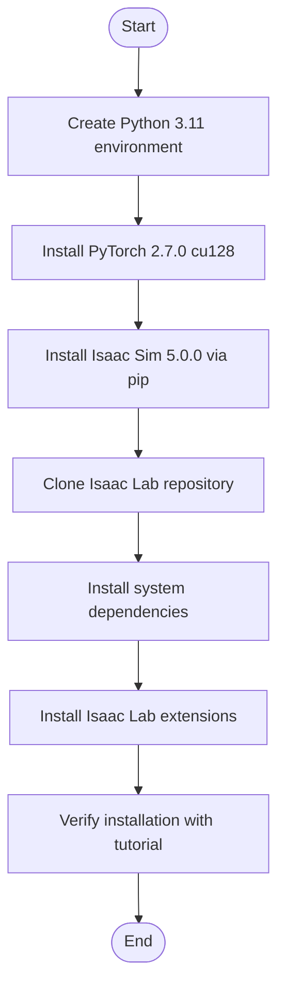
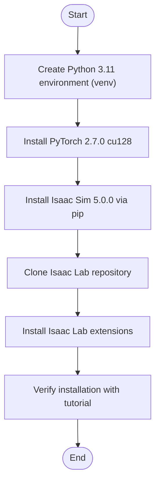

# Installation and Setup

<cite>
**Referenced Files in This Document**
- [README.md](file://README.md)
- [environment.yml](file://environment.yml)
- [isaaclab.sh](file://isaaclab.sh)
- [isaaclab.bat](file://isaaclab.bat)
- [pyproject.toml](file://pyproject.toml)
- [pip_installation.rst](file://docs/source/setup/installation/pip_installation.rst)
- [binaries_installation.rst](file://docs/source/setup/installation/binaries_installation.rst)
- [installation/index.rst](file://docs/source/setup/installation/index.rst)
- [troubleshooting.rst](file://docs/source/refs/troubleshooting.rst)
</cite>

## Update Summary
**Changes Made**
- Updated system requirements to reflect Isaac Lab 2.2.0 compatibility and Isaac Sim 5.0.0 requirement
- Modified installation procedures to align with the new version specifications
- Updated prerequisite software requirements to match the README specifications
- Revised troubleshooting guidance to address version-specific issues

## Table of Contents
1. [Introduction](#introduction)
2. [System Requirements](#system-requirements)
3. [Project Structure Overview](#project-structure-overview)
4. [Environment Configuration](#environment-configuration)
5. [Isaac Lab Setup](#isaac-lab-setup)
6. [Prerequisite Software Installation](#prerequisite-software-installation)
7. [Step-by-Step Installation Procedures](#step-by-step-installation-procedures)
8. [Verification and Validation](#verification-and-validation)
9. [Troubleshooting Guide](#troubleshooting-guide)
10. [Initial Usage Patterns](#initial-usage-patterns)
11. [Conclusion](#conclusion)

## Introduction
This document provides comprehensive installation and setup instructions for the Extreme Quadruped Parkour project. It covers system requirements, environment configuration, Isaac Lab setup, prerequisite software installation, project layout, troubleshooting, and verification steps to ensure a smooth first-time setup.

## System Requirements
- **Isaac Lab 2.2.0 compatibility** and a compatible Isaac Sim 5.0.0 installation
- Python 3.11 (as defined in the environment specification)
- GPU recommended for efficient training; the project supports up to 4096 environments and benefits from GPU acceleration
- Optional: set NVIDIA_NUCLEUS_DIR to resolve terrain material MDL path for optional visuals

**Updated** The system requirements now specify Isaac Lab 2.2.0 compatibility and require Isaac Sim 5.0.0 as the compatible simulator version.

**Section sources**
- [README.md:30-35](file://README.md#L30-L35)
- [README.md:36](file://README.md#L36)

## Project Structure Overview
The repository is organized into several key areas:
- apps/: Extension kits for Isaac Sim rendering modes and XR configurations
- assets/: Diagrams and video demonstrations organized by ablation levels
- docker/: Docker utilities, compose files, and cluster scripts
- docs/: Sphinx-based documentation with installation guides and troubleshooting
- scripts/: Demos, environments, imitation learning, reinforcement learning workflows, and tools
- source/: Core Python packages for Isaac Lab, assets, RL wrappers, and task implementations
- tools/: Project scaffolding, testing, and installation helpers

Key directories and roles:
- apps/: Contains extension kits for rendering and XR modes
- assets/: Media assets and demonstration videos
- docker/: Containerization utilities and cluster job scripts
- docs/: Installation guides, tutorials, and troubleshooting references
- scripts/: Ready-to-run examples and training scripts
- source/: Core libraries and task implementations for the quadruped parkour project
- tools/: Utilities for project generation and testing

**Section sources**
- [README.md:44-49](file://README.md#L44-L49)

## Environment Configuration
The project defines a Python 3.11 environment via environment.yml. The isaaclab shell/batch scripts automatically detect the appropriate Python version based on the installed Isaac Sim version and adjust the environment accordingly.

Key configuration points:
- environment.yml specifies Python 3.11 and importlib_metadata
- isaaclab.sh and isaaclab.bat scripts manage conda environment creation and activation
- Scripts detect Isaac Sim version and adjust Python version requirements (e.g., 3.10 for Isaac Sim 4.5, 3.11 for 5.x)

**Section sources**
- [environment.yml:6-12](file://environment.yml#L6-L12)
- [isaaclab.sh:218-232](file://isaaclab.sh#L218-L232)
- [isaaclab.bat:165-186](file://isaaclab.bat#L165-L186)

## Isaac Lab Setup
Isaac Lab can be installed using either:
- Pip installation of Isaac Sim 5.0.0 followed by source installation of Isaac Lab
- Binary installation of Isaac Sim 5.0.0 followed by source installation of Isaac Lab

Important notes:
- For pip installation, ensure GLIBC 2.34+ compatibility on Linux; otherwise use the binary installation approach
- The helper scripts provide utilities to install extensions and verify installations
- The setup now requires Isaac Sim 5.0.0 as the minimum compatible version

**Updated** The installation now requires Isaac Sim 5.0.0 as specified in the README documentation.

**Section sources**
- [pip_installation.rst:1-391](file://docs/source/setup/installation/pip_installation.rst#L1-L391)
- [binaries_installation.rst:1-200](file://docs/source/setup/installation/binaries_installation.rst#L1-L200)
- [installation/index.rst:1-52](file://docs/source/setup/installation/index.rst#L1-L52)

## Prerequisite Software Installation
Before installing Isaac Lab, ensure the following prerequisites are met:
- System dependencies (cmake, build-essential) for Linux
- Python 3.11 virtual environment (conda or venv)
- CUDA-enabled PyTorch 2.7.0 with cu128 support
- **Isaac Sim 5.0.0** installed via pip or binary (updated from previous requirements)

The helper scripts handle dependency installation and environment setup.

**Updated** The prerequisite now specifically requires Isaac Sim 5.0.0 as the compatible version.

**Section sources**
- [pip_installation.rst:244-293](file://docs/source/setup/installation/pip_installation.rst#L244-L293)
- [pip_installation.rst:98-110](file://docs/source/setup/installation/pip_installation.rst#L98-L110)
- [isaaclab.sh:25-44](file://isaaclab.sh#L25-L44)

## Step-by-Step Installation Procedures

### Linux Installation
1. Create and activate a Python 3.11 virtual environment using conda or venv
2. Upgrade pip and install CUDA-enabled PyTorch 2.7.0 with cu128 support
3. Install Isaac Sim 5.0.0 via pip with extras and extended cache support
4. Clone the Isaac Lab repository and navigate to the project root
5. Install system dependencies (cmake, build-essential)
6. Use the helper script to install Isaac Lab extensions and optionally specific RL frameworks
7. Verify the installation by running a basic tutorial script

**Updated** The installation procedure now requires Isaac Sim 5.0.0 as specified in the README.

**Diagram sources**
- [pip_installation.rst:40-110](file://docs/source/setup/installation/pip_installation.rst#L40-L110)
- [pip_installation.rst:244-293](file://docs/source/setup/installation/pip_installation.rst#L244-L293)
- [pip_installation.rst:295-333](file://docs/source/setup/installation/pip_installation.rst#L295-L333)

**Section sources**
- [pip_installation.rst:40-110](file://docs/source/setup/installation/pip_installation.rst#L40-L110)
- [pip_installation.rst:244-293](file://docs/source/setup/installation/pip_installation.rst#L244-L293)
- [pip_installation.rst:295-333](file://docs/source/setup/installation/pip_installation.rst#L295-L333)

### Windows Installation
1. Create and activate a Python 3.11 virtual environment using venv
2. Upgrade pip and install CUDA-enabled PyTorch 2.7.0 with cu128 support
3. Install Isaac Sim 5.0.0 via pip with extras and extended cache support
4. Clone the Isaac Lab repository and navigate to the project root
5. Use the helper batch script to install extensions and optionally specific RL frameworks
6. Verify the installation by running a basic tutorial script

**Updated** The Windows installation procedure now requires Isaac Sim 5.0.0 as specified in the README.

**Diagram sources**
- [pip_installation.rst:67-96](file://docs/source/setup/installation/pip_installation.rst#L67-L96)
- [pip_installation.rst:105-110](file://docs/source/setup/installation/pip_installation.rst#L105-L110)
- [pip_installation.rst:263-293](file://docs/source/setup/installation/pip_installation.rst#L263-L293)
- [pip_installation.rst:317-333](file://docs/source/setup/installation/pip_installation.rst#L317-L333)

**Section sources**
- [pip_installation.rst:67-96](file://docs/source/setup/installation/pip_installation.rst#L67-L96)
- [pip_installation.rst:105-110](file://docs/source/setup/installation/pip_installation.rst#L105-L110)
- [pip_installation.rst:263-293](file://docs/source/setup/installation/pip_installation.rst#L263-L293)
- [pip_installation.rst:317-333](file://docs/source/setup/installation/pip_installation.rst#L317-L333)

## Verification and Validation
After installation, verify the setup by:
- Running a basic tutorial script to confirm the simulator launches correctly
- Confirming that the environment variables and paths are set properly
- Testing with a small number of environments to validate GPU utilization

Recommended verification steps:
- Use the helper scripts to run a simple tutorial script
- Launch the simulator with headless mode for faster validation
- Check logs and performance metrics to ensure stability

**Section sources**
- [pip_installation.rst:295-333](file://docs/source/setup/installation/pip_installation.rst#L295-L333)
- [troubleshooting.rst:34-79](file://docs/source/refs/troubleshooting.rst#L34-L79)

## Troubleshooting Guide
Common issues and resolutions:
- Long startup times: Expected on first run due to shader compilation and asset loading
- CPU scaling governor: Set to performance mode for improved performance (with caution on laptops)
- PhysX buffer capacity: Increase gpu_found_lost_pairs_capacity if encountering physics simulation errors
- Driver compatibility: Ensure NVIDIA driver version meets requirements for your OS and GPU
- Memory leaks: Use weak references when registering callbacks to prevent memory leaks

Additional troubleshooting tips:
- Check simulator logs for detailed error information
- Adjust logging levels for more verbose diagnostics
- Reset user data if switching between Isaac Sim versions

**Section sources**
- [troubleshooting.rst:81-113](file://docs/source/refs/troubleshooting.rst#L81-L113)
- [troubleshooting.rst:125-154](file://docs/source/refs/troubleshooting.rst#L125-L154)
- [troubleshooting.rst:156-200](file://docs/source/refs/troubleshooting.rst#L156-L200)

## Initial Usage Patterns
Once the environment is configured:
- Train the quadruped parkour agent using the provided RL scripts
- Experiment with different ablation configurations (Abl 1, Abl 2.5, Abl 3.5, Abl 4.0, Abl 7.0)
- Use headless mode for faster training when rendering is not required
- Adjust environment counts and curriculum settings as needed

Example usage patterns:
- Train Abl 3.5 (recommended best-performing configuration) with 4096 environments
- Evaluate trained models using play scripts with specific runs and checkpoints
- Modify terrain parameters and curriculum settings for custom experiments

**Section sources**
- [README.md:120-172](file://README.md#L120-L172)

## Conclusion
With the provided installation and setup instructions, you should now have a fully functional environment for the Extreme Quadruped Parkour project. Ensure your system meets the requirements, configure the environment using the helper scripts, and verify the installation before proceeding with training and experimentation. The setup now requires Isaac Sim 5.0.0 and Isaac Lab 2.2.0 as specified in the README documentation. Refer to the troubleshooting section for resolving common issues and consult the documentation for advanced usage patterns.