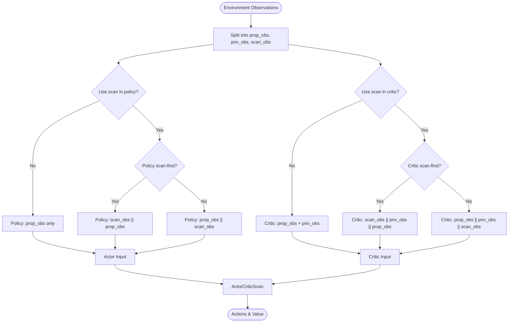
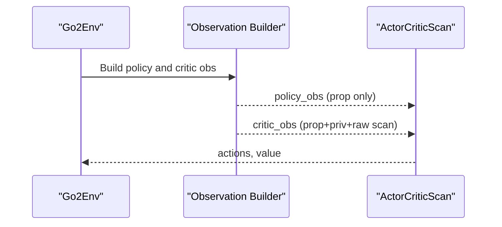
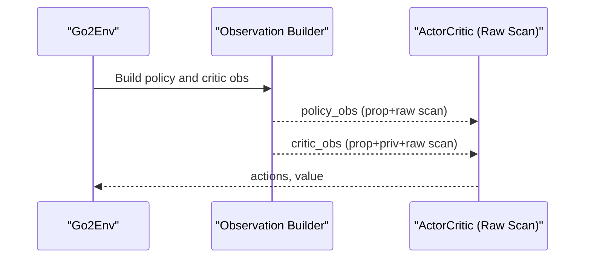
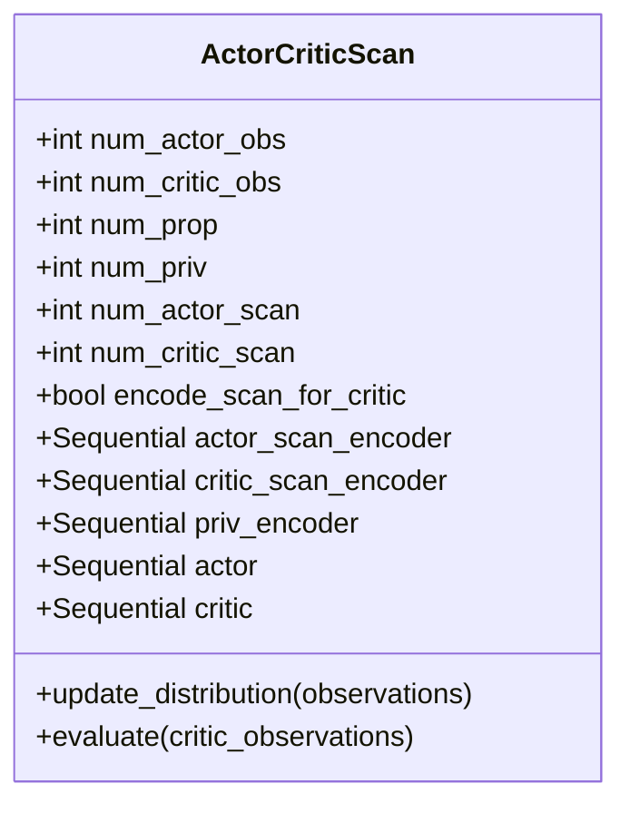
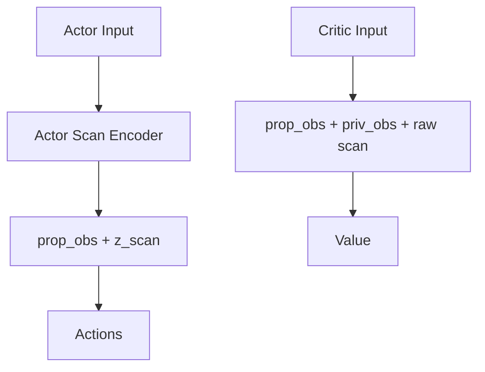
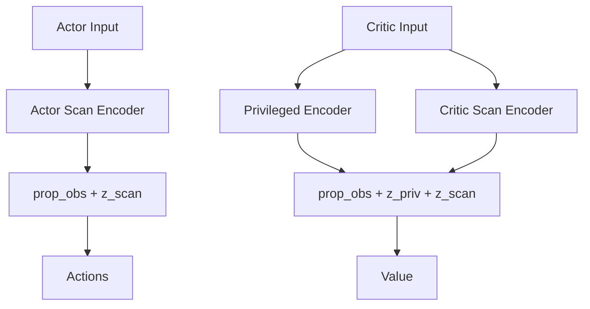
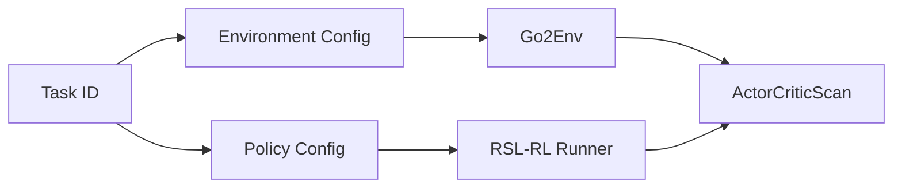

# Ablation Study Methodology

<cite>
**Referenced Files in This Document**
- [README.md](file://README.md)
- [__init__.py](file://source/isaaclab_tasks/isaaclab_tasks/direct/go2/__init__.py)
- [go2_env_cfg.py](file://source/isaaclab_tasks/isaaclab_tasks/direct/go2/go2_env_cfg.py)
- [go2_env.py](file://source/isaaclab_tasks/isaaclab_tasks/direct/go2/go2_env.py)
- [rsl_rl_ppo_cfg.py](file://source/isaaclab_tasks/isaaclab_tasks/direct/go2/agents/rsl_rl_ppo_cfg.py)
- [actor_critic_scan.py](file://source/isaaclab_tasks/isaaclab_tasks/direct/go2/agents/actor_critic_scan.py)
</cite>

## Table of Contents
1. [Introduction](#introduction)
2. [Project Structure](#project-structure)
3. [Core Components](#core-components)
4. [Architecture Overview](#architecture-overview)
5. [Detailed Component Analysis](#detailed-component-analysis)
6. [Dependency Analysis](#dependency-analysis)
7. [Performance Considerations](#performance-considerations)
8. [Troubleshooting Guide](#troubleshooting-guide)
9. [Conclusion](#conclusion)

## Introduction
This document details the methodology for the five-network ablation study applied to a quadrupedal parkour locomotion task. It explains the distinct network architectures (Abl 1.0, 2.5, 3.5, 4.0, 7.0), their sensor fusion strategies, and how each variant modifies the actor and critic networks. It also documents the experimental setup, terrain composition, training configuration, and evaluation metrics, and provides the rationale behind each architectural choice with respect to stability, performance, and learning efficiency.

## Project Structure
The ablation study is implemented within a unified task framework that registers five Gym environments and associates them with distinct environment and policy configurations. The environment provides proprioceptive observations, privileged observations, and height scanner data. The policy configuration controls whether the scan is used in the actor, critic, and whether it is encoded via dedicated encoders.

```mermaid
graph TB
subgraph "Task Registration"
REG[__init__.py]
end
subgraph "Environment Configurations"
CFG_ROUGH[go2_env_cfg.py]
CFG_ABL1[Go2RoughAbl1EnvCfg]
CFG_ABL25[Go2RoughAbl2_5EnvCfg]
CFG_ABL35[Go2RoughEnvCfg (shared)]
CFG_ABL40[Go2RoughEnvCfg (shared)]
CFG_ABL70[Go2RoughEnvCfg (shared)]
end
subgraph "Environment Runtime"
ENV[go2_env.py]
SENS[Height Scanner RayCaster]
OBS[Observation Builder]
end
subgraph "Policy Configurations"
POLY_CFG[rsl_rl_ppo_cfg.py]
POLY_ABL1[Go2RoughAbl1PPORunnerCfg]
POLY_ABL25[Go2RoughAbl2_5PPORunnerCfg]
POLY_ABL35[Go2RoughAbl3_5PPORunnerCfg]
POLY_ABL40[Go2RoughAbl4_0PPORunnerCfg]
POLY_ABL70[Go2RoughAbl7_0PPORunnerCfg]
end
subgraph "Network Implementation"
NET_IMPL[actor_critic_scan.py]
ACTOR[Actor MLP]
CRITIC[Critic MLP]
ENC_SCAN_ACT[Actor Scan Encoder]
ENC_SCAN_CRIT[Critic Scan Encoder]
ENC_PRIV[Privileged Encoder]
end
REG --> CFG_ROUGH
CFG_ROUGH --> ENV
ENV --> SENS
ENV --> OBS
POLY_CFG --> POLY_ABL1
POLY_CFG --> POLY_ABL25
POLY_CFG --> POLY_ABL35
POLY_CFG --> POLY_ABL40
POLY_CFG --> POLY_ABL70
OBS --> NET_IMPL
NET_IMPL --> ACTOR
NET_IMPL --> CRITIC
NET_IMPL --> ENC_SCAN_ACT
NET_IMPL --> ENC_SCAN_CRIT
NET_IMPL --> ENC_PRIV
```

**Diagram sources**
- [__init__.py:49-97](file://source/isaaclab_tasks/isaaclab_tasks/direct/go2/__init__.py#L49-L97)
- [go2_env_cfg.py:172-353](file://source/isaaclab_tasks/isaaclab_tasks/direct/go2/go2_env_cfg.py#L172-L353)
- [go2_env.py:293-355](file://source/isaaclab_tasks/isaaclab_tasks/direct/go2/go2_env.py#L293-L355)
- [rsl_rl_ppo_cfg.py:114-154](file://source/isaaclab_tasks/isaaclab_tasks/direct/go2/agents/rsl_rl_ppo_cfg.py#L114-L154)
- [actor_critic_scan.py:13-262](file://source/isaaclab_tasks/isaaclab_tasks/direct/go2/agents/actor_critic_scan.py#L13-L262)

**Section sources**
- [README.md:5-17](file://README.md#L5-L17)
- [__init__.py:49-97](file://source/isaaclab_tasks/isaaclab_tasks/direct/go2/__init__.py#L49-L97)
- [go2_env_cfg.py:172-353](file://source/isaaclab_tasks/isaaclab_tasks/direct/go2/go2_env_cfg.py#L172-L353)
- [go2_env.py:293-355](file://source/isaaclab_tasks/isaaclab_tasks/direct/go2/go2_env.py#L293-L355)
- [rsl_rl_ppo_cfg.py:114-154](file://source/isaaclab_tasks/isaaclab_tasks/direct/go2/agents/rsl_rl_ppo_cfg.py#L114-L154)
- [actor_critic_scan.py:13-262](file://source/isaaclab_tasks/isaaclab_tasks/direct/go2/agents/actor_critic_scan.py#L13-L262)

## Core Components
- Task IDs and Ablation Mapping: Five Gym tasks are registered, each corresponding to a specific ablation variant. The mapping between task ID and sensor fusion strategy is documented in the repository’s README.
- Environment Configurations: The rough terrain environment defines the number of observations and whether scan data is used in the policy and critic. Dedicated ablation configurations override these flags.
- Policy Configurations: The policy configuration controls whether scan and privileged observations are encoded and whether the critic encodes scan data separately.
- Observation Pipeline: The environment constructs observations combining proprioceptive signals, privileged observations, and height scanner data, with optional scan-first ordering.
- Network Implementation: The ActorCriticScan module implements the actor and critic MLPs, optional scan encoders for actor and/or critic, and a privileged encoder for the critic.

**Section sources**
- [README.md:5-17](file://README.md#L5-L17)
- [go2_env_cfg.py:172-353](file://source/isaaclab_tasks/isaaclab_tasks/direct/go2/go2_env_cfg.py#L172-L353)
- [rsl_rl_ppo_cfg.py:114-154](file://source/isaaclab_tasks/isaaclab_tasks/direct/go2/agents/rsl_rl_ppo_cfg.py#L114-L154)
- [go2_env.py:293-355](file://source/isaaclab_tasks/isaaclab_tasks/direct/go2/go2_env.py#L293-L355)
- [actor_critic_scan.py:13-262](file://source/isaaclab_tasks/isaaclab_tasks/direct/go2/agents/actor_critic_scan.py#L13-L262)

## Architecture Overview
The ablation variants differ in how sensor data is fused:
- Proprioceptive observations (prop_obs): Always present in both actor and critic inputs.
- Privileged observations (priv_obs): Present only in critic inputs for all variants except Abl 2.5.
- Height scanner data (scan_obs): Used differently across ablations—either raw or encoded, and either in actor only, both actor and critic, or only in critic.



**Diagram sources**
- [go2_env.py:293-355](file://source/isaaclab_tasks/isaaclab_tasks/direct/go2/go2_env.py#L293-L355)
- [go2_env_cfg.py:334-353](file://source/isaaclab_tasks/isaaclab_tasks/direct/go2/go2_env_cfg.py#L334-L353)
- [rsl_rl_ppo_cfg.py:114-154](file://source/isaaclab_tasks/isaaclab_tasks/direct/go2/agents/rsl_rl_ppo_cfg.py#L114-L154)
- [actor_critic_scan.py:13-262](file://source/isaaclab_tasks/isaaclab_tasks/direct/go2/agents/actor_critic_scan.py#L13-L262)

## Detailed Component Analysis

### Ablation 1.0
- Sensor fusion strategy:
  - Actor: prop_obs only
  - Critic: prop_obs + priv_obs + raw scan
- Network modifications:
  - Policy configuration sets actor scan observations to zero.
  - Critic scan remains raw and concatenated after privileged observations.
- Rationale:
  - Validates the necessity of proprioceptive-only control versus adding scan data to the actor.
  - Critic benefits from privileged observations plus raw scan to improve value estimation.



**Diagram sources**
- [go2_env.py:293-355](file://source/isaaclab_tasks/isaaclab_tasks/direct/go2/go2_env.py#L293-L355)
- [go2_env_cfg.py:334-341](file://source/isaaclab_tasks/isaaclab_tasks/direct/go2/go2_env_cfg.py#L334-L341)
- [rsl_rl_ppo_cfg.py:115-118](file://source/isaaclab_tasks/isaaclab_tasks/direct/go2/agents/rsl_rl_ppo_cfg.py#L115-L118)

**Section sources**
- [README.md:13](file://README.md#L13)
- [go2_env_cfg.py:334-341](file://source/isaaclab_tasks/isaaclab_tasks/direct/go2/go2_env_cfg.py#L334-L341)
- [rsl_rl_ppo_cfg.py:115-118](file://source/isaaclab_tasks/isaaclab_tasks/direct/go2/agents/rsl_rl_ppo_cfg.py#L115-L118)

### Ablation 2.5
- Sensor fusion strategy:
  - Actor: prop_obs + raw scan
  - Critic: prop_obs + priv_obs + raw scan
- Network modifications:
  - Policy configuration uses the base ActorCritic class (no scan encoder).
  - Both actor and critic receive raw scan data.
- Rationale:
  - Tests a scan-first pipeline for both actor and critic with raw scan inputs.
  - Highlights potential challenges with high-dimensional raw scan data.



**Diagram sources**
- [go2_env.py:293-355](file://source/isaaclab_tasks/isaaclab_tasks/direct/go2/go2_env.py#L293-L355)
- [rsl_rl_ppo_cfg.py:121-131](file://source/isaaclab_tasks/isaaclab_tasks/direct/go2/agents/rsl_rl_ppo_cfg.py#L121-L131)

**Section sources**
- [README.md:14](file://README.md#L14)
- [rsl_rl_ppo_cfg.py:121-131](file://source/isaaclab_tasks/isaaclab_tasks/direct/go2/agents/rsl_rl_ppo_cfg.py#L121-L131)

### Ablation 3.5
- Sensor fusion strategy:
  - Actor: prop_obs + scan encoding
  - Critic: prop_obs + priv_obs + scan encoding
- Network modifications:
  - Uses ActorCriticScan with shared scan encoder dims for both actor and critic.
- Rationale:
  - Best-performing variant according to the README; balances scan utilization with stable value estimation.



**Diagram sources**
- [actor_critic_scan.py:13-262](file://source/isaaclab_tasks/isaaclab_tasks/direct/go2/agents/actor_critic_scan.py#L13-L262)

**Section sources**
- [README.md:16](file://README.md#L16)
- [rsl_rl_ppo_cfg.py:133-137](file://source/isaaclab_tasks/isaaclab_tasks/direct/go2/agents/rsl_rl_ppo_cfg.py#L133-L137)
- [actor_critic_scan.py:13-262](file://source/isaaclab_tasks/isaaclab_tasks/direct/go2/agents/actor_critic_scan.py#L13-L262)

### Ablation 4.0
- Sensor fusion strategy:
  - Actor: prop_obs + scan encoding
  - Critic: prop_obs + priv_obs + raw scan
- Network modifications:
  - Uses shared scan encoder dims for actor.
  - Disables scan encoding for the critic (raw scan input).
- Rationale:
  - Investigates the impact of raw scan in the critic; README indicates degradation due to noisy value estimation.



**Diagram sources**
- [rsl_rl_ppo_cfg.py:139-146](file://source/isaaclab_tasks/isaaclab_tasks/direct/go2/agents/rsl_rl_ppo_cfg.py#L139-L146)
- [actor_critic_scan.py:71-86](file://source/isaaclab_tasks/isaaclab_tasks/direct/go2/agents/actor_critic_scan.py#L71-L86)

**Section sources**
- [README.md:15](file://README.md#L15)
- [rsl_rl_ppo_cfg.py:139-146](file://source/isaaclab_tasks/isaaclab_tasks/direct/go2/agents/rsl_rl_ppo_cfg.py#L139-L146)
- [actor_critic_scan.py:71-86](file://source/isaaclab_tasks/isaaclab_tasks/direct/go2/agents/actor_critic_scan.py#L71-L86)

### Ablation 7.0
- Sensor fusion strategy:
  - Actor: prop_obs + scan encoding
  - Critic: prop_obs + priv_obs encoding + scan encoding
- Network modifications:
  - Uses shared scan encoder dims for actor.
  - Adds a privileged encoder for the critic.
- Rationale:
  - Investigates the effect of encoding privileged observations; README indicates degradation due to constant features overfitting.



**Diagram sources**
- [rsl_rl_ppo_cfg.py:148-154](file://source/isaaclab_tasks/isaaclab_tasks/direct/go2/agents/rsl_rl_ppo_cfg.py#L148-L154)
- [actor_critic_scan.py:88-98](file://source/isaaclab_tasks/isaaclab_tasks/direct/go2/agents/actor_critic_scan.py#L88-L98)

**Section sources**
- [README.md:17](file://README.md#L17)
- [rsl_rl_ppo_cfg.py:148-154](file://source/isaaclab_tasks/isaaclab_tasks/direct/go2/agents/rsl_rl_ppo_cfg.py#L148-L154)
- [actor_critic_scan.py:88-98](file://source/isaaclab_tasks/isaaclab_tasks/direct/go2/agents/actor_critic_scan.py#L88-L98)

## Dependency Analysis
The ablation study relies on a clear separation between environment configuration, policy configuration, and network implementation:
- Task registration maps Gym IDs to environment and policy configurations.
- Environment configuration toggles scan usage and ordering for actor and critic.
- Policy configuration controls encoder dimensions and whether the critic encodes scan data.
- Network implementation encapsulates the MLPs and encoders, exposing a clean interface to the runner.



**Diagram sources**
- [__init__.py:49-97](file://source/isaaclab_tasks/isaaclab_tasks/direct/go2/__init__.py#L49-L97)
- [go2_env_cfg.py:172-353](file://source/isaaclab_tasks/isaaclab_tasks/direct/go2/go2_env_cfg.py#L172-L353)
- [rsl_rl_ppo_cfg.py:114-154](file://source/isaaclab_tasks/isaaclab_tasks/direct/go2/agents/rsl_rl_ppo_cfg.py#L114-L154)
- [actor_critic_scan.py:13-262](file://source/isaaclab_tasks/isaaclab_tasks/direct/go2/agents/actor_critic_scan.py#L13-L262)

**Section sources**
- [__init__.py:49-97](file://source/isaaclab_tasks/isaaclab_tasks/direct/go2/__init__.py#L49-L97)
- [go2_env_cfg.py:172-353](file://source/isaaclab_tasks/isaaclab_tasks/direct/go2/go2_env_cfg.py#L172-L353)
- [rsl_rl_ppo_cfg.py:114-154](file://source/isaaclab_tasks/isaaclab_tasks/direct/go2/agents/rsl_rl_ppo_cfg.py#L114-L154)
- [actor_critic_scan.py:13-262](file://source/isaaclab_tasks/isaaclab_tasks/direct/go2/agents/actor_critic_scan.py#L13-L262)

## Performance Considerations
- Scan dimensionality: Using raw scan in the actor (Abl 2.5) increases input dimensionality and may challenge feature extraction.
- Critic scan encoding: Not encoding scan in the critic (Abl 4.0) introduces noise into value estimation.
- Privileged encoding: Encoding privileged observations in the critic (Abl 7.0) risks overfitting to constant features.
- Stability: Abl 3.5 achieves the best mean reward and velocity tracking on the hardest terrains, indicating a balanced fusion strategy.

[No sources needed since this section provides general guidance]

## Troubleshooting Guide
- Observation dimension mismatches: Verify that num_prop_obs, num_priv_obs, and num_scan_obs align with environment configuration and policy configuration.
- Scan-first ordering: Confirm scan_first_in_policy and scan_first_in_critic flags match intended fusion order.
- Encoder dimensions: Ensure scan_encoder_dims and priv_encoder_dims are consistent with network expectations.
- Environment resets and curriculum: Validate that terrain levels and types are sampled appropriately during resets.

**Section sources**
- [go2_env_cfg.py:57-85](file://source/isaaclab_tasks/isaaclab_tasks/direct/go2/go2_env_cfg.py#L57-L85)
- [go2_env.py:473-535](file://source/isaaclab_tasks/isaaclab_tasks/direct/go2/go2_env.py#L473-L535)

## Conclusion
The ablation study systematically evaluates five network architectures and their sensor fusion strategies. Abl 3.5 emerges as the best performer by balancing scan encoding for both actor and critic while retaining privileged observations in the critic. Abl 2.5 struggles with raw scan dimensionality, Abl 4.0 degrades due to raw scan in the critic, and Abl 7.0 degrades due to privileged observation encoding. The experimental setup and evaluation metrics confirm the importance of careful sensor fusion design for stability and learning efficiency in challenging parkour terrains.

[No sources needed since this section summarizes without analyzing specific files]