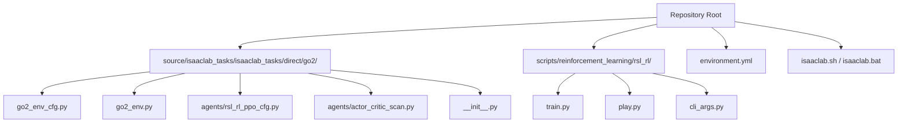
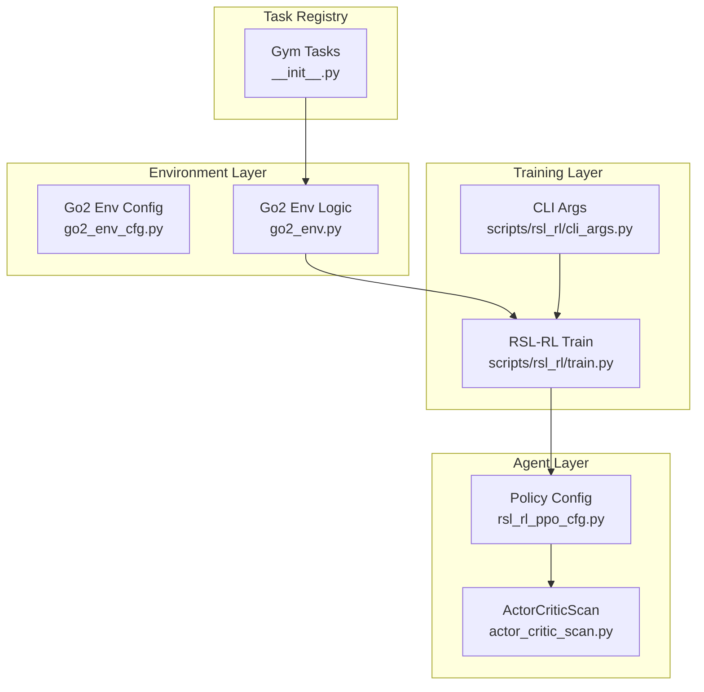
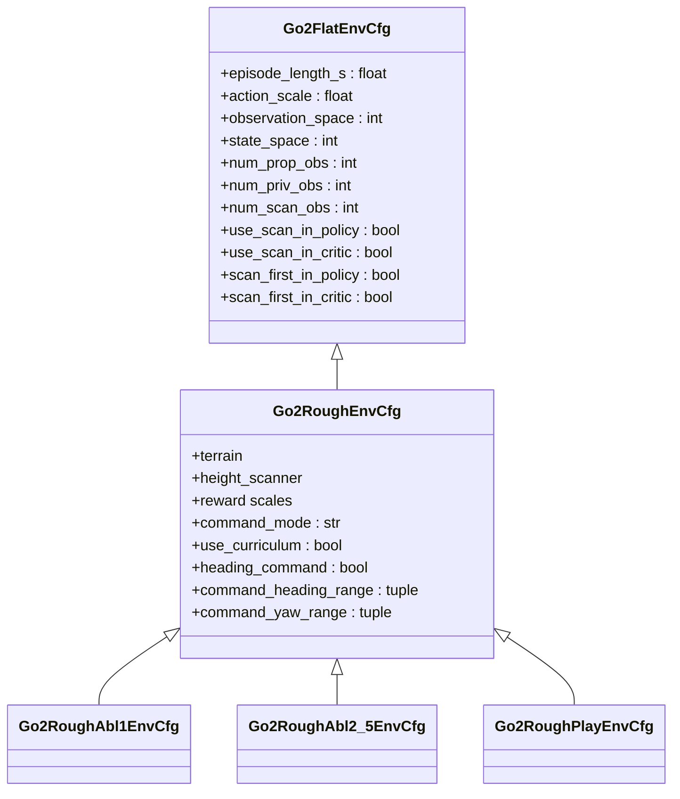
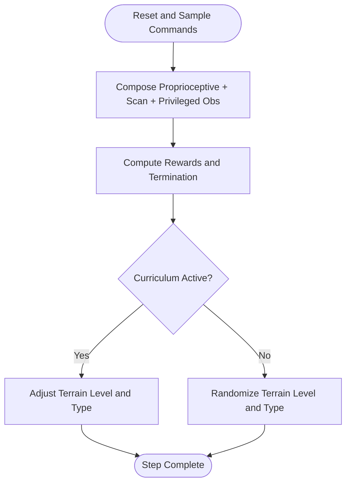
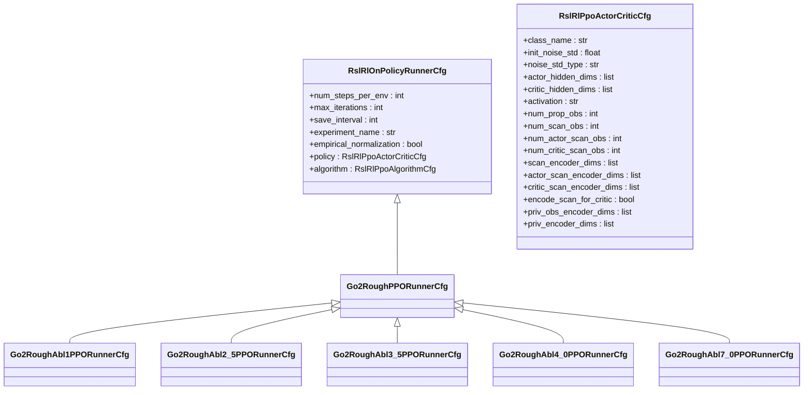
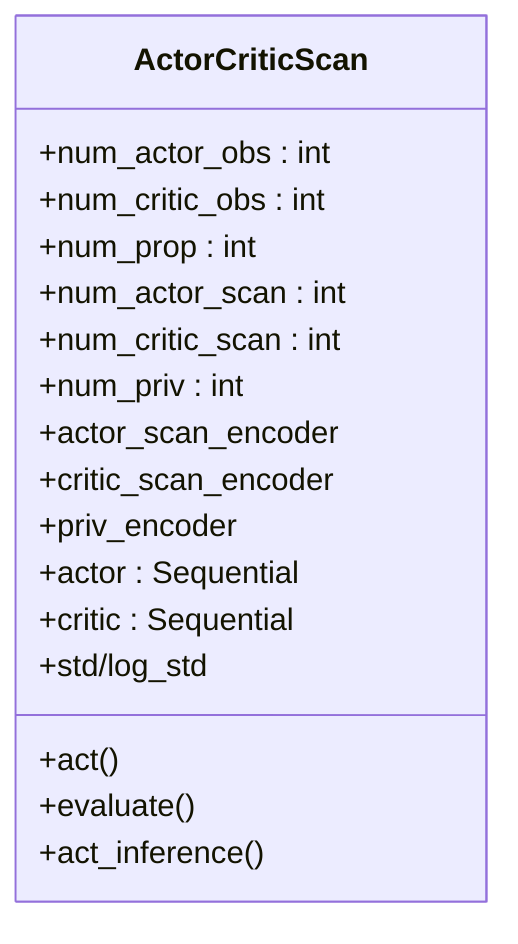
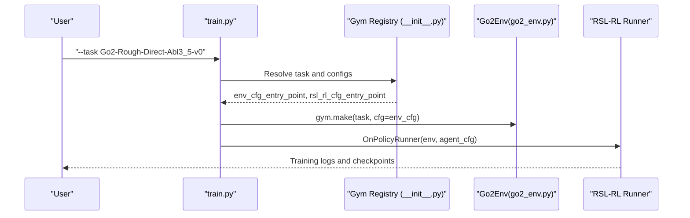
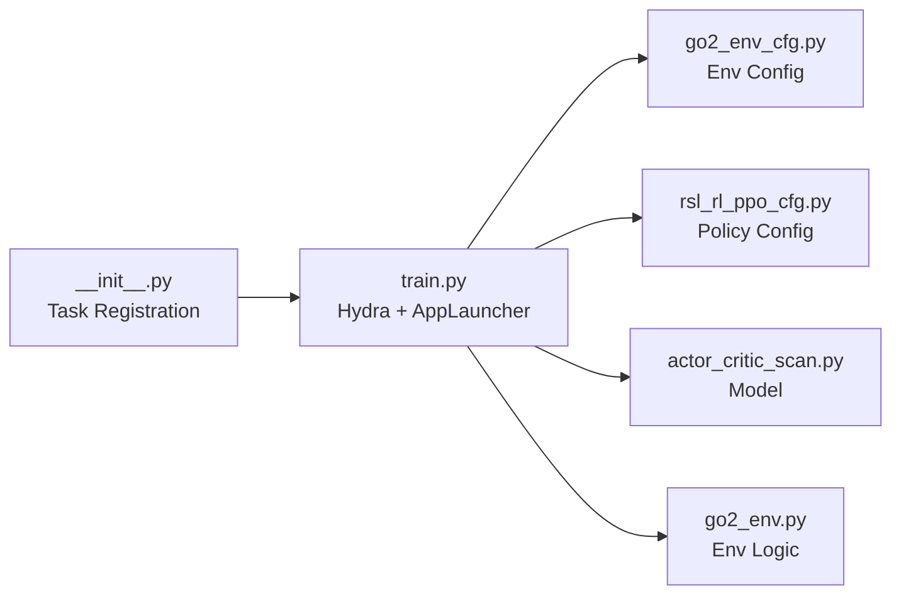
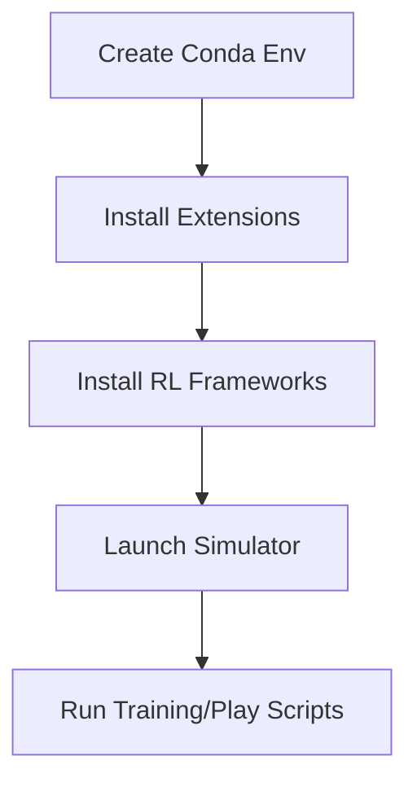
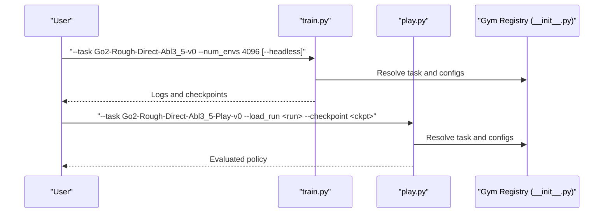

# Getting Started Guide

<cite>
**Referenced Files in This Document**
- [README.md](file://README.md)
- [environment.yml](file://environment.yml)
- [isaaclab.sh](file://isaaclab.sh)
- [isaaclab.bat](file://isaaclab.bat)
- [source/isaaclab_tasks/isaaclab_tasks/direct/go2/go2_env_cfg.py](file://source/isaaclab_tasks/isaaclab_tasks/direct/go2/go2_env_cfg.py)
- [source/isaaclab_tasks/isaaclab_tasks/direct/go2/go2_env.py](file://source/isaaclab_tasks/isaaclab_tasks/direct/go2/go2_env.py)
- [source/isaaclab_tasks/isaaclab_tasks/direct/go2/agents/rsl_rl_ppo_cfg.py](file://source/isaaclab_tasks/isaaclab_tasks/direct/go2/agents/rsl_rl_ppo_cfg.py)
- [source/isaaclab_tasks/isaaclab_tasks/direct/go2/agents/actor_critic_scan.py](file://source/isaaclab_tasks/isaaclab_tasks/direct/go2/agents/actor_critic_scan.py)
- [source/isaaclab_tasks/isaaclab_tasks/direct/go2/__init__.py](file://source/isaaclab_tasks/isaaclab_tasks/direct/go2/__init__.py)
- [scripts/reinforcement_learning/rsl_rl/train.py](file://scripts/reinforcement_learning/rsl_rl/train.py)
- [scripts/reinforcement_learning/rsl_rl/play.py](file://scripts/reinforcement_learning/rsl_rl/play.py)
- [scripts/reinforcement_learning/rsl_rl/cli_args.py](file://scripts/reinforcement_learning/rsl_rl/cli_args.py)
</cite>

## Table of Contents
1. [Introduction](#introduction)
2. [Project Structure](#project-structure)
3. [Core Components](#core-components)
4. [Architecture Overview](#architecture-overview)
5. [Detailed Component Analysis](#detailed-component-analysis)
6. [Dependency Analysis](#dependency-analysis)
7. [Performance Considerations](#performance-considerations)
8. [Troubleshooting Guide](#troubleshooting-guide)
9. [Conclusion](#conclusion)
10. [Appendices](#appendices)

## Introduction
This guide helps you install and run the extreme quadruped parkour project with Isaac Lab 2.2.0 and a compatible Isaac Sim. It covers environment setup with Python 3.11, project layout, task IDs and ablation configurations, running training and evaluation scripts, and headless versus visual modes. Recommendations for hardware and optimization tips are included, along with troubleshooting guidance.

## Project Structure
The repository organizes the Go2 parkour environment, training configurations, and scripts under a clear hierarchy:
- Environment and task definitions live under the Go2 task package.
- Training and evaluation scripts are located under scripts/reinforcement_learning/rsl_rl.
- A shared shell/batch launcher manages environment creation, installation, and execution.

**Diagram sources**
- [source/isaaclab_tasks/isaaclab_tasks/direct/go2/go2_env_cfg.py:1-353](file://source/isaaclab_tasks/isaaclab_tasks/direct/go2/go2_env_cfg.py#L1-L353)
- [source/isaaclab_tasks/isaaclab_tasks/direct/go2/go2_env.py:1-635](file://source/isaaclab_tasks/isaaclab_tasks/direct/go2/go2_env.py#L1-L635)
- [source/isaaclab_tasks/isaaclab_tasks/direct/go2/agents/rsl_rl_ppo_cfg.py:1-155](file://source/isaaclab_tasks/isaaclab_tasks/direct/go2/agents/rsl_rl_ppo_cfg.py#L1-L155)
- [source/isaaclab_tasks/isaaclab_tasks/direct/go2/agents/actor_critic_scan.py:1-262](file://source/isaaclab_tasks/isaaclab_tasks/direct/go2/agents/actor_critic_scan.py#L1-L262)
- [source/isaaclab_tasks/isaaclab_tasks/direct/go2/__init__.py:1-148](file://source/isaaclab_tasks/isaaclab_tasks/direct/go2/__init__.py#L1-L148)
- [scripts/reinforcement_learning/rsl_rl/train.py:1-220](file://scripts/reinforcement_learning/rsl_rl/train.py#L1-L220)
- [scripts/reinforcement_learning/rsl_rl/play.py:1-206](file://scripts/reinforcement_learning/rsl_rl/play.py#L1-L206)
- [scripts/reinforcement_learning/rsl_rl/cli_args.py:1-92](file://scripts/reinforcement_learning/rsl_rl/cli_args.py#L1-L92)

**Section sources**
- [README.md:45-51](file://README.md#L45-L51)

## Core Components
- Environment configuration and ablation toggles: go2_env_cfg.py defines flat and rough terrain environments, reward scales, curriculum, and ablation-specific flags for scan usage and ordering.
- Environment logic and observations: go2_env.py implements the RL environment, sensor fusion (contact and raycast height scanner), reward computation, and curriculum logic.
- Agent policy and training: rsl_rl_ppo_cfg.py defines PPO runner configurations and ablation-specific policy setups, including scan encoders and privileged observation encoders.
- Actor-critic model: actor_critic_scan.py implements the neural network with optional scan and privileged observation encoders for actor and critic.
- Task registration: __init__.py registers Gym tasks, including ablation variants and play modes.

Key files and responsibilities:
- go2_env_cfg.py: Environment configuration, terrain generator, reward scales, curriculum, and ablation flags.
- go2_env.py: Observation composition, reward computation, curriculum progression, and environment resets.
- rsl_rl_ppo_cfg.py: Runner and policy configurations for each ablation.
- actor_critic_scan.py: Neural network architecture with optional encoders.
- __init__.py: Gym task registration for training and play tasks.

**Section sources**
- [source/isaaclab_tasks/isaaclab_tasks/direct/go2/go2_env_cfg.py:34-353](file://source/isaaclab_tasks/isaaclab_tasks/direct/go2/go2_env_cfg.py#L34-L353)
- [source/isaaclab_tasks/isaaclab_tasks/direct/go2/go2_env.py:20-635](file://source/isaaclab_tasks/isaaclab_tasks/direct/go2/go2_env.py#L20-L635)
- [source/isaaclab_tasks/isaaclab_tasks/direct/go2/agents/rsl_rl_ppo_cfg.py:44-155](file://source/isaaclab_tasks/isaaclab_tasks/direct/go2/agents/rsl_rl_ppo_cfg.py#L44-L155)
- [source/isaaclab_tasks/isaaclab_tasks/direct/go2/agents/actor_critic_scan.py:13-262](file://source/isaaclab_tasks/isaaclab_tasks/direct/go2/agents/actor_critic_scan.py#L13-L262)
- [source/isaaclab_tasks/isaaclab_tasks/direct/go2/__init__.py:18-148](file://source/isaaclab_tasks/isaaclab_tasks/direct/go2/__init__.py#L18-L148)

## Architecture Overview
The system integrates environment configuration, environment logic, policy configuration, and training/inference scripts. The training pipeline uses RSL-RL with a custom actor-critic class that supports optional scan and privileged observation encoders.

**Diagram sources**
- [source/isaaclab_tasks/isaaclab_tasks/direct/go2/go2_env_cfg.py:34-353](file://source/isaaclab_tasks/isaaclab_tasks/direct/go2/go2_env_cfg.py#L34-L353)
- [source/isaaclab_tasks/isaaclab_tasks/direct/go2/go2_env.py:20-635](file://source/isaaclab_tasks/isaaclab_tasks/direct/go2/go2_env.py#L20-L635)
- [source/isaaclab_tasks/isaaclab_tasks/direct/go2/agents/rsl_rl_ppo_cfg.py:44-155](file://source/isaaclab_tasks/isaaclab_tasks/direct/go2/agents/rsl_rl_ppo_cfg.py#L44-L155)
- [source/isaaclab_tasks/isaaclab_tasks/direct/go2/agents/actor_critic_scan.py:13-262](file://source/isaaclab_tasks/isaaclab_tasks/direct/go2/agents/actor_critic_scan.py#L13-L262)
- [source/isaaclab_tasks/isaaclab_tasks/direct/go2/__init__.py:18-148](file://source/isaaclab_tasks/isaaclab_tasks/direct/go2/__init__.py#L18-L148)
- [scripts/reinforcement_learning/rsl_rl/train.py:119-220](file://scripts/reinforcement_learning/rsl_rl/train.py#L119-L220)
- [scripts/reinforcement_learning/rsl_rl/cli_args.py:16-92](file://scripts/reinforcement_learning/rsl_rl/cli_args.py#L16-L92)

## Detailed Component Analysis

### Environment Configuration and Ablations
- Flat and rough environments define observation sizes, reward scales, and curriculum behavior.
- Ablation configurations toggle whether scan is used in the policy, critic, or both, and whether scan is processed through an encoder.
- Play configurations disable curriculum and fix commands for evaluation.

**Diagram sources**
- [source/isaaclab_tasks/isaaclab_tasks/direct/go2/go2_env_cfg.py:71-353](file://source/isaaclab_tasks/isaaclab_tasks/direct/go2/go2_env_cfg.py#L71-L353)

**Section sources**
- [source/isaaclab_tasks/isaaclab_tasks/direct/go2/go2_env_cfg.py:71-353](file://source/isaaclab_tasks/isaaclab_tasks/direct/go2/go2_env_cfg.py#L71-L353)

### Environment Observations and Rewards
- Observations combine proprioceptive signals and optional scan data, with configurable ordering.
- Rewards emphasize velocity tracking, orientation, work regularization, and terrain-adapted penalties.
- Curriculum adjusts terrain difficulty based on achieved distance and command speed.

**Diagram sources**
- [source/isaaclab_tasks/isaaclab_tasks/direct/go2/go2_env.py:293-635](file://source/isaaclab_tasks/isaaclab_tasks/direct/go2/go2_env.py#L293-L635)

**Section sources**
- [source/isaaclab_tasks/isaaclab_tasks/direct/go2/go2_env.py:293-635](file://source/isaaclab_tasks/isaaclab_tasks/direct/go2/go2_env.py#L293-L635)

### Policy Configuration and Ablations
- Runner configurations define training iterations, learning rates, and normalization.
- Ablation-specific policies configure scan encoders and privileged observation encoders differently across ablations.

**Diagram sources**
- [source/isaaclab_tasks/isaaclab_tasks/direct/go2/agents/rsl_rl_ppo_cfg.py:44-155](file://source/isaaclab_tasks/isaaclab_tasks/direct/go2/agents/rsl_rl_ppo_cfg.py#L44-L155)

**Section sources**
- [source/isaaclab_tasks/isaaclab_tasks/direct/go2/agents/rsl_rl_ppo_cfg.py:44-155](file://source/isaaclab_tasks/isaaclab_tasks/direct/go2/agents/rsl_rl_ppo_cfg.py#L44-L155)

### Actor-Critic Model with Encoders
- The model optionally encodes scan and privileged observations before actor and critic heads.
- Supports scalar or log-parameterized action noise.

**Diagram sources**
- [source/isaaclab_tasks/isaaclab_tasks/direct/go2/agents/actor_critic_scan.py:13-262](file://source/isaaclab_tasks/isaaclab_tasks/direct/go2/agents/actor_critic_scan.py#L13-L262)

**Section sources**
- [source/isaaclab_tasks/isaaclab_tasks/direct/go2/agents/actor_critic_scan.py:13-262](file://source/isaaclab_tasks/isaaclab_tasks/direct/go2/agents/actor_critic_scan.py#L13-L262)

### Task Registration and Selection
- Gym tasks are registered for training and play modes, including ablation variants.
- Task IDs include Abl 1, Abl 2.5, Abl 3.5, Abl 4.0, and Abl 7.0.

**Diagram sources**
- [source/isaaclab_tasks/isaaclab_tasks/direct/go2/__init__.py:18-148](file://source/isaaclab_tasks/isaaclab_tasks/direct/go2/__init__.py#L18-L148)
- [scripts/reinforcement_learning/rsl_rl/train.py:119-220](file://scripts/reinforcement_learning/rsl_rl/train.py#L119-L220)
- [source/isaaclab_tasks/isaaclab_tasks/direct/go2/go2_env.py:20-635](file://source/isaaclab_tasks/isaaclab_tasks/direct/go2/go2_env.py#L20-L635)

**Section sources**
- [source/isaaclab_tasks/isaaclab_tasks/direct/go2/__init__.py:18-148](file://source/isaaclab_tasks/isaaclab_tasks/direct/go2/__init__.py#L18-L148)
- [README.md:5-11](file://README.md#L5-L11)

## Dependency Analysis
- Training depends on Gym tasks registered in __init__.py, which point to environment and policy configurations.
- The training script loads configurations via hydra and wraps the environment for RSL-RL.
- CLI arguments extend RSL-RL options and AppLauncher options.

**Diagram sources**
- [source/isaaclab_tasks/isaaclab_tasks/direct/go2/__init__.py:18-148](file://source/isaaclab_tasks/isaaclab_tasks/direct/go2/__init__.py#L18-L148)
- [scripts/reinforcement_learning/rsl_rl/train.py:119-220](file://scripts/reinforcement_learning/rsl_rl/train.py#L119-L220)
- [source/isaaclab_tasks/isaaclab_tasks/direct/go2/go2_env_cfg.py:34-353](file://source/isaaclab_tasks/isaaclab_tasks/direct/go2/go2_env_cfg.py#L34-L353)
- [source/isaaclab_tasks/isaaclab_tasks/direct/go2/agents/rsl_rl_ppo_cfg.py:44-155](file://source/isaaclab_tasks/isaaclab_tasks/direct/go2/agents/rsl_rl_ppo_cfg.py#L44-L155)
- [source/isaaclab_tasks/isaaclab_tasks/direct/go2/agents/actor_critic_scan.py:13-262](file://source/isaaclab_tasks/isaaclab_tasks/direct/go2/agents/actor_critic_scan.py#L13-L262)
- [source/isaaclab_tasks/isaaclab_tasks/direct/go2/go2_env.py:20-635](file://source/isaaclab_tasks/isaaclab_tasks/direct/go2/go2_env.py#L20-L635)

**Section sources**
- [scripts/reinforcement_learning/rsl_rl/train.py:119-220](file://scripts/reinforcement_learning/rsl_rl/train.py#L119-L220)
- [scripts/reinforcement_learning/rsl_rl/cli_args.py:16-92](file://scripts/reinforcement_learning/rsl_rl/cli_args.py#L16-L92)

## Performance Considerations
- Hardware recommendation: GPU is strongly recommended for efficient training with large numbers of environments.
- Environment scaling: The default setup uses 4096 environments; reduce --num_envs if memory is constrained.
- Headless training: Use --headless for faster training without rendering overhead.
- Logging and checkpoints: Logs are written under logs/rsl_rl/<experiment_name>; ensure sufficient disk space.

[No sources needed since this section provides general guidance]

## Troubleshooting Guide
Common setup and environment issues:
- Conda environment not activated: Ensure the environment is created and activated before launching scripts.
- Isaac Sim version mismatch: The launcher detects Isaac Sim version and adjusts Python version accordingly. Confirm the symlink or pip installation is correct.
- NVIDIA NUCLEUS_DIR missing: Optional; set to resolve terrain material MDL path for visuals.
- PyTorch/CUDA version: The launcher ensures PyTorch 2.7.0 with CUDA 12.8 is installed for Blackwell support.
- RSL-RL version requirement: Distributed training requires a specific RSL-RL version; the script checks and instructs installation if needed.

Environment configuration specifics:
- Environment variables and paths are managed by the launcher scripts for both Linux and Windows.
- The launcher also handles extension installation and documentation building.

**Section sources**
- [isaaclab.sh:194-308](file://isaaclab.sh#L194-L308)
- [isaaclab.bat:135-276](file://isaaclab.bat#L135-L276)
- [isaaclab.sh:422-434](file://isaaclab.sh#L422-L434)
- [isaaclab.bat:425-448](file://isaaclab.bat#L425-L448)
- [isaaclab.sh:360-421](file://isaaclab.sh#L360-L421)
- [isaaclab.bat:331-424](file://isaaclab.bat#L331-L424)
- [scripts/reinforcement_learning/rsl_rl/train.py:70-84](file://scripts/reinforcement_learning/rsl_rl/train.py#L70-L84)

## Conclusion
You now have the essentials to install the environment, configure ablations, and run training and evaluation for the Go2 parkour project. Use the provided task IDs to select ablations, choose headless or visual modes, and leverage the environment configuration flags to tailor curriculum and commands.

[No sources needed since this section summarizes without analyzing specific files]

## Appendices

### Installation and Environment Setup
- Create and activate the conda environment using the provided environment.yml.
- Install extensions and reinforcement learning frameworks.
- Launch the simulator and run training or evaluation scripts.

**Diagram sources**
- [isaaclab.sh:194-308](file://isaaclab.sh#L194-L308)
- [isaaclab.bat:135-276](file://isaaclab.bat#L135-L276)
- [isaaclab.sh:360-421](file://isaaclab.sh#L360-L421)
- [isaaclab.bat:331-424](file://isaaclab.bat#L331-L424)

**Section sources**
- [environment.yml:6-12](file://environment.yml#L6-L12)
- [README.md:36-44](file://README.md#L36-L44)

### Project Layout and Key Files
- Environment configuration: go2_env_cfg.py
- Environment logic: go2_env.py
- Training configurations: rsl_rl_ppo_cfg.py
- Policy model: actor_critic_scan.py
- Task registration: __init__.py

**Section sources**
- [README.md:45-51](file://README.md#L45-L51)

### Task IDs and Ablations
- Abl 1: Actor = prop_obs only; Critic = prop_obs + priv_obs + raw scan
- Abl 2.5: Actor = prop_obs + raw scan; Critic = prop_obs + priv_obs + raw scan
- Abl 3.5: Actor = prop_obs + scan encoding; Critic = prop_obs + priv_obs + scan encoding
- Abl 4.0: Actor = prop_obs + scan encoding; Critic = prop_obs + priv_obs + raw scan
- Abl 7.0: Actor = prop_obs + scan encoding; Critic = prop_obs + priv_obs encoding + scan encoding

**Section sources**
- [README.md:5-18](file://README.md#L5-L18)
- [source/isaaclab_tasks/isaaclab_tasks/direct/go2/agents/rsl_rl_ppo_cfg.py:115-155](file://source/isaaclab_tasks/isaaclab_tasks/direct/go2/agents/rsl_rl_ppo_cfg.py#L115-L155)

### Running Training and Evaluation
- Training examples for each ablation are provided in the repository’s README.
- Use --headless for headless training and adjust --num_envs as needed.
- Evaluation uses play.py with --load_run and --checkpoint to load a specific run.

**Diagram sources**
- [README.md:129-168](file://README.md#L129-L168)
- [scripts/reinforcement_learning/rsl_rl/train.py:119-220](file://scripts/reinforcement_learning/rsl_rl/train.py#L119-L220)
- [scripts/reinforcement_learning/rsl_rl/play.py:93-206](file://scripts/reinforcement_learning/rsl_rl/play.py#L93-L206)
- [source/isaaclab_tasks/isaaclab_tasks/direct/go2/__init__.py:18-148](file://source/isaaclab_tasks/isaaclab_tasks/direct/go2/__init__.py#L18-L148)

**Section sources**
- [README.md:129-168](file://README.md#L129-L168)

### Headless vs Visual Training
- Add --headless to training commands for headless mode.
- Visual training benefits from GPU acceleration and optional NVIDIA NUCLEUS_DIR for terrain materials.

**Section sources**
- [README.md:129-143](file://README.md#L129-L143)

### Hardware Requirements and Optimization Tips
- GPU recommended for efficient training with 4096 environments.
- Reduce --num_envs if memory is constrained.
- Use headless mode for faster training without rendering.
- Ensure PyTorch 2.7.0 with CUDA 12.8 for Blackwell support.

**Section sources**
- [README.md:30-35](file://README.md#L30-L35)
- [isaaclab.sh:360-421](file://isaaclab.sh#L360-L421)
- [isaaclab.bat:331-424](file://isaaclab.bat#L331-L424)