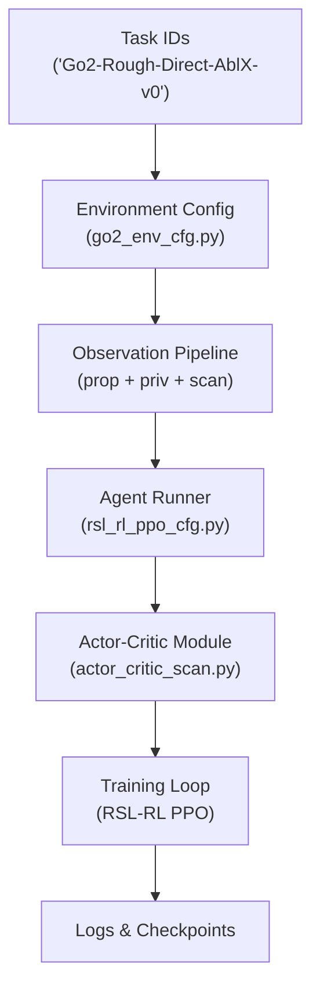
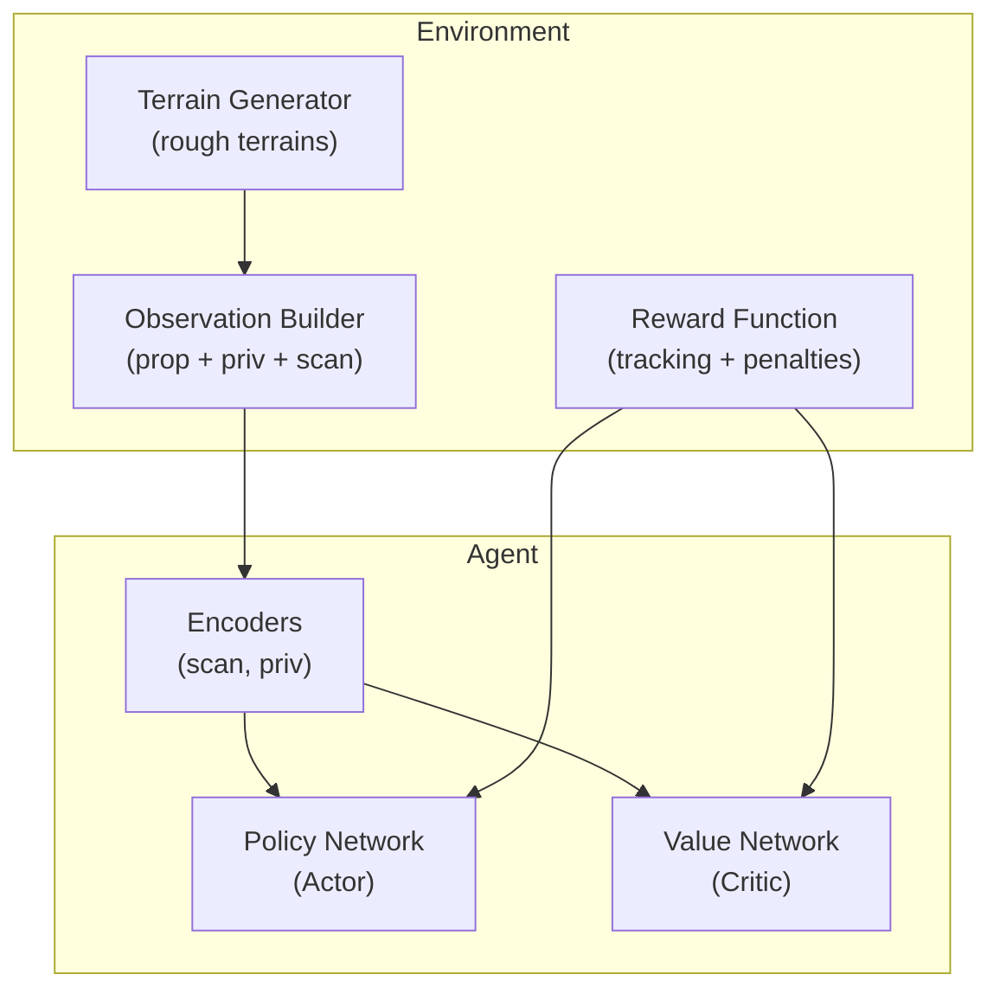
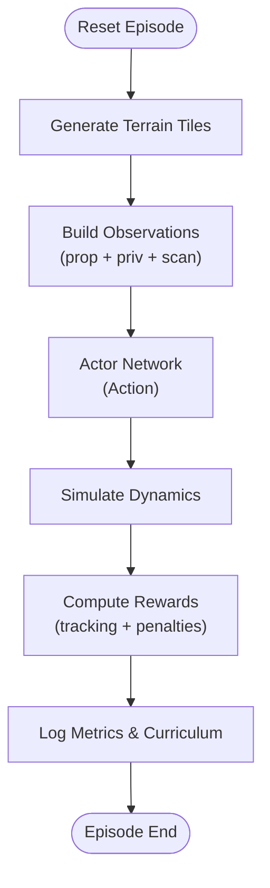
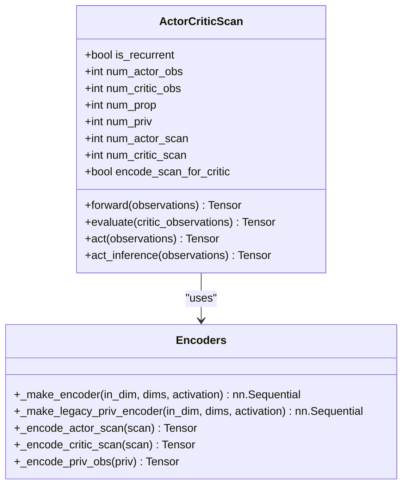
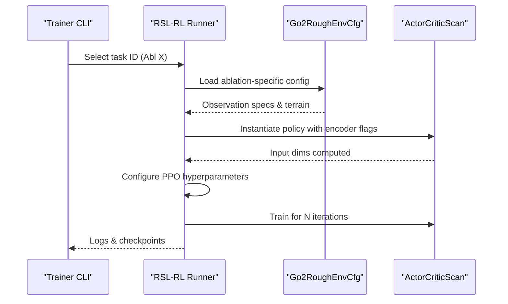
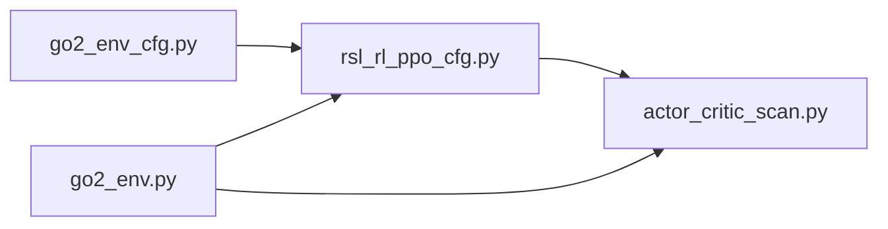

# Introduction and Motivation

<cite>
**Referenced Files in This Document**
- [README.md](file://README.md)
- [go2_env_cfg.py](file://source/isaaclab_tasks/isaaclab_tasks/direct/go2/go2_env_cfg.py)
- [go2_env.py](file://source/isaaclab_tasks/isaaclab_tasks/direct/go2/go2_env.py)
- [rsl_rl_ppo_cfg.py](file://source/isaaclab_tasks/isaaclab_tasks/direct/go2/agents/rsl_rl_ppo_cfg.py)
- [actor_critic_scan.py](file://source/isaaclab_tasks/isaaclab_tasks/direct/go2/agents/actor_critic_scan.py)
- [refs.bib](file://docs/source/_static/refs.bib)
</cite>

## Table of Contents
1. [Introduction](#introduction)
2. [Project Structure](#project-structure)
3. [Core Components](#core-components)
4. [Architecture Overview](#architecture-overview)
5. [Detailed Component Analysis](#detailed-component-analysis)
6. [Dependency Analysis](#dependency-analysis)
7. [Performance Considerations](#performance-considerations)
8. [Troubleshooting Guide](#troubleshooting-guide)
9. [Conclusion](#conclusion)

## Introduction
This document introduces the Extreme Quadruped Parkour project, a unified codebase designed to evaluate five network ablations for Unitree Go2 quadruped locomotion across challenging, rough-terrain scenarios. The project’s primary goal is to systematically assess how different sensor fusion and perception pathways influence policy performance and stability in extreme parkour-like environments. Through controlled ablation studies, it aims to isolate the contributions of proprioceptive inputs, raw height-scan observations, and encoded representations for both the actor and critic networks.

The motivation stems from the recognition that real-world deployment of legged robots demands robust navigation capabilities in unstructured, uneven, and cluttered environments. While prior work has demonstrated progress in rough-terrain locomotion and parkour, the lack of standardized, comparable ablation studies has limited the ability to pinpoint which architectural choices yield the most reliable and efficient policies. This project addresses that gap by providing a single, well-parameterized environment and a shared training pipeline across multiple network configurations, enabling fair comparisons and reproducible insights.

The research question guiding this investigation is:
- How do different combinations of proprioceptive, private (privileged), and height-scan inputs—along with whether raw scans or learned encodings are used—affect policy performance, stability, and generalization in extreme, multi-level parkour terrains?

Prior work in this domain informs both the environment design and the evaluation criteria. The project builds upon approaches that emphasize end-to-end perception-action learning and rapid motor adaptation, while introducing a rigorous, controlled ablation framework tailored to the Unitree Go2 platform.

Why extreme terrain navigation matters:
- Extreme terrains (e.g., parkour steps, gaps, hurdles, stairs) represent a significant challenge for legged locomotion due to high variability in height transitions, narrow footholds, and dynamic balance requirements.
- These conditions push the limits of perception, control, and policy robustness, making them ideal benchmarks for advancing state-of-the-art navigation systems.
- Successfully navigating such terrains often hinges on accurate, timely interpretation of terrain structure and stable, adaptive control policies—both of which are evaluated systematically through these ablations.

## Project Structure
The repository organizes the unified ablation experiments around a shared environment and agent configuration, exposing distinct task IDs for each ablation. The structure enables straightforward training and evaluation across configurations while maintaining consistent experimental conditions.

Key structural elements:
- Environment configuration defines terrain generation, reward shaping, and observation composition for both training and evaluation.
- Agent configuration encapsulates policy architectures and training hyperparameters for each ablation.
- The actor-critic module implements modular scan and private-observation encoders, enabling flexible input routing for actor and critic.

**Diagram sources**
- [README.md:5-10](file://README.md#L5-L10)
- [go2_env_cfg.py:172-314](file://source/isaaclab_tasks/isaaclab_tasks/direct/go2/go2_env_cfg.py#L172-L314)
- [rsl_rl_ppo_cfg.py:78-155](file://source/isaaclab_tasks/isaaclab_tasks/direct/go2/agents/rsl_rl_ppo_cfg.py#L78-L155)
- [actor_critic_scan.py:13-262](file://source/isaaclab_tasks/isaaclab_tasks/direct/go2/agents/actor_critic_scan.py#L13-L262)

**Section sources**
- [README.md:3-10](file://README.md#L3-L10)
- [go2_env_cfg.py:172-314](file://source/isaaclab_tasks/isaaclab_tasks/direct/go2/go2_env_cfg.py#L172-L314)
- [rsl_rl_ppo_cfg.py:78-155](file://source/isaaclab_tasks/isaaclab_tasks/direct/go2/agents/rsl_rl_ppo_cfg.py#L78-L155)
- [actor_critic_scan.py:13-262](file://source/isaaclab_tasks/isaaclab_tasks/direct/go2/agents/actor_critic_scan.py#L13-L262)

## Core Components
- Environment configuration: Defines terrain types, observation dimensions, reward scales, and curriculum behavior. It exposes toggles for scan usage in the policy and critic, and ordering flags for scan-first configurations.
- Agent runner: Encapsulates training hyperparameters and constructs the policy configuration for each ablation, including encoder dimensions and whether to encode scans for the critic.
- Actor-critic module: Implements an MLP-based actor and critic with optional encoders for scan and private observations. It supports independent configuration of encoder usage for actor and critic, and integrates action noise modeling.

These components collectively enable controlled ablation studies by varying:
- Whether raw scans or encoded latent representations are used by the actor and critic.
- Whether private observations are encoded and included in the critic.
- The ordering of inputs (e.g., scan-first policies).

**Section sources**
- [go2_env_cfg.py:172-314](file://source/isaaclab_tasks/isaaclab_tasks/direct/go2/go2_env_cfg.py#L172-L314)
- [rsl_rl_ppo_cfg.py:11-41](file://source/isaaclab_tasks/isaaclab_tasks/direct/go2/agents/rsl_rl_ppo_cfg.py#L11-L41)
- [actor_critic_scan.py:13-262](file://source/isaaclab_tasks/isaaclab_tasks/direct/go2/agents/actor_critic_scan.py#L13-L262)

## Architecture Overview
The system integrates a perception-aware quadruped environment with a modular actor-critic architecture. The environment generates challenging terrains and computes rewards, while the agent learns a policy that maps observations to actions. The ablation configurations determine how observations are composed and processed before being fed into the policy and value networks.

**Diagram sources**
- [go2_env_cfg.py:191-277](file://source/isaaclab_tasks/isaaclab_tasks/direct/go2/go2_env_cfg.py#L191-L277)
- [go2_env.py:20-119](file://source/isaaclab_tasks/isaaclab_tasks/direct/go2/go2_env.py#L20-L119)
- [actor_critic_scan.py:13-262](file://source/isaaclab_tasks/isaaclab_tasks/direct/go2/agents/actor_critic_scan.py#L13-L262)

## Detailed Component Analysis

### Observation and Reward Design
The environment composes observations from three modalities:
- Proprioceptive observations (e.g., joint positions/velocities, gravity projection, base velocities, commands, last action, foot contacts).
- Private (privileged) observations (e.g., mass, center of mass, friction coefficients, PD gains).
- Height-scan observations derived from a ray-casting sensor, forming a grid around the robot.

Reward design emphasizes velocity tracking while penalizing undesirable behaviors (e.g., excessive torques, action rates, stumbling, undesired contacts). A positive-work clamp prevents rewarding negative work, aligning with energy-conscious locomotion goals.

**Diagram sources**
- [go2_env_cfg.py:191-277](file://source/isaaclab_tasks/isaaclab_tasks/direct/go2/go2_env_cfg.py#L191-L277)
- [go2_env.py:20-119](file://source/isaaclab_tasks/isaaclab_tasks/direct/go2/go2_env.py#L20-L119)

**Section sources**
- [go2_env_cfg.py:191-277](file://source/isaaclab_tasks/isaaclab_tasks/direct/go2/go2_env_cfg.py#L191-L277)
- [go2_env.py:20-119](file://source/isaaclab_tasks/isaaclab_tasks/direct/go2/go2_env.py#L20-L119)

### Actor-Critic with Modular Encoders
The actor-critic module supports:
- Optional scan encoders for the actor and/or critic.
- Optional private-observation encoders for the critic.
- Flexible input ordering (including scan-first modes).

**Diagram sources**
- [actor_critic_scan.py:13-262](file://source/isaaclab_tasks/isaaclab_tasks/direct/go2/agents/actor_critic_scan.py#L13-L262)

**Section sources**
- [actor_critic_scan.py:13-262](file://source/isaaclab_tasks/isaaclab_tasks/direct/go2/agents/actor_critic_scan.py#L13-L262)

### Ablation Mapping and Training Pipelines
Each task ID corresponds to a specific configuration of the actor and critic input pathways. The runner configurations construct the appropriate policy settings for each ablation, including encoder dimensions and flags for scan-first ordering.

**Diagram sources**
- [README.md:5-10](file://README.md#L5-L10)
- [rsl_rl_ppo_cfg.py:78-155](file://source/isaaclab_tasks/isaaclab_tasks/direct/go2/agents/rsl_rl_ppo_cfg.py#L78-L155)
- [go2_env_cfg.py:172-314](file://source/isaaclab_tasks/isaaclab_tasks/direct/go2/go2_env_cfg.py#L172-L314)
- [actor_critic_scan.py:13-262](file://source/isaaclab_tasks/isaaclab_tasks/direct/go2/agents/actor_critic_scan.py#L13-L262)

**Section sources**
- [README.md:12-17](file://README.md#L12-L17)
- [rsl_rl_ppo_cfg.py:114-155](file://source/isaaclab_tasks/isaaclab_tasks/direct/go2/agents/rsl_rl_ppo_cfg.py#L114-L155)
- [go2_env_cfg.py:333-353](file://source/isaaclab_tasks/isaaclab_tasks/direct/go2/go2_env_cfg.py#L333-L353)

## Dependency Analysis
The ablation experiments depend on:
- Environment configuration to define observation spaces and terrain characteristics.
- Agent runner to assemble the policy and training settings.
- Actor-critic module to implement the neural architectures and encoders.

**Diagram sources**
- [go2_env_cfg.py:172-314](file://source/isaaclab_tasks/isaaclab_tasks/direct/go2/go2_env_cfg.py#L172-L314)
- [rsl_rl_ppo_cfg.py:78-155](file://source/isaaclab_tasks/isaaclab_tasks/direct/go2/agents/rsl_rl_ppo_cfg.py#L78-L155)
- [actor_critic_scan.py:13-262](file://source/isaaclab_tasks/isaaclab_tasks/direct/go2/agents/actor_critic_scan.py#L13-L262)
- [go2_env.py:20-119](file://source/isaaclab_tasks/isaaclab_tasks/direct/go2/go2_env.py#L20-L119)

**Section sources**
- [go2_env_cfg.py:172-314](file://source/isaaclab_tasks/isaaclab_tasks/direct/go2/go2_env_cfg.py#L172-L314)
- [rsl_rl_ppo_cfg.py:78-155](file://source/isaaclab_tasks/isaaclab_tasks/direct/go2/agents/rsl_rl_ppo_cfg.py#L78-L155)
- [actor_critic_scan.py:13-262](file://source/isaaclab_tasks/isaaclab_tasks/direct/go2/agents/actor_critic_scan.py#L13-L262)
- [go2_env.py:20-119](file://source/isaaclab_tasks/isaaclab_tasks/direct/go2/go2_env.py#L20-L119)

## Performance Considerations
- Large-scale parallel simulation: The experiments utilize substantial numbers of environments, demanding careful resource allocation and headless operation for scalability.
- Encoder design trade-offs: Encoding scans improves generalization compared to raw scans, while encoding private observations can introduce overfitting to constants; these trade-offs are central to the ablation findings.
- Curriculum and reward shaping: Fixed headings and velocity commands, combined with curriculum learning, stabilize training across difficult terrains.

[No sources needed since this section provides general guidance]

## Troubleshooting Guide
- Installation prerequisites: Ensure the correct Isaac Sim and Python versions, and verify CUDA-enabled PyTorch compatibility.
- Environment and terrain: Confirm terrain material paths and GPU patch counts for performance-sensitive simulations.
- Training stability: Adjust learning rates, gradient clipping, and normalization settings if encountering instability; validate observation dimensions against environment configuration.

[No sources needed since this section provides general guidance]

## Conclusion
This project advances the state-of-the-art in legged robot navigation by providing a unified, controlled ablation framework for evaluating perception-action architectures on extreme quadruped parkour tasks. By isolating the effects of proprioceptive, private, and scan-based inputs—and whether raw or encoded representations are used—it offers actionable insights for building robust, efficient policies in challenging, real-world-like environments. The findings highlight the importance of scan encoding for both actor and critic and caution against encoding private observations in the critic, particularly in high-noise or constant-rich settings.