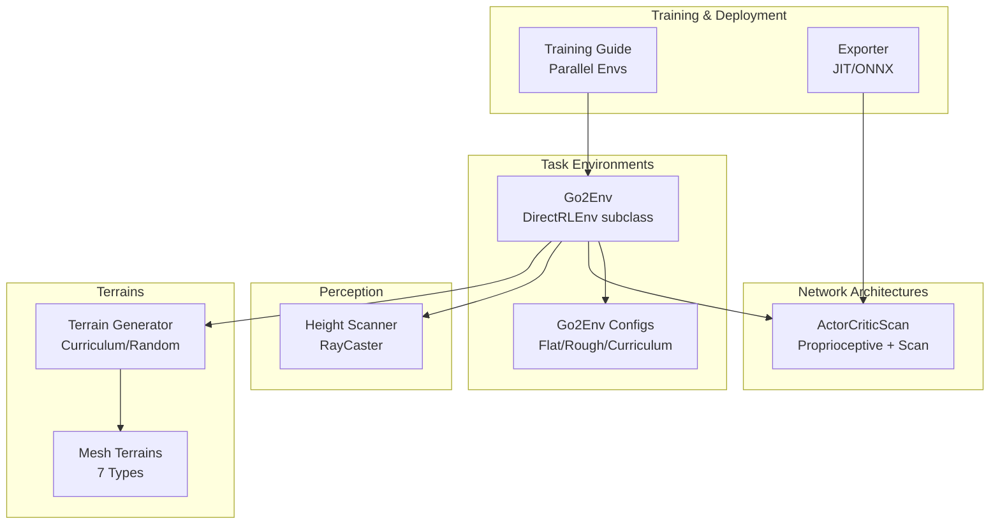
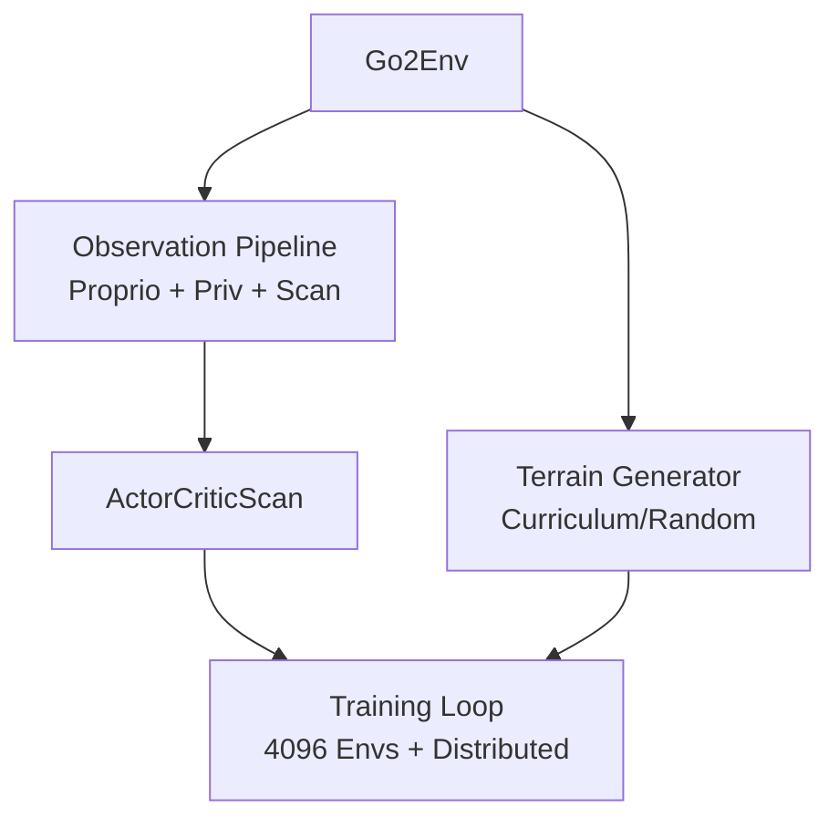
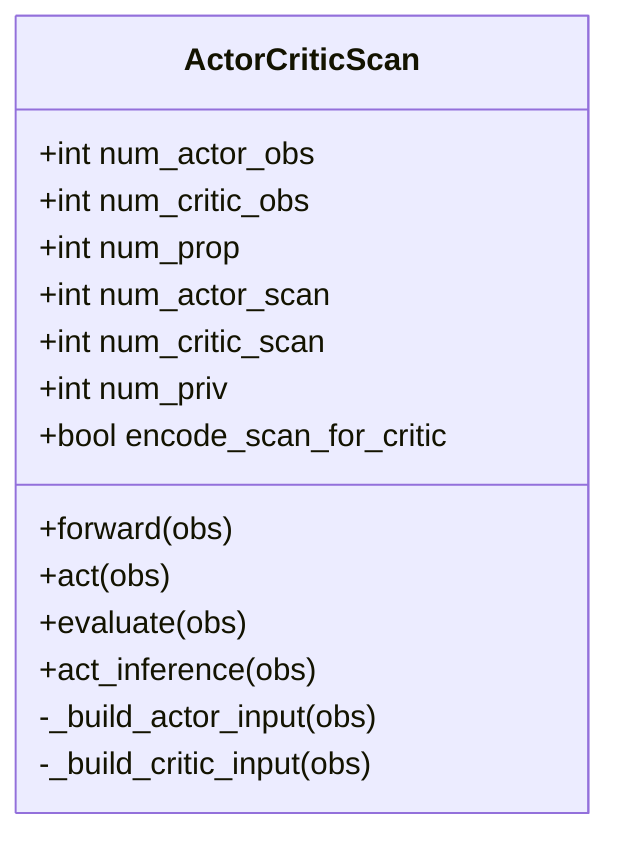
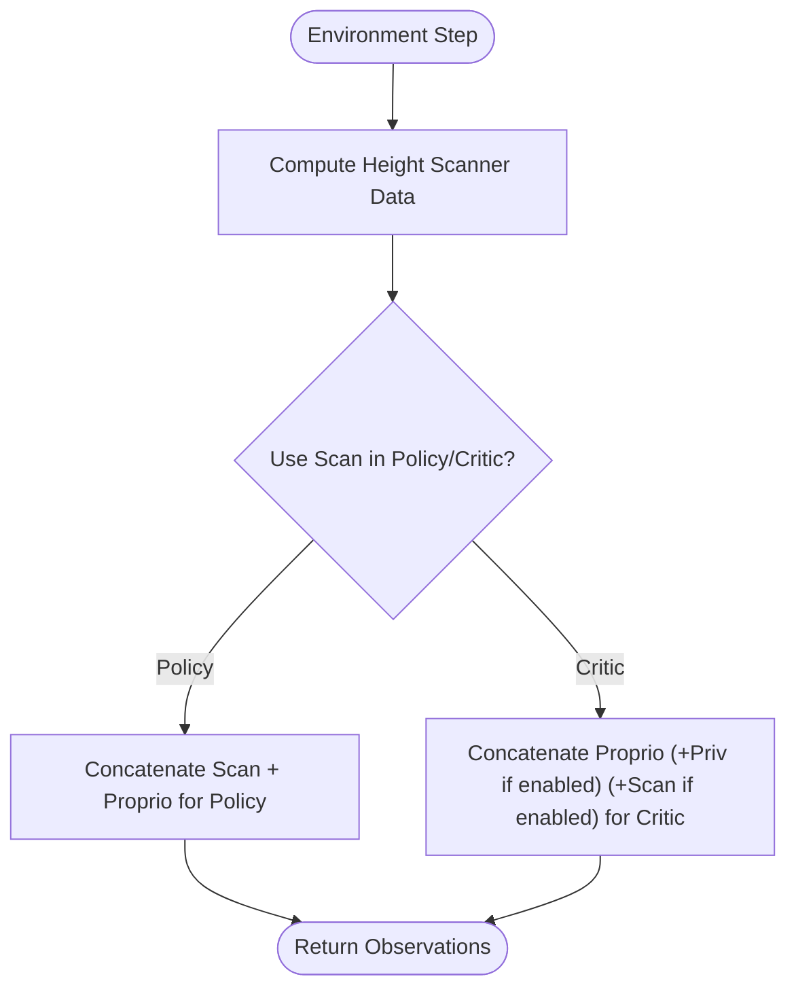
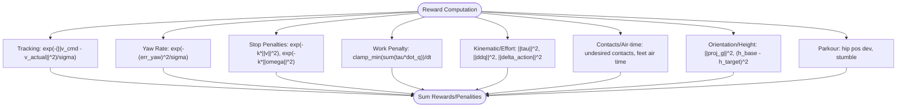
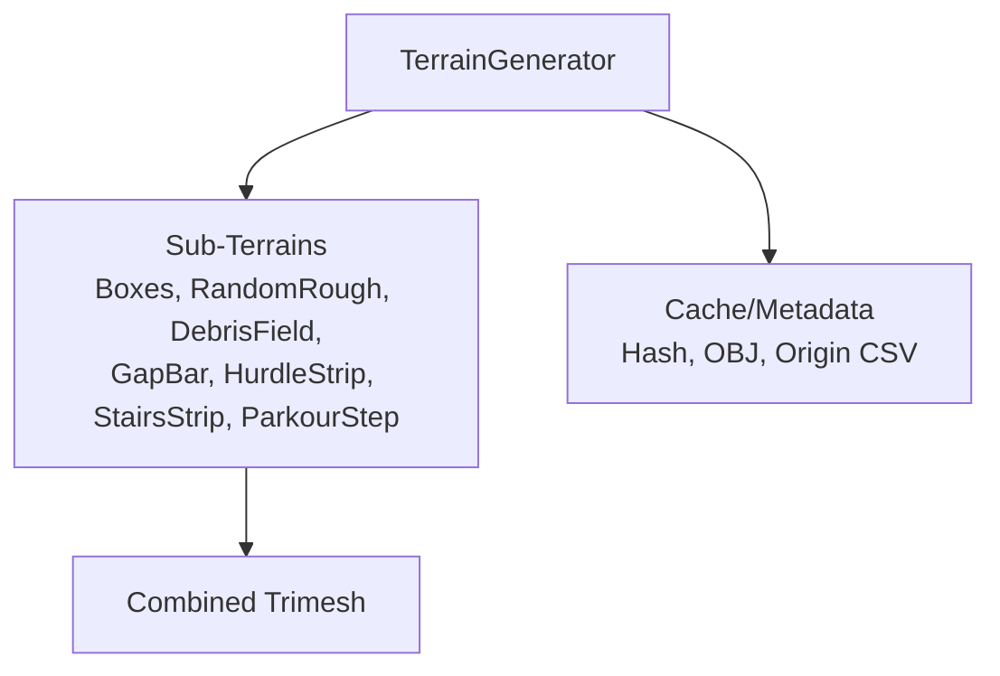
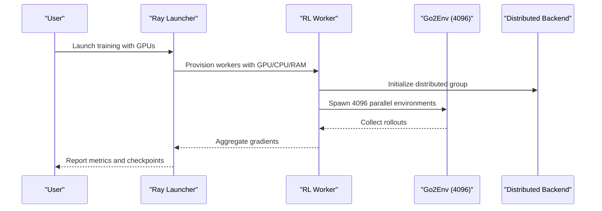
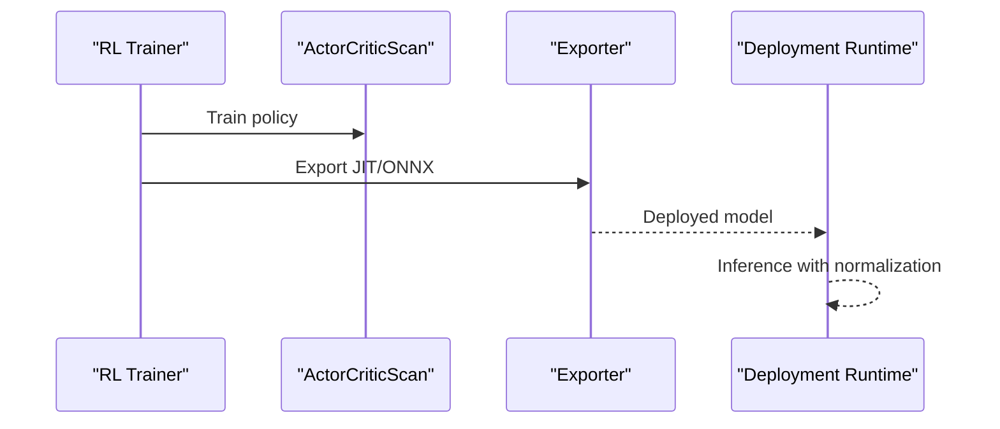
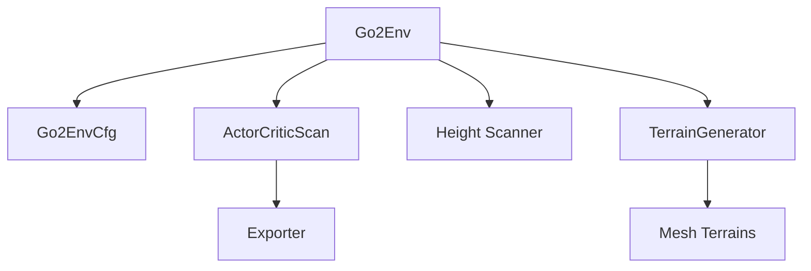

# Key Features and Capabilities

<cite>
**Referenced Files in This Document**
- [go2_env.py](file://source/isaaclab_tasks/isaaclab_tasks/direct/go2/go2_env.py)
- [actor_critic_scan.py](file://source/isaaclab_tasks/isaaclab_tasks/direct/go2/agents/actor_critic_scan.py)
- [go2_env_cfg.py](file://source/isaaclab_tasks/isaaclab_tasks/direct/go2/go2_env_cfg.py)
- [mesh_terrains.py](file://source/isaaclab/isaaclab/terrains/trimesh/mesh_terrains.py)
- [terrain_generator.py](file://source/isaaclab/isaaclab/terrains/terrain_generator.py)
- [exporter.py](file://source/isaaclab_rl/isaaclab_rl/rsl_rl/exporter.py)
- [training_guide.rst](file://docs/source/overview/reinforcement-learning/training_guide.rst)
- [performance_benchmarks.rst](file://docs/source/overview/reinforcement-learning/performance_benchmarks.rst)
- [test_environments_training.py](file://source/isaaclab_tasks/test/benchmarking/test_environments_training.py)
- [wrap_resources.py](file://scripts/reinforcement_learning/ray/wrap_resources.py)
- [util.py](file://scripts/reinforcement_learning/ray/util.py)
- [cartpole_env.py](file://source/isaaclab_tasks/isaaclab_tasks/direct/cartpole_showcase/cartpole/cartpole_env.py)
- [pre_trained_policy_action.py](file://source/isaaclab_tasks/isaaclab_tasks/manager_based/navigation/mdp/pre_trained_policy_action.py)
- [replay_demos.py](file://scripts/tools/replay_demos.py)
- [annotate_demos.py](file://scripts/imitation_learning/isaaclab_mimic/annotate_demos.py)
</cite>

## Table of Contents
1. [Introduction](#introduction)
2. [Project Structure](#project-structure)
3. [Core Components](#core-components)
4. [Architecture Overview](#architecture-overview)
5. [Detailed Component Analysis](#detailed-component-analysis)
6. [Dependency Analysis](#dependency-analysis)
7. [Performance Considerations](#performance-considerations)
8. [Troubleshooting Guide](#troubleshooting-guide)
9. [Conclusion](#conclusion)
10. [Appendices](#appendices)

## Introduction
This document presents the key features and capabilities of the framework, focusing on:
- Five distinct network architectures enabling flexible perception and control modalities
- Observation processing pipeline with proprioceptive, privileged, and height-scanner inputs
- Reward engineering with positive-work clamp and tracking penalties
- Terrain generation system featuring seven terrain types
- Training infrastructure supporting 4096 environments and distributed computing
- Policy inference and deployment utilities
- Practical examples and modular design patterns for extensibility

## Project Structure
The repository organizes functionality across three primary areas:
- Task environments and configurations for quadruped locomotion
- Network architectures for perception and control
- Terrain generation and training infrastructure

**Section sources**
- [go2_env.py:20-232](file://source/isaaclab_tasks/isaaclab_tasks/direct/go2/go2_env.py#L20-L232)
- [go2_env_cfg.py:71-114](file://source/isaaclab_tasks/isaaclab_tasks/direct/go2/go2_env_cfg.py#L71-L114)
- [actor_critic_scan.py:13-132](file://source/isaaclab_tasks/isaaclab_tasks/direct/go2/agents/actor_critic_scan.py#L13-L132)
- [mesh_terrains.py:23-47](file://source/isaaclab/isaaclab/terrains/trimesh/mesh_terrains.py#L23-L47)
- [terrain_generator.py:134-200](file://source/isaaclab/isaaclab/terrains/terrain_generator.py#L134-L200)
- [training_guide.rst:11-54](file://docs/source/overview/reinforcement-learning/training_guide.rst#L11-L54)
- [exporter.py:11-40](file://source/isaaclab_rl/isaaclab_rl/rsl_rl/exporter.py#L11-L40)

## Core Components
- Network Architectures
  - Standard proprioceptive-only actor-critic
  - Actor-critic with scan encoder for policy
  - Actor-critic with scan encoder for critic
  - Actor-critic with scan encoder for both policy and critic
  - Actor-critic with privileged observation encoder for critic
- Observation Processing
  - Proprioceptive: joint positions/velocities, gravity projection, base velocities, commands, last actions, foot contact flags
  - Privileged: mass/com, friction, PD gain scales
  - Height scanner: raycast-derived elevation profile encoded via scan encoder
- Reward Engineering
  - Tracking penalties for linear and yaw rates
  - Stop penalties for residual motion
  - Positive-work clamp on mechanical work
  - Penalities for torques, accelerations, action rate, undesired contacts, orientation deviation, base height, hip drift, and stumbling
- Terrain Generation
  - Flat, boxes, random_rough, debris_field, gap_bar, hurdle_strip, stairs_strip, parkour_step
- Training Infrastructure
  - 4096 environments in scene configuration
  - Distributed training support with multi-GPU nodes
  - Performance benchmarks for large-scale environments
- Policy Inference and Deployment
  - Export to TorchScript and ONNX
  - Pre-trained policy action term for navigation
  - Demo replay and annotation tools

**Section sources**
- [go2_env.py:293-355](file://source/isaaclab_tasks/isaaclab_tasks/direct/go2/go2_env.py#L293-L355)
- [go2_env.py:357-465](file://source/isaaclab_tasks/isaaclab_tasks/direct/go2/go2_env.py#L357-L465)
- [go2_env_cfg.py:172-314](file://source/isaaclab_tasks/isaaclab_tasks/direct/go2/go2_env_cfg.py#L172-L314)
- [actor_critic_scan.py:52-132](file://source/isaaclab_tasks/isaaclab_tasks/direct/go2/agents/actor_critic_scan.py#L52-L132)
- [mesh_terrains.py:23-147](file://source/isaaclab/isaaclab/terrains/trimesh/mesh_terrains.py#L23-L147)
- [training_guide.rst:11-54](file://docs/source/overview/reinforcement-learning/training_guide.rst#L11-L54)
- [performance_benchmarks.rst:72-110](file://docs/source/overview/reinforcement-learning/performance_benchmarks.rst#L72-L110)
- [exporter.py:11-40](file://source/isaaclab_rl/isaaclab_rl/rsl_rl/exporter.py#L11-L40)

## Architecture Overview
The system integrates environment simulation, perception, policy networks, and terrain generation into a cohesive RL training pipeline.

**Diagram sources**
- [go2_env.py:293-355](file://source/isaaclab_tasks/isaaclab_tasks/direct/go2/go2_env.py#L293-L355)
- [actor_critic_scan.py:13-132](file://source/isaaclab_tasks/isaaclab_tasks/direct/go2/agents/actor_critic_scan.py#L13-L132)
- [terrain_generator.py:134-200](file://source/isaaclab/isaaclab/terrains/terrain_generator.py#L134-L200)
- [training_guide.rst:11-54](file://docs/source/overview/reinforcement-learning/training_guide.rst#L11-L54)

## Detailed Component Analysis

### Network Architectures
Five distinct network configurations are supported, controlled via environment configuration flags:
- Proprioceptive-only: policy and critic receive only proprioceptive observations
- Scan-in-policy: policy additionally receives scan latent; critic receives proprio + privileged
- Scan-in-critic: policy receives proprio; critic receives proprio + privileged + scan latent
- Scan-in-both: both policy and critic receive scan latents
- Priv-encoder: critic receives privileged observations encoded via encoder; scan optional

Implementation highlights:
- Separate scan encoders for actor and critic
- Optional privileged observation encoder for critic
- Modular input composition for actor and critic
- Support for scalar or log-standard deviation action noise

**Diagram sources**
- [actor_critic_scan.py:13-262](file://source/isaaclab_tasks/isaaclab_tasks/direct/go2/agents/actor_critic_scan.py#L13-L262)

**Section sources**
- [go2_env_cfg.py:172-314](file://source/isaaclab_tasks/isaaclab_tasks/direct/go2/go2_env_cfg.py#L172-L314)
- [actor_critic_scan.py:52-230](file://source/isaaclab_tasks/isaaclab_tasks/direct/go2/agents/actor_critic_scan.py#L52-L230)

### Observation Processing System
The environment constructs observations across three modalities:
- Proprioceptive observations: joint positions/velocities, projected gravity, base linear/angular velocities, commands, last actions, foot contact flags
- Privileged observations: mass and center of mass, friction coefficient, PD gain scales
- Height scanner observations: raycast-derived elevation profile, optionally clipped and normalized, concatenated either before or after proprioceptive features based on configuration

**Diagram sources**
- [go2_env.py:293-355](file://source/isaaclab_tasks/isaaclab_tasks/direct/go2/go2_env.py#L293-L355)
- [go2_env_cfg.py:191-277](file://source/isaaclab_tasks/isaaclab_tasks/direct/go2/go2_env_cfg.py#L191-L277)

**Section sources**
- [go2_env.py:293-355](file://source/isaaclab_tasks/isaaclab_tasks/direct/go2/go2_env.py#L293-L355)
- [go2_env_cfg.py:191-277](file://source/isaaclab_tasks/isaaclab_tasks/direct/go2/go2_env_cfg.py#L191-L277)

### Reward Engineering
Rewards and penalties are composed to encourage stable locomotion and discourage undesirable behaviors:
- Tracking: exponential penalties on linear and yaw rate tracking errors
- Stop penalties: exponential penalties on residual linear/angular velocities
- Work: positive mechanical work penalized via clamp-min to discourage regenerative braking
- Kinematic/effort: torques, accelerations, action rate
- Contact/Air-time: undesired contacts and feet air time shaping
- Orientation/Height: flat orientation and base height deviations
- Parkour-specific: hip joint deviations and stumbling detection

**Diagram sources**
- [go2_env.py:357-465](file://source/isaaclab_tasks/isaaclab_tasks/direct/go2/go2_env.py#L357-L465)

**Section sources**
- [go2_env.py:357-465](file://source/isaaclab_tasks/isaaclab_tasks/direct/go2/go2_env.py#L357-L465)

### Terrain Generation System
Seven terrain types are supported:
- Flat
- Boxes
- Random rough
- Debris field
- Gap bar strips
- Hurdle strips
- Stairs strips
- Parkour step

The terrain generator supports:
- Curriculum-based generation with row/column layout
- Random generation with configurable proportions
- Caching and hashing for reproducibility
- Border and platform generation utilities

**Diagram sources**
- [terrain_generator.py:134-200](file://source/isaaclab/isaaclab/terrains/terrain_generator.py#L134-L200)
- [mesh_terrains.py:23-147](file://source/isaaclab/isaaclab/terrains/trimesh/mesh_terrains.py#L23-L147)

**Section sources**
- [go2_env_cfg.py:191-277](file://source/isaaclab_tasks/isaaclab_tasks/direct/go2/go2_env_cfg.py#L191-L277)
- [terrain_generator.py:134-200](file://source/isaaclab/isaaclab/terrains/terrain_generator.py#L134-L200)
- [mesh_terrains.py:23-147](file://source/isaaclab/isaaclab/terrains/trimesh/mesh_terrains.py#L23-L147)

### Training Infrastructure and Distributed Computing
The framework supports:
- Large-scale parallel environments (scene configured to 4096)
- Multi-GPU and distributed training via Ray-based launcher
- Resource-aware worker provisioning and GPU allocation
- Performance benchmarks for environment step and inference FPS

**Diagram sources**
- [training_guide.rst:11-54](file://docs/source/overview/reinforcement-learning/training_guide.rst#L11-L54)
- [performance_benchmarks.rst:72-110](file://docs/source/overview/reinforcement-learning/performance_benchmarks.rst#L72-L110)
- [test_environments_training.py:46-83](file://source/isaaclab_tasks/test/benchmarking/test_environments_training.py#L46-L83)
- [wrap_resources.py:86-116](file://scripts/reinforcement_learning/ray/wrap_resources.py#L86-L116)
- [util.py:377-417](file://scripts/reinforcement_learning/ray/util.py#L377-L417)

**Section sources**
- [go2_env_cfg.py:113-114](file://source/isaaclab_tasks/isaaclab_tasks/direct/go2/go2_env_cfg.py#L113-L114)
- [training_guide.rst:11-54](file://docs/source/overview/reinforcement-learning/training_guide.rst#L11-L54)
- [performance_benchmarks.rst:72-110](file://docs/source/overview/reinforcement-learning/performance_benchmarks.rst#L72-L110)
- [test_environments_training.py:46-83](file://source/isaaclab_tasks/test/benchmarking/test_environments_training.py#L46-L83)
- [wrap_resources.py:86-116](file://scripts/reinforcement_learning/ray/wrap_resources.py#L86-L116)
- [util.py:377-417](file://scripts/reinforcement_learning/ray/util.py#L377-L417)

### Policy Inference and Visualization Tools
- Export policies to TorchScript and ONNX for deployment
- Recurrent and non-recurrent support with proper normalization
- Pre-trained policy action term for navigation visualization
- Demo replay and annotation tools for imitation learning workflows

**Diagram sources**
- [exporter.py:11-40](file://source/isaaclab_rl/isaaclab_rl/rsl_rl/exporter.py#L11-L40)
- [exporter.py:47-117](file://source/isaaclab_rl/isaaclab_rl/rsl_rl/exporter.py#L47-L117)
- [exporter.py:119-230](file://source/isaaclab_rl/isaaclab_rl/rsl_rl/exporter.py#L119-L230)
- [pre_trained_policy_action.py:146-173](file://source/isaaclab_tasks/isaaclab_tasks/manager_based/navigation/mdp/pre_trained_policy_action.py#L146-L173)
- [replay_demos.py:170-194](file://scripts/tools/replay_demos.py#L170-L194)
- [annotate_demos.py:299-410](file://scripts/imitation_learning/isaaclab_mimic/annotate_demos.py#L299-L410)

**Section sources**
- [exporter.py:11-40](file://source/isaaclab_rl/isaaclab_rl/rsl_rl/exporter.py#L11-L40)
- [exporter.py:47-117](file://source/isaaclab_rl/isaaclab_rl/rsl_rl/exporter.py#L47-L117)
- [exporter.py:119-230](file://source/isaaclab_rl/isaaclab_rl/rsl_rl/exporter.py#L119-L230)
- [pre_trained_policy_action.py:146-173](file://source/isaaclab_tasks/isaaclab_tasks/manager_based/navigation/mdp/pre_trained_policy_action.py#L146-L173)
- [replay_demos.py:170-194](file://scripts/tools/replay_demos.py#L170-L194)
- [annotate_demos.py:299-410](file://scripts/imitation_learning/isaaclab_mimic/annotate_demos.py#L299-L410)

### Practical Examples and Usage Patterns
- Observation Space Construction
  - Example path: [go2_env.py:293-355](file://source/isaaclab_tasks/isaaclab_tasks/direct/go2/go2_env.py#L293-L355)
  - Pattern: Concatenate proprioceptive features; conditionally prepend/append scan based on configuration flags
- Reward Composition
  - Example path: [go2_env.py:357-465](file://source/isaaclab_tasks/isaaclab_tasks/direct/go2/go2_env.py#L357-L465)
  - Pattern: Sum of mapped tracking, stop, work, and shaping terms
- Network Architecture Selection
  - Example path: [go2_env_cfg.py:172-314](file://source/isaaclab_tasks/isaaclab_tasks/direct/go2/go2_env_cfg.py#L172-L314)
  - Pattern: Toggle use_scan_in_policy/use_scan_in_critic/scan_first_in_* flags to select architecture variant
- Terrain Type Configuration
  - Example path: [go2_env_cfg.py:191-277](file://source/isaaclab_tasks/isaaclab_tasks/direct/go2/go2_env_cfg.py#L191-L277)
  - Pattern: Configure sub_terrains with proportions and per-type parameters
- Training with 4096 Environments
  - Example path: [go2_env_cfg.py:113-114](file://source/isaaclab_tasks/isaaclab_tasks/direct/go2/go2_env_cfg.py#L113-L114)
  - Pattern: Set scene.num_envs to 4096 and run distributed training
- Policy Export for Deployment
  - Example path: [exporter.py:11-40](file://source/isaaclab_rl/isaaclab_rl/rsl_rl/exporter.py#L11-L40)
  - Pattern: Call export_policy_as_jit or export_policy_as_onnx with policy and normalizer

**Section sources**
- [go2_env.py:293-355](file://source/isaaclab_tasks/isaaclab_tasks/direct/go2/go2_env.py#L293-L355)
- [go2_env.py:357-465](file://source/isaaclab_tasks/isaaclab_tasks/direct/go2/go2_env.py#L357-L465)
- [go2_env_cfg.py:172-314](file://source/isaaclab_tasks/isaaclab_tasks/direct/go2/go2_env_cfg.py#L172-L314)
- [go2_env_cfg.py:191-277](file://source/isaaclab_tasks/isaaclab_tasks/direct/go2/go2_env_cfg.py#L191-L277)
- [exporter.py:11-40](file://source/isaaclab_rl/isaaclab_rl/rsl_rl/exporter.py#L11-L40)

### Modular Design and Extensibility
- Environment configurations are modular and composable
  - Example path: [go2_env_cfg.py:71-114](file://source/isaaclab_tasks/isaaclab_tasks/direct/go2/go2_env_cfg.py#L71-L114)
- Network architecture supports independent scan encoders for actor and critic
  - Example path: [actor_critic_scan.py:66-97](file://source/isaaclab_tasks/isaaclab_tasks/direct/go2/agents/actor_critic_scan.py#L66-L97)
- Terrain generation is extensible with new sub-terrain types
  - Example path: [mesh_terrains.py:23-147](file://source/isaaclab/isaaclab/terrains/trimesh/mesh_terrains.py#L23-L147)
- Observation space construction demonstrates composability across modalities
  - Example path: [go2_env.py:293-355](file://source/isaaclab_tasks/isaaclab_tasks/direct/go2/go2_env.py#L293-L355)
- Policy export utilities support multiple deployment targets
  - Example path: [exporter.py:11-40](file://source/isaaclab_rl/isaaclab_rl/rsl_rl/exporter.py#L11-L40)

**Section sources**
- [go2_env_cfg.py:71-114](file://source/isaaclab_tasks/isaaclab_tasks/direct/go2/go2_env_cfg.py#L71-L114)
- [actor_critic_scan.py:66-97](file://source/isaaclab_tasks/isaaclab_tasks/direct/go2/agents/actor_critic_scan.py#L66-L97)
- [mesh_terrains.py:23-147](file://source/isaaclab/isaaclab/terrains/trimesh/mesh_terrains.py#L23-L147)
- [go2_env.py:293-355](file://source/isaaclab_tasks/isaaclab_tasks/direct/go2/go2_env.py#L293-L355)
- [exporter.py:11-40](file://source/isaaclab_rl/isaaclab_rl/rsl_rl/exporter.py#L11-L40)

## Dependency Analysis
The following diagram shows key dependencies among components:

**Diagram sources**
- [go2_env.py:20-232](file://source/isaaclab_tasks/isaaclab_tasks/direct/go2/go2_env.py#L20-L232)
- [go2_env_cfg.py:71-114](file://source/isaaclab_tasks/isaaclab_tasks/direct/go2/go2_env_cfg.py#L71-L114)
- [actor_critic_scan.py:13-132](file://source/isaaclab_tasks/isaaclab_tasks/direct/go2/agents/actor_critic_scan.py#L13-L132)
- [terrain_generator.py:134-200](file://source/isaaclab/isaaclab/terrains/terrain_generator.py#L134-L200)
- [mesh_terrains.py:23-147](file://source/isaaclab/isaaclab/terrains/trimesh/mesh_terrains.py#L23-L147)
- [exporter.py:11-40](file://source/isaaclab_rl/isaaclab_rl/rsl_rl/exporter.py#L11-L40)

**Section sources**
- [go2_env.py:20-232](file://source/isaaclab_tasks/isaaclab_tasks/direct/go2/go2_env.py#L20-L232)
- [go2_env_cfg.py:71-114](file://source/isaaclab_tasks/isaaclab_tasks/direct/go2/go2_env_cfg.py#L71-L114)
- [actor_critic_scan.py:13-132](file://source/isaaclab_tasks/isaaclab_tasks/direct/go2/agents/actor_critic_scan.py#L13-L132)
- [terrain_generator.py:134-200](file://source/isaaclab/isaaclab/terrains/terrain_generator.py#L134-L200)
- [mesh_terrains.py:23-147](file://source/isaaclab/isaaclab/terrains/trimesh/mesh_terrains.py#L23-L147)
- [exporter.py:11-40](file://source/isaaclab_rl/isaaclab_rl/rsl_rl/exporter.py#L11-L40)

## Performance Considerations
- Parallel environments: Increasing environments improves data diversity and throughput; monitor GPU memory to avoid OOM
- Distributed training: Use multi-node setups to scale beyond single-GPU capacity
- Observation composition: Adding scan or privileged observations increases input dimensionality; tune network widths accordingly
- Reward scaling: Properly scale reward terms to maintain stable gradients

[No sources needed since this section provides general guidance]

## Troubleshooting Guide
- Out-of-memory during training: Reduce environment count or network sizes; leverage distributed training
- NaNs during training: Check reward scaling and gradient clipping; validate action bounds
- Slow rollout performance: Verify environment decimation and simulation settings; benchmark with provided scripts

**Section sources**
- [training_guide.rst:11-54](file://docs/source/overview/reinforcement-learning/training_guide.rst#L11-L54)
- [performance_benchmarks.rst:72-110](file://docs/source/overview/reinforcement-learning/performance_benchmarks.rst#L72-L110)

## Conclusion
The framework provides a modular, scalable foundation for quadruped parkour and locomotion research. Its five network architectures, rich observation processing, reward engineering, terrain generation, and distributed training infrastructure enable rapid experimentation and deployment.

[No sources needed since this section summarizes without analyzing specific files]

## Appendices
- Additional environment examples demonstrate observation space handling across Gym spaces:
  - Example path: [cartpole_env.py:46-134](file://source/isaaclab_tasks/isaaclab_tasks/direct/cartpole_showcase/cartpole/cartpole_env.py#L46-L134)

**Section sources**
- [cartpole_env.py:46-134](file://source/isaaclab_tasks/isaaclab_tasks/direct/cartpole_showcase/cartpole/cartpole_env.py#L46-L134)