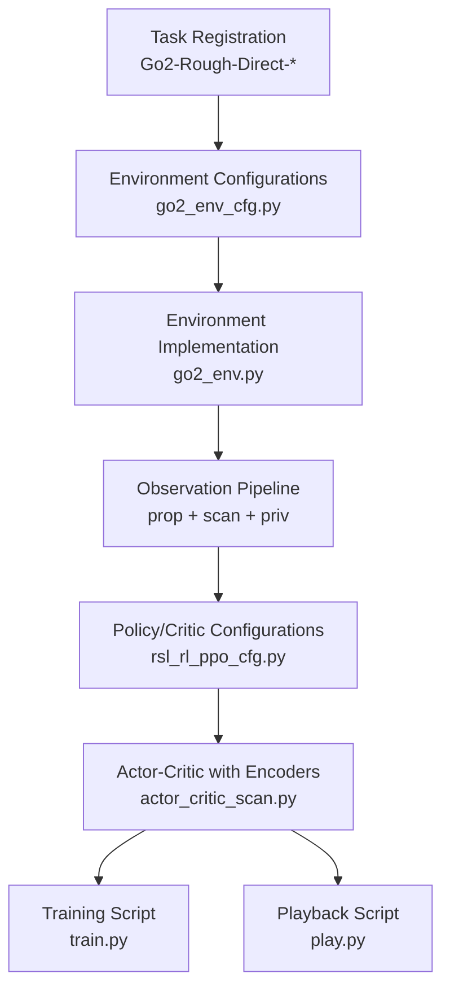
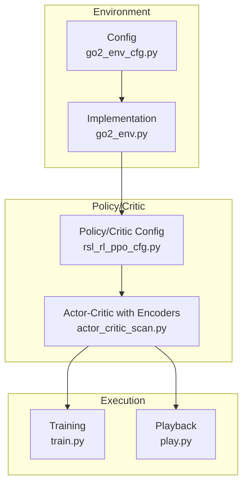
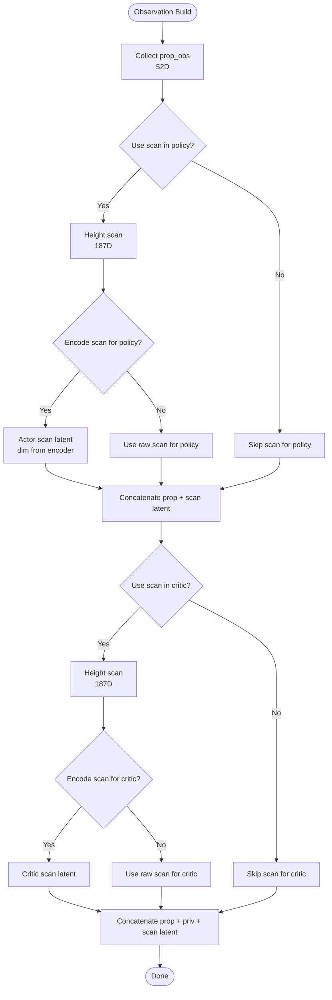
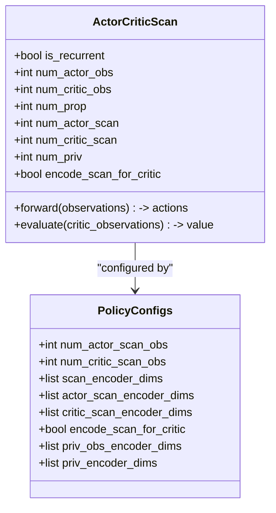
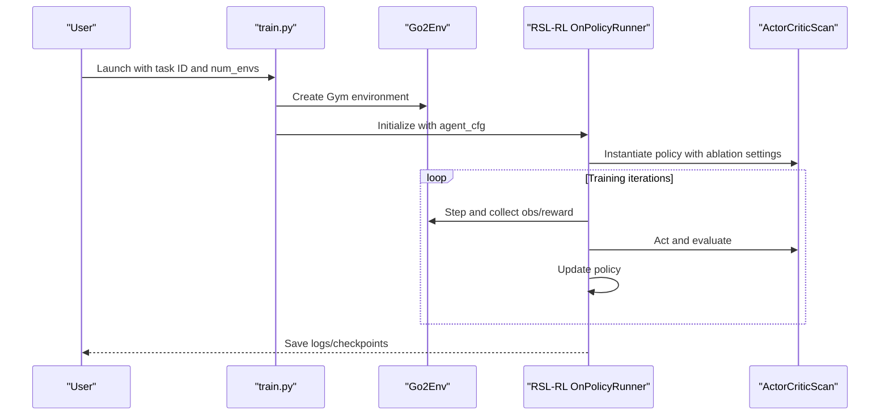
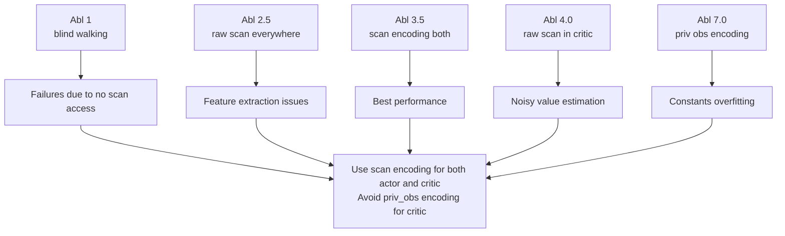
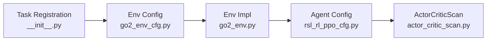

# Project Overview

<cite>
**Referenced Files in This Document**
- [README.md](file://README.md)
- [go2_env_cfg.py](file://source/isaaclab_tasks/isaaclab_tasks/direct/go2/go2_env_cfg.py)
- [go2_env.py](file://source/isaaclab_tasks/isaaclab_tasks/direct/go2/go2_env.py)
- [rsl_rl_ppo_cfg.py](file://source/isaaclab_tasks/isaaclab_tasks/direct/go2/agents/rsl_rl_ppo_cfg.py)
- [actor_critic_scan.py](file://source/isaaclab_tasks/isaaclab_tasks/direct/go2/agents/actor_critic_scan.py)
- [__init__.py](file://source/isaaclab_tasks/isaaclab_tasks/direct/go2/__init__.py)
- [train.py](file://scripts/reinforcement_learning/rsl_rl/train.py)
- [play.py](file://scripts/reinforcement_learning/rsl_rl/play.py)
</cite>

## Table of Contents
1. [Introduction](#introduction)
2. [Project Structure](#project-structure)
3. [Core Components](#core-components)
4. [Architecture Overview](#architecture-overview)
5. [Detailed Component Analysis](#detailed-component-analysis)
6. [Dependency Analysis](#dependency-analysis)
7. [Performance Considerations](#performance-considerations)
8. [Troubleshooting Guide](#troubleshooting-guide)
9. [Conclusion](#conclusion)

## Introduction
This document presents the Extreme Quadruped Parkour project overview. The project consolidates five network ablation studies into a unified codebase for Unitree Go2 quadruped locomotion on extreme terrains. It systematically evaluates sensor fusion architecture choices via controlled ablations and reports findings on optimal observation pathways for policy and critic networks. The project builds on prior work in rough-terrain locomotion and parkour and provides a reproducible framework for training and evaluating policies under challenging conditions.

## Project Structure
The repository organizes the ablation studies around:
- Environment and task registration for five ablations
- Observation and reward pipeline tailored for rough terrain
- Policy and critic network configurations with optional scan and privileged observation encoders
- Training and playback scripts leveraging RSL-RL

**Diagram sources**
- [__init__.py:18-97](file://source/isaaclab_tasks/isaaclab_tasks/direct/go2/__init__.py#L18-L97)
- [go2_env_cfg.py:334-353](file://source/isaaclab_tasks/isaaclab_tasks/direct/go2/go2_env_cfg.py#L334-L353)
- [go2_env.py:293-355](file://source/isaaclab_tasks/isaaclab_tasks/direct/go2/go2_env.py#L293-L355)
- [rsl_rl_ppo_cfg.py:115-155](file://source/isaaclab_tasks/isaaclab_tasks/direct/go2/agents/rsl_rl_ppo_cfg.py#L115-L155)
- [actor_critic_scan.py:13-262](file://source/isaaclab_tasks/isaaclab_tasks/direct/go2/agents/actor_critic_scan.py#L13-L262)
- [train.py:119-210](file://scripts/reinforcement_learning/rsl_rl/train.py#L119-L210)
- [play.py:94-154](file://scripts/reinforcement_learning/rsl_rl/play.py#L94-L154)

**Section sources**
- [README.md:44-50](file://README.md#L44-L50)
- [__init__.py:18-97](file://source/isaaclab_tasks/isaaclab_tasks/direct/go2/__init__.py#L18-L97)

## Core Components
- Task IDs and ablation mapping: The project exposes five Gym tasks, each corresponding to a specific sensor fusion configuration for policy and critic inputs.
- Environment configuration: Defines observation spaces, terrain generation, reward scales, and curriculum behavior for rough-terrain training.
- Observation pipeline: Constructs per-environment observations from proprioceptive signals, a height-field scan, and privileged observations for the critic.
- Policy/Critic configuration: Provides ablation-specific settings for scan encoding and privileged observation encoding.
- Actor-critic with encoders: Implements optional encoders for scan and privileged observations, enabling flexible sensor fusion patterns.
- Training and playback: Scripts orchestrate training and evaluation with standardized logging and checkpointing.

**Section sources**
- [README.md:5-17](file://README.md#L5-L17)
- [go2_env_cfg.py:172-314](file://source/isaaclab_tasks/isaaclab_tasks/direct/go2/go2_env_cfg.py#L172-L314)
- [go2_env.py:293-355](file://source/isaaclab_tasks/isaaclab_tasks/direct/go2/go2_env.py#L293-L355)
- [rsl_rl_ppo_cfg.py:115-155](file://source/isaaclab_tasks/isaaclab_tasks/direct/go2/agents/rsl_rl_ppo_cfg.py#L115-L155)
- [actor_critic_scan.py:13-262](file://source/isaaclab_tasks/isaaclab_tasks/direct/go2/agents/actor_critic_scan.py#L13-L262)
- [train.py:119-210](file://scripts/reinforcement_learning/rsl_rl/train.py#L119-L210)
- [play.py:94-154](file://scripts/reinforcement_learning/rsl_rl/play.py#L94-L154)

## Architecture Overview
The system integrates environment configuration, observation construction, policy/critic definition, and training/evaluation loops. Observations are composed from:
- Proprioceptive observations (prop_obs)
- Height-field scan observations (scan_obs)
- Privileged observations (priv_obs) for the critic only

The ablations vary how these modalities are fused and whether encoders are applied to scan and/or privileged inputs.

**Diagram sources**
- [go2_env_cfg.py:172-314](file://source/isaaclab_tasks/isaaclab_tasks/direct/go2/go2_env_cfg.py#L172-L314)
- [go2_env.py:293-355](file://source/isaaclab_tasks/isaaclab_tasks/direct/go2/go2_env.py#L293-L355)
- [rsl_rl_ppo_cfg.py:115-155](file://source/isaaclab_tasks/isaaclab_tasks/direct/go2/agents/rsl_rl_ppo_cfg.py#L115-L155)
- [actor_critic_scan.py:13-262](file://source/isaaclab_tasks/isaaclab_tasks/direct/go2/agents/actor_critic_scan.py#L13-L262)
- [train.py:119-210](file://scripts/reinforcement_learning/rsl_rl/train.py#L119-L210)
- [play.py:94-154](file://scripts/reinforcement_learning/rsl_rl/play.py#L94-L154)

## Detailed Component Analysis

### Sensor Fusion and Observation Pipeline
- Proprioceptive observations (prop_obs): 52D including joint positions/velocities, projected gravity, base linear/angular velocities, commanded values, recent actions, and foot contacts.
- Privileged observations (priv_obs): 29D including mass, center of mass, friction coefficients, and PD gain scales; used for the critic only.
- Scan observations (scan_obs): 187D height grid representing terrain elevation around the robot.
- Observation composition:
  - Policy input: prop_obs optionally concatenated with scan representation (raw or encoded).
  - Critic input: prop_obs + priv_obs + scan representation (raw or encoded), with optional scan-first ordering.

**Diagram sources**
- [go2_env.py:293-355](file://source/isaaclab_tasks/isaaclab_tasks/direct/go2/go2_env.py#L293-L355)
- [go2_env_cfg.py:172-314](file://source/isaaclab_tasks/isaaclab_tasks/direct/go2/go2_env_cfg.py#L172-L314)

**Section sources**
- [README.md:51-67](file://README.md#L51-L67)
- [go2_env.py:293-355](file://source/isaaclab_tasks/isaaclab_tasks/direct/go2/go2_env.py#L293-L355)
- [go2_env_cfg.py:172-314](file://source/isaaclab_tasks/isaaclab_tasks/direct/go2/go2_env_cfg.py#L172-L314)

### Ablation Study Methodology and Network Architectures
The project defines five ablations that vary how scan and privileged observations are incorporated:
- Abl 1: Actor uses prop_obs only; Critic uses prop_obs + priv_obs + raw scan.
- Abl 2.5: Both policy and critic use prop_obs + raw scan; scan-first ordering is enabled.
- Abl 3.5: Both policy and critic use prop_obs + scan encoding.
- Abl 4.0: Actor uses prop_obs + scan encoding; Critic uses prop_obs + priv_obs + raw scan.
- Abl 7.0: Actor uses prop_obs + scan encoding; Critic uses prop_obs + priv_obs encoding + scan encoding.

**Diagram sources**
- [actor_critic_scan.py:13-262](file://source/isaaclab_tasks/isaaclab_tasks/direct/go2/agents/actor_critic_scan.py#L13-L262)
- [rsl_rl_ppo_cfg.py:11-41](file://source/isaaclab_tasks/isaaclab_tasks/direct/go2/agents/rsl_rl_ppo_cfg.py#L11-L41)

**Section sources**
- [README.md:12-17](file://README.md#L12-L17)
- [rsl_rl_ppo_cfg.py:115-155](file://source/isaaclab_tasks/isaaclab_tasks/direct/go2/agents/rsl_rl_ppo_cfg.py#L115-L155)
- [actor_critic_scan.py:13-262](file://source/isaaclab_tasks/isaaclab_tasks/direct/go2/agents/actor_critic_scan.py#L13-L262)

### Practical Ablation Workflow
- Training: Select a task ID and run the training script with desired number of environments.
- Playback: Load a checkpoint and run the playback script to evaluate a trained policy.

**Diagram sources**
- [train.py:119-210](file://scripts/reinforcement_learning/rsl_rl/train.py#L119-L210)
- [go2_env.py:293-355](file://source/isaaclab_tasks/isaaclab_tasks/direct/go2/go2_env.py#L293-L355)
- [actor_critic_scan.py:13-262](file://source/isaaclab_tasks/isaaclab_tasks/direct/go2/agents/actor_critic_scan.py#L13-L262)

**Section sources**
- [README.md:120-172](file://README.md#L120-L172)
- [train.py:119-210](file://scripts/reinforcement_learning/rsl_rl/train.py#L119-L210)
- [play.py:94-154](file://scripts/reinforcement_learning/rsl_rl/play.py#L94-L154)

### Research Contributions and Findings
- The ablations demonstrate the importance of scan encoding for both policy and critic.
- Using raw scan in the critic leads to noisy value estimates and degraded performance.
- Privileged observation encoding for the critic can cause overfitting to constant parameters.
- Abl 3.5 (scan encoding for both policy and critic) achieves the best mean reward and velocity tracking and is most stable on the hardest terrains.

**Diagram sources**
- [README.md:109-119](file://README.md#L109-L119)

**Section sources**
- [README.md:109-119](file://README.md#L109-L119)

## Dependency Analysis
- Task registration maps Gym IDs to environment configurations and agent configurations.
- Environment configuration controls observation dimensions, terrain generation, and curriculum behavior.
- Agent configuration selects the policy class and encoder settings per ablation.
- Actor-critic module implements the neural network with optional encoders.

**Diagram sources**
- [__init__.py:18-97](file://source/isaaclab_tasks/isaaclab_tasks/direct/go2/__init__.py#L18-L97)
- [go2_env_cfg.py:172-314](file://source/isaaclab_tasks/isaaclab_tasks/direct/go2/go2_env_cfg.py#L172-L314)
- [rsl_rl_ppo_cfg.py:115-155](file://source/isaaclab_tasks/isaaclab_tasks/direct/go2/agents/rsl_rl_ppo_cfg.py#L115-L155)
- [actor_critic_scan.py:13-262](file://source/isaaclab_tasks/isaaclab_tasks/direct/go2/agents/actor_critic_scan.py#L13-L262)

**Section sources**
- [__init__.py:18-97](file://source/isaaclab_tasks/isaaclab_tasks/direct/go2/__init__.py#L18-L97)
- [go2_env_cfg.py:172-314](file://source/isaaclab_tasks/isaaclab_tasks/direct/go2/go2_env_cfg.py#L172-L314)
- [rsl_rl_ppo_cfg.py:115-155](file://source/isaaclab_tasks/isaaclab_tasks/direct/go2/agents/rsl_rl_ppo_cfg.py#L115-L155)
- [actor_critic_scan.py:13-262](file://source/isaaclab_tasks/isaaclab_tasks/direct/go2/agents/actor_critic_scan.py#L13-L262)

## Performance Considerations
- Large-scale training: The setup supports 4096 environments; adjust --num_envs if memory or compute is constrained.
- Rendering and headless modes: Use headless mode for faster training without visualization.
- Encoder choice impacts convergence stability and value estimation accuracy; favor scan encoding for both actor and critic.

[No sources needed since this section provides general guidance]

## Troubleshooting Guide
- Environment setup: Ensure the Isaac Lab version and dependencies match the documented prerequisites.
- GPU availability: Training is recommended on GPU; reduce --num_envs if running low on memory.
- Curriculum and commands: Adjust max_init_terrain_level and terrain parameters for targeted difficulty.
- Checkpoint loading: Use --load_run and --checkpoint with the playback script to evaluate specific runs.

**Section sources**
- [README.md:30-42](file://README.md#L30-L42)
- [README.md:165-172](file://README.md#L165-L172)

## Conclusion
The Extreme Quadruped Parkour project provides a unified, reproducible framework for evaluating sensor fusion strategies in rough-terrain quadruped locomotion. The five ablations reveal that scan encoding benefits both policy and critic, while raw scan in the critic and privileged observation encoding for the critic degrade performance. These findings inform practical guidelines for perception-action pipelines in challenging environments.