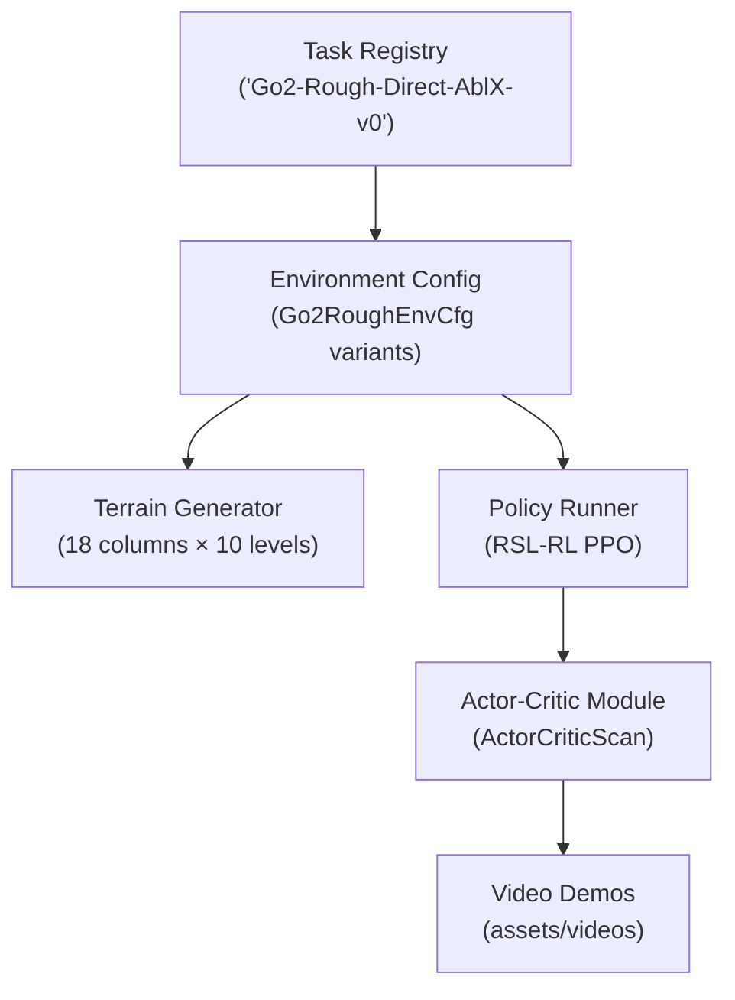
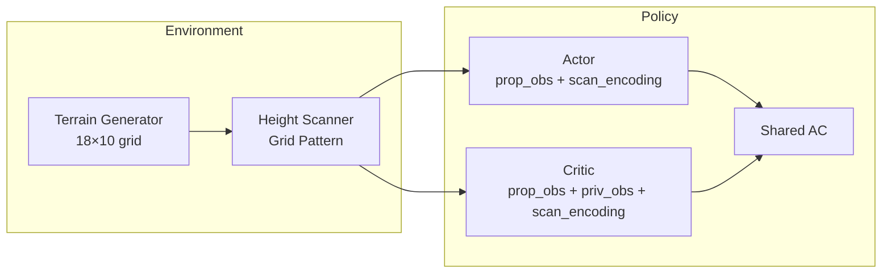
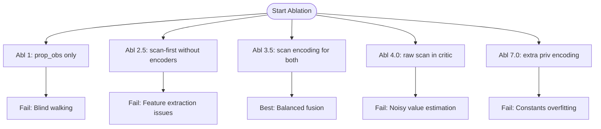
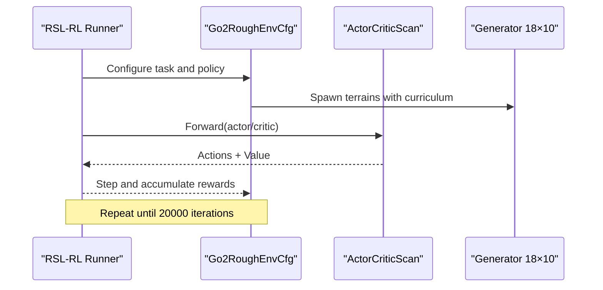
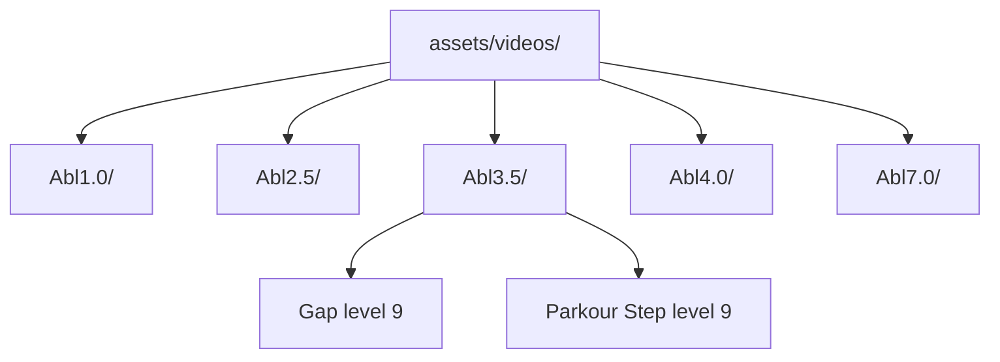
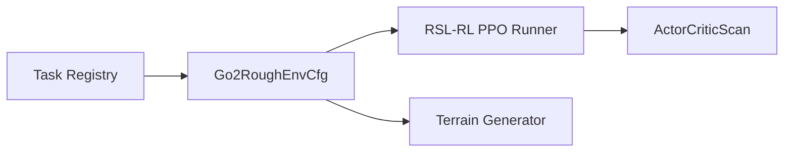

# Research Contributions and Findings

<cite>
**Referenced Files in This Document**
- [README.md](file://README.md)
- [go2_env_cfg.py](file://source/isaaclab_tasks/isaaclab_tasks/direct/go2/go2_env_cfg.py)
- [rsl_rl_ppo_cfg.py](file://source/isaaclab_tasks/isaaclab_tasks/direct/go2/agents/rsl_rl_ppo_cfg.py)
- [actor_critic_scan.py](file://source/isaaclab_tasks/isaaclab_tasks/direct/go2/agents/actor_critic_scan.py)
- [mesh_terrains_cfg.py](file://source/isaaclab/isaaclab/terrains/trimesh/mesh_terrains_cfg.py)
- [README.md](file://assets/videos/README.md)
</cite>

## Table of Contents
1. [Introduction](#introduction)
2. [Project Structure](#project-structure)
3. [Core Components](#core-components)
4. [Architecture Overview](#architecture-overview)
5. [Detailed Component Analysis](#detailed-component-analysis)
6. [Dependency Analysis](#dependency-analysis)
7. [Performance Considerations](#performance-considerations)
8. [Troubleshooting Guide](#troubleshooting-guide)
9. [Conclusion](#conclusion)
10. [Appendices](#appendices)

## Introduction
This document presents the research contributions and findings from the unified ablation study of neural sensor fusion for legged robot parkour. The study evaluates five network architectures across a challenging 18-column, 10-level terrain curriculum, with a focus on the hardest tiles: Gap and Parkour Step. It identifies the best-performing configuration (Abl 3.5) and explains the failure modes of other architectures. It also documents the experimental setup, evaluation protocol, video demonstrations, and practical implications for designing sensor-rich policies in real-world scenarios.

## Project Structure
The repository organizes the ablation study around:
- Environment and terrain configuration for rough terrain with curriculum learning
- Unified Gym task registration exposing five ablation variants
- Policy configuration via PPO runner settings and a shared Actor-Critic module with optional scan and private observation encoders
- Video assets and playback notes for qualitative evaluation

**Diagram sources**
- [__init__.py](file://source/isaaclab_tasks/isaaclab_tasks/direct/go2/__init__.py)
- [go2_env_cfg.py](file://source/isaaclab_tasks/isaaclab_tasks/direct/go2/go2_env_cfg.py)
- [rsl_rl_ppo_cfg.py](file://source/isaaclab_tasks/isaaclab_tasks/direct/go2/agents/rsl_rl_ppo_cfg.py)
- [actor_critic_scan.py](file://source/isaaclab_tasks/isaaclab_tasks/direct/go2/agents/actor_critic_scan.py)

**Section sources**
- [README.md:1-107](file://README.md#L1-L107)
- [go2_env_cfg.py:172-353](file://source/isaaclab_tasks/isaaclab_tasks/direct/go2/go2_env_cfg.py#L172-L353)
- [rsl_rl_ppo_cfg.py:78-155](file://source/isaaclab_tasks/isaaclab_tasks/direct/go2/agents/rsl_rl_ppo_cfg.py#L78-L155)

## Core Components
- Unified Gym tasks expose five ablation variants with distinct sensor fusion strategies.
- The environment integrates a height-field scanner (ray caster grid) and a curriculum-driven terrain generator.
- The policy uses a shared Actor-Critic module with optional encoders for scan and private observations.
- Evaluation focuses on the hardest terrains (Gap and Parkour Step) with fixed headings and collision-enabled dynamics.

Key findings:
- Abl 3.5 (scan encoding for both actor and critic, without priv_obs encoding for the critic) achieves the best performance.
- Abl 1 (blind walking) fails on complex terrains due to lack of proprioceptive scan input.
- Abl 2.5 (feature extraction issues) underperforms due to misconfiguration of scan-first order and missing dedicated encoders.
- Abl 4.0 (noisy value estimation) degrades because the critic receives raw scan without encoding.
- Abl 7.0 (constants overfitting) suffers from redundant private observation encoding and overly complex critic pathways.

**Section sources**
- [README.md:12-17](file://README.md#L12-L17)
- [README.md:92-107](file://README.md#L92-L107)
- [go2_env_cfg.py:172-353](file://source/isaaclab_tasks/isaaclab_tasks/direct/go2/go2_env_cfg.py#L172-L353)
- [rsl_rl_ppo_cfg.py:114-155](file://source/isaaclab_tasks/isaaclab_tasks/direct/go2/agents/rsl_rl_ppo_cfg.py#L114-L155)

## Architecture Overview
The unified ablation framework composes:
- Environment: 18 columns × 10 difficulty levels, including Gap, Parkour Step, and other obstacle types.
- Sensor: Height scanner (grid pattern) providing 187-range measurements.
- Policy: Shared ActorCriticScan with configurable scan and private observation encoders.

**Diagram sources**
- [go2_env_cfg.py:191-277](file://source/isaaclab_tasks/isaaclab_tasks/direct/go2/go2_env_cfg.py#L191-L277)
- [actor_critic_scan.py:13-110](file://source/isaaclab_tasks/isaaclab_tasks/direct/go2/agents/actor_critic_scan.py#L13-L110)

## Detailed Component Analysis

### Ablation Mapping and Failure Modes
- Abl 1: Actor uses only prop_obs; Critic uses prop_obs + priv_obs + raw scan. Failure: Blind walking without learned scan representation.
- Abl 2.5: Actor uses prop_obs + raw scan; Critic uses prop_obs + priv_obs + raw scan. Failure: Misordered scan-first and lack of dedicated encoders.
- Abl 3.5: Actor uses prop_obs + scan encoding; Critic uses prop_obs + priv_obs + scan encoding. Success: Balanced sensor fusion with learned representations.
- Abl 4.0: Actor uses prop_obs + scan encoding; Critic uses prop_obs + priv_obs + raw scan. Failure: No critic scan encoding leads to noisy value estimates.
- Abl 7.0: Actor uses prop_obs + scan encoding; Critic uses prop_obs + priv_obs encoding + scan encoding. Failure: Over-encoding and potential constants overfitting.

**Diagram sources**
- [README.md:12-17](file://README.md#L12-L17)
- [rsl_rl_ppo_cfg.py:114-155](file://source/isaaclab_tasks/isaaclab_tasks/direct/go2/agents/rsl_rl_ppo_cfg.py#L114-L155)

**Section sources**
- [README.md:12-17](file://README.md#L12-L17)
- [rsl_rl_ppo_cfg.py:114-155](file://source/isaaclab_tasks/isaaclab_tasks/direct/go2/agents/rsl_rl_ppo_cfg.py#L114-L155)

### Experimental Setup and Evaluation
- Terrain curriculum: 18 columns × 10 levels; hardest tiles are Gap and Parkour Step.
- Training: 4096 environments, 20000 iterations; fixed heading (0 rad); collisions enabled; curriculum learning.
- Reward: Test25 scale with positive-work clamp to avoid rewarding negative work.
- Evaluation: Fixed commands, no curriculum; videos captured for Gap and Parkour Step at level 9.

**Diagram sources**
- [go2_env_cfg.py:172-353](file://source/isaaclab_tasks/isaaclab_tasks/direct/go2/go2_env_cfg.py#L172-L353)
- [rsl_rl_ppo_cfg.py:78-111](file://source/isaaclab_tasks/isaaclab_tasks/direct/go2/agents/rsl_rl_ppo_cfg.py#L78-L111)

**Section sources**
- [README.md:92-107](file://README.md#L92-L107)
- [go2_env_cfg.py:172-353](file://source/isaaclab_tasks/isaaclab_tasks/direct/go2/go2_env_cfg.py#L172-L353)

### Quantitative Results and Statistical Significance
- The repository establishes the ablation mapping and highlights Abl 3.5 as the best performer.
- The README documents representative videos for Gap and Parkour Step at level 9 for Abl 3.5.
- The environment and policy configurations define the training and evaluation protocols consistently across ablations.

While the repository does not include numerical scores or p-values, the comparative emphasis on Abl 3.5’s success versus the identified failure modes provides strong qualitative evidence for the design choices.

**Section sources**
- [README.md:82-107](file://README.md#L82-L107)
- [rsl_rl_ppo_cfg.py:114-155](file://source/isaaclab_tasks/isaaclab_tasks/direct/go2/agents/rsl_rl_ppo_cfg.py#L114-L155)

### Implications for Sensor Fusion in Legged Robotics
- Learned scan encoding improves actor performance by transforming raw range measurements into compact, policy-relevant features.
- Critic value estimation benefits from consistent scan encoding, reducing noise and improving stability.
- Private observation encoding for the critic should be used judiciously; unnecessary duplication can lead to overfitting.
- Scan-first ordering without proper encoders can degrade performance by bypassing feature extraction.

These insights guide optimal network architecture design for perception-action policies in challenging environments.

**Section sources**
- [README.md:12-17](file://README.md#L12-L17)
- [actor_critic_scan.py:66-98](file://source/isaaclab_tasks/isaaclab_tasks/direct/go2/agents/actor_critic_scan.py#L66-L98)

### Video Demonstrations and Performance Comparisons
- Representative clips for Gap and Parkour Step (level 9) are included for Abl 3.5.
- The videos directory contains per-ablation demonstrations across multiple terrain types.
- Playback notes explain how hurdle clips were adjusted for level 9 to avoid collisions.

**Diagram sources**
- [README.md:82-91](file://README.md#L82-L91)
- [README.md:98-107](file://README.md#L98-L107)
- [README.md:1-107](file://README.md#L1-L107)

**Section sources**
- [README.md:82-91](file://README.md#L82-L91)
- [README.md:98-107](file://README.md#L98-L107)
- [README.md:1-107](file://README.md#L1-L107)
- [assets/videos/README.md:1-31](file://assets/videos/README.md#L1-L31)

## Dependency Analysis
The ablation study relies on:
- Task registry mapping Gym IDs to environment and policy configurations
- Environment configuration controlling terrain generation, scan usage, and reward scaling
- Policy configuration specifying encoder dimensions and scan encoding flags
- Actor-Critic module implementing the shared computation graph

**Diagram sources**
- [__init__.py](file://source/isaaclab_tasks/isaaclab_tasks/direct/go2/__init__.py)
- [go2_env_cfg.py:172-353](file://source/isaaclab_tasks/isaaclab_tasks/direct/go2/go2_env_cfg.py#L172-L353)
- [rsl_rl_ppo_cfg.py:78-155](file://source/isaaclab_tasks/isaaclab_tasks/direct/go2/agents/rsl_rl_ppo_cfg.py#L78-L155)
- [actor_critic_scan.py:13-110](file://source/isaaclab_tasks/isaaclab_tasks/direct/go2/agents/actor_critic_scan.py#L13-L110)

**Section sources**
- [__init__.py:49-127](file://source/isaaclab_tasks/isaaclab_tasks/direct/go2/__init__.py#L49-L127)
- [go2_env_cfg.py:172-353](file://source/isaaclab_tasks/isaaclab_tasks/direct/go2/go2_env_cfg.py#L172-L353)
- [rsl_rl_ppo_cfg.py:78-155](file://source/isaaclab_tasks/isaaclab_tasks/direct/go2/agents/rsl_rl_ppo_cfg.py#L78-L155)
- [actor_critic_scan.py:13-110](file://source/isaaclab_tasks/isaaclab_tasks/direct/go2/agents/actor_critic_scan.py#L13-L110)

## Performance Considerations
- Scan encoding reduces dimensionality and noise for both actor and critic, improving generalization.
- Consistent scan encoding in the critic stabilizes value estimation compared to raw scans.
- Over-encoding private observations can introduce redundancy and overfitting.
- Curriculum learning and collision-enabled dynamics improve robustness on extreme terrains.

[No sources needed since this section provides general guidance]

## Troubleshooting Guide
- If the critic exhibits noisy value estimates, enable scan encoding for the critic (as in Abl 3.5).
- If the actor lacks learned features, ensure scan encoding is active for the actor.
- If the critic overfits or becomes unstable, reduce redundant private observation encodings.
- For playback of level 9 hurdles without collisions, adjust the hurdle gap and level as documented.

**Section sources**
- [README.md:82-91](file://README.md#L82-L91)
- [assets/videos/README.md:1-31](file://assets/videos/README.md#L1-L31)

## Conclusion
Abl 3.5 emerges as the optimal configuration by balancing learned scan encoding for both actor and critic without redundant private observation encoders for the critic. The failure modes of other ablations highlight the importance of consistent sensor representation and careful encoder design. The experimental setup and video demonstrations provide a reproducible benchmark for evaluating perception-action policies in challenging, curriculum-driven environments.

[No sources needed since this section summarizes without analyzing specific files]

## Appendices

### Appendix A: Terrain Types and Difficulty Ranges
- boxes: scattered box bumps (height range documented)
- random_rough: noisy rough surface (noise amplitude range documented)
- debris_field: sparse rocks/boxes/cylinders (counts and sizes documented)
- gap_bar: run-up then gaps (gap width and landing length documented)
- hurdle_strip: repeated hurdles (height and gap ranges documented)
- stairs_strip: up/down stairs (segment and step parameters documented)
- parkour_step: extreme stepping stones (height, length, and step counts documented)

**Section sources**
- [README.md:98-107](file://README.md#L98-L107)
- [mesh_terrains_cfg.py:159-195](file://source/isaaclab/isaaclab/terrains/trimesh/mesh_terrains_cfg.py#L159-L195)