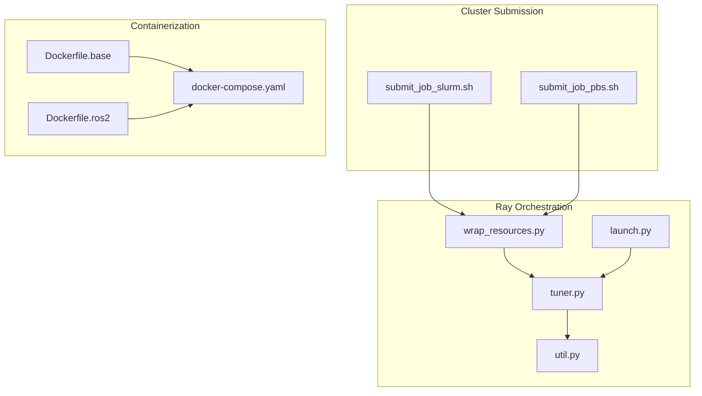
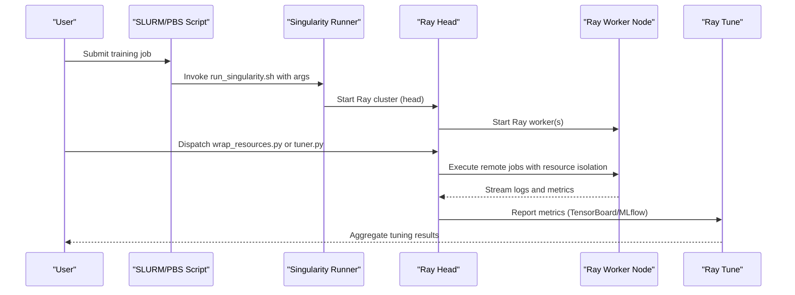
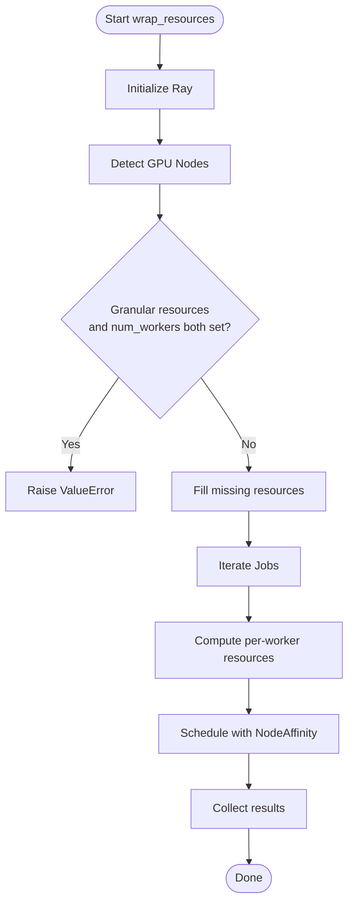
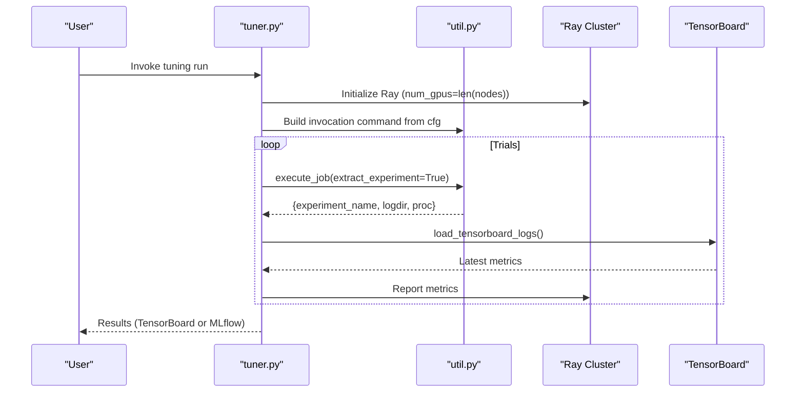
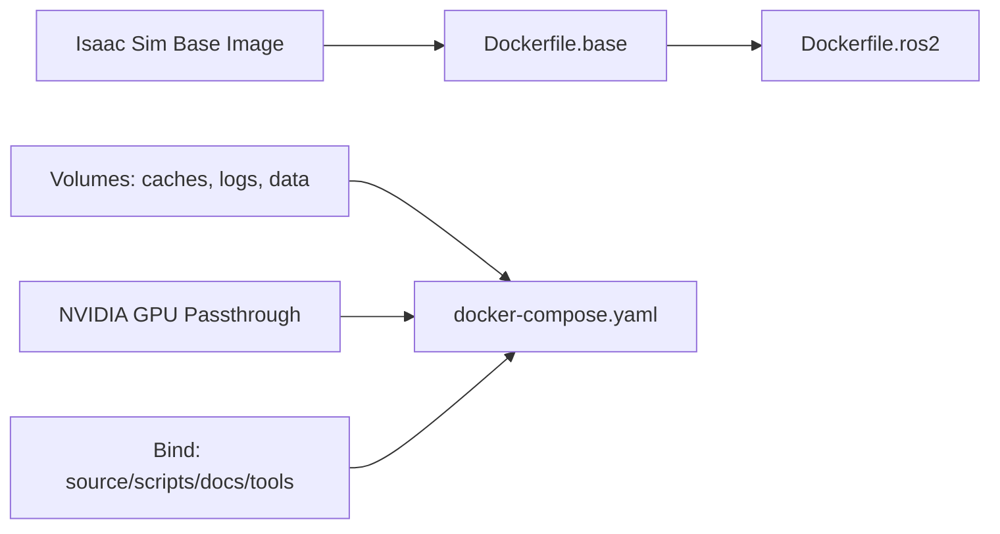
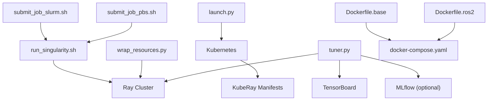

# Distributed Training Infrastructure

<cite>
**Referenced Files in This Document**
- [submit_job_slurm.sh](file://docker/cluster/submit_job_slurm.sh)
- [submit_job_pbs.sh](file://docker/cluster/submit_job_pbs.sh)
- [launch.py](file://scripts/reinforcement_learning/ray/launch.py)
- [util.py](file://scripts/reinforcement_learning/ray/util.py)
- [wrap_resources.py](file://scripts/reinforcement_learning/ray/wrap_resources.py)
- [tuner.py](file://scripts/reinforcement_learning/ray/tuner.py)
- [vision_cfg.py](file://scripts/reinforcement_learning/ray/hyperparameter_tuning/vision_cfg.py)
- [Dockerfile.base](file://docker/Dockerfile.base)
- [Dockerfile.ros2](file://docker/Dockerfile.ros2)
- [docker-compose.yaml](file://docker/docker-compose.yaml)
- [cluster.rst](file://docs/source/deployment/cluster.rst)
- [cloudxr_teleoperation_cluster.rst](file://docs/source/deployment/cloudxr_teleoperation_cluster.rst)
</cite>

## Table of Contents
1. [Introduction](#introduction)
2. [Project Structure](#project-structure)
3. [Core Components](#core-components)
4. [Architecture Overview](#architecture-overview)
5. [Detailed Component Analysis](#detailed-component-analysis)
6. [Dependency Analysis](#dependency-analysis)
7. [Performance Considerations](#performance-considerations)
8. [Troubleshooting Guide](#troubleshooting-guide)
9. [Conclusion](#conclusion)
10. [Appendices](#appendices)

## Introduction
This document describes the Distributed Training Infrastructure designed for multi-GPU and cluster-based reinforcement learning training. It covers Ray framework integration for distributed RL training, resource allocation and worker management, cluster configuration systems for SLURM and PBS, Docker containerization and orchestration, hyperparameter tuning with Ray Tune, monitoring/logging, checkpoint synchronization, fault tolerance, and practical deployment guidelines for cloud, HPC, and edge environments.

## Project Structure
The repository organizes distributed training assets under:
- docker/cluster: Job submission wrappers for SLURM and PBS and Singularity orchestration
- scripts/reinforcement_learning/ray: Ray cluster lifecycle, resource wrapping, tuning, and utilities
- docker: Containerization strategy for Isaac Lab with GPU passthrough and ROS2 support
- docs/source/deployment: Deployment guides for cluster and cloud XR teleoperation

**Diagram sources**
- [submit_job_slurm.sh:1-26](file://docker/cluster/submit_job_slurm.sh#L1-L26)
- [submit_job_pbs.sh:1-24](file://docker/cluster/submit_job_pbs.sh#L1-L24)
- [launch.py:1-181](file://scripts/reinforcement_learning/ray/launch.py#L1-L181)
- [wrap_resources.py:1-151](file://scripts/reinforcement_learning/ray/wrap_resources.py#L1-L151)
- [tuner.py:1-464](file://scripts/reinforcement_learning/ray/tuner.py#L1-L464)
- [util.py:1-484](file://scripts/reinforcement_learning/ray/util.py#L1-L484)
- [Dockerfile.base:1-112](file://docker/Dockerfile.base#L1-L112)
- [Dockerfile.ros2:1-40](file://docker/Dockerfile.ros2#L1-L40)
- [docker-compose.yaml:1-154](file://docker/docker-compose.yaml#L1-L154)

**Section sources**
- [cluster.rst:126-164](file://docs/source/deployment/cluster.rst#L126-L164)

## Core Components
- Cluster job submission (SLURM/PBS): Scripts generate job descriptors and invoke containerized training via Singularity.
- Ray cluster lifecycle: Launch KubeRay clusters on cloud providers with templated manifests.
- Resource-aware job dispatch: Wrap arbitrary commands into Ray remote tasks with GPU/CPU/memory isolation.
- Hyperparameter tuning: Ray Tune orchestrates sweeps, reads TensorBoard metrics, and integrates with MLflow.
- Containerization: Base image builds Isaac Lab on top of Isaac Sim; ROS2 image extends base; docker-compose defines GPU passthrough and persistent volumes.

**Section sources**
- [submit_job_slurm.sh:1-26](file://docker/cluster/submit_job_slurm.sh#L1-L26)
- [submit_job_pbs.sh:1-24](file://docker/cluster/submit_job_pbs.sh#L1-L24)
- [launch.py:1-181](file://scripts/reinforcement_learning/ray/launch.py#L1-L181)
- [wrap_resources.py:1-151](file://scripts/reinforcement_learning/ray/wrap_resources.py#L1-L151)
- [tuner.py:1-464](file://scripts/reinforcement_learning/ray/tuner.py#L1-L464)
- [util.py:1-484](file://scripts/reinforcement_learning/ray/util.py#L1-L484)
- [Dockerfile.base:1-112](file://docker/Dockerfile.base#L1-L112)
- [Dockerfile.ros2:1-40](file://docker/Dockerfile.ros2#L1-L40)
- [docker-compose.yaml:1-154](file://docker/docker-compose.yaml#L1-L154)

## Architecture Overview
The system integrates cluster schedulers, containerization, and Ray for distributed training:

**Diagram sources**
- [submit_job_slurm.sh:1-26](file://docker/cluster/submit_job_slurm.sh#L1-L26)
- [submit_job_pbs.sh:1-24](file://docker/cluster/submit_job_pbs.sh#L1-L24)
- [wrap_resources.py:1-151](file://scripts/reinforcement_learning/ray/wrap_resources.py#L1-L151)
- [tuner.py:1-464](file://scripts/reinforcement_learning/ray/tuner.py#L1-L464)
- [util.py:1-484](file://scripts/reinforcement_learning/ray/util.py#L1-L484)

## Detailed Component Analysis

### Cluster Job Submission (SLURM and PBS)
- SLURM: Generates a job script with resource directives (CPUs, GPUs, memory, time), then submits via sbatch. The job invokes the Singularity runner with the project path and training arguments.
- PBS: Similar pattern with PBS directives and qsub submission.

Operational notes:
- Internet access is required on compute nodes to fetch assets from the Nucleus server.
- Proxy modules (e.g., eth_proxy) may need to be loaded depending on cluster policies.

**Section sources**
- [submit_job_slurm.sh:1-26](file://docker/cluster/submit_job_slurm.sh#L1-L26)
- [submit_job_pbs.sh:1-24](file://docker/cluster/submit_job_pbs.sh#L1-L24)
- [cluster.rst:126-164](file://docs/source/deployment/cluster.rst#L126-L164)

### Ray Cluster Lifecycle (Kubernetes/KubeRay)
- The launcher script loads a Jinja2 template for KubeRay manifests, renders parameters (image, accelerators, GPU counts), and applies them via kubectl.
- Supports heterogeneous worker configurations and multiple cluster creation.

Cloud XR Teleoperation cluster (microK8s + GPU Operator) is documented for local edge/cloud setups.

**Section sources**
- [launch.py:1-181](file://scripts/reinforcement_learning/ray/launch.py#L1-L181)
- [cloudxr_teleoperation_cluster.rst:152-204](file://docs/source/deployment/cloudxr_teleoperation_cluster.rst#L152-L204)

### Resource-Aware Job Dispatch and Worker Management
- The resource wrapper discovers GPU-enabled nodes, validates resource constraints, and dispatches jobs with Ray remote execution decorated with GPU/CPU/memory and node affinity.
- Supports automatic distribution across nodes and manual resource isolation per worker.

**Diagram sources**
- [wrap_resources.py:68-122](file://scripts/reinforcement_learning/ray/wrap_resources.py#L68-L122)
- [util.py:310-367](file://scripts/reinforcement_learning/ray/util.py#L310-L367)

**Section sources**
- [wrap_resources.py:1-151](file://scripts/reinforcement_learning/ray/wrap_resources.py#L1-L151)
- [util.py:310-367](file://scripts/reinforcement_learning/ray/util.py#L310-L367)

### Hyperparameter Tuning with Ray Tune
- The tuner converts a configuration into a Ray Tune job, spawning trials that execute training workflows and stream metrics from TensorBoard logs.
- Supports local logging and remote MLflow tracking.
- Includes a stopper to halt tuning on repeated log extraction errors and a configurable timeout for unresponsive processes.

**Diagram sources**
- [tuner.py:87-159](file://scripts/reinforcement_learning/ray/tuner.py#L87-L159)
- [util.py:115-307](file://scripts/reinforcement_learning/ray/util.py#L115-L307)

**Section sources**
- [tuner.py:1-464](file://scripts/reinforcement_learning/ray/tuner.py#L1-L464)
- [util.py:20-52](file://scripts/reinforcement_learning/ray/util.py#L20-L52)

### Containerization Strategy
- Base image: Builds Isaac Lab on top of Isaac Sim, sets aliases, and prepares caches for Singularity compatibility.
- ROS2 image: Extends base with ROS2 Humble and RMW configs.
- docker-compose: Defines GPU passthrough, persistent volumes for caches/logs/data, and bind-mounts for source/scripts/docs/tools.

**Diagram sources**
- [Dockerfile.base:1-112](file://docker/Dockerfile.base#L1-L112)
- [Dockerfile.ros2:1-40](file://docker/Dockerfile.ros2#L1-L40)
- [docker-compose.yaml:1-154](file://docker/docker-compose.yaml#L1-L154)

**Section sources**
- [Dockerfile.base:1-112](file://docker/Dockerfile.base#L1-L112)
- [Dockerfile.ros2:1-40](file://docker/Dockerfile.ros2#L1-L40)
- [docker-compose.yaml:1-154](file://docker/docker-compose.yaml#L1-L154)

### Monitoring, Logging, and Fault Tolerance
- Metrics: TensorBoard scalars are parsed periodically; MLflow callback supports remote tracking.
- Experiment discovery: Training logs must print a specific experiment name and log directory line for reliable extraction.
- Fault tolerance: Dedicated stopper halts tuning after excessive log extraction errors; unresponsive processes are terminated after a timeout.

**Section sources**
- [tuner.py:173-204](file://scripts/reinforcement_learning/ray/tuner.py#L173-L204)
- [util.py:215-301](file://scripts/reinforcement_learning/ray/util.py#L215-L301)

## Dependency Analysis
- Cluster submission scripts depend on Singularity runner and cluster schedulers (SLURM/PBS).
- Ray orchestration depends on Kubernetes and KubeRay; cluster manifests are templated.
- Resource wrapper depends on Ray runtime and node resource discovery utilities.
- Tuner depends on Ray Tune, TensorBoard parsing, and optional MLflow callback.
- Containerization depends on NVIDIA container runtime and docker-compose profiles.

**Diagram sources**
- [submit_job_slurm.sh:1-26](file://docker/cluster/submit_job_slurm.sh#L1-L26)
- [submit_job_pbs.sh:1-24](file://docker/cluster/submit_job_pbs.sh#L1-L24)
- [launch.py:1-181](file://scripts/reinforcement_learning/ray/launch.py#L1-L181)
- [wrap_resources.py:1-151](file://scripts/reinforcement_learning/ray/wrap_resources.py#L1-L151)
- [tuner.py:1-464](file://scripts/reinforcement_learning/ray/tuner.py#L1-L464)
- [util.py:1-484](file://scripts/reinforcement_learning/ray/util.py#L1-L484)
- [Dockerfile.base:1-112](file://docker/Dockerfile.base#L1-L112)
- [Dockerfile.ros2:1-40](file://docker/Dockerfile.ros2#L1-L40)
- [docker-compose.yaml:1-154](file://docker/docker-compose.yaml#L1-L154)

**Section sources**
- [launch.py:1-181](file://scripts/reinforcement_learning/ray/launch.py#L1-L181)
- [wrap_resources.py:1-151](file://scripts/reinforcement_learning/ray/wrap_resources.py#L1-L151)
- [tuner.py:1-464](file://scripts/reinforcement_learning/ray/tuner.py#L1-L464)
- [util.py:1-484](file://scripts/reinforcement_learning/ray/util.py#L1-L484)
- [docker-compose.yaml:1-154](file://docker/docker-compose.yaml#L1-L154)

## Performance Considerations
- Resource packing: Use NodeAffinity and PlacementGroupFactory to tightly pack workers onto nodes and minimize cross-node communication.
- Batch sizing: Derive minibatch sizes from environment count and horizon length to maintain throughput without OOM.
- Logging overhead: Tune reporting intervals and lazy metric polling to reduce overhead.
- GPU utilization: Ensure CUDA_VISIBLE_DEVICES alignment and avoid oversubscription; leverage num_workers_per_node for multi-GPU machines.
- Network mode: Host networking can reduce latency in some cluster setups; evaluate trade-offs with port conflicts.

[No sources needed since this section provides general guidance]

## Troubleshooting Guide
Common issues and resolutions:
- GPU visibility mismatch: The executor validates GPU counts via nvidia-smi and PyTorch; resetting CUDA_VISIBLE_DEVICES ensures isolation is effective.
- Log extraction failures: Training must emit the experiment name and log directory lines; otherwise, a dedicated stopper terminates tuning after threshold errors.
- Unresponsive processes: A timeout-based termination prevents hanging trials; adjust timeouts according to workload characteristics.
- Cluster internet access: Some HPC networks require proxy modules; configure cluster scripts accordingly.
- Kubernetes GPU operator: On microK8s, verify GPU operator pods are Running before deploying Ray clusters.

**Section sources**
- [util.py:151-204](file://scripts/reinforcement_learning/ray/util.py#L151-L204)
- [util.py:292-301](file://scripts/reinforcement_learning/ray/util.py#L292-L301)
- [tuner.py:173-204](file://scripts/reinforcement_learning/ray/tuner.py#L173-L204)
- [cluster.rst:150-152](file://docs/source/deployment/cluster.rst#L150-L152)
- [cloudxr_teleoperation_cluster.rst:182-202](file://docs/source/deployment/cloudxr_teleoperation_cluster.rst#L182-L202)

## Conclusion
The infrastructure combines SLURM/PBS job submission, containerized environments, and Ray orchestration to enable scalable multi-GPU and cluster-based reinforcement learning. Ray Tune automates hyperparameter sweeps with robust logging and fault tolerance. The containerization strategy ensures reproducible environments with GPU passthrough and persistent storage. The provided guides and scripts facilitate deployment across cloud, HPC, and edge scenarios.

[No sources needed since this section summarizes without analyzing specific files]

## Appendices

### Practical Setup Examples
- SLURM job parameters: Adjust CPUs, GPUs, memory, and time in the SLURM script; ensure internet access and optional proxy modules.
- PBS job parameters: Configure select directives and queue; mirror SLURM resource mapping.
- KubeRay cluster creation: Provide image, accelerators, and GPU counts; render and apply templated manifests.
- Container builds: Build base and ROS2 images; run services with docker-compose; mount persistent volumes for logs and data.

**Section sources**
- [submit_job_slurm.sh:1-26](file://docker/cluster/submit_job_slurm.sh#L1-L26)
- [submit_job_pbs.sh:1-24](file://docker/cluster/submit_job_pbs.sh#L1-L24)
- [launch.py:1-181](file://scripts/reinforcement_learning/ray/launch.py#L1-L181)
- [docker-compose.yaml:1-154](file://docker/docker-compose.yaml#L1-L154)

### Hyperparameter Tuning Configuration
- Define sweep ranges and distributions in a configuration class; the tuner translates them into Ray Tune jobs and streams metrics.
- Choose local or remote run modes; remote mode requires an accessible MLflow server.

**Section sources**
- [tuner.py:206-292](file://scripts/reinforcement_learning/ray/tuner.py#L206-L292)
- [vision_cfg.py:1-152](file://scripts/reinforcement_learning/ray/hyperparameter_tuning/vision_cfg.py#L1-L152)