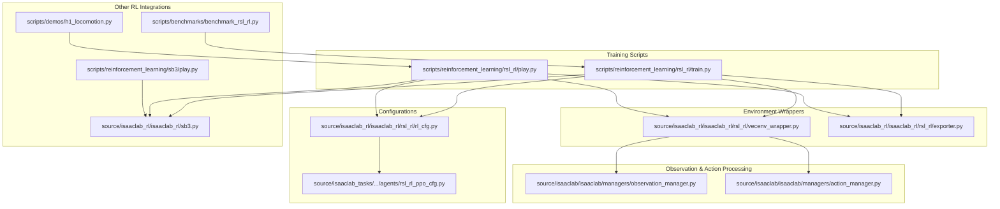
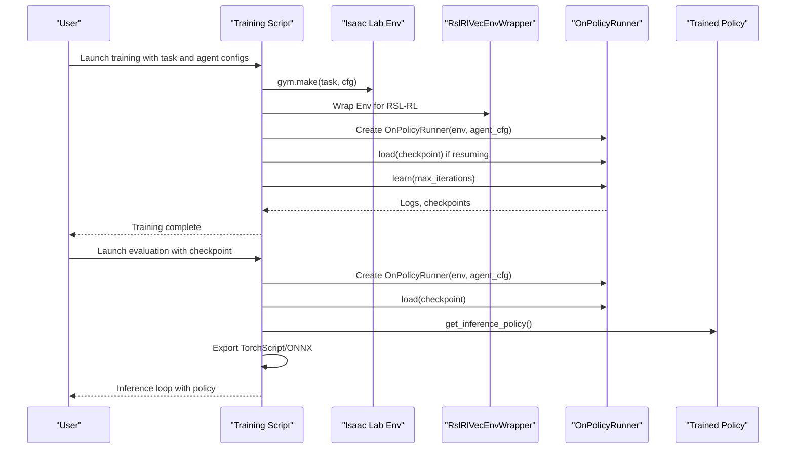
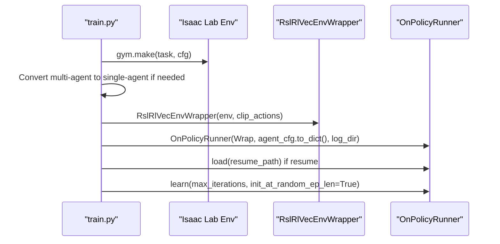
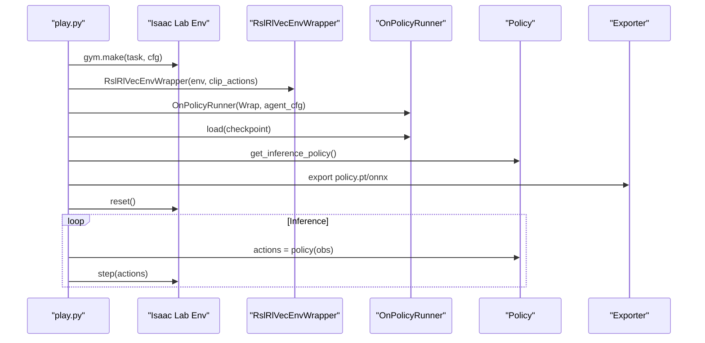
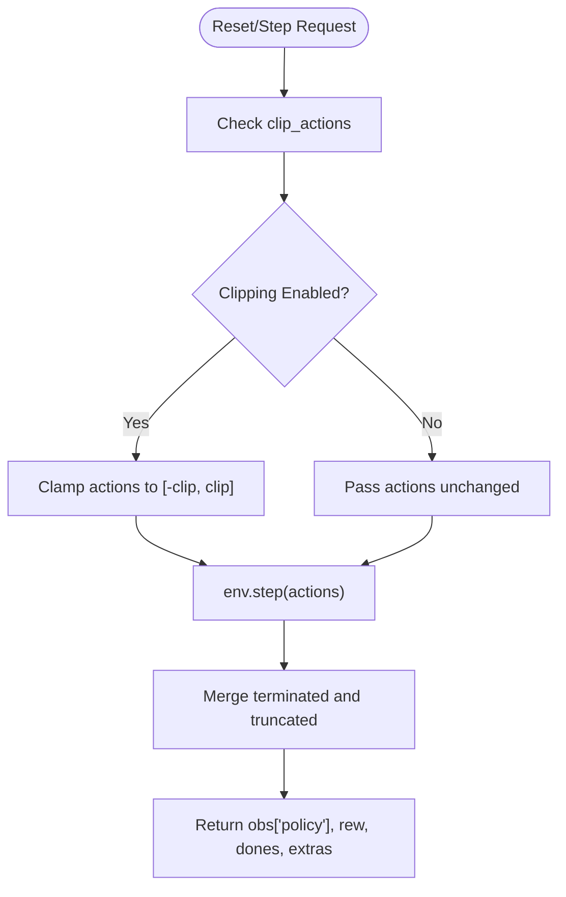
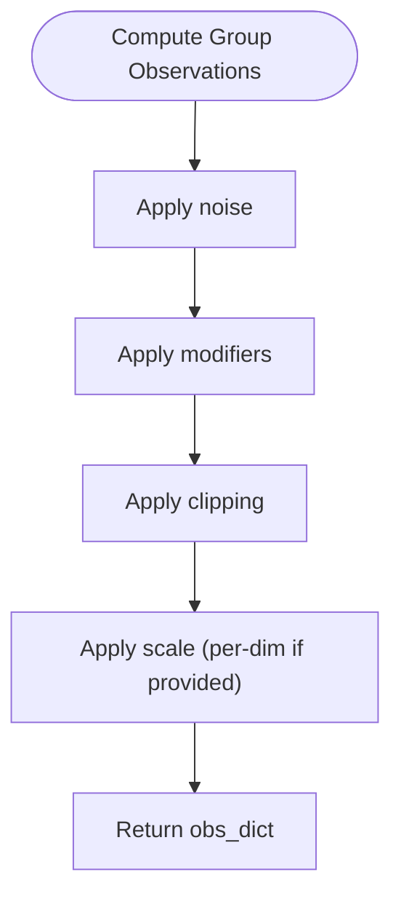
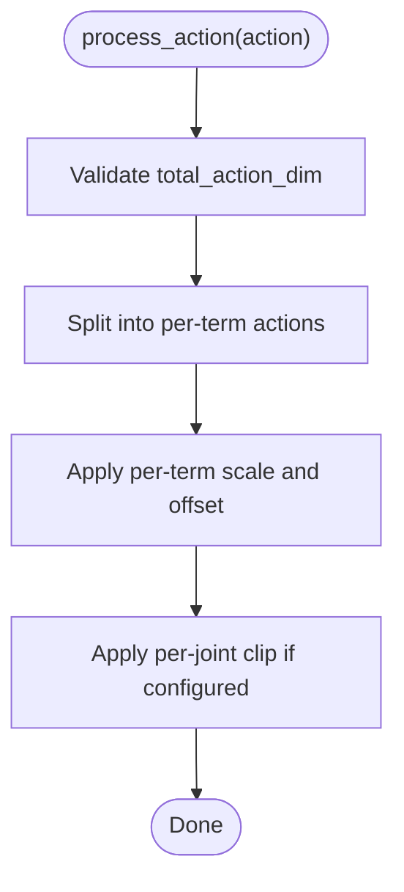
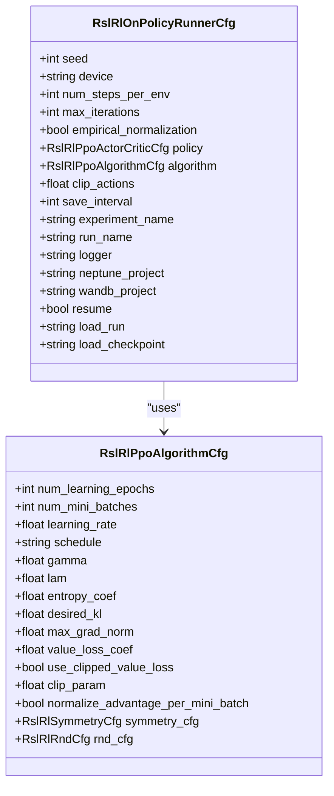
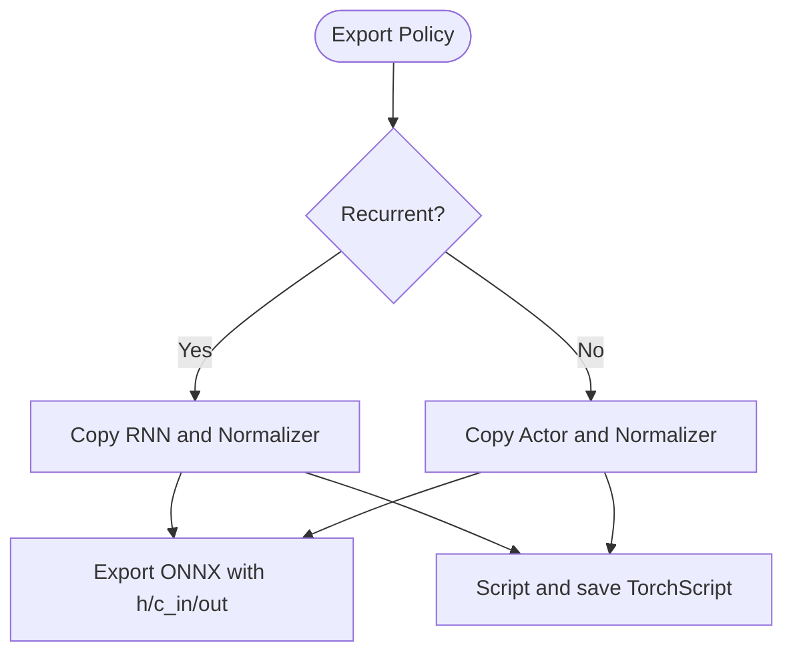
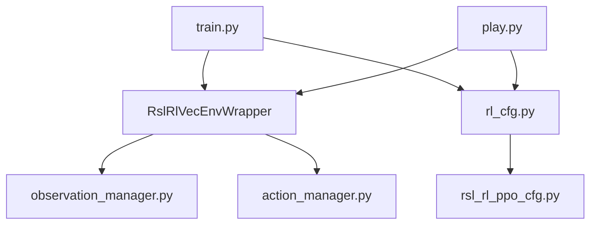

# PPO Training Pipeline

<cite>
**Referenced Files in This Document**
- [scripts/reinforcement_learning/rsl_rl/train.py](file://scripts/reinforcement_learning/rsl_rl/train.py)
- [scripts/reinforcement_learning/rsl_rl/play.py](file://scripts/reinforcement_learning/rsl_rl/play.py)
- [source/isaaclab_rl/isaaclab_rl/rsl_rl/vecenv_wrapper.py](file://source/isaaclab_rl/isaaclab_rl/rsl_rl/vecenv_wrapper.py)
- [source/isaaclab_rl/isaaclab_rl/rsl_rl/exporter.py](file://source/isaaclab_rl/isaaclab_rl/rsl_rl/exporter.py)
- [source/isaaclab_rl/isaaclab_rl/rsl_rl/rl_cfg.py](file://source/isaaclab_rl/isaaclab_rl/rsl_rl/rl_cfg.py)
- [source/isaaclab_tasks/isaaclab_tasks/manager_based/locomotion/velocity/config/anymal_c/agents/rsl_rl_ppo_cfg.py](file://source/isaaclab_tasks/isaaclab_tasks/manager_based/locomotion/velocity/config/anymal_c/agents/rsl_rl_ppo_cfg.py)
- [source/isaaclab/isaaclab/managers/observation_manager.py](file://source/isaaclab/isaaclab/managers/observation_manager.py)
- [source/isaaclab/isaaclab/managers/action_manager.py](file://source/isaaclab/isaaclab/managers/action_manager.py)
- [source/isaaclab_rl/isaaclab_rl/sb3.py](file://source/isaaclab_rl/isaaclab_rl/sb3.py)
- [scripts/benchmarks/benchmark_rsl_rl.py](file://scripts/benchmarks/benchmark_rsl_rl.py)
- [scripts/demos/h1_locomotion.py](file://scripts/demos/h1_locomotion.py)
- [scripts/reinforcement_learning/sb3/play.py](file://scripts/reinforcement_learning/sb3/play.py)
</cite>

## Table of Contents
1. [Introduction](#introduction)
2. [Project Structure](#project-structure)
3. [Core Components](#core-components)
4. [Architecture Overview](#architecture-overview)
5. [Detailed Component Analysis](#detailed-component-analysis)
6. [Dependency Analysis](#dependency-analysis)
7. [Performance Considerations](#performance-considerations)
8. [Troubleshooting Guide](#troubleshooting-guide)
9. [Conclusion](#conclusion)
10. [Appendices](#appendices)

## Introduction
This document explains the PPO training pipeline implemented with RSL-RL in the repository, including environment initialization, RSL-RL integration, training loop orchestration, hyperparameter management, environment wrapper functionality, observation preprocessing, action scaling, evaluation pipeline, checkpoint loading, policy inference, exporter for deployment, and integration with other RL frameworks (SKRL, SB3). It also covers practical configuration examples, hyperparameter tuning strategies, convergence monitoring, optimization techniques, memory management, performance profiling, and troubleshooting for common training issues.

## Project Structure
The PPO pipeline spans three major areas:
- Training and evaluation scripts for RSL-RL
- Environment wrapper and exporter utilities
- Configuration classes for PPO hyperparameters and runner settings

**Diagram sources**
- [scripts/reinforcement_learning/rsl_rl/train.py:119-212](file://scripts/reinforcement_learning/rsl_rl/train.py#L119-L212)
- [scripts/reinforcement_learning/rsl_rl/play.py:93-170](file://scripts/reinforcement_learning/rsl_rl/play.py#L93-L170)
- [source/isaaclab_rl/isaaclab_rl/rsl_rl/vecenv_wrapper.py:14-210](file://source/isaaclab_rl/isaaclab_rl/rsl_rl/vecenv_wrapper.py#L14-L210)
- [source/isaaclab_rl/isaaclab_rl/rsl_rl/exporter.py:11-230](file://source/isaaclab_rl/isaaclab_rl/rsl_rl/exporter.py#L11-L230)
- [source/isaaclab_rl/isaaclab_rl/rsl_rl/rl_cfg.py:22-231](file://source/isaaclab_rl/isaaclab_rl/rsl_rl/rl_cfg.py#L22-L231)
- [source/isaaclab_tasks/isaaclab_tasks/manager_based/locomotion/velocity/config/anymal_c/agents/rsl_rl_ppo_cfg.py:14-99](file://source/isaaclab_tasks/isaaclab_tasks/manager_based/locomotion/velocity/config/anymal_c/agents/rsl_rl_ppo_cfg.py#L14-L99)
- [source/isaaclab/isaaclab/managers/observation_manager.py:292-364](file://source/isaaclab/isaaclab/managers/observation_manager.py#L292-L364)
- [source/isaaclab/isaaclab/managers/action_manager.py:371-392](file://source/isaaclab/isaaclab/managers/action_manager.py#L371-L392)
- [source/isaaclab_rl/isaaclab_rl/sb3.py:298-348](file://source/isaaclab_rl/isaaclab_rl/sb3.py#L298-L348)
- [scripts/benchmarks/benchmark_rsl_rl.py:158-190](file://scripts/benchmarks/benchmark_rsl_rl.py#L158-L190)
- [scripts/demos/h1_locomotion.py:81-101](file://scripts/demos/h1_locomotion.py#L81-L101)
- [scripts/reinforcement_learning/sb3/play.py:154-177](file://scripts/reinforcement_learning/sb3/play.py#L154-L177)

**Section sources**
- [scripts/reinforcement_learning/rsl_rl/train.py:119-212](file://scripts/reinforcement_learning/rsl_rl/train.py#L119-L212)
- [scripts/reinforcement_learning/rsl_rl/play.py:93-170](file://scripts/reinforcement_learning/rsl_rl/play.py#L93-L170)
- [source/isaaclab_rl/isaaclab_rl/rsl_rl/vecenv_wrapper.py:14-210](file://source/isaaclab_rl/isaaclab_rl/rsl_rl/vecenv_wrapper.py#L14-L210)
- [source/isaaclab_rl/isaaclab_rl/rsl_rl/exporter.py:11-230](file://source/isaaclab_rl/isaaclab_rl/rsl_rl/exporter.py#L11-L230)
- [source/isaaclab_rl/isaaclab_rl/rsl_rl/rl_cfg.py:22-231](file://source/isaaclab_rl/isaaclab_rl/rsl_rl/rl_cfg.py#L22-L231)
- [source/isaaclab_tasks/isaaclab_tasks/manager_based/locomotion/velocity/config/anymal_c/agents/rsl_rl_ppo_cfg.py:14-99](file://source/isaaclab_tasks/isaaclab_tasks/manager_based/locomotion/velocity/config/anymal_c/agents/rsl_rl_ppo_cfg.py#L14-L99)
- [source/isaaclab/isaaclab/managers/observation_manager.py:292-364](file://source/isaaclab/isaaclab/managers/observation_manager.py#L292-L364)
- [source/isaaclab/isaaclab/managers/action_manager.py:371-392](file://source/isaaclab/isaaclab/managers/action_manager.py#L371-L392)
- [source/isaaclab_rl/isaaclab_rl/sb3.py:298-348](file://source/isaaclab_rl/isaaclab_rl/sb3.py#L298-L348)
- [scripts/benchmarks/benchmark_rsl_rl.py:158-190](file://scripts/benchmarks/benchmark_rsl_rl.py#L158-L190)
- [scripts/demos/h1_locomotion.py:81-101](file://scripts/demos/h1_locomotion.py#L81-L101)
- [scripts/reinforcement_learning/sb3/play.py:154-177](file://scripts/reinforcement_learning/sb3/play.py#L154-L177)

## Core Components
- RSL-RL Runner and Wrapper
  - The training script constructs an environment via gym.make, optionally wraps it for video, then wraps it for RSL-RL using a vectorized environment wrapper. It then creates an OnPolicyRunner and starts training.
  - The evaluation script loads a checkpoint, obtains an inference policy, and runs inference loops with optional exporting of TorchScript and ONNX models.
- Environment Wrapper
  - The RSL-RL vectorized environment wrapper adapts the Isaac Lab environment to RSL-RL’s VecEnv interface, handles privileged observations, action clipping, and step semantics compatible with RSL-RL.
- Configuration System
  - PPO hyperparameters and runner settings are defined via typed configuration classes. Example configurations demonstrate learning rates, discount factors, GAE lambda, entropy coefficients, mini-batches, epochs, and optional symmetry augmentation.
- Observation and Action Processing
  - Observation manager computes grouped observations and supports scaling, clipping, and noise. Action manager validates and processes actions, applying scales and offsets.
- Exporter
  - Policy export utilities export the trained policy to TorchScript (.pt) and ONNX formats, including support for recurrent policies and optional observation normalization.

**Section sources**
- [scripts/reinforcement_learning/rsl_rl/train.py:166-212](file://scripts/reinforcement_learning/rsl_rl/train.py#L166-L212)
- [scripts/reinforcement_learning/rsl_rl/play.py:126-170](file://scripts/reinforcement_learning/rsl_rl/play.py#L126-L170)
- [source/isaaclab_rl/isaaclab_rl/rsl_rl/vecenv_wrapper.py:14-210](file://source/isaaclab_rl/isaaclab_rl/rsl_rl/vecenv_wrapper.py#L14-L210)
- [source/isaaclab_rl/isaaclab_rl/rsl_rl/rl_cfg.py:22-231](file://source/isaaclab_rl/isaaclab_rl/rsl_rl/rl_cfg.py#L22-L231)
- [source/isaaclab_tasks/isaaclab_tasks/manager_based/locomotion/velocity/config/anymal_c/agents/rsl_rl_ppo_cfg.py:14-99](file://source/isaaclab_tasks/isaaclab_tasks/manager_based/locomotion/velocity/config/anymal_c/agents/rsl_rl_ppo_cfg.py#L14-L99)
- [source/isaaclab/isaaclab/managers/observation_manager.py:292-364](file://source/isaaclab/isaaclab/managers/observation_manager.py#L292-L364)
- [source/isaaclab/isaaclab/managers/action_manager.py:371-392](file://source/isaaclab/isaaclab/managers/action_manager.py#L371-L392)
- [source/isaaclab_rl/isaaclab_rl/rsl_rl/exporter.py:11-230](file://source/isaaclab_rl/isaaclab_rl/rsl_rl/exporter.py#L11-L230)

## Architecture Overview
The PPO pipeline integrates Isaac Lab environments with RSL-RL via a vectorized wrapper, manages hyperparameters through configuration classes, and supports evaluation and deployment exports.

**Diagram sources**
- [scripts/reinforcement_learning/rsl_rl/train.py:166-212](file://scripts/reinforcement_learning/rsl_rl/train.py#L166-L212)
- [scripts/reinforcement_learning/rsl_rl/play.py:126-170](file://scripts/reinforcement_learning/rsl_rl/play.py#L126-L170)
- [source/isaaclab_rl/isaaclab_rl/rsl_rl/vecenv_wrapper.py:14-210](file://source/isaaclab_rl/isaaclab_rl/rsl_rl/vecenv_wrapper.py#L14-L210)

## Detailed Component Analysis

### Training Orchestration (RSL-RL)
- Environment creation and wrapping
  - The training script builds the environment via gym.make, optionally converts multi-agent to single-agent, records videos if enabled, and wraps the environment for RSL-RL with optional action clipping.
- Runner initialization and checkpoint loading
  - The OnPolicyRunner is initialized with environment, agent configuration, and logging directory. If resuming, a checkpoint is loaded.
- Hyperparameter dumping and training loop
  - Environment and agent configurations are dumped to YAML/PKL. The runner executes the learning loop for a specified number of iterations.

**Diagram sources**
- [scripts/reinforcement_learning/rsl_rl/train.py:166-212](file://scripts/reinforcement_learning/rsl_rl/train.py#L166-L212)
- [source/isaaclab_rl/isaaclab_rl/rsl_rl/vecenv_wrapper.py:14-210](file://source/isaaclab_rl/isaaclab_rl/rsl_rl/vecenv_wrapper.py#L14-L210)

**Section sources**
- [scripts/reinforcement_learning/rsl_rl/train.py:119-212](file://scripts/reinforcement_learning/rsl_rl/train.py#L119-L212)

### Evaluation Pipeline (RSL-RL)
- Checkpoint resolution and environment setup
  - The evaluation script resolves a checkpoint path (local, published pretrained, or explicit), wraps the environment for RSL-RL, and loads the runner.
- Policy extraction and export
  - The trained policy is extracted for inference. The policy and observation normalizer are exported to TorchScript and ONNX formats.
- Inference loop
  - The script steps the environment using the policy in inference mode, optionally recording a single video, and sleeps to maintain real-time stepping if requested.

**Diagram sources**
- [scripts/reinforcement_learning/rsl_rl/play.py:126-198](file://scripts/reinforcement_learning/rsl_rl/play.py#L126-L198)
- [source/isaaclab_rl/isaaclab_rl/rsl_rl/exporter.py:11-230](file://source/isaaclab_rl/isaaclab_rl/rsl_rl/exporter.py#L11-L230)

**Section sources**
- [scripts/reinforcement_learning/rsl_rl/play.py:93-198](file://scripts/reinforcement_learning/rsl_rl/play.py#L93-L198)
- [source/isaaclab_rl/isaaclab_rl/rsl_rl/exporter.py:11-230](file://source/isaaclab_rl/isaaclab_rl/rsl_rl/exporter.py#L11-L230)

### Environment Wrapper Functionality
- Dimension discovery
  - The wrapper queries the underlying environment for observation and action dimensions, including privileged observations for asymmetric actor-critic setups.
- Action clipping and reset behavior
  - Actions are optionally clamped to a specified range. The wrapper resets the environment at startup since the RSL-RL runner does not call reset.
- Step semantics
  - The wrapper returns observations under the "policy" key, combines termination and truncation into a single done signal, and forwards extra observations and timeouts for infinite-horizon tasks.

**Diagram sources**
- [source/isaaclab_rl/isaaclab_rl/rsl_rl/vecenv_wrapper.py:165-188](file://source/isaaclab_rl/isaaclab_rl/rsl_rl/vecenv_wrapper.py#L165-L188)

**Section sources**
- [source/isaaclab_rl/isaaclab_rl/rsl_rl/vecenv_wrapper.py:61-89](file://source/isaaclab_rl/isaaclab_rl/rsl_rl/vecenv_wrapper.py#L61-L89)
- [source/isaaclab_rl/isaaclab_rl/rsl_rl/vecenv_wrapper.py:165-188](file://source/isaaclab_rl/isaaclab_rl/rsl_rl/vecenv_wrapper.py#L165-L188)

### Observation Preprocessing
- Observation computation pipeline
  - Observations are computed per group, with noise applied first, followed by modifiers, clipping, and scaling. Scaling can be applied per-dimension and validated against expected shapes.
- Image observation handling (SB3 integration)
  - When integrating with SB3, image observations are validated and normalized appropriately, including dtype conversion and channel-first reshaping if needed.

**Diagram sources**
- [source/isaaclab/isaaclab/managers/observation_manager.py:346-358](file://source/isaaclab/isaaclab/managers/observation_manager.py#L346-L358)

**Section sources**
- [source/isaaclab/isaaclab/managers/observation_manager.py:292-364](file://source/isaaclab/isaaclab/managers/observation_manager.py#L292-L364)
- [source/isaaclab_rl/isaaclab_rl/sb3.py:298-348](file://source/isaaclab_rl/isaaclab_rl/sb3.py#L298-L348)

### Action Scaling Mechanisms
- Action processing
  - Actions are validated against total action dimensions and split across action terms. Scaling and offsets are applied per term, and clipping can be configured per-joint.
- IO descriptor and scaling
  - IO descriptors expose action scaling and offsets for deployment and inspection.

**Diagram sources**
- [source/isaaclab/isaaclab/managers/action_manager.py:371-392](file://source/isaaclab/isaaclab/managers/action_manager.py#L371-L392)

**Section sources**
- [source/isaaclab/isaaclab/managers/action_manager.py:371-392](file://source/isaaclab/isaaclab/managers/action_manager.py#L371-L392)

### Training Configuration System
- PPO hyperparameters
  - Learning rate, schedule, discount factor (gamma), GAE lambda (lam), entropy coefficient, value loss coefficient, clipping parameters, mini-batches, epochs, and gradient norms are configurable.
- Runner settings
  - Seed, device, number of steps per environment per update, maximum iterations, empirical normalization, save interval, experiment/run names, logger selection, and resume/load patterns are defined.
- Example configurations
  - Example configurations demonstrate typical values for actor/critic hidden dimensions, activation, and symmetry augmentation settings.

**Diagram sources**
- [source/isaaclab_rl/isaaclab_rl/rsl_rl/rl_cfg.py:98-231](file://source/isaaclab_rl/isaaclab_rl/rsl_rl/rl_cfg.py#L98-L231)

**Section sources**
- [source/isaaclab_rl/isaaclab_rl/rsl_rl/rl_cfg.py:22-231](file://source/isaaclab_rl/isaaclab_rl/rsl_rl/rl_cfg.py#L22-L231)
- [source/isaaclab_tasks/isaaclab_tasks/manager_based/locomotion/velocity/config/anymal_c/agents/rsl_rl_ppo_cfg.py:14-99](file://source/isaaclab_tasks/isaaclab_tasks/manager_based/locomotion/velocity/config/anymal_c/agents/rsl_rl_ppo_cfg.py#L14-L99)

### Exporter for Model Deployment
- TorchScript export
  - Exports a scripted policy module supporting both feed-forward and recurrent policies, with optional observation normalization and memory reset APIs.
- ONNX export
  - Exports a static ONNX graph with appropriate inputs/outputs for recurrent policies (with hidden/cell states) or feed-forward policies.

**Diagram sources**
- [source/isaaclab_rl/isaaclab_rl/rsl_rl/exporter.py:11-230](file://source/isaaclab_rl/isaaclab_rl/rsl_rl/exporter.py#L11-L230)

**Section sources**
- [source/isaaclab_rl/isaaclab_rl/rsl_rl/exporter.py:11-230](file://source/isaaclab_rl/isaaclab_rl/rsl_rl/exporter.py#L11-L230)

### Integration with Other RL Frameworks (SKRL, SB3)
- SB3 integration
  - The SB3 wrapper processes observation spaces, including image observations, ensuring proper normalization and dtype/channel handling. It also adapts unbounded action spaces to bounded boxes for SB3 compatibility.
- Benchmarking and demos
  - Benchmark scripts and demo scripts illustrate training and evaluation flows across frameworks.

**Section sources**
- [source/isaaclab_rl/isaaclab_rl/sb3.py:298-348](file://source/isaaclab_rl/isaaclab_rl/sb3.py#L298-L348)
- [scripts/benchmarks/benchmark_rsl_rl.py:158-190](file://scripts/benchmarks/benchmark_rsl_rl.py#L158-L190)
- [scripts/demos/h1_locomotion.py:81-101](file://scripts/demos/h1_locomotion.py#L81-L101)
- [scripts/reinforcement_learning/sb3/play.py:154-177](file://scripts/reinforcement_learning/sb3/play.py#L154-L177)

## Dependency Analysis
- Coupling and cohesion
  - The training and evaluation scripts depend on the RSL-RL wrapper and configuration classes. The wrapper depends on the observation and action managers for environment-specific dimensions and processing.
- External dependencies
  - RSL-RL runner, gymnasium, torch, and environment task modules are integrated via gym.make and configuration-driven instantiation.

**Diagram sources**
- [scripts/reinforcement_learning/rsl_rl/train.py:166-212](file://scripts/reinforcement_learning/rsl_rl/train.py#L166-L212)
- [scripts/reinforcement_learning/rsl_rl/play.py:126-170](file://scripts/reinforcement_learning/rsl_rl/play.py#L126-L170)
- [source/isaaclab_rl/isaaclab_rl/rsl_rl/vecenv_wrapper.py:14-210](file://source/isaaclab_rl/isaaclab_rl/rsl_rl/vecenv_wrapper.py#L14-L210)
- [source/isaaclab_rl/isaaclab_rl/rsl_rl/rl_cfg.py:22-231](file://source/isaaclab_rl/isaaclab_rl/rsl_rl/rl_cfg.py#L22-L231)
- [source/isaaclab_tasks/isaaclab_tasks/manager_based/locomotion/velocity/config/anymal_c/agents/rsl_rl_ppo_cfg.py:14-99](file://source/isaaclab_tasks/isaaclab_tasks/manager_based/locomotion/velocity/config/anymal_c/agents/rsl_rl_ppo_cfg.py#L14-L99)
- [source/isaaclab/isaaclab/managers/observation_manager.py:292-364](file://source/isaaclab/isaaclab/managers/observation_manager.py#L292-L364)
- [source/isaaclab/isaaclab/managers/action_manager.py:371-392](file://source/isaaclab/isaaclab/managers/action_manager.py#L371-L392)

**Section sources**
- [scripts/reinforcement_learning/rsl_rl/train.py:119-212](file://scripts/reinforcement_learning/rsl_rl/train.py#L119-L212)
- [scripts/reinforcement_learning/rsl_rl/play.py:93-170](file://scripts/reinforcement_learning/rsl_rl/play.py#L93-L170)
- [source/isaaclab_rl/isaaclab_rl/rsl_rl/vecenv_wrapper.py:14-210](file://source/isaaclab_rl/isaaclab_rl/rsl_rl/vecenv_wrapper.py#L14-L210)
- [source/isaaclab_rl/isaaclab_rl/rsl_rl/rl_cfg.py:22-231](file://source/isaaclab_rl/isaaclab_rl/rsl_rl/rl_cfg.py#L22-L231)
- [source/isaaclab_tasks/isaaclab_tasks/manager_based/locomotion/velocity/config/anymal_c/agents/rsl_rl_ppo_cfg.py:14-99](file://source/isaaclab_tasks/isaaclab_tasks/manager_based/locomotion/velocity/config/anymal_c/agents/rsl_rl_ppo_cfg.py#L14-L99)
- [source/isaaclab/isaaclab/managers/observation_manager.py:292-364](file://source/isaaclab/isaaclab/managers/observation_manager.py#L292-L364)
- [source/isaaclab/isaaclab/managers/action_manager.py:371-392](file://source/isaaclab/isaaclab/managers/action_manager.py#L371-L392)

## Performance Considerations
- Determinism and TF32 toggles
  - The training script enables TF32 for matmul/cudnn and disables deterministic behavior to improve throughput.
- Video recording overhead
  - Recording videos during training increases I/O and CPU overhead; adjust intervals and lengths accordingly.
- Distributed training
  - Multi-GPU training adjusts device assignment and seeds per rank to ensure diversity.
- Memory management
  - Image observation handling in SB3 integration ensures dtype/channel correctness to avoid unnecessary conversions and reduce memory pressure.
- Profiling
  - Benchmark scripts demonstrate logging experiment directories and timing measurements for performance analysis.

**Section sources**
- [scripts/reinforcement_learning/rsl_rl/train.py:113-117](file://scripts/reinforcement_learning/rsl_rl/train.py#L113-L117)
- [scripts/benchmarks/benchmark_rsl_rl.py:158-190](file://scripts/benchmarks/benchmark_rsl_rl.py#L158-L190)
- [source/isaaclab_rl/isaaclab_rl/sb3.py:298-348](file://source/isaaclab_rl/isaaclab_rl/sb3.py#L298-L348)

## Troubleshooting Guide
- Divergence detection
  - Monitor KL divergence and learning plateaus via logging and metrics. Adjust learning rate schedule and clipping parameters if KL exceeds desired thresholds.
- Learning plateaus
  - Increase exploration via entropy coefficient, adjust batch sizes and epochs, or introduce symmetry augmentation to improve generalization.
- Action clipping mismatches
  - Ensure clip_actions in the runner configuration matches environment action bounds to avoid saturation or instability.
- Observation scaling issues
  - Verify per-dimension scaling arrays match observation dimensions and are cast to the environment device to prevent shape or dtype errors.
- Checkpoint loading failures
  - Confirm checkpoint path resolution and that the experiment/run/checkpoint regex patterns match existing artifacts.

**Section sources**
- [source/isaaclab_rl/isaaclab_rl/rsl_rl/rl_cfg.py:126-127](file://source/isaaclab_rl/isaaclab_rl/rsl_rl/rl_cfg.py#L126-L127)
- [source/isaaclab_rl/isaaclab_rl/rsl_rl/rl_cfg.py:187-192](file://source/isaaclab_rl/isaaclab_rl/rsl_rl/rl_cfg.py#L187-L192)
- [source/isaaclab/isaaclab/managers/observation_manager.py:551-566](file://source/isaaclab/isaaclab/managers/observation_manager.py#L551-L566)
- [scripts/reinforcement_learning/rsl_rl/train.py:174-200](file://scripts/reinforcement_learning/rsl_rl/train.py#L174-L200)

## Conclusion
The PPO training pipeline integrates Isaac Lab environments with RSL-RL through a robust vectorized wrapper, a comprehensive configuration system for hyperparameters, and a flexible evaluation/export workflow. With careful attention to observation preprocessing, action scaling, and checkpoint management, practitioners can train stable policies and deploy them efficiently across frameworks.

## Appendices

### Practical Examples and Hyperparameter Tuning Strategies
- Example training configuration
  - Typical PPO settings include learning rate schedules, discount factors, GAE lambda, entropy coefficients, mini-batch counts, and learning epochs. See the example configuration for a locomotion task.
- Hyperparameter tuning
  - Adjust learning rate, batch size, and network widths based on environment complexity. For image-based observations, consider CNN/MLP trade-offs and ensure proper normalization and dtype handling.

**Section sources**
- [source/isaaclab_tasks/isaaclab_tasks/manager_based/locomotion/velocity/config/anymal_c/agents/rsl_rl_ppo_cfg.py:14-99](file://source/isaaclab_tasks/isaaclab_tasks/manager_based/locomotion/velocity/config/anymal_c/agents/rsl_rl_ppo_cfg.py#L14-L99)
- [source/isaaclab_rl/isaaclab_rl/sb3.py:298-348](file://source/isaaclab_rl/isaaclab_rl/sb3.py#L298-L348)

### Convergence Monitoring
- Logging and metrics
  - Use the runner’s logging capabilities and external loggers (TensorBoard, Neptune, Weights & Biases) to track returns, losses, KL divergence, and success rates.
- Benchmarking
  - Use benchmark scripts to measure training throughput and identify bottlenecks.

**Section sources**
- [scripts/benchmarks/benchmark_rsl_rl.py:158-190](file://scripts/benchmarks/benchmark_rsl_rl.py#L158-L190)

### Evaluation and Deployment
- Checkpoint loading
  - Resolve checkpoint paths via task name and run/checkpoint patterns, or use published pretrained checkpoints.
- Policy inference
  - Obtain inference policy from the runner and run inference loops with optional real-time stepping.
- Export formats
  - Export TorchScript and ONNX models for deployment in production environments.

**Section sources**
- [scripts/reinforcement_learning/rsl_rl/play.py:114-170](file://scripts/reinforcement_learning/rsl_rl/play.py#L114-L170)
- [source/isaaclab_rl/isaaclab_rl/rsl_rl/exporter.py:11-230](file://source/isaaclab_rl/isaaclab_rl/rsl_rl/exporter.py#L11-L230)