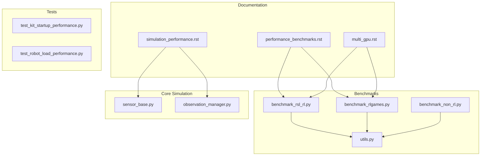
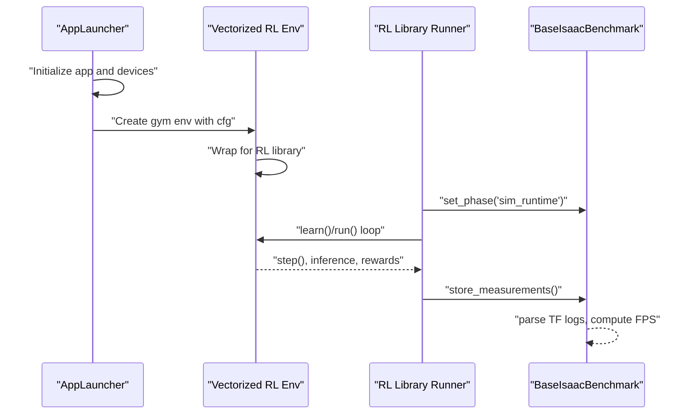
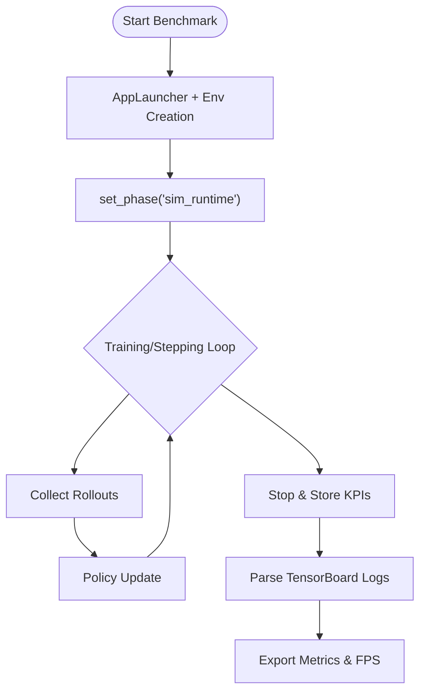
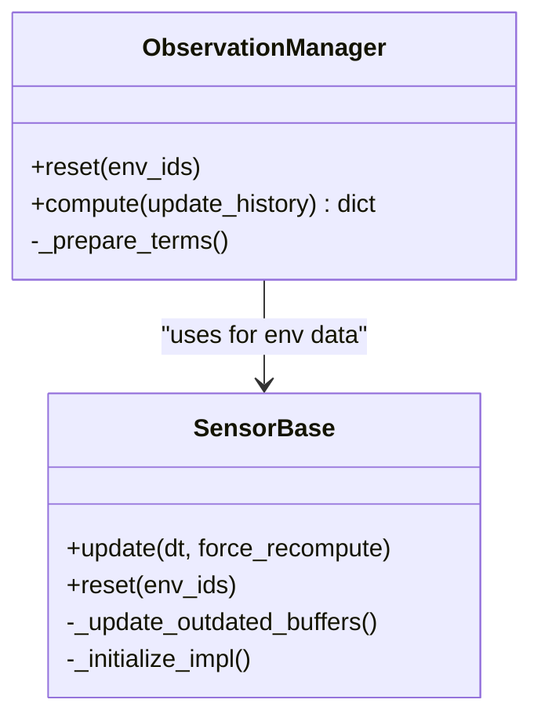
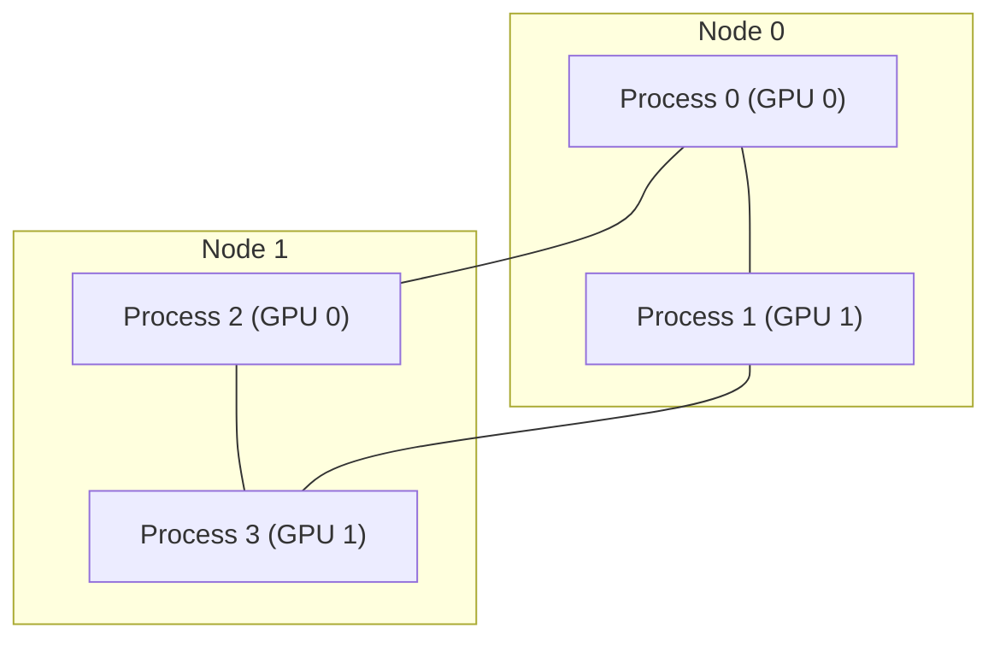
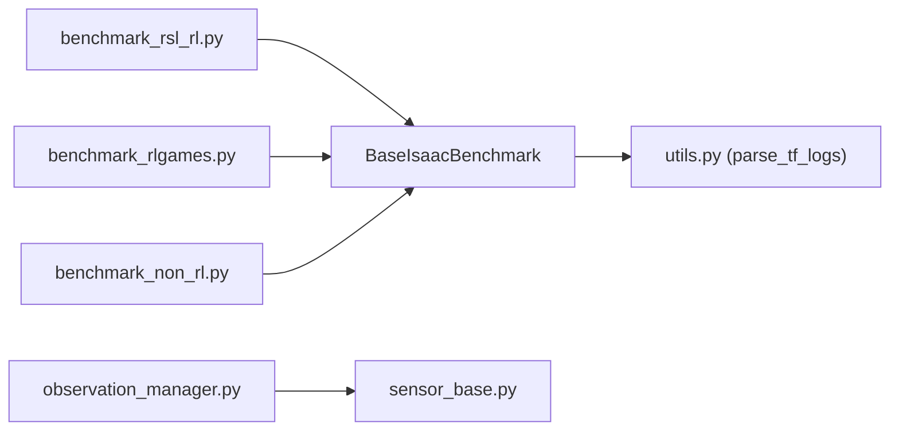

# Performance Optimization

<cite>
**Referenced Files in This Document**
- [performance_benchmarks.rst](file://docs/source/overview/reinforcement-learning/performance_benchmarks.rst)
- [simulation_performance.rst](file://docs/source/how-to/simulation_performance.rst)
- [multi_gpu.rst](file://docs/source/features/multi_gpu.rst)
- [benchmark_rsl_rl.py](file://scripts/benchmarks/benchmark_rsl_rl.py)
- [benchmark_rlgames.py](file://scripts/benchmarks/benchmark_rlgames.py)
- [benchmark_non_rl.py](file://scripts/benchmarks/benchmark_non_rl.py)
- [utils.py](file://scripts/benchmarks/utils.py)
- [sensor_base.py](file://source/isaaclab/isaaclab/sensors/sensor_base.py)
- [observation_manager.py](file://source/isaaclab/isaaclab/managers/observation_manager.py)
- [test_kit_startup_performance.py](file://source/isaaclab/test/performance/test_kit_startup_performance.py)
- [test_robot_load_performance.py](file://source/isaaclab/test/performance/test_robot_load_performance.py)
</cite>

## Table of Contents
1. [Introduction](#introduction)
2. [Project Structure](#project-structure)
3. [Core Components](#core-components)
4. [Architecture Overview](#architecture-overview)
5. [Detailed Component Analysis](#detailed-component-analysis)
6. [Dependency Analysis](#dependency-analysis)
7. [Performance Considerations](#performance-considerations)
8. [Troubleshooting Guide](#troubleshooting-guide)
9. [Conclusion](#conclusion)
10. [Appendices](#appendices)

## Introduction
This document focuses on performance optimization techniques for quadruped reinforcement learning (RL) training and simulation within the project. It explains benchmarking methodologies for evaluating training throughput, simulation speed, and hardware utilization. It documents optimization strategies for sensor processing, environment stepping, and policy inference acceleration. It covers memory management, GPU utilization optimization, and CPU parallelization strategies. It also describes profiling tools and performance monitoring systems used to identify bottleneeks in the training pipeline. Practical examples illustrate performance tuning across hardware configurations from single GPU to multi-node clusters. Finally, it addresses the relationship between observation processing overhead and training efficiency, including sensor fusion optimizations, and provides guidelines for balancing simulation fidelity and performance.

## Project Structure
The repository organizes performance-related capabilities across documentation, benchmarking scripts, and core simulation components:
- Documentation: performance benchmarks, simulation performance tips, and multi-GPU/multi-node training guidance
- Benchmarking scripts: end-to-end RL training benchmarks and environment-only benchmarks
- Core components: sensors and observation management that influence observation processing overhead
- Tests: performance tests for startup and robot load

**Diagram sources**
- [performance_benchmarks.rst](file://docs/source/overview/reinforcement-learning/performance_benchmarks.rst)
- [simulation_performance.rst](file://docs/source/how-to/simulation_performance.rst)
- [multi_gpu.rst](file://docs/source/features/multi_gpu.rst)
- [benchmark_rsl_rl.py](file://scripts/benchmarks/benchmark_rsl_rl.py)
- [benchmark_rlgames.py](file://scripts/benchmarks/benchmark_rlgames.py)
- [benchmark_non_rl.py](file://scripts/benchmarks/benchmark_non_rl.py)
- [utils.py](file://scripts/benchmarks/utils.py)
- [sensor_base.py](file://source/isaaclab/isaaclab/sensors/sensor_base.py)
- [observation_manager.py](file://source/isaaclab/isaaclab/managers/observation_manager.py)
- [test_kit_startup_performance.py](file://source/isaaclab/test/performance/test_kit_startup_performance.py)
- [test_robot_load_performance.py](file://source/isaaclab/test/performance/test_robot_load_performance.py)

**Section sources**
- [performance_benchmarks.rst](file://docs/source/overview/reinforcement-learning/performance_benchmarks.rst)
- [simulation_performance.rst](file://docs/source/how-to/simulation_performance.rst)
- [multi_gpu.rst](file://docs/source/features/multi_gpu.rst)
- [benchmark_rsl_rl.py](file://scripts/benchmarks/benchmark_rsl_rl.py)
- [benchmark_rlgames.py](file://scripts/benchmarks/benchmark_rlgames.py)
- [benchmark_non_rl.py](file://scripts/benchmarks/benchmark_non_rl.py)
- [utils.py](file://scripts/benchmarks/utils.py)
- [sensor_base.py](file://source/isaaclab/isaaclab/sensors/sensor_base.py)
- [observation_manager.py](file://source/isaaclab/isaaclab/managers/observation_manager.py)
- [test_kit_startup_performance.py](file://source/isaaclab/test/performance/test_kit_startup_performance.py)
- [test_robot_load_performance.py](file://source/isaaclab/test/performance/test_robot_load_performance.py)

## Core Components
- Benchmarking scripts: provide standardized measurement of environment FPS, inference FPS, and training FPS; they also collect startup and runtime statistics and export KPIs via a benchmarking service.
- Observation management: orchestrates observation terms, concatenation, and history buffering, impacting compute overhead and memory footprint.
- Sensors: implement lazy evaluation and periodic updates to minimize unnecessary recomputation; they maintain timestamps and outdated flags to control recomputation cadence.

Key performance-relevant aspects:
- Environment FPS and effective FPS accounting for number of environments and world size
- Inference and training FPS breakdowns
- Startup phases (app launch, Python imports, task creation, scene creation, simulation start)
- Observation term history and concatenation costs

**Section sources**
- [benchmark_rsl_rl.py](file://scripts/benchmarks/benchmark_rsl_rl.py)
- [benchmark_rlgames.py](file://scripts/benchmarks/benchmark_rlgames.py)
- [benchmark_non_rl.py](file://scripts/benchmarks/benchmark_non_rl.py)
- [utils.py](file://scripts/benchmarks/utils.py)
- [observation_manager.py](file://source/isaaclab/isaaclab/managers/observation_manager.py)
- [sensor_base.py](file://source/isaaclab/isaaclab/sensors/sensor_base.py)

## Architecture Overview
The training pipeline integrates a launcher, environment creation, vectorized RL environments, and a chosen RL library. Benchmarking scripts measure performance across three phases: startup, simulation runtime, and training runtime. Metrics are logged and exported for analysis.

**Diagram sources**
- [benchmark_rsl_rl.py](file://scripts/benchmarks/benchmark_rsl_rl.py)
- [benchmark_rlgames.py](file://scripts/benchmarks/benchmark_rlgames.py)
- [utils.py](file://scripts/benchmarks/utils.py)

## Detailed Component Analysis

### Benchmarking Scripts and Metrics
- RSL-RL benchmark: measures collection time, learning time, and FPS; logs startup phases and runtime step times; exports KPIs and parses TensorBoard scalars.
- RL-Games benchmark: registers environment wrapper, runs training, and logs environment-only, inference-only, and combined FPS; exports KPIs and parses TensorBoard logs.
- Non-RL benchmark: runs fixed number of environment steps with random actions, measuring environment step times and effective FPS; logs startup phases and runtime step times.

**Diagram sources**
- [benchmark_rsl_rl.py](file://scripts/benchmarks/benchmark_rsl_rl.py)
- [benchmark_rlgames.py](file://scripts/benchmarks/benchmark_rlgames.py)
- [benchmark_non_rl.py](file://scripts/benchmarks/benchmark_non_rl.py)
- [utils.py](file://scripts/benchmarks/utils.py)

**Section sources**
- [benchmark_rsl_rl.py](file://scripts/benchmarks/benchmark_rsl_rl.py)
- [benchmark_rlgames.py](file://scripts/benchmarks/benchmark_rlgames.py)
- [benchmark_non_rl.py](file://scripts/benchmarks/benchmark_non_rl.py)
- [utils.py](file://scripts/benchmarks/utils.py)

### Observation Processing and Sensor Overhead
- Observation manager composes groups of terms, applies modifiers, and optionally concatenates tensors or preserves dictionary form. History buffers increase memory and compute cost.
- Sensors implement lazy evaluation: they update only when data is accessed or when outdated based on update periods, reducing unnecessary recomputation.

**Diagram sources**
- [observation_manager.py](file://source/isaaclab/isaaclab/managers/observation_manager.py)
- [sensor_base.py](file://source/isaaclab/isaaclab/sensors/sensor_base.py)

**Section sources**
- [observation_manager.py](file://source/isaaclab/isaaclab/managers/observation_manager.py)
- [sensor_base.py](file://source/isaaclab/isaaclab/sensors/sensor_base.py)

### Multi-GPU and Multi-Node Training
- Torchrun-based DDP distributes training across GPUs/nodes; each process maintains independent environment instances and synchronizes gradients.
- Multi-node performance can be limited by inter-node communication latency.

**Diagram sources**
- [multi_gpu.rst](file://docs/source/features/multi_gpu.rst)

**Section sources**
- [multi_gpu.rst](file://docs/source/features/multi_gpu.rst)

## Dependency Analysis
- Benchmark scripts depend on the benchmarking service to record startup and runtime metrics and on TensorBoard parsing utilities to extract performance scalars.
- Observation manager depends on environment state and sensor data to compute observations efficiently.
- Sensors depend on simulation context and update periods to minimize recomputation.

**Diagram sources**
- [benchmark_rsl_rl.py](file://scripts/benchmarks/benchmark_rsl_rl.py)
- [benchmark_rlgames.py](file://scripts/benchmarks/benchmark_rlgames.py)
- [benchmark_non_rl.py](file://scripts/benchmarks/benchmark_non_rl.py)
- [utils.py](file://scripts/benchmarks/utils.py)
- [observation_manager.py](file://source/isaaclab/isaaclab/managers/observation_manager.py)
- [sensor_base.py](file://source/isaaclab/isaaclab/sensors/sensor_base.py)

**Section sources**
- [benchmark_rsl_rl.py](file://scripts/benchmarks/benchmark_rsl_rl.py)
- [benchmark_rlgames.py](file://scripts/benchmarks/benchmark_rlgames.py)
- [benchmark_non_rl.py](file://scripts/benchmarks/benchmark_non_rl.py)
- [utils.py](file://scripts/benchmarks/utils.py)
- [observation_manager.py](file://source/isaaclab/isaaclab/managers/observation_manager.py)
- [sensor_base.py](file://source/isaaclab/isaaclab/sensors/sensor_base.py)

## Performance Considerations
- Simulation performance tips:
  - Prefer headless mode for GPU-bound workloads
  - Reduce unnecessary collisions and simplify collision geometry
  - Choose CPU/GPU simulation depending on scene complexity
  - Disable specialized smooth cylinder/cone approximations when not needed
  - Watch for GPU-compatible convex hull warnings and switch approximations if needed

- Observation processing overhead:
  - Control history length and concatenation to balance temporal context and memory/compute cost
  - Use lazy sensor updates with appropriate update periods to avoid redundant computations

- Hardware utilization:
  - Enable FP32/TF32 allowances for matmul/cuDNN where applicable
  - Use vectorized environments and batched inference to saturate GPUs
  - Leverage multi-GPU/multi-node training with Torchrun; monitor inter-node communication latency impacts

- Benchmarking methodology:
  - Measure environment-only FPS, environment+inference FPS, and environment+inference+training FPS
  - Track startup phases and runtime step times for diagnostics
  - Export KPIs and parse TensorBoard logs for detailed performance trends

**Section sources**
- [simulation_performance.rst](file://docs/source/how-to/simulation_performance.rst)
- [observation_manager.py](file://source/isaaclab/isaaclab/managers/observation_manager.py)
- [sensor_base.py](file://source/isaaclab/isaaclab/sensors/sensor_base.py)
- [benchmark_rsl_rl.py](file://scripts/benchmarks/benchmark_rsl_rl.py)
- [benchmark_rlgames.py](file://scripts/benchmarks/benchmark_rlgames.py)
- [benchmark_non_rl.py](file://scripts/benchmarks/benchmark_non_rl.py)
- [utils.py](file://scripts/benchmarks/utils.py)
- [multi_gpu.rst](file://docs/source/features/multi_gpu.rst)

## Troubleshooting Guide
- Startup and runtime timing diagnostics:
  - Use benchmark scripts’ startup timers and runtime step time logs to isolate slow phases
  - Parse TensorBoard logs to track performance regressions over iterations

- Sensor-related bottlenecks:
  - Verify sensor update periods and history lengths
  - Ensure sensors are not forced to recompute unnecessarily

- Robot and scene load:
  - Use performance tests to validate robot load and startup performance under different configurations

Common issues and mitigations:
- High environment step times: reduce sensor count/update frequency, simplify collision geometry, or switch to headless mode
- Low effective FPS: increase number of environments, leverage multi-GPU training, or optimize observation term composition
- GPU fallback warnings: switch collision approximations to compatible ones for GPU simulation

**Section sources**
- [utils.py](file://scripts/benchmarks/utils.py)
- [benchmark_rsl_rl.py](file://scripts/benchmarks/benchmark_rsl_rl.py)
- [benchmark_rlgames.py](file://scripts/benchmarks/benchmark_rlgames.py)
- [benchmark_non_rl.py](file://scripts/benchmarks/benchmark_non_rl.py)
- [sensor_base.py](file://source/isaaclab/isaaclab/sensors/sensor_base.py)
- [test_kit_startup_performance.py](file://source/isaaclab/test/performance/test_kit_startup_performance.py)
- [test_robot_load_performance.py](file://source/isaaclab/test/performance/test_robot_load_performance.py)

## Conclusion
Optimizing quadruped RL training performance hinges on minimizing observation processing overhead, controlling simulation fidelity, and leveraging efficient multi-GPU/multi-node training. The benchmarking suite provides standardized measurements of environment FPS, inference FPS, and training FPS, enabling targeted tuning. Sensor lazy evaluation and observation manager configuration directly impact compute and memory usage. Simulation performance guidelines help reduce collision and rendering overhead. Together, these techniques allow stable and scalable training across diverse hardware configurations.

## Appendices

### Benchmarking Methodology and Metrics
- Environment-only FPS: measure raw environment stepping throughput
- Environment + Inference FPS: include policy inference time
- Environment + Inference + Training FPS: include policy update time
- Effective FPS: accounts for number of environments and world size
- Startup phases: app launch, Python imports, task creation, scene creation, simulation start
- Runtime step times: per-frame timings and statistics

**Section sources**
- [performance_benchmarks.rst](file://docs/source/overview/reinforcement-learning/performance_benchmarks.rst)
- [benchmark_rsl_rl.py](file://scripts/benchmarks/benchmark_rsl_rl.py)
- [benchmark_rlgames.py](file://scripts/benchmarks/benchmark_rlgames.py)
- [benchmark_non_rl.py](file://scripts/benchmarks/benchmark_non_rl.py)
- [utils.py](file://scripts/benchmarks/utils.py)