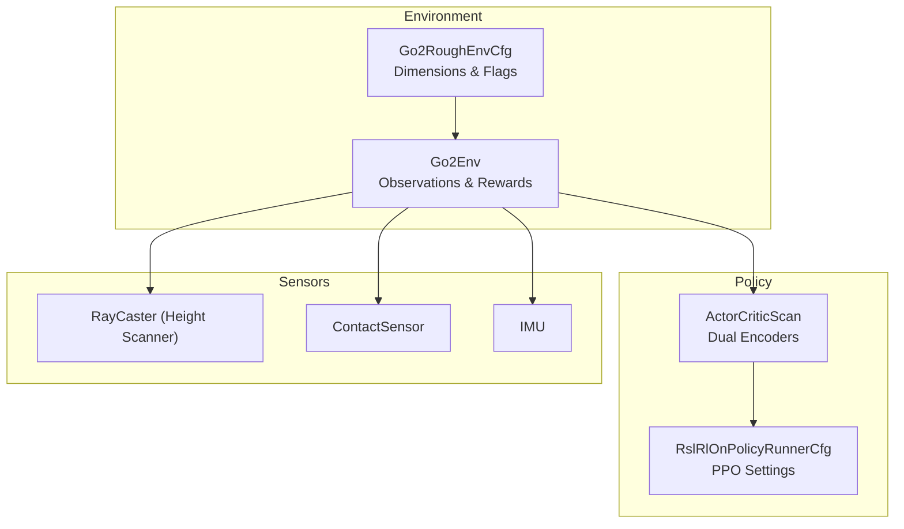
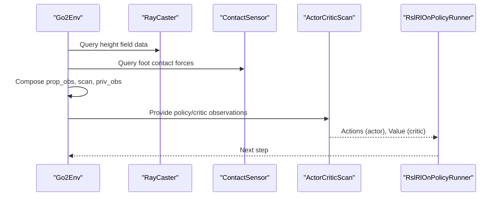
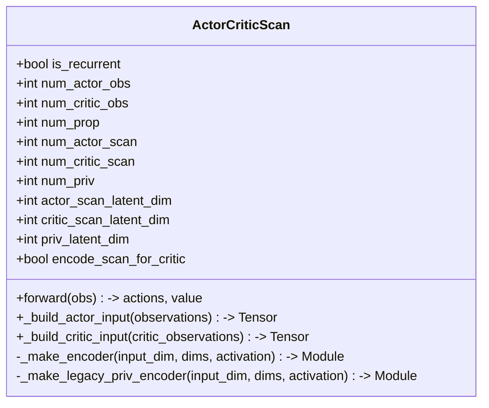
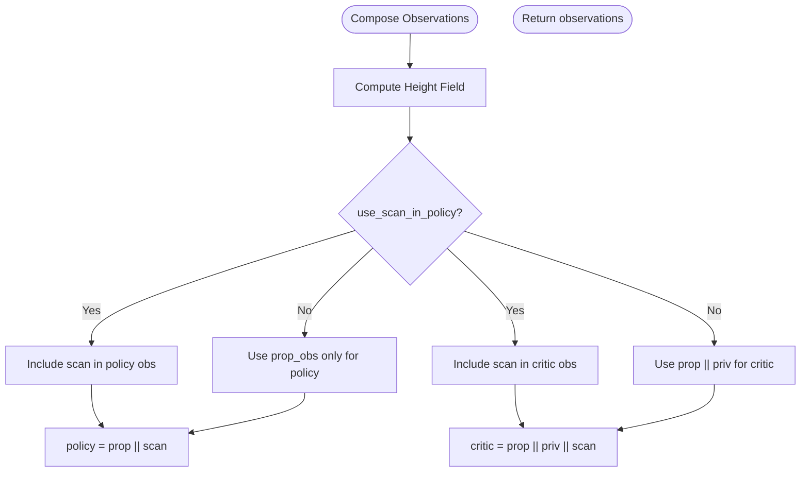
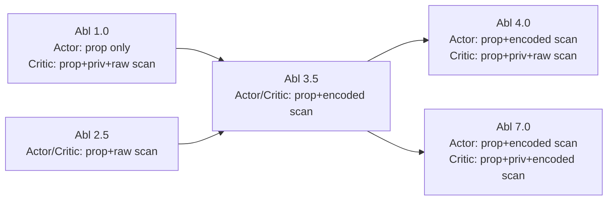
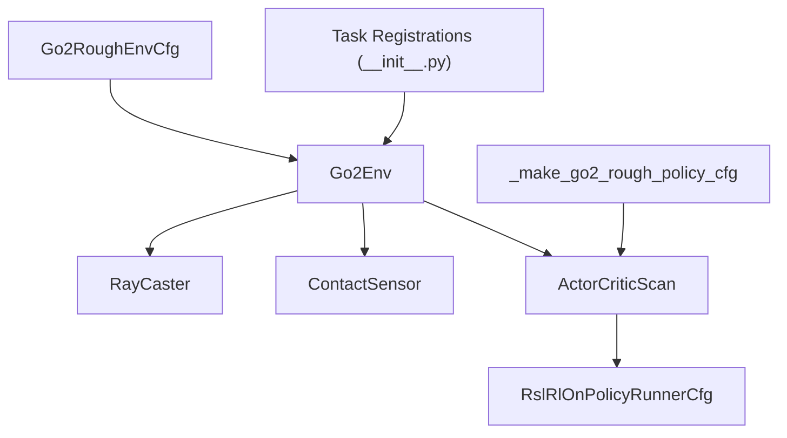

# RL Agent Architecture

<cite>
**Referenced Files in This Document**
- [README.md](file://README.md)
- [actor_critic_scan.py](file://source/isaaclab_tasks/isaaclab_tasks/direct/go2/agents/actor_critic_scan.py)
- [rsl_rl_ppo_cfg.py](file://source/isaaclab_tasks/isaaclab_tasks/direct/go2/agents/rsl_rl_ppo_cfg.py)
- [go2_env_cfg.py](file://source/isaaclab_tasks/isaaclab_tasks/direct/go2/go2_env_cfg.py)
- [go2_env.py](file://source/isaaclab_tasks/isaaclab_tasks/direct/go2/go2_env.py)
- [exporter.py](file://source/isaaclab_rl/isaaclab_rl/rsl_rl/exporter.py)
- [ray_caster.py](file://source/isaaclab/isaaclab/sensors/ray_caster/ray_caster.py)
- [contact_sensor.py](file://source/isaaclab/isaaclab/sensors/contact_sensor/contact_sensor.py)
- [imu.py](file://source/isaaclab/isaaclab/sensors/imu/imu.py)
- [__init__.py](file://source/isaaclab_tasks/isaaclab_tasks/direct/go2/__init__.py)
</cite>

## Table of Contents
1. [Introduction](#introduction)
2. [Project Structure](#project-structure)
3. [Core Components](#core-components)
4. [Architecture Overview](#architecture-overview)
5. [Detailed Component Analysis](#detailed-component-analysis)
6. [Dependency Analysis](#dependency-analysis)
7. [Performance Considerations](#performance-considerations)
8. [Troubleshooting Guide](#troubleshooting-guide)
9. [Conclusion](#conclusion)
10. [Appendices](#appendices)

## Introduction
This document explains the RL Agent Architecture with a focus on the ActorCriticScan implementation and the ablation-specific policy designs used in the Go2 extreme parkour locomotion task. It covers:
- Dual-encoder architecture with scan encoders for proprioceptive and scan inputs
- Privileged observation processing for the critic
- Flexible actor-critic network design supporting different sensor fusion strategies
- Sensor fusion capabilities: height field scanning, contact sensors, and IMU data
- Observation space decomposition into proprioceptive, scan, and privileged components
- Ablation study methodology and configuration examples for Abl 1.0, 2.5, 3.5, 4.0, and 7.0
- Practical guidance for custom sensor encoders and dimensionality reduction strategies

## Project Structure
The RL agent and environment are implemented in the isaaclab_tasks package, with policy configuration and training managed via isaaclab_rl wrappers. Sensors are provided by isaaclab core.

**Diagram sources**
- [go2_env.py:293-355](file://source/isaaclab_tasks/isaaclab_tasks/direct/go2/go2_env.py#L293-L355)
- [go2_env_cfg.py:172-314](file://source/isaaclab_tasks/isaaclab_tasks/direct/go2/go2_env_cfg.py#L172-L314)
- [actor_critic_scan.py:13-118](file://source/isaaclab_tasks/isaaclab_tasks/direct/go2/agents/actor_critic_scan.py#L13-L118)
- [rsl_rl_ppo_cfg.py:79-111](file://source/isaaclab_tasks/isaaclab_tasks/direct/go2/agents/rsl_rl_ppo_cfg.py#L79-L111)
- [ray_caster.py:35-49](file://source/isaaclab/isaaclab/sensors/ray_caster/ray_caster.py#L35-L49)
- [contact_sensor.py:32-62](file://source/isaaclab/isaaclab/sensors/contact_sensor/contact_sensor.py#L32-L62)
- [imu.py:35-47](file://source/isaaclab/isaaclab/sensors/imu/imu.py#L35-L47)

**Section sources**
- [README.md:44-50](file://README.md#L44-L50)
- [go2_env_cfg.py:172-314](file://source/isaaclab_tasks/isaaclab_tasks/direct/go2/go2_env_cfg.py#L172-L314)
- [actor_critic_scan.py:13-118](file://source/isaaclab_tasks/isaaclab_tasks/direct/go2/agents/actor_critic_scan.py#L13-L118)
- [rsl_rl_ppo_cfg.py:79-111](file://source/isaaclab_tasks/isaaclab_tasks/direct/go2/agents/rsl_rl_ppo_cfg.py#L79-L111)

## Core Components
- ActorCriticScan: Implements a flexible actor-critic network with optional proprioceptive scan encoder and privileged observation encoder. Supports independent actor and critic scan encoders and a privileged encoder for the critic only.
- Environment Observations: Builds policy and critic inputs from proprioceptive, scan (height field), and privileged (domain randomization) components, with configurable ordering and inclusion flags.
- Policy Configuration: Provides ablation-specific configurations for scan and privileged encoders, enabling controlled experiments across different sensor fusion strategies.
- Sensor Backends: RayCaster for height field scanning, ContactSensor for foot-ground contact flags, and IMU for inertial measurements.

Key implementation references:
- [ActorCriticScan class:13-118](file://source/isaaclab_tasks/isaaclab_tasks/direct/go2/agents/actor_critic_scan.py#L13-L118)
- [Observation building in Go2Env:293-355](file://source/isaaclab_tasks/isaaclab_tasks/direct/go2/go2_env.py#L293-L355)
- [Policy configuration helpers:11-41](file://source/isaaclab_tasks/isaaclab_tasks/direct/go2/agents/rsl_rl_ppo_cfg.py#L11-L41)
- [Environment dimensions and flags:172-314](file://source/isaaclab_tasks/isaaclab_tasks/direct/go2/go2_env_cfg.py#L172-L314)

**Section sources**
- [actor_critic_scan.py:13-118](file://source/isaaclab_tasks/isaaclab_tasks/direct/go2/agents/actor_critic_scan.py#L13-L118)
- [go2_env.py:293-355](file://source/isaaclab_tasks/isaaclab_tasks/direct/go2/go2_env.py#L293-L355)
- [rsl_rl_ppo_cfg.py:11-41](file://source/isaaclab_tasks/isaaclab_tasks/direct/go2/agents/rsl_rl_ppo_cfg.py#L11-L41)
- [go2_env_cfg.py:172-314](file://source/isaaclab_tasks/isaaclab_tasks/direct/go2/go2_env_cfg.py#L172-L314)

## Architecture Overview
The RL pipeline integrates environment sensors, observation composition, and the ActorCriticScan policy with configurable encoders.

**Diagram sources**
- [go2_env.py:293-355](file://source/isaaclab_tasks/isaaclab_tasks/direct/go2/go2_env.py#L293-L355)
- [ray_caster.py:232-301](file://source/isaaclab/isaaclab/sensors/ray_caster/ray_caster.py#L232-L301)
- [contact_sensor.py:346-378](file://source/isaaclab/isaaclab/sensors/contact_sensor/contact_sensor.py#L346-L378)
- [actor_critic_scan.py:13-118](file://source/isaaclab_tasks/isaaclab_tasks/direct/go2/agents/actor_critic_scan.py#L13-L118)
- [rsl_rl_ppo_cfg.py:79-111](file://source/isaaclab_tasks/isaaclab_tasks/direct/go2/agents/rsl_rl_ppo_cfg.py#L79-L111)

## Detailed Component Analysis

### ActorCriticScan: Dual-Encoder Architecture
ActorCriticScan supports:
- Proprioceptive inputs for both actor and critic
- Optional scan encoder(s) for actor and/or critic
- Optional privileged encoder for the critic only
- Configurable latent dimensions and activation functions

Key behaviors:
- Input splitting: Proprioceptive, optional scan, optional privileged components
- Optional scan encoding for actor and/or critic
- Optional privileged encoding for critic only
- Latent dimension computation based on encoder configurations

**Diagram sources**
- [actor_critic_scan.py:13-118](file://source/isaaclab_tasks/isaaclab_tasks/direct/go2/agents/actor_critic_scan.py#L13-L118)

**Section sources**
- [actor_critic_scan.py:13-118](file://source/isaaclab_tasks/isaaclab_tasks/direct/go2/agents/actor_critic_scan.py#L13-L118)

### Observation Space Decomposition and Sensor Fusion
The environment constructs three observation streams:
- Proprioceptive (prop_obs): 52D (joint positions/velocities, gravity projection, root velocities, commands, last action, foot contacts)
- Scan (scan_obs): 187D height field grid (1.6 x 1.0 m, 0.1 m resolution)
- Privileged (priv_obs): 29D (mass, center of mass, friction coefficient, PD gain scales)

Observation composition:
- Policy input: prop_obs (+ optionally scan)
- Critic input: prop_obs + priv_obs (+ optionally scan)
- Ordering can be configured per ablation (scan-first vs prop-first)

**Diagram sources**
- [go2_env.py:293-355](file://source/isaaclab_tasks/isaaclab_tasks/direct/go2/go2_env.py#L293-L355)
- [go2_env_cfg.py:172-314](file://source/isaaclab_tasks/isaaclab_tasks/direct/go2/go2_env_cfg.py#L172-L314)

**Section sources**
- [go2_env.py:293-355](file://source/isaaclab_tasks/isaaclab_tasks/direct/go2/go2_env.py#L293-L355)
- [go2_env_cfg.py:172-314](file://source/isaaclab_tasks/isaaclab_tasks/direct/go2/go2_env_cfg.py#L172-L314)

### Ablation Study Methodology and Configuration Examples
Five ablations are exposed via Gym task IDs and corresponding configurations:

- Abl 1.0: Actor = prop_obs only; Critic = prop_obs + priv_obs + raw scan
- Abl 2.5: Actor = prop_obs + raw scan; Critic = prop_obs + priv_obs + raw scan
- Abl 3.5: Actor = prop_obs + scan encoding; Critic = prop_obs + priv_obs + scan encoding
- Abl 4.0: Actor = prop_obs + scan encoding; Critic = prop_obs + priv_obs + raw scan
- Abl 7.0: Actor = prop_obs + scan encoding; Critic = prop_obs + priv_obs encoding + scan encoding

Configuration highlights:
- Policy class: ActorCriticScan
- Shared scan encoder dims: [128, 64, 32] for Abl 3.5–7.0
- Privileged encoder dims: [64, 20] for Abl 7.0
- encode_scan_for_critic flag toggled for Abl 4.0
- Task registration and runner configurations

**Diagram sources**
- [README.md:12-17](file://README.md#L12-L17)
- [__init__.py:49-87](file://source/isaaclab_tasks/isaaclab_tasks/direct/go2/__init__.py#L49-L87)
- [rsl_rl_ppo_cfg.py:114-154](file://source/isaaclab_tasks/isaaclab_tasks/direct/go2/agents/rsl_rl_ppo_cfg.py#L114-L154)

Practical configuration examples (paths only):
- [Abl 1.0 runner config:114-118](file://source/isaaclab_tasks/isaaclab_tasks/direct/go2/agents/rsl_rl_ppo_cfg.py#L114-L118)
- [Abl 2.5 runner config:120-131](file://source/isaaclab_tasks/isaaclab_tasks/direct/go2/agents/rsl_rl_ppo_cfg.py#L120-L131)
- [Abl 3.5 runner config:133-137](file://source/isaaclab_tasks/isaaclab_tasks/direct/go2/agents/rsl_rl_ppo_cfg.py#L133-L137)
- [Abl 4.0 runner config:139-145](file://source/isaaclab_tasks/isaaclab_tasks/direct/go2/agents/rsl_rl_ppo_cfg.py#L139-L145)
- [Abl 7.0 runner config:148-154](file://source/isaaclab_tasks/isaaclab_tasks/direct/go2/agents/rsl_rl_ppo_cfg.py#L148-L154)

**Section sources**
- [README.md:6-17](file://README.md#L6-L17)
- [__init__.py:49-87](file://source/isaaclab_tasks/isaaclab_tasks/direct/go2/__init__.py#L49-L87)
- [rsl_rl_ppo_cfg.py:114-154](file://source/isaaclab_tasks/isaaclab_tasks/direct/go2/agents/rsl_rl_ppo_cfg.py#L114-L154)

### Sensor Backends and Integration
- Height field scanning: RayCaster sensor computes per-point height differences to build a 187D scan observation.
- Contact sensing: ContactSensor provides foot contact flags and histories for reward shaping and observation composition.
- IMU data: IMU sensor provides linear/angular velocities/accelerations in the body frame; accuracy depends on simulation timestep.

Integration points:
- Height scanner initialization and data retrieval in the environment
- Contact sensor data used for foot contacts in prop_obs
- IMU data available for potential inclusion in privileged observations

**Section sources**
- [ray_caster.py:232-301](file://source/isaaclab/isaaclab/sensors/ray_caster/ray_caster.py#L232-L301)
- [contact_sensor.py:346-378](file://source/isaaclab/isaaclab/sensors/contact_sensor/contact_sensor.py#L346-L378)
- [imu.py:35-47](file://source/isaaclab/isaaclab/sensors/imu/imu.py#L35-L47)
- [go2_env.py:217-220](file://source/isaaclab_tasks/isaaclab_tasks/direct/go2/go2_env.py#L217-L220)

### Exporter Compatibility
The RSL-RL exporter recognizes policies with custom actor input preprocessing (e.g., scan encoders) and copies the policy accordingly for deployment.

**Section sources**
- [exporter.py:122-151](file://source/isaaclab_rl/isaaclab_rl/rsl_rl/exporter.py#L122-L151)

## Dependency Analysis
The following diagram shows key dependencies among components:

**Diagram sources**
- [go2_env.py:217-220](file://source/isaaclab_tasks/isaaclab_tasks/direct/go2/go2_env.py#L217-L220)
- [ray_caster.py:35-49](file://source/isaaclab/isaaclab/sensors/ray_caster/ray_caster.py#L35-L49)
- [contact_sensor.py:32-62](file://source/isaaclab/isaaclab/sensors/contact_sensor/contact_sensor.py#L32-L62)
- [actor_critic_scan.py:13-118](file://source/isaaclab_tasks/isaaclab_tasks/direct/go2/agents/actor_critic_scan.py#L13-L118)
- [rsl_rl_ppo_cfg.py:79-111](file://source/isaaclab_tasks/isaaclab_tasks/direct/go2/agents/rsl_rl_ppo_cfg.py#L79-L111)
- [go2_env_cfg.py:172-314](file://source/isaaclab_tasks/isaaclab_tasks/direct/go2/go2_env_cfg.py#L172-L314)
- [__init__.py:49-87](file://source/isaaclab_tasks/isaaclab_tasks/direct/go2/__init__.py#L49-L87)

**Section sources**
- [go2_env.py:217-220](file://source/isaaclab_tasks/isaaclab_tasks/direct/go2/go2_env.py#L217-L220)
- [actor_critic_scan.py:13-118](file://source/isaaclab_tasks/isaaclab_tasks/direct/go2/agents/actor_critic_scan.py#L13-L118)
- [rsl_rl_ppo_cfg.py:79-111](file://source/isaaclab_tasks/isaaclab_tasks/direct/go2/agents/rsl_rl_ppo_cfg.py#L79-L111)
- [go2_env_cfg.py:172-314](file://source/isaaclab_tasks/isaaclab_tasks/direct/go2/go2_env_cfg.py#L172-L314)
- [__init__.py:49-87](file://source/isaaclab_tasks/isaaclab_tasks/direct/go2/__init__.py#L49-L87)

## Performance Considerations
- Dimensionality and learning efficiency:
  - Raw scan (187D) can overwhelm the actor/critic without encoding; Abl 3.5 demonstrates superior performance with scan encoding for both actor and critic.
  - Privileged observation encoding (29D) can introduce constant biases; Abl 7.0 shows degradation due to privileged encoding.
  - Critic receiving raw scan (Abl 4.0) introduces noise in value estimation.
- Encoder design:
  - Scan encoder dims [128, 64, 32] reduce raw scan to compact latents suitable for downstream MLP heads.
  - Privileged encoder dims [64, 20] compress privileged signals to stable features.
- Observation ordering:
  - Scan-first vs prop-first affects training stability; Abl 2.5 enables scan-first for both branches.

[No sources needed since this section provides general guidance]

## Troubleshooting Guide
- Height scanner issues:
  - Ensure the RayCaster sensor is initialized and attached to the base frame; verify mesh prim paths and ray alignment.
  - Confirm scan data is computed and clipped appropriately before concatenation.
- Contact sensor issues:
  - Verify contact reporting is enabled on robot bodies; check filter patterns and history length.
  - Validate that foot contact flags are computed from recent net forces.
- IMU accuracy:
  - IMU acceleration depends on finite-difference approximations; maintain adequate simulation timestep.
- Exporter compatibility:
  - Policies with custom actor input preprocessing are supported; ensure the policy exposes preprocessing hooks recognized by the exporter.

**Section sources**
- [ray_caster.py:131-160](file://source/isaaclab/isaaclab/sensors/ray_caster/ray_caster.py#L131-L160)
- [contact_sensor.py:255-297](file://source/isaaclab/isaaclab/sensors/contact_sensor/contact_sensor.py#L255-L297)
- [imu.py:35-47](file://source/isaaclab/isaaclab/sensors/imu/imu.py#L35-L47)
- [exporter.py:122-151](file://source/isaaclab_rl/isaaclab_rl/rsl_rl/exporter.py#L122-L151)

## Conclusion
The ActorCriticScan architecture enables flexible sensor fusion for quadruped locomotion. The ablation study demonstrates that:
- Scan encoding improves policy generalization compared to raw scans
- Using encoded scans for both actor and critic yields the best performance
- Avoiding privileged observation encoding for the critic prevents overfitting to constants
- Proper observation ordering and dimensionality reduction are critical for stable training

[No sources needed since this section summarizes without analyzing specific files]

## Appendices

### Appendix A: Observation Dimensions and Composition
- prop_obs: 52D
- priv_obs (critic only): 29D
- scan_obs: 187D
- Default ordering:
  - Policy: prop || scan
  - Critic: prop || priv || scan
- Abl 2.5: scan-first for both policy and critic

**Section sources**
- [README.md:51-64](file://README.md#L51-L64)
- [go2_env_cfg.py:172-314](file://source/isaaclab_tasks/isaaclab_tasks/direct/go2/go2_env_cfg.py#L172-L314)
- [go2_env.py:293-355](file://source/isaaclab_tasks/isaaclab_tasks/direct/go2/go2_env.py#L293-L355)

### Appendix B: Practical Implementation Details for Custom Sensor Encoders
- Define encoder dimensions per branch (actor, critic) and set flags to enable encoding for each.
- Ensure latent dimensions match downstream MLP input expectations.
- Validate observation splits: num_actor_obs, num_critic_obs, num_prop, num_scan.
- Use the exporter to deploy policies with custom preprocessing.

**Section sources**
- [actor_critic_scan.py:22-118](file://source/isaaclab_tasks/isaaclab_tasks/direct/go2/agents/actor_critic_scan.py#L22-L118)
- [exporter.py:122-151](file://source/isaaclab_rl/isaaclab_rl/rsl_rl/exporter.py#L122-L151)