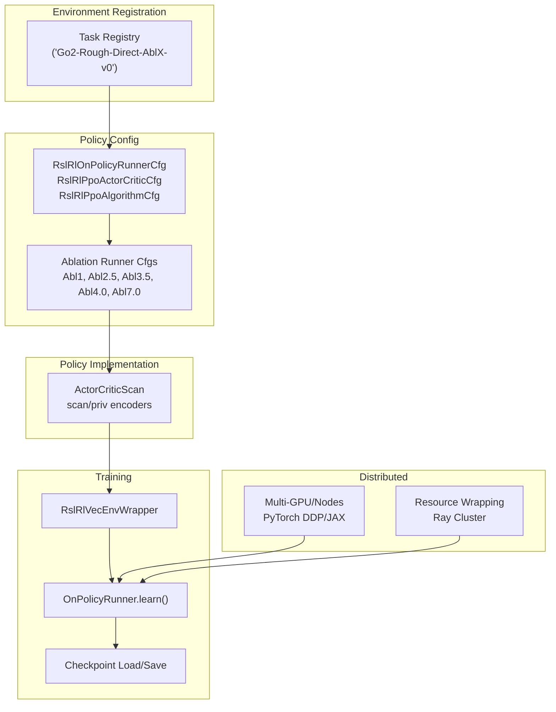
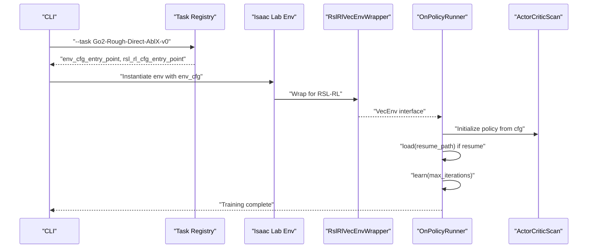
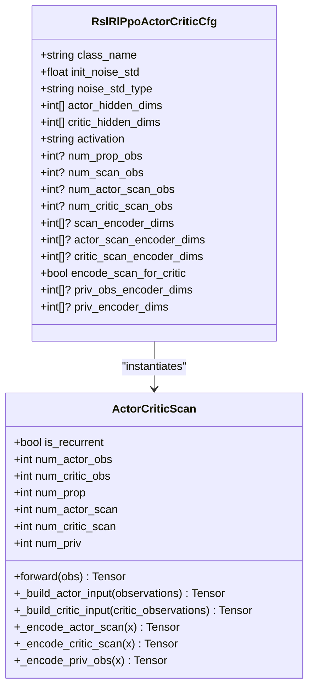
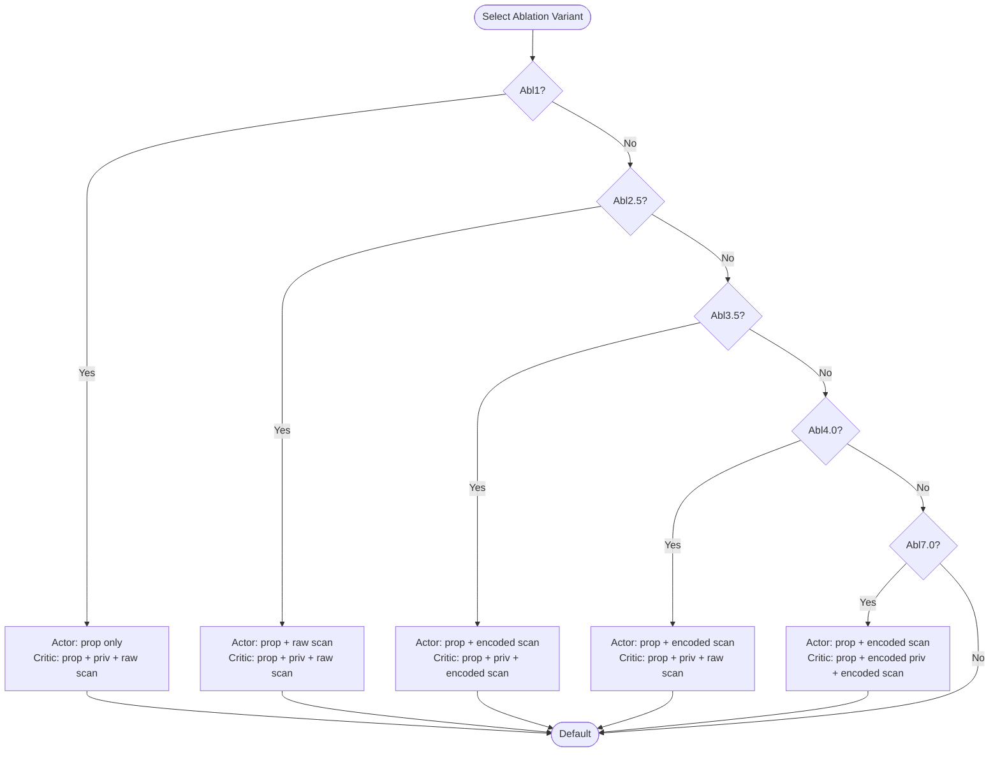
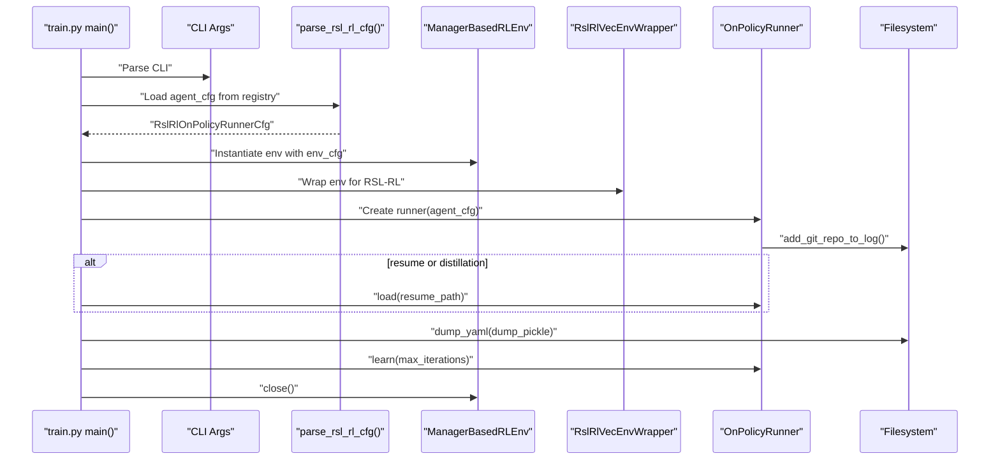
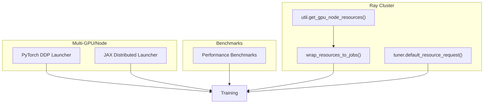
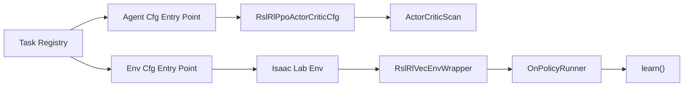

# Reinforcement Learning Framework

<cite>
**Referenced Files in This Document**
- [README.md](file://README.md)
- [source/isaaclab_tasks/isaaclab_tasks/direct/go2/agents/rsl_rl_ppo_cfg.py](file://source/isaaclab_tasks/isaaclab_tasks/direct/go2/agents/rsl_rl_ppo_cfg.py)
- [source/isaaclab_tasks/isaaclab_tasks/direct/go2/agents/actor_critic_scan.py](file://source/isaaclab_tasks/isaaclab_tasks/direct/go2/agents/actor_critic_scan.py)
- [source/isaaclab_tasks/isaaclab_tasks/direct/go2/__init__.py](file://source/isaaclab_tasks/isaaclab_tasks/direct/go2/__init__.py)
- [source/isaaclab_tasks/isaaclab_tasks/direct/go2/go2_env_cfg.py](file://source/isaaclab_tasks/isaaclab_tasks/direct/go2/go2_env_cfg.py)
- [source/isaaclab_rl/isaaclab_rl/rsl_rl/rl_cfg.py](file://source/isaaclab_rl/isaaclab_rl/rsl_rl/rl_cfg.py)
- [source/isaaclab_rl/isaaclab_rl/rsl_rl/vecenv_wrapper.py](file://source/isaaclab_rl/isaaclab_rl/rsl_rl/vecenv_wrapper.py)
- [scripts/reinforcement_learning/rsl_rl/train.py](file://scripts/reinforcement_learning/rsl_rl/train.py)
- [scripts/reinforcement_learning/rsl_rl/cli_args.py](file://scripts/reinforcement_learning/rsl_rl/cli_args.py)
- [scripts/benchmarks/benchmark_rsl_rl.py](file://scripts/benchmarks/benchmark_rsl_rl.py)
- [scripts/reinforcement_learning/ray/wrap_resources.py](file://scripts/reinforcement_learning/ray/wrap_resources.py)
- [scripts/reinforcement_learning/ray/util.py](file://scripts/reinforcement_learning/ray/util.py)
- [scripts/reinforcement_learning/ray/tuner.py](file://scripts/reinforcement_learning/ray/tuner.py)
- [source/isaaclab_rl/isaaclab_rl/rsl_rl/exporter.py](file://source/isaaclab_rl/isaaclab_rl/rsl_rl/exporter.py)
- [docs/source/features/multi_gpu.rst](file://docs/source/features/multi_gpu.rst)
- [docs/source/overview/reinforcement-learning/performance_benchmarks.rst](file://docs/source/overview/reinforcement-learning/performance_benchmarks.rst)
</cite>

## Table of Contents
1. [Introduction](#introduction)
2. [Project Structure](#project-structure)
3. [Core Components](#core-components)
4. [Architecture Overview](#architecture-overview)
5. [Detailed Component Analysis](#detailed-component-analysis)
6. [Dependency Analysis](#dependency-analysis)
7. [Performance Considerations](#performance-considerations)
8. [Troubleshooting Guide](#troubleshooting-guide)
9. [Conclusion](#conclusion)
10. [Appendices](#appendices)

## Introduction
This document describes the Reinforcement Learning Framework used for quadruped locomotion ablation studies. It explains the actor-critic architecture with scan and privileged observation encoders, the PPO implementation specifics, ablation-specific policy designs, and the training pipeline orchestration. It also covers hyperparameters, experiment management, checkpoint handling, sensor fusion impact on performance, distributed training, and practical guidance for training optimization and troubleshooting.

## Project Structure
The RL framework integrates environment registration, policy configuration, environment wrappers, and training runners. The ablation study targets a quadruped robot with multiple sensor modalities, including proprioceptive and 3D scan observations. The framework supports:
- Environment registration with task IDs for ablation variants
- Configurable actor-critic policies with optional scan and privileged encoders
- RSL-RL runner integration with environment wrapping
- Distributed training and resource management utilities
- Experiment logging, checkpointing, and evaluation

**Diagram sources**
- [source/isaaclab_tasks/isaaclab_tasks/direct/go2/__init__.py:49-147](file://source/isaaclab_tasks/isaaclab_tasks/direct/go2/__init__.py#L49-L147)
- [source/isaaclab_tasks/isaaclab_tasks/direct/go2/agents/rsl_rl_ppo_cfg.py:114-155](file://source/isaaclab_tasks/isaaclab_tasks/direct/go2/agents/rsl_rl_ppo_cfg.py#L114-L155)
- [source/isaaclab_tasks/isaaclab_tasks/direct/go2/agents/actor_critic_scan.py:13-229](file://source/isaaclab_tasks/isaaclab_tasks/direct/go2/agents/actor_critic_scan.py#L13-L229)
- [source/isaaclab_rl/isaaclab_rl/rsl_rl/vecenv_wrapper.py:14-210](file://source/isaaclab_rl/isaaclab_rl/rsl_rl/vecenv_wrapper.py#L14-L210)
- [scripts/reinforcement_learning/rsl_rl/train.py:25-219](file://scripts/reinforcement_learning/rsl_rl/train.py#L25-L219)
- [docs/source/features/multi_gpu.rst:196-222](file://docs/source/features/multi_gpu.rst#L196-L222)
- [scripts/reinforcement_learning/ray/wrap_resources.py:68-116](file://scripts/reinforcement_learning/ray/wrap_resources.py#L68-L116)

**Section sources**
- [README.md:1-155](file://README.md#L1-L155)
- [source/isaaclab_tasks/isaaclab_tasks/direct/go2/__init__.py:49-147](file://source/isaaclab_tasks/isaaclab_tasks/direct/go2/__init__.py#L49-L147)
- [source/isaaclab_tasks/isaaclab_tasks/direct/go2/agents/rsl_rl_ppo_cfg.py:114-155](file://source/isaaclab_tasks/isaaclab_tasks/direct/go2/agents/rsl_rl_ppo_cfg.py#L114-L155)

## Core Components
- Task registry and ablation variants: Registers multiple task IDs for Abl1, Abl2.5, Abl3.5, Abl4.0, Abl7.0, each mapped to distinct environment and policy configurations.
- Policy configuration: Centralized PPO actor-critic configuration with optional scan and privileged encoders, including hidden dimensions, activations, and encoder sizes.
- ActorCriticScan policy: Implements separate scan encoders for actor and critic, optional privileged observation encoding for critic, and flexible input composition.
- Environment wrapper: Adapts Isaac Lab environments to RSL-RL’s vectorized environment interface, handling privileged observations and action clipping.
- Training runner: Initializes the environment, wraps it, creates the runner, loads checkpoints if requested, logs configurations, and executes training.

**Section sources**
- [source/isaaclab_tasks/isaaclab_tasks/direct/go2/__init__.py:49-147](file://source/isaaclab_tasks/isaaclab_tasks/direct/go2/__init__.py#L49-L147)
- [source/isaaclab_rl/isaaclab_rl/rsl_rl/rl_cfg.py:22-231](file://source/isaaclab_rl/isaaclab_rl/rsl_rl/rl_cfg.py#L22-L231)
- [source/isaaclab_tasks/isaaclab_tasks/direct/go2/agents/actor_critic_scan.py:13-229](file://source/isaaclab_tasks/isaaclab_tasks/direct/go2/agents/actor_critic_scan.py#L13-L229)
- [source/isaaclab_rl/isaaclab_rl/rsl_rl/vecenv_wrapper.py:14-210](file://source/isaaclab_rl/isaaclab_rl/rsl_rl/vecenv_wrapper.py#L14-L210)
- [scripts/reinforcement_learning/rsl_rl/train.py:25-219](file://scripts/reinforcement_learning/rsl_rl/train.py#L25-L219)

## Architecture Overview
The RL pipeline orchestrates environment initialization, policy training, and evaluation. It supports ablation-specific designs by toggling scan and privileged observation encoders in the actor and critic.

**Diagram sources**
- [source/isaaclab_tasks/isaaclab_tasks/direct/go2/__init__.py:49-147](file://source/isaaclab_tasks/isaaclab_tasks/direct/go2/__init__.py#L49-L147)
- [source/isaaclab_rl/isaaclab_rl/rsl_rl/vecenv_wrapper.py:14-210](file://source/isaaclab_rl/isaaclab_rl/rsl_rl/vecenv_wrapper.py#L14-L210)
- [scripts/reinforcement_learning/rsl_rl/train.py:189-219](file://scripts/reinforcement_learning/rsl_rl/train.py#L189-L219)

## Detailed Component Analysis

### Actor-Critic with Scan and Privileged Encoders
The policy supports:
- Proprioceptive observations for both actor and critic
- Optional scan observations with dedicated encoders for actor and critic
- Optional privileged observation encoding for critic inputs
- Flexible composition of inputs to actor and critic

**Diagram sources**
- [source/isaaclab_rl/isaaclab_rl/rsl_rl/rl_cfg.py:22-74](file://source/isaaclab_rl/isaaclab_rl/rsl_rl/rl_cfg.py#L22-L74)
- [source/isaaclab_tasks/isaaclab_tasks/direct/go2/agents/actor_critic_scan.py:13-229](file://source/isaaclab_tasks/isaaclab_tasks/direct/go2/agents/actor_critic_scan.py#L13-L229)

**Section sources**
- [source/isaaclab_rl/isaaclab_rl/rsl_rl/rl_cfg.py:22-74](file://source/isaaclab_rl/isaaclab_rl/rsl_rl/rl_cfg.py#L22-L74)
- [source/isaaclab_tasks/isaaclab_tasks/direct/go2/agents/actor_critic_scan.py:13-229](file://source/isaaclab_tasks/isaaclab_tasks/direct/go2/agents/actor_critic_scan.py#L13-L229)

### PPO Implementation Specifics for Quadruped Locomotion
Key PPO configuration elements include:
- Learning epochs and mini-batches per update
- Clipping parameter and value loss coefficient
- Entropy coefficient and KL-divergence target
- Discount factor and GAE lambda
- Gradient norm clipping and learning rate schedule

These are defined in the algorithm configuration and applied by the runner during updates.

**Section sources**
- [source/isaaclab_rl/isaaclab_rl/rsl_rl/rl_cfg.py:98-155](file://source/isaaclab_rl/isaaclab_rl/rsl_rl/rl_cfg.py#L98-L155)

### Ablation-Specific Policy Designs
The ablation study defines five variants by adjusting which observations are used by the actor and critic and whether encoders are applied:
- Abl1: Actor uses only proprioceptive; Critic uses proprioceptive + privileged + raw scan
- Abl2.5: Actor uses proprioceptive + raw scan; Critic uses proprioceptive + privileged + raw scan
- Abl3.5: Actor and Critic use proprioceptive + encoded scan
- Abl4.0: Actor uses proprioceptive + encoded scan; Critic uses proprioceptive + privileged + raw scan
- Abl7.0: Actor uses proprioceptive + encoded scan; Critic uses proprioceptive + encoded privileged + encoded scan

**Diagram sources**
- [README.md:12-18](file://README.md#L12-L18)
- [source/isaaclab_tasks/isaaclab_tasks/direct/go2/agents/rsl_rl_ppo_cfg.py:114-155](file://source/isaaclab_tasks/isaaclab_tasks/direct/go2/agents/rsl_rl_ppo_cfg.py#L114-L155)

**Section sources**
- [README.md:12-18](file://README.md#L12-L18)
- [source/isaaclab_tasks/isaaclab_tasks/direct/go2/agents/rsl_rl_ppo_cfg.py:114-155](file://source/isaaclab_tasks/isaaclab_tasks/direct/go2/agents/rsl_rl_ppo_cfg.py#L114-L155)

### Training Pipeline Orchestration
The training script orchestrates:
- Argument parsing and environment/agent configuration loading
- Environment instantiation and wrapping
- Runner creation and optional checkpoint loading
- Configuration dumping and training execution
- Simulator shutdown

**Diagram sources**
- [scripts/reinforcement_learning/rsl_rl/train.py:25-219](file://scripts/reinforcement_learning/rsl_rl/train.py#L25-L219)
- [scripts/reinforcement_learning/rsl_rl/cli_args.py:45-65](file://scripts/reinforcement_learning/rsl_rl/cli_args.py#L45-L65)

**Section sources**
- [scripts/reinforcement_learning/rsl_rl/train.py:25-219](file://scripts/reinforcement_learning/rsl_rl/train.py#L25-L219)
- [scripts/reinforcement_learning/rsl_rl/cli_args.py:45-65](file://scripts/reinforcement_learning/rsl_rl/cli_args.py#L45-L65)

### Hyperparameter Configuration System and Experiment Management
- Configuration classes define policy, algorithm, and runner settings.
- CLI arguments update configurations dynamically.
- Experiment metadata and configs are dumped to logs for reproducibility.
- Resume/loading supports continuing from checkpoints.

**Section sources**
- [source/isaaclab_rl/isaaclab_rl/rsl_rl/rl_cfg.py:22-231](file://source/isaaclab_rl/isaaclab_rl/rsl_rl/rl_cfg.py#L22-L231)
- [scripts/reinforcement_learning/rsl_rl/cli_args.py:60-65](file://scripts/reinforcement_learning/rsl_rl/cli_args.py#L60-L65)
- [scripts/reinforcement_learning/rsl_rl/train.py:196-206](file://scripts/reinforcement_learning/rsl_rl/train.py#L196-L206)

### Checkpoint Handling
- Checkpoints are loaded when resuming or when using distillation.
- Export utilities support JIT and ONNX policy export for deployment.

**Section sources**
- [scripts/reinforcement_learning/rsl_rl/train.py:197-202](file://scripts/reinforcement_learning/rsl_rl/train.py#L197-L202)
- [source/isaaclab_rl/isaaclab_rl/rsl_rl/exporter.py:122-151](file://source/isaaclab_rl/isaaclab_rl/rsl_rl/exporter.py#L122-L151)

### Relationship Between Sensor Fusion Architectures and Agent Performance
- Abl1 fails due to lack of scan access for the actor.
- Abl2.5 struggles with raw high-dimensional scan features.
- Abl3.5 performs best with scan encoding for both actor and critic.
- Abl4.0 degrades when the critic receives raw scan.
- Abl7.0 degrades due to privileged observation encoding leading to constant overfitting.

These findings guide encoder usage and input composition for stable and effective learning.

**Section sources**
- [README.md:109-119](file://README.md#L109-L119)

### Distributed Training Infrastructure, Multi-GPU Support, and Resource Management
- Multi-GPU/Node training is supported via PyTorch DDP and JAX distributed launchers.
- Benchmarking documents memory consumption and multi-GPU scaling.
- Ray-based resource wrapping dispatches jobs across nodes with GPU/CPU/RAM constraints.
- Tuner utilities manage experiment lifecycle and resource placement.

**Diagram sources**
- [docs/source/features/multi_gpu.rst:196-222](file://docs/source/features/multi_gpu.rst#L196-L222)
- [docs/source/overview/reinforcement-learning/performance_benchmarks.rst:1-19](file://docs/source/overview/reinforcement-learning/performance_benchmarks.rst#L1-L19)
- [scripts/reinforcement_learning/ray/wrap_resources.py:68-116](file://scripts/reinforcement_learning/ray/wrap_resources.py#L68-L116)
- [scripts/reinforcement_learning/ray/tuner.py:157-185](file://scripts/reinforcement_learning/ray/tuner.py#L157-L185)
- [scripts/reinforcement_learning/ray/util.py:354-417](file://scripts/reinforcement_learning/ray/util.py#L354-L417)

**Section sources**
- [docs/source/features/multi_gpu.rst:196-222](file://docs/source/features/multi_gpu.rst#L196-L222)
- [docs/source/overview/reinforcement-learning/performance_benchmarks.rst:1-19](file://docs/source/overview/reinforcement-learning/performance_benchmarks.rst#L1-L19)
- [scripts/reinforcement_learning/ray/wrap_resources.py:68-116](file://scripts/reinforcement_learning/ray/wrap_resources.py#L68-L116)
- [scripts/reinforcement_learning/ray/tuner.py:157-185](file://scripts/reinforcement_learning/ray/tuner.py#L157-L185)
- [scripts/reinforcement_learning/ray/util.py:354-417](file://scripts/reinforcement_learning/ray/util.py#L354-L417)

## Dependency Analysis
The framework exhibits clear separation of concerns:
- Task registry depends on environment and agent configuration entry points
- Agent configuration depends on policy and algorithm classes
- Environment wrapper depends on the underlying Isaac Lab environment
- Training runner depends on the environment wrapper and policy

**Diagram sources**
- [source/isaaclab_tasks/isaaclab_tasks/direct/go2/__init__.py:49-147](file://source/isaaclab_tasks/isaaclab_tasks/direct/go2/__init__.py#L49-L147)
- [source/isaaclab_tasks/isaaclab_tasks/direct/go2/agents/rsl_rl_ppo_cfg.py:114-155](file://source/isaaclab_tasks/isaaclab_tasks/direct/go2/agents/rsl_rl_ppo_cfg.py#L114-L155)
- [source/isaaclab_tasks/isaaclab_tasks/direct/go2/agents/actor_critic_scan.py:13-229](file://source/isaaclab_tasks/isaaclab_tasks/direct/go2/agents/actor_critic_scan.py#L13-L229)
- [source/isaaclab_rl/isaaclab_rl/rsl_rl/vecenv_wrapper.py:14-210](file://source/isaaclab_rl/isaaclab_rl/rsl_rl/vecenv_wrapper.py#L14-L210)
- [scripts/reinforcement_learning/rsl_rl/train.py:189-219](file://scripts/reinforcement_learning/rsl_rl/train.py#L189-L219)

**Section sources**
- [source/isaaclab_tasks/isaaclab_tasks/direct/go2/__init__.py:49-147](file://source/isaaclab_tasks/isaaclab_tasks/direct/go2/__init__.py#L49-L147)
- [source/isaaclab_tasks/isaaclab_tasks/direct/go2/agents/rsl_rl_ppo_cfg.py:114-155](file://source/isaaclab_tasks/isaaclab_tasks/direct/go2/agents/rsl_rl_ppo_cfg.py#L114-L155)
- [source/isaaclab_tasks/isaaclab_tasks/direct/go2/agents/actor_critic_scan.py:13-229](file://source/isaaclab_tasks/isaaclab_tasks/direct/go2/agents/actor_critic_scan.py#L13-L229)
- [source/isaaclab_rl/isaaclab_rl/rsl_rl/vecenv_wrapper.py:14-210](file://source/isaaclab_rl/isaaclab_rl/rsl_rl/vecenv_wrapper.py#L14-L210)
- [scripts/reinforcement_learning/rsl_rl/train.py:189-219](file://scripts/reinforcement_learning/rsl_rl/train.py#L189-L219)

## Performance Considerations
- Prefer scan encoding for both actor and critic for stable learning on challenging terrains.
- Avoid feeding raw scans to the critic to reduce noisy value estimates.
- Tune entropy and KL-divergence targets to balance exploration and stability.
- Monitor memory consumption and adjust environment counts accordingly for multi-GPU setups.

[No sources needed since this section provides general guidance]

## Troubleshooting Guide
Common issues and remedies:
- Invalid observation splits: Ensure critic observation dimensions sum correctly (proprioceptive + privileged + scan).
- Action clipping mismatch: Verify action space clipping matches environment action limits.
- Checkpoint loading failures: Confirm resume paths and checkpoint filenames match expected patterns.
- Distributed training bottlenecks: Consider inter-node communication latency impacts on multi-node training.

**Section sources**
- [source/isaaclab_tasks/isaaclab_tasks/direct/go2/agents/actor_critic_scan.py:60-64](file://source/isaaclab_tasks/isaaclab_tasks/direct/go2/agents/actor_critic_scan.py#L60-L64)
- [source/isaaclab_rl/isaaclab_rl/rsl_rl/vecenv_wrapper.py:197-210](file://source/isaaclab_rl/isaaclab_rl/rsl_rl/vecenv_wrapper.py#L197-L210)
- [scripts/reinforcement_learning/rsl_rl/train.py:197-202](file://scripts/reinforcement_learning/rsl_rl/train.py#L197-L202)
- [docs/source/features/multi_gpu.rst:218-222](file://docs/source/features/multi_gpu.rst#L218-L222)

## Conclusion
The RL framework enables rigorous ablation studies of sensor fusion architectures for quadruped locomotion. The ActorCriticScan policy with configurable encoders, combined with RSL-RL’s PPO implementation and environment wrapper, provides a flexible and scalable training pipeline. Findings indicate that scan encoding benefits both actor and critic, while raw scans should be avoided in critic inputs to maintain stable value estimation.

[No sources needed since this section summarizes without analyzing specific files]

## Appendices

### Practical Examples
- Training a specific ablation variant:
  - Use task IDs registered in the task registry and pass the desired task to the training script.
  - Adjust environment concurrency via CLI arguments and run headless for faster training.
- Hyperparameter tuning:
  - Modify algorithm configuration entries (learning rate, epochs, mini-batches) and observe impact on convergence.
- Performance monitoring:
  - Use logging backends configured in the runner to track metrics and inspect training progress.

**Section sources**
- [README.md:120-155](file://README.md#L120-L155)
- [source/isaaclab_tasks/isaaclab_tasks/direct/go2/__init__.py:49-147](file://source/isaaclab_tasks/isaaclab_tasks/direct/go2/__init__.py#L49-L147)
- [source/isaaclab_rl/isaaclab_rl/rsl_rl/rl_cfg.py:98-155](file://source/isaaclab_rl/isaaclab_rl/rsl_rl/rl_cfg.py#L98-L155)